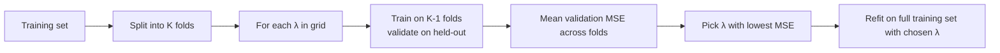

# 4 - Linear Regression, Least Squares, and Regularization

[toc]

> **TL;DR:** Linear regression fits a hyperplane to data by minimizing squared error. The closed-form solution is the *normal equations* $\hat{\mathbf{w}} = (X^\top X)^{-1} X^\top y$, derived in two lines using matrix calculus. With high-dimensional or noisy data, OLS overfits — **ridge** (L2) and **lasso** (L1) regularization shrink coefficients toward zero, trading bias for variance. Both have probabilistic interpretations as MAP estimation under Gaussian and Laplace priors respectively.

## Vocabulary

**Linear regression**

```math
\hat{y} = \mathbf{w}^\top \mathbf{x} + b = \tilde{\mathbf{w}}^\top \tilde{\mathbf{x}}
```

A model that predicts a continuous target as a linear function of features. We absorb the bias $b$ into $\mathbf{w}$ by appending a 1 to $\mathbf{x}$.

---

**Squared loss / mean squared error (MSE)**

```math
\mathcal{L}(\mathbf{w}) = \frac{1}{n}\sum_{i=1}^n (y_i - \mathbf{w}^\top \mathbf{x}_i)^2 = \frac{1}{n}\|y - X\mathbf{w}\|_2^2
```

The standard regression loss. Convex in $\mathbf{w}$, smooth, and has a closed-form minimizer.

---

**Normal equations**

```math
X^\top X \,\hat{\mathbf{w}} = X^\top y
```

First-order optimality condition for OLS. Solving for $\hat{\mathbf{w}}$ gives the unique minimizer (when $X^\top X$ is invertible).

---

**Ordinary least squares (OLS)**

```math
\hat{\mathbf{w}}_\text{OLS} = (X^\top X)^{-1} X^\top y
```

The closed-form OLS estimator.

---

**Ridge regression (L2)**

```math
\hat{\mathbf{w}}_\text{ridge} = \arg\min_\mathbf{w} \|y - X\mathbf{w}\|^2 + \lambda \|\mathbf{w}\|_2^2 = (X^\top X + \lambda I)^{-1} X^\top y
```

OLS plus a penalty on weight magnitude. Always invertible; shrinks all coefficients toward zero.

---

**LASSO (L1)**

```math
\hat{\mathbf{w}}_\text{lasso} = \arg\min_\mathbf{w} \|y - X\mathbf{w}\|^2 + \lambda \|\mathbf{w}\|_1
```

L1 penalty produces *sparse* solutions — many coefficients become exactly zero. No closed form; solved via coordinate descent or proximal methods.

---

**Multicollinearity**

Linear dependence among features. Makes $X^\top X$ singular or ill-conditioned, blows up OLS coefficient variance. Regularization fixes this.

## Intuition

Regression is the first ML problem most people see: given a scatterplot, draw the line that best fits. The "best fit" criterion is squared error, almost universally — because (1) it has a closed-form solution, (2) it corresponds to MLE under Gaussian noise, and (3) the gradient is well-behaved (smooth and convex). Squared error penalizes large deviations more than small ones, which makes the fit sensitive to outliers but mathematically convenient.

The most striking thing about least-squares regression is that you can write the optimum in closed form: $\hat{\mathbf{w}} = (X^\top X)^{-1} X^\top y$. No iterative optimizer needed — just one matrix inversion (or, in practice, one linear solve). This is unique to linear models with squared loss; even logistic regression doesn't have a closed form. The reason is that the loss is a convex *quadratic* in $\mathbf{w}$, and quadratic minima are found by setting the gradient to zero, which gives a linear equation.

Regularization is the half of the chapter that took the field decades to fully appreciate. OLS gives the *unbiased* minimum-variance estimator under the Gauss-Markov assumptions, but unbiased doesn't mean *good* — a high-variance unbiased estimator can be wildly worse than a slightly biased lower-variance one in MSE. Ridge and lasso embrace this trade: introduce bias by penalizing weight size, gain variance reduction that more than compensates. Modern ML defaults to "regularize by default"; pure OLS is rare in practice.

## Deriving the normal equations

Loss in matrix form:

```math
\mathcal{L}(\mathbf{w}) = (y - X\mathbf{w})^\top (y - X\mathbf{w}) = y^\top y - 2 y^\top X \mathbf{w} + \mathbf{w}^\top X^\top X \mathbf{w}
```

Gradient w.r.t. $\mathbf{w}$:

```math
\nabla_\mathbf{w} \mathcal{L} = -2 X^\top y + 2 X^\top X \mathbf{w}
```

Setting to zero:

```math
X^\top X \mathbf{w} = X^\top y \quad \Rightarrow \quad \hat{\mathbf{w}} = (X^\top X)^{-1} X^\top y
```

(Assuming $X^\top X$ is invertible — see "Drawbacks" below for when it isn't.)

The Hessian $\nabla^2 \mathcal{L} = 2 X^\top X$ is positive semidefinite, so the critical point is a minimum (uniquely, when $X^\top X$ is PD).

## Geometric view — projection

Predictions $\hat{y} = X \hat{\mathbf{w}}$ are the *orthogonal projection* of $y$ onto the column space of $X$:

```math
\hat{y} = X (X^\top X)^{-1} X^\top y = H y
```

where $H$ is the **hat matrix** (idempotent, $H^2 = H$). The residual $y - \hat{y}$ is orthogonal to every column of $X$. This is the same projection machinery from [Linear Algebra Essentials](../1-foundations/5-linear-algebra-essentials.md).

```mermaid
flowchart LR
  Y[Target vector y] --> PROJ[Project onto col(X)]
  PROJ --> YHAT[Fit ŷ = Hy]
  Y --> RES[Residual r = y - ŷ]
  YHAT -.-> ORTH["orthogonal to col(X)"]
  RES -.-> ORTH
```

## Probabilistic interpretation — MLE under Gaussian noise

Model:

```math
y_i = \mathbf{w}^\top \mathbf{x}_i + \epsilon_i, \quad \epsilon_i \sim \mathcal{N}(0, \sigma^2)
```

Likelihood:

```math
P(y \mid X, \mathbf{w}) = \prod_i \mathcal{N}(y_i; \mathbf{w}^\top \mathbf{x}_i, \sigma^2)
```

Log-likelihood:

```math
\log P(y \mid X, \mathbf{w}) = -\frac{n}{2}\log(2\pi\sigma^2) - \frac{1}{2\sigma^2}\sum_i (y_i - \mathbf{w}^\top \mathbf{x}_i)^2
```

Maximizing the log-likelihood is equivalent to minimizing the squared error — *exactly* OLS. So least-squares is MLE under Gaussian-noise linear models. This is the connection to [Estimation](../1-foundations/3-estimation-and-mle.md).

## Implementation

```python
import numpy as np

class LinearRegression:
    def fit(self, X: np.ndarray, y: np.ndarray) -> "LinearRegression":
        """Solve the normal equations. Uses solve, not inv, for numerical stability."""
        n, d = X.shape
        Xb = np.hstack([X, np.ones((n, 1))])    # append 1 for the bias
        # (X^T X) w = X^T y  ->  use solve to avoid forming the inverse
        self.coef_ = np.linalg.solve(Xb.T @ Xb, Xb.T @ y)
        return self

    def predict(self, X: np.ndarray) -> np.ndarray:
        Xb = np.hstack([X, np.ones((len(X), 1))])
        return Xb @ self.coef_

# Demo
rng = np.random.default_rng(0)
X = rng.normal(size=(100, 3))
true_w = np.array([1.0, -2.0, 0.5])
y = X @ true_w + 4.0 + 0.5 * rng.normal(size=100)

lr = LinearRegression().fit(X, y)
print("coef:", lr.coef_)
# coef: [ 1.024 -1.987  0.473  4.001]  — close to true_w + bias 4.0
```

## Regularization — ridge and lasso

### Ridge (L2)

```math
\hat{\mathbf{w}}_\text{ridge} = \arg\min_\mathbf{w} \|y - X\mathbf{w}\|^2 + \lambda \|\mathbf{w}\|_2^2
```

Closed form (add $\lambda I$ to $X^\top X$):

```math
\hat{\mathbf{w}}_\text{ridge} = (X^\top X + \lambda I)^{-1} X^\top y
```

Key properties:

- $X^\top X + \lambda I$ is always PD for $\lambda > 0$ → unique solution, even when features are collinear.
- Coefficients shrink toward zero but rarely become exactly zero.
- Equivalent to MAP under Gaussian prior $\mathbf{w} \sim \mathcal{N}(0, \tau^2 I)$ with $\lambda = \sigma^2 / \tau^2$.

### LASSO (L1)

```math
\hat{\mathbf{w}}_\text{lasso} = \arg\min_\mathbf{w} \|y - X\mathbf{w}\|^2 + \lambda \|\mathbf{w}\|_1
```

No closed form (the L1 norm is non-differentiable at zero), but easy to solve numerically with coordinate descent or proximal gradient.

Key property: **sparsity**. The L1 penalty has corners at the axes, so the optimum often sits *at* a corner — many coefficients are exactly zero. Useful for *feature selection*: lasso automatically zeroes out irrelevant features.

```mermaid
flowchart LR
  subgraph ols[OLS feasible: any w]
    direction TB
    O[Find min squared error]
  end
  subgraph ridge_pic[Ridge: w in ball ||w||₂ ≤ R]
    direction TB
    R[L2 ball - sphere with smooth surface]
    R --> RS["Optimum on sphere<br/>(non-axis-aligned, all coords non-zero)"]
  end
  subgraph lasso_pic[LASSO: w in ball ||w||₁ ≤ R]
    direction TB
    L["L1 ball - diamond with sharp corners"]
    L --> LS["Optimum often AT a corner<br/>(many coords exactly zero)"]
  end
```

### Elastic Net

```math
\hat{\mathbf{w}}_\text{EN} = \arg\min_\mathbf{w} \|y - X\mathbf{w}\|^2 + \lambda_1 \|\mathbf{w}\|_1 + \lambda_2 \|\mathbf{w}\|_2^2
```

Combines both penalties — sparsity from L1, stability from L2. Default for many practical pipelines when you want feature selection but ridge-like robustness.

```python
from sklearn.linear_model import Ridge, Lasso, ElasticNet

for name, model in [("OLS",   LinearRegression()),
                    ("Ridge", Ridge(alpha=1.0)),
                    ("Lasso", Lasso(alpha=0.1)),
                    ("ElNet", ElasticNet(alpha=0.1, l1_ratio=0.5))]:
    model.fit(X, y)
    coef = getattr(model, "coef_", None) or model.coef_
    print(f"{name:>6s}: {np.round(coef, 3)}")
```

## When OLS breaks — the drawbacks

### Multicollinearity

When two columns of $X$ are highly correlated, $X^\top X$ is ill-conditioned. The condition number explodes, and tiny changes in $y$ produce wild changes in $\hat{\mathbf{w}}$. Coefficient signs can flip; standard errors balloon.

**Fix**: regularize, or drop the redundant feature.

### High dimensionality ($d > n$)

$X^\top X$ is singular (rank $\le n - 1 < d$). No unique OLS solution.

**Fix**: ridge regression. The "$+\lambda I$" makes the matrix full-rank regardless.

### Outliers

Squared error penalizes large residuals heavily, so a few outliers can drag the fit. Mean is sensitive; median is not.

**Fix**: robust loss functions — Huber loss, quantile regression. Or pre-filter / Winsorize outliers.

### Non-linearity

If the relationship isn't actually linear, no amount of fitting fixes it.

**Fix**: feature engineering (add polynomial terms, log/sqrt transforms), kernels, or move to non-linear models (trees, neural networks).

## Choosing $\lambda$ — cross-validation

Both ridge and lasso depend on $\lambda$. Too small → no regularization; too large → underfit. Pick by **k-fold cross-validation**:



```python
from sklearn.linear_model import RidgeCV
ridge_cv = RidgeCV(alphas=np.logspace(-3, 3, 30), cv=5)
ridge_cv.fit(X, y)
print("best alpha:", ridge_cv.alpha_)
```

## In practice

> [!IMPORTANT]
> Always standardize (zero mean, unit variance) features before applying L1 or L2 regularization. The penalty is on raw coefficient magnitude; on un-standardized features, features with larger numeric scale receive smaller coefficients per unit predictive value and get *less* regularization. Tree-based methods don't need this, but linear methods do.

> [!CAUTION]
> Ridge / lasso are *biased* estimators. The bias is the trade you make for variance reduction. Don't compute "p-values" or hypothesis tests on regularized coefficients without understanding the implications — standard errors and confidence intervals computed assuming OLS are invalid for ridge / lasso.

> [!TIP]
> When you don't know whether to use ridge or lasso, **start with ridge**. It's better-behaved numerically, easier to interpret, and has more theoretical backing. Move to lasso when you specifically need *sparse* solutions (feature selection in addition to regularization).

For very large datasets ($n \gg 10^6$) or streaming data, fit linear regression with **stochastic gradient descent** (`sklearn.linear_model.SGDRegressor`) instead of closed-form normal equations. The closed form requires $O(nd^2 + d^3)$ time; SGD is $O(nd)$ per epoch.

## Pitfalls

- **"Use `np.linalg.inv` for normal equations."** Use `np.linalg.solve` instead. Numerically more stable and twice as fast.
- **"$R^2$ on training data = good fit."** Training $R^2$ rises monotonically with model complexity; it always overestimates true performance. Use held-out $R^2$ or cross-validation.
- **"Lasso = ridge with a sharper penalty."** Both regularize, but with different geometric effects. Lasso produces *sparse* coefficient vectors; ridge produces *small but dense* ones. They're not interchangeable.
- **"Regularization always helps."** With enough data and well-conditioned features, $\lambda \to 0$ recovers OLS. Excess regularization underfits. Cross-validate.
- **"Polynomial features = better fit."** Adding polynomial features makes $X^\top X$ much more ill-conditioned (rapid scale growth across degrees). Standardize aggressively, or use orthogonal polynomial bases.

## Exercises

### Exercise 1 — Derive ridge regression from MAP

Show that ridge regression is the MAP estimate of $\mathbf{w}$ under a zero-mean Gaussian prior and Gaussian observation noise.

#### Solution

Likelihood (Gaussian noise with variance $\sigma^2$):

```math
\log P(y \mid X, \mathbf{w}) = -\frac{1}{2\sigma^2}\|y - X\mathbf{w}\|^2 + \text{const}
```

Prior $\mathbf{w} \sim \mathcal{N}(0, \tau^2 I)$:

```math
\log P(\mathbf{w}) = -\frac{1}{2\tau^2}\|\mathbf{w}\|^2 + \text{const}
```

MAP:

```math
\hat{\mathbf{w}}_\text{MAP} = \arg\max_\mathbf{w}\ \log P(y \mid X, \mathbf{w}) + \log P(\mathbf{w})
                    = \arg\min_\mathbf{w}\ \frac{1}{2\sigma^2}\|y - X\mathbf{w}\|^2 + \frac{1}{2\tau^2}\|\mathbf{w}\|^2
```

Equivalent to minimizing $\|y - X\mathbf{w}\|^2 + (\sigma^2/\tau^2)\|\mathbf{w}\|^2$ — exactly ridge regression with $\lambda = \sigma^2/\tau^2$. Strong prior (small $\tau$) → large $\lambda$ → heavy regularization. The same identity from [Estimation](../1-foundations/3-estimation-and-mle.md).

---

### Exercise 2 — Hat matrix properties

The hat matrix $H = X(X^\top X)^{-1} X^\top$ has many uses. Show that (a) $H$ is symmetric, (b) $H$ is idempotent ($H^2 = H$), (c) $\text{trace}(H) = d$ where $d = $ rank$(X)$.

#### Solution

**(a) Symmetric.** $H^\top = [(X^\top X)^{-1}]^\top X^\top X^\top = \ldots$ Use $(AB)^\top = B^\top A^\top$ and $(A^{-1})^\top = (A^\top)^{-1}$:

```math
H^\top = X[(X^\top X)^{-1}]^\top X^\top = X (X^\top X)^{-1} X^\top = H \ ✓
```

(since $X^\top X$ is symmetric, its inverse is too.)

**(b) Idempotent.**

```math
H^2 = X(X^\top X)^{-1} X^\top \cdot X(X^\top X)^{-1} X^\top = X(X^\top X)^{-1}(X^\top X)(X^\top X)^{-1} X^\top = X(X^\top X)^{-1} X^\top = H \ ✓
```

**(c) Trace.** Use cyclic property:

```math
\text{trace}(H) = \text{trace}\big(X(X^\top X)^{-1} X^\top\big) = \text{trace}\big((X^\top X)^{-1} X^\top X\big) = \text{trace}(I_d) = d
```

The trace of $H$ equals the *effective degrees of freedom* of the fit. For ridge regression $\text{trace}(H_\lambda) < d$ — that's the bias the regularization introduces.

---

### Exercise 3 — Why does lasso produce sparsity but ridge doesn't?

Explain geometrically why L1 regularization produces solutions with many zero coefficients, while L2 produces dense (all-non-zero) ones.

#### Solution

Both regularizers minimize the same loss subject to a constraint on coefficient norm:

- Ridge: $\|\mathbf{w}\|_2 \le R$ — a sphere.
- Lasso: $\|\mathbf{w}\|_1 \le R$ — a diamond / cross-polytope, with vertices on the axes.

The OLS contour lines are ellipses. The constrained optimum is where the smallest ellipse touches the constraint region.

- **For the L2 ball (smooth sphere)**: the touching point is somewhere on the boundary, typically with all coordinates non-zero. The sphere's surface is everywhere "round," so the loss contour can touch it at any angle.

- **For the L1 ball (diamond with sharp corners)**: the corners of the diamond stick out into the loss contour first. The optimal contact point is almost always at a *corner*, where some coordinates are exactly zero. The sharper the corner, the more strongly the optimum prefers it — and in higher dimensions, there are more corners (each axis-aligned coord), so the effect is stronger.

This is the geometric reason for *sparsity*: the L1 ball's geometry makes the optimum lie on a low-dimensional face (axis-aligned), making most components zero.

---

### Exercise 4 — When does ridge equal OLS exactly?

Find $\lambda$ values for which ridge regression's coefficients equal those of OLS exactly (not just approximately).

#### Solution

The ridge solution is

```math
\hat{\mathbf{w}}_\text{ridge} = (X^\top X + \lambda I)^{-1} X^\top y
```

For this to equal $\hat{\mathbf{w}}_\text{OLS} = (X^\top X)^{-1} X^\top y$, we need $\lambda = 0$ — *only*. For any $\lambda > 0$, ridge and OLS differ.

A more interesting variant: when do they *coincide in some directions*? In the eigenbasis of $X^\top X$, the OLS coefficient in direction $\mathbf{v}_i$ (with eigenvalue $\sigma_i^2$) is shrunk by factor $\sigma_i^2 / (\sigma_i^2 + \lambda)$. For directions with $\sigma_i^2 \gg \lambda$, the shrinkage is negligible — ridge and OLS *agree* in those directions. For directions with $\sigma_i^2 \ll \lambda$, ridge shrinks heavily, mostly killing the OLS component. This is why ridge is gentle on well-determined directions and harsh on weakly-determined ones — exactly the right bias to encode.

## Sources

- Ramakrishnan, G. & Nagesh, A. (2011). *CS725: Foundations of Machine Learning — Lecture Notes*. IIT Bombay. §19.
- Hastie, T., Tibshirani, R., & Friedman, J. (2009). *The Elements of Statistical Learning* (2nd ed.). Springer. Ch. 3.
- Tibshirani, R. (1996). *Regression Shrinkage and Selection via the Lasso*. JRSS B.
- Hoerl, A. E. & Kennard, R. W. (1970). *Ridge Regression: Biased Estimation for Nonorthogonal Problems*. Technometrics.
- Zou, H. & Hastie, T. (2005). *Regularization and variable selection via the elastic net*. JRSS B.
- Belsley, D. A., Kuh, E., & Welsch, R. E. (1980). *Regression Diagnostics: Identifying Influential Data and Sources of Collinearity*. Wiley.

## Related

- [Linear Algebra Essentials](../1-foundations/5-linear-algebra-essentials.md)
- [Optimization and KKT](../1-foundations/4-optimization-and-kkt.md)
- [Estimation and Maximum Likelihood](../1-foundations/3-estimation-and-mle.md)
- [5 - Perceptron and Logistic Regression](./5-perceptron-and-logistic-regression.md)
- [6 - SVM and Kernels](./6-svm-and-kernels.md)
- [Feature Selection and Dimensionality Reduction](../3-unsupervised-and-beyond/5-feature-selection-and-dimensionality-reduction.md)
