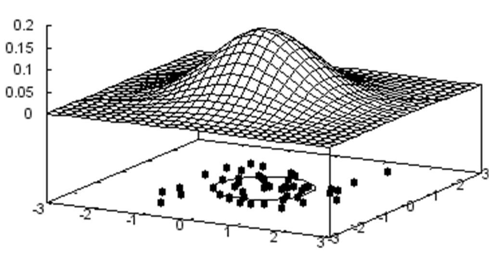
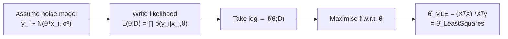

# 2 - Maximum Likelihood Estimation

[toc]

> **TL;DR:** Maximum Likelihood Estimation (MLE) is the unifying probabilistic principle behind least-squares, logistic regression, and most of supervised ML: choose the parameters that make the observed data most probable under your assumed noise model. For Gaussian noise, MLE exactly recovers the least-squares estimate. The log-likelihood form converts products to sums, making both analytic and gradient-based optimisation tractable.

## Vocabulary

**Probabilistic model**: A joint distribution P(y | x, θ) over outputs given inputs and parameters.

**Likelihood function**: The probability of the observed data viewed as a function of the parameter θ — not a distribution over θ.

```math
L(\theta; D) = P(D \mid \theta) = \prod_{i=1}^n p(y_i \mid x_i, \theta)
```

---

**Log-likelihood**: The logarithm of the likelihood. Monotone in L so argmax is unchanged; converts the product to a tractable sum.

```math
\ell(\theta; D) = \log L(\theta; D) = \sum_{i=1}^n \log p(y_i \mid x_i, \theta)
```

---

**Maximum Likelihood Estimator (MLE)**:

```math
\hat{\theta}_{\text{MLE}} = \arg\max_\theta \ell(\theta; D)
```

---

**Negative log-likelihood (NLL)**: The objective minimised in practice (since gradient-based optimisers minimise by default).

```math
\text{NLL}(\theta) = -\ell(\theta; D) = -\sum_{i=1}^n \log p(y_i \mid x_i, \theta)
```

---

**Gaussian noise model** (homoscedastic): Residuals εᵢ = yᵢ − θᵀxᵢ are assumed i.i.d. N(0, σ²).

**KL divergence**: MLE minimises the KL divergence from the empirical data distribution to the model distribution — a deeper justification for why MLE is the right thing to do.

```math
D_{\text{KL}}(p_{\text{data}} \| p_\theta) = \mathbb{E}_{p_{\text{data}}}\left[\log \frac{p_{\text{data}}(y)}{p_\theta(y \mid x)}\right]
```

**Entropy** (Shannon): Measures uncertainty in a distribution. For a Gaussian in d dimensions, H = d/2 · (1 + log(2πσ²)).

## Intuition

You observe data. You have a model with parameters θ. Likelihood answers: "given θ, how probable is *this particular dataset*?" MLE answers: "which θ makes the data most probable?"

The key conceptual shift: the likelihood L(θ; D) has D fixed and θ varying. It is *not* a probability distribution over θ — you cannot meaningfully say "the probability that θ = 3 is 0.4" in the frequentist framework. L is a score, not a probability. The θ that maximises this score is the MLE.

For linear regression with Gaussian noise, this machinery leads straight back to least squares — a remarkable alignment between the geometric minimum-distance criterion and the probabilistic maximum-likelihood criterion.



## How it works

### Step 1 — Specify the noise model

MLE begins by writing down a conditional distribution for the outputs. For regression, the standard choice is i.i.d. Gaussian noise around the linear predictor:

```math
y_i \mid x_i, \theta \sim \mathcal{N}(\theta^\top \tilde{x}_i,\; \sigma^2)
```

Each label is normally distributed with mean equal to the linear prediction and variance σ² (assumed known at this stage). The choice of Gaussian is an assumption about the error structure — it is *not* a constraint on how the features are distributed.

### Step 2 — Write the likelihood

Because the observations are independent given θ, the joint probability of the entire training set factors:

```math
L(\theta; D) = \prod_{i=1}^n \frac{1}{\sqrt{2\pi\sigma^2}} \exp\!\left(-\frac{(y_i - \theta^\top \tilde{x}_i)^2}{2\sigma^2}\right)
```

This is a product of n Gaussian densities, one per training example.

### Step 3 — Take the log

Logs convert products to sums and remove the exponential, giving:

```math
\ell(\theta; D) = -\frac{n}{2}\log(2\pi\sigma^2) - \frac{1}{2\sigma^2}\sum_{i=1}^n (y_i - \theta^\top \tilde{x}_i)^2
```

The first term is a constant with respect to θ. Maximising ℓ over θ is therefore equivalent to minimising:

```math
\sum_{i=1}^n (y_i - \theta^\top \tilde{x}_i)^2 = \|y - X\theta\|_2^2
```

**This is exactly the RSS cost from Note 1.** MLE with Gaussian noise is identical to ordinary least squares.

### Step 4 — Estimate σ² by MLE

After finding θ̂, differentiate ℓ with respect to σ² and set to zero:

```math
\hat{\sigma}^2_{\text{MLE}} = \frac{1}{n}\sum_{i=1}^n (y_i - \hat{\theta}^\top \tilde{x}_i)^2
```

This divides by n, not n−1. The MLE for variance is *biased* (underestimates by a factor of (n−1)/n). The unbiased estimate divides by n−1 (Bessel's correction). In large samples the difference is negligible; in small samples it matters.



## Math

### MLE ≡ Least Squares under Gaussian noise

From Step 3:

```math
\hat{\theta}_{\text{MLE}} = \arg\max_\theta \ell(\theta; D)
= \arg\min_\theta \frac{1}{2\sigma^2}\|y - X\theta\|_2^2
= \arg\min_\theta \|y - X\theta\|_2^2
```

The σ² cancels out, so the MLE for θ is independent of σ². The solution is the normal equations (see Note 1).

### MLE minimises KL divergence

As n → ∞, the MLE converges to the true parameter θ⁰ (under regularity conditions). The deeper reason: maximising the average log-likelihood is equivalent to minimising the KL divergence from the true distribution to the model:

```math
\hat{\theta}_{\text{MLE}} = \arg\min_\theta D_{\text{KL}}\!\left(p_{\text{data}}(y \mid x) \,\Big\|\, p_\theta(y \mid x)\right)
```

This is why MLE is the "right" estimator: it finds the model that is information-theoretically closest to the data-generating process.

### Entropy connection

The log-loss −log p(y|x, θ) is the *cross-entropy* between the true label distribution and the model. NLL = n × cross-entropy. Minimising cross-entropy (pervasive in classification) is MLE applied to categorical output distributions — exactly the same principle.

### Properties of MLE

| Property | Statement |
| :--- | :--- |
| **Consistency** | θ̂_MLE → θ⁰ as n → ∞ (under regularity) |
| **Asymptotic efficiency** | Achieves the Cramér–Rao lower bound asymptotically |
| **Invariance** | MLE of g(θ) is g(θ̂_MLE) for any function g |
| **Bias** | Can be biased in finite samples (e.g., σ̂² divides by n) |

## Real-world example

Fitting a Gaussian noise linear model to California housing data, computing the MLE θ̂ and σ̂², then evaluating the predictive likelihood for new points. This pattern — fit MLE, use plug-in predictive distribution — is the standard workflow for probabilistic regression.

```python
import numpy as np
from sklearn.datasets import fetch_california_housing
from sklearn.preprocessing import StandardScaler
from sklearn.model_selection import train_test_split

# --- Load data ---
data = fetch_california_housing()
X_raw = data.data          # (20640, 8)
y = data.target            # (20640,)  median house values (in $100k)

X_train, X_test, y_train, y_test = train_test_split(
    X_raw, y, test_size=0.2, random_state=0)

# --- Standardise and augment ---
scaler = StandardScaler()
X_tr = np.c_[np.ones(len(X_train)), scaler.fit_transform(X_train)]
X_te = np.c_[np.ones(len(X_test)),  scaler.transform(X_test)]

# --- MLE for θ (= least squares) ---
theta_hat = np.linalg.lstsq(X_tr, y_train, rcond=None)[0]

# --- MLE for σ² ---
residuals = y_train - X_tr @ theta_hat
sigma2_hat_mle   = np.mean(residuals**2)            # biased: divides by n
sigma2_hat_unbias = np.sum(residuals**2) / (len(y_train) - X_tr.shape[1])  # unbiased

print(f"σ²_MLE  (biased)  = {sigma2_hat_mle:.4f}")
print(f"σ²_OLS  (unbiased) = {sigma2_hat_unbias:.4f}")

# --- Plug-in predictive log-likelihood on test set ---
from scipy.stats import norm

y_pred = X_te @ theta_hat
log_likes = norm.logpdf(y_test, loc=y_pred, scale=np.sqrt(sigma2_hat_mle))
print(f"Mean test log-likelihood: {np.mean(log_likes):.4f}")
# Negative = worse; less negative = better model.
```

> [!TIP]
> The mean test log-likelihood (per sample) is the right metric for comparing probabilistic models. Pure MSE ignores the σ̂ term and can mislead when comparing models with different variance estimates.

## In practice

**Gaussian noise is rarely exactly true.** Real regression residuals often show heteroscedasticity (variance depends on x), outliers, or skewness. Yet MLE under Gaussian noise (i.e., OLS) is still a good starting point because:
1. It is the Best Linear Unbiased Estimator (Gauss–Markov theorem) under mild conditions.
2. It is fast and interpretable.
3. It serves as the baseline against which robust methods justify their overhead.

**NLL as a universal training objective.** Nearly every neural network loss function is an NLL under some assumed output distribution: MSE loss = NLL under Gaussian, cross-entropy loss = NLL under Bernoulli or Categorical, Poisson loss = NLL under Poisson. This framing unifies regression and classification losses and makes the choice of loss function a design decision about the noise model.

> [!IMPORTANT]
> MLE for the variance σ̂²_MLE = RSS/n is biased downward. In a regression context this means confidence intervals and prediction intervals will be slightly too narrow. In small-sample settings (n/d < 10), use the unbiased estimator RSS/(n−d−1). Most software uses the unbiased form by default — check your library's documentation.

> [!NOTE]
> The KL-divergence connection to MLE implies that any model misspecification — using a Gaussian noise model when the true noise is Laplace, for example — results in the MLE converging to the best Gaussian approximation to the true distribution, not to the true parameters. This is called a *quasi-MLE* or *pseudo-MLE* in econometrics.

## Pitfalls

- **"Likelihood is a probability distribution over θ."** It is not. L(θ; D) is a function of θ with D fixed. It can be larger than 1 for continuous densities. It does not integrate to 1 over θ.
- **"MLE is always unbiased."** Often not — the MLE for Gaussian variance divides by n, underestimating the true variance. Bias disappears as n → ∞ (consistency), but in finite samples it matters.
- **"Higher likelihood always means a better model."** A model with more parameters always achieves at least as high a training likelihood. Use held-out NLL, AIC, or BIC to penalise model complexity. Raw training likelihood is not a model-comparison metric.
- **"The Gaussian noise assumption is a claim about features."** It is only a claim about the *residuals* yᵢ − θᵀxᵢ. The distribution of xᵢ is irrelevant to the MLE derivation here.
- **"Minimising MSE and maximising log-likelihood are different objectives."** They are identical under Gaussian noise — MSE is just the NLL with constants dropped.

## Exercises

### Exercise 1 — MLE for Bernoulli

Derive the MLE for the parameter p of a Bernoulli distribution from n i.i.d. coin flips with k heads.

#### Solution

Likelihood: L(p; k, n) = pᵏ(1−p)^(n−k)

Log-likelihood: ℓ(p) = k log p + (n − k) log(1 − p)

Differentiate and set to zero:

```math
\frac{d\ell}{dp} = \frac{k}{p} - \frac{n-k}{1-p} = 0 \;\Rightarrow\; k(1-p) = (n-k)p \;\Rightarrow\; \hat{p} = \frac{k}{n}
```

The MLE is the sample proportion — exactly the intuitive estimator.

---

### Exercise 2 — Show that MLE of σ² is biased

Given i.i.d. yᵢ ~ N(μ, σ²) and MLE estimate σ̂² = (1/n) Σ(yᵢ − ȳ)², show that E[σ̂²] = (n−1)/n · σ².

#### Solution

```math
E\!\left[\hat{\sigma}^2\right] = \frac{1}{n} E\!\left[\sum_i (y_i - \bar{y})^2\right]
= \frac{1}{n} \cdot (n-1)\sigma^2 = \frac{n-1}{n}\sigma^2
```

The factor (n−1)/n comes from using the sample mean ȳ (which "uses up" one degree of freedom) rather than the true mean μ. Therefore σ̂² underestimates σ² by a factor of (n−1)/n. The unbiased estimator replaces the (1/n) divisor with 1/(n−1).

---

### Exercise 3 — MLE reduces to least squares

Starting from the Gaussian noise model yᵢ ~ N(θᵀxᵢ, σ²), carry out the full log-likelihood derivation and confirm that θ̂_MLE = (XᵀX)⁻¹Xᵀy.

#### Solution

The log-likelihood is:

```math
\ell(\theta) = -\frac{n}{2}\log(2\pi\sigma^2) - \frac{1}{2\sigma^2}\sum_{i=1}^n (y_i - \theta^\top x_i)^2
```

The first term is constant in θ. Maximising ℓ with respect to θ is equivalent to minimising:

```math
\frac{1}{2\sigma^2}\|y - X\theta\|^2
```

Since σ² > 0 is a constant scalar, this is equivalent to minimising ‖y − Xθ‖². The minimiser is the normal-equations solution θ̂ = (XᵀX)⁻¹Xᵀy, established in Exercise 1 of Note 1.

---

### Exercise 4 — Entropy of Gaussian

Compute the entropy of a univariate Gaussian N(μ, σ²) and explain its dependence on σ.

#### Solution

The entropy is H(X) = −∫ p(x) log p(x) dx. For a Gaussian:

```math
H(X) = \frac{1}{2}\log(2\pi e\,\sigma^2)
```

Entropy depends only on σ, not on μ (shifting the distribution doesn't change its spread). It grows logarithmically with σ. As σ → 0 the Gaussian collapses to a point (zero entropy — no uncertainty). As σ → ∞ the distribution spreads across the real line (maximum uncertainty). In d dimensions the Gaussian entropy is (d/2)log(2πe) + (1/2)log det(Σ).

## Sources

- Nando de Freitas, *Machine Learning Lectures — Oxford University* (2015): Maximum Likelihood (oxf7). https://www.cs.ox.ac.uk/people/nando.defreitas/machinelearning/
- Lindsten, F. et al. (2018). *Statistical Machine Learning: Lecture notes*. Uppsala University. §2.2.
- Murphy, K. P. (2012). *Machine Learning: A Probabilistic Perspective*. MIT Press. Ch. 4, 7.
- Bishop, C. M. (2006). *Pattern Recognition and Machine Learning*. Springer. §1.2, 3.1.
- Cover, T. M. & Thomas, J. A. (2006). *Elements of Information Theory*. Wiley. Ch. 2, 8.

## Related

- [1 - Linear Regression](./1-linear-regression.md)
- [3 - Regularization and Cross-Validation](./3-regularization-and-cross-validation.md)
- [4 - Logistic Regression](./4-logistic-regression.md)
- [3 - Estimation and MLE](../1-foundations/3-estimation-and-mle.md)
