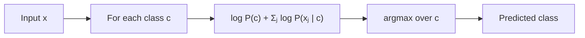

# 2 - Naive Bayes (with Beta, Dirichlet, and Gaussian Priors)

[toc]

> **TL;DR:** Naive Bayes is a *generative* classifier: model $P(\mathbf{x} \mid c)\,P(c)$, then classify by Bayes' rule. The "naive" part is assuming features are independent given the class — almost always wrong, yet often a strong baseline because the *ranking* of class posteriors is robust to the violation. With conjugate priors (Beta for Bernoulli features, Dirichlet for categorical, Gaussian for continuous), the posterior updates have closed forms — parameter estimation collapses to *count, add prior pseudo-counts, divide*.

## Vocabulary

**Generative model**

A model that learns $P(\mathbf{x}, c)$, the joint distribution of features and labels. Classifies via Bayes' rule. Contrast: *discriminative* models that learn $P(c \mid \mathbf{x})$ directly.

---

**Naive Bayes assumption (conditional independence)**

```math
P(\mathbf{x} \mid c) = \prod_{j=1}^d P(x_j \mid c)
```

Features are independent given the class. Reduces a joint over $d$ variables to a product of marginals.

---

**Class prior**

```math
P(c) = \frac{\text{count}(c)}{N}
```

The frequency of class $c$ in training. Often improved with a *prior over priors* — see Dirichlet smoothing below.

---

**Feature likelihood**

```math
P(x_j \mid c)
```

Distribution of feature $j$ given class $c$. Bernoulli, multinomial, or Gaussian depending on feature type.

---

**Conjugate prior**

A prior distribution whose form is preserved under Bayesian update with a given likelihood. Beta is conjugate to Bernoulli; Dirichlet to Categorical/Multinomial; Gaussian to Gaussian (with known variance).

---

**MAP estimate**

```math
\hat{\theta}_\text{MAP} = \arg\max_\theta \log P(D \mid \theta) + \log P(\theta)
```

MLE plus a prior log-term. With conjugate priors this has a closed form in terms of *pseudo-counts*.

---

**Laplace smoothing / additive smoothing**

```math
\hat{p}_j = \frac{\text{count}(j) + \alpha}{N + d\alpha}
```

The MAP estimate under a uniform Dirichlet prior. $\alpha = 1$ is Laplace's rule of succession; $\alpha < 1$ for less smoothing.

## Intuition

Suppose you want to classify emails as spam vs ham. You have a vocabulary of 10,000 words. The features could be: "is word $j$ present?" ($\mathbf{x} \in \{0, 1\}^{10000}$). The honest model is $P(\mathbf{x} \mid \text{spam})$ — a joint distribution over $2^{10000}$ possible word combinations, which you obviously can't estimate from any realistic corpus. The naive assumption collapses this to $\prod_j P(x_j \mid \text{spam})$ — 10,000 separate Bernoulli probabilities. Each one is estimated from a few thousand emails. Suddenly the problem is tractable.

Is the assumption true? Emphatically not — the words "stock" and "market" co-occur more in spam than would be predicted by their independent probabilities. But for *classification*, Naive Bayes only needs the ranking of $P(\mathbf{x} \mid \text{spam})\,P(\text{spam})$ vs $P(\mathbf{x} \mid \text{ham})\,P(\text{ham})$ to be right, not the absolute values. The ranking turns out to be robust to the independence violation in many real problems, which is why Naive Bayes consistently shows up as a *strong baseline*: 10 lines of code, 80% of the accuracy of complex methods.

Conjugate priors are the elegant punchline. Under a Beta prior on a Bernoulli parameter, the posterior is also Beta — with parameters that are *just sums of prior and data*. There's no integral to evaluate, no MCMC, no variational approximation. Add prior pseudo-counts to observed counts, normalize, done. This is why Laplace smoothing (`count + 1`) is everywhere in text classification — it's the MAP estimate under a flat prior.

## The Naive Bayes classifier

```math
\hat{c} = \arg\max_c P(c \mid \mathbf{x}) = \arg\max_c P(\mathbf{x} \mid c)\,P(c)
```

Under conditional independence:

```math
\hat{c} = \arg\max_c P(c) \prod_{j=1}^d P(x_j \mid c)
```

In log space (always — see [Estimation](../1-foundations/3-estimation-and-mle.md)):

```math
\hat{c} = \arg\max_c \log P(c) + \sum_{j=1}^d \log P(x_j \mid c)
```



## Three flavors by feature type

### Bernoulli Naive Bayes (binary features)

```math
P(x_j \mid c) = p_{jc}^{x_j} (1 - p_{jc})^{1-x_j}
```

Parameters $p_{jc} = P(x_j = 1 \mid c)$. MLE:

```math
\hat{p}_{jc}^{\text{MLE}} = \frac{\#\{i : x_{ij} = 1, y_i = c\}}{\#\{i : y_i = c\}}
```

**With Beta prior** $\text{Beta}(\alpha, \beta)$ (the Bayesian flavor):

```math
\hat{p}_{jc}^{\text{MAP}} = \frac{\#\{i : x_{ij} = 1, y_i = c\} + \alpha - 1}{\#\{i : y_i = c\} + \alpha + \beta - 2}
```

The Beta prior is *conjugate* to Bernoulli — the posterior is itself $\text{Beta}(\alpha + k, \beta + n - k)$, where $k$ is the count of 1s in $n$ trials.

### Multinomial Naive Bayes (counts)

For word counts $x_j \in \{0, 1, 2, \ldots\}$:

```math
P(\mathbf{x} \mid c) \propto \prod_j p_{jc}^{x_j}
```

Parameters $p_{jc}$ form a probability simplex per class: $\sum_j p_{jc} = 1$.

**With Dirichlet prior** $\text{Dir}(\boldsymbol{\alpha})$ (smoothing parameter $\alpha$ per word):

```math
\hat{p}_{jc} = \frac{\sum_i x_{ij}\,\mathbb{1}[y_i = c] + \alpha}{\sum_{j'} \sum_i x_{ij'}\,\mathbb{1}[y_i = c] + V\alpha}
```

where $V$ is vocabulary size. Setting $\alpha = 1$ is **Laplace smoothing**. $\alpha = 0.5$ is *Jeffreys' prior*. Tuned smaller $\alpha$ ($10^{-3}$ to $1$) is typical for text classification.

### Gaussian Naive Bayes (continuous features)

```math
P(x_j \mid c) = \frac{1}{\sqrt{2\pi\sigma_{jc}^2}} \exp\!\left(-\frac{(x_j - \mu_{jc})^2}{2\sigma_{jc}^2}\right)
```

Estimate per-class, per-feature mean and variance from training data:

```math
\hat{\mu}_{jc} = \frac{1}{n_c} \sum_{i : y_i = c} x_{ij}, \qquad
\hat{\sigma}_{jc}^2 = \frac{1}{n_c} \sum_{i : y_i = c} (x_{ij} - \hat{\mu}_{jc})^2
```

This is the *diagonal-covariance* special case of Gaussian Discriminant Analysis — see [GDA](./3-gaussian-discriminant-analysis.md) for the full covariance treatment.

## Conjugate-prior cheatsheet

```mermaid
flowchart TB
  subgraph bp[Beta-Bernoulli]
    BP1["Prior: Beta(α, β)"]
    BP2["Likelihood: k successes / n trials"]
    BP3["Posterior: Beta(α + k, β + n - k)"]
    BP1 --> BP2 --> BP3
  end
  subgraph dm[Dirichlet-Multinomial]
    DM1["Prior: Dir(α₁,…,α_K)"]
    DM2["Likelihood: counts c₁,…,c_K"]
    DM3["Posterior: Dir(α₁ + c₁, …, α_K + c_K)"]
    DM1 --> DM2 --> DM3
  end
  subgraph gg[Gaussian-Gaussian (known σ²)]
    GG1["Prior: N(μ₀, σ₀²)"]
    GG2["Likelihood: x̄ from n samples"]
    GG3["Posterior: N(μ_n, σ_n²) with weighted-avg μ_n"]
    GG1 --> GG2 --> GG3
  end
```

## Implementation — full Naive Bayes from scratch

```python
import numpy as np

class GaussianNaiveBayes:
    def fit(self, X: np.ndarray, y: np.ndarray) -> "GaussianNaiveBayes":
        self.classes_ = np.unique(y)
        K, d = len(self.classes_), X.shape[1]
        self.mu_  = np.zeros((K, d))
        self.var_ = np.zeros((K, d))
        self.log_prior_ = np.zeros(K)
        for k, c in enumerate(self.classes_):
            Xc = X[y == c]
            self.mu_[k]  = Xc.mean(axis=0)
            self.var_[k] = Xc.var(axis=0) + 1e-9        # numerical safety
            self.log_prior_[k] = np.log(len(Xc) / len(y))
        return self

    def predict_log_proba(self, X: np.ndarray) -> np.ndarray:
        n, d = X.shape
        K = len(self.classes_)
        log_p = np.zeros((n, K))
        for k in range(K):
            diff = X - self.mu_[k]
            ll = -0.5 * (d * np.log(2 * np.pi) + np.log(self.var_[k]).sum()
                         + (diff**2 / self.var_[k]).sum(axis=1))
            log_p[:, k] = self.log_prior_[k] + ll
        # Normalize for proper log-probabilities (logsumexp trick)
        from scipy.special import logsumexp
        log_p -= logsumexp(log_p, axis=1, keepdims=True)
        return log_p

    def predict(self, X: np.ndarray) -> np.ndarray:
        return self.classes_[np.argmax(self.predict_log_proba(X), axis=1)]
```

The whole classifier is 30 lines. Multinomial / Bernoulli variants follow the same skeleton — only the per-feature likelihood and prior change.

## Worked example — spam classification with Multinomial NB

```python
from sklearn.feature_extraction.text import CountVectorizer
from sklearn.naive_bayes import MultinomialNB

texts = ["free pills now", "meeting tomorrow at 9",
         "win money click here", "lunch tomorrow?",
         "buy cheap viagra", "team standup at 10"]
labels = [1, 0, 1, 0, 1, 0]              # 1 = spam, 0 = ham

vec = CountVectorizer()
X = vec.fit_transform(texts)             # word-count matrix
clf = MultinomialNB(alpha=1.0)           # Laplace smoothing
clf.fit(X, labels)

test = vec.transform(["click here for free money"])
print("P(spam | test) =", clf.predict_proba(test)[0, 1])   # ~0.97
```

For text classification with bag-of-words features, Multinomial Naive Bayes is the default baseline — fast to train, fast to predict, surprisingly hard to beat without much more complex methods.

## The Beta-Bernoulli "rule of succession"

A classical thought experiment: you observe $k$ successes in $n$ trials and want to estimate the success probability. MLE gives $k/n$. But what if $n = 0$ (no data) or $k = 0$ (all failures)? MLE answers 0 or 1, with no recognition of uncertainty.

Beta prior $\text{Beta}(1, 1)$ (uniform) gives MAP estimate $(k + 0)/(n + 0) = k/n$ — same as MLE. The *posterior mean* is more conservative:

```math
\mathbb{E}[p \mid D] = \frac{k + 1}{n + 2}
```

For $n = 0$, this gives $1/2$ — "I have no information, guess 50/50." For $k = 0, n = 100$, it gives $1/102$ — "rare event, but not impossible." This is **Laplace's rule of succession**, and it's why the smoothing trick `count + 1` shows up in countless ML implementations.

## In practice

> [!TIP]
> Naive Bayes is the *first* baseline to try on any classification problem. Five minutes of work for a number you'll later compare every more-complex method against. If your fancy model can't beat Naive Bayes by a meaningful margin, the fancy model isn't earning its complexity.

> [!IMPORTANT]
> The conditional-independence assumption isn't always benign. NB is *severely* biased toward classes whose feature counts add up to more — because the product of probabilities grows quickly. For very long documents this skews predictions; common fix: convert raw counts to TF-IDF features before running Multinomial NB, or use **complement Naive Bayes**, which trains on "what the *other* class looks like" — more robust to class imbalance.

> [!CAUTION]
> Probabilities from Naive Bayes are *not calibrated*. The model produces over-confident probabilities (often very near 0 or 1) because multiplying many small numbers compounds the bias. If you need actual probability estimates, calibrate with Platt scaling or isotonic regression on held-out data.

For modern text classification, NB has been mostly superseded by logistic regression on TF-IDF or, for high accuracy, by transformer encoders. But on small datasets (< 1000 examples), low-resource languages, or as a fast baseline in pipelines, NB is still everywhere.

## Pitfalls

- **"NB doesn't need much data."** True relative to other methods; not true absolutely. With $V$ vocabulary words and $K$ classes you have $VK$ parameters, and per-class data must be sufficient to estimate each.
- **"Zero counts give zero probability."** Yes, and zero × anything = zero, so a single unseen word kills the prediction. *Always* smooth — Laplace ($\alpha = 1$) is the safe default.
- **"Naive Bayes is calibrated."** It is not. Outputs are wildly over-confident; treat them as scores for ranking, not probabilities.
- **"Multinomial NB works on continuous features."** It doesn't — feature counts must be non-negative integers (or non-negative reals representing weighted counts, like TF-IDF). For continuous features use Gaussian NB.
- **"Two correlated features = use NB."** NB assumes *independence*; if features are strongly correlated, the model over-counts evidence. Remove redundancies (or use a model that handles correlation, like logistic regression or GDA).

## Exercises

### Exercise 1 — Laplace smoothing in spam classification

A spam classifier has seen the word "lottery" 0 times in 500 ham emails and 20 times in 100 spam emails. (a) MLE for $P(\text{lottery present} \mid \text{ham})$ and $P(\text{lottery present} \mid \text{spam})$. (b) With $\alpha = 1$ Laplace smoothing, recompute. (c) Why does this matter?

#### Solution

**(a)** MLE:

```math
P(\text{lottery} \mid \text{ham})_\text{MLE} = 0/500 = 0
```

```math
P(\text{lottery} \mid \text{spam})_\text{MLE} = 20/100 = 0.2
```

**(b)** With Laplace ($\alpha = 1$, treating "present / not present" as 2 categories — so add $\alpha$ to numerator and $2\alpha$ to denominator):

```math
P(\text{lottery} \mid \text{ham})_\text{MAP} = (0 + 1)/(500 + 2) = 1/502 \approx 0.002
```

```math
P(\text{lottery} \mid \text{spam})_\text{MAP} = (20 + 1)/(100 + 2) = 21/102 \approx 0.206
```

**(c)** Without smoothing, the moment the model sees "lottery" in a test email it computes $P(\text{ham} \mid \mathbf{x}) = 0$ regardless of any other words — multiplying by zero in the product. So a single unseen word destroys all evidence from other words. With smoothing, "lottery" contributes a *small* boost toward spam (~100×: 0.206 / 0.002), as it should, but doesn't completely override other features. Laplace smoothing is the standard fix for the zero-frequency problem in any Naive Bayes implementation.

---

### Exercise 2 — Derive the Beta-Bernoulli posterior

Given a Beta prior $\text{Beta}(\alpha, \beta)$ on $p$ and $n$ iid Bernoulli observations with $k$ successes, derive the posterior.

#### Solution

Prior:

```math
P(p) = \frac{p^{\alpha-1}(1-p)^{\beta-1}}{B(\alpha, \beta)}
```

Likelihood:

```math
P(D \mid p) = p^k (1-p)^{n-k}
```

Posterior (Bayes' rule, dropping the constant $1/B(\alpha, \beta)$ and the denominator $P(D)$):

```math
P(p \mid D) \propto p^{\alpha + k - 1}(1-p)^{\beta + n - k - 1}
```

This is the kernel of $\text{Beta}(\alpha + k, \beta + n - k)$. Conjugacy: the posterior has the same functional form as the prior, with updated parameters. The new mean is $(\alpha + k)/(\alpha + \beta + n)$ — the "data" counts add directly to the prior pseudo-counts.

---

### Exercise 3 — Naive Bayes on continuous features

A 1D dataset has class 0 with $\mu_0 = 0, \sigma_0 = 1$ and class 1 with $\mu_1 = 2, \sigma_1 = 1$, equal priors. Where is the Gaussian-NB decision boundary?

#### Solution

The decision boundary is where the posterior log-odds is zero:

```math
\log \frac{P(c=0 \mid x)}{P(c=1 \mid x)} = \log \frac{P(c=0)}{P(c=1)} + \log \frac{P(x \mid c=0)}{P(x \mid c=1)} = 0
```

With equal priors the first term is zero. The second:

```math
\log \frac{P(x \mid c=0)}{P(x \mid c=1)} = -\frac{(x-0)^2}{2 \cdot 1^2} + \frac{(x-2)^2}{2 \cdot 1^2}
       = \frac{(x-2)^2 - x^2}{2} = \frac{-4x + 4}{2} = -2x + 2
```

Setting to zero: $-2x + 2 = 0 \Rightarrow x = 1$. The midpoint, as you'd expect for two Gaussians with equal variance. (If variances differ, the decision boundary becomes quadratic — see [GDA](./3-gaussian-discriminant-analysis.md).)

---

### Exercise 4 — When NB fails

Give a concrete dataset structure (in words, not numbers) where Naive Bayes is guaranteed to produce a poor classifier.

#### Solution

**XOR-structured data** — class label depends on the *interaction* of two features. Concrete example: $x_1, x_2 \in \{0, 1\}$, class = $x_1 \oplus x_2$. The marginal probability of class 1 given $x_1 = 1$ is exactly $0.5$ (because half the time $x_2 = 0$ giving class 1, and half the time $x_2 = 1$ giving class 0). Similarly for $x_2$ alone. NB sees both features as uninformative per-class and predicts the class prior every time — 50% accuracy on a deterministically labeled dataset.

Why: NB factorizes $P(\mathbf{x} \mid c) = \prod_j P(x_j \mid c)$, which encodes *no* interaction information. The class depends purely on $P(x_1 \mid c)$ and $P(x_2 \mid c)$, neither of which differs across classes for XOR.

**Mitigations**: feature engineering (add $x_1 \cdot x_2$ as a feature; NB will now use it), or switch to a model that can express interactions (decision trees, logistic regression with interactions, neural networks).

## Sources

- Ramakrishnan, G. & Nagesh, A. (2011). *CS725: Foundations of Machine Learning — Lecture Notes*. IIT Bombay. §10.
- McCallum, A. & Nigam, K. (1998). *A Comparison of Event Models for Naive Bayes Text Classification*. AAAI.
- Rennie, J. et al. (2003). *Tackling the Poor Assumptions of Naive Bayes Text Classifiers* (Complement NB). ICML.
- Bishop, C. M. (2006). *Pattern Recognition and Machine Learning*. Springer. Ch. 2.
- Murphy, K. P. (2012). *Machine Learning: A Probabilistic Perspective*. MIT Press. Ch. 3.

## Related

- [Probability Primer](../1-foundations/2-probability-primer.md)
- [Estimation and Maximum Likelihood](../1-foundations/3-estimation-and-mle.md)
- [1 - Decision Trees](./1-decision-trees.md)
- [3 - Gaussian Discriminant Analysis](./3-gaussian-discriminant-analysis.md)
- [5 - Perceptron and Logistic Regression](./5-perceptron-and-logistic-regression.md)
- [Maximum Entropy and Graphical Models](../3-unsupervised-and-beyond/4-maximum-entropy-and-graphical-models.md)
