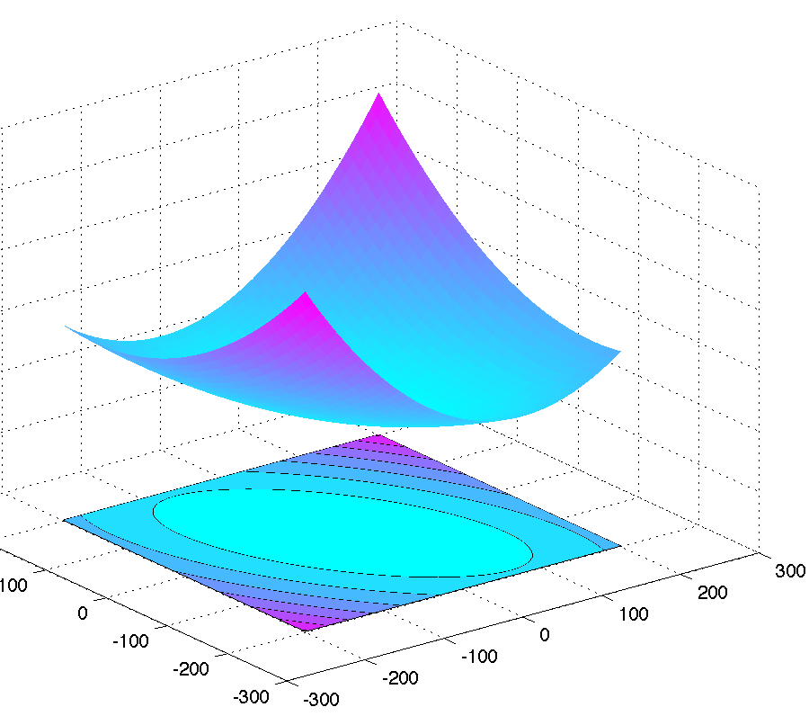
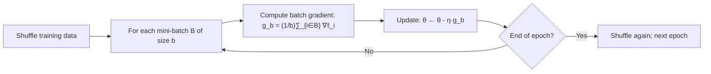
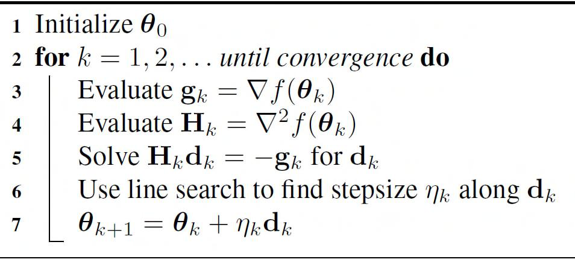

# 5 - Optimization for ML

[toc]

> **TL;DR:** Every ML training problem is an optimisation problem — find the parameters θ that minimise a loss function J(θ). Gradient descent descends the loss surface by following the negative gradient; Newton's method uses curvature information (the Hessian) to take a more direct path. SGD sub-samples the gradient to scale to large datasets. Understanding convergence rates, step-size selection, and the role of momentum and curvature separates practitioners who tune blindly from those who reason about what their optimiser is doing.

## Vocabulary

**Gradient** (∇J): Vector of partial derivatives; points in the direction of steepest ascent. Negative gradient is the descent direction.

```math
\nabla_\theta J = \left[\frac{\partial J}{\partial \theta_1},\, \frac{\partial J}{\partial \theta_2},\, \ldots,\, \frac{\partial J}{\partial \theta_d}\right]^\top
```

---

**Hessian** (H): Matrix of second-order partial derivatives. Captures curvature — how the gradient changes direction.

```math
H_{ij} = \frac{\partial^2 J}{\partial \theta_i \partial \theta_j}, \quad H \in \mathbb{R}^{d \times d}
```

---

**Learning rate / step size** (η): Scalar that controls how far to move along the gradient direction per step.

**Convergence rate**: How quickly the iterates approach the minimum. Gradient descent on strongly convex objectives converges at rate O(ρᵏ) with ρ < 1 (linear / geometric convergence).

**Epoch**: One full pass over the training dataset. SGD makes n parameter updates per epoch; batch gradient descent makes one.

**Mini-batch**: A random subset of b examples (b = 32–512 typical) used to approximate the full gradient. Bridges batch GD and pure SGD.

**Momentum** (β): Accumulates a velocity vector across steps, smoothing oscillations and accelerating convergence in ravine-shaped loss surfaces.

**Polyak averaging**: Maintains a running average of iterates θ̄ = (1/T) Σₜ θᵗ. Theoretically optimal for non-smooth objectives; used in practice via exponential moving averages.

**Line search**: An adaptive strategy that finds the step size η* along the gradient direction that minimises J(θ − η·g). Makes convergence more robust but adds cost.

**Convex function**: J(θ) is convex if J(λθ₁ + (1−λ)θ₂) ≤ λJ(θ₁) + (1−λ)J(θ₂) for all θ₁, θ₂, λ ∈ [0,1]. Convexity guarantees that local minima are global.

## Intuition

Picture the loss function as a hilly landscape. You are blindfolded and want to reach the valley. Gradient descent says: check which direction is downhill (the negative gradient), take a small step, repeat. The step size η is how big a step. Too large and you might overshoot the valley and climb the other side; too small and you converge agonisingly slowly.

Newton's method says: instead of just checking the slope, also check the *curvature* (how fast the slope changes). In a steep, narrow canyon, curvature tells you the canyon width — you can adjust your step to go straight to the bottom rather than bouncing off the walls.

SGD says: it's too expensive to measure the full gradient (walking the entire landscape), so randomly sample a few points and use their average gradient as an approximation. This introduces noise but allows us to take many more steps per unit time.

## How it works

### Batch gradient descent

In offline (batch) learning, the cost function sums over all n examples. The gradient is computed exactly and a step is taken:

```math
\theta^{(t+1)} = \theta^{(t)} - \eta^{(t)} \nabla_\theta J(\theta^{(t)})
= \theta^{(t)} - \frac{\eta^{(t)}}{n}\sum_{i=1}^n \nabla_\theta \ell(\theta^{(t)}; x_i, y_i)
```

Each step costs O(nd) — one pass over all n examples. For linear regression, the gradient is the exact closed-form expression from Note 1: ∇J = −2Xᵀ(y − Xθ).

> [!TIP]
> Use Armijo backtracking line search when you don't want to tune η manually: start with η = 1, halve it until J(θ − η·g) < J(θ) − c·η·‖g‖² (the sufficient decrease condition, c ≈ 1e-4). This requires only a few extra forward passes and eliminates much of the hyperparameter-tuning burden.

### Choosing the step size

The Lipschitz constant of the gradient, L (such that ‖∇J(θ) − ∇J(θ')‖ ≤ L‖θ − θ'‖), bounds the safe learning rate. For convergence, η ≤ 1/L. For linear regression, L = 2‖XᵀX‖ (the largest eigenvalue of 2XᵀX), so η_max = 1/(2‖XᵀX‖₂).

In practice, tune η on a log-scale (1e-4, 1e-3, 1e-2, 0.1, 1.0) and monitor the training loss. A good η produces a smoothly decreasing loss; a bad η produces oscillation (too large) or imperceptible progress (too small).



### Newton's method

Newton's method uses a second-order (quadratic) approximation to J around θᵏ:

```math
J(\theta) \approx J(\theta^{(t)}) + \nabla J^\top(\theta - \theta^{(t)}) + \frac{1}{2}(\theta - \theta^{(t)})^\top H^{(t)} (\theta - \theta^{(t)})
```

Minimising this quadratic w.r.t. θ gives the Newton step:

```math
\theta^{(t+1)} = \theta^{(t)} - H^{(t)^{-1}} \nabla J(\theta^{(t)})
```

Newton's method has *quadratic* local convergence near the minimum (the error squares at each step), versus *linear* convergence for gradient descent. The cost is forming and inverting H — O(d²) storage and O(d³) per step — making it impractical for d ≫ 10³.

For linear regression, the Hessian H = 2XᵀX is constant, so Newton's method converges in a *single step*: θ^(1) = θ^(0) − (2XᵀX)⁻¹(−2Xᵀ(y − Xθ^(0))) = (XᵀX)⁻¹Xᵀy = θ̂. This is just the normal equations.

### Stochastic gradient descent (SGD)

In the stochastic setting, the gradient is approximated using a single randomly drawn example (or mini-batch of size b):

```math
\theta^{(t+1)} = \theta^{(t)} - \eta_t \nabla_\theta \ell(\theta^{(t)}; x_{i_t}, y_{i_t})
```

Each step costs O(d) rather than O(nd). The stochastic gradient is an *unbiased* estimator of the full gradient:

```math
\mathbb{E}_{i \sim \text{Uniform}(\{1,\ldots,n\})}\left[\nabla_\theta \ell(\theta; x_i, y_i)\right] = \nabla_\theta J(\theta)
```

The variance of the stochastic gradient causes the iterates to fluctuate near the minimum rather than converging exactly. Decaying η_t → 0 at rate 1/√t (Robbins-Monro conditions) ensures convergence for non-convex objectives; a fixed η gives a stationary distribution around the minimum.



### Momentum

Gradient descent on a loss surface with different curvature along different directions oscillates. Momentum adds a velocity vector v that accumulates past gradients, smoothing the trajectory:

```math
v^{(t+1)} = \beta v^{(t)} + \eta \nabla J(\theta^{(t)})
```

```math
\theta^{(t+1)} = \theta^{(t)} - v^{(t+1)}
```

The momentum parameter β ∈ [0, 1) controls how much of the previous velocity is retained (β = 0.9 is typical). In directions where the gradient consistently points the same way (the ravine floor), velocity accumulates and descent accelerates. In directions that oscillate, opposing gradients cancel.



### AdaGrad and adaptive methods

AdaGrad maintains per-parameter cumulative squared gradients G and uses these to scale the learning rate for each coordinate:

```math
G^{(t)}_j = G^{(t-1)}_j + \left(\nabla J_j^{(t)}\right)^2
```

```math
\theta^{(t+1)}_j = \theta^{(t)}_j - \frac{\eta}{\sqrt{G^{(t)}_j + \epsilon}} \cdot \nabla J_j^{(t)}
```

Parameters that receive large gradients (frequent features) get a smaller effective learning rate; rare features get a larger rate. Adam (not covered here) adds a first-moment estimate and bias correction, making it the most common choice in deep learning.

## Math

### Convergence of gradient descent (convex case)

For a convex differentiable J with L-Lipschitz gradient and η = 1/L:

```math
J(\theta^{(T)}) - J(\theta^*) \leq \frac{L\|\theta^{(0)} - \theta^*\|^2}{2T}
```

Convergence rate O(1/T) — linear in iterations, or ε-accuracy in O(1/ε) steps.

For strongly convex J (H ≽ μI for μ > 0), with η = 1/L:

```math
\|\theta^{(T)} - \theta^*\|^2 \leq \left(1 - \frac{\mu}{L}\right)^T \|\theta^{(0)} - \theta^*\|^2
```

Geometric convergence with rate ρ = 1 − μ/L < 1. The *condition number* κ = L/μ controls convergence speed — poorly conditioned problems (large κ) converge slowly. This is why feature standardisation helps: it reduces the condition number of XᵀX.

### Newton's method: quadratic convergence

Near the minimiser θ*, Newton's method satisfies:

```math
\|\theta^{(t+1)} - \theta^*\| \leq C \|\theta^{(t)} - \theta^*\|^2
```

For some constant C that depends on third derivatives. The number of digits of accuracy *doubles* at each step — superb if you're already near the optimum, but Newton can diverge if started far away (region of attraction is typically local).

### SGD variance and the noise floor

The mini-batch gradient variance is σ²_g / b where σ²_g is the per-example gradient variance and b is the batch size. The noise floor on J is proportional to η · σ²_g / b. To halve the noise: either halve η (slows convergence) or double b (doubles cost per step but halves noise — linear scaling rule).

## Real-world example

Fitting linear regression by both batch gradient descent and SGD with decaying learning rate, comparing convergence behaviour on a moderate-size dataset.

```python
import numpy as np
from sklearn.datasets import make_regression
from sklearn.preprocessing import StandardScaler

rng = np.random.default_rng(7)
n, d = 2000, 20
X_raw, y = make_regression(n_samples=n, n_features=d, noise=10.0, random_state=7)
scaler = StandardScaler()
X = np.c_[np.ones(n), scaler.fit_transform(X_raw)]   # (2000, 21)

def mse(X: np.ndarray, y: np.ndarray, theta: np.ndarray) -> float:
    return float(np.mean((y - X @ theta)**2))

# ----------------------------------------------------------------
# Batch gradient descent
# ----------------------------------------------------------------
def batch_gd(
    X: np.ndarray, y: np.ndarray, lr: float = 0.05, n_iter: int = 300
) -> tuple[np.ndarray, list[float]]:
    theta = np.zeros(X.shape[1])
    history: list[float] = []
    for _ in range(n_iter):
        grad = X.T @ (X @ theta - y) / len(y)   # ∇J / n
        theta = theta - lr * grad
        history.append(mse(X, y, theta))
    return theta, history

# ----------------------------------------------------------------
# Mini-batch SGD with 1/√t decay
# ----------------------------------------------------------------
def mini_sgd(
    X: np.ndarray, y: np.ndarray,
    lr0: float = 0.1, batch: int = 64, n_epochs: int = 20
) -> tuple[np.ndarray, list[float]]:
    theta = np.zeros(X.shape[1])
    history: list[float] = []
    t = 1
    for _ in range(n_epochs):
        idx = rng.permutation(len(y))
        for start in range(0, len(y), batch):
            b = idx[start:start + batch]
            xb, yb = X[b], y[b]
            grad = xb.T @ (xb @ theta - yb) / len(b)
            lr_t = lr0 / np.sqrt(t)
            theta = theta - lr_t * grad
            t += 1
        history.append(mse(X, y, theta))
    return theta, history

theta_bgd, hist_bgd = batch_gd(X, y)
theta_sgd, hist_sgd = mini_sgd(X, y)

print(f"Batch GD final MSE:    {hist_bgd[-1]:.4f}")
print(f"Mini-batch SGD MSE:    {hist_sgd[-1]:.4f}")
```

> [!WARNING]
> A learning rate that works for batch gradient descent will generally be too large for SGD. The noise in the stochastic gradient amplifies oscillations at large η. As a rule of thumb, η_SGD ≈ η_BGD / √b where b is the batch size — scale the learning rate down by the square root of the batch size when switching from full batch to mini-batch.

## In practice

**L-BFGS for small/medium problems.** When d ≤ 10⁶ and the loss is smooth (logistic regression, linear regression, shallow models), L-BFGS converges in 10–100 iterations vs thousands for SGD. Scikit-learn defaults to L-BFGS for logistic regression. It uses only the last m ≈ 10 gradient vectors to approximate H⁻¹, requiring O(md) memory.

**Adam in deep learning.** Deep networks have non-convex, non-smooth objectives. Adam (Adaptive Moment Estimation) adaptively scales per-parameter learning rates using first and second moment estimates of the gradient. It is robust to hyperparameter choices and dominates deep learning practice. But Adam does not converge to flat minima as reliably as SGD with momentum on overparameterised networks — a known subtlety in the convergence literature.

> [!TIP]
> Always monitor the training loss curve, not just final accuracy. A loss that decreases smoothly indicates a good learning rate. Oscillations around a fixed value suggest η too large; perfectly flat loss from the start suggests η too small or a vanishing gradient. These visual diagnostics save hours of hyperparameter search.

> [!CAUTION]
> When using SGD, the order in which training examples are visited matters. Never feed examples in class-sorted order (e.g., all positives then all negatives) without shuffling — the gradient estimates will be systematically biased for many epochs and convergence will stall. Always shuffle at the start of each epoch.

## Pitfalls

- **"Gradient descent always converges."** Only for convex, smooth objectives with an appropriate learning rate. Non-convex objectives (neural networks) have saddle points, local minima, and plateaus. GD may converge to a saddle point or a poor local minimum. In practice, the implicit regularisation of SGD and the overparameterisation of deep networks often makes this less severe than theory suggests.
- **"Newton's method is always better than gradient descent."** Newton's method needs O(d³) per step and requires the Hessian to be positive definite. For large d, it is completely impractical. For non-convex objectives, the Hessian may be indefinite and the Newton step can point uphill.
- **"Larger batches are always better for SGD."** Larger batches reduce gradient variance but require higher learning rates (or more epochs) to compensate. Empirically, there is a "critical batch size" beyond which increasing b provides diminishing returns — and some evidence that smaller batches find flatter minima with better generalisation.
- **"Momentum always helps."** Momentum requires tuning β; incorrect β can cause the iterates to overshoot the minimum and oscillate. Nesterov momentum (NAG) is theoretically superior and should be preferred in practice.

## Exercises

### Exercise 1 — Gradient of least squares

Compute ∇_θ J(θ) where J(θ) = (1/n)‖y − Xθ‖² and show it equals (2/n)Xᵀ(Xθ − y).

#### Solution

```math
J(\theta) = \frac{1}{n}(y - X\theta)^\top(y - X\theta)
= \frac{1}{n}\left(y^\top y - 2\theta^\top X^\top y + \theta^\top X^\top X\theta\right)
```

Gradient using ∇(aᵀθ) = a and ∇(θᵀBθ) = 2Bθ for symmetric B:

```math
\nabla_\theta J = \frac{1}{n}\left(-2X^\top y + 2X^\top X\theta\right) = \frac{2}{n}X^\top(X\theta - y)
```

---

### Exercise 2 — Newton's method converges in one step for linear regression

Show that if J(θ) = ‖y − Xθ‖² and we start at θ^(0) = 0, Newton's method gives θ^(1) = (XᵀX)⁻¹Xᵀy = θ̂_OLS.

#### Solution

H = 2XᵀX (constant), g^(0) = −2Xᵀ(y − X·0) = −2Xᵀy.

Newton step:

```math
\theta^{(1)} = \theta^{(0)} - H^{-1}g^{(0)} = 0 - (2X^\top X)^{-1}(-2X^\top y) = (X^\top X)^{-1}X^\top y = \hat{\theta}
```

For quadratic objectives, Newton's method is exact in one step because the second-order Taylor expansion of a quadratic is the quadratic itself — no higher-order terms are neglected.

---

### Exercise 3 — Learning rate bounds

For J(θ) = ‖y − Xθ‖²/n, find the maximum stable learning rate for gradient descent in terms of the eigenvalues of XᵀX.

#### Solution

J is a quadratic with Hessian H = (2/n)XᵀX. The Lipschitz constant of the gradient is L = ‖H‖₂ = (2/n)λ_max(XᵀX) where λ_max is the largest eigenvalue of XᵀX. The safe learning rate bound is:

```math
\eta \leq \frac{1}{L} = \frac{n}{2\lambda_{\max}(X^\top X)}
```

If features are not standardised, one feature with large variance (large eigenvalue) can dominate λ_max and force η to be tiny, slowing convergence on all features. Standardising X shrinks all eigenvalues of XᵀX toward 1, allowing a larger η and faster convergence.

---

### Exercise 4 — SGD as noisy gradient descent

Explain why the stochastic gradient ĝ = ∇ℓ(θ; xᵢ, yᵢ) is an unbiased estimator of the full gradient, and describe the effect of the noise on convergence.

#### Solution

If i is drawn uniformly from {1, …, n}:

```math
\mathbb{E}_i[\nabla_\theta \ell(\theta; x_i, y_i)] = \frac{1}{n}\sum_{i=1}^n \nabla_\theta \ell(\theta; x_i, y_i) = \nabla_\theta J(\theta)
```

Unbiasedness means SGD moves in the right direction *on average*, but the individual steps have variance σ²_g. The variance causes two effects:
1. **Near the minimum**, the noise prevents exact convergence: the iterates fluctuate in a ball of radius O(η·σ_g) around θ*. Decaying η_t → 0 eliminates this noise floor but slows convergence.
2. **In deep networks**, the noise acts as implicit regularisation: the stochastic trajectory explores the loss landscape and avoids sharp minima, biasing toward flatter minima that generalise better (Keskar et al., 2017).

## Sources

- Nando de Freitas, *Machine Learning Lectures — Oxford University* (2015): Optimization (oxf9). https://www.cs.ox.ac.uk/people/nando.defreitas/machinelearning/
- Lindsten, F. et al. (2018). *Statistical Machine Learning: Lecture notes*. Uppsala University. Appendix B.
- Nocedal, J. & Wright, S. J. (2006). *Numerical Optimization* (2nd ed.). Springer. Ch. 3, 6.
- Bottou, L., Curtis, F. E. & Nocedal, J. (2018). Optimization methods for large-scale machine learning. *SIAM Review* 60(2), 223–311.
- Duchi, J., Hazan, E. & Singer, Y. (2011). Adaptive subgradient methods for online learning. *JMLR* 12, 2121–2159.

## Related

- [1 - Linear Regression](./1-linear-regression.md)
- [4 - Logistic Regression](./4-logistic-regression.md)
- [4 - Optimization and KKT](../1-foundations/4-optimization-and-kkt.md)
