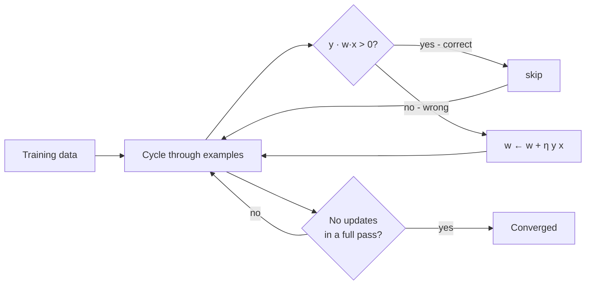
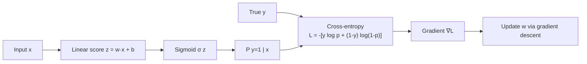
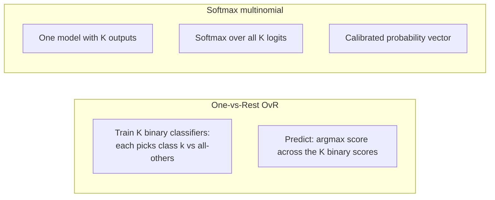

# 5 - Perceptron and Logistic Regression

[toc]

> **TL;DR:** The *perceptron* (1958) is the original linear classifier — a single-layer neuron that updates its weight vector by the *perceptron rule* whenever it misclassifies. *Logistic regression* is its probabilistic descendant: same linear function, but squashed through a sigmoid to produce $P(y = 1 \mid \mathbf{x})$. Logistic regression is the workhorse discriminative classifier — it has a convex loss, calibrated probabilities, and generalizes naturally to multiclass via *softmax*. Both are special cases of *generalized linear models*.

## Vocabulary

**Perceptron**

A linear classifier $\hat{y} = \text{sign}(\mathbf{w}^\top \mathbf{x} + b)$. Trained by the *perceptron update rule*; converges in finite steps iff the data is linearly separable.

---

**Linear separability**

Data $(\mathbf{x}_i, y_i)$ with $y_i \in \{-1, +1\}$ is linearly separable if there exist $\mathbf{w}, b$ such that $y_i(\mathbf{w}^\top \mathbf{x}_i + b) > 0$ for all $i$.

---

**Margin**

```math
\gamma = \min_i y_i(\mathbf{w}^\top \mathbf{x}_i + b)/\|\mathbf{w}\|
```

The minimum (signed) distance from any training point to the decision boundary.

---

**Sigmoid (logistic function)**

```math
\sigma(z) = \frac{1}{1 + e^{-z}}, \quad \sigma'(z) = \sigma(z)(1 - \sigma(z))
```

Squashes $\mathbb{R}$ to $(0, 1)$. The link function of logistic regression.

---

**Logistic regression**

```math
P(y = 1 \mid \mathbf{x}) = \sigma(\mathbf{w}^\top \mathbf{x} + b)
```

Linear in the *log-odds*; sigmoid of the linear score.

---

**Cross-entropy loss (binary)**

```math
\mathcal{L}(\mathbf{w}) = -\sum_i \big[y_i \log p_i + (1 - y_i) \log(1 - p_i)\big], \quad p_i = \sigma(\mathbf{w}^\top \mathbf{x}_i)
```

The natural loss for logistic regression — equivalent to the negative log-likelihood. Convex in $\mathbf{w}$.

---

**Softmax**

```math
p_k = \frac{e^{z_k}}{\sum_j e^{z_j}}, \quad z = W \mathbf{x} + \mathbf{b}
```

Multiclass generalization of the sigmoid. Outputs a probability vector summing to 1.

---

**Generalized Linear Model (GLM)**

A family of models of the form $g(\mathbb{E}[y \mid \mathbf{x}]) = \mathbf{w}^\top \mathbf{x}$, where $g$ is a *link function*. Linear regression (identity link), logistic regression (logit link), Poisson regression (log link), etc.

## Intuition

The perceptron is the historical starting point of neural-network research and the conceptual ancestor of every linear classifier. Rosenblatt (1958) proposed it as a simplified neuron: take a weighted sum of inputs, fire if it exceeds a threshold, adjust the weights when you're wrong. The convergence proof — guaranteed termination on linearly separable data — was a stunning early result. Minsky and Papert (1969) then showed the perceptron's limitations (can't learn XOR), causing a famous AI-winter setback. Modern reincarnations resolve this by stacking perceptrons (deep networks) or projecting to richer feature spaces (kernels in SVMs).

Logistic regression is the perceptron grown up. Same linear function $\mathbf{w}^\top \mathbf{x}$, but instead of a hard threshold, you squash it through a sigmoid to get a probability. This single change is enormous: now the loss (cross-entropy) is convex and smooth, you can use gradient descent reliably, and you get *calibrated* probabilities instead of just labels. Multiclass extends via softmax. Logistic regression is the single most-used classifier in industry — fast, interpretable, robust, calibrated, and a strong baseline you'll compare every fancier model against.

GLMs unify them. Linear regression ($y$ continuous, identity link), logistic regression (binary $y$, logit link), Poisson regression (count $y$, log link), and many others differ only in their link function. The optimization, statistics, and software are all the same. Recognizing this generality is half the battle — once you've coded logistic regression, the others are nearly free.

## The perceptron

### Model

```math
\hat{y} = \text{sign}(\mathbf{w}^\top \mathbf{x} + b)
```

### Update rule

For each training example $(\mathbf{x}_i, y_i)$ with $y_i \in \{-1, +1\}$:

```math
\text{if } y_i (\mathbf{w}^\top \mathbf{x}_i + b) \le 0: \quad \mathbf{w} \leftarrow \mathbf{w} + \eta\, y_i\, \mathbf{x}_i, \quad b \leftarrow b + \eta\, y_i
```

Only update when the current prediction is wrong (or on the margin). $\eta$ is the learning rate; for the perceptron it's typically fixed at 1.

### Convergence theorem (Novikoff)

If the data is linearly separable with margin $\gamma$ and $\|\mathbf{x}_i\| \le R$, the perceptron makes at most $(R/\gamma)^2$ mistakes — finite, independent of dataset size.



```python
import numpy as np

class Perceptron:
    def __init__(self, lr: float = 1.0, max_epochs: int = 100) -> None:
        self.lr, self.max_epochs = lr, max_epochs

    def fit(self, X: np.ndarray, y: np.ndarray) -> "Perceptron":
        """y in {-1, +1}."""
        n, d = X.shape
        self.w = np.zeros(d)
        self.b = 0.0
        for _ in range(self.max_epochs):
            n_updates = 0
            for i in range(n):
                if y[i] * (self.w @ X[i] + self.b) <= 0:
                    self.w += self.lr * y[i] * X[i]
                    self.b += self.lr * y[i]
                    n_updates += 1
            if n_updates == 0:
                break
        return self

    def predict(self, X: np.ndarray) -> np.ndarray:
        return np.sign(X @ self.w + self.b)
```

### Issues with the perceptron

1. **Only works on linearly separable data.** Non-separable data → infinite loop (no convergence).
2. **Output is just a label, no probability.** Can't say "60% confident."
3. **No unique solution.** Many separating hyperplanes exist; the perceptron picks whichever it stumbles into first. SVM fixes this by picking the *maximum-margin* one.
4. **Updates are full-step (size $\eta\|\mathbf{x}\|$).** No regularization, no smooth loss.

The perceptron is a stepping-stone, not the final answer. But it's instructive: every modern linear classifier inherits from it.

## Logistic regression

### Model

```math
P(y = 1 \mid \mathbf{x}) = \sigma(\mathbf{w}^\top \mathbf{x} + b) = \frac{1}{1 + e^{-(\mathbf{w}^\top \mathbf{x} + b)}}
```

Equivalently, the *log-odds* (logit) are linear:

```math
\log \frac{P(y=1 \mid \mathbf{x})}{P(y=0 \mid \mathbf{x})} = \mathbf{w}^\top \mathbf{x} + b
```

### Loss — cross-entropy / negative log-likelihood

For binary targets $y_i \in \{0, 1\}$:

```math
\mathcal{L}(\mathbf{w}) = -\sum_i \big[y_i \log p_i + (1-y_i)\log(1-p_i)\big]
```

where $p_i = \sigma(\mathbf{w}^\top \mathbf{x}_i)$. This is exactly the negative log-likelihood under a Bernoulli model. **Convex** in $\mathbf{w}$ (the Hessian is PSD), so gradient descent finds the global optimum.

### Gradient

```math
\nabla_\mathbf{w} \mathcal{L} = \sum_i (p_i - y_i) \mathbf{x}_i = X^\top (\mathbf{p} - \mathbf{y})
```

Simple, almost identical in form to linear regression's gradient. The "$p_i - y_i$" is the *error*; the update direction is the error-weighted sum of inputs.



### Newton's method — second-order optimization

The Hessian of cross-entropy:

```math
H = X^\top D X, \quad D = \text{diag}(p_i (1 - p_i))
```

PSD; usually PD when classes are well-separated. Newton update:

```math
\mathbf{w} \leftarrow \mathbf{w} - H^{-1} \nabla \mathcal{L}
```

This is **Iteratively Reweighted Least Squares (IRLS)** — the classical algorithm for fitting GLMs. Converges in fewer iterations than gradient descent (typically 5–20) at $O(nd^2)$ per step.

### Regularized logistic regression

```math
\mathcal{L}_\text{reg}(\mathbf{w}) = \mathcal{L}(\mathbf{w}) + \lambda \|\mathbf{w}\|^2 \quad \text{(L2)}
```

```math
\mathcal{L}_\text{reg}(\mathbf{w}) = \mathcal{L}(\mathbf{w}) + \lambda \|\mathbf{w}\|_1 \quad \text{(L1)}
```

Equivalent to MAP with Gaussian / Laplace prior, just like [ridge / lasso for regression](./4-linear-regression.md). L2 is the standard default.

### Implementation

```python
import numpy as np

def sigmoid(z: np.ndarray) -> np.ndarray:
    return 1.0 / (1.0 + np.exp(-z))

class LogisticRegression:
    def __init__(self, lr: float = 0.1, lam: float = 0.01, n_iter: int = 1000) -> None:
        self.lr, self.lam, self.n_iter = lr, lam, n_iter

    def fit(self, X: np.ndarray, y: np.ndarray) -> "LogisticRegression":
        n, d = X.shape
        self.w = np.zeros(d)
        self.b = 0.0
        for _ in range(self.n_iter):
            p = sigmoid(X @ self.w + self.b)
            grad_w = X.T @ (p - y) / n + 2 * self.lam * self.w
            grad_b = (p - y).mean()
            self.w -= self.lr * grad_w
            self.b -= self.lr * grad_b
        return self

    def predict_proba(self, X: np.ndarray) -> np.ndarray:
        return sigmoid(X @ self.w + self.b)

    def predict(self, X: np.ndarray) -> np.ndarray:
        return (self.predict_proba(X) >= 0.5).astype(int)
```

## Multiclass: softmax

For $K$ classes, $\mathbf{z} = W\mathbf{x} + \mathbf{b} \in \mathbb{R}^K$. Softmax converts to probabilities:

```math
P(y = k \mid \mathbf{x}) = \frac{e^{z_k}}{\sum_{j=1}^K e^{z_j}}
```

Loss is multiclass cross-entropy / negative log-likelihood:

```math
\mathcal{L} = -\sum_i \log P(y_i \mid \mathbf{x}_i) = -\sum_i \log \frac{e^{z_{y_i}}}{\sum_j e^{z_j}}
```

Gradient is again simple:

```math
\nabla_{W_k} \mathcal{L} = \sum_i (p_{ik} - \mathbb{1}[y_i = k]) \mathbf{x}_i
```

The "softmax + cross-entropy" pair is the standard last layer in every modern multiclass neural network — its gradient is numerically clean and lets the model output calibrated probabilities.

### Handling multiclass — one-vs-rest vs softmax

Two equally-popular approaches:



OvR is simple, parallelizable, but doesn't produce a true probability distribution (scores can be uncalibrated relative to each other). Softmax is the principled choice when you want probabilities. Both are available in `sklearn.linear_model.LogisticRegression` via `multi_class='ovr'` vs `'multinomial'`.

## Least squares as a classifier — and why it's bad

The PDF mentions trying *linear regression* directly for classification: encode $y \in \{0, 1\}$ as $\{-1, +1\}$ and minimize squared error. Why this fails:

1. **Sensitive to outliers far from the boundary.** A correctly-classified point at $\mathbf{w}^\top \mathbf{x} = +10$ contributes huge squared loss because the target is $+1$. The model tries to drag the boundary to fit it, distorting the boundary elsewhere.
2. **Bad for multiclass.** With $K > 2$ classes, you'd need one-hot encoding and would face the "masking effect" — middle classes are squeezed out.
3. **Non-probabilistic output.** No interpretable score.

Logistic regression's sigmoid + cross-entropy fixes all three: bounded output, robust to confident-correct examples, calibrated probabilities, multiclass via softmax.

## In practice

> [!IMPORTANT]
> Logistic regression is the *strongest baseline* for tabular classification problems. Before reaching for XGBoost, random forests, or neural nets, fit a logistic regression with L2 regularization. If it's within a few points of your fancy model on validation, ship the logistic regression — it's simpler, faster, more interpretable, and easier to debug.

> [!TIP]
> **Always inspect logistic regression coefficients on standardized features.** Each $w_j$ tells you how strongly feature $j$ moves the log-odds per standard deviation. This is the cleanest interpretability story in classical ML. Tree models and neural networks don't offer this so cleanly.

> [!CAUTION]
> For class-imbalanced problems, the default 0.5 threshold is rarely right. Tune the *threshold* on validation data after fitting. Logistic regression's outputs are calibrated probabilities (unlike SVM scores or perceptron outputs), so threshold-tuning is principled — you're picking the operating point on the ROC curve that matches your cost ratio.

A trickier production reality: logistic regression's *coefficients* are interpretable only when features are roughly independent. With correlated features, multiple coefficients change together and individual values lose meaning. Use partial-dependence plots or SHAP values for honest interpretation in correlated-feature regimes.

## Pitfalls

- **"Perceptron always converges."** Only on linearly separable data. On non-separable data it cycles forever.
- **"Logistic regression outputs are probabilities."** They're *calibrated* only if the model is correctly specified. On real data, expect ~5–15% calibration error; re-calibrate with Platt scaling or isotonic regression if you need precise probabilities.
- **"Multiclass logistic regression with K classes needs K weight vectors."** Technically $K$ if you don't impose constraints, but only $K - 1$ are identifiable (you can fix one class as reference). Most libraries fit $K$ for convenience.
- **"Cross-entropy and log-loss are different."** They're the same loss with different names: binary cross-entropy = log-loss = negative log-likelihood. Different communities use different terms.
- **"Use accuracy to evaluate logistic regression."** Accuracy ignores the probabilities the model is actually trained to estimate. Use log-loss (negative log-likelihood) or AUC for proper evaluation.

## Exercises

### Exercise 1 — Derive the logistic-regression gradient

Starting from the negative log-likelihood

```math
\mathcal{L}(\mathbf{w}) = -\sum_i \big[y_i \log \sigma(z_i) + (1 - y_i) \log(1 - \sigma(z_i))\big], \quad z_i = \mathbf{w}^\top \mathbf{x}_i
```

show that $\nabla_\mathbf{w} \mathcal{L} = \sum_i (\sigma(z_i) - y_i) \mathbf{x}_i$.

#### Solution

Use $\sigma'(z) = \sigma(z)(1 - \sigma(z))$. Per-example:

```math
\frac{\partial \ell_i}{\partial z_i} = -\frac{y_i \sigma'(z_i)}{\sigma(z_i)} + \frac{(1-y_i)\sigma'(z_i)}{1 - \sigma(z_i)}
                                       = \frac{\sigma'(z_i)(-y_i(1-\sigma(z_i)) + (1-y_i)\sigma(z_i))}{\sigma(z_i)(1 - \sigma(z_i))}
                                       = \frac{\sigma'(z_i)(\sigma(z_i) - y_i)}{\sigma(z_i)(1 - \sigma(z_i))}
                                       = \sigma(z_i) - y_i
```

(using $\sigma'(z_i) = \sigma(z_i)(1 - \sigma(z_i))$ which cancels the denominator). So

```math
\nabla_\mathbf{w} \mathcal{L} = \sum_i \frac{\partial \ell_i}{\partial z_i}\, \frac{\partial z_i}{\partial \mathbf{w}} = \sum_i (\sigma(z_i) - y_i) \mathbf{x}_i
```

Simple, clean, and identical in form to linear regression's gradient with $(p_i - y_i)$ playing the role of residual.

---

### Exercise 2 — Why is least-squares classification bad?

Use a 1D example with classes $y \in \{-1, +1\}$ to show that least-squares classification is dragged by points far from the boundary.

#### Solution

Suppose two classes: 90 points at $x = -1$ with $y = -1$, 10 points at $x = +10$ with $y = +1$.

OLS estimate of $y$ from $x$:

```math
\hat{w} = \frac{\sum (x_i - \bar{x})(y_i - \bar{y})}{\sum (x_i - \bar{x})^2}
```

The mean of $x$ is $\bar{x} = (90(-1) + 10(10))/100 = 0.1$. The high-$x$ points are far from $\bar{x}$ and have $y - \bar{y}$ large, so they dominate the numerator. OLS pulls the regression line steeply through the (+10, +1) cluster, and the implied decision threshold ($\hat{y} = 0$) sits *far to the right* of where it should — many class -1 points (which should sit clearly below the boundary) are now misclassified.

Logistic regression doesn't have this problem because the sigmoid saturates at large $|z|$: a correctly-classified point at $z = 10$ produces $p \approx 1$ with vanishing gradient — it stops influencing the fit. OLS, in contrast, makes its contribution grow *quadratically* with $z$, distorting everything.

---

### Exercise 3 — Multiclass with softmax

Three classes, features $\mathbf{x} = (1, 2)$, learned weights $W \in \mathbb{R}^{3 \times 2}$:

```math
W = \begin{pmatrix} 0 & 1 \\ 1 & 0 \\ 1 & 1 \end{pmatrix}
```

Compute the softmax probabilities.

#### Solution

Logits: $\mathbf{z} = W\mathbf{x} = (2, 1, 3)^\top$.

Softmax (subtract max for numerical stability): $\mathbf{z}' = (-1, -2, 0)$.

```math
e^{\mathbf{z}'} = (0.368, 0.135, 1.000), \quad \text{sum} = 1.503
```

```math
\mathbf{p} = (0.244, 0.090, 0.665)
```

Class 3 is the predicted class (highest probability). The softmax always picks the class with the largest logit (`argmax` invariance under shifting).

---

### Exercise 4 — Class-imbalance threshold tuning

Your fraud-detection model outputs $P(\text{fraud})$. Frauds are 1% of training. The default threshold 0.5 catches almost no frauds. (a) Why? (b) How would you pick a better threshold?

#### Solution

**(a)** With 1% prevalence, the model's *prior* is heavily skewed toward "not fraud." Most input features that *could* indicate fraud only push the probability from, say, 0.01 to 0.3. Only the very rare highest-signal cases push it above 0.5. So very few cases get classified as fraud at threshold 0.5, even though many *are* fraud — high false-negative rate, low recall.

**(b)** Tune the threshold on a validation set:

1. **Cost-aware threshold**: if a missed fraud costs $C_{\text{FN}}$ and a false alarm costs $C_{\text{FP}}$, the optimal threshold minimizing expected cost is

```math
\tau^* = \frac{C_\text{FP}}{C_\text{FP} + C_\text{FN}}
```

For $C_{\text{FN}} \gg C_{\text{FP}}$ (a missed fraud is much costlier), $\tau^*$ is small — e.g., 0.05.

2. **Precision–recall trade**: pick the threshold that hits your business recall target while minimizing false alarms. Sweep $\tau$ from 0 to 1, plot the precision–recall curve, choose the operating point.

3. **F-beta score**: pick $\tau$ maximizing $F_\beta$ with $\beta > 1$ to weight recall more heavily for imbalanced classes.

Don't touch the model — just the threshold. The probabilities are calibrated (or close to it), so the threshold is the right knob.

## Sources

- Ramakrishnan, G. & Nagesh, A. (2011). *CS725: Foundations of Machine Learning — Lecture Notes*. IIT Bombay. §18, §20.
- Rosenblatt, F. (1958). *The Perceptron: A Probabilistic Model for Information Storage and Organization in the Brain*. Psychological Review.
- Minsky, M. & Papert, S. (1969). *Perceptrons*. MIT Press.
- Novikoff, A. B. J. (1962). *On Convergence Proofs for Perceptrons*. Symp. Math. Theory of Automata.
- Hastie, T., Tibshirani, R., & Friedman, J. (2009). *The Elements of Statistical Learning* (2nd ed.). Springer. Ch. 4.
- Bishop, C. M. (2006). *Pattern Recognition and Machine Learning*. Springer. Ch. 4.
- McCullagh, P. & Nelder, J. A. (1989). *Generalized Linear Models* (2nd ed.). Chapman & Hall.

## Related

- [Optimization and KKT](../1-foundations/4-optimization-and-kkt.md)
- [Estimation and Maximum Likelihood](../1-foundations/3-estimation-and-mle.md)
- [Naive Bayes](./2-naive-bayes.md)
- [Gaussian Discriminant Analysis](./3-gaussian-discriminant-analysis.md)
- [Linear Regression](./4-linear-regression.md)
- [SVM and Kernels](./6-svm-and-kernels.md)
- [Maximum Entropy and Graphical Models](../3-unsupervised-and-beyond/4-maximum-entropy-and-graphical-models.md)
