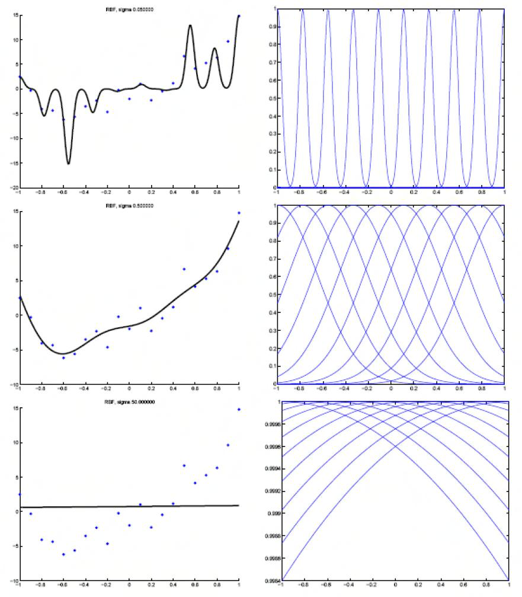
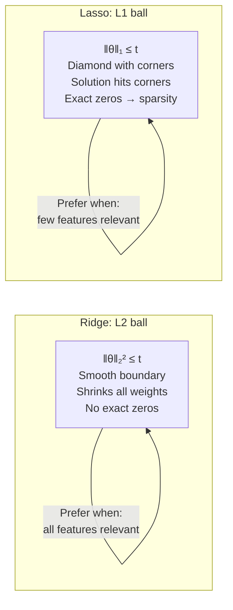
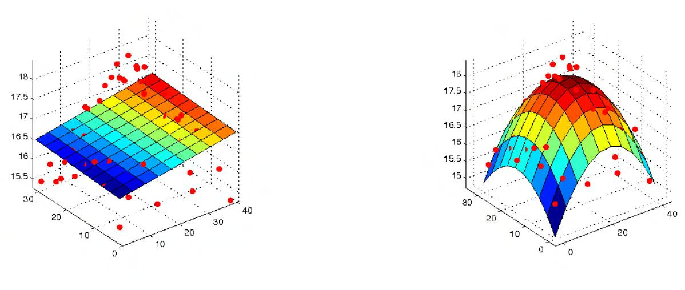
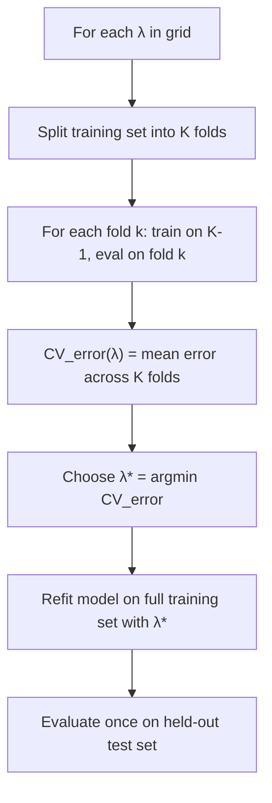

# 3 - Regularization and Cross-Validation

[toc]

> **TL;DR:** Overfitting is what happens when a model learns the noise in the training data rather than the underlying signal — it fits the training set perfectly but generalises poorly. Ridge regression (L2) and lasso (L1) shrink the weights toward zero, trading a small increase in bias for a large reduction in variance. Cross-validation is the empirical method for selecting the regularisation strength λ (and any other hyperparameter) without touching held-out test data.

## Vocabulary

**Overfitting**: A model that captures noise in the training data. Characterised by low training error and high test error.

**Underfitting**: A model that lacks the capacity to capture the signal. High training error and high test error.

**Bias**: Systematic error from model assumptions. A too-simple model is biased away from the truth.

```math
\text{bias}(\hat{f}(x)) = \mathbb{E}[\hat{f}(x)] - f^*(x)
```

---

**Variance**: Error from sensitivity to the particular training set drawn. A too-complex model fits noise and varies wildly across datasets.

```math
\text{variance}(\hat{f}(x)) = \mathbb{E}\!\left[(\hat{f}(x) - \mathbb{E}[\hat{f}(x)])^2\right]
```

---

**Bias-variance decomposition**: The expected test MSE decomposes into irreducible noise, squared bias, and variance.

```math
\mathbb{E}[(y - \hat{f}(x))^2] = \sigma^2_\epsilon + \text{bias}^2 + \text{variance}
```

---

**Ridge regression** (L2 regularisation): Add a squared-weight penalty to RSS.

```math
J_{\text{ridge}}(\theta) = \|y - X\theta\|_2^2 + \lambda\|\theta\|_2^2
```

---

**Lasso regression** (L1 regularisation): Add an absolute-weight penalty. Induces sparsity.

```math
J_{\text{lasso}}(\theta) = \|y - X\theta\|_2^2 + \lambda\|\theta\|_1
```

---

**Regularisation path**: The set of solutions θ̂(λ) as λ varies from 0 (OLS) to ∞ (all weights zero).

**Hyperparameter**: A parameter that controls model complexity and is *not* learned by minimising the training loss — λ is the canonical example.

**K-fold cross-validation**: Split data into K disjoint folds; train on K−1 folds, test on the remaining fold; rotate and average. Provides an unbiased estimate of generalisation error.

**Basis function** / **feature map**: A nonlinear mapping φ: ℝᵈ → ℝᵐ that lifts inputs to a richer representation. The linear model θᵀφ(x) can model nonlinear relationships.

## Intuition

Imagine fitting a polynomial to n data points. A degree-n−1 polynomial passes through every point exactly — zero training error — yet predicts wildly between points. This is overfitting. A degree-1 polynomial (a line) cannot fit a curved pattern — this is underfitting. The right degree is somewhere in the middle.

Regularisation is the algebraic lever for this tradeoff. By penalising large weights, ridge regression pulls all coefficients toward zero, smoothing out the fit. The penalty trades a little bias (the optimal θ is no longer exactly the OLS solution) for lower variance (weights can't grow large to fit noise).

The bias-variance tradeoff is not unique to polynomials — it applies to every parameterised model family. Cross-validation is the practical tool for finding the sweet spot without peeking at test data.



## How it works

### Ridge regression derivation

Start from the OLS cost J(θ) = ‖y − Xθ‖² and add a penalty proportional to the squared ℓ₂ norm of the weights. The constant λ ≥ 0 controls how hard the penalty bites.

```math
J_{\text{ridge}}(\theta) = \|y - X\theta\|_2^2 + \lambda\|\theta\|_2^2
```

Differentiating and setting to zero yields a modified normal equation that is *always* invertible (for λ > 0):

```math
(X^\top X + \lambda I)\hat{\theta}_{\text{ridge}} = X^\top y
\;\Rightarrow\;
\hat{\theta}_{\text{ridge}} = (X^\top X + \lambda I)^{-1}X^\top y
```

Adding λI to XᵀX shifts all eigenvalues up by λ, guaranteeing positive definiteness. This makes ridge regression well-defined even when XᵀX is singular (e.g., n < d or collinear features).

> [!IMPORTANT]
> The bias term θ₀ should *not* be regularised — shrinking the intercept toward zero forces the prediction to pass through the origin, which is almost always wrong. In practice, centre the labels (subtract ȳ) before fitting and exclude the bias column from the penalty. Most ML libraries implement this automatically with a `fit_intercept=True` flag.

### Ridge as constrained optimisation

Ridge regression is equivalent to the constrained problem:

```math
\min_\theta \|y - X\theta\|_2^2 \quad \text{subject to} \quad \|\theta\|_2^2 \leq t(\lambda)
```

As λ increases, the constraint budget t(λ) shrinks and all θ components are pushed toward zero. At λ = 0, the constraint is inactive and OLS is recovered.

### Lasso regression and sparsity

Lasso replaces the ℓ₂ penalty with an ℓ₁ penalty. Unlike the smooth ridge penalty, the ℓ₁ penalty has a kink at zero — the optimal solution often hits zero exactly for some components, producing **sparse** weight vectors. Features with zero weight are effectively selected out.

The lasso cost has no closed-form solution; iterative methods (coordinate descent, ISTA/FISTA) are required. The constrained form is:

```math
\min_\theta \|y - X\theta\|_2^2 \quad \text{subject to} \quad \|\theta\|_1 \leq t(\lambda)
```

The ℓ₁ ball (a diamond in 2D) has corners on the coordinate axes. The RSS contour first hits the ball at a corner — which sits on an axis, meaning one weight is exactly zero.



### Ridge and MAP estimation

Ridge regression is MAP estimation of θ under a Gaussian prior θ ~ N(0, (1/λ)I). The posterior mode is θ̂_ridge. This connection is established formally in Note 2 of the foundations series (Exercise 4 of [3 - Estimation and MLE](../1-foundations/3-estimation-and-mle.md)).

Similarly, lasso is MAP under a Laplace prior on θ: p(θ) ∝ exp(−λ‖θ‖₁).

### Nonlinear regression via basis functions

The linear model y = θᵀx can model nonlinear patterns by applying a feature map φ before fitting:

```math
y_i = \theta^\top \phi(x_i) + \epsilon_i
```

Common choices: polynomial features φ(x) = [1, x, x², …, xᴹ]; radial basis functions φ(x) = [k(x, μ₁), …, k(x, μd)] where k is a Gaussian kernel. The model remains linear in θ, so all of the theory (MLE, normal equations, ridge) applies unchanged to the feature matrix Φ = [φ(x₁) | … | φ(xₙ)]ᵀ.



### K-fold cross-validation

Cross-validation estimates generalisation error for a *given* hyperparameter λ without using test data. The recipe:

1. Partition the n training examples into K disjoint folds F₁, …, Fₖ.
2. For k = 1, …, K: train on ∪_{j≠k} Fⱼ, evaluate on Fₖ, record the error Eₖ.
3. CV error = (1/K) Σₖ Eₖ.
4. Repeat for each candidate λ; choose the λ with lowest CV error.
5. Refit on all n examples with the chosen λ.

Leave-one-out CV (K = n) is the special case where each "fold" is a single example. It gives nearly unbiased estimates of generalisation error but is expensive for large n.



## Math

### Bias-variance tradeoff

Let f*(x) = E[y | x] be the true function. For a model f̂ trained on data D:

```math
\mathbb{E}_D\!\left[(y - \hat{f}(x))^2\right]
= \underbrace{\sigma^2_\epsilon}_{\text{irreducible noise}}
+ \underbrace{\left(\mathbb{E}_D[\hat{f}(x)] - f^*(x)\right)^2}_{\text{bias}^2}
+ \underbrace{\mathbb{E}_D\!\left[(\hat{f}(x) - \mathbb{E}_D[\hat{f}(x)])^2\right]}_{\text{variance}}
```

Increasing model complexity (higher polynomial degree, smaller λ) decreases bias and increases variance. The irreducible noise σ²_ε is a floor that no model can beat.

### Ridge solution via SVD

Let X = UΣVᵀ (thin SVD). Then:

```math
\hat{\theta}_{\text{ridge}} = V\,\text{diag}\!\left(\frac{\sigma_j}{\sigma_j^2 + \lambda}\right) U^\top y
```

Compare to OLS: θ̂_OLS = V diag(1/σⱼ) Uᵀy. Ridge shrinks each component of the OLS solution by the factor σⱼ²/(σⱼ² + λ). Small singular values (directions of low data variance) are shrunk most aggressively.

### Degrees of freedom for ridge

Ridge introduces a fractional "effective degrees of freedom":

```math
\text{df}(\lambda) = \sum_{j=1}^d \frac{\sigma_j^2}{\sigma_j^2 + \lambda}
```

At λ = 0, df = d (OLS); at λ → ∞, df → 0 (null model). This provides a continuous complexity measure.

## Real-world example

Fitting a degree-14 polynomial to 20 noisy observations, comparing OLS vs ridge vs lasso, and using K-fold CV to select λ.

```python
import numpy as np
import matplotlib
matplotlib.use("Agg")
import matplotlib.pyplot as plt
from sklearn.linear_model import Ridge, Lasso
from sklearn.preprocessing import PolynomialFeatures, StandardScaler
from sklearn.pipeline import Pipeline
from sklearn.model_selection import KFold, cross_val_score

rng = np.random.default_rng(0)

# --- Generate data from y = sin(2πx) + noise ---
n = 20
x_train = rng.uniform(0, 1, n)
y_train = np.sin(2 * np.pi * x_train) + rng.normal(0, 0.3, n)
x_test  = np.linspace(0, 1, 200)
y_test  = np.sin(2 * np.pi * x_test)

# --- Helper: build pipeline ---
def make_pipe(degree: int, alpha: float, model_cls: type) -> Pipeline:
    return Pipeline([
        ("poly",   PolynomialFeatures(degree=degree, include_bias=False)),
        ("scaler", StandardScaler()),
        ("model",  model_cls(alpha=alpha, fit_intercept=True)),
    ])

# --- Cross-validate λ for ridge with degree-14 polynomial ---
lambdas = np.logspace(-4, 2, 30)
kf = KFold(n_splits=5, shuffle=True, random_state=1)
cv_scores: list[float] = []

for lam in lambdas:
    pipe = make_pipe(14, lam, Ridge)
    scores = cross_val_score(pipe, x_train[:, None], y_train,
                              cv=kf, scoring="neg_mean_squared_error")
    cv_scores.append(-scores.mean())

best_lambda = lambdas[np.argmin(cv_scores)]
print(f"Best λ from 5-fold CV: {best_lambda:.4f}")

# --- Fit with best λ ---
best_pipe = make_pipe(14, best_lambda, Ridge)
best_pipe.fit(x_train[:, None], y_train)
y_hat = best_pipe.predict(x_test[:, None])

print(f"Test MSE (sine curve): {np.mean((y_hat - y_test)**2):.4f}")
```

> [!WARNING]
> When using polynomial features with ridge, always standardise *after* the polynomial expansion, not before. Scaling raw features first and then squaring changes the shape of the feature distribution and can invalidate the scale equivariance assumption that makes standardisation useful.

## In practice

**Ridge vs lasso in production:** Use lasso (or elastic net) when you suspect only a few features matter (sparse signal) and interpretability is important — the zero weights give you automatic feature selection. Use ridge when most features contribute and multicollinearity is a concern — ridge shrinks correlated groups together rather than selecting one arbitrarily.

**Choosing λ:** Nested cross-validation is the gold standard — outer loop for model evaluation, inner loop for hyperparameter selection. A single CV loop is more common in practice. Grid search on a log-scale (10⁻⁴ to 10²) covers the typical effective range.

> [!TIP]
> For ridge, `sklearn.linear_model.RidgeCV` fits the whole regularisation path in a single call using LOO-CV and runs much faster than a manual grid + KFold loop. The efficient formula: CV error for each example = residual / (1 − hᵢᵢ) where hᵢᵢ is the i-th diagonal of the hat matrix H = X(XᵀX + λI)⁻¹Xᵀ.

**When basis functions blow up:** A degree-14 polynomial with n = 20 points has 15 free parameters. The polynomial basis is numerically ill-conditioned for high degrees (Runge's phenomenon). Prefer B-splines, radial basis functions, or Fourier features for smooth function approximation. The conditioning issue alone justifies regularisation even if overfitting were not a concern.

> [!CAUTION]
> A common mistake is to select λ using the test set, then report test performance. This constitutes *test set contamination*: the reported error is optimistically biased because λ was chosen to minimise test error. The test set must be touched exactly once, after λ has been chosen by cross-validation on the training set alone.

## Pitfalls

- **"Ridge regression cannot handle collinear features."** The opposite: ridge regression was designed specifically for collinear settings. Adding λI to the singular XᵀX makes it invertible. OLS cannot handle collinear features; ridge can.
- **"Cross-validation selects the globally optimal λ."** CV estimates the generalisation error of each λ on this particular dataset. The selected λ* may not generalise to other draws of the dataset, especially with small n. Use nested CV to get an unbiased estimate of the expected test error.
- **"Lasso always gives sparser solutions than ridge."** Lasso gives sparse solutions in the weights, but the number of non-zeros depends on λ. With λ = 0, lasso = OLS (generally dense). The sparsity advantage over ridge only kicks in at intermediate λ values.
- **"More folds in cross-validation is always better."** LOO-CV (K = n) has near-zero bias but high variance — the K training sets are nearly identical so the K test errors are highly correlated. K = 5 or K = 10 is typically the best tradeoff between bias and variance of the CV estimate.
- **"Regularising the bias term θ₀ is fine."** Regularising the intercept shrinks predictions toward zero regardless of the data's mean, introducing systematic bias. Always exclude it from the penalty.

## Exercises

### Exercise 1 — Ridge normal equations

Derive the ridge regression solution θ̂_ridge = (XᵀX + λI)⁻¹Xᵀy by differentiating J_ridge(θ).

#### Solution

```math
J_{\text{ridge}}(\theta) = \|y - X\theta\|^2 + \lambda\|\theta\|^2
= y^\top y - 2\theta^\top X^\top y + \theta^\top(X^\top X + \lambda I)\theta
```

Gradient:

```math
\nabla_\theta J_{\text{ridge}} = -2X^\top y + 2(X^\top X + \lambda I)\theta = 0
```

Solving: (XᵀX + λI)θ = Xᵀy. Since (XᵀX + λI) is positive definite for all λ > 0 (all eigenvalues ≥ λ > 0), it is always invertible. The solution is:

```math
\hat{\theta}_{\text{ridge}} = (X^\top X + \lambda I)^{-1}X^\top y
```

---

### Exercise 2 — Bias-variance for ridge

Show qualitatively how the bias and variance of θ̂_ridge change as λ increases from 0 to ∞.

#### Solution

At λ = 0: θ̂_ridge = θ̂_OLS. Zero regularisation bias (the model can fit the true θ if given enough data), but high variance (especially if XᵀX is near-singular).

As λ increases: (XᵀX + λI)⁻¹ gets smaller in spectral norm (eigenvalues all increase). So ‖θ̂_ridge‖₂ decreases — all weights are shrunk toward zero. This introduces bias (we are no longer at the MLE), but reduces variance (the solution is less sensitive to fluctuations in y).

At λ → ∞: θ̂_ridge → 0 regardless of the data. The model predicts the zero function — maximum bias, minimum variance.

The bias-variance tradeoff is a smooth monotone trade as λ increases: ↑ bias, ↓ variance. Optimal λ minimises their sum (total expected test error).

---

### Exercise 3 — Why ℓ₁ induces sparsity

Give a geometric argument for why lasso sets some weights exactly to zero while ridge does not.

#### Solution

Both ridge and lasso can be viewed as constrained optimisation problems. The ridge constraint set {‖θ‖₂ ≤ t} is a smooth ball. The lasso constraint set {‖θ‖₁ ≤ t} is a polytope with corners on the coordinate axes.

The unconstrained minimum (OLS solution θ̂_OLS) lies outside the constraint set for small enough t. The constrained minimum is found where the elliptical RSS contours first touch the constraint boundary. For the ℓ₂ ball (smooth), the tangent point is almost never on an axis — no exact zero. For the ℓ₁ diamond, the tangent point very often hits a corner (which lies on a coordinate axis) — giving an exact zero. In d = 2, corners occur at (±t, 0) and (0, ±t), so one component is always zero at the optimal solution.

---

### Exercise 4 — K-fold CV procedure

Describe the full procedure for selecting λ for ridge regression using 5-fold CV. State what happens to the model at each stage and what data is seen at each stage.

#### Solution

1. **Split**: Partition the training set (n_train examples) into 5 disjoint, roughly equal folds F₁, …, F₅.
2. **For each λ in grid**:
   - For each fold k = 1, …, 5: train ridge with this λ on the 4 folds Fⱼ (j ≠ k); evaluate MSE on fold Fₖ.
   - CV_error(λ) = (1/5) Σₖ MSE_k.
3. **Select λ* = argmin CV_error(λ)**.
4. **Refit**: Train ridge with λ* on the *entire* training set (all 5 folds combined).
5. **Evaluate once** on the held-out test set (which was *never* seen during steps 1–4).

The test set is touched exactly once, in step 5. Any earlier evaluation on the test set would contaminate the result.

## Sources

- Nando de Freitas, *Machine Learning Lectures — Oxford University* (2015): Nonlinear ridge regression (oxf8). https://www.cs.ox.ac.uk/people/nando.defreitas/machinelearning/
- Lindsten, F. et al. (2018). *Statistical Machine Learning: Lecture notes*. Uppsala University. §2.3, 2.5.
- Hastie, T., Tibshirani, R. & Friedman, J. (2009). *The Elements of Statistical Learning* (2nd ed.). Springer. Ch. 3.
- Murphy, K. P. (2012). *Machine Learning: A Probabilistic Perspective*. MIT Press. Ch. 7.3.
- Tibshirani, R. (1996). Regression shrinkage and selection via the lasso. *JRSS-B* 58(1), 267–288.

## Related

- [1 - Linear Regression](./1-linear-regression.md)
- [2 - Maximum Likelihood Estimation](./2-maximum-likelihood-estimation.md)
- [4 - Logistic Regression](./4-logistic-regression.md)
- [3 - Estimation and MLE](../1-foundations/3-estimation-and-mle.md)
- [4 - Optimization and KKT](../1-foundations/4-optimization-and-kkt.md)
