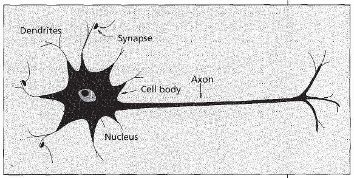
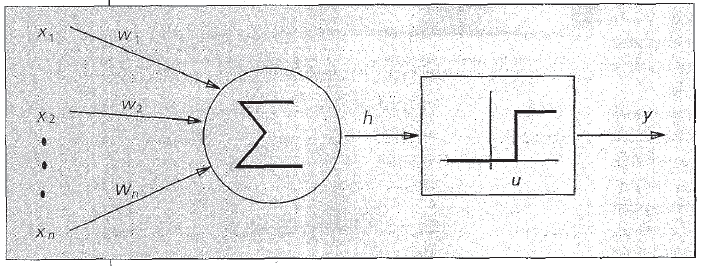
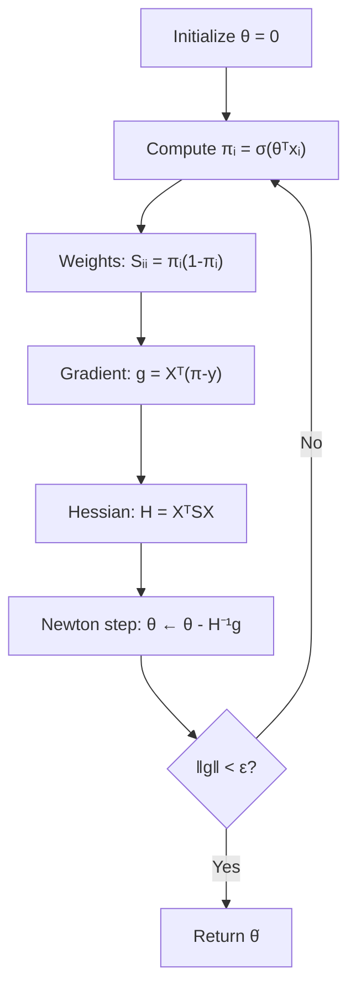
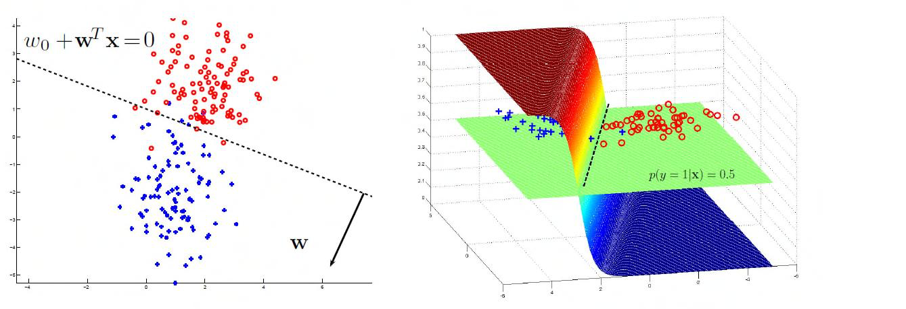

# 4 - Logistic Regression

[toc]

> **TL;DR:** Logistic regression is the canonical binary classification model: it applies the sigmoid function to a linear score to produce a probability, then trains by maximising the Bernoulli log-likelihood (minimising cross-entropy / log-loss). Unlike linear regression, the optimal weights have no closed form — Newton's method (IRLS) or gradient descent is required. As a one-layer neural network with a sigmoid activation, logistic regression is the conceptual bridge from linear models to deep learning.

## Vocabulary

**Sigmoid function** (σ): Maps any real number to (0, 1). The canonical link function for Bernoulli outputs.

```math
\sigma(\eta) = \frac{1}{1 + e^{-\eta}} = \frac{e^\eta}{e^\eta + 1}
```

---

**Log-odds** (logit): The argument to the sigmoid — the linear score before squashing.

```math
\log \frac{p}{1-p} = \theta^\top x = \eta
```

---

**Decision boundary**: The hyperplane θᵀx = 0 where the predicted probability is exactly 0.5.

**Log-loss** / **cross-entropy loss**: The NLL of the Bernoulli model. The standard training objective for binary classification.

```math
\text{NLL}(\theta) = -\sum_{i=1}^n \left[y_i \log \pi_i + (1 - y_i)\log(1 - \pi_i)\right]
```

---

**πᵢ** (pi): Shorthand for σ(θᵀxᵢ), the predicted probability that yᵢ = 1.

**Gradient of NLL**:

```math
\nabla_\theta \text{NLL} = X^\top(\pi - y)
```

---

**Hessian of NLL**:

```math
H = X^\top S X, \quad S = \text{diag}(\pi_i(1-\pi_i))
```

---

**IRLS** (Iteratively Reweighted Least Squares): Newton's method applied to logistic regression. Each step solves a weighted least-squares problem.

**Softmax**: The multi-class generalisation of the sigmoid, producing a probability vector over K classes.

```math
\text{softmax}(\eta)_k = \frac{e^{\eta_k}}{\sum_{j=1}^K e^{\eta_j}}
```

## Intuition

Linear regression predicts a real value. Classification needs a probability — a number in [0, 1]. The simplest fix: push the linear score θᵀx through a squashing function. The sigmoid squashes (−∞, +∞) → (0, 1), is differentiable everywhere, and has a beautifully simple derivative: σ'(η) = σ(η)(1 − σ(η)).

Logistic regression is not doing regression on the label (0/1). It is doing regression on the *log-odds*: the model says log(p/(1−p)) = θᵀx. This is a linear model in log-odds space, a natural choice for binary outcomes.





## How it works

### Specifying the model

The logistic regression model specifies the probability that a binary label yᵢ ∈ {0, 1} is 1, given input xᵢ and parameters θ:

```math
p(y_i = 1 \mid x_i, \theta) = \sigma(\theta^\top \tilde{x}_i) = \pi_i
```

```math
p(y_i = 0 \mid x_i, \theta) = 1 - \pi_i
```

Compactly: yᵢ | xᵢ, θ ~ Bernoulli(πᵢ). The model has the same linear architecture as linear regression, with an extra sigmoid nonlinearity at the output.

### Writing the log-likelihood

The joint likelihood factors over the n i.i.d. observations:

```math
L(\theta; D) = \prod_{i=1}^n \pi_i^{y_i}(1-\pi_i)^{1-y_i}
```

Taking logarithms:

```math
\ell(\theta) = \sum_{i=1}^n \left[y_i \log \pi_i + (1-y_i)\log(1-\pi_i)\right]
```

The NLL (minimised in practice) is the cross-entropy loss familiar from deep learning.

### Computing the gradient

To derive the gradient, use the chain rule and the sigmoid derivative σ'(η) = σ(η)(1−σ(η)):

```math
\frac{\partial}{\partial \theta_j}\ell = \sum_{i=1}^n (y_i - \pi_i) x_{ij}
```

In matrix form:

```math
\nabla_\theta \ell = X^\top(y - \pi) = -\nabla_\theta \text{NLL}
```

The gradient of the NLL is Xᵀ(π − y): the weighted sum of training inputs, weighted by the *prediction errors* (πᵢ − yᵢ). This has the same structure as the gradient for linear regression — residuals times inputs — but with πᵢ replacing ŷᵢ.

> [!IMPORTANT]
> Unlike linear regression, the logistic NLL has no closed-form minimiser. Setting the gradient to zero gives X ᵀ(π − y) = 0, which is a transcendental equation in θ (since πᵢ = σ(θᵀxᵢ) depends nonlinearly on θ). We must use iterative methods.

### Computing the Hessian

Differentiating the gradient with respect to θ gives the Hessian:

```math
H = \nabla^2_\theta \text{NLL} = X^\top S X
```

where S = diag(π₁(1−π₁), …, πₙ(1−πₙ)) is a diagonal matrix of per-example weights. Each weight πᵢ(1−πᵢ) is the variance of a Bernoulli(πᵢ) variable, maximised at 0.25 when πᵢ = 0.5 (maximum uncertainty).

The Hessian H = XᵀSX is positive semi-definite (S has non-negative diagonal), and positive definite when X has full column rank. This means the NLL is strictly convex — it has a unique global minimum.

### IRLS: Newton's method for logistic regression

Newton's update θ^(t+1) = θ^(t) − H⁻¹g leads to an elegant reformulation as a *weighted* least-squares problem at each step. Let z^(t) = Xθ^(t) + S^(t)⁻¹(y − π^(t)) be the working response vector. The Newton update solves:

```math
\theta^{(t+1)} = \arg\min_\theta \|z^{(t)} - X\theta\|^2_{S^{(t)}}
= (X^\top S^{(t)} X)^{-1} X^\top S^{(t)} z^{(t)}
```

At each iteration: compute predicted probabilities π, form weights S, solve a weighted least-squares problem. The weights Sᵢᵢ = πᵢ(1−πᵢ) are small (0 → 0) for confident predictions and large (→ 0.25) for uncertain ones — the algorithm "down-weights" confident points.



### Logistic regression as a 1-layer neural network

The logistic regression model maps input → linear layer → sigmoid → Bernoulli likelihood. This is precisely a single-neuron network (McCulloch-Pitts model) with a sigmoid activation and a cross-entropy loss.

```
Input x ──→ [θᵀx] ──→ σ(·) ──→ π̂ ──→ Cross-entropy loss
 (d dims)    (linear)  (sigmoid)  (prob)
```

Adding hidden layers and different activations generalises this to a multi-layer network — but the output layer of any binary classifier is still logistic regression. The gradient derivation here is the manual version of backpropagation for a one-layer network.



## Math

### Sigmoid derivative

```math
\frac{d\sigma(\eta)}{d\eta} = \sigma(\eta)(1 - \sigma(\eta))
```

**Proof:** Write σ = 1/(1+e^{−η}). Then dσ/dη = e^{−η}/(1+e^{−η})² = σ · (1 − σ).

This identity makes all gradient/Hessian calculations for logistic regression tractable.

### Full gradient derivation

The NLL for one example (y, x):

```math
\ell(\theta; x, y) = y\log\sigma(\eta) + (1-y)\log(1-\sigma(\eta)), \quad \eta = \theta^\top x
```

By chain rule:

```math
\frac{\partial \ell}{\partial \theta_j} = \frac{\partial \ell}{\partial \eta}\cdot\frac{\partial \eta}{\partial \theta_j}
= \left[\frac{y}{\sigma} - \frac{1-y}{1-\sigma}\right]\sigma(1-\sigma)\cdot x_j
= (y - \sigma) x_j
```

Summing over n examples in matrix form: ∇ℓ = Xᵀ(y − π).

### Positive definiteness of H

H = XᵀSX where Sᵢᵢ = πᵢ(1−πᵢ) > 0 for all i (assuming 0 < πᵢ < 1). For any vector v ≠ 0:

```math
v^\top H v = v^\top X^\top S X v = (Xv)^\top S (Xv) = \sum_i S_{ii}(Xv)_i^2 \geq 0
```

Equality holds iff Xv = 0, which requires v ∈ null(X). If X has full column rank, then H is strictly positive definite and the NLL is strictly convex.

### Multiclass generalisation (softmax)

For K classes, replace sigmoid with softmax and Bernoulli with Categorical:

```math
p(y = k \mid x, W) = \text{softmax}(W x)_k = \frac{e^{w_k^\top x}}{\sum_{j=1}^K e^{w_j^\top x}}
```

The NLL becomes the multi-class cross-entropy:

```math
\text{NLL}(W) = -\sum_{i=1}^n \sum_{k=1}^K \mathbf{1}[y_i = k]\log \hat{p}(y_i = k \mid x_i, W)
```

The gradient w.r.t. the k-th class weight vector wₖ is Xᵀ(ŷₖ − yₖ) where ŷₖ is the predicted probability of class k.

## Real-world example

Binary spam classification on a bag-of-words feature representation, comparing logistic regression trained with gradient descent versus scikit-learn's LBFGS solver.

```python
import numpy as np
from sklearn.datasets import fetch_20newsgroups
from sklearn.feature_extraction.text import TfidfVectorizer
from sklearn.linear_model import LogisticRegression
from sklearn.metrics import accuracy_score, log_loss
from sklearn.model_selection import train_test_split

# --- Load 2-class subset: atheism vs christian ---
cats = ["alt.atheism", "soc.religion.christian"]
news = fetch_20newsgroups(subset="all", categories=cats, remove=("headers",))
X_raw, y = news.data, news.target   # binary labels 0/1

# --- TF-IDF features (sparse, ~30k dimensions) ---
vec = TfidfVectorizer(max_features=5000, stop_words="english")
X = vec.fit_transform(X_raw)         # sparse (n, 5000)

X_tr, X_te, y_tr, y_te = train_test_split(X, y, test_size=0.2, random_state=0)

# --- Logistic regression via LBFGS (scikit-learn) ---
# C = 1/λ: regularisation inverse (C=1.0 is mild L2 regularisation)
clf = LogisticRegression(C=1.0, solver="lbfgs", max_iter=500)
clf.fit(X_tr, y_tr)

y_pred = clf.predict(X_te)
y_prob = clf.predict_proba(X_te)[:, 1]

print(f"Accuracy  : {accuracy_score(y_te, y_pred):.4f}")
print(f"Log-loss  : {log_loss(y_te, y_prob):.4f}")
# Expected: ~95% accuracy on this easy binary task

# --- Manual gradient descent for comparison (dense, small data) ---
def sigmoid(eta: np.ndarray) -> np.ndarray:
    return 1.0 / (1.0 + np.exp(-np.clip(eta, -500, 500)))

def cross_entropy(X: np.ndarray, y: np.ndarray, theta: np.ndarray) -> float:
    pi = sigmoid(X @ theta)
    pi = np.clip(pi, 1e-15, 1 - 1e-15)
    return -np.mean(y * np.log(pi) + (1 - y) * np.log(1 - pi))

def grad_ce(X: np.ndarray, y: np.ndarray, theta: np.ndarray) -> np.ndarray:
    pi = sigmoid(X @ theta)
    return X.T @ (pi - y) / len(y)
```

> [!TIP]
> For logistic regression on sparse features (text, genomics), LBFGS converges in far fewer iterations than gradient descent and handles the curvature correctly with only O(d·m) memory (m = history length, typically 10). For n > 10⁵, switch to SGD or mini-batch Adam — LBFGS stores a dense approximation to the Hessian which becomes expensive.

## In practice

**Logistic regression is a strong baseline.** In many production settings, a logistic regression with good feature engineering outperforms more complex models. It is interpretable (weight magnitudes indicate feature importance), fast to train, and outputs calibrated probabilities (unlike SVMs without Platt scaling).

**Log-loss vs accuracy:** Optimise log-loss (NLL) during training, not accuracy. Accuracy is non-differentiable at its threshold (0.5). Log-loss penalises wrong confident predictions exponentially — a prediction of 0.99 for the wrong class contributes ~2.3 nats of loss, while a prediction of 0.51 for the wrong class contributes only ~0.67 nats. This asymmetry is what makes calibration important.

> [!WARNING]
> Logistic regression assumes features and labels are linearly separable in log-odds space. When they are exactly separable (there exists a θ such that θᵀxᵢ > 0 iff yᵢ = 1 for all i), the MLE does not exist — the weights diverge to ∞ as the sigmoid tries to assign probability 1 to every correctly classified point. Adding L2 regularisation (C < ∞) always fixes this.

**Multi-class**: Extend via one-vs-rest (K binary classifiers) or multinomial (softmax) logistic regression. One-vs-rest is faster; multinomial gives proper calibrated multi-class probabilities and is generally preferred when K ≤ 100.

> [!NOTE]
> The IRLS algorithm is also known as *Fisher scoring* and is the standard algorithm for fitting generalised linear models (GLMs). Logistic regression is the Bernoulli GLM with logit link. Poisson regression, gamma regression, and other GLMs use the same IRLS structure with different link functions and variance functions.

## Pitfalls

- **"Logistic regression can model any classification boundary."** Only linear boundaries in the *original* feature space. XOR-type problems require feature engineering (polynomial, kernel) or a nonlinear model.
- **"Cross-entropy loss and 0-1 loss optimise the same thing."** They do not. Cross-entropy is a surrogate for 0-1 loss that is convex and differentiable. Minimising cross-entropy approximately minimises misclassification rate but not exactly.
- **"The weights can be compared directly for feature importance."** Only if features are on the same scale. Always standardise features before interpreting weight magnitudes. Alternatively use the absolute value of weights divided by their standard errors (Wald statistic).
- **"Logistic regression outputs calibrated probabilities."** Roughly, but not exactly — especially with regularisation or class imbalance. Use Platt scaling or isotonic regression if calibration matters for downstream decisions.
- **"Setting the decision threshold at 0.5 is always optimal."** Only when false positives and false negatives are equally costly. In imbalanced settings (fraud detection, medical screening), tune the threshold on a validation set using precision-recall trade-offs.

## Exercises

### Exercise 1 — Sigmoid derivative

Prove that dσ(η)/dη = σ(η)(1−σ(η)).

#### Solution

```math
\sigma(\eta) = \frac{1}{1+e^{-\eta}}
```

Differentiate using the quotient rule, or equivalently the chain rule with the substitution u = 1 + e^{−η}:

```math
\frac{d\sigma}{d\eta} = \frac{e^{-\eta}}{(1+e^{-\eta})^2}
= \frac{1}{1+e^{-\eta}} \cdot \frac{e^{-\eta}}{1+e^{-\eta}}
= \sigma(\eta) \cdot \left(1 - \frac{1}{1+e^{-\eta}}\right)
= \sigma(\eta)(1-\sigma(\eta))
```

The identity follows because (1 − σ) = e^{−η}/(1+e^{−η}). This compact form makes backpropagation through sigmoid layers O(1) per unit.

---

### Exercise 2 — Gradient of the NLL

Derive the gradient ∇_θ NLL = Xᵀ(π − y) from first principles.

#### Solution

NLL = − Σᵢ [yᵢ log σ(θᵀxᵢ) + (1−yᵢ) log(1−σ(θᵀxᵢ))]. Using the chain rule and the sigmoid derivative:

```math
\frac{\partial}{\partial \theta_j}(-\ell_i) = -\left[\frac{y_i}{\pi_i} - \frac{1-y_i}{1-\pi_i}\right]\pi_i(1-\pi_i) x_{ij}
= -\left[y_i(1-\pi_i) - (1-y_i)\pi_i\right] x_{ij}
= (\pi_i - y_i) x_{ij}
```

Summing over all i and stacking into vectors:

```math
\nabla_\theta \text{NLL} = \sum_i (\pi_i - y_i) x_i = X^\top(\pi - y)
```

---

### Exercise 3 — Hessian is positive definite

Show that H = XᵀSX is positive definite when X has full column rank and 0 < πᵢ < 1.

#### Solution

For any non-zero vector v ∈ ℝᵈ:

```math
v^\top H v = v^\top X^\top S X v = (Xv)^\top S (Xv) = \sum_i \pi_i(1-\pi_i)(x_i^\top v)^2
```

Since 0 < πᵢ < 1, each weight πᵢ(1−πᵢ) > 0. The sum equals zero iff (xᵢᵀv)² = 0 for all i, which means Xv = 0. If X has full column rank, Xv = 0 implies v = 0. Therefore vᵀHv > 0 for all v ≠ 0, so H is positive definite. This confirms the NLL is strictly convex with a unique global minimum.

---

### Exercise 4 — IRLS as weighted least squares

Show that the Newton update for logistic regression can be written as the solution to a weighted least-squares problem.

#### Solution

The Newton step is θ^(t+1) = θ^(t) − H⁻¹g. Define the working response:

```math
z^{(t)} = X\theta^{(t)} + (S^{(t)})^{-1}(y - \pi^{(t)})
```

Then the Newton update solves the weighted least-squares problem:

```math
\theta^{(t+1)} = \arg\min_\theta (z^{(t)} - X\theta)^\top S^{(t)} (z^{(t)} - X\theta)
= (X^\top S^{(t)} X)^{-1} X^\top S^{(t)} z^{(t)}
```

This is standard WLS with weight matrix S^(t). The algorithm re-fits weighted least squares at each step, with weights that depend on the current predicted probabilities — hence "iteratively reweighted." This structure means IRLS can leverage efficient WLS solvers.

---

### Exercise 5 — Logistic regression in log-odds space

Show that the log-odds ratio log(p/(1−p)) is a linear function of x under the logistic regression model.

#### Solution

Under logistic regression: p = σ(θᵀx) = 1/(1+e^{−θᵀx}).

```math
\frac{p}{1-p} = \frac{\sigma(\theta^\top x)}{1-\sigma(\theta^\top x)} = \frac{1/(1+e^{-\theta^\top x})}{e^{-\theta^\top x}/(1+e^{-\theta^\top x})} = e^{\theta^\top x}
```

Taking logs:

```math
\log\frac{p}{1-p} = \theta^\top x
```

The log-odds is a linear function of x. This is the defining property of the logistic regression model — it is a *generalized linear model* with logit link function. The model is linear in log-odds space, not in probability space.

## Sources

- Nando de Freitas, *Machine Learning Lectures — Oxford University* (2015): Logistic regression (oxf10), Exercise Sheet 3 (oxf3). https://www.cs.ox.ac.uk/people/nando.defreitas/machinelearning/
- Lindsten, F. et al. (2018). *Statistical Machine Learning: Lecture notes*. Uppsala University. §3.
- Murphy, K. P. (2012). *Machine Learning: A Probabilistic Perspective*. MIT Press. §8.3.
- Bishop, C. M. (2006). *Pattern Recognition and Machine Learning*. Springer. §4.3.
- de Freitas, N. *Exercise Sheet 3: Gradient and Hessian of log-likelihood for logistic regression* (2015).

## Related

- [1 - Linear Regression](./1-linear-regression.md)
- [2 - Maximum Likelihood Estimation](./2-maximum-likelihood-estimation.md)
- [3 - Regularization and Cross-Validation](./3-regularization-and-cross-validation.md)
- [5 - Optimization for ML](./5-optimization-for-ml.md)
- [3 - Estimation and MLE](../1-foundations/3-estimation-and-mle.md)
- [2 - Naive Bayes](../2-supervised-learning/2-naive-bayes.md)
