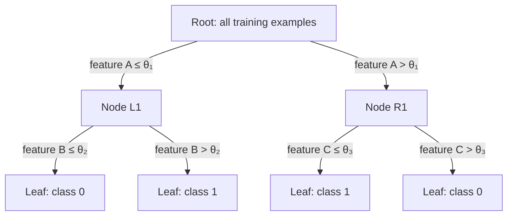
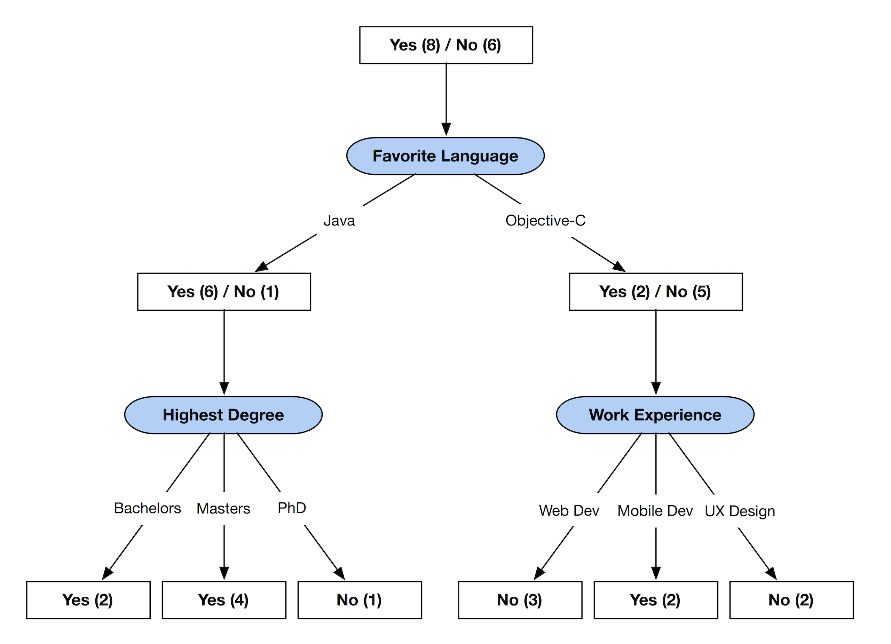
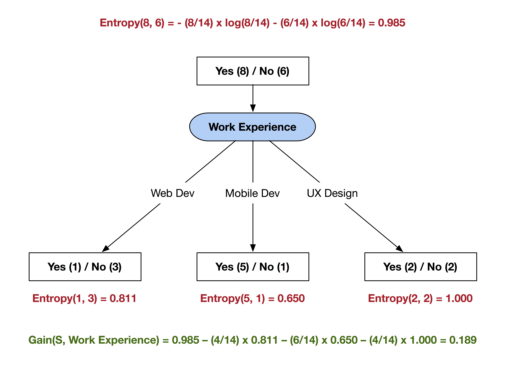

# 8 - Decision Trees: Entropy, Gini, CART, and Pruning

[toc]

> **TL;DR:** A decision tree recursively partitions the feature space using axis-aligned splits chosen to maximise a purity criterion — information gain (ID3/C4.5) or Gini impurity reduction (CART). Trees are high-variance: a fully grown tree memorises the training set. Pruning — either early stopping or post-hoc subtree removal — is the regularisation mechanism. Trees matter less as standalone classifiers than as the substrate for gradient-boosted ensembles, the dominant method on tabular data.

## Vocabulary

**Decision stump**

A tree of depth 1: a single threshold on one feature, producing two leaf nodes. The canonical weak learner in AdaBoost.

---

**Node impurity**

A scalar that measures the heterogeneity of class labels in a node. Maximum when all classes are equally represented; minimum (zero) when the node is pure (all one class).

---

**Entropy H(S)**

Shannon entropy of the label distribution in node S. Measured in bits (log base 2).

```math
H(S) = -\sum_{k=1}^{c} p_k \log_2 p_k
```

where pₖ is the fraction of class-k examples in S.

---

**Information Gain IG(S, A)**

Reduction in entropy achieved by splitting node S on attribute A.

```math
\text{IG}(S, A) = H(S) - \sum_{v \in \text{Values}(A)} \frac{|S_v|}{|S|} H(S_v)
```

---

**Gini impurity G(S)**

Alternative impurity measure used by CART. Expected misclassification if a random example is labelled by a random label draw from the node distribution.

```math
G(S) = 1 - \sum_{k=1}^{c} p_k^2 = \sum_{k \neq j} p_k p_j
```

---

**CART (Classification and Regression Trees)**

Breiman et al. (1984). Binary splits only; uses Gini for classification, MSE for regression. Generates cost-complexity pruning path.

---

**ID3 / C4.5**

Quinlan's algorithms (1979–1993). Multiway splits; uses information gain (ID3) or gain ratio (C4.5, which normalises for attribute cardinality).

---

**Gain ratio**

C4.5's correction to information gain for high-cardinality attributes: IG(S, A) / SplitInfo(S, A), where SplitInfo penalises attributes with many distinct values.

---

**Pre-pruning (early stopping)**

Stop splitting a node when a criterion is met: min samples, max depth, or no statistically significant improvement. Conservative but fast.

---

**Post-pruning (reduced-error / cost-complexity)**

Grow a full tree, then collapse subtrees that don't improve validation-set accuracy. More aggressive and generally preferred.

---

**Cost-complexity pruning (CART)**

A 1D sweep over a regularisation parameter α ≥ 0. Each α yields one tree on the path from full tree to root. Optimal α chosen by cross-validation.

---

## Intuition

Think of a decision tree as writing a flowchart by looking at the training data. At each branch you ask the single yes/no question that most cleanly separates the current pile of examples into their true classes. "Is the email body longer than 300 words?" might split spam from ham better than "Does it contain the word 'the'?" Information gain is the formal version of "which question separates better?"

The overfit problem is equally intuitive: if you keep asking questions until every leaf contains only one training example, you have memorised noise. A tree that deep will misclassify any test example that differs even slightly from its training neighbour. Pruning re-merges leaves whose questions were fitting noise rather than signal.



## How it Works

### Phase 1 — Greedy top-down induction

Building a decision tree is a greedy recursive algorithm. Start with the full training set at the root. At each node, enumerate all possible splits — for a categorical feature, all subsets of values; for a continuous feature, all midpoints between consecutive distinct values — and pick the split that maximally reduces impurity. This is the ID3/C4.5/CART common core.

The algorithm terminates at a node when one of three stopping conditions fires: the node is pure (all one class), the node has fewer than `min_samples_split` examples, or depth equals `max_depth`. Otherwise, partition the examples and recurse on each child.

**Figure 1** below shows a concrete C4.5 tree built on a hiring dataset, with the first split on "Favorite Language."



### Phase 2 — Splitting criteria in detail

The two dominant impurity measures are entropy (used by ID3 and C4.5) and Gini impurity (used by CART). They are numerically very similar — for two classes, both are maximised at p = 0.5 and reach zero at p ∈ {0, 1} — but Gini is slightly faster to compute (no logarithm).

For a continuous feature x and candidate threshold θ, all examples with xⱼ ≤ θ go left and xⱼ > θ go right. Finding the optimal threshold requires sorting the feature column and evaluating each midpoint, costing O(n log n) per feature per node. For d features and n examples at a node, the split search is O(d·n log n).

> [!IMPORTANT]
> Decision trees produce **axis-aligned splits only**. A single tree cannot represent the boundary y = x (a 45° diagonal) exactly — it can only approximate it with staircase approximations. Oblique trees (linear combinations as split criteria) do exist but are rarely used because they break interpretability.

### Phase 3 — Numerical features and C4.5 gain ratio

C4.5 extends ID3 to handle continuous features natively by sorting and thresholding. It also addresses ID3's bias toward high-cardinality attributes: a unique-ID attribute achieves IG = H(S) (perfect split into n singletons), but it generalises to nothing. The gain ratio divides IG by the split's own entropy, penalising attributes that produce many small branches.

**Figure 2** below shows the information gain calculation for splitting on "Work Experience" at the root of the same dataset — entropy annotations on each node make the IG formula concrete.



### Phase 4 — Pruning

Post-hoc pruning is the most effective regularisation for trees. CART's cost-complexity pruning parameterises the trade-off between tree complexity and training-set fit:

```math
R_\alpha(T) = R(T) + \alpha \cdot |T|
```

where R(T) is the misclassification rate, |T| is the number of leaves, and α ≥ 0 is the complexity penalty. For each α, there is a unique optimal subtree T(α). As α increases from 0 (full tree) to ∞ (root only), T(α) shrinks monotonically. Sweeping α generates a path of nested trees; cross-validation selects the best α.

## Math

### Entropy of a node

```math
H(S) = -\sum_{k=1}^{c} p_k \log_2 p_k, \quad p_k = \frac{|S_k|}{|S|}
```

Maximum value: H = log₂ c bits (uniform distribution). Minimum: H = 0 (pure node).

### Information Gain

```math
\text{IG}(S, A) = H(S) - \sum_{v \in \text{Values}(A)} \frac{|S_v|}{|S|} H(S_v)
```

### Gini impurity

```math
G(S) = 1 - \sum_{k=1}^{c} p_k^2
```

For two classes (p, 1−p): G = 2p(1−p), with maximum at p = 0.5 of G = 0.5.

### Gini gain of a binary split

```math
\Delta G(S, A) = G(S) - \frac{|S_L|}{|S|} G(S_L) - \frac{|S_R|}{|S|} G(S_R)
```

### Cost-complexity pruning objective

```math
R_\alpha(T) = \sum_{\ell \in \text{leaves}(T)} r(\ell) \cdot \frac{|S_\ell|}{|S|} + \alpha \cdot |\text{leaves}(T)|
```

where r(ℓ) is the fraction of misclassified examples at leaf ℓ.

## Real-world Example

Classifying the Iris dataset using CART, then comparing a fully-grown tree with a pruned one using sklearn's cost-complexity pruning path.

```python
import numpy as np
import matplotlib.pyplot as plt
from sklearn.datasets import load_iris
from sklearn.tree import DecisionTreeClassifier, export_text
from sklearn.model_selection import cross_val_score

iris = load_iris()
X, y = iris.data, iris.target

# ---- 1. Fully grown tree (no regularisation) ----
full_tree = DecisionTreeClassifier(criterion="gini", random_state=0)
full_tree.fit(X, y)
print(f"Full tree depth: {full_tree.get_depth()},  leaves: {full_tree.get_n_leaves()}")
print(f"Full tree train acc: {full_tree.score(X, y):.3f}")

# ---- 2. Cost-complexity pruning path ----
path = full_tree.cost_complexity_pruning_path(X, y)
alphas = path.ccp_alphas      # sorted ascending (0 → full tree, max → stump)

cv_scores = []
for alpha in alphas:
    clf = DecisionTreeClassifier(ccp_alpha=alpha, random_state=0)
    scores = cross_val_score(clf, X, y, cv=5)
    cv_scores.append(scores.mean())

best_alpha = alphas[np.argmax(cv_scores)]
print(f"\nBest alpha: {best_alpha:.5f}")

# ---- 3. Pruned tree ----
pruned = DecisionTreeClassifier(ccp_alpha=best_alpha, random_state=0)
pruned.fit(X, y)
print(f"Pruned tree depth: {pruned.get_depth()},  leaves: {pruned.get_n_leaves()}")
print(export_text(pruned, feature_names=list(iris.feature_names)))
```

> [!TIP]
> Prefer Gini over entropy for CART — they almost always select the same split, but Gini avoids computing a logarithm, making it ~30% faster on large datasets. Use entropy (information gain) when you want a more principled information-theoretic split statistic, or when building boosting ensembles that use tree outputs as soft scores.

## In Practice

**Feature importance.** Sklearn's `feature_importances_` reports the total Gini impurity reduction (weighted by node population) attributed to each feature across all splits. This is a useful first-pass feature ranking, but it is biased toward high-cardinality continuous features — they tend to have more candidate split points and thus more chances to appear. Permutation importance or SHAP values are more reliable.

**Class imbalance.** Trees will grow toward the majority class, producing deep subtrees for frequent classes and shallow/absent branches for rare ones. Use `class_weight="balanced"` to rescale the impurity calculations by inverse class frequency, or oversample the minority class before training.

**Axis-aligned decision boundary.** For any rotated or oblique true boundary, a single tree requires exponentially many levels to approximate it. This is the primary reason trees are poor standalone classifiers for spatial/vision data. Ensembles (random forests, gradient boosting) partially mitigate this by combining many axis-aligned cuts.

> [!WARNING]
> `DecisionTreeClassifier` with no `max_depth` or `min_samples_leaf` will achieve 100% training accuracy on any noise-free dataset by making each leaf a singleton. This is pure memorisation. Always set at least `min_samples_leaf=5` or use `ccp_alpha` in production, or you will confuse training accuracy for model quality.

**Memory and inference speed.** A depth-d binary tree uses at most 2^d − 1 nodes and O(2^d) memory. Inference is O(d) per sample (one comparison per level). For depth 10, inference is 10 comparisons — faster than almost any other model. This is why decision trees (and their boosted cousins) dominate embedded and latency-critical scoring pipelines.

## Pitfalls

- **"Trees naturally handle missing values."** — Standard CART as implemented in sklearn does not handle NaN; you must impute first. XGBoost's trees do handle missing values natively via learned default directions.
- **"Information gain is unbiased toward attribute cardinality."** — ID3's information gain is heavily biased toward high-arity attributes (see gain ratio fix in C4.5). Gini doesn't have this bias to the same degree.
- **"Max depth is the best way to regularise."** — Depth limits the *worst case* but not the *average* complexity. `min_samples_leaf` and `ccp_alpha` produce more calibrated regularisation because they target the impurity improvement directly.
- **"A deep tree with high train accuracy is good."** — High train accuracy on a fully grown tree is guaranteed; it tells you nothing. Evaluate on a held-out set or use cross-validated `ccp_alpha`.
- **"Feature importance from trees is reliable for correlated features."** — Correlated features share importance, making each individual feature look less important. The Gini importance of one feature partially absorbs the importance of its correlated partner.

## Exercises

### Exercise 1 — Compute information gain by hand

A node S has 6 positive (+) and 6 negative (−) examples. Splitting on attribute A produces:
- Left child Sₗ: 4+, 2−
- Right child Sᵣ: 2+, 4−

Compute H(S), H(Sₗ), H(Sᵣ), and IG(S, A).

#### Solution 1

**H(S):** p₊ = p₋ = 6/12 = 0.5, so H(S) = −0.5 log₂ 0.5 − 0.5 log₂ 0.5 = 1.0 bit (maximum entropy for two classes).

**H(Sₗ):** p₊ = 4/6 = 2/3, p₋ = 2/6 = 1/3:

```math
H(S_L) = -\frac{2}{3}\log_2\frac{2}{3} - \frac{1}{3}\log_2\frac{1}{3}
        \approx -0.667 \times (-0.585) - 0.333 \times (-1.585)
        \approx 0.390 + 0.528 = 0.918 \text{ bits}
```

**H(Sᵣ):** Symmetric to Sₗ (by symmetry H(Sᵣ) = H(Sₗ) = 0.918 bits).

**IG(S, A):**

```math
\text{IG} = 1.0 - \frac{6}{12}(0.918) - \frac{6}{12}(0.918) = 1.0 - 0.918 = 0.082 \text{ bits}
```

This split recovers only 0.082 bits — 8.2% of the available impurity. A better split would have one pure child and near-zero entropy.

---

### Exercise 2 — Gini vs. Entropy: when do they disagree?

Show that Gini impurity and entropy rank two candidate splits the same way *most* of the time but can differ. Construct a concrete example where they disagree on which split is better.

#### Solution 2

For a node S with n = 100 examples and two candidate binary splits:

**Split A:** Sₗ: 40+, 10− | Sᵣ: 10+, 40−
**Split B:** Sₗ: 48+, 2− | Sᵣ: 2+, 48−

Gini computation for Split A:
- G(Sₗ) = 1 − (40/50)² − (10/50)² = 1 − 0.64 − 0.04 = 0.32
- G(Sᵣ) = same = 0.32 (symmetric)
- ΔG(A) = G(S) − (0.5)(0.32) − (0.5)(0.32) = 0.5 − 0.32 = 0.18

Gini computation for Split B:
- G(Sₗ) = 1 − (48/50)² − (2/50)² ≈ 1 − 0.922 − 0.002 = 0.076
- ΔG(B) = 0.5 − 0.076 = 0.424

Both Gini and entropy prefer Split B here (nearly pure children). The two metrics almost always agree on ranking; disagreements are most common when comparing splits that produce children with similar intermediate purities (neither extreme). In practice, the accuracy difference is negligible and the choice is mainly computational.

---

### Exercise 3 — When do trees win?

Describe three scenarios where a single decision tree (not an ensemble) is the right tool, and three where it is the wrong tool.

#### Solution 3

**When trees win:**
1. **Interpretability is required by law or regulation.** A single shallow tree (depth 3–5) produces explicit if-then rules that a loan officer or physician can audit and explain. Neural networks and gradient-boosted ensembles cannot.
2. **Categorical features with complex, non-monotone relationships.** Trees split on raw categorical values without needing one-hot encoding or ordinal assumptions. Linear models with categorical features require careful feature engineering.
3. **Mixed data types and missing values (with appropriate implementation).** Trees (especially in XGBoost form) handle integer, float, and categorical columns in the same model without scaling or imputation.

**When trees lose:**
1. **Smooth, low-noise regression targets.** A tree with depth d produces a piecewise-constant function with 2^d regions. A linear model or GP fits smooth curves with far fewer parameters.
2. **Image or text data.** Axis-aligned splits on pixel values or token counts ignore spatial/sequential structure. CNNs and transformers extract compositional features that trees cannot.
3. **Extrapolation.** Trees cannot extrapolate outside the range of training feature values — every leaf's prediction is the training-set mean/majority within a region. For features that take on new values at test time, a tree returns the boundary-leaf prediction, which may be far from the truth.

---

### Exercise 4 — Post-pruning mechanics

A fully grown tree achieves 100% training accuracy and 72% validation accuracy. After reducing it to depth 3, training accuracy drops to 87% and validation accuracy rises to 85%. Explain in bias-variance terms why this happens.

#### Solution 4

The fully grown tree has near-zero bias (it can memorise any training set) but very high variance — small changes in the training data produce completely different trees. The 28-point gap between training (100%) and validation (72%) is a textbook overfit signature: the tree is fitting noise in the training set that doesn't generalise.

Pruning to depth 3 increases bias (the model can no longer fit arbitrarily complex boundaries) but dramatically reduces variance. The model is now a smoother function that ignores training-set noise. The net effect is a 13-point improvement in validation accuracy, confirming that variance reduction dominated bias increase — i.e., the original tree was far into the high-variance regime.

The bias-variance decomposition for 0/1 loss is more complex than for MSE, but the qualitative message is identical: pruning trades training-set fit for test-set generalisation.

## Sources

- Breiman, L., Friedman, J., Olshen, R., & Stone, C. (1984). *Classification and Regression Trees* (CART). Wadsworth.
- Quinlan, J. R. (1993). *C4.5: Programs for Machine Learning*. Morgan Kaufmann.
- James, G., Witten, D., Hastie, T., & Tibshirani, R. (2013). *An Introduction to Statistical Learning*. Springer. Chapter 8.
- Hastie, T., Tibshirani, R., & Friedman, J. (2009). *The Elements of Statistical Learning* (2nd ed.). Springer. Chapter 9.
- Lecture notes: air(16).pdf — AI & ML, Tree Classifiers (course slides)
- Lecture notes: ail(23).pdf — CS 189, Concise Machine Learning (Shewchuk, Berkeley)

## Related

- [1 - Decision Trees](./1-decision-trees.md)
- [7 - Naive Bayes Classifier](./7-naive-bayes-classifier.md)
- [9 - Ensemble Methods](./9-ensemble-methods.md)
- [10 - K-Nearest Neighbours](./10-k-nearest-neighbours.md)
