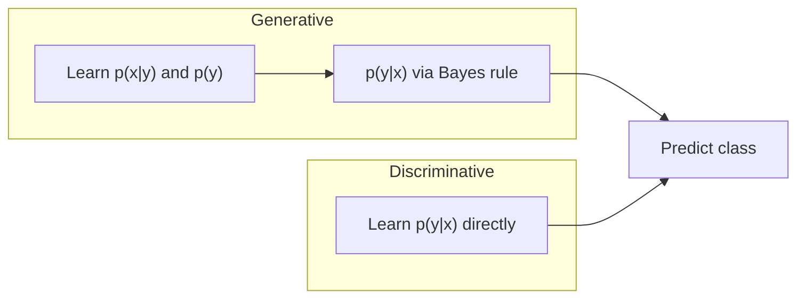

# 7 - Naive Bayes Classifier

[toc]

> **TL;DR:** Naive Bayes is a generative classifier that models p(x|y) under the strong — and almost always violated — assumption that features are conditionally independent given the class. Despite this "naive" assumption, it achieves surprisingly competitive accuracy on text, outperforming many discriminative models in low-data and high-dimensional-sparse regimes. Training is a single pass of frequency counting; inference is a dot product in log-space.

## Vocabulary

**Generative model**

Learns the joint distribution p(x, y) = p(x|y)·p(y), then recovers p(y|x) via Bayes' rule. Contrasts with discriminative models that learn p(y|x) directly.

---

**Discriminative model**

Models p(y|x) directly (logistic regression, SVM, neural net). No model of what inputs look like; only the decision boundary is learned.

---

**Likelihood p(x|y)**

The probability of observing feature vector x given class y. In NB, factored as a product of per-feature likelihoods under the conditional independence assumption.

---

**Prior p(y)**

The marginal class probability, estimated from class frequencies in the training set.

---

**Posterior p(y|x)**

The quantity we actually want. Recovered from likelihood and prior via Bayes' rule: p(y|x) ∝ p(x|y)·p(y).

---

**Conditional independence assumption**

The NB assumption: given class y, each feature xⱼ is independent of all other features. Formally: p(x₁,…,xd|y) = ∏ⱼ p(xⱼ|y).

---

**Laplace smoothing (add-1 smoothing)**

Adds a pseudocount of 1 (or m for m-estimate) to each count before normalising. Prevents zero-probability products when a feature-class combination is unseen in training.

---

**Maximum Likelihood Estimate (MLE)**

Parameter setting that maximises the likelihood of the observed data. For NB: raw frequency ratios.

---

**Maximum A Posteriori (MAP)**

Maximises the posterior p(θ|data) ∝ p(data|θ)·p(θ). Laplace smoothing corresponds to a Dirichlet prior on the multinomial likelihood — it is MAP, not MLE.

---

**Log-space evaluation**

Taking the log of the NB score before comparing classes. Turns a product of small probabilities (which underflows float64) into a sum of log-probabilities.

---

**m-estimate**

Generalised Laplace smoothing: add m·p virtual examples, where p is a prior probability (uniform ⇒ p = 1/k) and m is the equivalent sample size.

---

## Intuition

Imagine two file drawers, one labelled "spam" and one labelled "ham." During training you slide every email into the correct drawer and count how often each word appears. At test time, you ask: "If this email came from the spam drawer, how likely is this exact word sequence?" You do the same for ham, multiply in the drawer's prior occupancy, and predict whichever drawer wins. The "naive" step is pretending every word's presence is independent of every other word's presence given the drawer — obviously false ("free money" co-occurs strongly) but computationally tractable.

The generative vs. discriminative split is the first important choice in any ML pipeline. Generative models can do more (synthesise new examples, handle missing features naturally, work with unlabelled data) but pay a price in fitting a richer model. Discriminative models focus only on the decision boundary and tend to dominate when you have ample labelled data. In the low-data or high-dimensional-sparse regime — exactly where bag-of-words text lives — NB's strong structural assumptions keep the variance low enough to win.



## How it Works

### Step 1 — Formulate the MAP classifier

We want the class that maximises the posterior. Dropping the denominator p(x) (constant across classes) gives us the unnormalised rule:

```math
\hat{y} = \arg\max_{y \in \mathcal{Y}}\; p(y \mid x_1, \ldots, x_d)
         = \arg\max_{y}\; p(x_1, \ldots, x_d \mid y)\; p(y)
```

The full joint likelihood p(x₁,…,xd|y) has exponential support — with d binary features and c classes we would need c·2^d − c parameters. For d = 50,000 words and c = 2 that is unlearnable from any realistic corpus.

### Step 2 — Apply the conditional independence assumption

Under the NB factorisation, the joint likelihood collapses to a product:

```math
p(x_1, \ldots, x_d \mid y) = \prod_{j=1}^{d} p(x_j \mid y)
```

The parameter count drops to c·d values for the likelihoods plus c − 1 class priors — linear in both d and c. This is the entire computational trick: one independence assumption buys us exponential reduction in parameters.

### Step 3 — Estimate parameters from training data (MLE)

Given n training examples, estimating p(y) and p(xⱼ = aⱼ|y) from frequency counts is the learning algorithm. No gradient descent, no hyperplane, no iterative procedure — one forward pass.

The MLE estimates are:

```math
\hat{p}(y) = \frac{n_y}{n}, \qquad
\hat{p}(x_j = a \mid y) = \frac{n_{y,j,a}}{n_y}
```

where nᵧ is the number of training examples with label y, and nᵧ,j,a is those where feature j equals value a.

### Step 4 — Laplace / m-estimate smoothing (MAP)

MLE produces zero for any (feature, class) combination not seen in training. Multiplying in a zero collapses the entire product — one unseen word makes NB call the whole document equally likely under every class, which is nonsense. The fix is to add pseudocounts before normalising:

```math
\hat{p}(x_j = a \mid y) = \frac{n_{y,j,a} + m \cdot p}{n_y + m}
```

With m = 1 and uniform prior p = 1/k (k = number of distinct values of feature j), this is Laplace add-1 smoothing. The Bayesian interpretation: m pseudo-examples drawn from a uniform Dirichlet prior — MAP estimation rather than MLE.

> [!IMPORTANT]
> Always smooth. A single unseen word-class pair makes the unsmoothed NB score exactly zero, and log(0) = −∞ blows up the log-space sum. Even a token pseudocount of 1 / vocabulary-size suffices.

### Step 5 — Classify in log-space

Computing the product of hundreds of small probabilities (each ≪ 1) in floating point will underflow to zero long before you finish the sum. Take logs instead:

```math
\hat{y} = \arg\max_{y}\; \log p(y) + \sum_{j=1}^{d} \log p(x_j \mid y)
```

This is just a dot product between the log-likelihood vector and the feature vector — which is why Naive Bayes is provably a linear classifier in log-space.

## Math

### Formal classifier

```math
\hat{y} = \arg\max_{y \in \mathcal{Y}}\; \log \hat{p}(y)
          + \sum_{j=1}^{d} \log \hat{p}(x_j \mid y)
```

### Text classification (multinomial NB)

For documents, features are word counts; the multinomial model tracks how often each word wₖ appears in class cⱼ documents:

```math
\hat{p}(w_k \mid c_j) = \frac{n_{k,j} + 1}{n_j + |\mathcal{V}|}
```

where nₖ,j = count of word wₖ in all class-cⱼ documents, nⱼ = total word tokens in class-cⱼ documents, and |𝒱| = vocabulary size (add-1 denominator adjustment prevents a different zero problem).

### Why NB is a linear classifier

Define a binary feature vector x ∈ {0,1}^d for binary features. The log-odds score for class +1 vs. −1 is:

```math
\log \frac{p(y=1 \mid x)}{p(y=0 \mid x)}
= \log \frac{p(y=1)}{p(y=0)}
+ \sum_j x_j \log \frac{p(x_j=1 \mid y=1)}{p(x_j=1 \mid y=0)}
```

This is wᵀx + b with w fixed by the log-likelihood ratios and b by the log-prior ratio — a linear classifier with analytically determined weights, not learned by gradient descent.

## Real-world Example

The figure below shows a typical training dataset for a hiring-prediction problem, illustrating the feature-label pairs that NB learns from by counting frequencies.


Spam classification with the 20 Newsgroups dataset. We fit a multinomial NB using scikit-learn's `MultinomialNB`, which implements the add-α smoothing described above, and evaluate on a held-out test set.

```python
from sklearn.datasets import fetch_20newsgroups
from sklearn.feature_extraction.text import CountVectorizer
from sklearn.naive_bayes import MultinomialNB
from sklearn.pipeline import Pipeline
from sklearn.metrics import classification_report
import numpy as np

# Binary problem: comp.* vs. rec.* (two broad categories)
cats = ["comp.graphics", "comp.os.ms-windows.misc", "comp.sys.ibm.pc.hardware",
        "rec.autos", "rec.motorcycles", "rec.sport.baseball"]

train = fetch_20newsgroups(subset="train", categories=cats, remove=("headers", "footers", "quotes"))
test  = fetch_20newsgroups(subset="test",  categories=cats, remove=("headers", "footers", "quotes"))

# Pipeline: bag-of-words counts → multinomial NB with Laplace smoothing (alpha=1)
pipe = Pipeline([
    ("vect", CountVectorizer(max_features=20_000, stop_words="english")),
    ("clf",  MultinomialNB(alpha=1.0)),   # alpha is the Laplace smoothing parameter
])

pipe.fit(train.data, train.target)
preds = pipe.predict(test.data)

print(classification_report(test.target, preds, target_names=train.target_names))

# --- Inspect learned log-likelihood ratios ---
clf   = pipe.named_steps["clf"]
vect  = pipe.named_steps["vect"]
vocab = np.array(vect.get_feature_names_out())

# Top-20 words for class 0 vs class 1
for cls_idx in range(min(2, len(train.target_names))):
    top20 = np.argsort(clf.feature_log_prob_[cls_idx])[-20:]
    print(f"\nTop words for '{train.target_names[cls_idx]}':")
    print(vocab[top20])
```

> [!TIP]
> Use `ComplementNB` (Rennie et al., 2003) rather than `MultinomialNB` for text classification. It estimates the parameters from the *complement* of each class, which corrects for class imbalance and tends to outperform standard MNB on long documents. It is the default in many production spam filters.

## In Practice

**Bag-of-words and the independence assumption.** Words are not independent: "New York" is two words but one concept. In practice, adding bigrams (as additional features) often helps without breaking the NB framework — each bigram is another "feature" with its own conditional likelihood. The model is still NB; the features are richer.

**Sparse counts and vocabulary size.** A 50,000-word vocabulary with c = 2 classes requires storing 100,000 log-probability values — trivially small. This is why NB scales effortlessly to millions of documents.

**Continuous features — Gaussian NB.** When features are real-valued, replace the multinomial with a per-class Gaussian: p(xⱼ|y) = N(xⱼ; μⱼᵧ, σⱼᵧ²). Parameters (μ, σ) are estimated by class-conditional sample mean and variance. Works well when features are roughly unimodal and not heavily correlated.

**NB vs. logistic regression asymptotically.** Ng and Jordan (2002) prove that NB reaches its (inferior) asymptotic error faster than logistic regression, making NB better in the very-small-data regime and LR better with enough data. The crossover typically happens around n = 30–100 per class for text.

> [!NOTE]
> In practice NB fails badly on features with strong pairwise correlations — for example, pixel values in natural images, or gene expression profiles. The predicted posterior probabilities are wildly miscalibrated (often pushing to 0.99 or 0.01 when the truth is 0.6). Use NB for ranking/decision but not for calibrated probability estimates.

## Pitfalls

- **"NB gives well-calibrated posteriors."** — It does not. The independence assumption inflates the magnitude of the log-likelihood sum, pushing posteriors toward extreme values. Use isotonic regression or Platt scaling if you need calibrated probabilities.
- **"Zero counts are harmless; just skip them."** — They annihilate the entire product. One unseen feature-class pair zeroes out p(y) regardless of all other evidence. Always smooth.
- **"MLE and MAP are the same thing for NB."** — MLE uses raw counts; MAP with a Dirichlet prior adds pseudocounts. Laplace smoothing is MAP, not MLE.
- **"NB is only for text."** — It generalises to any discrete (multinomial NB) or continuous (Gaussian NB) features. It is a standard baseline for medical diagnosis, network intrusion detection, and gene-expression classification.
- **"More features always help NB."** — Because of the independence assumption, adding correlated features can hurt by double-counting evidence. A feature-selection step (mutual information, χ²) often improves NB.

## Exercises

### Exercise 1 — Derive the NB decision rule

Starting from the full joint p(y, x₁,…,xd), apply Bayes' rule, drop the denominator, apply the conditional independence assumption, and arrive at the NB classifier. State each step explicitly.

#### Solution 1

Start with Bayes' rule:

```math
p(y \mid x_1, \ldots, x_d) = \frac{p(x_1, \ldots, x_d \mid y)\; p(y)}{p(x_1, \ldots, x_d)}
```

The denominator is constant across y, so:

```math
\hat{y} = \arg\max_y\; p(x_1, \ldots, x_d \mid y)\; p(y)
```

Apply conditional independence: p(x₁,…,xd|y) = ∏ⱼ p(xⱼ|y):

```math
\hat{y} = \arg\max_y\; p(y) \prod_{j=1}^d p(x_j \mid y)
```

Take logs (monotone, so argmax is unchanged):

```math
\hat{y} = \arg\max_y\; \log p(y) + \sum_{j=1}^d \log p(x_j \mid y)
```

This is the NB classifier. Each log p(xⱼ|y) is looked up from the frequency table learned during training.

---

### Exercise 2 — Laplace smoothing arithmetic

A training set has 10 spam and 10 ham emails. The word "free" appears 4 times in spam documents and 0 times in ham documents. Vocabulary size |V| = 1000. Compute p("free" | spam) and p("free" | ham) with and without Laplace smoothing (m = 1, uniform prior p = 1/|V|).

#### Solution 2

Total word positions: assume 1000 word tokens in spam documents (nⱼ = 1000) and 1000 in ham (nⱼ = 1000).

**Without smoothing (MLE):**
- p("free" | spam) = 4 / 1000 = 0.004
- p("free" | ham) = 0 / 1000 = **0** → zero probability → will annihilate any ham score

**With Laplace smoothing (m = 1, p = 1/1000):**

```math
\hat{p}("free" \mid \text{spam}) = \frac{4 + 1}{1000 + 1000} = \frac{5}{2000} = 0.0025
```

```math
\hat{p}("free" \mid \text{ham}) = \frac{0 + 1}{1000 + 1000} = \frac{1}{2000} = 0.0005
```

Now both are non-zero. The spam score is 5× the ham score for this word, which is reasonable: "free" is more diagnostic of spam, but its absence in ham training data doesn't mean it's impossible.

---

### Exercise 3 — Why NB is a linear classifier

Show that for binary features (xⱼ ∈ {0, 1}) and binary classes (y ∈ {0,1}), the NB decision rule is equivalent to a linear classifier: h(x) = sign(wᵀx + b) for some w, b derived from the NB parameters.

#### Solution 3

The NB decision rule classifies as y = 1 when:

```math
\log p(y=1) + \sum_j x_j \log p(x_j=1 \mid y=1) + (1-x_j)\log p(x_j=0 \mid y=1)
> \log p(y=0) + \sum_j x_j \log p(x_j=1 \mid y=0) + (1-x_j)\log p(x_j=0 \mid y=0)
```

Rearranging: classify as y = 1 when f(x) > 0, where:

```math
f(x) = \underbrace{\log \frac{p(y=1)}{p(y=0)} + \sum_j \log \frac{p(x_j=0 \mid y=1)}{p(x_j=0 \mid y=0)}}_{b}
     + \sum_j x_j \underbrace{\log \frac{p(x_j=1 \mid y=1)\,p(x_j=0 \mid y=0)}{p(x_j=0 \mid y=1)\,p(x_j=1 \mid y=0)}}_{w_j}
```

This is f(x) = wᵀx + b, a linear function of x. The weights wⱼ are the log-odds-ratio for feature j; the bias b accounts for class priors and base rates. NB is a linear classifier with analytically fixed weights — no gradient descent required.

---

### Exercise 4 — MLE for class priors

A training set has 80 class-A examples and 20 class-B examples. Compute the MLE for p(A) and p(B). What happens to the NB classifier on a balanced test set if you use these priors? What if you override the prior with p(A) = p(B) = 0.5?

#### Solution 4

**MLE priors:**
- p̂(A) = 80/100 = 0.8, p̂(B) = 20/100 = 0.2

On a balanced test set (50% class A, 50% class B), using the MLE prior introduces a systematic bias toward class A. The prior log-ratio log(0.8/0.2) = log(4) ≈ 1.39 nats is added to every class-A score. This inflates precision for class A and deflates recall for class B.

**Uniform override:** Setting p(A) = p(B) = 0.5 removes the prior contribution from the log-score sum (log 1 = 0). The classifier now relies purely on the likelihood term. This is appropriate when the training set is non-representative (oversampled minority class) or when the test distribution is known to be balanced.

In production, the choice of prior encodes your belief about the deployment-time class frequencies. If production spam rates drop from 80% to 20%, update the prior accordingly — the likelihoods stay fixed.

---

### Exercise 5 — Gaussian NB for continuous features

A two-class problem (y ∈ {0,1}) has one continuous feature x. Training data: class 0 → {1.0, 1.5, 1.2, 0.8}, class 1 → {3.0, 3.5, 2.8, 3.2}. Classify x = 2.0 using Gaussian NB with equal class priors. Show the full computation.

#### Solution 5

**Step 1 — Estimate Gaussian parameters from training data:**

Class 0: μ₀ = (1.0 + 1.5 + 1.2 + 0.8)/4 = 4.5/4 = 1.125, σ₀² = Var({1.0,1.5,1.2,0.8}) ≈ 0.072
Class 1: μ₁ = (3.0 + 3.5 + 2.8 + 3.2)/4 = 12.5/4 = 3.125, σ₁² = Var({3.0,3.5,2.8,3.2}) ≈ 0.072

**Step 2 — Compute log-likelihoods at x = 2.0:**

```math
\log p(x=2 \mid y=0) = -\frac{(2.0-1.125)^2}{2 \cdot 0.072} - \frac{1}{2}\log(2\pi \cdot 0.072)
```

Numerator penalty: (0.875)² / (2 × 0.072) = 0.766 / 0.144 ≈ 5.32 (large — 2.0 is far from class 0 mean)

```math
\log p(x=2 \mid y=1) = -\frac{(2.0-3.125)^2}{2 \cdot 0.072} \approx -\frac{1.266}{0.144} \approx -8.79
```

Wait — class 1 mean is 3.125, distance = 1.125, same magnitude as class 0. Both are equidistant from x = 2.0 (distance = 0.875 from class 0, 1.125 from class 1). **With equal priors, class 0 has the smaller squared distance so class 0 wins.**

Classification: x = 2.0 → **class 0**. Intuitively, 2.0 is closer to the class 0 mean (1.125) than to the class 1 mean (3.125) — distances are 0.875 vs. 1.125 — so the Gaussian likelihood is higher for class 0.

## Sources

- Mitchell, T. (1997). *Machine Learning*. McGraw-Hill. Chapter 6 (Bayesian Learning).
- Ng, A., & Jordan, M. (2002). On Discriminative vs. Generative Classifiers. *NeurIPS 2002*. https://papers.nips.cc/paper/2095-on-discriminative-vs-generative-classifiers-a-comparison-of-logistic-regression-and-naive-bayes
- Rennie, J. et al. (2003). Tackling the Poor Assumptions of Naive Bayes Text Classifiers. *ICML 2003*. (ComplementNB paper)
- Manning, C., Raghavan, P., & Schütze, H. (2008). *Introduction to Information Retrieval*. Cambridge University Press. Chapter 13. https://nlp.stanford.edu/IR-book/
- Lecture notes: air(14).pdf — AI & ML, Naive Bayes (course slides)
- Lecture notes: ail(15).pdf — CSC 411/D11, U of Toronto (Hertzmann & Fleet), Section 8.7

## Related

- [1 - Decision Trees](./1-decision-trees.md)
- [2 - Naive Bayes (with Beta, Dirichlet, and Gaussian Priors)](./2-naive-bayes.md)
- [3 - Gaussian Discriminant Analysis](./3-gaussian-discriminant-analysis.md)
- [8 - Decision Trees](./8-decision-trees.md)
- [9 - Ensemble Methods](./9-ensemble-methods.md)
