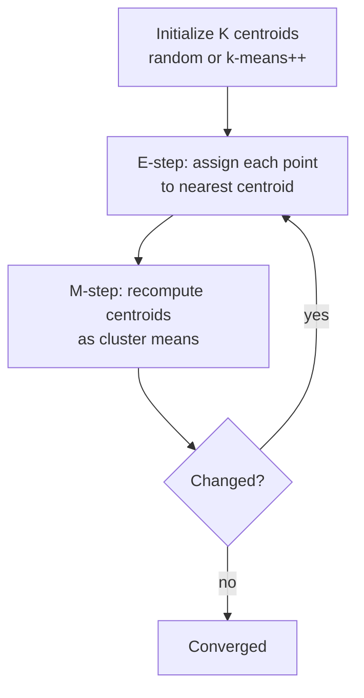
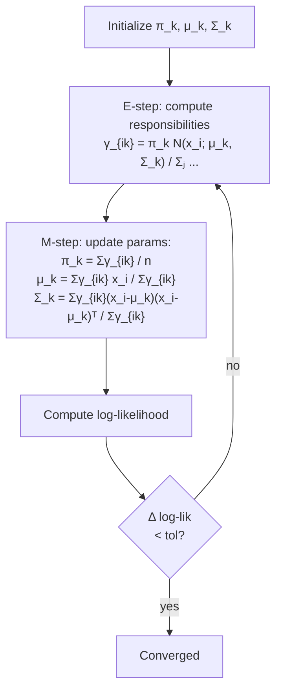
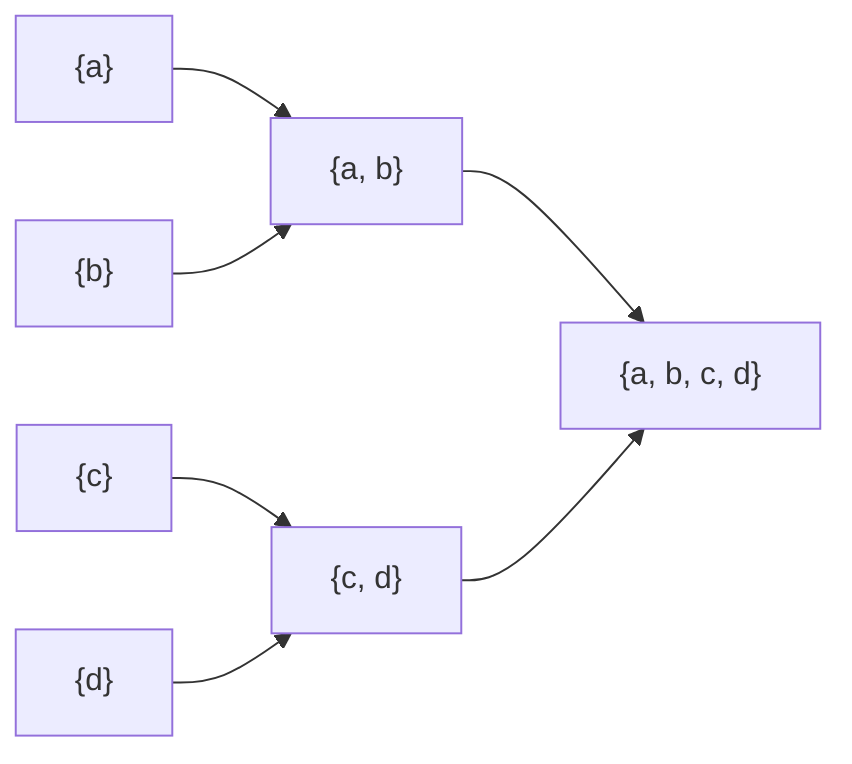

# 1 - Clustering, EM, and k-means

[toc]

> **TL;DR:** Clustering partitions unlabeled data into groups where intra-group points are similar and inter-group points are not. *k-means* is the workhorse — assign each point to its nearest centroid, recompute centroids, repeat — minimizing within-cluster sum of squares. *Expectation-Maximization (EM)* is the principled generalization: alternate between probabilistic *soft assignments* (E-step) and *parameter updates* (M-step) to maximize the data likelihood under a latent-variable model like a Gaussian Mixture Model. Hierarchical clustering and MDL-driven model selection round out the toolkit.

## Vocabulary

**Clustering**

```math
\mathcal{C} = \{C_1, \ldots, C_K\}, \quad \bigcup_k C_k = \mathcal{X}, \quad C_k \cap C_{k'} = \emptyset
```

A partition of the dataset into $K$ disjoint groups (hard clustering) or a soft assignment of each point to multiple groups (soft clustering).

---

**Distance / similarity measure**

```math
d : \mathcal{X} \times \mathcal{X} \to \mathbb{R}_{\ge 0}
```

How "close" two points are. Euclidean for continuous features, Hamming / Jaccard for binary, cosine for high-dimensional sparse, edit distance for strings.

---

**Centroid**

```math
\boldsymbol{\mu}_k = \frac{1}{|C_k|} \sum_{\mathbf{x}_i \in C_k} \mathbf{x}_i
```

The mean of a cluster's members. k-means' representative point.

---

**Latent variable**

A random variable that exists in the generative model but isn't directly observed (e.g., the cluster identity of each point in a GMM).

---

**Expectation-Maximization (EM)**

Iterative algorithm that alternates *E-step* (compute posterior over latents given current params) and *M-step* (re-estimate params given latents). Each iteration is guaranteed to not decrease the data log-likelihood.

---

**Gaussian Mixture Model (GMM)**

```math
P(\mathbf{x}) = \sum_{k=1}^K \pi_k\, \mathcal{N}(\mathbf{x}; \boldsymbol{\mu}_k, \Sigma_k)
```

A density model that sums weighted Gaussians. Fit with EM. k-means is its special case (spherical equal-variance, hard assignments).

---

**Hierarchical clustering**

Builds a tree (*dendrogram*) of nested cluster memberships. *Agglomerative* (bottom-up: merge closest pairs) or *divisive* (top-down: split clusters).

---

**MDL (Minimum Description Length)**

```math
\text{MDL}(\text{model}) = -\log P(\text{data} \mid \text{model}) + \frac{c}{2}\log n
```

A model-selection criterion: pick the model that minimizes data encoding length plus model complexity. The information-theoretic cousin of BIC.

## Intuition

Imagine a 2D plot of points with no labels. Your eye groups them automatically — three blobs over there, a long stretched ridge there, scattered noise in between. Clustering algorithms encode this perceptual grouping mathematically: every algorithm makes some assumption about what "groups" look like (round blobs? elongated? hierarchical?) and then optimizes a corresponding criterion.

*k-means* is the simplest and the most widely used. Pick $K$ centroids, assign each point to its nearest one, recompute centroids as the means of their assignments, repeat. Five lines of pseudocode, finite convergence on any dataset, and — surprisingly — strong baseline performance for round-blob data. Its limitations (assumes spherical clusters of equal size, requires $K$ in advance, sensitive to initialization, hard assignments) are exactly what every other clustering algorithm tries to relax.

*EM* generalizes k-means probabilistically. Replace "nearest centroid" with "posterior probability of each cluster given the point under a generative model," and "recompute mean" with "MLE update of model parameters given the soft assignments." For a Gaussian Mixture Model, the soft assignments are the *responsibilities*, and the M-step updates means, covariances, and mixing weights. The result is a probability *density* over the data, not just a partition — letting you compute likelihoods, sample new points, and handle uncertain assignments.

## k-means — the algorithm



### Objective — within-cluster sum of squares (WCSS)

```math
J(\boldsymbol{\mu}, \mathbf{r}) = \sum_{i=1}^n \sum_{k=1}^K r_{ik} \|\mathbf{x}_i - \boldsymbol{\mu}_k\|^2
```

where $r_{ik} \in \{0, 1\}$ indicates whether point $i$ belongs to cluster $k$ (one-hot, $\sum_k r_{ik} = 1$).

The algorithm alternates:

```math
\text{E: } r_{ik}^* = \mathbb{1}[k = \arg\min_j \|\mathbf{x}_i - \boldsymbol{\mu}_j\|^2]
```

```math
\text{M: } \boldsymbol{\mu}_k^* = \frac{1}{|C_k|}\sum_{i : r_{ik} = 1} \mathbf{x}_i
```

Each step is *coordinate descent* — reducing $J$ holding the other variable fixed. $J$ is bounded below, so the algorithm converges, but it can converge to a *local* minimum.

### Implementation

```python
import numpy as np

def kmeans(X: np.ndarray, K: int, n_iter: int = 100, seed: int = 0,
           tol: float = 1e-4) -> tuple[np.ndarray, np.ndarray, float]:
    rng = np.random.default_rng(seed)
    n, d = X.shape
    centroids = X[rng.choice(n, K, replace=False)].copy()
    for _ in range(n_iter):
        # E-step: assign to nearest centroid
        dists = ((X[:, None, :] - centroids[None, :, :]) ** 2).sum(axis=-1)
        labels = dists.argmin(axis=1)
        # M-step: recompute centroids
        new_centroids = np.array([X[labels == k].mean(axis=0) if (labels == k).any()
                                  else centroids[k] for k in range(K)])
        if np.linalg.norm(new_centroids - centroids) < tol:
            break
        centroids = new_centroids
    wcss = float(((X - centroids[labels]) ** 2).sum())
    return labels, centroids, wcss

# Demo
rng = np.random.default_rng(0)
X = np.vstack([rng.normal((0, 0), 1, (100, 2)),
               rng.normal((5, 5), 1, (100, 2)),
               rng.normal((0, 5), 1, (100, 2))])

labels, centers, wcss = kmeans(X, K=3)
print(f"WCSS = {wcss:.1f}")
```

### Initialization — k-means++

Random initialization sometimes places multiple centroids near each other, leading to bad local minima. *k-means++* picks initial centroids greedily:

1. Pick one point uniformly at random as the first centroid.
2. For each subsequent centroid, pick a point with probability proportional to its squared distance to the *nearest existing centroid*.

This spreads centroids out, giving much more reliable convergence. Default in `sklearn.cluster.KMeans`.

### Choosing $K$

k-means has no built-in mechanism to pick $K$. Heuristics:

1. **Elbow plot** — plot WCSS as a function of $K$, look for the "elbow" where it stops dropping sharply.
2. **Silhouette score** — measures intra-cluster cohesion vs inter-cluster separation. Pick $K$ that maximizes silhouette.
3. **Gap statistic** — compare WCSS to that of a null-reference distribution; pick the $K$ with the largest gap.
4. **MDL / BIC** — for GMMs, model selection via information criteria.

> [!IMPORTANT]
> "What's the right $K$?" is often the *wrong* question. There may be no canonical "right" $K$ — different choices reveal different structure. Combine with domain knowledge: a marketing-segmentation use case may demand 5–10 clusters because that's what the business can act on, regardless of what the elbow says.

## EM and Gaussian Mixture Models



### The objective — log-likelihood under a mixture

```math
\log P(D \mid \theta) = \sum_i \log \sum_k \pi_k\, \mathcal{N}(\mathbf{x}_i; \boldsymbol{\mu}_k, \Sigma_k)
```

The sum-inside-log is the bane of direct optimization. EM solves it by introducing latent assignments $z_i \in \{1, \ldots, K\}$ and iterating:

- **E-step**: compute the posterior $\gamma_{ik} = P(z_i = k \mid \mathbf{x}_i, \theta_\text{old})$.
- **M-step**: update $\theta$ to maximize the *expected complete-data log-likelihood*.

### EM update equations for GMM

```math
\gamma_{ik} = \frac{\pi_k\, \mathcal{N}(\mathbf{x}_i; \boldsymbol{\mu}_k, \Sigma_k)}{\sum_j \pi_j\, \mathcal{N}(\mathbf{x}_i; \boldsymbol{\mu}_j, \Sigma_j)}
```

```math
N_k = \sum_i \gamma_{ik}
```

```math
\pi_k^\text{new} = \frac{N_k}{n}, \quad \boldsymbol{\mu}_k^\text{new} = \frac{1}{N_k}\sum_i \gamma_{ik}\, \mathbf{x}_i, \quad \Sigma_k^\text{new} = \frac{1}{N_k}\sum_i \gamma_{ik}\, (\mathbf{x}_i - \boldsymbol{\mu}_k^\text{new})(\mathbf{x}_i - \boldsymbol{\mu}_k^\text{new})^\top
```

These are exactly the *weighted MLE* of a Gaussian — weights being the responsibilities. The structure mirrors k-means: assignment step (soft this time), update step (weighted mean / covariance).

```python
from scipy.stats import multivariate_normal
import numpy as np

def gmm_em(X: np.ndarray, K: int, n_iter: int = 100, tol: float = 1e-6) -> dict:
    n, d = X.shape
    rng = np.random.default_rng(0)
    # Initialize: random data points as means, identity covariance, uniform weights
    mu = X[rng.choice(n, K, replace=False)].copy()
    Sigma = np.array([np.eye(d) for _ in range(K)])
    pi = np.full(K, 1 / K)
    ll_prev = -np.inf
    for _ in range(n_iter):
        # E-step
        gamma = np.zeros((n, K))
        for k in range(K):
            gamma[:, k] = pi[k] * multivariate_normal.pdf(X, mu[k], Sigma[k] + 1e-6 * np.eye(d))
        ll = np.log(gamma.sum(axis=1) + 1e-300).sum()
        gamma /= gamma.sum(axis=1, keepdims=True)
        # M-step
        Nk = gamma.sum(axis=0)
        pi = Nk / n
        for k in range(K):
            mu[k] = (gamma[:, k:k+1] * X).sum(axis=0) / Nk[k]
            diff = X - mu[k]
            Sigma[k] = (gamma[:, k:k+1] * diff).T @ diff / Nk[k]
        if abs(ll - ll_prev) < tol:
            break
        ll_prev = ll
    return {"pi": pi, "mu": mu, "Sigma": Sigma, "gamma": gamma, "log_lik": ll}
```

### k-means as a special case of GMM-EM

If you force:
- All $\Sigma_k = \sigma^2 I$ (spherical, equal variance),
- $\sigma^2 \to 0$,
- Responsibilities $\gamma_{ik}$ collapse to one-hot.

then GMM-EM is identical to k-means. EM with soft assignments is the principled generalization; k-means is a fast approximation when you don't need probabilities or cluster shapes.

## Hierarchical clustering



### Agglomerative (bottom-up)

1. Each point starts as its own cluster.
2. Find the two closest clusters (by linkage criterion); merge them.
3. Repeat until one cluster remains. Output is a *dendrogram*.

### Linkage criteria

| Linkage | Distance between clusters $A, B$ | Effect |
| :--- | :--- | :--- |
| Single | $\min_{a \in A, b \in B} d(a, b)$ | Chains; can produce long elongated clusters |
| Complete | $\max_{a \in A, b \in B} d(a, b)$ | Compact, ball-like clusters |
| Average | $\frac{1}{|A||B|}\sum_{a, b} d(a, b)$ | Compromise; widely used |
| Ward | Increase in within-cluster variance | Minimizes WCSS like k-means |

Cutting the dendrogram at different heights yields different numbers of clusters — no need to commit to $K$ in advance.

### Complexity

Naive agglomerative: $O(n^3)$ time, $O(n^2)$ memory (pairwise distance matrix). Limits practical use to $n \le 10^4$. Approximate methods (BIRCH, mini-batch hierarchical) extend to larger data.

## MDL and clustering — picking $K$

```math
\text{MDL}(K) = -\log P(D \mid \hat{\theta}_K) + \frac{c(K)}{2}\log n
```

For GMM with $K$ components in $d$ dimensions, the number of free parameters is roughly $c(K) = K(d + d(d+1)/2 + 1) - 1$ (means + covariances + mixing weights, minus one for the constraint). Pick the $K$ minimizing MDL.

> [!TIP]
> MDL / BIC are the principled way to pick $K$ for GMMs. For raw k-means there's no likelihood — use the silhouette score or elbow heuristics instead. BIC tends to underestimate $K$; AIC tends to overestimate; the right choice depends on whether you're prioritizing parsimony or fit.

## Other clustering algorithms worth knowing

| Algorithm | Strength | Weakness |
| :--- | :--- | :--- |
| **DBSCAN** | No $K$ needed; finds arbitrary shapes; handles noise | $\epsilon$ / `min_samples` parameters need tuning |
| **HDBSCAN** | DBSCAN + hierarchical; very robust | Slower than DBSCAN |
| **Mean-shift** | No $K$; finds density peaks | Slow; bandwidth choice |
| **Spectral** | Handles non-convex clusters | $O(n^3)$ for eigendecomposition |
| **Affinity propagation** | No $K$; works on similarity matrices | $O(n^2)$ memory |

For *non-spherical* clusters or unknown $K$, prefer DBSCAN / HDBSCAN over k-means. The right algorithm is the one whose inductive bias matches your data.

## Choosing similarity measures

Match the measure to the data:

| Data type | Recommended distance |
| :--- | :--- |
| Continuous features, similar scales | Euclidean (default) |
| Continuous features, different scales | Standardize first, then Euclidean |
| High-d sparse (text TF-IDF, embeddings) | Cosine — magnitudes are noise |
| Binary / set | Jaccard, Hamming |
| Strings / sequences | Edit distance, longest common subsequence |
| Time series | Dynamic time warping (DTW) |

The wrong distance can wreck a clustering; the right one can make even a simple algorithm work.

## In practice

> [!IMPORTANT]
> **Standardize features before k-means or GMM.** Both are distance-based; without standardization, the feature with the largest numeric range dominates the partition. Use `StandardScaler` (zero mean, unit variance) for continuous data; for very heavy-tailed features, log-transform first.

> [!CAUTION]
> Run k-means with multiple random initializations (`n_init=10` is sklearn's default) and pick the best by WCSS. A single run can land in a bad local optimum, especially for $K \ge 5$.

> [!NOTE]
> *Mini-batch k-means* trades a small WCSS increase for orders-of-magnitude speedup on large datasets. Use it for $n > 10^5$. *Mini-batch GMM* (online EM) extends to streaming data. Both are first-class options in modern toolkits.

A common production workflow: fit k-means with $K$ = 10–50 to *embeddings* of high-dimensional data ([Multimodal Models and Embeddings](../../AI-Engineering/1-foundations/4-multimodal-and-embeddings.md)), use the centroids as a small set of "prototypes" for retrieval, classification, or visualization. This is the clustering-in-embedding-space pattern behind product categorization, customer segmentation, and visual concept discovery.

## Pitfalls

- **"k-means is a probabilistic model."** It isn't — it's a deterministic partitioning. GMM is the probabilistic generalization.
- **"Run k-means once; trust the answer."** Random initialization can drop you in a bad local minimum. Multiple runs + best-by-WCSS is mandatory.
- **"WCSS always decreases with $K$, so bigger $K$ is better."** It does, monotonically. WCSS = 0 when $K = n$ (each point its own cluster). The objective doesn't pick $K$; you do.
- **"Hierarchical clustering scales fine."** $O(n^3)$ runtime, $O(n^2)$ memory. Practical only up to $\sim 10^4$ points without specialized methods.
- **"GMM clusters are circular."** Only if you constrain $\Sigma_k = \sigma_k^2 I$. With full covariance, GMM can fit arbitrary ellipsoids — but with $O(d^2)$ parameters per cluster, you need lots of data.

## Exercises

### Exercise 1 — k-means by hand

Run two iterations of k-means with $K = 2$ on the 1D data $\{1, 2, 3, 8, 9, 10\}$, initial centroids $\mu_1 = 1, \mu_2 = 10$.

#### Solution

**Iter 1, E-step:** assign each point to its nearest centroid.
- 1 → $\mu_1$
- 2 → $\mu_1$
- 3 → $\mu_1$
- 8 → $\mu_2$
- 9 → $\mu_2$
- 10 → $\mu_2$

**M-step:** recompute means.
- $\mu_1^{\text{new}} = (1 + 2 + 3)/3 = 2$
- $\mu_2^{\text{new}} = (8 + 9 + 10)/3 = 9$

**Iter 2, E-step:** with new centroids, assignments are unchanged ($\mu_1 = 2$ wins for {1,2,3}; $\mu_2 = 9$ wins for {8,9,10}).

**M-step**: centroids unchanged. **Converged.**

Final WCSS:

```math
J = (1-2)^2 + (2-2)^2 + (3-2)^2 + (8-9)^2 + (9-9)^2 + (10-9)^2 = 4
```

This is a textbook clean separation; in 2D with elongated clusters or with K=3 on 4 clusters, convergence is rarely so clean.

---

### Exercise 2 — Why does EM never decrease the log-likelihood?

Sketch a proof that each EM iteration satisfies $\log P(D \mid \theta_\text{new}) \ge \log P(D \mid \theta_\text{old})$.

#### Solution

Define the *evidence lower bound* (ELBO) using any distribution $q(z)$ over latents:

```math
\log P(D \mid \theta) \ge \mathbb{E}_{q(z)}[\log P(D, z \mid \theta)] - \mathbb{E}_{q(z)}[\log q(z)] = \text{ELBO}(q, \theta)
```

with equality iff $q(z) = P(z \mid D, \theta)$ (Jensen's inequality).

- **E-step** sets $q(z) = P(z \mid D, \theta_\text{old})$, achieving equality: $\text{ELBO}(q, \theta_\text{old}) = \log P(D \mid \theta_\text{old})$.
- **M-step** maximizes ELBO over $\theta$ keeping $q$ fixed: $\text{ELBO}(q, \theta_\text{new}) \ge \text{ELBO}(q, \theta_\text{old})$.

Combining: $\log P(D \mid \theta_\text{new}) \ge \text{ELBO}(q, \theta_\text{new}) \ge \text{ELBO}(q, \theta_\text{old}) = \log P(D \mid \theta_\text{old})$.

So EM is monotone non-decreasing in log-likelihood. It can stop at local maxima or saddles — not all critical points are global — but each iteration is "safe."

---

### Exercise 3 — Detecting bad initialization

You run k-means with $K = 4$ and observe two of the centroids end up nearly identical, while the other two are far apart. What's happening and how do you fix it?

#### Solution

**What's happening.** The two close centroids initialized near each other and got assigned tiny / overlapping clusters; the cost of separating them is locally higher than staying near each other. k-means landed in a *local* minimum where one true cluster is split among multiple centroids and one true cluster is missing entirely.

**Fixes.**

1. **k-means++ initialization** — actively spreads initial centroids by sampling proportional to squared distance from existing ones. Default in sklearn; usually sufficient.
2. **Many random restarts** — `n_init=50`, pick the best by WCSS.
3. **Initialize with hierarchical clustering first** — run cheap agglomerative clustering on a sample, use the centroids as k-means init.
4. **Use a different algorithm** — DBSCAN doesn't have $K$; GMM-EM has soft assignments that escape local minima more easily.

In practice: `KMeans(n_clusters=K, init='k-means++', n_init=10)` defaults are well-tuned.

---

### Exercise 4 — When to choose GMM over k-means

Give three concrete situations where GMM-EM should be preferred to k-means, and one where k-means wins.

#### Solution

**GMM wins:**

1. **Elliptical / non-spherical clusters.** GMM with full covariance handles different cluster shapes and orientations; k-means assumes axis-aligned spheres.

2. **Uncertain assignments.** GMM produces *probabilities* over clusters per point. Useful when downstream tasks want soft assignments (e.g., representing a point as a mixture of topics).

3. **You want to sample new points.** GMM is a generative model; you can sample from each component. k-means is just a partition — no sampling.

**k-means wins:**

- **Large-scale, well-separated, roughly spherical clusters.** k-means is $O(nKd)$ per iteration, GMM is $O(nKd^2)$ — full covariance dominates for high-d data. If your clusters look spherical and you need clustering on $n = 10^7$ points, mini-batch k-means is the right tool.

The general principle: more flexible model = more parameters = more variance. GMM is bias-better but variance-worse than k-means; the right choice depends on data size and complexity.

## Sources

- Ramakrishnan, G. & Nagesh, A. (2011). *CS725: Foundations of Machine Learning — Lecture Notes*. IIT Bombay. §12, §13.
- Lloyd, S. (1982). *Least squares quantization in PCM*. IEEE Trans. Information Theory.
- MacQueen, J. (1967). *Some methods for classification and analysis of multivariate observations*.
- Dempster, A. P., Laird, N. M., & Rubin, D. B. (1977). *Maximum likelihood from incomplete data via the EM algorithm*. JRSS B.
- Arthur, D. & Vassilvitskii, S. (2007). *k-means++: The Advantages of Careful Seeding*. SODA.
- Ester, M. et al. (1996). *A density-based algorithm for discovering clusters in large spatial databases* (DBSCAN). KDD.
- Bishop, C. M. (2006). *Pattern Recognition and Machine Learning*. Springer. Ch. 9.

## Related

- [Probability Primer](../1-foundations/2-probability-primer.md)
- [Estimation and Maximum Likelihood](../1-foundations/3-estimation-and-mle.md)
- [Linear Algebra Essentials](../1-foundations/5-linear-algebra-essentials.md)
- [Gaussian Discriminant Analysis](../2-supervised-learning/3-gaussian-discriminant-analysis.md)
- [2 - Non-parametric Density Estimation](./2-non-parametric-density-estimation.md)
- [5 - Feature Selection and Dimensionality Reduction](./5-feature-selection-and-dimensionality-reduction.md)
