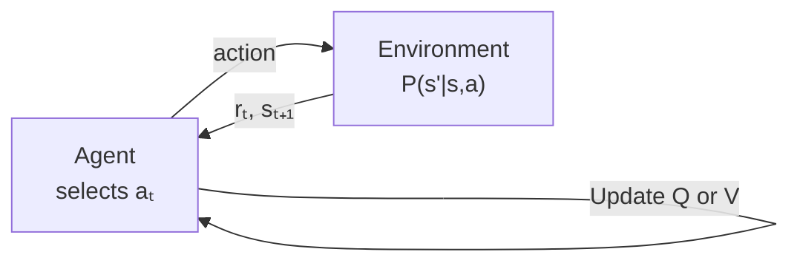

# 1 - Reinforcement Learning Foundations

[toc]

> **TL;DR:** Reinforcement learning frames sequential decision-making as an agent optimising cumulative reward by interacting with an environment — no labelled dataset, just trial and feedback. The core formalism is the Markov Decision Process (MDP); the core algorithms are dynamic programming (policy/value iteration) for known models and temporal-difference methods (Q-learning, SARSA) for unknown ones. Unlike supervised learning, the agent must trade off exploiting what it knows against exploring what it does not.

## Vocabulary

- **MDP** (Markov Decision Process) — a tuple (S, s₁, A, P, R, γ) defining the interaction between agent and environment.

---

- **State** (s ∈ S) — a complete summary of the environment satisfying the Markov property: the future depends only on the present state, not the history.

---

- **Action** (a ∈ A) — a control signal the agent sends to the environment at each time step.

---

- **Transition function** (P) — P(s' | s, a) gives the probability of reaching state s' after taking action a in state s.

```math
P_{s,a}(s') = \Pr(s_{t+1} = s' \mid s_t = s,\, a_t = a)
```

---

- **Reward function** (R) — the scalar signal R(s, a, s') the environment emits after each transition; the agent tries to maximise its long-run sum.

---

- **Policy** (π) — the agent's decision rule; a stationary policy is a mapping π: S → A (deterministic) or π: S → Δ(A) (stochastic).

---

- **Discounted return** (G_t) — the sum of geometrically-discounted future rewards from time t onwards.

```math
G_t = \sum_{k=0}^{\infty} \gamma^k r_{t+k}
```

---

- **Value function** (V^π) — expected discounted return from state s when following policy π.

```math
V^\pi(s) = \mathbb{E}\!\left[\sum_{t=0}^{\infty} \gamma^t r_t \,\Big|\, s_0 = s,\, \pi\right]
```

---

- **Action-value function** (Q^π) — expected return from state s, taking action a, then following π.

```math
Q^\pi(s, a) = \mathbb{E}\!\left[\sum_{t=0}^{\infty} \gamma^t r_t \,\Big|\, s_0 = s,\, a_0 = a,\, \pi\right]
```

---

- **Bellman equation** — a recursive consistency condition on the value function; the value of a state equals the immediate reward plus discounted value of the successor state.

---

- **Temporal-difference (TD) learning** — updates a value estimate using the difference between a bootstrapped target and the current estimate, without waiting for episode termination.

---

- **ε-greedy** — the standard exploration policy: with probability ε pick a random action; with probability 1 − ε pick the greedy action.

---

- **On-policy vs off-policy** — on-policy methods (SARSA) evaluate the same policy that is executed; off-policy methods (Q-learning) evaluate the optimal policy regardless of the behaviour policy.

---

## Intuition

Think of a robot navigating a maze. At every junction the robot picks a direction; it receives a positive reward when it exits and a small negative cost for each step. The robot's goal is to find the shortest path — but it starts with no map. It must simultaneously *explore* (try unfamiliar corridors) and *exploit* (repeat corridors that led somewhere useful). The Markov property says the robot needs only to know *where it is now*, not *how it got there*, to make an optimal decision.

Dynamic programming solves the problem when the map (transition probabilities P and reward function R) is fully known. Q-learning and SARSA solve it when the map must be inferred from experience.



**Figure:** The RL interaction loop. The agent observes state, selects an action, receives a reward and the next state, and updates its value estimates.

## How it works

The theory decomposes neatly into four layers: (1) the MDP formalism that defines *what* is being optimised; (2) the Bellman equations that characterise the optimal solution; (3) dynamic-programming algorithms that compute it given a model; and (4) model-free algorithms that estimate it from samples alone.

### The MDP Formalism

A Markov Decision Process is completely specified by the tuple (S, s₁, A, P, R, γ). The agent starts in state s₁, picks actions according to its policy, transitions stochastically, and accumulates discounted reward. The discount factor γ ∈ [0, 1) ensures the return G_t is a finite sum even for infinite-horizon problems — it also encodes how much the agent should prefer near-term reward over distant reward.

The **Markov property** is the critical assumption: P(s_{t+1} | s_t, a_t, s_{t-1}, ...) = P(s_{t+1} | s_t, a_t). History beyond the current state is irrelevant for predicting the future. This is why the state must be a *sufficient statistic* of the trajectory — if the raw observation is partial (e.g., a camera frame), the true MDP state might be a stack of recent frames.

> [!IMPORTANT]
> The Markov property is an assumption about the *state representation*, not the environment. If your state is a single RGB frame from an Atari game, the ball's velocity is hidden — the state is non-Markov. DQN fixes this by stacking 4 consecutive frames, which is approximately Markov for most Atari games.

### Bellman Equations

The value function V^π satisfies a self-consistency (Bellman) equation. In matrix–vector form, with r_π the vector of expected immediate rewards and P_π the row-stochastic transition matrix induced by π:

```math
v_\pi = r_\pi + \gamma P_\pi\, v_\pi
```

This is a linear system with a unique solution:

```math
v_\pi = (I - \gamma P_\pi)^{-1} r_\pi
```

The **Bellman optimality equation** replaces the policy-dependent transition with a max over actions:

```math
v_*(s) = \max_{a}\!\left[R_{s,a} + \gamma \sum_{s'} P_{s,a}(s')\, v_*(s')\right]
```

This is a nonlinear fixed-point equation. The operator T* defined by the right-hand side is a contraction in the sup-norm (with factor γ < 1), so iterating it from any starting point converges to the unique optimal value function v*.

### Policy Iteration

Policy iteration alternates between two exact steps until convergence. Starting from any policy π₀:

**Step 1 — Policy Evaluation:** solve the linear system v_π = (I − γP_π)^{−1} r_π to get the exact value function for the current policy. For small state spaces this is a direct matrix inversion; for larger ones it can be iterative Bellman backup until ‖v^{(k+1)} − v^{(k)}‖_∞ < ε.

**Step 2 — Policy Improvement:** update the policy greedily — for every state s, set π_{new}(s) = argmax_a [R_{s,a} + γ Σ_{s'} P_{s,a}(s') v_π(s')]. This is guaranteed to produce a policy that is at least as good as the previous one (the policy improvement theorem). The algorithm terminates when the greedy step produces no change — at that point the policy satisfies Bellman optimality and is globally optimal.

Policy iteration converges in a finite number of steps (at most |A|^|S| policies exist) and often converges far faster in practice — the worked robot example from the de Freitas course converges in exactly 2 iterations.

### Value Iteration

Value iteration directly iterates the Bellman optimality operator, bypassing the linear-system solve of policy evaluation. Starting from any v^{(0)}:

```math
v^{(k+1)}(s) = \max_{a}\!\left[R_{s,a} + \gamma \sum_{s'} P_{s,a}(s')\, v^{(k)}(s')\right]
```

Each sweep performs one backup per state. Because T* is a γ-contraction, ‖v^{(k)} − v*‖_∞ ≤ γ^k ‖v^{(0)} − v*‖_∞ — convergence is guaranteed but linear, with rate γ. Extract the greedy policy from the converged v* to recover π*.

Value iteration is simpler to implement than policy iteration for large state spaces because it avoids the inner linear solve; the trade-off is that it requires more outer iterations.

### Q-Learning

Q-learning is the workhorse **model-free** off-policy algorithm. Instead of estimating V(s), it directly estimates Q*(s, a), the optimal action-value function. The update rule is:

```math
\hat{Q}(s_t, a_t) \leftarrow \hat{Q}(s_t, a_t) + \alpha\!\left[r_t + \gamma \max_{a'} \hat{Q}(s_{t+1}, a') - \hat{Q}(s_t, a_t)\right]
```

The bracketed term is the **TD error** δ_t: the difference between the bootstrapped target and the current estimate. The key property is that the target uses *max* over the next state, which estimates the optimal policy independently of whatever action was actually taken. This makes Q-learning **off-policy**: you can update toward the greedy policy even while executing an exploratory ε-greedy policy.

Under mild conditions (all (s, a) pairs visited infinitely often; learning rates satisfying the Robbins–Monro conditions: Σ α_t = ∞, Σ α_t² < ∞), tabular Q-learning converges to Q* with probability 1.

> [!NOTE]
> Q-learning requires the tabular Q̂(s, a) to be represented explicitly — infeasible for continuous or high-dimensional state spaces. Deep Q-Networks (DQN) replace the table with a neural network, which requires additional stabilisation techniques (experience replay, target networks).

### SARSA

SARSA (State–Action–Reward–State–Action) is the **on-policy** counterpart to Q-learning. The update uses the action *actually taken* at time t+1 rather than the greedy action:

```math
\hat{Q}(s_t, a_t) \leftarrow \hat{Q}(s_t, a_t) + \alpha\!\left[r_t + \gamma \hat{Q}(s_{t+1}, a_{t+1}) - \hat{Q}(s_t, a_t)\right]
```

where a_{t+1} is sampled from the current policy π(· | s_{t+1}). SARSA converges to the optimal policy as long as the exploration schedule is decayed (ε → 0), but it is sensitive to the exploration policy during training. In environments with "cliffs" (risky states), SARSA learns a safer path that avoids risky regions even under ε-greedy exploration; Q-learning learns the theoretically shorter path but gets burnt by the exploration noise.

### Exploration vs Exploitation

Without exploration, the agent can get stuck in local optima — committing to the first positive-reward action it ever finds. The classic exploration strategies are:

- **ε-greedy**: the simplest scheme. Take a random action with probability ε, greedy with 1 − ε. Anneal ε from 1 to 0.1 over training.
- **Boltzmann (softmax) exploration**: sample actions proportionally to exp(Q(s,a) / τ), where temperature τ controls randomness.
- **Upper Confidence Bound (UCB)**: prefer actions that are either high-value *or* under-explored, by adding a bonus proportional to 1 / √(count(s, a)).
- **Thompson sampling / posterior sampling**: sample a Q function from a posterior distribution and act greedily — naturally balances exploration and exploitation.

> [!TIP]
> In practice, ε-greedy annealed from 1.0 to 0.1 over 1M frames is the standard starting point (as used in DQN). UCB-style bonuses help in environments with sparse rewards where random exploration fails. For continuous action spaces, entropy regularisation (SAC) is preferred over ε-greedy.

## Math

### Discounted Return and Convergence

The discount factor γ < 1 guarantees G_t is bounded. For rewards |r_t| ≤ R_max:

```math
|G_t| \leq \sum_{k=0}^{\infty} \gamma^k R_{\max} = \frac{R_{\max}}{1 - \gamma}
```

### Bellman Operator Contraction

Define the Bellman optimality operator (T*v)(s) = max_a [R_{s,a} + γ Σ_{s'} P_{s,a}(s') v(s')]. It is a γ-contraction in the sup-norm:

```math
\|T^* v - T^* u\|_\infty \leq \gamma \|v - u\|_\infty
```

By Banach's fixed-point theorem, iterating T* from any v^{(0)} converges to the unique fixed point v* at a geometric rate.

### Policy Improvement Theorem

If π' is the greedy policy with respect to V^π, then ∀s: V^{π'}(s) ≥ V^π(s), with equality iff π is already optimal. This makes policy iteration monotonically improve and guarantees termination.

```math
V^{\pi'}(s) = \max_a \left[R_{s,a} + \gamma \sum_{s'} P_{s,a}(s') V^\pi(s')\right] \geq V^\pi(s)
```

### Q-Learning Convergence Condition

Let α_t(s,a) be the learning rate at step t for pair (s,a). Q-learning converges w.p.1 to Q* if:

```math
\sum_t \alpha_t(s,a) = \infty, \quad \sum_t \alpha_t(s,a)^2 < \infty, \quad \forall s, a
```

and all state-action pairs are visited infinitely often.

## Real-world example

Consider the three-state robot MDP from the Oxford lecture: states are **Standing** (s=1), **Moving** (s=2), **Fallen** (s=3). Actions are **Slow** and **Fast**. The robot gets a reward of 1 in Moving/Fallen (for motion) and 0 for Standing. With γ = 0.1, policy iteration converges in 2 iterations. Below is a compact Python implementation that verifies this analytically and then solves the same MDP with tabular Q-learning.

```python
import numpy as np
from typing import Optional

# ─── MDP definition ───────────────────────────────────────────────
# States: 0=Standing, 1=Moving, 2=Fallen
# Actions: 0=Slow, 1=Fast

# Transition matrices P[a][s, s'] = Pr(s'|s,a)
P = np.zeros((2, 3, 3))
# Slow action
P[0] = np.array([
    [0.5, 0.5, 0.0],  # Standing -slow-> Standing|Moving
    [0.0, 0.5, 0.5],  # Moving   -slow-> Moving|Fallen
    [0.5, 0.0, 0.5],  # Fallen   -slow-> Standing|Fallen
])
# Fast action
P[1] = np.array([
    [0.0, 0.7, 0.3],  # Standing -fast-> Moving|Fallen
    [0.0, 0.4, 0.6],  # Moving   -fast-> Moving|Fallen
    [0.3, 0.0, 0.7],  # Fallen   -fast-> Standing|Fallen
])
# Reward r[a, s] = expected reward for action a in state s
R = np.array([
    [0.0, 1.0, 1.0],  # Slow
    [0.0, 1.0, 1.0],  # Fast
])
gamma = 0.1
n_states, n_actions = 3, 2


def policy_eval(pi: np.ndarray, gamma: float) -> np.ndarray:
    """Exact policy evaluation via matrix inversion."""
    # Build P_pi[s,s'] and r_pi[s]
    P_pi = np.array([P[pi[s], s, :] for s in range(n_states)])
    r_pi = np.array([R[pi[s], s] for s in range(n_states)])
    # v = (I - gamma * P_pi)^{-1} r_pi
    return np.linalg.solve(np.eye(n_states) - gamma * P_pi, r_pi)


def policy_improve(V: np.ndarray) -> np.ndarray:
    """Greedy policy improvement."""
    Q = np.array([
        [R[a, s] + gamma * P[a, s, :] @ V for a in range(n_actions)]
        for s in range(n_states)
    ])  # Q[s, a]
    return np.argmax(Q, axis=1)


def policy_iteration() -> tuple[np.ndarray, np.ndarray]:
    pi = np.zeros(n_states, dtype=int)  # start with Slow everywhere
    for iteration in range(100):
        V = policy_eval(pi, gamma)
        pi_new = policy_improve(V)
        print(f"Iter {iteration+1}: V = {V.round(4)}, policy = {['Slow','Fast'][pi_new[0]]}/{['Slow','Fast'][pi_new[1]]}/{['Slow','Fast'][pi_new[2]]}")
        if np.array_equal(pi_new, pi):
            print("Converged.")
            return pi, V
        pi = pi_new
    return pi, policy_eval(pi, gamma)


def q_learning(
    n_episodes: int = 5000,
    alpha: float = 0.1,
    eps_start: float = 1.0,
    eps_end: float = 0.05,
) -> np.ndarray:
    """Tabular Q-learning on the same robot MDP."""
    Q: np.ndarray = np.zeros((n_states, n_actions))
    rng = np.random.default_rng(42)
    for ep in range(n_episodes):
        eps = max(eps_end, eps_start - ep / n_episodes)
        s = 0  # always start in Standing
        for _ in range(200):
            # epsilon-greedy action
            if rng.random() < eps:
                a = rng.integers(n_actions)
            else:
                a = int(np.argmax(Q[s]))
            # sample next state from transition distribution
            s_next = int(rng.choice(n_states, p=P[a, s]))
            r = R[a, s]
            # Q-learning update
            td_error = r + gamma * np.max(Q[s_next]) - Q[s, a]
            Q[s, a] += alpha * td_error
            s = s_next
    return Q


if __name__ == "__main__":
    print("=== Policy Iteration ===")
    pi_opt, V_opt = policy_iteration()

    print("\n=== Q-Learning ===")
    Q_opt = q_learning()
    print("Q*(s,a):\n", Q_opt.round(4))
    print("Greedy policy:", ["Slow" if np.argmax(Q_opt[s]) == 0 else "Fast" for s in range(n_states)])
```

> [!TIP]
> Policy iteration converges in 2 iterations here because γ = 0.1 makes future rewards nearly irrelevant — the policy mostly cares about immediate reward. With γ = 0.99, you would see more iterations and a more nuanced optimal policy.

## In practice

**State-space explosion.** Tabular methods require storing one value per (s, a) pair. A modest 200×200 pixel game screen at 256 grayscale levels has 256^{40000} states — plainly infeasible. Function approximation (neural networks) is mandatory at that scale.

**Reward shaping.** The reward signal must be designed with care. Sparse rewards (only +1 at goal) make exploration brutally hard; shaped rewards that provide intermediate feedback speed learning but can introduce biases that cause the agent to exploit the shaping rather than the true objective. Always verify agent behaviour against the original unmodified reward.

**Discount factor sensitivity.** γ controls the effective horizon: 1/(1−γ). At γ = 0.99 the agent cares about rewards ∼100 steps ahead; at γ = 0.999 it's ∼1000 steps. High γ makes learning slower (the Bellman contraction factor is worse) and requires more data but produces policies that plan further ahead. Tuning γ is underappreciated.

**Exploration in practice.** Random ε-greedy fails in environments with sparse rewards — the agent may never encounter the rewarding state by accident. Alternatives include curiosity-driven intrinsic rewards, count-based exploration bonuses, or hierarchical RL.

> [!WARNING]
> The convergence proofs for Q-learning require each (s, a) pair to be visited *infinitely often*. In large state spaces with ε-greedy, many pairs will be visited zero times during training. The theoretical guarantee no longer holds — and indeed, tabular Q-learning frequently fails to converge in practice on large problems without function approximation.

## Pitfalls

- **Confusing V* with Q*.** V*(s) = max_a Q*(s,a). V* tells you how good a state is under optimal play; Q*(s,a) tells you how good *a specific action* is. You need Q to extract the greedy policy without a model; you can recover the policy from V only if you have access to the transition model.

- **Ignoring the Markov assumption.** Applying tabular RL to partially observable environments (e.g., single-frame Atari) produces inconsistent value estimates because the same observation maps to multiple hidden states with different true values. The fix is either a richer state representation (frame stacking, recurrent Q-networks) or a full POMDP treatment.

- **Setting γ too close to 1.** γ = 1 is only valid for episodic problems with guaranteed termination. For infinite-horizon problems, γ = 1 makes the sum G_t potentially unbounded and violates contraction conditions.

- **Conflating SARSA and Q-learning convergence.** Both converge to Q* as ε → 0, but SARSA converges to the *optimal ε-greedy policy* for a fixed ε > 0, which differs from Q*. SARSA's safety advantage comes at the cost of not learning the globally optimal policy unless exploration is eventually turned off.

- **Treating ε-greedy exploration as sufficient.** In problems with deep exploration requirements (rewards accessible only after many specific steps), ε-greedy will almost never stumble onto the reward by chance. Posterior-based and intrinsic-reward exploration methods are needed.

## Exercises

### Exercise 1

**The following 2-state MDP has γ = 0.5. State A transitions to B with reward +2 under action "go"; state B transitions to A with reward +1 under action "stay". Both actions are deterministic. Compute V^π for the policy π(A) = go, π(B) = stay using the Bellman equation directly.**

#### Solution 1

Write the Bellman equation for each state under policy π:

```math
V^\pi(A) = 2 + 0.5 \cdot V^\pi(B)
```
```math
V^\pi(B) = 1 + 0.5 \cdot V^\pi(A)
```

Substitute the second into the first:

```math
V^\pi(A) = 2 + 0.5(1 + 0.5 \cdot V^\pi(A)) = 2.5 + 0.25 \cdot V^\pi(A)
```
```math
0.75 \cdot V^\pi(A) = 2.5 \implies V^\pi(A) = \frac{10}{3} \approx 3.33
```
```math
V^\pi(B) = 1 + 0.5 \cdot \frac{10}{3} = 1 + \frac{5}{3} = \frac{8}{3} \approx 2.67
```

In matrix form: v_π = (I − 0.5 P_π)^{−1} r_π with P_π = [[0,1],[1,0]], r_π = [2, 1]. The solution matches.

---

### Exercise 2

**Why does Q-learning converge to the globally optimal Q* while SARSA with fixed ε > 0 does not? Explain in terms of the Bellman target each method uses.**

#### Solution 2

Q-learning's target for the update of Q(s_t, a_t) is:

```math
y_t^{\text{Q}} = r_t + \gamma \max_{a'} Q(s_{t+1}, a')
```

The max operator always bootstraps from the greedy (optimal) policy, regardless of which action a_{t+1} the agent actually takes. This target is an unbiased estimator of the optimal Bellman equation Q*(s,a) = E[r + γ max_{a'} Q*(s',a')], so Q-learning converges to Q* as α and ε are properly annealed.

SARSA's target is:

```math
y_t^{\text{SARSA}} = r_t + \gamma Q(s_{t+1}, a_{t+1})
```

where a_{t+1} is sampled from the *current behaviour policy* — including its ε-greedy random component. With fixed ε > 0, the target includes non-greedy actions with probability ε, so SARSA converges to the optimal value function *for the ε-greedy policy*, not for the greedy policy. As ε → 0, these coincide. As ε → 0 during training (annealing), both methods converge to the same Q*, but at any fixed ε > 0, SARSA's fixed point is suboptimal relative to Q*.

---

### Exercise 3

**Write the value-iteration update for a two-action MDP with three states. Run two iterations by hand starting from v^{(0)} = [0, 0, 0]^T, using the following model: R_{s,a} = 1 for all (s,a); transitions are identity (action a=0 stays in place with prob 0.9, moves to s+1 mod 3 with prob 0.1; action a=1 moves to s+1 mod 3 with prob 0.9, stays with prob 0.1). Use γ = 0.9.**

#### Solution 3

Iteration 1 — v^{(1)}(s) = max_a [R_{s,a} + γ Σ_{s'} P_{s,a}(s') v^{(0)}(s')]:

Since v^{(0)} = [0,0,0], the sum over next states is 0 for all (s,a). Therefore:

```math
v^{(1)}(s) = \max_a [1 + 0.9 \cdot 0] = 1 \quad \forall s
```

So v^{(1)} = [1, 1, 1]^T.

Iteration 2 — now v^{(1)} = [1,1,1], so Σ_{s'} P_{s,a}(s') v^{(1)}(s') = 1 for all (s,a) since both actions transition into states with value 1:

```math
v^{(2)}(s) = \max_a [1 + 0.9 \cdot 1] = 1 + 0.9 = 1.9 \quad \forall s
```

So v^{(2)} = [1.9, 1.9, 1.9]^T. By symmetry, this MDP has a uniform value function. The true v*(s) = R_max / (1 − γ) = 1 / (1 − 0.9) = 10 for all states, and value iteration converges geometrically: v^{(k)} = [1 − 0.9^k] / (1 − 0.9) · [1,1,1]^T = 10(1 − 0.9^k) [1,1,1]^T.

## Sources

- Nando de Freitas, "Machine Learning" (Oxford / UBC lectures), Lecture 16: Reinforcement Learning — Dynamic Programming. Course slides `oxf(16).pdf`.
- de Freitas, "Introduction to Reinforcement Learning", University course slides `air(35).pdf`, slides 1–39.
- Sutton, R.S. & Barto, A.G., *Reinforcement Learning: An Introduction*, 2nd ed. MIT Press, 2018. http://incompleteideas.net/book/the-book.html
- Watkins, C.J.C.H. & Dayan, P., "Q-learning", *Machine Learning* 8(3–4), 1992. https://doi.org/10.1007/BF00992698

## Related

- [2 - Deep Q-Networks](./2-deep-q-networks.md)
- [3 - Policy Gradients and Beyond](./3-policy-gradients-and-beyond.md)
- [2 - Architecture and Model Size](../../AI-Engineering/2-foundation-models/2-architecture-and-model-size.md)
- [3 - Post-Training and Finetuning](../../AI-Engineering/2-foundation-models/3-post-training-and-finetuning.md)
