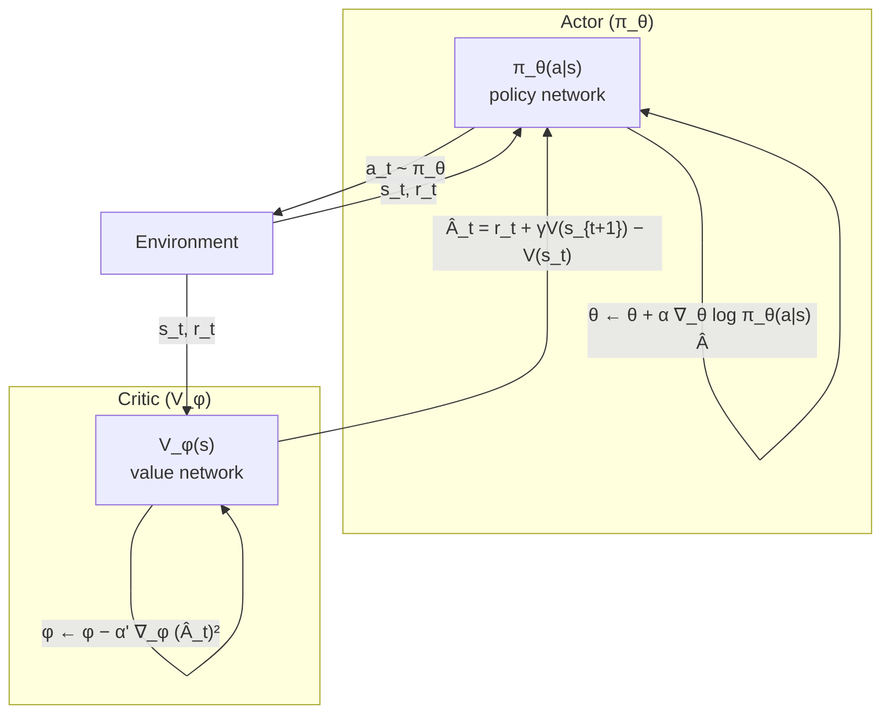

# 3 - Policy Gradients and Beyond

[toc]

> **TL;DR:** Policy gradient methods directly parameterise and optimise the agent's policy π_θ, bypassing value function estimation entirely for the core decision. REINFORCE establishes the foundational gradient estimator; actor-critic architectures reduce variance by introducing a learned baseline (the critic); proximal policy optimisation (PPO) stabilises training by constraining how far the policy moves per update. These methods naturally handle continuous action spaces and stochastic policies — limitations that Q-learning inherits from its discrete argmax. RLHF and RLAIF in modern LLMs are PPO-family methods, making policy gradients arguably the most practically important RL framework today.

## Vocabulary

- **Policy gradient** — the family of RL algorithms that directly compute ∇_θ J(θ) and ascend it, rather than fitting a value function and acting greedily.

---

- **Parameterised policy** (π_θ) — a differentiable function (typically a neural network) mapping states (or observation histories) to action distributions; θ contains all learnable parameters.

---

- **Objective** (J(θ)) — the expected discounted return under the current policy, the quantity policy gradient methods maximise.

```math
J(\theta) = \mathbb{E}_{\tau \sim \pi_\theta}\!\left[\sum_{t=0}^{T} \gamma^t r_t\right]
```

---

- **Log-probability trick** — the algebraic identity ∇_θ p(x;θ) = p(x;θ) ∇_θ log p(x;θ), used to convert the gradient of an expectation into an expectation of a gradient.

---

- **REINFORCE** — Monte Carlo policy gradient algorithm (Williams 1992) that estimates ∇_θ J using complete trajectory returns.

---

- **Score function estimator** — another name for the REINFORCE gradient estimator; ∇_θ log π_θ(a|s) is called the score function.

---

- **Baseline** (b(s)) — any function of the state (but not the action) subtracted from the return in the REINFORCE estimator; does not bias the gradient but can substantially reduce variance.

---

- **Advantage function** (A^π(s,a)) — the surplus value of action a over the average action in state s: A^π(s,a) = Q^π(s,a) − V^π(s).

---

- **Actor** — the component (neural network) that maintains the policy π_θ.

---

- **Critic** — the component that estimates V^π(s) (or Q^π(s,a)); provides the baseline/advantage estimate for the actor update.

---

- **A3C** (Asynchronous Advantage Actor-Critic) — Mnih et al. 2016; multiple parallel workers asynchronously accumulate gradients on shared network parameters, providing data diversity without a replay buffer.

---

- **PPO** (Proximal Policy Optimisation) — Schulman et al. 2017; clips the probability ratio r(θ) = π_θ(a|s) / π_θ_old(a|s) to [1−ε, 1+ε] in the surrogate objective, preventing large destructive policy updates.

---

- **SAC** (Soft Actor-Critic) — Haarnoja et al. 2018; off-policy actor-critic with an entropy regularisation term added to the objective, encouraging exploration while retaining sample efficiency.

---

- **KL constraint** — the TRPO condition that ‖π_θ_new − π_θ_old‖_KL ≤ δ; PPO approximates this with a clipping heuristic.

---

- **RLHF** (Reinforcement Learning from Human Feedback) — the training paradigm for LLMs where a reward model trained on human preferences replaces the game score; PPO is the canonical optimisation algorithm.

---

## Intuition

Value-based methods answer "how good is this state?" and then act greedily. Policy gradient methods instead answer "how should I change my policy directly to get more reward?" The two approaches handle stochastic policies differently: Q-learning's argmax over Q-values requires discrete, enumerable actions; a parameterised policy π_θ(a|s) naturally outputs a distribution over continuous or discrete action spaces.

The core identity is: the gradient of the expected return points in the direction of increasing log-probability of actions that produced above-average returns. Intuitively, if the agent tried action a in state s and got a high return, it should make a more probable. If it got a low return, it should make a less probable. REINFORCE does this naively with Monte Carlo estimates; actor-critic methods reduce the noise by replacing the raw return with an advantage estimate from a learned critic.



**Figure:** Actor-critic interaction loop. The critic estimates advantage; the actor uses it as a gradient signal.

## How it works

Policy gradient methods share a common structure: (1) collect trajectories under the current policy; (2) estimate the gradient ∇_θ J(θ) from the trajectories; (3) take a gradient ascent step; (4) repeat. The algorithms differ in how they estimate the gradient (Monte Carlo vs bootstrapped critic) and how they constrain the update step (unconstrained REINFORCE, clipped PPO, KL-constrained TRPO).

### REINFORCE — Monte Carlo Policy Gradient

REINFORCE (Williams 1992) is the foundational algorithm. Generate a full trajectory τ = (s_0, a_0, r_0, s_1, ..., s_T) under π_θ. The policy gradient theorem (Sutton et al. 1999) states:

```math
\nabla_\theta J(\theta) = \mathbb{E}_{\tau \sim \pi_\theta}\!\left[\sum_{t=0}^{T} \nabla_\theta \log \pi_\theta(a_t \mid s_t) \cdot G_t\right]
```

where G_t = Σ_{n≥t} γ^{n−t} r_n is the return from time t. This is the **score function estimator**: for each action taken, scale its log-probability gradient by how much total reward followed. High-return actions are reinforced; low-return actions are suppressed.

The practical estimator averages N independent trajectories:

```math
\widehat{\nabla_\theta J} = \frac{1}{N} \sum_{i=1}^{N} \sum_{t=0}^{T} \nabla_\theta \log \pi_\theta(a_t^{(i)} \mid s_t^{(i)}) \cdot G_t^{(i)}
```

The major weakness is high variance: G_t is a sum of many random variables, and differences in return across trajectories may reflect noise rather than the quality of individual actions.

### Variance Reduction — Baselines

Subtracting a baseline b(s_t) from G_t does not bias the gradient but can dramatically reduce its variance. The standard baseline choice is the value function V^π(s_t):

```math
\nabla_\theta J \approx \frac{1}{N} \sum_{i,t} \nabla_\theta \log \pi_\theta(a_t^{(i)} \mid s_t^{(i)}) \cdot \underbrace{\left(G_t^{(i)} - V^\pi(s_t^{(i)})\right)}_{\text{advantage estimate}}
```

This is unbiased because E_{a ~ π_θ}[∇_θ log π_θ(a|s) b(s)] = b(s) ∇_θ 1 = 0. The advantage A^π(s,a) = Q^π(s,a) − V^π(s) expresses whether action a was better or worse than average — precisely the signal needed to update the policy.

> [!IMPORTANT]
> The baseline b(s) must not depend on the action a for the estimator to remain unbiased. Any function of the state alone is valid — the value function V^π(s) is optimal in the sense of minimising gradient estimator variance among all state-only baselines.

### Actor-Critic

Actor-critic fuses the policy gradient approach with a learned value function. The actor (parameterised by θ) holds the policy; the critic (parameterised by φ) estimates V^π. Instead of waiting for the full Monte Carlo return G_t, the actor update uses a **bootstrapped TD advantage**:

```math
\hat{A}_t = r_t + \gamma V_\phi(s_{t+1}) - V_\phi(s_t)
```

The critic update minimises the squared TD error:

```math
\mathcal{L}(\phi) = \left(r_t + \gamma V_\phi(s_{t+1}) - V_\phi(s_t)\right)^2
```

This trades a small bias (from the imperfect V_φ estimate) for a large variance reduction — the core bias-variance trade-off of all bootstrapping methods.

### A3C — Asynchronous Actor-Critic

Asynchronous Advantage Actor-Critic (Mnih et al. 2016) was DQN's successor: instead of a replay buffer to decorrelate data, it runs N parallel workers each with its own environment instance and a copy of the global network. Workers accumulate n-step TD gradients and periodically push them to a shared parameter server (or central network), which applies them asynchronously.

A3C achieved DQN-level Atari performance in half the wall-clock time using CPU parallelism, with no GPU and no replay buffer. Its synchronous variant A2C is simpler and achieves comparable performance by waiting for all workers before each update.

The n-step return used in A3C balances bias and variance:

```math
G_t^{(n)} = r_t + \gamma r_{t+1} + \ldots + \gamma^{n-1} r_{t+n-1} + \gamma^n V_\phi(s_{t+n})
```

> [!NOTE]
> A3C is on-policy. The parallel workers' gradients may be stale (computed with a slightly older θ) but this turns out to provide enough implicit diversity without requiring off-policy corrections. In practice, modern implementations prefer synchronous A2C or PPO over A3C due to reproducibility and simplicity.

### PPO — Proximal Policy Optimisation

PPO (Schulman et al. 2017) is the practical workhorse of modern policy gradient RL, including RLHF. The core problem it addresses: naive gradient ascent on J(θ) can take a large step that moves π_θ into a poor region, after which the on-policy training data is no longer representative and recovery is slow or impossible.

PPO's clipped surrogate objective is:

```math
\mathcal{L}^{\text{CLIP}}(\theta) = \mathbb{E}_t\!\left[\min\!\left(r_t(\theta)\,\hat{A}_t,\; \text{clip}\!\left(r_t(\theta), 1-\varepsilon, 1+\varepsilon\right)\hat{A}_t\right)\right]
```

where r_t(θ) = π_θ(a_t|s_t) / π_θ_old(a_t|s_t) is the probability ratio and ε ≈ 0.2. The clip removes the gradient when r_t moves too far from 1.0, acting as a soft constraint on how much the policy can change per update.

PPO typically runs K epochs of minibatch SGD on a fixed buffer of experience, then discards the buffer and collects new experience under the updated policy. This reuse of data (K > 1) provides efficiency without the full off-policy machinery of DQN.

> [!TIP]
> In RLHF for LLMs (InstructGPT, Claude, LLaMA-2-chat), the PPO reward signal is the output of a reward model trained on human preference comparisons, plus a KL penalty against the reference policy: r(s,a) = r_RM(s,a) − β log(π_θ(a|s)/π_ref(a|s)). The KL term prevents the policy from drifting far enough from the reference to produce incoherent text that scores high on the reward model but fails on actual human evaluation.

### SAC — Soft Actor-Critic

SAC (Haarnoja et al. 2018) is the leading off-policy continuous-action algorithm. It adds an entropy regularisation term to the objective:

```math
J_{\text{SAC}}(\theta) = \mathbb{E}_{\tau \sim \pi_\theta}\!\left[\sum_t \left(r_t + \alpha \mathcal{H}(\pi_\theta(\cdot \mid s_t))\right)\right]
```

where α is a temperature parameter controlling the exploration-exploitation balance (can be tuned automatically by matching to a target entropy). The entropy bonus encourages the policy to remain stochastic, preventing premature convergence to a suboptimal deterministic policy. SAC achieves state-of-the-art sample efficiency on continuous-action benchmarks (MuJoCo locomotion) while being more stable than DDPG.

### Model-Based RL — Overview

All methods discussed so far are **model-free**: they estimate value functions or policy gradients purely from experience, without building an explicit model of the environment dynamics. Model-based methods (Dyna, MuZero, Dreamer) learn a differentiable world model (s_{t+1} = f_θ(s_t, a_t)) and use it to:
- Generate synthetic rollouts for training (Dyna; effectively increases sample efficiency by injecting model-generated experience into replay)
- Plan explicitly at inference time (MCTS within MuZero)
- Backpropagate policy gradients through the model (Dreamer; world model latent space enables efficient gradient-based policy optimisation)

The fundamental trade-off is model bias: if the world model is wrong, policy gradients through it may be misleading. MuZero (Schrittwieser et al. 2020) achieves superhuman performance on 57 Atari games and Go/Chess/Shogi while learning a latent model end-to-end — the strongest general game-playing algorithm to date.

## Math

### Policy Gradient Theorem (Derivation Sketch)

For episodic MDPs, ∇_θ J(θ) = ∇_θ E_{τ~π_θ}[R(τ)] where R(τ) is the trajectory return. The trajectory distribution factors as:

```math
p(\tau;\theta) = p(s_0) \prod_{t=0}^{T} \pi_\theta(a_t \mid s_t)\, P(s_{t+1} \mid s_t, a_t)
```

Applying the log-derivative trick:

```math
\nabla_\theta p(\tau;\theta) = p(\tau;\theta)\, \nabla_\theta \log p(\tau;\theta)
```

Since the transition probabilities P(s'|s,a) do not depend on θ:

```math
\nabla_\theta \log p(\tau;\theta) = \sum_{t=0}^{T} \nabla_\theta \log \pi_\theta(a_t \mid s_t)
```

Therefore:

```math
\nabla_\theta J(\theta) = \mathbb{E}_{\tau \sim \pi_\theta}\!\left[\left(\sum_{t} \nabla_\theta \log \pi_\theta(a_t \mid s_t)\right) R(\tau)\right]
```

Using causality (action at time t cannot affect rewards before t) and a baseline b:

```math
\nabla_\theta J(\theta) = \mathbb{E}_{\tau \sim \pi_\theta}\!\left[\sum_{t} \nabla_\theta \log \pi_\theta(a_t \mid s_t)\left(G_t - b(s_t)\right)\right]
```

### PPO Clipping Analysis

The clipped objective acts as a lower bound on the true objective improvement. When Â_t > 0 (good action), the objective is capped at (1+ε) Â_t to prevent over-optimising. When Â_t < 0 (bad action), it is capped at (1−ε) Â_t. The minimum between clipped and unclipped ensures the objective only changes the policy in directions that are *consistently* advantageous:

```math
\mathcal{L}^{\text{CLIP}}_t = \min\!\left(r_t \hat{A}_t,\; \text{clip}(r_t, 1-\varepsilon, 1+\varepsilon)\hat{A}_t\right)
```

### GAE — Generalised Advantage Estimation

GAE (Schulman et al. 2016) interpolates between TD(0) and Monte Carlo advantage with a λ parameter:

```math
\hat{A}_t^{\text{GAE}(\gamma,\lambda)} = \sum_{l=0}^{\infty} (\gamma\lambda)^l \delta_{t+l}
```

where δ_t = r_t + γ V(s_{t+1}) − V(s_t) is the one-step TD error. λ = 0 gives the TD(0) advantage (high bias, low variance); λ = 1 gives the full Monte Carlo advantage (low bias, high variance). λ ≈ 0.95 works well empirically and is the default in PPO.

## Real-world example

The following implements REINFORCE with a value-function baseline on CartPole, then extends to a minimal PPO training loop. Both use PyTorch with shape annotations throughout.

```python
import numpy as np
import torch
import torch.nn as nn
import torch.optim as optim
import gymnasium as gym
from torch.distributions import Categorical

# ─── Policy and Value Networks ──────────────────────────────────────────────────
class PolicyNet(nn.Module):
    def __init__(self, obs_dim: int, n_actions: int) -> None:
        super().__init__()
        self.net = nn.Sequential(
            nn.Linear(obs_dim, 64), nn.Tanh(),
            nn.Linear(64, 64), nn.Tanh(),
            nn.Linear(64, n_actions),
        )

    def forward(self, x: torch.Tensor) -> torch.Tensor:
        # x: [B, obs_dim] → logits: [B, n_actions]
        return self.net(x)

    def act(self, obs: torch.Tensor) -> tuple[torch.Tensor, torch.Tensor]:
        logits = self(obs)
        dist = Categorical(logits=logits)
        action = dist.sample()       # [B]
        log_prob = dist.log_prob(action)  # [B]
        return action, log_prob


class ValueNet(nn.Module):
    def __init__(self, obs_dim: int) -> None:
        super().__init__()
        self.net = nn.Sequential(
            nn.Linear(obs_dim, 64), nn.Tanh(),
            nn.Linear(64, 64), nn.Tanh(),
            nn.Linear(64, 1),
        )

    def forward(self, x: torch.Tensor) -> torch.Tensor:
        # x: [B, obs_dim] → values: [B, 1]
        return self.net(x).squeeze(-1)  # [B]


def compute_returns(rewards: list[float], gamma: float = 0.99) -> torch.Tensor:
    """Monte Carlo discounted returns G_t for a single episode."""
    R = 0.0
    returns: list[float] = []
    for r in reversed(rewards):
        R = r + gamma * R
        returns.insert(0, R)
    G = torch.tensor(returns, dtype=torch.float32)
    return (G - G.mean()) / (G.std() + 1e-8)  # normalise for stability


# ─── REINFORCE with Baseline ────────────────────────────────────────────────────
def train_reinforce(
    env_name: str = "CartPole-v1",
    n_episodes: int = 2000,
    gamma: float = 0.99,
    lr_policy: float = 3e-3,
    lr_value: float = 1e-2,
) -> None:
    env = gym.make(env_name)
    obs_dim: int = env.observation_space.shape[0]  # type: ignore[index]
    n_actions: int = env.action_space.n             # type: ignore[union-attr]

    policy = PolicyNet(obs_dim, n_actions)
    baseline = ValueNet(obs_dim)
    opt_p = optim.Adam(policy.parameters(), lr=lr_policy)
    opt_v = optim.Adam(baseline.parameters(), lr=lr_value)

    for ep in range(n_episodes):
        obs_list: list[np.ndarray] = []
        log_probs: list[torch.Tensor] = []
        rewards: list[float] = []

        obs, _ = env.reset()
        done = False
        while not done:
            obs_t = torch.tensor(obs, dtype=torch.float32).unsqueeze(0)  # [1, obs_dim]
            action, lp = policy.act(obs_t)
            obs_list.append(obs)
            log_probs.append(lp.squeeze(0))
            obs, r, terminated, truncated, _ = env.step(int(action.item()))
            rewards.append(float(r))
            done = terminated or truncated

        # Compute advantages: G_t - V(s_t)
        states = torch.tensor(np.array(obs_list), dtype=torch.float32)  # [T, obs_dim]
        G = compute_returns(rewards, gamma)           # [T]
        V = baseline(states).detach()                 # [T]
        A = G - V                                     # [T]

        # Policy gradient loss (negative because we ascend)
        log_p_stack = torch.stack(log_probs)          # [T]
        policy_loss = -(log_p_stack * A).mean()

        # Critic loss
        V_train = baseline(states)                    # [T]
        value_loss = nn.functional.mse_loss(V_train, G)

        opt_p.zero_grad(); policy_loss.backward(); opt_p.step()
        opt_v.zero_grad(); value_loss.backward(); opt_v.step()

        if ep % 100 == 0:
            print(f"Episode {ep}: return = {sum(rewards):.1f}")


# ─── Minimal PPO (clip) ─────────────────────────────────────────────────────────
def train_ppo(
    env_name: str = "CartPole-v1",
    total_steps: int = 500_000,
    n_envs: int = 4,
    n_steps: int = 128,         # rollout steps per update
    n_epochs: int = 4,          # PPO epochs per update
    batch_size: int = 64,
    gamma: float = 0.99,
    lam: float = 0.95,          # GAE lambda
    clip_eps: float = 0.2,
    lr: float = 3e-4,
    ent_coef: float = 0.01,     # entropy bonus coefficient
    vf_coef: float = 0.5,
) -> None:
    envs = gym.vector.make(env_name, num_envs=n_envs)  # type: ignore[attr-defined]
    obs_dim: int = envs.single_observation_space.shape[0]  # type: ignore[index]
    n_actions: int = envs.single_action_space.n             # type: ignore[union-attr]

    policy = PolicyNet(obs_dim, n_actions)
    value_fn = ValueNet(obs_dim)
    opt = optim.Adam(list(policy.parameters()) + list(value_fn.parameters()), lr=lr)

    obs_np, _ = envs.reset()
    obs = torch.tensor(obs_np, dtype=torch.float32)  # [n_envs, obs_dim]

    for update in range(total_steps // (n_envs * n_steps)):
        # ── Collect rollout ──────────────────────────────────────────────────────
        obs_buf    = torch.zeros(n_steps, n_envs, obs_dim)
        act_buf    = torch.zeros(n_steps, n_envs, dtype=torch.long)
        lp_buf     = torch.zeros(n_steps, n_envs)
        rew_buf    = torch.zeros(n_steps, n_envs)
        val_buf    = torch.zeros(n_steps, n_envs)
        done_buf   = torch.zeros(n_steps, n_envs)

        with torch.no_grad():
            for t in range(n_steps):
                obs_buf[t] = obs
                action, lp = policy.act(obs)             # [n_envs], [n_envs]
                val = value_fn(obs)                      # [n_envs]
                act_buf[t], lp_buf[t], val_buf[t] = action, lp, val

                obs_np, rew, terminated, truncated, _ = envs.step(action.numpy())
                done = torch.tensor(terminated | truncated, dtype=torch.float32)
                rew_buf[t] = torch.tensor(rew, dtype=torch.float32)
                done_buf[t] = done
                obs = torch.tensor(obs_np, dtype=torch.float32)

            last_val = value_fn(obs)  # [n_envs]

        # ── GAE advantage ────────────────────────────────────────────────────────
        adv = torch.zeros(n_steps, n_envs)
        gae = torch.zeros(n_envs)
        for t in reversed(range(n_steps)):
            next_val = last_val if t == n_steps - 1 else val_buf[t + 1]
            delta = rew_buf[t] + gamma * next_val * (1 - done_buf[t]) - val_buf[t]
            gae = delta + gamma * lam * (1 - done_buf[t]) * gae
            adv[t] = gae
        returns = adv + val_buf  # [n_steps, n_envs]

        # Flatten time × env dimensions
        obs_flat = obs_buf.view(-1, obs_dim)     # [T, obs_dim]
        act_flat = act_buf.view(-1)              # [T]
        lp_old   = lp_buf.view(-1).detach()      # [T]
        adv_flat = adv.view(-1).detach()         # [T]
        ret_flat = returns.view(-1).detach()     # [T]
        adv_flat = (adv_flat - adv_flat.mean()) / (adv_flat.std() + 1e-8)

        # ── PPO update ───────────────────────────────────────────────────────────
        T = obs_flat.shape[0]
        for _ in range(n_epochs):
            idx = torch.randperm(T)
            for start in range(0, T, batch_size):
                mb = idx[start:start + batch_size]
                logits = policy(obs_flat[mb])
                dist = Categorical(logits=logits)
                lp_new = dist.log_prob(act_flat[mb])
                entropy = dist.entropy().mean()
                v_new = value_fn(obs_flat[mb])

                ratio = (lp_new - lp_old[mb]).exp()  # r(θ) = π_new / π_old
                surr1 = ratio * adv_flat[mb]
                surr2 = ratio.clamp(1 - clip_eps, 1 + clip_eps) * adv_flat[mb]
                policy_loss = -torch.min(surr1, surr2).mean()
                value_loss  = nn.functional.mse_loss(v_new, ret_flat[mb])
                loss = policy_loss + vf_coef * value_loss - ent_coef * entropy

                opt.zero_grad()
                loss.backward()
                nn.utils.clip_grad_norm_(
                    list(policy.parameters()) + list(value_fn.parameters()), 0.5
                )
                opt.step()

        if update % 20 == 0:
            print(f"Update {update}: policy_loss={policy_loss.item():.4f}")


if __name__ == "__main__":
    print("=== REINFORCE with baseline ===")
    train_reinforce()
    print("\n=== PPO (clipped) ===")
    train_ppo()
```

> [!WARNING]
> The GAE computation above uses `val_buf[t+1]` as the bootstrapped next-value inside the loop. For episodes that terminate mid-rollout, the done flag masks the bootstrap — but this implementation assumes each episode fits inside a single rollout segment. For long episodes where done=0 throughout the entire n_steps window, the last_val bootstrap is correct. For environments with mixed episode lengths, ensure you reset the `gae` accumulator at done boundaries.

## In practice

**PPO hyperparameter sensitivity.** The clip parameter ε = 0.2 is robust across many tasks, but the number of PPO epochs K and the minibatch size matter more than usually acknowledged. Too many epochs (K > 10) can cause the policy to collapse; too few (K = 1) wastes collected data. A common heuristic: monitor the KL divergence between old and new policy; stop the inner loop early if KL > 0.02.

**RLHF reward hacking.** When the reward signal is a learned reward model (as in InstructGPT, Claude), the policy can find outputs that score high on the reward model but are undesirable in practice (reward hacking). The KL penalty r = r_RM − β KL(π‖π_ref) limits drift, but β must be tuned carefully — too low allows reward hacking; too high prevents useful policy improvement.

**On-policy data collection overhead.** PPO is on-policy: it discards experience after each update cycle. At large scale, collecting n_envs × n_steps on-policy transitions dominates wall-clock time. Modern LLM RLHF implementations use large rollout batches (thousands of prompt-response pairs per update) to amortise the cost of the forward pass and reward model inference.

**Policy gradient vs Q-learning sample efficiency.** Policy gradient methods typically require more environment interactions than off-policy Q-learning because they discard data after each policy update. SAC's off-policy design addresses this for continuous action spaces; for discrete actions and atari-scale problems, Rainbow DQN and related value-based methods remain more sample-efficient.

> [!CAUTION]
> RLHF with PPO applied to large language models can degrade capabilities in domains not covered by the reward model (the "alignment tax"). Always evaluate the post-RLHF model on held-out benchmarks (MMLU, HumanEval, etc.) to verify that instruction-following improvements haven't come at the cost of base capability regression.

**Entropy collapse.** Policy gradient methods can converge prematurely to deterministic policies (entropy → 0) before finding the optimal solution. The entropy bonus (SAC's α H[π], PPO's ent_coef) prevents this. Monitor policy entropy during training — a sudden entropy collapse often signals that the policy is stuck in a local optimum.

**Actor-critic training instability.** With shared parameters between actor and critic (common in A3C/A2C implementations), gradient signals from the value loss can corrupt the policy gradient and vice versa. Separate networks with separate optimisers (as in the code above) are more stable; the vf_coef hyperparameter controls the relative scale when parameters are shared.

## Pitfalls

- **Forgetting to normalise advantages.** Raw advantages G_t − V(s_t) can span orders of magnitude across different games or environment scales, causing unstable gradient magnitudes. Normalise advantages per minibatch to zero mean, unit variance.

- **Using the same trajectories for too many PPO epochs.** The policy can drift far from the data-collection policy, violating the importance-weight assumptions. The clip heuristic only partially compensates; after 4–10 epochs, the effective sample ratio r(θ) can still blow up for rare actions.

- **Conflating policy entropy with exploration.** A high-entropy policy explores by sampling random actions, but a policy with a well-peaked distribution over a suboptimal action is also low-entropy. Entropy regularisation encourages broad exploration but doesn't guarantee that the *right* states are explored.

- **Applying REINFORCE to long-horizon tasks without variance reduction.** For episodes of length T = 1000, the return G_0 = Σ_{t=0}^{999} γ^t r_t has variance that grows with T. Without a strong baseline, the gradient estimator is so noisy as to be useless. Always use at minimum a value-function baseline for T > 100.

- **Treating PPO's clip as a true KL constraint.** The clip objective is a heuristic approximation to the TRPO constraint. It is not guaranteed to keep the policy update within a KL ball — it merely penalises *individual action* probability ratios. Empirically, large PPO updates occasionally cause policy collapse that TRPO's hard constraint would prevent.

## Open questions

- **Scaling laws for RLHF.** It is not yet established whether RLHF benefit scales with model size the same way as supervised pre-training, or whether reward model quality becomes the bottleneck faster.
- **Constitutional AI / RLAIF vs RLHF.** Anthropic's RLAIF (RL from AI feedback) replaces human labellers with a model-based critic, enabling much cheaper reward signal. Whether RLAIF reward models are as calibrated as human-labelled ones at the Pareto frontier is an open empirical question.
- **Sample efficiency of on-policy methods.** PPO's data inefficiency (each rollout is discarded after K updates) becomes prohibitive at LLM scale. Hybrid approaches (off-policy importance-weighted policy gradients, REINFORCE++ from DeepSeek-R1) are active research areas.
- **Model-based RL at language scale.** MuZero-style world models are feasible for board games and Atari but applying them to text generation (token-level planning over a large vocabulary with a learned dynamics model) remains unsolved.

## Sources

- Williams, R.J., "Simple statistical gradient-following algorithms for connectionist reinforcement learning", *Machine Learning* 8(3–4), 229–256 (1992). https://doi.org/10.1007/BF00992696
- Sutton, R.S. et al., "Policy Gradient Methods for Reinforcement Learning with Function Approximation", *NeurIPS* 12 (1999). https://proceedings.neurips.cc/paper/1999/hash/464d828b85b0bed98e80ade0a5c43b0f-Abstract.html
- Mnih, V. et al., "Asynchronous Methods for Deep Reinforcement Learning (A3C)", arXiv:1602.01783 (2016). https://arxiv.org/abs/1602.01783
- Schulman, J. et al., "Proximal Policy Optimization Algorithms", arXiv:1707.06347 (2017). https://arxiv.org/abs/1707.06347
- Schulman, J. et al., "High-Dimensional Continuous Control Using Generalized Advantage Estimation (GAE)", arXiv:1506.02438 (2016). https://arxiv.org/abs/1506.02438
- Haarnoja, T. et al., "Soft Actor-Critic: Off-Policy Maximum Entropy Deep Reinforcement Learning with a Stochastic Actor", arXiv:1801.01290 (2018). https://arxiv.org/abs/1801.01290
- Ouyang, L. et al., "Training language models to follow instructions with human feedback (InstructGPT)", arXiv:2203.02155 (2022). https://arxiv.org/abs/2203.02155
- Nando de Freitas, "Machine Learning" Oxford lecture slides `oxf(16).pdf`, policy gradient and actor-critic sections.

## Related

- [1 - Reinforcement Learning Foundations](./1-reinforcement-learning-foundations.md)
- [2 - Deep Q-Networks](./2-deep-q-networks.md)
- [3 - Post-Training and Finetuning](../../AI-Engineering/2-foundation-models/3-post-training-and-finetuning.md)
- [2 - Architecture and Model Size](../../AI-Engineering/2-foundation-models/2-architecture-and-model-size.md)
