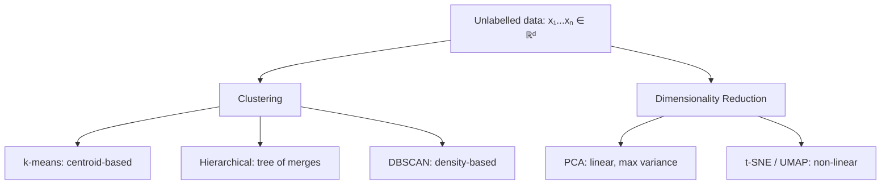

# 4 - Clustering and Unsupervised Learning

[toc]

> **TL;DR:** Unsupervised learning discovers structure in unlabelled data — no targets, no supervision signal, just raw examples x ∈ ℝᵈ. The two canonical tasks are clustering (partition data into groups of similar points) and dimensionality reduction (find a compact representation that preserves structure). Unlike supervised learning, evaluation is intrinsically harder because there is no ground truth to compare against.

## Vocabulary

**Unsupervised learning** — learning a function f: ℝᵈ → {C₁,...,Cₖ} or f: ℝᵈ → ℝᵐ (m ≪ d) from examples without labels.

**Cluster** — a subset of data points that are mutually close under some distance metric, and far from points in other clusters.

**Centroid** (µⱼ) — the mean of all points assigned to cluster j; the representative point.

```math
\mu_j = \frac{1}{|\mathcal{C}_j|} \sum_{x_i \in \mathcal{C}_j} x_i
```

---

**Within-cluster inertia** (J) — the k-means objective: sum of squared distances from each point to its centroid.

```math
J = \sum_{j=1}^{k} \sum_{x_i \in \mathcal{C}_j} \| x_i - \mu_j \|^2
```

---

**Dendrogram** — a tree diagram produced by hierarchical clustering showing the sequence of merges (agglomerative) or splits (divisive) at each distance level.

**DBSCAN ε-neighbourhood** — the set of points within Euclidean distance ε of a given core point; defines what it means to be "locally dense".

**Core point** — a point with at least MinPts neighbours within radius ε; seeds cluster expansion in DBSCAN.

**Border point** — reachable from a core point but has fewer than MinPts neighbours itself; belongs to a cluster but does not expand it.

**Noise point** — not reachable from any core point; labelled as an outlier by DBSCAN.

**Principal Component** — the direction of maximum variance in the data; the leading eigenvector of the covariance matrix.

**Explained variance ratio** — fraction of total variance captured by a subset of principal components; used to choose the dimensionality m.

**Silhouette score** — a per-point measure of cluster quality in [-1, +1]: how much closer a point is to its own cluster versus the next-nearest cluster.

```math
s(i) = \frac{b(i) - a(i)}{\max(a(i), b(i))}
```

where a(i) is the mean intra-cluster distance and b(i) is the mean distance to the nearest other cluster.

---

## Intuition

Imagine dropping ink blots onto paper: the ink forms natural pools separated by dry zones. Clustering algorithms are machines that find those pools without being told how many there are or where they lie. The core tension is between *compactness* (points within a cluster are close) and *separation* (clusters are far from each other). Different algorithms encode this tension differently: k-means uses Euclidean distance to a centroid, DBSCAN uses density, and hierarchical methods use linkage distances between sets.

Dimensionality reduction attacks a different structure: most real data lives near a low-dimensional manifold embedded in a high-dimensional space. A 224×224 RGB image has 150,528 dimensions, but meaningful image variation lies on a vastly smaller manifold. PCA finds the linear subspace that preserves the most variance; non-linear methods (t-SNE, UMAP) find curved subspaces.



**Figure:** taxonomy of unsupervised learning methods covered in this note.

## How it Works

Unsupervised algorithms divide into two families by their output type. Clustering algorithms output a discrete assignment — each point gets a cluster label. Dimensionality reduction algorithms output a continuous embedding — each point gets a lower-dimensional coordinate. Within clustering there are three distinct algorithmic lineages: centroid-based (k-means), connectivity-based (hierarchical), and density-based (DBSCAN).

### k-Means

k-Means is a coordinate-descent algorithm that alternates between two steps until the cluster assignments stop changing. The objective J is non-convex, so the algorithm is only guaranteed to converge to a local minimum; the result depends on initialization. k-Means++ initialization (choosing each centroid with probability proportional to its squared distance from the already-chosen centroids) dramatically reduces the chance of bad local minima in practice.

The two alternating steps are:

1. **Assignment step:** assign each point xᵢ to the cluster j with the nearest centroid µⱼ.
2. **Update step:** recompute each centroid as the mean of its assigned points.

```math
\text{Assignment:} \quad c_i = \arg\min_j \| x_i - \mu_j \|^2

\text{Update:} \quad \mu_j = \frac{1}{|\mathcal{C}_j|} \sum_{i: c_i = j} x_i
```

Both steps are guaranteed to reduce or maintain J, so J is non-increasing across iterations. Convergence is therefore guaranteed, but to a local minimum only.

### Hierarchical Clustering

Hierarchical clustering builds a tree (dendrogram) that encodes the entire sequence of cluster merges. Agglomerative (bottom-up) is the common variant: start with each point as its own cluster, then repeatedly merge the two closest clusters until all points are in one cluster. The distance between clusters (linkage criterion) can be:

- **Single linkage** — distance between nearest pair across clusters; tends to produce long "chained" clusters.
- **Complete linkage** — distance between farthest pair; tends to produce compact clusters.
- **Average linkage** — mean pairwise distance; a good default.
- **Ward's method** — minimize the increase in total within-cluster variance on each merge; produces clusters of roughly equal size.

The key advantage over k-means is that the user does not need to specify k in advance: the dendrogram is computed once and the user can cut it at any height to obtain any desired k.

```math
\text{Ward merge cost}(A, B) = \frac{|A| \cdot |B|}{|A| + |B|} \|\mu_A - \mu_B\|^2
```

### DBSCAN

DBSCAN (Density-Based Spatial Clustering of Applications with Noise) does not require specifying k and naturally handles clusters of arbitrary shape and marks outliers explicitly. It is defined by two hyperparameters: ε (neighbourhood radius) and MinPts (minimum neighbourhood size to be a core point).

The algorithm scans each point. If a point has ≥ MinPts neighbours within distance ε it is a core point and seeds a new cluster. All points density-reachable from a core point are added to that cluster. Points unreachable from any core point are labelled noise. A point is *density-reachable* from p if there is a chain of core points connecting them, each within ε of the next.

> [!IMPORTANT]
> DBSCAN produces a different number of clusters for every (ε, MinPts) pair. There is no single "right" answer — parameter selection requires domain knowledge or the use of a k-distance plot (sort distances to the k-th nearest neighbour and look for the elbow).

### PCA (Dimensionality Reduction)

PCA finds the m orthogonal directions of maximum variance in the data. These are the top m eigenvectors of the sample covariance matrix Σ = (1/n) XᵀX (where X has zero-mean rows). The projection onto those directions gives the m-dimensional embedding.

In practice the SVD of the centred data matrix X is used directly: X = UΣVᵀ. The right singular vectors (columns of V) are the principal components; the projected coordinates are the corresponding columns of UΣ (the score matrix).

```math
\text{Covariance matrix: } S = \frac{1}{n} X^T X

\text{PCA objective: } \max_{w: \|w\|=1} w^T S w \quad \Rightarrow \quad S w = \lambda w
```

## Math

The k-means objective is an instance of the more general vector quantization problem. NP-hardness holds in general (exact minimisation over all assignments), but the Lloyd iteration heuristic is O(n·k·d) per iteration and converges in O(n·k²·d) total work in practice.

```math
J = \sum_{j=1}^{k} \sum_{x_i \in \mathcal{C}_j} \|x_i - \mu_j\|^2
```

For the assignment step, fixing µ, minimising over c:

```math
c_i^* = \arg\min_{j \in \{1,\ldots,k\}} \|x_i - \mu_j\|^2
```

For the update step, fixing c, minimising over µ:

```math
\frac{\partial J}{\partial \mu_j} = -2 \sum_{i: c_i=j}(x_i - \mu_j) = 0 \;\Rightarrow\; \mu_j = \frac{1}{|\mathcal{C}_j|}\sum_{i: c_i=j} x_i
```

PCA's explained variance ratio for component r:

```math
\text{EVR}_r = \frac{\lambda_r}{\sum_{i=1}^{d} \lambda_i}
```

where λᵣ is the r-th eigenvalue of the covariance matrix.

> [!IMPORTANT]
> PCA is a linear method. It finds the best linear subspace. If the data manifold is curved (e.g., a Swiss roll) PCA will give a poor low-dimensional representation. Use t-SNE or UMAP for visualisation of non-linear structure.

## Real-world Example

A common production pattern is to run k-means on embedding vectors from a language model to group customer support tickets into topics, then route each topic to a specialist team. The example below clusters scikit-learn's 20-newsgroups TF-IDF embeddings with k-means and evaluates with silhouette score.

```python
import numpy as np
from sklearn.datasets import fetch_20newsgroups
from sklearn.feature_extraction.text import TfidfVectorizer
from sklearn.cluster import KMeans
from sklearn.decomposition import PCA
from sklearn.metrics import silhouette_score

# Fetch a small subset: 3 newsgroups
cats = ['sci.med', 'rec.sport.hockey', 'comp.graphics']
data = fetch_20newsgroups(subset='train', categories=cats,
                          remove=('headers', 'footers', 'quotes'))

# TF-IDF vectorisation → sparse matrix of shape (n_docs, vocab)
vec = TfidfVectorizer(max_features=3000, stop_words='english')
X = vec.fit_transform(data.data)   # shape: (n, 3000)

# Reduce to 50 dims with PCA (on dense) before k-means — reduces noise
X_dense = X.toarray()
pca = PCA(n_components=50, random_state=42)
X_pca = pca.fit_transform(X_dense)   # shape: (n, 50)

print(f"Explained variance by 50 PCs: {pca.explained_variance_ratio_.sum():.2%}")

# k-means with k=3 (we know there are 3 categories)
km = KMeans(n_clusters=3, init='k-means++', n_init=10, random_state=42)
labels = km.fit_predict(X_pca)

sil = silhouette_score(X_pca, labels, sample_size=2000)
print(f"Silhouette score: {sil:.3f}")   # expect ~0.10–0.20 for text
```

> [!TIP]
> Always run PCA before k-means on high-dimensional text embeddings. The curse of dimensionality makes Euclidean distance nearly meaningless in thousands of dimensions; projecting to 50–200 PCs restores meaningful nearest-neighbour geometry and speeds up the clustering significantly.

## In Practice

**Choosing k.** The elbow method plots J vs k and looks for the point of diminishing returns. The silhouette method plots mean silhouette score vs k; higher is better and the peak marks the best k. Neither is definitive — both should be used together with domain knowledge.

**k-Means failures.** k-Means assumes spherical, roughly equal-size clusters. It fails on elongated clusters (try DBSCAN), clusters with very different densities (try Gaussian mixture models), and non-convex shapes (try spectral clustering or DBSCAN).

**DBSCAN at scale.** Naive DBSCAN is O(n²) in the number of points due to neighbour search. In practice, use a ball tree or k-d tree index to reduce neighbour lookups to O(n log n). scikit-learn's DBSCAN does this automatically.

**PCA memory.** Full SVD of an n×d matrix is O(nd²) or O(n²d) in memory. For large n and d, use randomised SVD (sklearn's `TruncatedSVD` with `algorithm='randomized'`) which gives an excellent approximation in O(n·m·k) passes.

> [!WARNING]
> k-Means is sensitive to feature scale. Always standardise features (zero mean, unit variance) before running k-means. A feature measured in dollars on a [0, 100,000] scale will dominate the distance metric completely, drowning out binary features.

> [!NOTE]
> Gaussian Mixture Models (GMMs) generalise k-means by fitting a soft probabilistic model: each cluster is a Gaussian, and each point has a posterior probability of belonging to each cluster. GMMs are trained via EM and produce richer cluster shapes (full covariance matrices allow ellipsoidal clusters). They are the principled Bayesian alternative to k-means.

## Pitfalls

- **"More clusters is always better."** — Wrong. J always decreases as k increases (adding a cluster always reduces inertia). Selecting k by minimising J alone will always choose k = n. Use silhouette score or BIC/AIC for GMMs instead.
- **"DBSCAN finds clusters in any data."** — DBSCAN fails when clusters have widely varying densities, because a single ε cannot separate both dense and sparse regions. HDBSCAN (hierarchical DBSCAN) addresses this.
- **"PCA removes noise."** — Not necessarily. PCA retains the directions of *maximum variance*, which may include noise if noise is structured (e.g., a dominant noise component). PCA removes small-variance noise but amplifies large-variance noise.
- **"Silhouette score near 0 means bad clustering."** — Near-zero silhouette can indicate either bad clustering or truly overlapping clusters with no clean separation. Inspect cluster compositions, not just the score.
- **"k-Means++ always finds the global optimum."** — k-Means++ selects better initial centroids with high probability, but the Lloyd iteration can still converge to a local minimum. Running multiple random restarts (n_init=10) and keeping the best J is essential.

## Exercises

### Exercise 1 — k-Means by Hand

Given 6 points in ℝ²: A=(1,1), B=(1,2), C=(2,1), D=(8,8), E=(8,9), F=(9,8). Initialise k=2 centroids at µ₁=(1,1) and µ₂=(9,9). Run one full iteration of k-means (assignment + update) and state the new centroids.

#### Solution 1

**Assignment step:** compute squared Euclidean distance from each point to µ₁=(1,1) and µ₂=(9,9).

- A=(1,1): d(µ₁)=0, d(µ₂)=128 → assign to C₁
- B=(1,2): d(µ₁)=1, d(µ₂)=113 → assign to C₁
- C=(2,1): d(µ₁)=1, d(µ₂)=113 → assign to C₁
- D=(8,8): d(µ₁)=98, d(µ₂)=2 → assign to C₂
- E=(8,9): d(µ₁)=113, d(µ₂)=1 → assign to C₂
- F=(9,8): d(µ₁)=113, d(µ₂)=1 → assign to C₂

**Update step:** recompute centroids.

```math
\mu_1^{\text{new}} = \frac{(1,1)+(1,2)+(2,1)}{3} = \left(\frac{4}{3}, \frac{4}{3}\right) \approx (1.33, 1.33)

\mu_2^{\text{new}} = \frac{(8,8)+(8,9)+(9,8)}{3} = \left(\frac{25}{3}, \frac{25}{3}\right) \approx (8.33, 8.33)
```

The clusters are already perfectly separated; the next iteration produces no reassignments and the algorithm has converged.

### Exercise 2 — Silhouette Score

A single point P=(5,0) belongs to cluster A with other points at (4,0) and (6,0). The nearest other cluster B has points at (0,0), (0,1), (0,-1). Compute the silhouette score s(P).

#### Solution 2

**Intra-cluster mean distance a(P):** P's cluster A has points (4,0), P=(5,0), (6,0).

Mean distance from P to other members of A = (|5-4| + |5-6|)/2 = (1+1)/2 = 1.0

**Nearest-cluster mean distance b(P):** cluster B has points (0,0), (0,1), (0,-1).

Distances from P=(5,0): √(25)=5, √(25+1)≈5.10, √(25+1)≈5.10. Mean ≈ 5.07.

```math
s(P) = \frac{b(P) - a(P)}{\max(a(P), b(P))} = \frac{5.07 - 1.0}{5.07} \approx 0.80
```

P is well-clustered: it is much closer to its own cluster than to any other. A silhouette score near 1 indicates a correctly-placed point.

### Exercise 3 — PCA Explained Variance

A 2×2 covariance matrix has eigenvalues λ₁=8, λ₂=2. How much variance does the first principal component explain? What is the minimum number of components needed to explain ≥ 90% of variance?

#### Solution 3

Total variance = λ₁ + λ₂ = 10.

EVR(PC1) = 8/10 = **80%**.

EVR(PC1 + PC2) = (8+2)/10 = **100%**.

So **1 component** explains 80% (below 90%) and **2 components** explain 100% (≥ 90%). Therefore the minimum number needed for ≥ 90% coverage is **2 components**.

### Exercise 4 — DBSCAN Parameters

Consider a 1D dataset: {1, 2, 3, 10, 11, 12, 25}. Apply DBSCAN with ε=2 and MinPts=2. Identify core points, border points, and noise points.

#### Solution 4

For each point, count neighbours within distance ε=2 (inclusive of the point itself, so ≥ MinPts=2 neighbours including self means it has ≥1 other point within ε):

Using the convention that MinPts=2 means a point needs at least 1 other point within ε:

- 1: neighbours within ε=2 → {1, 2, 3}. Count = 2 (excluding self) ≥ 1. **Core point.**
- 2: neighbours → {1, 2, 3, 4}∩data = {1,2,3}. Count=2. **Core point.**
- 3: neighbours → {1,2,3}∩data. Count=2. **Core point.**
- 10: neighbours → {10,11,12}∩data. Count=2. **Core point.**
- 11: neighbours → {10,11,12}. Count=2. **Core point.**
- 12: neighbours → {10,11,12}. Count=2. **Core point.**
- 25: neighbours → {25}. Count=0. Not reachable from any core point. **Noise.**

Clusters formed: **C₁ = {1,2,3}** (density-connected chain), **C₂ = {10,11,12}**. Point **25 is noise**.

### Exercise 5 — k-Means Convergence Guarantee

Explain why k-means is guaranteed to converge but NOT guaranteed to find the global minimum. Why does k-Means++ help?

#### Solution 5

**Convergence guarantee:** at each iteration, the assignment step can only decrease J (each point moves to the nearest centroid), and the update step can only decrease J (the centroid that minimises within-cluster SSE is exactly the mean). Since J is lower-bounded by 0 and decreases at each step, the algorithm must terminate. In practice it terminates when assignments do not change between iterations.

**No global minimum guarantee:** J is non-convex as a function of the joint (assignments, centroids) pair. The alternating minimisation finds a local minimum that depends on the initial centroid placement. Different random initialisations can converge to very different local minima with very different J values.

**k-Means++ helps** because it spreads initial centroids far apart: the first centroid is chosen uniformly at random; each subsequent centroid is chosen with probability proportional to its squared distance from the nearest already-chosen centroid. This makes it unlikely that two centroids start close together in the same "true" cluster, reducing the probability of a poor local minimum. In expectation, k-Means++ achieves an O(log k) approximation to the global optimum.

## Sources

- Machine Learning lecture slides: Unsupervised Learning (air(17).pdf), AI course lecture notes.
- MacQueen, J. (1967). Some methods for classification and analysis of multivariate observations. *Proceedings of the Fifth Berkeley Symposium on Mathematical Statistics and Probability*, 1(14), 281–297.
- Ester, M., Kriegel, H.-P., Sander, J., & Xu, X. (1996). A density-based algorithm for discovering clusters in large spatial databases with noise. *Proceedings of KDD-96*.
- Pedregosa, F. et al. (2011). Scikit-learn: Machine learning in Python. *JMLR*, 12, 2825–2830. https://scikit-learn.org/

## Related

- [5 - Linear Algebra Essentials](../1-foundations/5-linear-algebra-essentials.md)
- [1 - What is ML and Version Space](../1-foundations/1-what-is-ml-and-version-space.md)
- [2 - Probability Primer](../1-foundations/2-probability-primer.md)
- [5 - Association Rules](./5-association-rules.md)
- [7 - Genetic Algorithms](./7-genetic-algorithms.md)
