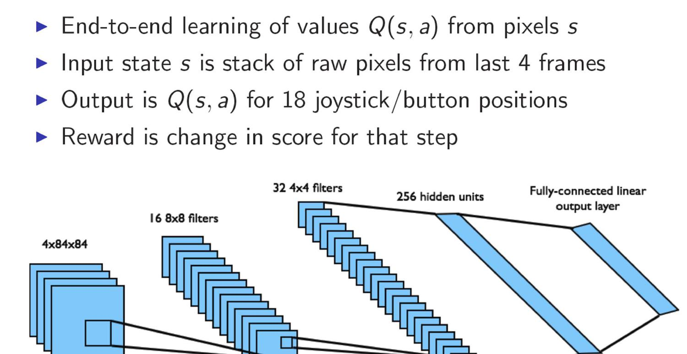
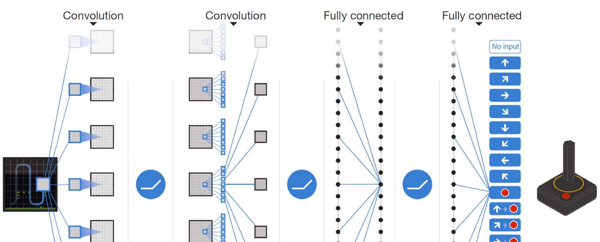
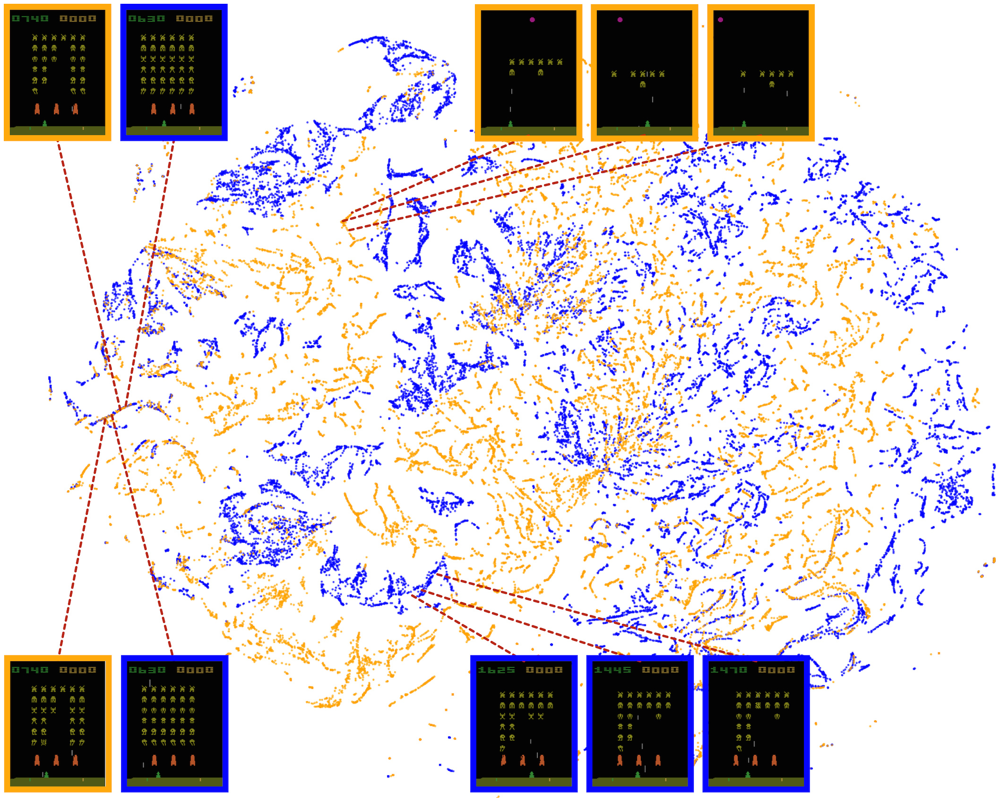
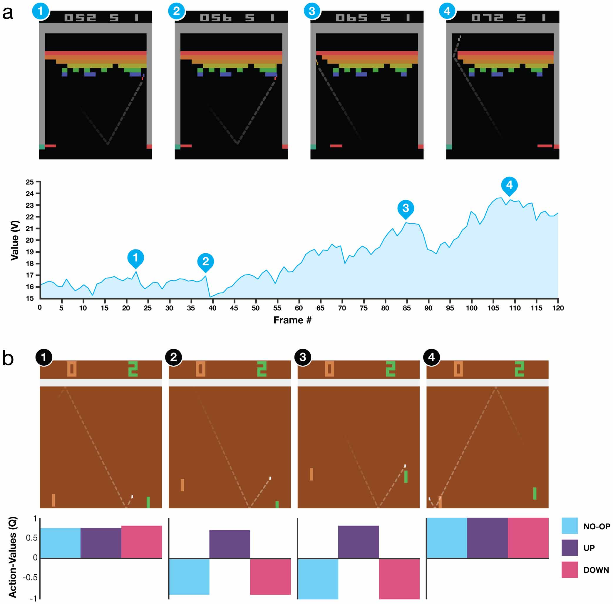

# 2 - Deep Q-Networks

[toc]

> **TL;DR:** Deep Q-Networks (DQN) bridge tabular Q-learning and raw sensory input by parameterising Q(s, a; θ) as a convolutional neural network trained end-to-end from pixels. Two key innovations — **experience replay** (breaking temporal correlations in the training data) and a **frozen target network** (stabilising the non-stationary regression target) — make gradient descent on the Bellman residual converge reliably. Mnih et al. demonstrated superhuman performance on 29 of 49 Atari 2600 games using a single fixed architecture and hyperparameter set, with no game-specific feature engineering.

## Vocabulary

- **Neuro-dynamic programming (NDP)** — the classical framework (Tsitsiklis & Van Roy, 1997) of approximating the value function with a neural network; DQN is a specific instantiation with convolutional features and stabilisation tricks.

---

- **Q-network** (Q(s, a; θ)) — a neural network with parameters θ that maps a preprocessed state s to a vector of Q-values, one per action.

---

- **Experience replay** — storing every observed transition (s_t, a_t, r_t, s_{t+1}) in a replay buffer D of fixed capacity, then sampling random minibatches from D for each gradient update, breaking temporal correlations.

---

- **Target network** (θ^−) — a frozen copy of the Q-network parameters, updated from the online network θ every C steps; provides a stationary regression target for the TD loss.

---

- **TD loss** — the squared difference between the bootstrapped target y_j and the network's current prediction Q(φ_j, a_j; θ).

```math
\mathcal{L}(\theta) = \mathbb{E}_{(s,a,r,s') \sim D}\!\left[\left(y - Q(s, a; \theta)\right)^2\right]
```

---

- **Replay buffer** (D) — a circular buffer of capacity N (typically N = 10^6 transitions); oldest transitions are overwritten first.

---

- **Preprocessing** (φ) — the function that converts a raw Atari frame (210×160 RGB) to an 84×84 grayscale image and stacks 4 consecutive frames to form the state representation φ ∈ ℝ^{4×84×84}.

---

- **Reward clipping** — capping all rewards to the range [−1, +1] before storing in the replay buffer; allows one hyperparameter set to work across games with wildly different score scales.

---

- **Frame skip / action repeat** — executing the chosen action for k consecutive simulator steps (k = 4 by default) and summing the rewards; reduces computation while preserving strategic decisions.

---

- **ALE (Arcade Learning Environment)** — the standard Atari 2600 emulation platform used as the RL benchmark; provides 49+ Atari games with a consistent observation and action interface.

---

## Intuition

Tabular Q-learning assigns an independent number to every (state, action) pair. Atari frames have billions of distinct possible values — the table would require more entries than there are atoms in the observable universe. The key insight is that raw pixels are *heavily redundant*: nearby pixels are correlated, and very different pixel patterns may correspond to nearly identical game states. A CNN can compress the 4×84×84 input into a compact feature vector that captures the game-relevant structure, then a linear head reads off Q-values from that vector.

The challenge is that naive application of gradient descent to the Bellman objective breaks down: (1) consecutive frames are temporally correlated, violating the i.i.d. assumption of SGD; (2) the regression target y = r + γ max_{a'} Q(s', a'; θ) depends on the *same* θ being updated, creating a moving-target instability. Experience replay solves (1); the target network solves (2).

**Figure:** DQN 2013 architecture — pixel stack in, Q-value vector out.



**Figure:** DQN 2015 (Nature) full network diagram with joystick action outputs.



## How it works

DQN adapts the Q-learning update rule to the function-approximation regime. The training procedure is an outer loop over episodes, with an inner loop over steps; each step takes an ε-greedy action, stores the transition, and performs one gradient update on a minibatch sampled from the replay buffer.

### Preprocessing Pipeline

The raw Atari observation is 210×160 pixels at 60 Hz colour video. Four preprocessing steps convert this to a network-friendly state. First, convert the colour frame to grayscale using the standard luminance formula. Second, downsample to 110×84 using bicubic interpolation. Third, crop to 84×84 by taking a game-specific fixed window (the 2013 paper used a fixed crop; the 2015 paper used the max of two consecutive frames to handle sprite flickering). Fourth, stack the four most recent preprocessed frames along the channel dimension to produce the input tensor φ ∈ ℝ^{4×84×84}.

The 4-frame stack is the practical solution to the non-Markov problem: a single frame doesn't reveal ball direction, character velocity, or whether a sprite is about to fire. Four frames give the network enough temporal context to infer velocity from position differences.

> [!IMPORTANT]
> The frame-stack makes the state approximately Markov for most Atari games — but not all. Games with longer-term memory requirements (Montezuma's Revenge, Pitfall) require much deeper temporal context, which is why vanilla DQN fails on those games.

### 2013 Architecture (arXiv:1312.5602)

The 2013 DQN consists of three learned layers and no pooling. The architecture was designed so that the convolutional layers cover the entire 84×84 field with overlapping receptive fields, and the final linear layer acts as a look-up table over the network's own features.

The input tensor φ (4×84×84) passes through:
- Conv1: 16 filters of size 8×8, stride 4 → output 16×20×20, ReLU
- Conv2: 32 filters of size 4×4, stride 2 → output 32×9×9, ReLU
- FC1: 256 units, ReLU
- Output: linear layer with |A| outputs (4 to 18, game-dependent)

Training used RMSProp, minibatch size 32, replay buffer capacity 1M, ε annealed from 1.0 to 0.1 over 1M frames, total 10M frames per game. No target network in 2013 — just the live Q-network for both predictions and targets.

### 2015 Architecture (Nature, doi:10.1038/nature14236)

The 2015 paper added one convolutional layer, doubled the training duration, and — most importantly — introduced the frozen target network. The architecture:

```
Input: 4 × 84 × 84
Conv1: 32 filters, 8×8, stride 4, ReLU  → 32×20×20
Conv2: 64 filters, 4×4, stride 2, ReLU  → 64×9×9
Conv3: 64 filters, 3×3, stride 1, ReLU  → 64×7×7
FC1:   512 units, ReLU
Output: linear, |A| outputs
```

The extra conv layer (64@3×3) increases the model capacity to extract finer-grained spatial features — important for games with small but game-critical objects (ball in Breakout, bullets in Space Invaders).

### Target Network Mechanism

The target network is a copy of the Q-network with separate parameters θ^−. The TD target uses θ^− instead of θ:

```math
y_j = r_j + \gamma \max_{a'} Q(s_{j+1}, a';\, \theta^-)
```

θ^− is frozen for C = 10,000 gradient update steps, then hard-updated: θ^− ← θ. This converts the oscillating, correlated regression target into an approximately fixed target for a window of 10k steps, dramatically reducing oscillation and divergence.

> [!NOTE]
> Soft target updates (θ^− ← τθ + (1−τ)θ^−, τ << 1) are an alternative used in DDPG and subsequent continuous-action algorithms. They provide smoother target evolution at the cost of the target never being identical to the online network.

### Experience Replay Details

At each step, transition (φ_t, a_t, r_t, φ_{t+1}, done_t) is pushed into the circular buffer D. At training time, a minibatch of 32 transitions is sampled *uniformly at random* from D. The gradient update is:

```math
\nabla_\theta \mathcal{L}(\theta) = \mathbb{E}_{(s,a,r,s') \sim D}\!\left[\left(y - Q(s, a; \theta)\right) \nabla_\theta Q(s, a; \theta)\right]
```

Uniform sampling breaks the correlation between consecutive updates. It also means each transition can be used for multiple gradient updates, improving sample efficiency relative to pure online learning.

> [!WARNING]
> Uniform replay gives equal weight to all stored transitions, including the many "boring" transitions early in training where nothing interesting happens. Prioritised Experience Replay (PER, Schaul et al. 2016) reweights by TD error magnitude, which substantially improves data efficiency on hard-exploration games. Vanilla DQN leaves significant performance on the table by ignoring transition importance.

### Full Training Algorithm

```
Algorithm: Deep Q-Learning with Experience Replay and Target Network
─────────────────────────────────────────────────────────────────────
Initialise replay buffer D with capacity N = 1,000,000
Initialise Q-network Q(·;θ) with random weights θ
Initialise target network: θ^− ← θ
Set ε ← 1.0, ε_end ← 0.1, ε_anneal_frames ← 1,000,000

For episode = 1, 2, ... do:
  Preprocess initial frame → φ_1
  For t = 1, 2, ... do:
    Anneal ε linearly
    With prob ε select random action a_t
    Otherwise a_t = argmax_a Q(φ_t, a; θ)
    Execute a_t in emulator (k=4 frame skip), observe r_t, x_{t+1}
    Preprocess x_{t+1} → φ_{t+1}
    Store (φ_t, a_t, r_t, φ_{t+1}) in D  [clip r_t to {-1,+1}]
    
    Sample minibatch {(φ_j, a_j, r_j, φ_{j+1})} of size 32 from D
    For each sample j:
      y_j = r_j                                        if φ_{j+1} is terminal
      y_j = r_j + γ max_{a'} Q(φ_{j+1}, a'; θ^-)    otherwise
    Perform gradient descent step on (y_j − Q(φ_j, a_j; θ))^2
    
    Every C = 10,000 steps: θ^− ← θ
```

### Atari Results

The 2013 paper evaluated on 7 games; DQN exceeded human performance on 6. The 2015 paper scaled to 49 games with a single architecture and hyperparameter set — no per-game tuning except the number of output actions. Key numbers from the 2015 Nature paper:

| Game | DQN Score | Human Score | % Human |
| :--- | ---: | ---: | ---: |
| Video Pinball | 42,684 | 17,668 | 241% |
| Boxing | 71.8 | 4.3 | 1797% |
| Breakout | 401.2 | 30.5 | 1327% |
| Space Invaders | 1,976 | 1,652 | 119% |
| Pong | 18.9 | 9.3 | ~100% |
| Montezuma's Revenge | 0 | 4,753 | 0% |

DQN completely failed on Montezuma's Revenge — a game requiring deep exploration and long-term planning that ε-greedy cannot solve.

**Figure:** t-SNE of the final FC layer activations across Space Invaders game states, coloured by Q-value. States with similar expected returns cluster together regardless of pixel-level similarity.



**Figure:** DQN Q-value visualisation on Breakout (a) and Pong (b). Action-values respond predictably to game events.



## Math

### Neuro-Dynamic Programming Loss

DQN minimises a sequence of losses L_i(θ_i) at each iteration i of the target network:

```math
\mathcal{L}_i(\theta_i) = \mathbb{E}_{(s,a,r,s') \sim D}\!\!\left[\left(\underbrace{r + \gamma \max_{a'} Q(s', a'; \theta_i^-)}_{\text{target}\ y_i} - Q(s, a; \theta_i)\right)^{\!2}\right]
```

The gradient with respect to θ_i (holding θ_i^− fixed) is:

```math
\nabla_{\theta_i}\mathcal{L}_i = \mathbb{E}\!\left[\left(y_i - Q(s,a;\theta_i)\right)\nabla_{\theta_i} Q(s,a;\theta_i)\right]
```

Note: computing the full gradient requires differentiating through the expectation and the network; in practice, a single-sample (or minibatch) stochastic estimate suffices.

### Error Clipping / Huber Loss

The 2015 paper clips the TD error to [−1, +1] before squaring (equivalent to using Huber loss):

```math
\ell(\delta) = \begin{cases} \frac{1}{2}\delta^2 & |\delta| \leq 1 \\ |\delta| - \frac{1}{2} & |\delta| > 1 \end{cases}
```

This bounds gradient magnitudes, preventing exploding gradients from rare but very high-error transitions, and decouples gradient scale from reward scale across games.

### Ablation — Why Both Replay and Target Network Matter

From Extended Data Table 3 of the 2015 Nature paper (Breakout scores):

```math
\begin{array}{lc}
\text{Full DQN (replay + target Q)} & 316.8 \\
\text{No target network} & 240.7 \\
\text{No replay (online updates only)} & 10.2 \\
\text{Neither} & 3.2 \\
\end{array}
```

Removing replay has a catastrophic effect (316 → 10), confirming that breaking temporal correlations is the dominant stabilisation contribution.

## Real-world example

The following is a minimal but complete DQN implementation using PyTorch and the Gymnasium Atari interface. It includes the replay buffer, target network, preprocessing, and the core training loop described in the 2015 paper.

```python
import random
import collections
from typing import Deque

import numpy as np
import torch
import torch.nn as nn
import torch.optim as optim
import gymnasium as gym
from gymnasium.wrappers import (
    AtariPreprocessing,
    FrameStackObservation,
    TransformReward,
)


# ─── Replay Buffer ─────────────────────────────────────────────────────────────
Transition = collections.namedtuple(
    "Transition", ["state", "action", "reward", "next_state", "done"]
)

class ReplayBuffer:
    def __init__(self, capacity: int) -> None:
        self.buf: Deque[Transition] = collections.deque(maxlen=capacity)

    def push(
        self,
        state: np.ndarray,
        action: int,
        reward: float,
        next_state: np.ndarray,
        done: bool,
    ) -> None:
        self.buf.append(Transition(state, action, reward, next_state, done))

    def sample(self, batch_size: int) -> list[Transition]:
        return random.sample(self.buf, batch_size)

    def __len__(self) -> int:
        return len(self.buf)


# ─── Q-Network ─────────────────────────────────────────────────────────────────
class DQN(nn.Module):
    def __init__(self, n_actions: int) -> None:
        super().__init__()
        # Input: [B, 4, 84, 84]
        self.conv = nn.Sequential(
            nn.Conv2d(4, 32, kernel_size=8, stride=4),   # → [B,32,20,20]
            nn.ReLU(),
            nn.Conv2d(32, 64, kernel_size=4, stride=2),  # → [B,64, 9, 9]
            nn.ReLU(),
            nn.Conv2d(64, 64, kernel_size=3, stride=1),  # → [B,64, 7, 7]
            nn.ReLU(),
        )
        self.fc = nn.Sequential(
            nn.Flatten(),
            nn.Linear(64 * 7 * 7, 512),
            nn.ReLU(),
            nn.Linear(512, n_actions),
        )

    def forward(self, x: torch.Tensor) -> torch.Tensor:
        # x: float32 [B, 4, 84, 84] in [0, 1]
        return self.fc(self.conv(x))


# ─── Training loop ─────────────────────────────────────────────────────────────
def train_dqn(
    env_name: str = "ALE/Breakout-v5",
    total_steps: int = 10_000_000,
    replay_capacity: int = 1_000_000,
    batch_size: int = 32,
    gamma: float = 0.99,
    lr: float = 2.5e-4,
    target_update_freq: int = 10_000,
    eps_start: float = 1.0,
    eps_end: float = 0.1,
    eps_anneal_steps: int = 1_000_000,
    replay_start: int = 50_000,
    device: str = "cuda",
) -> None:

    env = gym.make(env_name, render_mode=None)
    # AtariPreprocessing: grayscale, 84×84, frame-skip=4, fire-on-reset
    env = AtariPreprocessing(env, grayscale_obs=True, scale_obs=True, frame_skip=4)
    # Stack 4 most recent frames
    env = FrameStackObservation(env, stack_size=4)
    # Clip rewards to {-1, 0, +1}
    env = TransformReward(env, lambda r: np.clip(r, -1.0, 1.0))

    n_actions: int = env.action_space.n  # type: ignore[union-attr]
    dev = torch.device(device if torch.cuda.is_available() else "cpu")

    online_net = DQN(n_actions).to(dev)
    target_net = DQN(n_actions).to(dev)
    target_net.load_state_dict(online_net.state_dict())
    target_net.eval()

    optimizer = optim.RMSprop(online_net.parameters(), lr=lr, alpha=0.95, eps=0.01)
    buffer = ReplayBuffer(replay_capacity)
    loss_fn = nn.HuberLoss()  # equivalent to clipped TD error

    obs, _ = env.reset()
    total_reward = 0.0
    episode = 0

    for step in range(1, total_steps + 1):
        # Epsilon-greedy action
        eps = max(eps_end, eps_start - (eps_start - eps_end) * step / eps_anneal_steps)
        if random.random() < eps:
            action = env.action_space.sample()
        else:
            with torch.no_grad():
                state_t = torch.tensor(np.array(obs), dtype=torch.float32, device=dev).unsqueeze(0)
                action = int(online_net(state_t).argmax(dim=1).item())

        next_obs, reward, terminated, truncated, _ = env.step(action)
        done = terminated or truncated
        buffer.push(np.array(obs, dtype=np.float32), action, float(reward), np.array(next_obs, dtype=np.float32), done)
        total_reward += float(reward)
        obs = next_obs

        if done:
            obs, _ = env.reset()
            episode += 1
            if episode % 100 == 0:
                print(f"Step {step:,} | Episode {episode} | Eps {eps:.3f}")
            total_reward = 0.0

        # Skip training until buffer has enough transitions
        if step < replay_start or len(buffer) < batch_size:
            continue

        # Sample minibatch and compute TD targets
        batch = buffer.sample(batch_size)
        states   = torch.tensor(np.array([t.state      for t in batch]), dtype=torch.float32, device=dev)
        actions  = torch.tensor([t.action  for t in batch], dtype=torch.long,  device=dev)
        rewards  = torch.tensor([t.reward  for t in batch], dtype=torch.float32, device=dev)
        n_states = torch.tensor(np.array([t.next_state for t in batch]), dtype=torch.float32, device=dev)
        dones    = torch.tensor([t.done    for t in batch], dtype=torch.float32, device=dev)

        with torch.no_grad():
            # Target network computes max Q for next states
            max_next_q = target_net(n_states).max(dim=1).values
            targets = rewards + gamma * max_next_q * (1.0 - dones)

        # Online network predicts Q for taken actions
        current_q = online_net(states).gather(1, actions.unsqueeze(1)).squeeze(1)

        loss = loss_fn(current_q, targets)
        optimizer.zero_grad()
        loss.backward()
        nn.utils.clip_grad_norm_(online_net.parameters(), 10.0)
        optimizer.step()

        # Hard update target network
        if step % target_update_freq == 0:
            target_net.load_state_dict(online_net.state_dict())


if __name__ == "__main__":
    train_dqn()
```

> [!TIP]
> For faster iteration during development, test on `CartPole-v1` (no Atari preprocessing needed) before switching to Atari. CartPole converges in ~50k steps vs millions for Atari; you can verify that experience replay and target network both help by ablating them.

## In practice

**The target network interval C is crucial.** Too large (C >> 10k) and the target is stale — the network overfits to an outdated target distribution. Too small (C << 1k) and the target moves nearly as fast as the predictions, recreating the instability. C = 10,000 steps was found empirically for Atari; re-tune for other environments.

**Replay capacity trades recency vs diversity.** With capacity N = 1M and 4 frame-skip, each real-time second of gameplay fills ~15 transitions, so 1M transitions represents ~18 hours of play. The buffer must be large enough that the minibatch distribution looks approximately i.i.d., but not so large that it contains only old data from early in training. For fast-changing environments, smaller buffers can outperform large ones.

**Reward clipping loses game-specific information.** Clipping rewards to [−1, +1] makes one set of hyperparameters work across 49 games — but it means the agent can't distinguish a +1 reward from a +100 reward. Games where the score encodes structure (e.g., killing harder enemies is worth more points) lose that signal. Reward normalisation (z-score over a running window) is a more principled alternative.

**GPU memory.** A 1M-frame replay buffer at float32 with 4-frame 84×84 stacks requires 4 × 84 × 84 × 4 × 1M ≈ 112 GB if naively stored in float32. DQN stores uint8 (0–255) and converts to float32 during sampling — 28 GB, which fits on a single high-memory GPU or CPU RAM.

> [!CAUTION]
> Storing float32 replay buffers for large Atari runs will exhaust GPU VRAM immediately. Always store frames as `uint8` and normalise to [0, 1] *only at minibatch sample time*. This is the single most common DQN memory bug.

**The 49-game hyperparameter lock is fragile.** DQN's hyperparameters were tuned on a subset of games and then locked. Subsequent benchmarks have shown that per-game tuning would substantially improve performance. The paper's framing as "one set of hyperparameters" is partly a scientific constraint (proving generality) and partly a limitation.

**Training stability signs.** Monitor: (1) average episode reward (increases with training), (2) average Q-value (should increase but not explode), (3) TD loss (should decrease and then plateau). A diverging Q-value (→ ∞) with constant or increasing loss indicates target network instability — reduce target_update_freq or lower lr.

> [!WARNING]
> DQN with `done` flags from gymnasium may incorrectly include the time-limit terminal state as a true terminal state, which biases the TD target. Use `terminated` (game over) vs `truncated` (time limit hit) correctly. When `truncated=True` and `terminated=False`, bootstrap from the next state as if the episode continues — do not set `done=True` in the replay buffer.

## Pitfalls

- **Maximisation bias.** The max in the Q-learning target overestimates Q* because the max of noisy estimates is biased high. Double DQN (van Hasselt et al. 2016) fixes this by using the online network to *select* the best action and the target network to *evaluate* it: y = r + γ Q(s', argmax_{a'} Q(s',a';θ); θ^−).

- **Treating the replay buffer as i.i.d.** Uniform replay breaks temporal autocorrelation but the distribution still shifts as the policy improves. Transitions stored early (random policy) are low-quality; without prioritisation, they dilute gradient signal from informative recent transitions.

- **Comparing DQN scores without normalisation.** Raw game scores are not comparable across titles. The canonical comparison uses *normalised human-start score* (DQN score − random score) / (human score − random score). A game where humans score 100 and random gets 0 is much harder to compare to a game where humans score 10,000.

- **Ignoring the no-op start.** The DQN evaluation protocol starts each episode with a random number (1–30) of no-op actions, so the initial game state varies. Some implementations skip this and compare to other implementations that include it — the scores are not comparable.

- **Assuming DQN is sample-efficient.** DQN requires 50M frames (≈ 38 days of real-time play) to reach reported scores. Humans learn most Atari games in minutes. Sample efficiency is where model-based RL and algorithmic improvements (Rainbow, MuZero) dominate.

## Exercises

### Exercise 1

**The DQN TD target is y = r + γ max_{a'} Q(s', a'; θ^−). Why does using the online network θ for both the prediction Q(s, a; θ) and the target (i.e., replacing θ^− with θ) cause instability? Give a concrete analogy.**

#### Solution 1

When θ^− = θ (same network for prediction and target), both the prediction Q(s,a;θ) and the target y = r + γ max_{a'} Q(s',a';θ) move with every gradient step. The gradient descent step pushes Q(s,a;θ) closer to y, but simultaneously changes y itself — often in the same direction. This is analogous to a dog chasing its own tail: every step toward the target shifts the target further away.

More precisely: if Q(s,a;θ) is too low and we increase it via gradient descent, the max over a' in the target also increases (since Q(s',a';θ) just changed for all (s',a') too). The target chases the prediction and the prediction chases the target, leading to oscillation or divergence.

The frozen target network fixes θ^− for C steps, making y a constant target relative to θ. This converts the problem into C separate standard regression problems, each with a fixed target. Gradient descent converges reliably on fixed targets; it does not converge on moving ones unless the step size is tuned carefully.

---

### Exercise 2

**Compute the number of parameters in the DQN 2015 architecture (32@8×8/4, 64@4×4/2, 64@3×3/1, FC-512, FC-18). Show the calculation for each layer.**

#### Solution 2

```math
\text{Conv1: } 32 \times (8 \times 8 \times 4 + 1) = 32 \times 257 = 8{,}224
```
(4 input channels, 8×8 kernel, +1 bias per filter)

```math
\text{Conv2: } 64 \times (4 \times 4 \times 32 + 1) = 64 \times 513 = 32{,}832
```

```math
\text{Conv3: } 64 \times (3 \times 3 \times 64 + 1) = 64 \times 577 = 36{,}928
```

The conv3 output is 64 × 7 × 7 = 3,136 features (flattened):

```math
\text{FC1: } 3{,}136 \times 512 + 512 = 1{,}606{,}144 + 512 = 1{,}606{,}656
```

```math
\text{FC2 (output): } 512 \times 18 + 18 = 9{,}216 + 18 = 9{,}234
```

```math
\text{Total: } 8{,}224 + 32{,}832 + 36{,}928 + 1{,}606{,}656 + 9{,}234 = 1{,}693{,}874
```

Approximately 1.7M parameters — a tiny network by modern standards. The bulk is in the first fully-connected layer (FC1) due to the large 3,136-dimensional flattened feature vector.

---

### Exercise 3

**Explain why experience replay improves sample efficiency as well as training stability. Be specific about what "sample efficiency" means in this context.**

#### Solution 3

In online Q-learning, each transition (s_t, a_t, r_t, s_{t+1}) is used for exactly one gradient update and then discarded. The gradient estimate from a single transition is very noisy — its variance is high because one sample has high variance relative to the expectation E_{s,a,r,s'~D}[·].

Experience replay improves *sample efficiency* in the sense of gradient quality per environment interaction: each transition stored in the buffer D is used for *multiple* gradient updates (on average N/batch_size = 1M/32 ≈ 31,250 updates over the buffer's lifetime). This makes better use of expensive environment interactions (each Atari frame requires running the emulator).

Additionally, sampling uniformly from D gives an approximately i.i.d. minibatch, reducing gradient noise from temporal correlation. The variance of the gradient estimator decreases as 1/batch_size for i.i.d. samples; for temporally-correlated consecutive samples, the effective batch size is much smaller (nearby frames carry redundant information).

The stability benefit is separate: breaking temporal correlations removes the systematic bias where the network overfits to the most recent state-action distribution and catastrophically forgets earlier experiences.

## Sources

- Mnih, V. et al., "Playing Atari with Deep Reinforcement Learning", arXiv:1312.5602 (2013). https://arxiv.org/abs/1312.5602
- Mnih, V. et al., "Human-level control through deep reinforcement learning", *Nature* 518, 529–533 (2015). https://doi.org/10.1038/nature14236
- Nando de Freitas, "Machine Learning" Oxford lecture slides `oxf(16).pdf`, slides on neuro-dynamic programming and DQN.
- Schaul, T. et al., "Prioritized Experience Replay", arXiv:1511.05952 (2015). https://arxiv.org/abs/1511.05952
- van Hasselt, H. et al., "Deep Reinforcement Learning with Double Q-learning", arXiv:1509.06461 (2015). https://arxiv.org/abs/1509.06461
- Bellemare, M.G. et al., "The Arcade Learning Environment: An Evaluation Platform for General Agents", *JAIR* 47, 253–279 (2013). https://arxiv.org/abs/1207.4708

## Related

- [1 - Reinforcement Learning Foundations](./1-reinforcement-learning-foundations.md)
- [3 - Policy Gradients and Beyond](./3-policy-gradients-and-beyond.md)
- [3 - Post-Training and Finetuning](../../AI-Engineering/2-foundation-models/3-post-training-and-finetuning.md)
