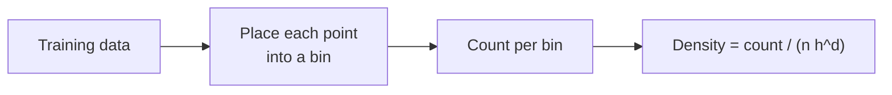
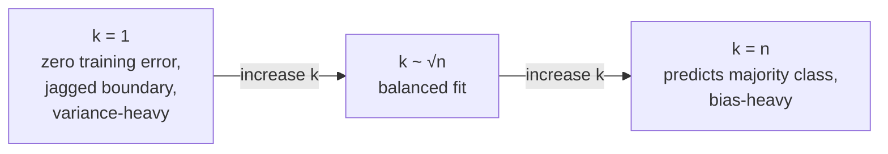

# 2 - Non-parametric Density Estimation and kNN

[toc]

> **TL;DR:** Parametric methods assume a distribution family ("data is Gaussian") and estimate a fixed number of parameters. *Non-parametric* methods make no such assumption — their effective complexity grows with the data. Three canonical methods: *histograms* (bin the space, count), *kNN density estimation* (look at the $k$-th nearest distance), and *kernel density estimation / Parzen windows* (smooth the empirical distribution with a small bump per training point). The same ideas drive *k-Nearest-Neighbor classifiers* and many smoothing-based density tasks.

## Vocabulary

**Parametric model**

A model with a fixed number of parameters ($\boldsymbol{\theta} \in \mathbb{R}^p$ for fixed $p$). Gaussian, logistic regression, neural network with fixed architecture.

---

**Non-parametric model**

A model whose effective parameter count grows with $n$. kNN stores all training data; KDE places a kernel at every training point. No "compression" of data into a small parameter vector.

---

**Histogram**

```math
\hat{p}(\mathbf{x}) = \frac{n_b}{n \cdot h^d}
```

Bin space into hypercubes of width $h$; estimate density as count in the bin divided by bin volume times $n$.

---

**Parzen window / Kernel density estimator (KDE)**

```math
\hat{p}(\mathbf{x}) = \frac{1}{n h^d}\sum_{i=1}^n K\!\left(\frac{\mathbf{x} - \mathbf{x}_i}{h}\right)
```

Smooth version of the histogram: each training point contributes a $h$-wide bump (the kernel $K$) to the estimate.

---

**Bandwidth $h$**

The smoothing parameter — small $h$ → spiky, low-bias, high-variance; large $h$ → smooth, high-bias, low-variance. The critical choice in KDE.

---

**k-Nearest-Neighbors (kNN) density**

```math
\hat{p}(\mathbf{x}) = \frac{k}{n \cdot V_k(\mathbf{x})}
```

where $V_k(\mathbf{x})$ is the volume of the smallest ball centered at $\mathbf{x}$ containing $k$ training points. Density inversely proportional to "how far must I search to find $k$ neighbors."

---

**k-NN classifier**

Classify $\mathbf{x}$ as the majority class of its $k$ nearest neighbors in the training set. The simplest non-parametric classifier.

---

**Bias-variance trade in non-parametric methods**

Smoothing ↑ → bias ↑, variance ↓. The smoothing parameter ($h$ or $k$) is the dial.

## Intuition

Parametric models compress a dataset into a small parameter vector. A Gaussian $\mathcal{N}(\mu, \Sigma)$ on 10,000 data points still needs only a handful of numbers to specify. The compression is the strength — and the weakness: if the true distribution isn't Gaussian, you've thrown away signal that the parametric form can't represent.

Non-parametric methods refuse to commit to a distribution family. They use the data *as the model*: kNN stores every training point and queries them at prediction time; KDE places a small bump on every point and sums them into a density. As the dataset grows, the model gets richer and can approximate arbitrary distributions. The price is *storage and inference cost* — both grow with $n$ — and a need for careful smoothing.

The bias-variance trade lives explicitly in the smoothing parameter. With $h = 0$ (or $k = 1$), the estimate is the empirical distribution — perfectly unbiased on the training set but wildly noisy. With $h \to \infty$ (or $k \to n$), the estimate is the average distribution — perfectly stable but uniformly flat. Cross-validation, plug-in rules (Silverman), or likelihood maximization on held-out data pick the middle.

## The histogram — the simplest non-parametric estimator

Divide the input space into a grid of bins of edge length $h$. The density estimate in any bin is:

```math
\hat{p}(\mathbf{x}) = \frac{n_b(\mathbf{x})}{n \cdot h^d}
```

where $n_b(\mathbf{x})$ is the count of training points in the bin containing $\mathbf{x}$.



### Strengths and weaknesses

- ✓ Trivial to compute, easy to visualize in 1D and 2D.
- ✗ Discontinuous (jumps at bin boundaries).
- ✗ Depends on bin placement (shifting bins by $h/2$ changes the estimate).
- ✗ Curse of dimensionality: in $d$ dimensions, $1/h^d$ bins are needed to keep each bin non-empty.

The histogram is the conceptual starting point; KDE and kNN refine it.

## Kernel density estimation (Parzen windows)

Instead of hard bins, place a smooth bump at each training point:

```math
\hat{p}(\mathbf{x}) = \frac{1}{n h^d}\sum_{i=1}^n K\!\left(\frac{\mathbf{x} - \mathbf{x}_i}{h}\right)
```

with the kernel $K$ a unit-volume non-negative function (Gaussian, Epanechnikov, uniform...). KDE is the histogram's smooth, shift-invariant cousin.

### Common kernels

| Kernel | Formula | Properties |
| :--- | :--- | :--- |
| Gaussian | $K(\mathbf{u}) = (2\pi)^{-d/2} \exp(-\|\mathbf{u}\|^2/2)$ | Smooth, infinite support, default |
| Epanechnikov | $K(u) = \frac{3}{4}(1 - u^2)_+$ (1D) | Optimal MSE; finite support |
| Uniform | $K(u) = \frac{1}{2}\mathbb{1}[|u| \le 1]$ | Simple, equivalent to moving-average |
| Triangular | $K(u) = (1 - |u|)_+$ | Piecewise linear |

For most use cases the Gaussian kernel is fine; the choice matters less than the bandwidth.

### Bandwidth selection

```math
h_\text{Silverman} = \left(\frac{4 \hat{\sigma}^5}{3n}\right)^{1/5} \approx 1.06\,\hat{\sigma}\,n^{-1/5} \quad \text{(1D Gaussian)}
```

Silverman's rule of thumb is the quick default; for non-Gaussian data it over-smooths. Better: cross-validated likelihood — pick $h$ maximizing leave-one-out log-density on held-out points.

```python
import numpy as np
from scipy.stats import gaussian_kde

# 1D KDE example
rng = np.random.default_rng(0)
data = np.concatenate([rng.normal(-2, 1, 100), rng.normal(3, 1.5, 200)])

kde = gaussian_kde(data, bw_method="silverman")
xs = np.linspace(-6, 8, 400)
pdf = kde(xs)

print("density at 0:", kde(0)[0])
print("density at -2:", kde(-2)[0])
```

For 2D or higher, `sklearn.neighbors.KernelDensity` is the go-to:

```python
from sklearn.neighbors import KernelDensity

kde = KernelDensity(bandwidth=0.3, kernel="gaussian")
kde.fit(X)
log_dens = kde.score_samples(X_test)        # log density at each test point
```

## kNN density estimation

The dual idea: instead of fixing the volume and counting points, **fix the count and measure the volume**.

```math
\hat{p}(\mathbf{x}) = \frac{k}{n \cdot V_k(\mathbf{x})}
```

where $V_k(\mathbf{x})$ is the volume of the smallest ball containing the $k$-th nearest training point.


In high-density regions, the $k$-th neighbor is close → small $V_k$ → high density. In sparse regions, far → large $V_k$ → low density.

### Properties

- Self-adaptive bandwidth: bigger $V_k$ where data is sparse, automatic.
- Discontinuous (steps when a point enters / leaves the $k$-neighborhood).
- Integrates to $> 1$ in many cases — kNN density isn't a proper density estimator without normalization. Use KDE if you need a true density.

## kNN classification

Take the same neighborhood idea and apply it to classification: classify a query point as the *majority class* of its $k$ nearest training neighbors.

```math
\hat{y}(\mathbf{x}) = \arg\max_c \sum_{i \in N_k(\mathbf{x})} \mathbb{1}[y_i = c]
```

```python
import numpy as np
from sklearn.neighbors import KNeighborsClassifier

clf = KNeighborsClassifier(n_neighbors=5, weights="distance")
clf.fit(X_train, y_train)
preds = clf.predict(X_test)
```

### Weighting schemes

| Weighting | What it does |
| :--- | :--- |
| Uniform | All $k$ neighbors get equal vote |
| Distance | Neighbors weighted by $1/d_i$ — closer ones matter more |
| Kernel | Apply a kernel weight; emphasizes very-close neighbors |

For boundary regions (where a point is roughly equidistant from multiple classes), distance-weighted voting is more stable than uniform.

### Choosing $k$



Tune $k$ by cross-validation. Common starting points:
- $k = \sqrt{n}$ as a rule of thumb.
- $k = 5$ or 10 for tabular data with moderate noise.
- Always check the *parity* — for binary classification, use odd $k$ to avoid ties.

### Strengths and weaknesses of kNN

| ✓ Strengths | ✗ Weaknesses |
| :--- | :--- |
| No training (lazy learner) | Storage = full training set |
| Naturally handles multiclass | Inference is $O(nd)$ per query (use ANN for large $n$) |
| Non-linear boundaries | Sensitive to feature scaling |
| Robust to label noise (with $k > 1$) | Suffers in high dimensions (curse) |

## The curse of dimensionality (again)

In high $d$, all points are roughly equidistant from each other — distance becomes uninformative. For uniform data in $[0, 1]^d$:

```math
\mathbb{E}[\text{distance}(\mathbf{x}, \mathbf{y})] \to \sqrt{d/6} \text{ as } n \to \infty
```

and the *relative* spread shrinks: max distance / min distance approaches 1. kNN degrades to "everything is equally close."

```python
import numpy as np

def distance_concentration(d: int, n: int = 1000) -> float:
    """Return (max_dist - min_dist) / mean_dist for uniform random data in [0,1]^d."""
    X = np.random.uniform(size=(n, d))
    dists = np.linalg.norm(X - X[0], axis=1)[1:]
    return float((dists.max() - dists.min()) / dists.mean())

for d in [2, 10, 100, 1000]:
    print(f"d={d:>4d}: spread / mean = {distance_concentration(d):.3f}")
# d=2: 0.95  d=10: 0.31  d=100: 0.09  d=1000: 0.03
```

Mitigations: feature selection, dimensionality reduction ([PCA / LDA](./5-feature-selection-and-dimensionality-reduction.md)), or learned distance metrics (Mahalanobis with class-specific covariance).

## In practice

> [!IMPORTANT]
> **Standardize features before kNN.** Distance-based methods are scale-sensitive: a feature ranging 0–1000 dominates a feature ranging 0–1 entirely, even if the second is more informative. `StandardScaler` is the minimum; for heavy-tailed features, log-transform first.

> [!TIP]
> For $n > 10^5$, brute-force kNN is too slow. Use **ANN** (approximate nearest neighbor) indices: HNSW, FAISS, Annoy. Same query semantics, $O(\log n)$ time per query instead of $O(n)$, in exchange for occasionally missing the true nearest neighbor (typically < 5% miss rate at recall 0.95).

> [!CAUTION]
> KDE produces a *real-valued density*, but in $d \gtrsim 5$ dimensions the estimate degrades quickly due to the curse. For high-d density problems, parametric models (mixture of Gaussians) or flow-based generative models are usually more reliable.

A modern use of non-parametric density: **anomaly detection**. Fit KDE (or kNN-density) on normal data; flag a point as anomalous if its estimated density is below a threshold. Works well when normal data has rich structure and labeled anomalies are scarce.

## Pitfalls

- **"kNN doesn't have hyperparameters."** It has $k$, the distance metric, and feature scaling — all critical. Tune them.
- **"kNN doesn't train, so it's fast."** It doesn't *fit* — but inference is $O(nd)$ per query. For large training sets, very slow without indexing.
- **"KDE works in high dimensions."** It technically works but degrades quickly: in $d \ge 5$, you need exponentially more data to achieve the same MSE.
- **"$k = 1$ has zero training error, so it generalizes."** Zero training error is the symptom of *over*fit, not good generalization. 1-NN is the highest-variance non-parametric classifier.
- **"Bigger $k$ is more accurate."** Up to a point. Beyond that, $k$-NN smooths over real class boundaries and bias dominates.

## Exercises

### Exercise 1 — Compute KDE by hand

Given 1D data $\{1, 2, 5\}$ and a uniform kernel of half-width $h = 1$, compute $\hat{p}(\mathbf{x})$ at $\mathbf{x} = 1, 1.5, 4, 5$.

#### Solution

Uniform kernel:

```math
K(u) = \begin{cases} 1/2 & |u| \le 1 \\ 0 & \text{otherwise} \end{cases}
```

KDE in 1D:

```math
\hat{p}(x) = \frac{1}{n h}\sum_i K\!\left(\frac{x - x_i}{h}\right)
```

With $n = 3, h = 1$:

- **$x = 1$**: $K((1-1)/1) = 1/2$, $K((1-2)/1) = 1/2$, $K((1-5)/1) = 0$. Sum = 1. $\hat{p}(1) = 1/3$.
- **$x = 1.5$**: $K(0.5) = 1/2$, $K(-0.5) = 1/2$, $K(-3.5) = 0$. Sum = 1. $\hat{p}(1.5) = 1/3$.
- **$x = 4$**: $K(3) = 0$, $K(2) = 0$, $K(-1) = 1/2$. Sum = 1/2. $\hat{p}(4) = 1/6$.
- **$x = 5$**: $K(4) = 0$, $K(3) = 0$, $K(0) = 1/2$. Sum = 1/2. $\hat{p}(5) = 1/6$.

Density is highest where points cluster (around 1–2); lower where they're isolated (around 4–5). Notice the discontinuities at $x = 0.5, 2.5, 4, 6$ — these are the boundaries where points enter / exit the uniform kernel's support. Gaussian kernels avoid these discontinuities at the cost of slightly more computation.

---

### Exercise 2 — Choose $k$ for kNN

You have $n = 10{,}000$ training examples. Estimate a good starting $k$, and describe how you'd refine it.

#### Solution

Rule-of-thumb start: $k = \sqrt{n} = 100$. But this is just a starting point — refine by:

1. **Grid search**: $k \in \{3, 5, 7, 10, 15, 25, 50, 100, 200\}$, evaluate by 5-fold CV.
2. **Plot CV accuracy vs $k$**: typically a curve with a maximum somewhere in the middle. Pick the highest, or use the *one-standard-error rule* (pick the largest $k$ within 1 SE of the best, for robustness).
3. **Inspect failure cases**: if errors come from noisy regions, increase $k$. If errors come from boundary regions, decrease $k$ and switch to distance-weighted voting.

For binary classification, use odd $k$ to avoid ties. For high-class-count problems, $k$ should be larger to give every class a chance to appear in the neighborhood.

---

### Exercise 3 — Why does KDE fail in high dimensions?

Quantify the curse of dimensionality for KDE: derive the MSE growth rate as $d$ increases.

#### Solution

For Gaussian KDE with bandwidth $h$ on Gaussian data in $d$ dimensions, the optimal MSE rate is:

```math
\text{MSE} = O\!\left(n^{-\frac{4}{4 + d}}\right)
```

Quick interpretation:
- $d = 1$: $\text{MSE} = O(n^{-4/5})$. To halve error, need $\sim 2^{5/4} \approx 2.4\times$ data.
- $d = 4$: $\text{MSE} = O(n^{-1/2})$. To halve error, $4\times$ data.
- $d = 10$: $\text{MSE} = O(n^{-2/7})$. To halve error, $\sim 14\times$ data.
- $d = 100$: $\text{MSE} = O(n^{-1/26})$. Cosmic data requirements.

The *exponential* growth of required sample size in $d$ is why KDE doesn't work in high dimensions. Parametric models (which assume a low-dimensional manifold of distributions) escape this — at the cost of being wrong if the assumption fails. The standard recipe for non-parametric density in moderate $d$: project to a low-dimensional space first (PCA, autoencoder, embedding), then KDE.

---

### Exercise 4 — kNN vs Naive Bayes for the same problem

Both are popular for small-data classification. For a problem with $n = 200$, $d = 10$, binary classes, would you prefer kNN or Naive Bayes? Explain.

#### Solution

**Lean toward Naive Bayes**, for two reasons:

1. **Sample efficiency.** NB has $O(Kd)$ parameters; kNN effectively uses every training point. With $n = 200, d = 10$, NB estimates each $P(x_j \mid c)$ from $\sim 100$ examples per class — usually enough for a Gaussian or multinomial fit. kNN, by contrast, has each prediction depend on a handful of nearby points; with 200 total, $k = 5$ means the prediction is based on $\sim 2.5\%$ of data, which is noisy.

2. **High-dimensional fragility of distances.** $d = 10$ is approaching the curse-of-dimensionality regime where kNN starts to degrade — distances become less informative. NB doesn't use distances; it uses per-feature class-conditional probabilities, which don't suffer this problem.

**But**: if class-conditional features are heavily non-Gaussian and non-independent (NB's assumptions are badly violated), kNN's flexibility might win despite the sample-size disadvantage. In that case, try both and pick by CV.

**Best practice**: in fact, try both as baselines, take the best. Both are 10-minute experiments.

## Sources

- Ramakrishnan, G. & Nagesh, A. (2011). *CS725: Foundations of Machine Learning — Lecture Notes*. IIT Bombay. §15.
- Parzen, E. (1962). *On Estimation of a Probability Density Function and Mode*. Ann. Math. Statist.
- Rosenblatt, M. (1956). *Remarks on Some Nonparametric Estimates of a Density Function*. Ann. Math. Statist.
- Silverman, B. W. (1986). *Density Estimation for Statistics and Data Analysis*. Chapman & Hall.
- Cover, T. M. & Hart, P. E. (1967). *Nearest Neighbor Pattern Classification*. IEEE Trans. Information Theory.
- Beyer, K. et al. (1999). *When Is "Nearest Neighbor" Meaningful?*. ICDT.
- Bishop, C. M. (2006). *Pattern Recognition and Machine Learning*. Springer. Ch. 2.5.

## Related

- [Probability Primer](../1-foundations/2-probability-primer.md)
- [Estimation and Maximum Likelihood](../1-foundations/3-estimation-and-mle.md)
- [Naive Bayes](../2-supervised-learning/2-naive-bayes.md)
- [Gaussian Discriminant Analysis](../2-supervised-learning/3-gaussian-discriminant-analysis.md)
- [1 - Clustering, EM, and k-means](./1-clustering-em-and-kmeans.md)
- [5 - Feature Selection and Dimensionality Reduction](./5-feature-selection-and-dimensionality-reduction.md)
