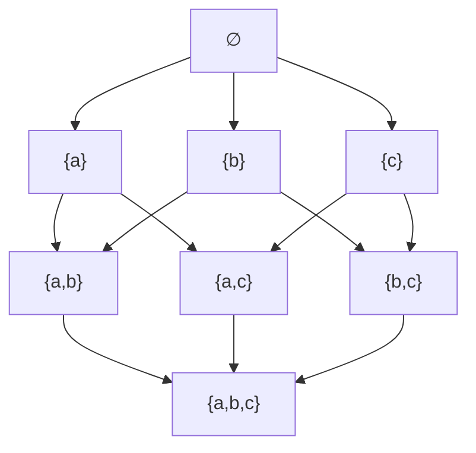
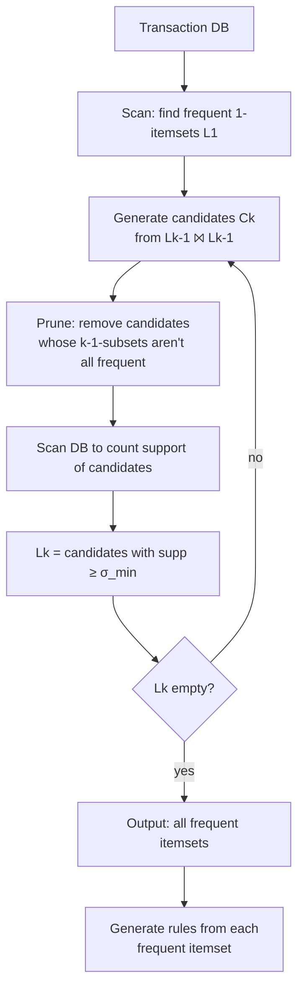

# 3 - Association Rule Mining (Apriori)

[toc]

> **TL;DR:** Association rule mining discovers patterns of the form "*if a customer buys A and B, they often also buy C*" — quantified by *support* (how often the rule applies), *confidence* (how often the conclusion follows the premise), and *lift* (how much more often than chance). The *Apriori* algorithm is the classic miner — it exploits the **anti-monotonicity** property of support: every superset of an infrequent itemset is also infrequent, so we can prune candidate sets aggressively.

## Vocabulary

**Transaction**

```math
T_i \subseteq \mathcal{I}
```

A set of items from a fixed universe $\mathcal{I}$ that occur together. The canonical example is a market basket: items bought together.

---

**Itemset**

```math
X \subseteq \mathcal{I}
```

A subset of items. The unit of analysis in frequent-pattern mining.

---

**Support**

```math
\text{supp}(X) = \frac{|\{T_i : X \subseteq T_i\}|}{|D|}
```

The fraction of transactions that contain itemset $X$. Range: $[0, 1]$.

---

**Confidence**

```math
\text{conf}(X \to Y) = \frac{\text{supp}(X \cup Y)}{\text{supp}(X)} = P(Y \mid X)
```

The conditional probability of $Y$ given $X$ — how often the consequent follows the antecedent.

---

**Lift**

```math
\text{lift}(X \to Y) = \frac{\text{conf}(X \to Y)}{\text{supp}(Y)} = \frac{P(Y \mid X)}{P(Y)}
```

How much more (or less) likely $Y$ is, given $X$, compared to its baseline. $> 1$ → positive association; $< 1$ → negative.

---

**Association rule**

```math
X \to Y, \quad X \cap Y = \emptyset
```

A statement that $X$ implies (probabilistically) $Y$. Typically constrained to satisfy minimum support and confidence thresholds.

---

**Frequent itemset**

An itemset $X$ with $\text{supp}(X) \ge \sigma_\min$. The first stage of Apriori is finding all of them.

---

**Apriori principle / anti-monotonicity**

```math
X \subseteq Y \Rightarrow \text{supp}(Y) \le \text{supp}(X)
```

A superset is at most as frequent as its subset. Used to prune candidate itemsets.

## Intuition

Suppose you run a grocery store and have records of every basket bought in the last year. You'd like to discover regularities — "diapers and beer are bought together" — so you can place these items strategically, run cross-promotions, or build recommendation systems. The classical formulation calls each pattern an *association rule* of the form $X \to Y$ ("customers who buy $X$ tend to also buy $Y$") and asks: which such rules hold in enough transactions to be reliable?

Three numbers quantify each rule. **Support** asks "how common is this combination?" — a rare combination has low support and the rule, while possibly true, isn't useful. **Confidence** asks "given the antecedent, how often does the consequent appear?" — a high-confidence rule says "if X, then almost always Y." **Lift** asks "is this stronger than chance?" — if Y is already universally bought, the rule "$X \to Y$" isn't informative even at confidence 100%.

The algorithmic challenge: the space of itemsets is exponential in $|\mathcal{I}|$. With 10,000 distinct items there are $2^{10000}$ possible itemsets. Apriori's insight — that infrequent itemsets cannot have frequent supersets — lets us prune the search tree drastically. We expand level by level (singletons, pairs, triples, ...) and at each level keep only itemsets passing the support threshold, then form candidates for the next level by joining frequent itemsets of the current level. The pruning is what makes the algorithm tractable.

## The Apriori principle

Mathematically:

```math
X \subseteq Y \Rightarrow \text{supp}(Y) \le \text{supp}(X)
```

Geometrically:



If $\{a\}$ has support 5%, no superset can have support more than 5%. If you've set $\sigma_\min = 10\%$, every superset of $\{a\}$ is automatically pruned.

## The Apriori algorithm



### Step 1 — find frequent singletons

Scan the database once; count each item's occurrences; keep items with $\text{supp} \ge \sigma_\min$. Call this $L_1$.

### Step 2 — generate candidate $k$-itemsets

Take two frequent $(k-1)$-itemsets that agree on their first $k-2$ items; join them into a $k$-itemset.

### Step 3 — prune via the Apriori principle

For each candidate $k$-itemset $X$, check whether *all* its $(k-1)$-subsets are in $L_{k-1}$. If any subset is not frequent, $X$ cannot be frequent — prune it without scanning the database.

### Step 4 — scan database, count supports

For each surviving candidate, count occurrences in the transactions. Keep those with $\text{supp} \ge \sigma_\min$. Call this $L_k$.

### Step 5 — iterate

Repeat from step 2 with $k+1$, stopping when $L_k$ is empty.

### Step 6 — rule generation

For each frequent itemset $I$ with $|I| \ge 2$, enumerate every way to split $I = X \cup Y$ with $X \cap Y = \emptyset$. Compute $\text{conf}(X \to Y)$; keep rules with $\text{conf} \ge \tau_\min$ (also commonly filtered by lift).

## A worked example

Transactions (rows are baskets, items are letters):

```
T1: {a, b, c}
T2: {a, b, d}
T3: {a, c, d}
T4: {b, c, d}
T5: {a, b, c, d}
```

$|D| = 5$. Set $\sigma_\min = 60\% = 0.6$, $\tau_\min = 0.75$.

**Step 1 — frequent singletons**:
- $\{a\}$: 4/5 = 0.8 ✓
- $\{b\}$: 4/5 = 0.8 ✓
- $\{c\}$: 4/5 = 0.8 ✓
- $\{d\}$: 4/5 = 0.8 ✓

$L_1 = \{\{a\}, \{b\}, \{c\}, \{d\}\}$.

**Step 2 — candidate pairs**:
$C_2 = \{\{a,b\}, \{a,c\}, \{a,d\}, \{b,c\}, \{b,d\}, \{c,d\}\}$ — every pair, since every singleton is frequent.

**Step 3 — scan, count supports**:
- $\{a,b\}$: T1, T2, T5 = 3/5 = 0.6 ✓
- $\{a,c\}$: T1, T3, T5 = 3/5 = 0.6 ✓
- $\{a,d\}$: T2, T3, T5 = 3/5 = 0.6 ✓
- $\{b,c\}$: T1, T4, T5 = 3/5 = 0.6 ✓
- $\{b,d\}$: T2, T4, T5 = 3/5 = 0.6 ✓
- $\{c,d\}$: T3, T4, T5 = 3/5 = 0.6 ✓

$L_2$ contains all 6 pairs.

**Step 4 — candidate triples**, generate via join + prune:
$C_3 = \{\{a,b,c\}, \{a,b,d\}, \{a,c,d\}, \{b,c,d\}\}$. Every triple's 3 subsets are in $L_2$ — none pruned.

**Step 5 — scan, count**:
- $\{a,b,c\}$: T1, T5 = 2/5 = 0.4 ✗
- $\{a,b,d\}$: T2, T5 = 2/5 = 0.4 ✗
- $\{a,c,d\}$: T3, T5 = 2/5 = 0.4 ✗
- $\{b,c,d\}$: T4, T5 = 2/5 = 0.4 ✗

$L_3 = \emptyset$. Algorithm halts.

**Rule generation** from pairs (with $\tau_\min = 0.75$):
- $\{a\} \to \{b\}$: conf = $0.6/0.8 = 0.75$ ✓
- $\{a\} \to \{c\}$: 0.75 ✓
- ... and so on by symmetry.

Lift of $\{a\} \to \{b\}$: $0.75 / 0.8 = 0.9375$ — *slightly negative association* (rule is *less* likely than baseline). Worth filtering out by a lift threshold.

## Implementation

```python
from itertools import combinations
from typing import Iterable

def support(itemset: frozenset, transactions: list[set]) -> float:
    return sum(1 for t in transactions if itemset <= t) / len(transactions)

def apriori(transactions: list[set], min_support: float) -> dict[int, dict[frozenset, float]]:
    """Return frequent itemsets by size, with their supports."""
    items = {item for t in transactions for item in t}
    L: dict[int, dict[frozenset, float]] = {}
    # L1
    L[1] = {frozenset({i}): s
            for i in items
            if (s := support(frozenset({i}), transactions)) >= min_support}
    k = 2
    while L[k - 1]:
        # Generate candidates
        prev = list(L[k - 1].keys())
        candidates: set[frozenset] = set()
        for i, a in enumerate(prev):
            for b in prev[i+1:]:
                union = a | b
                if len(union) == k:
                    # Pruning: all (k-1)-subsets must be frequent
                    if all(frozenset(s) in L[k-1] for s in combinations(union, k-1)):
                        candidates.add(union)
        # Count + filter
        L[k] = {c: s for c in candidates
                if (s := support(c, transactions)) >= min_support}
        if not L[k]:
            break
        k += 1
    return L

def generate_rules(frequent: dict[int, dict[frozenset, float]],
                   min_confidence: float) -> list[tuple[frozenset, frozenset, float, float]]:
    """Return (antecedent, consequent, confidence, lift) for each rule meeting threshold."""
    rules: list[tuple[frozenset, frozenset, float, float]] = []
    all_supp = {k: v for level in frequent.values() for k, v in level.items()}
    for k, level in frequent.items():
        if k < 2:
            continue
        for itemset, supp_full in level.items():
            for size in range(1, k):
                for ante in combinations(itemset, size):
                    ante = frozenset(ante)
                    cons = itemset - ante
                    conf = supp_full / all_supp[ante]
                    if conf >= min_confidence:
                        lift = conf / all_supp[cons]
                        rules.append((ante, cons, conf, lift))
    return rules
```

## Beyond Apriori — modern algorithms

| Algorithm | Idea | When it wins |
| :--- | :--- | :--- |
| **Apriori** | Level-wise; multiple DB scans | Pedagogical clarity; small to medium data |
| **FP-Growth** | Compress DB into a tree (FP-tree); mine recursively | $10\text{–}100\times$ faster on dense data |
| **ECLAT** | Vertical TID-set representation; recursive intersection | Sparse data; can outperform FP-Growth |
| **DIC** | Dynamic itemset counting — start counting earlier | Reduces number of full passes |

In production, **FP-Growth** is the default for medium-to-large datasets. `mlxtend.frequent_patterns.fpgrowth` in Python.

## Interestingness measures beyond confidence

```math
\text{lift}(X \to Y) = \frac{P(Y \mid X)}{P(Y)}
```

```math
\text{leverage}(X \to Y) = P(X, Y) - P(X) P(Y)
```

```math
\text{conviction}(X \to Y) = \frac{1 - P(Y)}{1 - P(Y \mid X)}
```

```math
\text{Jaccard}(X, Y) = \frac{P(X, Y)}{P(X) + P(Y) - P(X, Y)}
```

Confidence alone is misleading when the consequent is very common (a rule "$X \to \text{milk}$" can have 90% confidence just because 80% of all baskets contain milk, with lift barely above 1). Use lift, conviction, or leverage to filter for *interesting* rules.

> [!IMPORTANT]
> A high-confidence rule may not be a useful rule. Always evaluate **lift**: a rule with confidence 0.9 and lift 1.05 says almost nothing (consequent was nearly that likely anyway). A rule with confidence 0.3 and lift 5.0 is much more informative (the antecedent triples your chances of seeing the consequent).

## Association rules for classification

Beyond market-basket analysis, association rules can build *classifiers*: discover rules of the form $\{\text{feature}_1 = v_1, \ldots\} \to \text{class}_k$ with high lift, then combine them.

- **CBA (Classification Based on Associations)**: mine class-association rules, rank by confidence then support, use a covering algorithm to pick a non-redundant set.
- **CMAR / CPAR**: variants with better aggregation strategies for multiple matching rules.

Generally less accurate than tree-based ensembles for tabular classification, but interpretable: each prediction comes with a small set of human-readable rules.

## In practice

> [!TIP]
> The **single biggest source of waste** in Apriori projects is too-low a `min_support`. With $\sigma_\min = 0.01$, billions of candidate itemsets get generated for a typical large retail dataset; the algorithm bogs down or runs out of memory. Start with $\sigma_\min = 0.1$, see what you get, then lower it if you need rarer patterns.

> [!CAUTION]
> Beware **spurious rules**: with thousands of items and many transactions, some rules will pass support / confidence thresholds by pure chance. Apply a statistical-significance correction (Bonferroni) or evaluate rules on a held-out time period before acting on them.

> [!NOTE]
> Modern recommendation systems mostly use *matrix factorization* (SVD-style), *neural collaborative filtering*, or *graph neural networks* — much higher accuracy than association rules. Apriori-style mining survives as an *exploratory* tool, for spec'ing promotional bundles, store layout, and interpretable cross-sell. It's also a strong baseline for new data — fast to deploy, easy to explain.

A growing application: **sequential pattern mining** — extends association rules with order ($A$ then $B$ then $C$) — for clickstream / event-log analysis. Algorithms: GSP, PrefixSpan, SPADE.

## Pitfalls

- **"More rules = better analysis."** No — most rules are noise. Filter aggressively by lift, then sort by an interestingness measure, and present top-$K$ rules to the user.
- **"Apriori scales to millions of items."** It doesn't, gracefully. For Internet-scale catalogs, FP-Growth or sketch-based approximate mining is required.
- **"My rules are statistically valid because I have lots of data."** Multiple-hypothesis-testing problem — with millions of candidate rules, some will pass thresholds by chance. Always validate on a held-out set.
- **"High confidence = causation."** Confidence is just $P(Y \mid X)$. The classic Walmart "diapers and beer" story is folklore but illustrates: even if the correlation is real, the *causal* direction (does buying beer cause buying diapers, or vice versa, or do they share a common cause?) is unidentifiable from association data alone.
- **"Min support of 1 transaction will find everything."** It will, but you'll generate an exponential blowup of frequent itemsets and waste compute on patterns that mean nothing.

## Exercises

### Exercise 1 — Generate candidate 3-itemsets

Given frequent 2-itemsets $L_2 = \{\{a,b\}, \{a,c\}, \{a,d\}, \{b,c\}, \{c,d\}\}$, generate $C_3$ by Apriori join + prune.

#### Solution

**Join**: pair itemsets agreeing on the first $k-2 = 1$ item.
- $\{a,b\} \bowtie \{a,c\} = \{a,b,c\}$
- $\{a,b\} \bowtie \{a,d\} = \{a,b,d\}$
- $\{a,c\} \bowtie \{a,d\} = \{a,c,d\}$
- $\{b,c\} \bowtie \{c,d\}$ — first items differ ($b \ne c$); skip.
- ($\{a,b\} \bowtie \{b,c\}$? — agree on nothing in the first 1 position, no.)

Candidates: $\{a,b,c\}, \{a,b,d\}, \{a,c,d\}$.

**Prune**: check that every 2-subset is in $L_2$.
- $\{a,b,c\}$: subsets $\{a,b\}, \{a,c\}, \{b,c\}$ — all in $L_2$ ✓.
- $\{a,b,d\}$: subsets $\{a,b\}, \{a,d\}, \{b,d\}$. $\{b,d\}$ not in $L_2$ → PRUNE.
- $\{a,c,d\}$: subsets $\{a,c\}, \{a,d\}, \{c,d\}$ — all in $L_2$ ✓.

$C_3 = \{\{a,b,c\}, \{a,c,d\}\}$. The pruning saves us a database scan on $\{a,b,d\}$.

---

### Exercise 2 — Compute confidence and lift

A rule $X \to Y$ has $\text{supp}(X) = 0.4$, $\text{supp}(Y) = 0.3$, $\text{supp}(X \cup Y) = 0.2$. Compute confidence and lift; interpret.

#### Solution

```math
\text{conf}(X \to Y) = \frac{\text{supp}(X \cup Y)}{\text{supp}(X)} = \frac{0.2}{0.4} = 0.5
```

```math
\text{lift}(X \to Y) = \frac{\text{conf}(X \to Y)}{\text{supp}(Y)} = \frac{0.5}{0.3} \approx 1.67
```

**Interpretation**: 50% of baskets containing $X$ also contain $Y$ — modest confidence. But baseline $P(Y) = 30\%$, so seeing $X$ raises $Y$'s probability by 67%. Lift $> 1$ → real positive association; you'd act on this rule (cross-merchandising, recommendation). Compare to a rule with confidence 0.5 but lift 1.05 — same conditional probability but no association beyond chance, not actionable.

---

### Exercise 3 — When does Apriori dominate brute force?

For a transaction database with $|\mathcal{I}| = 100$ items, $|D| = 10^6$ transactions, average transaction size 10, $\sigma_\min = 0.001$: how many candidate itemsets does brute force consider vs Apriori?

#### Solution

**Brute force**: enumerate all $2^{100} \approx 10^{30}$ subsets. Infeasible.

**Apriori**: at $\sigma_\min = 0.001$ (≥ 1000 transactions out of 10⁶), maybe 50 of the 100 items are frequent singletons. So $L_1 \le 50$, $C_2 \le \binom{50}{2} = 1225$. Of these, say 200 pass the support check ($L_2 = 200$). Then $C_3$ joins pairs sharing one item — typically a few thousand candidates, prune to maybe 500. And so on — itemset sizes typically peak at 4–7 in realistic datasets.

Total candidates considered across all levels: $\sim 10^4 - 10^5$. **Many orders of magnitude less** than brute force. The Apriori principle is the difference between intractable and practical.

In practice you can also bound: the number of frequent itemsets is bounded by $|D| / (\sigma_\min \cdot |D|) = 1 / \sigma_\min$ in expectation under uniform-random assumptions, so $\sigma_\min$ directly controls the algorithm's output size and runtime.

---

### Exercise 4 — Why does confidence alone mislead?

Construct a small example where rule $X \to Y$ has high confidence but lift below 1.

#### Solution

Transactions:

```
T1: {bread, milk}      T2: {bread, milk, cheese}
T3: {bread, milk}      T4: {milk}
T5: {milk, cheese}     T6: {milk}
T7: {bread, milk}      T8: {milk}
T9: {bread}           T10: {milk, juice}
```

Support of $\{\text{milk}\}$: 9/10 = 0.9.
Support of $\{\text{bread}\}$: 5/10 = 0.5.
Support of $\{\text{bread}, \text{milk}\}$: 4/10 = 0.4.

Rule $\text{bread} \to \text{milk}$:

```math
\text{conf} = 0.4/0.5 = 0.8 \quad (\text{high!})
```

```math
\text{lift} = 0.8/0.9 \approx 0.89 \quad (\text{below 1!})
```

The rule says "80% of bread-buyers also buy milk" — sounds informative. But everyone is *already* a milk-buyer (90% baseline), so the rule actually tells us bread-buyers buy milk *less* than average. Useless for recommendation; potentially actionable in the opposite direction ("why are bread-buyers under-buying milk?").

This is why **lift** is the right filter: it baselines confidence against the unconditional probability. Always inspect lift before deploying a rule.

## Sources

- Ramakrishnan, G. & Nagesh, A. (2011). *CS725: Foundations of Machine Learning — Lecture Notes*. IIT Bombay. §14.
- Agrawal, R. & Srikant, R. (1994). *Fast Algorithms for Mining Association Rules*. VLDB.
- Han, J., Pei, J., & Yin, Y. (2000). *Mining Frequent Patterns without Candidate Generation* (FP-Growth). SIGMOD.
- Zaki, M. J. (2000). *Scalable Algorithms for Association Mining* (ECLAT).
- Tan, P.-N., Kumar, V., & Srivastava, J. (2002). *Selecting the Right Interestingness Measure for Association Patterns*. KDD.
- Liu, B., Hsu, W., & Ma, Y. (1998). *Integrating Classification and Association Rule Mining* (CBA). KDD.
- mlxtend documentation. https://rasbt.github.io/mlxtend/user_guide/frequent_patterns/apriori/

## Related

- [Probability Primer](../1-foundations/2-probability-primer.md)
- [Decision Trees](../2-supervised-learning/1-decision-trees.md)
- [1 - Clustering, EM, and k-means](./1-clustering-em-and-kmeans.md)
- [4 - Maximum Entropy and Graphical Models](./4-maximum-entropy-and-graphical-models.md)
