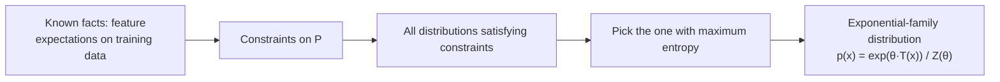
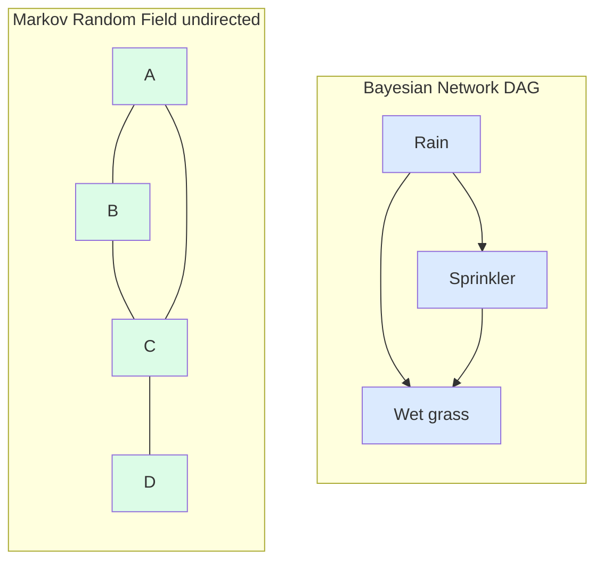
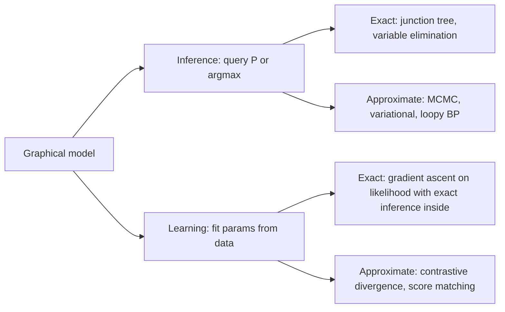

# 4 - Maximum Entropy Models and Graphical Models

[toc]

> **TL;DR:** *Maximum entropy* (MaxEnt) is the principle: among all distributions consistent with given constraints, pick the one with the highest entropy — the one that assumes nothing beyond what's required. Applied to classification with feature-expectation constraints, MaxEnt yields *exponential-family* models — and the binary case is exactly *logistic regression*. *Graphical models* are the language for describing and reasoning about high-dimensional joint distributions efficiently: *Bayesian networks* (directed), *Markov random fields* (undirected), and *conditional random fields* (structured discriminative). Inference and learning in graphical models is what makes structured prediction tractable.

## Vocabulary

**Entropy of a distribution**

```math
H(p) = -\sum_x p(x) \log p(x)
```

The expected information content. Maximum at uniform; zero for a point mass. The principle of maximum entropy says: when in doubt, prefer the highest-entropy distribution.

---

**Maximum entropy principle**

> Among all distributions satisfying a given set of constraints, pick the one with the largest entropy.

Operationally, encode "what we know" as expectation constraints; the MaxEnt solution is the unique distribution that uses no more structure than required.

---

**Exponential family**

```math
p(x; \boldsymbol{\theta}) = h(x) \exp\!\big(\boldsymbol{\theta}^\top \mathbf{T}(x) - A(\boldsymbol{\theta})\big)
```

A family parameterized by natural parameters $\boldsymbol{\theta}$ with sufficient statistics $\mathbf{T}(x)$. Gaussian, Bernoulli, Poisson, multinomial, exponential, gamma, beta all live here.

---

**MaxEnt classifier (multinomial logistic regression)**

```math
P(y = c \mid \mathbf{x}) = \frac{\exp(\mathbf{w}_c^\top \mathbf{f}(\mathbf{x}, c))}{\sum_{c'} \exp(\mathbf{w}_{c'}^\top \mathbf{f}(\mathbf{x}, c'))}
```

The MaxEnt distribution subject to feature-expectation constraints. Equivalent to softmax / multiclass logistic regression.

---

**Graphical model**

A probability distribution whose conditional independence structure is encoded as a graph. *Directed* (Bayesian network) or *undirected* (Markov random field).

---

**Bayesian network (BN)**

A DAG where each node is a random variable and each edge encodes a conditional dependency. The joint factors as:

```math
P(X_1, \ldots, X_n) = \prod_i P(X_i \mid \text{parents}(X_i))
```

---

**Markov Random Field (MRF)**

```math
P(X_1, \ldots, X_n) = \frac{1}{Z}\prod_c \phi_c(X_c)
```

Undirected; joint factors as a product of clique potentials $\phi_c$ over the graph's cliques, normalized by partition function $Z$.

---

**Conditional Random Field (CRF)**

A discriminative MRF: model $P(\mathbf{y} \mid \mathbf{x})$ directly as an undirected graph over $\mathbf{y}$ conditioned on $\mathbf{x}$. The structured-prediction analog of logistic regression.

## Intuition

Suppose you know the average height of a population is 170 cm. What's the distribution of heights? Any of infinitely many distributions could have mean 170. The *maximum entropy* principle says: pick the one that *doesn't assume anything else* — that is, the highest-entropy distribution subject to that single constraint. For real-valued data with a fixed mean and variance, the MaxEnt distribution is the Gaussian. For non-negative data with a fixed mean, it's the exponential. MaxEnt converts vague knowledge into specific distributions, principled by Occam's razor.

Applied to classification: we want $P(c \mid \mathbf{x})$. We know certain *feature expectations* — say, "spam emails have 'free' on average $k$ times more than ham." If we want a distribution consistent with these feature expectations and otherwise uninformed, the MaxEnt principle gives us a unique answer: an exponential-family distribution of the form $\frac{1}{Z}\exp(\mathbf{w}^\top \mathbf{f})$. For binary classification this *is* logistic regression. For multiclass it's softmax. So logistic regression isn't an ad hoc choice — it's the unique distribution that satisfies the feature-expectation constraints while assuming nothing else.

Graphical models extend this story to *joint* distributions over many variables. A 100-binary-variable joint distribution has $2^{100}$ entries; you can't write it down. But if you know that variable $X_5$ depends only on $X_2$ and $X_4$, you can factor the joint accordingly. Graphical models encode these conditional independence assumptions as a graph — a sparse representation that makes both *inference* (computing marginals, conditionals) and *learning* (estimating parameters from data) tractable for problems that would otherwise be exponential.

## The MaxEnt principle in detail



### The constrained optimization

Maximize entropy subject to expectation constraints:

```math
\max_p\ H(p) = -\sum_x p(x) \log p(x)
```

```math
\text{s.t.}\ \sum_x p(x) f_i(x) = c_i \quad \forall i, \qquad \sum_x p(x) = 1
```

Lagrangian:

```math
\mathcal{L} = -\sum_x p(x) \log p(x) - \sum_i \lambda_i\!\left(\sum_x p(x) f_i(x) - c_i\right) - \mu\!\left(\sum_x p(x) - 1\right)
```

Differentiating with respect to $p(x)$:

```math
\frac{\partial \mathcal{L}}{\partial p(x)} = -\log p(x) - 1 - \sum_i \lambda_i f_i(x) - \mu = 0
```

```math
\Rightarrow p(x) = \exp\!\left(-1 - \mu - \sum_i \lambda_i f_i(x)\right) = \frac{1}{Z}\exp\!\left(-\sum_i \lambda_i f_i(x)\right)
```

This is an **exponential family** distribution! The Lagrange multipliers $\lambda_i$ become the natural parameters.

### MaxEnt → softmax classifier

For multiclass classification, define feature functions $f_i(\mathbf{x}, c)$ over $(\mathbf{x}, c)$ pairs, constrain the model to match empirical expectations, maximize entropy of $P(c \mid \mathbf{x})$:

```math
P(c \mid \mathbf{x}; \boldsymbol{\lambda}) = \frac{\exp(\sum_i \lambda_i f_i(\mathbf{x}, c))}{\sum_{c'} \exp(\sum_i \lambda_i f_i(\mathbf{x}, c'))}
```

This is **softmax**. The MaxEnt classifier is multinomial logistic regression — derived from first principles, not guessed.

> [!IMPORTANT]
> The connection between MaxEnt and logistic regression is one of the deepest in ML. It explains *why* softmax shows up everywhere in modern neural networks: it's the unique distribution that matches feature-expectation constraints with maximum entropy. Every cross-entropy-trained classifier inherits this MaxEnt structure.

## Training a MaxEnt classifier

Same as logistic regression — maximize conditional log-likelihood:

```math
\mathcal{L}(\boldsymbol{\lambda}) = \sum_i \log P(c_i \mid \mathbf{x}_i; \boldsymbol{\lambda}) = \sum_i \left[\boldsymbol{\lambda}^\top \mathbf{f}(\mathbf{x}_i, c_i) - \log \sum_{c'} \exp(\boldsymbol{\lambda}^\top \mathbf{f}(\mathbf{x}_i, c'))\right]
```

Convex; solve by gradient methods, L-BFGS, or IRLS. The classical NLP algorithm is **Generalized Iterative Scaling (GIS)** — predates L-BFGS but is conceptually elegant.

## Graphical models — encoding structure



### Bayesian networks

A DAG where node $X_i$ has conditional distribution $P(X_i \mid \text{parents}(X_i))$. Joint:

```math
P(X_1, \ldots, X_n) = \prod_i P(X_i \mid \text{Pa}(X_i))
```

Reads as: each variable depends only on its direct causes (parents). Used heavily in medicine, bioinformatics, fault diagnosis.

Example — the classic *rain / sprinkler / wet grass*:
- $P(\text{Rain}) = 0.2$
- $P(\text{Sprinkler} \mid \text{Rain})$: lower probability if it's raining (you don't water during rain)
- $P(\text{WetGrass} \mid \text{Rain}, \text{Sprinkler})$: high if either is true

Given a wet lawn, we can *infer*: what's the probability of rain? Bayesian inference on the network.

### Conditional independence in BNs

A variable is conditionally independent of its non-descendants given its parents. The **d-separation** algorithm reads conditional independence facts directly off the graph.

```python
# Tiny BN with pgmpy
from pgmpy.models import BayesianNetwork
from pgmpy.factors.discrete import TabularCPD
from pgmpy.inference import VariableElimination

model = BayesianNetwork([("Rain", "Sprinkler"),
                         ("Rain", "WetGrass"),
                         ("Sprinkler", "WetGrass")])

cpd_rain = TabularCPD("Rain", 2, [[0.8], [0.2]])
cpd_sprinkler = TabularCPD(
    "Sprinkler", 2,
    [[0.6, 0.99],     # P(S=0 | R=0), P(S=0 | R=1)
     [0.4, 0.01]],
    evidence=["Rain"], evidence_card=[2])
cpd_wet = TabularCPD(
    "WetGrass", 2,
    [[1.0, 0.1, 0.1, 0.01],     # P(W=0 | R, S) for the 4 combos
     [0.0, 0.9, 0.9, 0.99]],
    evidence=["Sprinkler", "Rain"], evidence_card=[2, 2])

model.add_cpds(cpd_rain, cpd_sprinkler, cpd_wet)

inf = VariableElimination(model)
print(inf.query(["Rain"], evidence={"WetGrass": 1}))
# P(Rain=1 | WetGrass=1) ≈ ?
```

### Markov Random Fields

Undirected. Joint factors over *cliques* (fully connected subsets):

```math
P(\mathbf{x}) = \frac{1}{Z}\prod_c \phi_c(\mathbf{x}_c), \quad Z = \sum_\mathbf{x} \prod_c \phi_c(\mathbf{x}_c)
```

$\phi_c$ are non-negative "potential functions"; $Z$ is the partition function. MRFs naturally model symmetric relationships (image pixels, text n-grams) where directionality is artificial.

### Conditional Random Fields

A *discriminative* MRF — model $P(\mathbf{y} \mid \mathbf{x})$ where $\mathbf{y}$ is a structured label (sequence, parse tree, image segmentation). The classic NLP example: sequence tagging (POS tagging, named-entity recognition). Linear-chain CRF:

```math
P(\mathbf{y} \mid \mathbf{x}) = \frac{1}{Z(\mathbf{x})}\exp\!\left(\sum_t \sum_k \lambda_k f_k(y_{t-1}, y_t, \mathbf{x}, t)\right)
```

Each feature $f_k$ touches consecutive labels and the input. CRF is to structured prediction what logistic regression is to scalar classification — both are MaxEnt models with structured outputs.

## Inference algorithms

The two computational tasks on any graphical model:



### Exact inference

- **Variable elimination** — sum / max out variables in a smart order. Exponential in *tree-width* of the graph.
- **Junction tree** — convert any graphical model to a tree of cliques; exact inference is linear in the tree.

Tractable only for low-tree-width graphs (chains, trees, small graphs).

### Approximate inference

- **Gibbs sampling / MCMC** — sample iteratively from each conditional; long enough chain converges to the joint.
- **Variational inference** — approximate the true posterior with a tractable family (mean-field, structured); minimize KL divergence.
- **Loopy belief propagation** — pretend the graph is a tree, run message-passing; works empirically on many graphs.

## In practice

> [!IMPORTANT]
> MaxEnt models are *the* family for "I have features, I want probabilities, I want them principled." Whenever you reach for softmax or logistic regression, you're using MaxEnt. Recognizing the connection means you can derive variants (more constraints → richer features → naturally extensions) without guessing.

> [!TIP]
> Linear-chain CRFs are excellent for *sequence labeling* — NER, POS tagging, image-segmentation boundary refinement, transcription post-processing. They have a simple linear-time inference algorithm (Viterbi for argmax, forward-backward for marginals), modest computational cost, and produce *globally consistent* predictions (unlike per-token softmax).

> [!CAUTION]
> Beyond chain CRFs, exact inference in graphical models is intractable for most real graphs. Plan for *approximate* inference from the start — and validate that the approximation isn't lying about confidence. Variational methods systematically underestimate posterior uncertainty.

In modern ML, graphical models live alongside deep networks rather than competing with them. Deep generative models (VAEs, normalizing flows, diffusion) are graphical models with neural-network factor functions. Energy-based models are MRFs whose potentials are learned by deep nets. The vocabulary of probabilistic graphical models hasn't been replaced — it's been *enriched* with neural building blocks.

## Pitfalls

- **"MaxEnt always gives the right distribution."** It gives the distribution that's *consistent with your constraints and assumes nothing else*. If your constraints are wrong (missed feature, wrong expectation), the resulting distribution is wrong.
- **"More features ⇒ better MaxEnt."** Beyond a point, feature explosion makes training expensive and overfits. Regularize (L2 / L1 on $\boldsymbol{\lambda}$).
- **"Bayesian networks model causality."** They model *probabilistic dependence*, which is symmetric in many ways. Causal interpretation requires additional assumptions (causal Markov condition, interventions). Don't confuse correlation arrows for causal arrows.
- **"Exact inference scales."** Only for low-tree-width graphs. Most realistic graphs are high-tree-width; reach for approximate inference.
- **"CRFs are obsolete because of LLMs."** For *high-volume* sequence-tagging tasks where you control the feature pipeline, linear-chain CRFs trained on properly-labeled data still beat fine-tuned LLMs in cost-per-accuracy. Use the right tool.

## Exercises

### Exercise 1 — Find the MaxEnt distribution for a die

You roll a 6-sided die many times and observe the average is 4.5 (not the fair 3.5). Find the MaxEnt distribution over $\{1, \ldots, 6\}$ consistent with this average.

#### Solution

MaxEnt with one constraint: $\mathbb{E}[X] = 4.5$. The MaxEnt solution is exponential in the constraint variable:

```math
p(x) = \frac{\exp(\lambda x)}{\sum_{x=1}^6 \exp(\lambda x)}, \quad x \in \{1, \ldots, 6\}
```

Choose $\lambda$ so $\mathbb{E}[X] = 4.5$.

```python
import numpy as np
from scipy.optimize import brentq

def expectation(lam: float) -> float:
    xs = np.arange(1, 7)
    p = np.exp(lam * xs)
    p /= p.sum()
    return float((xs * p).sum()) - 4.5

lam = brentq(expectation, 0.0, 5.0)
xs = np.arange(1, 7)
p = np.exp(lam * xs)
p /= p.sum()
print(f"lambda = {lam:.3f}, p = {p.round(3)}")
# lambda ≈ 0.371, p ≈ [0.054, 0.079, 0.114, 0.165, 0.240, 0.347]
```

The distribution exponentially favors high values, as required by the high observed mean — but it's the *least* committed distribution beyond that. It's monotonically increasing without being a point mass.

---

### Exercise 2 — When MaxEnt = Gaussian

For continuous $X$ on $\mathbb{R}$ with fixed mean $\mu$ and variance $\sigma^2$, derive the MaxEnt distribution.

#### Solution

Constraints: $\mathbb{E}[X] = \mu$, $\mathbb{E}[X^2] = \mu^2 + \sigma^2$ (equivalent to variance constraint).

MaxEnt with two constraints gives:

```math
p(x) = \frac{1}{Z}\exp(\lambda_1 x + \lambda_2 x^2)
```

This is a *quadratic exponential* — match it to the Gaussian PDF $\frac{1}{\sqrt{2\pi\sigma^2}}\exp(-(x-\mu)^2/(2\sigma^2))$:

```math
\lambda_2 = -\frac{1}{2\sigma^2}, \quad \lambda_1 = \frac{\mu}{\sigma^2}, \quad Z = \sqrt{2\pi\sigma^2} \exp\!\left(\frac{\mu^2}{2\sigma^2}\right)
```

So the **Gaussian is the MaxEnt distribution** for real-valued data with given mean and variance. This is one reason Gaussian assumptions are so pervasive: they encode *minimum* additional structure beyond the first two moments.

---

### Exercise 3 — Logistic regression as MaxEnt

Show that binary logistic regression is the MaxEnt classifier with feature-expectation constraints.

#### Solution

Define features $f_j(\mathbf{x}, y) = x_j \cdot \mathbb{1}[y = 1]$ for $j = 1, \ldots, d$.

Constraint: the model's expectation of each feature equals the empirical expectation:

```math
\mathbb{E}_{P}[f_j] = \frac{1}{n}\sum_i x_{ij}\, \mathbb{1}[y_i = 1]
```

MaxEnt solution (by Lagrangian, as derived above):

```math
P(y = 1 \mid \mathbf{x}) = \frac{\exp(\sum_j \lambda_j f_j(\mathbf{x}, 1))}{\exp(\sum_j \lambda_j f_j(\mathbf{x}, 0)) + \exp(\sum_j \lambda_j f_j(\mathbf{x}, 1))}
```

For our features, $f_j(\mathbf{x}, 0) = 0$ and $f_j(\mathbf{x}, 1) = x_j$:

```math
P(y = 1 \mid \mathbf{x}) = \frac{\exp(\boldsymbol{\lambda}^\top \mathbf{x})}{1 + \exp(\boldsymbol{\lambda}^\top \mathbf{x})} = \sigma(\boldsymbol{\lambda}^\top \mathbf{x})
```

This is *exactly* logistic regression with $\mathbf{w} = \boldsymbol{\lambda}$. Logistic regression isn't a heuristic — it's the unique distribution matching feature expectations while making no additional assumptions.

---

### Exercise 4 — Read independence from a BN

For the network $A \to B \to C$ with no other edges, which of the following statements are true?

(a) $A \perp C$
(b) $A \perp C \mid B$
(c) $A \perp B$

#### Solution

The graph $A \to B \to C$ is a *chain*. Reading conditional independence:

**(a) $A \perp C$**: FALSE. $A$ influences $C$ through $B$. Without observing $B$, knowing $A$ tells us something about $C$ via the chain.

**(b) $A \perp C \mid B$**: TRUE. Once we observe $B$, the path from $A$ to $C$ is "blocked" — additional information about $A$ doesn't change beliefs about $C$. This is the **d-separation** property: a chain is blocked by observing the middle.

**(c) $A \perp B$**: FALSE. $A$ is the direct parent of $B$; they are obviously dependent.

The general rule for chains: knowing the middle "screens off" the endpoints. Chains, common causes, and v-structures (colliders) have three different d-separation behaviors:
- Chain ($A \to B \to C$): blocked by $B$.
- Common cause ($A \leftarrow B \to C$): blocked by $B$.
- Collider ($A \to B \leftarrow C$): blocked *by default*, *unblocked* by conditioning on $B$ (or its descendants).

These rules are the foundation of d-separation, which lets you read independence facts off a Bayesian network without computing anything.

## Sources

- Ramakrishnan, G. & Nagesh, A. (2011). *CS725: Foundations of Machine Learning — Lecture Notes*. IIT Bombay. §16, §17.
- Jaynes, E. T. (1957). *Information Theory and Statistical Mechanics*. Phys. Rev.
- Berger, A. L., Della Pietra, V. J., & Della Pietra, S. A. (1996). *A Maximum Entropy Approach to Natural Language Processing*. Computational Linguistics.
- Lafferty, J., McCallum, A., & Pereira, F. (2001). *Conditional Random Fields: Probabilistic Models for Segmenting and Labeling Sequence Data*. ICML.
- Pearl, J. (1988). *Probabilistic Reasoning in Intelligent Systems: Networks of Plausible Inference*. Morgan Kaufmann.
- Koller, D. & Friedman, N. (2009). *Probabilistic Graphical Models: Principles and Techniques*. MIT Press.
- Wainwright, M. J. & Jordan, M. I. (2008). *Graphical Models, Exponential Families, and Variational Inference*. Foundations and Trends in Machine Learning.

## Related

- [Probability Primer](../1-foundations/2-probability-primer.md)
- [Estimation and Maximum Likelihood](../1-foundations/3-estimation-and-mle.md)
- [Optimization and KKT](../1-foundations/4-optimization-and-kkt.md)
- [Naive Bayes](../2-supervised-learning/2-naive-bayes.md)
- [Perceptron and Logistic Regression](../2-supervised-learning/5-perceptron-and-logistic-regression.md)
- [SVM and Kernels](../2-supervised-learning/6-svm-and-kernels.md)
- [Clustering, EM, and k-means](./1-clustering-em-and-kmeans.md)
