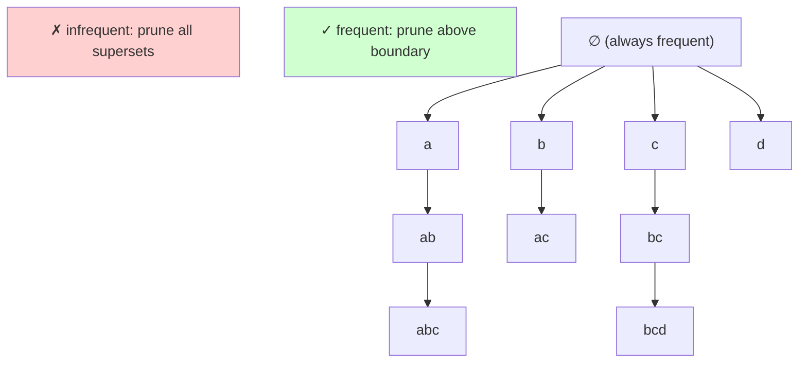

# 5 - Association Rules and Frequent Itemset Mining

[toc]

> **TL;DR:** Association rule mining discovers co-occurrence patterns of the form "customers who buy X also tend to buy Y" from transaction databases. The canonical two-step pipeline is: (1) mine all frequent itemsets using the Apriori algorithm or its successor FP-Growth, then (2) generate strong rules from those itemsets using confidence and lift thresholds. The key algorithmic insight — the Apriori principle — is that no superset of an infrequent itemset can be frequent, enabling aggressive pruning of the 2ⁿ-sized search space.

## Vocabulary

**Item** (x) — an atomic element of the domain, e.g. a product SKU. All items together form the item universe ℐ = {x₁,...,xₘ}.

**Itemset** (X) — any subset of ℐ. A k-itemset has exactly k elements.

**Transaction** — a pair (tid, X_tid) where tid is a unique identifier and X_tid ⊆ ℐ is the set of items purchased in that transaction.

**Transaction dataset** (𝒟) — the complete set of transactions: 𝒟 = {(tid, X_tid) | tid ∈ 𝒯, X_tid ⊆ ℐ}.

**Frequency** (freq(X)) — number of transactions containing X as a subset: |{(tid, X_tid) ∈ 𝒟 | X ⊆ X_tid}|.

**Support** (supp(X)) — fraction of transactions containing X:

```math
\text{supp}(X) = \frac{\text{freq}(X)}{|\mathcal{D}|}
```

---

**Frequent itemset** — an itemset X with supp(X) ≥ MinSupp. The collection of all frequent itemsets is denoted ℱ.

**Association rule** — an implication of the form A → C where A ∩ C = ∅ and both are subsets of ℐ. Read as "if a transaction contains A it also tends to contain C".

**Confidence** (conf(A → C)) — conditional probability that a transaction containing A also contains C:

```math
\text{conf}(A \to C) = \frac{\text{supp}(A \cup C)}{\text{supp}(A)}
```

---

**Lift** (lift(A → C)) — ratio of the observed support to what would be expected if A and C were independent:

```math
\text{lift}(A \to C) = \frac{\text{supp}(A \cup C)}{\text{supp}(A) \cdot \text{supp}(C)}
```

---

**Apriori principle** (downward closure / antimonotonicity) — if an itemset X is infrequent, then every superset Y ⊇ X is also infrequent. Equivalently, all subsets of a frequent itemset are frequent.

**FP-tree** — a compressed trie representation of the transaction database that encodes all frequent items in a single in-memory structure, enabling FP-Growth to mine frequent itemsets without candidate generation.

**MinSupp / MinConf** — user-specified thresholds for support and confidence; all rules with values below these thresholds are discarded.

## Intuition

Think of the itemset lattice as a diamond-shaped Hasse diagram: ∅ at the top, all singletons one level down, all pairs below that, and so on down to the full item universe at the bottom. The goal is to find all nodes in this lattice that appear in at least MinSupp fraction of transactions.

The naive approach evaluates every node: 2^|ℐ| itemsets, which is 2^50,000 for a typical retail dataset — astronomically infeasible. The Apriori principle lets you draw a "frequency boundary" across the lattice: everything above it is frequent, everything below is infrequent, and you never need to examine anything below an infrequent node. This converts exponential search into a level-by-level BFS that prunes entire subtrees.



**Figure:** the Apriori principle prunes all supersets of any infrequent itemset (red region), cutting the search space dramatically.

## How it Works

The full pipeline has two stages: frequent itemset mining (computationally dominant) and rule generation (fast once itemsets are known).

### Stage 1 — Apriori: Level-wise Candidate Generation

Apriori is a BFS algorithm over the itemset lattice. It starts at level k=1 (singletons), scans the database to compute their support, retains the frequent ones (ℱ₁), then uses ℱ₁ to generate candidate 2-itemsets (ℂ₂), scans again to compute their support, and so on.

The candidate generation rule for Cₖ uses the Apriori principle: a k-itemset is a candidate only if all its (k-1)-subsets are in ℱₖ₋₁. This is the key pruning step that makes Apriori tractable.

```math
\mathcal{C}_k = \{c_k \mid \forall X \subset c_k,\, |X| = k-1,\, X \in \mathcal{F}_{k-1}\}
```

The database is scanned once per level to compute the support of each candidate. This makes Apriori I/O-intensive: for real datasets (billions of transactions), even a few full scans are prohibitively slow.

### Stage 2 — Rule Generation from Frequent Itemsets

Once ℱ is known, rules are generated by partitioning each frequent itemset l into antecedent A = l − C and consequent C, for every non-empty proper subset C ⊂ l. A rule A → C is strong if its confidence exceeds MinConf.

An important property allows further pruning: if A → C is not strong (confidence below MinConf), then for any proper subset C̃ ⊂ C, the rule (l − C̃) → C̃ is also not strong. This means rule generation can also apply a downward-closure pruning over consequents.

```math
\text{conf}(A \to C) = \frac{\text{supp}(l)}{\text{supp}(l - C)} \geq \text{MinConf}
```

From a k-itemset (k > 1) one can generate at most 2ᵏ − 1 non-trivial rules.

### FP-Growth: Avoiding Candidate Generation

FP-Growth avoids generating candidate itemsets entirely. It builds a compact FP-tree from the database in two passes, then mines patterns recursively by building "conditional pattern bases" for each item. FP-Growth requires only two database scans and is dramatically faster than Apriori on dense datasets. The algorithmic idea: compress the database into a tree where shared prefixes among transactions are merged; then for each frequent item i, extract the subtree of paths ending at i (the conditional FP-tree) and mine it recursively.

> [!TIP]
> In production, use FP-Growth (via `mlxtend` or `PySpark MLlib`) rather than Apriori for any dataset with more than a few thousand transactions. FP-Growth's two-pass, no-candidate design is typically 10–100× faster on realistic datasets.

## Math

The lift metric provides a useful probabilistic interpretation. Under independence, P(A ∪ C) = P(A)·P(C). So lift = 1 means A and C co-occur exactly as often as independence predicts. Lift > 1 means positive association (buy X makes buying Y more likely). Lift < 1 means negative association (buying X makes Y less likely — cross-category substitution).

```math
\text{lift}(A \to C) = \frac{P(A \cup C)}{P(A) \cdot P(C)} = \frac{\text{conf}(A \to C)}{\text{supp}(C)}
```

The support-confidence framework has a well-known limitation: it ignores the base rate of the consequent. A rule with 90% confidence sounds impressive, but if the consequent appears in 95% of transactions anyway, the rule adds no information. Lift corrects for this by normalising against the base rate.

**Complexity:** the number of candidate k-itemsets is at most C(|ℱₖ₋₁|, k), which is O(|ℐ|ᵏ) in the worst case. Each level scan is O(n·|ℐ|). Total Apriori complexity is O(n·|ℐ|²·|ℱ|) in the worst case but much better in practice when MinSupp is high.

## Real-world Example

A grocery retailer wants to find cross-selling opportunities in 5 transaction records. Items: a=coffee, b=milk, c=butter, d=bread.

Transactions: T1={a,b}, T2={a,c}, T3={c,d}, T4={b,c,d}, T5={a,b,c,d}. MinSupp=40% (2/5), MinConf=60%.

```python
from mlxtend.preprocessing import TransactionEncoder
from mlxtend.frequent_patterns import apriori, association_rules
import pandas as pd

# Encode transactions as a boolean DataFrame
transactions = [
    ['coffee', 'milk'],
    ['coffee', 'butter'],
    ['butter', 'bread'],
    ['milk', 'butter', 'bread'],
    ['coffee', 'milk', 'butter', 'bread'],
]

te = TransactionEncoder()
te_array = te.fit_transform(transactions)
df = pd.DataFrame(te_array, columns=te.columns_)

# Mine frequent itemsets with Apriori
freq_items = apriori(df, min_support=0.4, use_colnames=True)
print(freq_items.sort_values('support', ascending=False))
# Expected frequent itemsets:
#  {butter}        support=4/5=0.80
#  {bread}         support=3/5=0.60
#  {coffee}        support=3/5=0.60
#  {milk}          support=3/5=0.60
#  {butter,bread}  support=3/5=0.60
#  {butter,milk}   support=2/5=0.40
#  {coffee,milk}   support=2/5=0.40
#  ...

# Generate association rules
rules = association_rules(freq_items, metric='confidence', min_threshold=0.60)
rules = rules[['antecedents','consequents','support','confidence','lift']]
print(rules.sort_values('lift', ascending=False).head(5))
# Top rule by lift: bread → butter, conf=100%, lift=1.25
```

> [!WARNING]
> Never interpret high confidence alone as a useful rule. In the example, if butter appears in 80% of transactions, then a rule "X → butter" with 80% confidence is trivially true and adds no actionable insight. Always check lift > 1 as a minimum threshold for a rule to be interesting.

## In Practice

**MinSupp selection is critical.** Setting MinSupp too low causes combinatorial explosion — the number of frequent itemsets grows exponentially as support drops. A common approach is to start at 5–10% and lower it only if too few patterns emerge.

**Memory bottleneck.** Apriori's candidate sets for level k=2 can be O(|ℐ|²) in size. For 10,000 items this is 100 million candidates — too large for RAM. FP-Growth's tree structure is bounded by the database size and avoids this.

**Transaction representation.** The three representations of 𝒟 (row-wise: each transaction is a list; column-wise: each item has a list of its transactions as a "tidset"; boolean matrix) have different performance profiles. Column-wise (vertical layout) is most efficient for support counting via tidset intersection. FP-Growth uses a prefix tree (horizontal-ish).

> [!NOTE]
> Association rules are a form of unsupervised pattern discovery — no target variable, no train/test split. Evaluation is inherently domain-driven: a rule is "good" if a business analyst can act on it. Statistical significance testing (chi-squared on the contingency table) can screen out spurious rules caused by random co-occurrence.

**Quantitative association rules.** Standard Apriori handles binary presence/absence of items. Quantitative variants discretise continuous attributes (age ranges, purchase amounts) and include them in the item space, enabling rules like "age ∈ [30,40] ∧ income > 80k → buys premium wine".

## Pitfalls

- **"High confidence = useful rule."** — Confidence ignores the base rate of the consequent. A rule with 80% confidence for a consequent that appears in 90% of transactions is actually a negative association (lift < 1). Use lift to detect this.
- **"Apriori is the best algorithm."** — Apriori is the foundational algorithm but is slow on large, dense datasets due to multiple database scans and huge candidate sets. FP-Growth, ECLAT (vertical tidset intersection), or Spark-based distributed algorithms are preferred in production.
- **"Support and confidence are enough thresholds."** — They are necessary but not sufficient. A rule can have high support and confidence but be coincidental (lift ≈ 1). Additional interestingness measures like conviction, leverage, and chi-squared are often used alongside lift.
- **"Association rules imply causation."** — A rule butter → bread says that butter and bread co-occur frequently. It does not say buying butter causes someone to buy bread. These are correlational patterns, not causal ones.

## Exercises

### Exercise 1 — Support and Confidence by Hand

Given the 5-transaction dataset from the Real-world Example (T1–T5), compute supp({coffee, milk}) and conf(coffee → milk) manually.

#### Solution 1

Transactions containing both coffee AND milk: T1={a,b}=yes, T2={a,c}=no, T3={c,d}=no, T4={b,c,d}=no, T5={a,b,c,d}=yes.

freq({coffee,milk}) = 2.

```math
\text{supp}(\{coffee, milk\}) = \frac{2}{5} = 0.40
```

Transactions containing coffee: T1, T2, T5 → freq({coffee}) = 3.

```math
\text{conf}(coffee \to milk) = \frac{\text{supp}(\{coffee, milk\})}{\text{supp}(\{coffee\})} = \frac{2/5}{3/5} = \frac{2}{3} \approx 0.667
```

With MinConf=60%, this rule is strong.

### Exercise 2 — Lift Interpretation

From the same dataset, supp({bread})=3/5=0.60, supp({butter})=4/5=0.80, and supp({bread, butter})=3/5=0.60. Compute lift(bread → butter) and interpret it.

#### Solution 2

```math
\text{lift}(bread \to butter) = \frac{\text{supp}(\{bread, butter\})}{\text{supp}(\{bread\}) \cdot \text{supp}(\{butter\})} = \frac{0.60}{0.60 \times 0.80} = \frac{0.60}{0.48} = 1.25
```

Lift = 1.25 > 1: positive association. Customers who buy bread are 25% more likely to also buy butter than a random customer selected from the full population. This is a genuinely interesting rule beyond chance — bread and butter co-occur more than independence would predict.

### Exercise 3 — Apriori Pruning

Item universe ℐ = {a,b,c,d}. After scanning level k=1, we find ℱ₁ = {a, b, c, d} (all singletons frequent). After scanning level k=2, we find ℱ₂ = {ab, ac, bc, bd, cd} (note: ad is infrequent). Which 3-itemset candidates in ℂ₃ survive Apriori pruning?

#### Solution 3

A 3-itemset is in ℂ₃ only if ALL of its 2-item subsets are in ℱ₂. List all C(4,3)=4 possible 3-itemsets:

- **abc**: 2-subsets = {ab, ac, bc}. All in ℱ₂. **Survives.**
- **abd**: 2-subsets = {ab, ad, bd}. **ad ∉ ℱ₂. Pruned.**
- **acd**: 2-subsets = {ac, ad, cd}. **ad ∉ ℱ₂. Pruned.**
- **bcd**: 2-subsets = {bc, bd, cd}. All in ℱ₂. **Survives.**

ℂ₃ = {abc, bcd}. Two candidates instead of four — the infrequent 2-itemset ad caused pruning of two 3-itemsets.

### Exercise 4 — Confidence Antimonotonicity

Given frequent itemset l = {a,b,c} with supp=0.30, supp({a,b})=0.35, supp({a,c})=0.40, supp({b,c})=0.60. Compute confidence for all 6 non-trivial rules derivable from l.

#### Solution 4

Rules from {a,b,c}: antecedent → consequent, confidence = supp(l)/supp(antecedent).

```math
\text{conf}(ab \to c) = \frac{0.30}{0.35} \approx 0.857

\text{conf}(ac \to b) = \frac{0.30}{0.40} = 0.750

\text{conf}(bc \to a) = \frac{0.30}{0.60} = 0.500

\text{conf}(a \to bc) = \frac{0.30}{\text{supp}(a)} \text{ (need supp(a) — assume 0.45)} \approx 0.667

\text{conf}(b \to ac) = \frac{0.30}{\text{supp}(b)} \text{ (assume 0.50)} = 0.600

\text{conf}(c \to ab) = \frac{0.30}{\text{supp}(c)} \text{ (assume 0.70)} \approx 0.429
```

With MinConf=60%: strong rules are ab→c, ac→b, a→bc, b→ac (assuming the noted support values). bc→a and c→ab are not strong.

### Exercise 5 — Why FP-Growth Needs Only Two Database Scans

Explain conceptually why Apriori needs one database scan per level k, while FP-Growth needs exactly two database scans regardless of the maximum frequent itemset length.

#### Solution 5

**Apriori needs k scans** because it generates candidate k-itemsets from the frequent (k-1)-itemsets, then must scan the entire database to count the support of every candidate. Each level k is a separate scan.

**FP-Growth needs exactly 2 scans:**
- **Scan 1:** count single-item support to identify all frequent singletons and sort them by decreasing frequency.
- **Scan 2:** build the FP-tree by inserting each transaction's frequent items (in sorted order) into the prefix tree, sharing common prefixes.

After these two scans the FP-tree is entirely in memory and captures all support counts. Mining proceeds by recursive conditional pattern base extraction — entirely in-memory tree traversals, no further database reads. The compression from shared prefixes means the tree is often much smaller than the original database.

## Sources

- Agrawal, R., Imielinski, T., & Swami, A. N. (1993). Mining association rules between sets of items in large databases. *Proceedings of SIGMOD 1993*, 207–216.
- Han, J., Pei, J., & Yin, Y. (2000). Mining frequent patterns without candidate generation. *Proceedings of SIGMOD 2000*, 1–12.
- Association Rules lecture slides (air(9).pdf), AI course lecture notes.
- mlxtend documentation: https://rasbt.github.io/mlxtend/user_guide/frequent_patterns/apriori/

## Related

- [4 - Clustering and Unsupervised Learning](./4-clustering-and-unsupervised.md)
- [1 - What is ML and Version Space](../1-foundations/1-what-is-ml-and-version-space.md)
- [2 - Probability Primer](../1-foundations/2-probability-primer.md)
- [6 - PageRank and Graph Algorithms](./6-pagerank-and-graph-algorithms.md)
