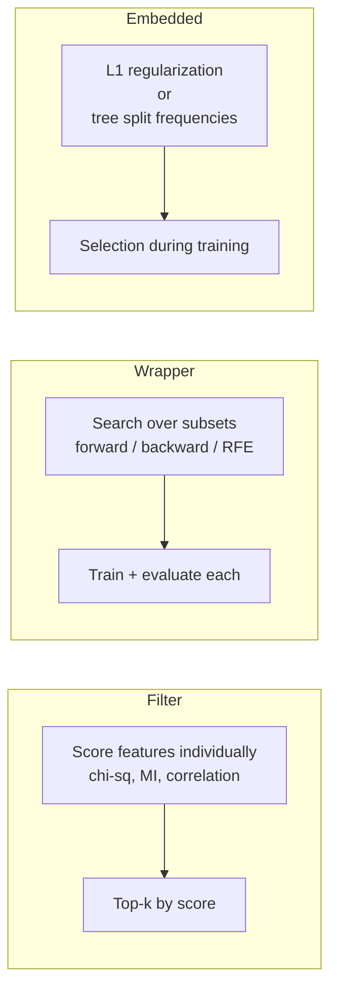
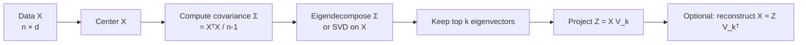
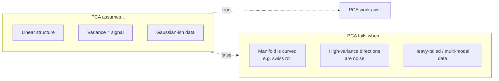
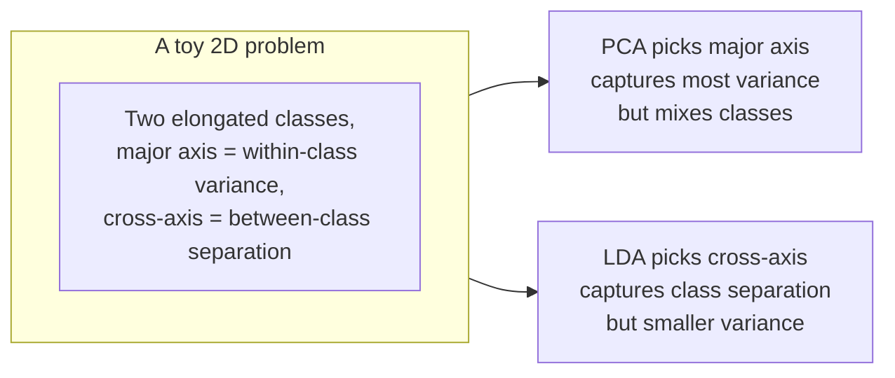

# 5 - Feature Selection and Dimensionality Reduction

[toc]

> **TL;DR:** Many features are noisy, redundant, or simply irrelevant. *Feature selection* keeps a subset of original features; *feature transformation* (PCA, LDA, autoencoders, embeddings) projects into a new lower-dimensional space that captures the signal. Both fight the curse of dimensionality, speed up training, and improve interpretability. The classical methods — filter, wrapper, embedded selection; PCA, LDA, ICA — remain widely useful even in the deep-learning era.

## Vocabulary

**Feature selection**

Choose a subset $S \subseteq \{1, \ldots, d\}$ of original features and discard the rest. Output: $\mathbf{x}_S \in \mathbb{R}^{|S|}$.

---

**Feature transformation**

Map $\mathbf{x} \in \mathbb{R}^d$ to $\mathbf{z} = g(\mathbf{x}) \in \mathbb{R}^k$ with $k < d$ via a learned function $g$.

---

**Filter method**

Score features individually by a univariate statistic (correlation, mutual information, chi-square) and keep the top $k$. Fast; ignores interactions.

---

**Wrapper method**

Search over feature subsets, evaluating each by training a model and measuring performance. Slow but interaction-aware.

---

**Embedded method**

Feature selection happens *within* model training — e.g., L1 regularization (LASSO) zeros out coefficients; decision trees implicitly select features by which they split on.

---

**Principal Component Analysis (PCA)**

```math
\mathbf{z} = U^\top (\mathbf{x} - \boldsymbol{\mu})
```

Linear projection onto the top $k$ eigenvectors of the data covariance — directions of maximum variance.

---

**Linear Discriminant Analysis (LDA, as dimensionality reduction)**

Supervised; projects to the $(K - 1)$-dimensional subspace that maximizes between-class scatter relative to within-class scatter.

---

**Independent Component Analysis (ICA)**

Find linear projections such that the resulting components are *statistically independent* (not just uncorrelated). Used for blind source separation (cocktail-party problem).

---

**Autoencoder**

A neural network trained to reconstruct its input through a low-dimensional bottleneck. The bottleneck layer's activations are a learned non-linear embedding.

## Intuition

Most real-world feature spaces are wastefully high-dimensional. Many features are noisy proxies for the same underlying signal; many are uninformative; the relationships between them are usually low-dimensional. Dimensionality reduction is the discipline of recovering that low-dimensional structure. *Feature selection* picks a subset of originals — interpretable but discrete-optimization-hard. *Feature transformation* builds new features as combinations of the originals — flexible and continuous but less interpretable.

The two big classical transformations are *PCA* and *LDA*. PCA is *unsupervised*: it finds directions of maximum total variance, ignoring class labels. LDA is *supervised*: it finds directions where class means are spread apart relative to within-class variance. They can give very different answers — a direction with high overall variance may be useless for classification (the variance is *within* each class), and the discriminative direction may have modest overall variance. Choose by what the downstream task needs.

The curse of dimensionality runs deep — k-NN, GDA, and kernel methods all degrade in high dimensions. Even neural networks, which seem dimension-agnostic, benefit from preprocessing that strips redundant features (faster training, less overfitting, better calibration). The first half of nearly every ML project is figuring out which features to use; classical methods give you principled tools for doing so.

## Feature selection — three families



### Filter methods

Score each feature independently of the model; keep the top $k$.

| Score | Use case |
| :--- | :--- |
| Pearson correlation | Continuous feature, continuous target |
| ANOVA F-statistic | Continuous feature, categorical target |
| Chi-square | Categorical feature, categorical target |
| Mutual information | Any feature, any target (non-linear) |
| Variance | Drop features with near-zero variance |

```python
from sklearn.feature_selection import SelectKBest, mutual_info_classif

selector = SelectKBest(score_func=mutual_info_classif, k=20)
X_selected = selector.fit_transform(X, y)
```

Fast, but **doesn't account for feature interactions** — two individually-weak features can together be highly informative (XOR), and a filter method discards both.

### Wrapper methods

Iteratively add (forward) or remove (backward) features, evaluating each candidate subset by training a model and scoring it on held-out data.

```python
from sklearn.feature_selection import RFE
from sklearn.linear_model import LogisticRegression

# Recursive Feature Elimination: train, drop weakest, repeat
rfe = RFE(LogisticRegression(), n_features_to_select=20)
rfe.fit(X, y)
selected_mask = rfe.support_
```

Strong but **expensive**: $O(d)$ models trained for forward / backward, more for full subset search.

### Embedded methods

Selection happens during training:

- **L1-regularized models (LASSO, L1 logistic regression)**: many coefficients become exactly zero.
- **Tree ensembles**: features unused for splits across all trees are effectively unselected.
- **Sparse neural networks**: weight pruning, lottery-ticket-style sparsification.

```python
from sklearn.linear_model import LassoCV

lasso = LassoCV(cv=5).fit(X, y)
selected_features = np.where(lasso.coef_ != 0)[0]
```

Embedded methods are the modern default: roughly wrapper-quality at filter-speed.

## Principal Component Analysis



### Mathematical statement

PCA finds the rank-$k$ orthogonal projection $V_k$ that maximizes the variance of the projected data:

```math
V_k = \arg\max_{V : V^\top V = I}\ \text{trace}(V^\top \Sigma V)
```

The solution: $V_k$ = top $k$ eigenvectors of the covariance $\Sigma$, ordered by eigenvalue magnitude.

Equivalently, PCA finds the rank-$k$ projection that *minimizes reconstruction error*:

```math
V_k = \arg\min_{V}\ \sum_i \|\mathbf{x}_i - V V^\top \mathbf{x}_i\|^2
```

Both formulations give the same answer — variance maximization and reconstruction minimization are dual problems.

### PCA from SVD

```math
X_\text{centered} = U \Sigma V^\top
```

Then:
- Principal components (right singular vectors): columns of $V$.
- Variance along each component: $\sigma_i^2 / (n - 1)$.
- Projected data: $Z = X_\text{centered} V_k = U_k \Sigma_k$.

```python
import numpy as np

class PCA:
    def __init__(self, n_components: int) -> None:
        self.k = n_components

    def fit(self, X: np.ndarray) -> "PCA":
        self.mean_ = X.mean(axis=0)
        Xc = X - self.mean_
        U, s, Vt = np.linalg.svd(Xc, full_matrices=False)
        self.components_ = Vt[:self.k]                            # k × d
        self.explained_variance_ = (s[:self.k] ** 2) / (len(X) - 1)
        return self

    def transform(self, X: np.ndarray) -> np.ndarray:
        return (X - self.mean_) @ self.components_.T

    def inverse_transform(self, Z: np.ndarray) -> np.ndarray:
        return Z @ self.components_ + self.mean_
```

### Choosing $k$

The "scree plot" — plot $\sigma_i^2$ (or cumulative explained variance) vs $i$:

```math
\text{explained variance ratio}_k = \frac{\sum_{i=1}^k \sigma_i^2}{\sum_{i=1}^d \sigma_i^2}
```

Pick $k$ to capture 90–95% of variance, or look for the "elbow" in the scree plot. Reasonable defaults:
- $k$ such that 95% variance is preserved.
- $k$ = sqrt(d) as a rule of thumb.
- For visualization, $k = 2$ or $3$.

```python
from sklearn.decomposition import PCA

pca = PCA(n_components=0.95)  # auto-pick k preserving 95% variance
X_reduced = pca.fit_transform(X)
print(f"Reduced from {X.shape[1]} to {pca.n_components_} dimensions")
```

> [!IMPORTANT]
> **Always standardize features before PCA.** PCA finds directions of maximum *variance*; on unstandardized data, features with the largest absolute scale dominate the principal components regardless of their information content. The exception: when features share natural units (image pixels, audio samples), unscaled PCA is correct.

## PCA limitations



Non-linear extensions:

| Method | Idea |
| :--- | :--- |
| Kernel PCA | PCA in a kernel-induced feature space |
| t-SNE | Preserves local neighborhoods; for 2D visualization |
| UMAP | Faster and slightly more global than t-SNE |
| Autoencoders | Neural-network learned non-linear projections |
| Locally Linear Embedding (LLE) | Local linear approximations stitched together |

For *visualization*, t-SNE and UMAP dominate. For *downstream ML*, autoencoders or PCA usually win.

## LDA (Fisher's Linear Discriminant) as dim reduction

When you have class labels, supervised dim-reduction can outperform PCA:

```math
J(\mathbf{w}) = \frac{\mathbf{w}^\top S_B \mathbf{w}}{\mathbf{w}^\top S_W \mathbf{w}}
```

with:
- $S_B = \sum_c n_c (\boldsymbol{\mu}_c - \boldsymbol{\mu})(\boldsymbol{\mu}_c - \boldsymbol{\mu})^\top$ — between-class scatter
- $S_W = \sum_c \sum_{i \in c}(\mathbf{x}_i - \boldsymbol{\mu}_c)(\mathbf{x}_i - \boldsymbol{\mu}_c)^\top$ — within-class scatter

Maximizing $J$ → solve generalized eigenvalue problem $S_B \mathbf{w} = \lambda S_W \mathbf{w}$. The top $K - 1$ generalized eigenvectors form the LDA projection. See [Gaussian Discriminant Analysis](../2-supervised-learning/3-gaussian-discriminant-analysis.md) for the closely-related classification view.

LDA produces a $(K-1)$-dimensional subspace where classes are best separated. For binary classification, that's a single direction — the "Fisher discriminant."

### PCA vs LDA — what each picks



If your downstream task is classification, prefer LDA. If your task is visualization or unsupervised modeling, prefer PCA.

## Independent Component Analysis (ICA)

Unlike PCA (which finds *uncorrelated* components), ICA finds *statistically independent* ones. The classic application: the cocktail-party problem — separate multiple speakers' voices from a mixture, given microphone recordings.

PCA: directions of max variance, orthogonal.
ICA: directions where projections are non-Gaussian (independent ≠ Gaussian since CLT).

```python
from sklearn.decomposition import FastICA

ica = FastICA(n_components=3, random_state=0)
S_reconstructed = ica.fit_transform(X)
```

Used in EEG / fMRI analysis, audio source separation, financial factor analysis.

## In practice — modern best practices

> [!IMPORTANT]
> For most tabular ML in 2026, the dominant feature-reduction approach is *embedded selection via L1 or tree ensembles* — not standalone PCA. Why: PCA discards information about which original features matter (the principal components are linear combos of all of them), hurting interpretability. Embedded methods produce sparse models with the original features intact.

> [!TIP]
> When you do reach for PCA, use it as **preprocessing for distance-based methods** (k-NN, GMM, kernel SVMs). These suffer most from the curse of dimensionality, and PCA's orthogonalization usually improves them substantially. Tree-based methods don't need PCA — they handle high-dimensional sparse data natively.

> [!CAUTION]
> Always check the **explained variance** of your PCA. If 95% variance requires 80 of your 100 original features, PCA is barely helping — your data isn't low-dimensional in the linear sense. Try non-linear methods or just keep the original features.

In modern deep learning, "dimensionality reduction" is implicit in *learned embeddings* — the bottleneck layer of an autoencoder, the [CLIP](../../AI-Engineering/1-foundations/4-multimodal-and-embeddings.md)-style encoder of an image, the token embeddings of a Transformer. These are non-linear, supervised, and tuned end-to-end for downstream tasks — strictly more powerful than PCA when you have enough data.

## Pitfalls

- **"More features = more information = better model."** Often false. Irrelevant features dilute signal, slow training, and increase overfit risk. Less is often more.
- **"PCA improves classification."** It can — by reducing noise — but it can also *hurt* by discarding low-variance directions that happen to be class-discriminative. Always test both with and without PCA.
- **"Standardization is optional."** It's mandatory for PCA, k-NN, k-means, GDA, SVM, neural-net inputs. Skip it at your peril.
- **"t-SNE distances are meaningful."** They're not — t-SNE distorts global structure for local fidelity. Use t-SNE for visualization only, never for downstream ML.
- **"My L1 model selected the 'most important' features."** L1 picks a representative subset, but among correlated features the choice can be arbitrary. Re-run with different random seeds; if the selected set varies, your features are correlated. Use stability selection for honest selection.

## Exercises

### Exercise 1 — Compute PCA on a tiny dataset

Given the 3-point 2D dataset $\mathbf{x}_1 = (1, 1), \mathbf{x}_2 = (2, 2), \mathbf{x}_3 = (3, 3)$, compute the first principal component.

#### Solution

Center the data: $\bar{\mathbf{x}} = (2, 2)$, so centered points are $(-1, -1), (0, 0), (1, 1)$.

Covariance:

```math
\Sigma = \frac{1}{n-1} X_c^\top X_c = \frac{1}{2}\begin{pmatrix} 2 & 2 \\ 2 & 2 \end{pmatrix} = \begin{pmatrix} 1 & 1 \\ 1 & 1 \end{pmatrix}
```

Eigenvalues: $\lambda_1 = 2, \lambda_2 = 0$ (one zero because data lies on a 1D line).

Eigenvector for $\lambda_1 = 2$: solve $(\Sigma - 2I)\mathbf{v} = 0 \Rightarrow v_2 = v_1$. Normalize: $\mathbf{v}_1 = (1/\sqrt{2}, 1/\sqrt{2})$.

The first principal component is along the line $y = x$ — exactly the direction of all the data. PCA correctly identified the data is intrinsically 1D, and the projection onto $\mathbf{v}_1$ recovers the data's position along the line.

---

### Exercise 2 — Why standardize before PCA?

Suppose your data has features in vastly different units: one in meters (range 0.5–1.0) and one in millimeters (range 500–1000). Both measure the same physical quantity. What does PCA do without standardization, and why is it wrong?

#### Solution

Without standardization, the mm feature has variance $\sim 25{,}000$; the m feature has variance $\sim 0.025$. The covariance is dominated by the mm feature; the first principal component is essentially aligned with it, and the m feature's contribution is invisible.

But the two features are physically equivalent — they measure the same thing! The "first PC" is just "millimeters," with no real dimensionality reduction. A user who didn't standardize would conclude their data is one-dimensional, when actually they have one feature in two units.

**Standardize first** (z-score each feature). Then both features have variance 1, and PCA finds an actually informative direction — likely the diagonal, since the features are highly correlated.

This pattern (features with mismatched scales but equal importance) is the single most common PCA pitfall. Always standardize.

---

### Exercise 3 — When PCA hurts classification

Give an example where PCA preprocessing *hurts* classification accuracy compared to using raw features.

#### Solution

Consider a 2D dataset where:
- Feature 1 is *noise*: $\mathcal{N}(0, 10)$, no class information.
- Feature 2 is the *true class-discriminating feature*: $\mathcal{N}(0, 1)$ for class 0, $\mathcal{N}(3, 1)$ for class 1.

The dataset's total variance is dominated by Feature 1 (variance 100) — but Feature 1 has *zero* class information. Feature 2 has total variance 1 + (1.5)² (class-conditional variance + between-class variance) ≈ 3.25 — much smaller — but is the *only* informative feature.

PCA with $k = 1$ will pick Feature 1 (highest variance) and discard Feature 2. The classifier is left with pure noise. Without PCA, the classifier sees Feature 2 and works.

**The lesson**: PCA assumes high variance = signal. When that's wrong, PCA can be catastrophic. Use LDA (supervised; uses labels) or any feature-selection method that scores on the target if your downstream task is classification.

---

### Exercise 4 — Choose a dim-reduction method

For each task, recommend a method.

(a) Visualize a 50-dimensional embedding of 5,000 documents in 2D for a presentation.
(b) Reduce 1,000 highly-correlated sensor measurements to a smaller set for downstream regression.
(c) Identify which of 100,000 SNPs (genetic markers) are associated with a disease, given 500 patients.
(d) Separate two unknown audio sources mixed across two microphones.

#### Solution

(a) **t-SNE or UMAP**. Both optimize for local-neighborhood preservation in 2D — perfect for "is there cluster structure?" visualization. UMAP is faster and preserves a bit more global structure.

(b) **PCA**. Linear, fast, captures variance from correlated sensors. Reduce to (say) $k = 50$ components that explain 95% variance, feed downstream regression. Optional: also try L1-regularized regression on raw sensors for embedded selection.

(c) **L1 (LASSO) embedded selection**. $d = 100{,}000 \gg n = 500$ — classic high-dimensional regime. PCA would mix all 100k SNPs into components; you'd lose the SNP-level interpretability that's the whole point. LASSO gives a sparse set of SNPs with explicit identities. Variants like stability-selection or knockoffs add statistical rigor.

(d) **ICA**. The cocktail-party problem is *the* canonical ICA use case — find statistically independent (rather than uncorrelated) components. PCA wouldn't separate the sources because the principal components capture variance, not independence; only ICA's non-Gaussianity criterion correctly disentangles them.

The chosen method depends on (downstream task, data shape, interpretability needs, supervised vs unsupervised). No universally-best method.

## Sources

- Ramakrishnan, G. & Nagesh, A. (2011). *CS725: Foundations of Machine Learning — Lecture Notes*. IIT Bombay. §23.
- Pearson, K. (1901). *On Lines and Planes of Closest Fit to Systems of Points in Space* (PCA's original paper).
- Hotelling, H. (1933). *Analysis of a Complex of Statistical Variables into Principal Components*.
- Fisher, R. A. (1936). *The Use of Multiple Measurements in Taxonomic Problems* (Fisher's LDA).
- Hyvärinen, A. & Oja, E. (2000). *Independent Component Analysis: Algorithms and Applications*. Neural Networks.
- van der Maaten, L. & Hinton, G. (2008). *Visualizing Data using t-SNE*. JMLR.
- McInnes, L., Healy, J., & Melville, J. (2018). *UMAP*. https://arxiv.org/abs/1802.03426
- Hastie, T., Tibshirani, R., & Friedman, J. (2009). *The Elements of Statistical Learning* (2nd ed.). Springer. Chs. 14, 18.
- Guyon, I. & Elisseeff, A. (2003). *An Introduction to Variable and Feature Selection*. JMLR.

## Related

- [Linear Algebra Essentials](../1-foundations/5-linear-algebra-essentials.md)
- [Linear Regression](../2-supervised-learning/4-linear-regression.md)
- [Gaussian Discriminant Analysis](../2-supervised-learning/3-gaussian-discriminant-analysis.md)
- [SVM and Kernels](../2-supervised-learning/6-svm-and-kernels.md)
- [1 - Clustering, EM, and k-means](./1-clustering-em-and-kmeans.md)
- [2 - Non-parametric Density Estimation](./2-non-parametric-density-estimation.md)
- [Multimodal Models and Embeddings (AI Engineering)](../../AI-Engineering/1-foundations/4-multimodal-and-embeddings.md)
