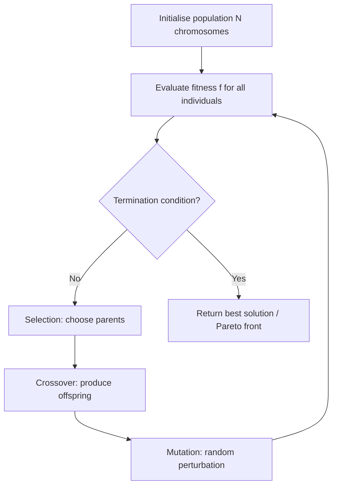

# 7 - Genetic Algorithms and Multi-Objective Optimisation

[toc]

> **TL;DR:** Genetic algorithms (GAs) are population-based metaheuristics that evolve candidate solutions using selection, crossover, and mutation operators inspired by natural selection. They are derivative-free and operate on arbitrary encodings, making them effective for combinatorial, non-differentiable, and multi-modal problems. Multi-Objective GAs (MOGAs) extend the framework to problems with competing objectives — rather than a single optimum, the goal is to approximate the Pareto front: the set of solutions that cannot be improved in one objective without degrading another.

## Vocabulary

**Chromosome** — a candidate solution encoded as a string (binary, real-valued, permutation, or tree). The basic unit of evolution.

**Gene** — a single position in the chromosome; a component of the encoded solution.

**Population** — a set of N chromosomes at a given generation; the GA maintains and evolves this set.

**Fitness function** (f) — a scalar (for single-objective) or vector (for multi-objective) evaluation of how good a chromosome is; higher is better by convention.

**Selection** — operator that chooses parent chromosomes for reproduction, with probability proportional to (some function of) fitness. Common variants: roulette-wheel, tournament selection, rank selection.

**Crossover** (recombination) — operator that combines genetic material from two parents to produce offspring. Single-point crossover splits the chromosome at one random point; two-point uses two points; uniform crossover independently randomises each gene.

**Mutation** — operator that randomly perturbs one or more genes in an offspring with small probability p_m, ensuring exploration of the search space and preventing premature convergence.

**Generation** — one cycle of (selection → crossover → mutation → evaluation → replacement).

**Schema** — a template matching a subset of chromosomes; a partial pattern of specific gene values. The schema theorem (Holland 1975) describes how schemata with above-average fitness propagate exponentially under selection.

**Fitness landscape** — a mapping from the space of all chromosomes to their fitness values; conceptually a (high-dimensional) surface over genotype space. GAs navigate this surface without requiring a gradient.

**Pareto dominance** — a solution u dominates v (written u ≺ v) if u is at least as good in all objectives and strictly better in at least one. No dominated solution is Pareto-optimal.

```math
\mathbf{u} \prec \mathbf{v} \iff \forall i:\, u_i \leq v_i \;\wedge\; \exists i:\, u_i < v_i \quad \text{(minimisation)}
```

---

**Pareto-optimal set** — the set of all non-dominated solutions; no improvement in one objective is achievable without degrading another.

**Pareto front** — the image of the Pareto-optimal set in objective space; a surface (curve in 2D) representing the trade-off boundary.

**Non-inferiority** — two solutions are non-inferior (non-dominated with respect to each other) if neither dominates the other; both could be in the Pareto-optimal set.

**MOGA rank** — in the Fonseca-Fleming MOGA, the rank of individual xᵢ at generation t equals 1 plus the number of individuals in the current population that dominate it: rank(xᵢ, t) = 1 + pᵢ⁽ᵗ⁾.

**Niche formation** (fitness sharing) — a mechanism that distributes the population across the Pareto front by reducing the fitness of individuals in crowded regions, maintaining diversity.

**σ_share** — the niche radius parameter: individuals within distance σ_share in objective space reduce each other's effective fitness. Fonseca-Fleming provide a formula for setting σ_share based on the estimated area of the trade-off surface.

**Decision maker (DM)** — in the MOGA framework, an external agent (human or automated) who supplies goal information and refines requirements interactively as the GA evolves.

## Intuition

Think of the fitness landscape as a mountain range. Gradient descent follows the slope uphill from a single starting point and gets stuck in whichever local peak it first encounters. A genetic algorithm drops a population of hikers on the landscape: each hiker explores locally, but they exchange information via crossover (two hikers combine their positions to produce children that might be in a better valley between them) and occasionally jump randomly via mutation. The population's diversity is the key advantage: many starting points and information exchange across them.

For multi-objective problems, the mountain range becomes a *range of mountains* — each objective is a different elevation function and we want the ridge where improvement in one mountain necessarily requires descent on another. This is the Pareto front. MOGA maintains a distributed population along this ridge rather than collapsing to a single point.



**Figure:** the standard GA generational loop.

## How it Works

A standard GA iterates a generational loop. Each component has tunable variants. The key design decisions are the chromosome encoding, the selection pressure (how strongly fitter individuals are favoured), and the crossover/mutation rates.

### Chromosome Encoding

The encoding maps a candidate solution to a fixed-length string. Binary encoding (each gene is 0 or 1) is the classic choice: a chromosome of length L represents a search space of 2^L solutions. Real-valued encoding (genes are floating-point numbers) is better for continuous optimisation; permutation encoding is used for combinatorial problems like TSP (genes are a permutation of cities).

> [!IMPORTANT]
> The encoding choice profoundly affects GA performance. Binary encoding with standard Gray code (adjacent integers differ in one bit) avoids Hamming cliffs — regions where numerically close values have very different binary representations and thus are unlikely to be produced by small mutations. Gray code encoding is the standard recommendation for binary-encoded real variables.

### Selection

Selection determines which chromosomes reproduce. Fitness-proportionate selection (roulette wheel) assigns each chromosome a selection probability proportional to its fitness. Rank-based selection assigns probabilities based on rank order rather than raw fitness, preventing premature convergence when one individual has much higher fitness than the rest. Tournament selection randomly samples k individuals and selects the best — simpler to implement, easy to tune selection pressure via k.

### Crossover

Single-point crossover: choose a random crossover point, combine the prefix of parent 1 with the suffix of parent 2 (and vice versa) to produce two offspring. Two-point crossover uses two cut points, extracting the middle segment from one parent and filling the rest from the other. Uniform crossover: for each gene independently, choose which parent it comes from with probability 0.5. Crossover rate p_c (typically 0.6–0.9) controls the fraction of offspring produced by crossover vs direct copying.

### Mutation

Mutation flips each bit independently with small probability p_m (typically 1/L where L is chromosome length). For real-valued encoding, mutation adds Gaussian noise to a gene value. Mutation ensures that no gene combination is permanently lost from the population (ergodicity), preventing premature convergence to a local optimum.

### MOGA: Multi-Objective Genetic Algorithm (Fonseca-Fleming)

The MOGA replaces the scalar fitness with a rank-based fitness derived from Pareto dominance. Each individual is assigned rank = 1 + (number of individuals in the current population that dominate it). All non-dominated individuals receive rank 1. Fitness is then assigned by interpolating from the best-rank individual (highest fitness) to the worst, with fitness averaged within each rank to ensure equal sampling rates.

Niche formation in objective space prevents all population members from converging to the same region of the Pareto front. Within each rank, individuals that are close in objective space (within σ_share) share fitness, reducing it proportionally. This encourages the population to spread uniformly across the Pareto front.

```math
\text{rank}(x_i, t) = 1 + p_i^{(t)}

\quad \text{where } p_i^{(t)} = |\{x_j \in \text{population} \mid x_j \prec x_i\}|
```

The fitness sharing parameter σ_share can be estimated from the objective space bounds:

```math
N \approx \frac{\prod_{i=1}^{q}(M_i - m_i + \sigma_{\text{share}}) - \prod_{i=1}^{q}(M_i - m_i)}{\sigma_{\text{share}}^q}
```

where mᵢ and Mᵢ are the min and max of objective i in the current population, N is the population size, and q is the number of objectives.

## Math

The Schema Theorem (Holland 1975) characterises the expected growth of schemata — templates defining specific gene values at specific positions. Let H be a schema with fitness f(H) above the population mean f̄, defining length δ(H) (distance between outermost defined bits) and order o(H) (number of defined bits). Under single-point crossover and bit-flip mutation:

```math
E[m(H, t+1)] \geq m(H, t) \cdot \frac{f(H)}{\bar{f}} \cdot \left(1 - p_c \frac{\delta(H)}{L-1}\right) \cdot (1 - p_m)^{o(H)}
```

where m(H, t) is the number of chromosomes matching H at generation t. Above-average, short, low-order schemata grow exponentially. This is the theoretical basis for GA's implicit parallelism: a population of N chromosomes processes O(N³) schemata simultaneously.

For multi-objective problems, the goal is characterised by the Pareto front. For a minimisation problem with q objectives, u dominates v if:

```math
\forall i \in \{1,\ldots,q\}: u_i \leq v_i \;\wedge\; \exists i: u_i < v_i
```

The trade-off surface area (upper bound for σ_share estimation) is:

```math
A \leq \sum_{i=1}^{q} \prod_{\substack{j=1 \\ j \neq i}}^{q} (M_j - m_j)
```

## Real-world Example

A practical use of MOGAs is neural architecture search (NAS): simultaneously optimise for accuracy (maximise), model size (minimise), and inference latency (minimise). The Pareto front gives a menu of architectures — the designer picks one based on deployment constraints. The example below uses a simple single-objective GA with DEAP for function optimisation.

```python
import random
from deap import base, creator, tools, algorithms
import numpy as np

# Minimise f(x,y) = (x-3)^2 + (y+1)^2 (global min at (3,-1))
# Binary encoding: 10 bits for x ∈ [-5,5], 10 bits for y ∈ [-5,5]

def decode(chromosome):
    """Decode 20-bit chromosome to (x, y) in [-5, 5]."""
    x_bits = chromosome[:10]
    y_bits = chromosome[10:]
    x_int = sum(b * (2**i) for i, b in enumerate(reversed(x_bits)))
    y_int = sum(b * (2**i) for i, b in enumerate(reversed(y_bits)))
    x = -5.0 + x_int * (10.0 / (2**10 - 1))
    y = -5.0 + y_int * (10.0 / (2**10 - 1))
    return x, y

def fitness(individual):
    x, y = decode(individual)
    return ((x - 3)**2 + (y + 1)**2,)   # DEAP requires tuple

# Setup
creator.create("FitnessMin", base.Fitness, weights=(-1.0,))   # minimise
creator.create("Individual", list, fitness=creator.FitnessMin)

toolbox = base.Toolbox()
toolbox.register("attr_bool", random.randint, 0, 1)
toolbox.register("individual", tools.initRepeat,
                 creator.Individual, toolbox.attr_bool, n=20)
toolbox.register("population", tools.initRepeat, list, toolbox.individual)
toolbox.register("evaluate", fitness)
toolbox.register("mate", tools.cxTwoPoint)
toolbox.register("mutate", tools.mutFlipBit, indpb=0.05)
toolbox.register("select", tools.selTournament, tournsize=3)

# Run GA
random.seed(42)
pop = toolbox.population(n=200)
hof = tools.HallOfFame(1)
stats = tools.Statistics(lambda ind: ind.fitness.values[0])
stats.register("min", np.min)
stats.register("avg", np.mean)

pop, log = algorithms.eaSimple(pop, toolbox,
                                cxpb=0.7,    # crossover prob
                                mutpb=0.1,   # mutation prob
                                ngen=100,    # generations
                                stats=stats,
                                halloffame=hof,
                                verbose=False)

best = hof[0]
x, y = decode(best)
print(f"Best solution: x={x:.3f}, y={y:.3f}, f={best.fitness.values[0]:.4f}")
# Expected: x ≈ 3.0, y ≈ -1.0, f ≈ 0.0
```

> [!TIP]
> For multi-objective problems, use NSGA-II (Non-dominated Sorting GA II) rather than MOGA for most practical applications. NSGA-II uses crowding distance instead of fitness sharing for diversity preservation and is implemented in DEAP as `tools.selNSGA2`. It is the de-facto standard for multi-objective evolutionary optimisation.

## In Practice

**When GAs win vs gradient-based methods.** GAs excel when: (1) the fitness landscape is multimodal (many local optima); (2) the objective is non-differentiable or non-continuous (e.g. simulation output, discrete choices); (3) the search space is combinatorial (permutations, graph structures); (4) multiple objectives must be balanced without collapsing to a single scalar. Gradient-based methods win when the landscape is smooth and differentiable — they converge in far fewer evaluations and can exploit curvature information.

**Population size and evaluation budget.** Each generation requires N fitness evaluations. If each evaluation is expensive (a physics simulation, a full training run), population size must be small (10–50) and generation count must be low. This trades off exploration for feasibility.

**The "No Free Lunch" theorem.** No optimisation algorithm outperforms random search on average over all possible fitness landscapes. GAs have strong inductive biases: they assume that good short schemata (building blocks) combine well to form good solutions (the building block hypothesis). This works well when the fitness function has "decomposable" structure and fails when it doesn't (deceptive functions).

> [!WARNING]
> Premature convergence is the most common GA failure mode. The entire population collapses to a single local optimum within a few generations when selection pressure is too high or population diversity is lost. Signs: fitness plateau, all individuals nearly identical. Mitigations: increase mutation rate, use crowding or niching, restart from fresh random individuals periodically, or use a multi-objective formulation to maintain spread.

**Chromosome coding for MOGA.** Fonseca and Fleming recommend Gray codes for binary chromosomes encoding continuous variables, noting that standard binary encoding introduces Hamming cliffs that disrupt the neighbourhood structure the GA relies on. Real-valued encoding with Gaussian mutation (Evolution Strategies / CMA-ES) is often superior for continuous multi-objective problems and avoids the encoding issue entirely.

> [!NOTE]
> NSGA-III (Deb & Jain, 2014) extends NSGA-II to problems with many objectives (> 3). For 2–3 objectives, NSGA-II with crowding distance is sufficient. Beyond 3 objectives, crowding distance becomes ineffective because most solutions are non-dominated, and reference-point-based diversity maintenance (NSGA-III) or decomposition-based methods (MOEA/D) are preferred.

## Pitfalls

- **"GA is a black-box optimizer that always works."** — GAs are problem-specific in their performance. They require careful encoding choice, tuning of crossover/mutation rates and population size, and often domain knowledge encoded in the operators. An ill-specified GA can perform worse than random search.
- **"Higher mutation rate is safer."** — Excessively high mutation effectively destroys the genetic information accumulated through selection, reducing the GA to random search. Mutation rate is typically set to 1/L (one expected bit flip per chromosome).
- **"The Pareto front = the global Pareto-optimal set."** — The MOGA finds an approximation to the Pareto front with a finite population. Regions of the front may be undersampled, and the approximation quality depends on population size, number of generations, and σ_share.
- **"Single-objective collapse is fine for multi-objective problems."** — Scalarising multiple objectives into a single weighted sum forces the user to specify weights before knowing the trade-off structure. GAs with Pareto-based selection approximate the full trade-off surface without requiring pre-specified weights, which is especially valuable when the weights are unknown or decision-dependent.
- **"GAs find the exact global optimum."** — GAs are stochastic search heuristics. They find near-optimal solutions with high probability but provide no formal optimality guarantee. For exact solutions to combinatorial problems, branch-and-bound or integer programming solvers are appropriate.

## Exercises

### Exercise 1 — Crossover by Hand

Two binary chromosomes encode solutions in ℝ (10-bit Gray code). Parent 1: 0110100101, Parent 2: 1001011010. Apply single-point crossover at position 4 (after the 4th bit). What are the two offspring?

#### Solution 1

Single-point crossover at position 4: prefix from one parent, suffix from the other.

- Parent 1: **0110** | 100101
- Parent 2: **1001** | 011010

Offspring 1 = prefix P1 + suffix P2 = **0110** 011010 = 0110011010

Offspring 2 = prefix P2 + suffix P1 = **1001** 100101 = 1001100101

Both offspring are valid 10-bit chromosomes. Offspring 1 inherited the left structure from Parent 1 and the right structure from Parent 2; crossover has mixed the genetic material.

### Exercise 2 — Pareto Dominance

Five solutions to a 2-objective minimisation problem with f₁ and f₂:

| Solution | f₁ | f₂ |
| :--- | :---: | :---: |
| A | 1 | 5 |
| B | 3 | 2 |
| C | 2 | 4 |
| D | 4 | 1 |
| E | 2 | 6 |

Which solutions are Pareto-optimal? Which are dominated?

#### Solution 2

Check each solution for domination (u dominates v if u₁ ≤ v₁ AND u₂ ≤ v₂ AND at least one strict).

- **A=(1,5)**: does C=(2,4) dominate A? f₁: 2>1 (no). Does B=(3,2) dominate A? f₁: 3>1 (no). Does D=(4,1) dominate A? f₁: 4>1 (no). A is **not dominated** — no solution beats it on f₁.
- **B=(3,2)**: does D=(4,1)? f₁: 4>3 (no). Does C=(2,4)? f₂: 4>2 (no). B is **not dominated**.
- **C=(2,4)**: does A=(1,5) dominate C? f₁: 1<2, f₂: 5>4 (no). Does B=(3,2)? f₁: 3>2 (no). B=(3,2) vs C=(2,4): B's f₁=3>C's f₁=2, so B doesn't dominate C. Does D=(4,1)? f₁: 4>2 (no). Does E=(2,6)? f₂: 6>4 (no). C is **not dominated** — it's on the trade-off curve.

Wait — check if A dominates C: A=(1,5) vs C=(2,4). f₁: 1<2 ✓, f₂: 5>4 ✗. A does not dominate C. Check if B dominates C: B=(3,2) vs C=(2,4). f₁: 3>2 ✗. No domination. C is **not dominated**.

- **D=(4,1)**: does B=(3,2)? f₁: 3<4, f₂: 2>1 — no. Does anyone have both f₁≤4 and f₂≤1? Only D itself has f₂=1. D is **not dominated**.
- **E=(2,6)**: does C=(2,4) dominate E? f₁: 2=2 ✓, f₂: 4<6 ✓. **C dominates E.** Also A=(1,5) vs E=(2,6): f₁: 1<2 ✓, f₂: 5<6 ✓. **A dominates E.**

**Pareto-optimal (non-dominated): {A, B, C, D}.** Solution **E is dominated** (by both A and C). The Pareto front in f₁-f₂ space traces A→C→B→D roughly from top-left to bottom-right.

### Exercise 3 — MOGA Rank Assignment

A population of 5 individuals has objective vectors (f₁, f₂) in a minimisation problem: P1=(1,5), P2=(3,2), P3=(2,4), P4=(4,1), P5=(2,6). Assign MOGA ranks.

#### Solution 3

Rank = 1 + (number of individuals that dominate this individual).

From Exercise 2, E=(P5) is dominated by P1 and P3.

- **P1=(1,5):** dominated by no one → rank = 1+0 = **1**
- **P2=(3,2):** dominated by no one → rank = 1+0 = **1**
- **P3=(2,4):** dominated by no one → rank = 1+0 = **1**
- **P4=(4,1):** dominated by no one → rank = 1+0 = **1**
- **P5=(2,6):** dominated by P1 and P3 → rank = 1+2 = **3**

All Pareto-optimal individuals get rank 1; dominated individuals get rank > 1. Note rank 2 is absent here (no individual is dominated by exactly 1 other). Fitness is then assigned by interpolating from rank 1 (highest fitness) to rank 3 (lowest fitness), with equal fitness within each rank.

### Exercise 4 — Selection Pressure

Explain why rank-based selection is preferred over fitness-proportionate (roulette wheel) selection for GAs on problems with few, highly fit individuals.

#### Solution 4

**Fitness-proportionate selection problem:** if one individual has fitness 100 and the rest have fitness 1–2, the highly-fit individual will be selected for nearly every reproduction event. After a few generations, nearly the entire population is composed of copies of (and minor variations around) this one individual. This is called genetic drift or premature convergence — the population loses diversity and can no longer escape the local optimum represented by this individual.

**Rank-based selection:** individuals are sorted by fitness rank (1st, 2nd, 3rd...) and assigned selection probabilities based on rank, not raw fitness. The difference in selection probability between adjacent ranks is fixed regardless of the magnitude of the fitness gap. The highly-fit individual (rank 1 of N) is selected with probability ∝ N/(N(N+1)/2), which is much smaller than it would receive under proportionate selection when its fitness is orders of magnitude above the rest.

This controlled selection pressure maintains diversity for more generations and allows the population to explore a broader region of the fitness landscape before converging.

### Exercise 5 — GA vs Gradient Descent Trade-offs

For each problem type, state whether a GA or gradient descent (GD) is generally preferred and give the key reason.

| Problem | Preferred Method | Key Reason |
| :--- | :--- | :--- |
| Training a 100M parameter neural network | ? | ? |
| Optimising a hyperparameter set (discrete) | ? | ? |
| Finding a short path through a protein folding graph | ? | ? |
| Minimising a smooth convex loss | ? | ? |
| Scheduling n workers with competing constraints | ? | ? |

#### Solution 5

| Problem | Preferred Method | Key Reason |
| :--- | :--- | :--- |
| Training a 100M parameter neural network | **Gradient descent (Adam/SGD)** | Differentiable loss, high-dimensional continuous parameter space; GD with backprop is O(parameters) per step; GA would need N×100M evaluations per generation — intractable. |
| Optimising a hyperparameter set (discrete) | **GA (or Bayesian optimisation)** | Hyperparameters are discrete/categorical; fitness (validation accuracy) is non-differentiable with respect to discrete choices; few evaluations possible (each is a full training run). |
| Finding short path in protein folding graph | **GA** | Combinatorial, non-differentiable, high-dimensional discrete space; evolution over structure encodings works well for this class. |
| Minimising a smooth convex loss | **Gradient descent** | Convex + smooth → GD converges to global optimum; no local minima to escape; O(1/k) or O(exp(-k)) convergence depending on strong convexity. |
| Scheduling n workers with competing constraints | **GA** | NP-hard combinatorial problem; multiple competing objectives (fairness, efficiency, cost); GAs naturally handle combinatorial encoding (permutations) and multi-objective trade-offs. |

## Sources

- Fonseca, C. M. & Fleming, P. J. (1993). Genetic Algorithms for Multiobjective Optimization: Formulation, Discussion and Generalization. *Proceedings of the Fifth International Conference on Genetic Algorithms*, 416–423. air(100).pdf.
- Holland, J. H. (1975). *Adaptation in Natural and Artificial Systems*. University of Michigan Press.
- Goldberg, D. E. (1989). *Genetic Algorithms in Search, Optimization and Machine Learning*. Addison-Wesley.
- Deb, K., Pratap, A., Agarwal, S., & Meyarivan, T. (2002). A fast and elitist multiobjective genetic algorithm: NSGA-II. *IEEE Transactions on Evolutionary Computation*, 6(2), 182–197.
- Schaffer, J. D. (1985). Multiple objective optimization with vector evaluated genetic algorithms. *Proceedings of the First International Conference on Genetic Algorithms*, 93–100.

## Related

- [4 - Clustering and Unsupervised Learning](./4-clustering-and-unsupervised.md)
- [5 - Association Rules](./5-association-rules.md)
- [6 - PageRank and Graph Algorithms](./6-pagerank-and-graph-algorithms.md)
- [4 - Optimization and KKT](../1-foundations/4-optimization-and-kkt.md)
- [1 - What is ML and Version Space](../1-foundations/1-what-is-ml-and-version-space.md)
