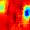

# 2 - Feature Visualization

[toc]

> **TL;DR:** Feature visualization answers the question "what does this neuron / layer / class prefer?" by either synthesizing an input that maximally activates a unit (activation maximization / class model visualization) or by projecting internal representations back to input space (DeconvNet, guided backprop). Zeiler & Fergus (2013) showed that these tools reveal a systematic hierarchy — edges at layer 1, textures at layer 2, object parts at layer 3–4 — that transformed AlexNet-era empiricism into principled architecture diagnosis.

## Vocabulary

**Activation maximization**: Gradient ascent in input space to find (or synthesize) an image $I^*$ that maximally activates a target unit. The network weights are frozen; the image is the optimization variable.

```math
I^* = \arg\max_{I} S_c(I) - \lambda \|I\|_2^2
```

---

**Class model visualization**: Simonyan et al.'s term for activation maximization with respect to the class score $S_c$ (the pre-softmax logit). The result is a single image that represents the model's "prototype" for class $c$.

---

**Image-specific class saliency**: The derivative of the class score with respect to the input image, evaluated at a specific image $I_0$. Highlights which pixels most affect the score at that point, giving a per-image explanation rather than a class prototype.

```math
w = \frac{\partial S_c}{\partial I}\bigg|_{I=I_0}
```

---

**DeconvNet**: Zeiler & Fergus's technique for mapping a specific activation back to input-pixel space by iteratively reversing pooling, ReLU, and convolution operations through the network.

---

**Unpooling with switch variables**: The DeconvNet reversal of max-pooling. During the forward pass, the network records which spatial location supplied each max value (the "switch"). During unpooling, the activation is placed back at that recorded location; all other positions are set to zero.

---

**Deconvolution (transposed filtering)**: The DeconvNet reversal of a convolutional layer. The feature map is passed through the *transposed* (flipped) filter kernels, projecting the activation back one layer closer to the input.

---

**Rectification in DeconvNet**: After each unpooling and transposed filtering step, only positive values are kept (ReLU applied to the reconstruction). This ensures the reconstruction represents features that *activated* the unit, not features that would have suppressed it.

---

**Occlusion sensitivity**: A perturbation-based visualization technique. A grey patch is slid across the image, and the class score is recorded at each position. Low scores when the patch covers a region → that region is important. Zeiler & Fergus use this as a sanity check for DeconvNet attributions.

---

**Feature hierarchy**: The empirical finding that layers of a trained deep CNN respond to progressively more complex and abstract features — oriented edges (layer 1) → corners and colour blobs (layer 2) → textures and repeated patterns (layer 3) → object parts and faces (layer 4) → full objects and scenes (layer 5).

---

**Top-9 maximally activating patches**: For a given unit, the nine image patches from the training or validation set that produce the highest activation. Used alongside synthetic visualization to ground abstract activations in real image examples.

---

**Regularization in activation maximization**: Without regularization, gradient ascent produces adversarial noise — valid by gradient logic but perceptually incoherent. Common regularizers: L2 penalty on pixel values, total variation (TV) norm, Gaussian blur, bilateral filter, or learned image priors.

---

**Guided backprop**: A modification of vanilla gradient saliency where, during the backward pass, negative gradients are also zeroed out at each ReLU (in addition to the standard masking of inactive neurons). Produces sharper maps but is later shown to be partially independent of the model (see [[6-counterfactuals-and-sanity-checks]]).

---

## Intuition

A trained convolutional network is, in one sense, just a sequence of differentiable functions. That means we can ask: "if I had infinite control over the input, what would I construct to maximize the response of unit $j$ in layer $l$?" The answer is activation maximization — run gradient ascent on the pixel space. The resulting image shows the *preferred stimulus* of that unit, much like measuring a V1 neuron's receptive field by presenting sinusoidal gratings and finding the optimal spatial frequency and orientation.

The complementary question is: "given that this real image produced this activation, which input pixels were *causally responsible* for that activation?" That is the image-specific saliency / DeconvNet question. Instead of synthesizing from scratch, we project backward from the activation to the input, using the network's own structure to trace which spatial regions contributed.

The key insight that made both techniques scientifically interesting — not just visualization parlor tricks — is that the learned feature hierarchy is *structured and meaningful*. It mirrors what we know from neuroscience about hierarchical processing in visual cortex (V1 → V2 → V4 → IT), and it explains why deeper networks are more powerful: each layer builds genuinely more abstract representations, not just a more complex version of the same thing.

## How it works

There are two conceptually distinct methods in this note. The first (Simonyan et al., 2013/2014) works by gradient-based optimization in input space. The second (Zeiler & Fergus, 2013) works by a layer-wise deconvolution procedure. They are complementary: activation maximization synthesizes a prototype; DeconvNet explains a specific image.

### Activation maximization (Simonyan et al.)

The class model visualization starts from a zero image (or random noise) and performs gradient ascent on the class score $S_c(I)$ with L2 regularization to prevent adversarial blowup. Each gradient step is a small update to every pixel, nudging the image toward higher $S_c$.

The image-specific saliency variant is a single backward pass: compute $\partial S_c / \partial I$ at the given image $I_0$ via standard backpropagation. The result is a gradient tensor of the same spatial dimension as the input. To convert to a visualizable map, take the absolute value and collapse the colour channel (usually via max or L2 norm across channels).

```python
import torch
from torchvision import models, transforms
from PIL import Image
import numpy as np

def class_model_visualization(
    model: torch.nn.Module,
    target_class: int,
    image_size: int = 224,
    num_steps: int = 500,
    lr: float = 0.1,
    l2_lambda: float = 1e-4,
) -> np.ndarray:
    """
    Activation maximization for class target_class.
    Returns synthesized image as uint8 numpy array of shape [H, W, 3].
    """
    model.eval()
    # Start from Gaussian noise
    img = torch.randn(1, 3, image_size, image_size, requires_grad=True)
    optimizer = torch.optim.Adam([img], lr=lr)

    for step in range(num_steps):
        optimizer.zero_grad()
        logits = model(img)
        # Maximize S_c with L2 regularisation
        loss = -logits[0, target_class] + l2_lambda * (img ** 2).sum()
        loss.backward()
        optimizer.step()
        # Clip to valid pixel range
        with torch.no_grad():
            img.clamp_(-2.5, 2.5)

    # Denormalize for display
    vis = img.detach().squeeze(0).permute(1, 2, 0).numpy()
    vis = (vis - vis.min()) / (vis.max() - vis.min() + 1e-8)
    return (vis * 255).astype(np.uint8)


model = models.vgg16(weights=models.VGG16_Weights.IMAGENET1K_V1)
# Synthesize a class-749 (sports car) prototype
prototype = class_model_visualization(model, target_class=817, num_steps=500)
```

> [!TIP]
> Adding a Gaussian blur every 5–10 gradient steps (frequency-domain regularization) dramatically improves the perceptual coherence of synthesized images. The trick is equivalent to penalizing high-frequency pixel variation, steering the optimization toward natural image statistics rather than adversarial noise patterns.

### DeconvNet visualization (Zeiler & Fergus)

The DeconvNet is *not* a separate trained network in the general sense — it reuses the learned filters of the forward network, but applies them in reverse. For a given activation tensor (e.g., the feature map of layer 4), the procedure iterates from that layer back to the input:

1. **Unpool**: reconstruct the pre-pooling spatial map by placing the activation at the position recorded by the switch variable during the forward max-pooling. All non-switch positions are zero.
2. **Rectify**: apply ReLU to the reconstruction. This keeps only positive features (the ReLU gate that the forward pass opened), discarding features that would have been suppressed.
3. **Transpose filter**: convolve the reconstruction with the *transposed* (flipped horizontally and vertically) convolutional filters. This projects the activation one layer closer to the input.

Repeat from step 1 for each layer until the input is reached. The final result is a pixel-space map showing which input regions drove the chosen activation.

```python
import torch
import torch.nn as nn
from torchvision import models

class DeconvProjector(nn.Module):
    """
    Minimal DeconvNet projector for a single convolutional layer.
    Projects the feature map of `target_layer` back to input-pixel space
    using Zeiler & Fergus deconvolution (no learned weights).
    """

    def __init__(self, conv_layer: nn.Conv2d) -> None:
        super().__init__()
        self.conv = conv_layer

    def forward(
        self,
        feature_map: torch.Tensor,    # [1, C_out, H_out, W_out]
        switches: torch.Tensor,        # max-pool switch indices for unpooling
        output_size: tuple[int, int],  # spatial size of the layer below
    ) -> torch.Tensor:
        # Step 1: Unpool
        unpool = nn.MaxUnpool2d(kernel_size=2, stride=2)
        unpooled = unpool(feature_map, switches, output_size=output_size)

        # Step 2: Rectify
        rectified = torch.relu(unpooled)

        # Step 3: Transposed convolution with the same learned weights
        deconved = nn.functional.conv_transpose2d(
            rectified,
            weight=self.conv.weight,
            bias=None,
            stride=self.conv.stride,
            padding=self.conv.padding,
        )
        return deconved
```

> [!IMPORTANT]
> The switch variables must be captured during the *forward pass* through the original model — not reconstructed after the fact. In practice this requires hooking the max-pool layer to record `argmax` indices. Libraries like Captum implement this; rolling your own requires careful handling of stride, padding, and the dilation=1 assumption.

### Layer hierarchy revealed

Running DeconvNet visualizations across all five convolutional blocks of AlexNet / VGG reveals the feature hierarchy Zeiler & Fergus documented. The progression is not just "more features" — it is qualitatively different types of structure at each level.

- **Layer 1**: oriented edges and colour gradients. Gabor-like filters.
- **Layer 2**: corners, coloured blobs, simple textures (grids, stripes).
- **Layer 3**: complex textures and repeated patterns (mesh, honeycombs, script characters).
- **Layer 4**: class-specific object parts (dog faces, bird legs, wheel hubs).
- **Layer 5**: entire objects and meaningful scenes with pose variation.

This hierarchy mirrors cortical processing (V1 → V2 → V4 → IT) and explains why transfer learning works: the lower layers encode generic visual primitives that transfer across tasks, while the upper layers encode task-specific semantic content that needs fine-tuning.



## Math

For class model visualization, the optimization objective is:

```math
I^* = \arg\max_{I \in \mathbb{R}^{H \times W \times 3}} \; S_c(I) \;-\; \lambda \|I\|_2^2
```

where $S_c(I)$ is the pre-softmax class score (logit) for class $c$ and $\lambda$ is the L2 regularization strength. The gradient update at step $t$ is:

```math
I^{(t+1)} = I^{(t)} + \alpha \left( \nabla_I S_c(I^{(t)}) - 2\lambda I^{(t)} \right)
```

For image-specific saliency, the first-order Taylor expansion of $S_c$ around $I_0$ gives:

```math
S_c(I) \approx w^\top I + b, \qquad w = \frac{\partial S_c}{\partial I}\bigg|_{I=I_0}
```

The pixel importance map is derived from $w \in \mathbb{R}^{H \times W \times 3}$. To collapse to a spatial map, Simonyan et al. take:

```math
M(h, w) = \max_{c \in \{R,G,B\}} \left| w_{h,w,c} \right|
```

The DeconvNet reconstruction is a composition of transposed operations. Let $f^{(l)}$ denote the feature map at layer $l$, and let $T^{(l)}$ denote the transposed operator for layer $l$ (unpool → rectify → transpose-conv). The pixel-space projection for a single unit $(l, k, i, j)$ is:

```math
v^{(l,k,i,j)} = T^{(1)} \circ T^{(2)} \circ \cdots \circ T^{(l)}\left( \delta_{k,i,j} \cdot f^{(l)} \right)
```

where $\delta_{k,i,j}$ is an indicator that zeros out all units except the target $(k, i, j)$.

## Real-world example

A practical use case is debugging a failure mode in a production image classifier. The model misclassifies "basketball" images as "soccer ball" at a rate of 12%. Running DeconvNet projections on the misclassified examples reveals that layer 4 activations — normally tuned to orange circular patterns in the basketball class — are instead responding strongly to the green background grass visible around the ball. The model has learned "grass + round object ≈ soccer ball" rather than using the ball's surface pattern.

```python
import torch
import torch.nn.functional as F
from torchvision import models, transforms
from PIL import Image
import numpy as np
import matplotlib.pyplot as plt

def gradient_times_input_saliency(
    model: torch.nn.Module,
    image_tensor: torch.Tensor,   # [1, 3, H, W], normalized
    target_class: int,
) -> np.ndarray:
    """
    Gradient × Input saliency — slightly more faithful than vanilla gradient
    for debugging class confusions.  Shape: [H, W].
    """
    model.eval()
    x = image_tensor.clone().requires_grad_(True)
    logits = model(x)
    score = logits[0, target_class]
    model.zero_grad()
    score.backward()
    # Element-wise product of gradient and input (Gradient × Input)
    sal = (x.grad * x).squeeze(0).abs().max(dim=0).values
    return sal.detach().cpu().numpy()


preprocess = transforms.Compose([
    transforms.Resize(256),
    transforms.CenterCrop(224),
    transforms.ToTensor(),
    transforms.Normalize(mean=[0.485, 0.456, 0.406],
                         std=[0.229, 0.224, 0.225]),
])

model = models.resnet50(weights=models.ResNet50_Weights.IMAGENET1K_V2)

basketball_img = Image.open("basketball_on_grass.jpg").convert("RGB")
x = preprocess(basketball_img).unsqueeze(0)

# Inspect activation for the predicted class (soccer ball = 805) vs ground truth (basketball = 430)
for cls_id, label in [(430, "basketball (GT)"), (805, "soccer ball (pred)")]:
    sal = gradient_times_input_saliency(model, x, cls_id)
    plt.figure()
    plt.imshow(sal, cmap="inferno")
    plt.title(f"Gradient×Input for {label}")
    plt.colorbar()
    plt.savefig(f"saliency_{label.split()[0]}.png", dpi=150, bbox_inches="tight")
```

> [!WARNING]
> Gradient × Input is not the same as integrated gradients and does not satisfy the Completeness axiom (the attributions need not sum to $F(x) - F(x')$). It is useful for quick visual debugging but should not be used as a rigorous attribution method. See [[3-attribution-and-gradient-methods]] for methods that satisfy stronger axiomatic guarantees.

## In practice

**Activation maximization synthesizes adversarial-like images without regularization.** On networks with BatchNorm or Dropout, the gradient signal is well-defined but the optimization will exploit numerical coincidences in the normalization statistics unless strong regularization is applied. Production visualization tools (Lucent, feature-vis) use a combination of frequency-domain parameterization, spatial decorrelation, and learned image priors to produce human-readable results.

**DeconvNet is expensive at visualization time but zero-cost at training time.** The switch variables require no additional training — they are byproducts of the forward pass. However, storing switches for all max-pool layers during a forward pass on a 224×224 image through VGG-16 adds approximately 6 MB of state. For production inference this is normally not retained; it must be recomputed on demand for visualization.

**Guided backprop looks better but is less faithful.** Zeiler & Fergus's original rectification in DeconvNet zeros only the gradient at inactive forward-pass neurons. Guided backprop additionally zeros negative gradients during the backward pass, producing sharper, cleaner maps — but Adebayo et al. (2018) show these maps are partially model-independent (see [[6-counterfactuals-and-sanity-checks]]). For diagnostic use, prefer gradient-based methods over guided backprop.

> [!TIP]
> For quick layer-by-layer feature inspection in PyTorch, `torchvision.models.feature_extraction.create_feature_extractor` is the modern approach — it replaces ad-hoc `register_forward_hook` patterns and handles intermediate layer access cleanly across all torchvision models.

**The hierarchy is architecture-dependent.** ResNets and ViTs do not produce the same clean hierarchy as Zeiler & Fergus documented in AlexNet/ZFNet. ResNet skip connections mean that early-layer information persists to deep layers; ViT attention heads distribute spatial information non-locally from layer 1. DeconvNet-style analysis applies to CNNs with explicit pooling; for ViTs, attention rollout and head activation analysis are more appropriate tools.

## Pitfalls

- **Wrong belief: Activation maximization shows what the model "knows."** Correction: it shows the *preferred stimulus* of a unit, which may not correspond to any natural image. A unit can prefer a high-frequency checkerboard pattern that never occurs in natural data while still performing useful computation on natural images.
- **Wrong belief: The highest-activated training patches are representative of a unit's function.** Correction: the top-9 patches show what activates the unit on in-distribution data, but they do not reveal whether the unit is also activated by out-of-distribution patterns or adversarial inputs.
- **Wrong belief: Cleaner saliency maps are more faithful saliency maps.** Correction: guided backprop and smooth-grad produce visually clean maps but sacrifice faithfulness (see Adebayo et al., 2018). A spatially noisy gradient map may be more truthful about the model's actual computation than a clean guided-backprop result.
- **Wrong belief: Feature visualization works the same way across architectures.** Correction: DeconvNet requires explicit max-pool switches; it does not apply to average pooling, strided convolutions, or transformers without modification. For non-CNN architectures, use architecture-appropriate tools (attention rollout, probing classifiers, DINO self-attention visualization).
- **Wrong belief: Deeper layers always encode more semantic content.** Correction: In ViTs, "semantic content" is distributed across heads and layers from early on. In ResNets with aggressive downsampling, spatial resolution is lost in the early layers. The clean hierarchy Zeiler & Fergus documented is a property of the specific AlexNet architecture, not a universal law of deep learning.

## Sources

- Zeiler, M. D. & Fergus, R. (2013). *Visualizing and Understanding Convolutional Networks.* arXiv:1311.2901.
- Simonyan, K., Vedaldi, A., & Zisserman, A. (2013). *Deep Inside Convolutional Networks: Visualising Image Classification Models and Saliency Maps.* arXiv:1312.6034.
- Olah, C. et al. (2017). *Feature Visualization.* Distill. https://distill.pub/2017/feature-visualization/
- Springenberg, J. T. et al. (2014). *Striving for Simplicity: The All Convolutional Net.* arXiv:1412.6806 (guided backprop).
- Conversation with user on 2026-05-19.

## Related

- [[1-why-explainability-matters]]
- [[3-attribution-and-gradient-methods]]
- [[6-counterfactuals-and-sanity-checks]]
