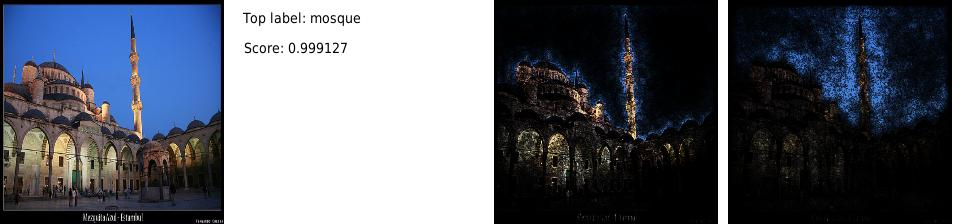

# 3 - Attribution and Gradient Methods

[toc]

> **TL;DR:** Attribution methods answer "how much did each input feature contribute to this output?" Vanilla gradient saliency is fast but violates important axioms; Integrated Gradients (Sundararajan et al., 2017) provides the axiomatic gold standard with a path-integral construction; DeepLIFT (Shrikumar et al., 2017) approximates the same quantity layer-by-layer via reference comparisons; and Grad-CAM (Selvaraju et al., 2017) sacrifices per-pixel resolution for architectural robustness and human readability. Understanding where each method sits on the faithfulness/interpretability frontier is essential before deploying any of them.

## Vocabulary

**Attribution**: An assignment of a real-valued score to each input feature $i$, indicating how much that feature contributed to the model's output relative to a baseline. Formally, the attribution for input $x$ with baseline $x'$ is a vector $A(x, x') \in \mathbb{R}^n$.

---

**Sensitivity(a) axiom**: If the model output differs between $x$ and $x'$ on feature $i$ (i.e., $F(x) \neq F(x')$ when only $i$ differs), then feature $i$ must receive nonzero attribution. Vanilla gradient fails this: a saturated sigmoid has near-zero gradient but maximal input sensitivity.

---

**Implementation Invariance axiom**: Two functionally equivalent networks (same input-output mapping, different implementations) must produce identical attributions. Gradient satisfies this (gradients are defined on the function, not the implementation); DeconvNet-style methods do not always.

---

**Completeness axiom**: The attributions must sum to the difference between the output at the input and the output at the baseline.

```math
\sum_{i=1}^{n} A_i(x, x') = F(x) - F(x')
```

Vanilla gradient does not satisfy Completeness. Integrated Gradients and SHAP do.

---

**Baseline $x'$**: A reference input representing "absence of information." Common choices: the all-zeros image for vision models, the all-mask-token sequence for NLP models, or the empirical mean of the training distribution. The choice of baseline significantly affects attributions — it is a modelling decision, not a hyperparameter to tune blindly.

---

**Integrated Gradients (IG)**: Attributes importance to feature $i$ as the integral of the gradient $\partial F / \partial x_i$ along the straight-line path from baseline $x'$ to input $x$.

```math
\text{IG}_i(x) = (x_i - x'_i) \int_0^1 \frac{\partial F(x' + \alpha(x - x'))}{\partial x_i} \, d\alpha
```

---

**DeepLIFT**: Layer-wise propagation of *contribution scores* $C_{\Delta x_i \Delta t}$ that measure how much a change in neuron $x_i$ relative to its reference activation $x'_i$ caused a change in target $t$ relative to its reference $t'$. Defined by the Summation-to-Delta property (analogous to Completeness but local to each layer).

---

**Summation-to-Delta property**: DeepLIFT's layer-local completeness condition. For any unit $t$:

```math
\sum_{i} C_{\Delta x_i \Delta t} = \Delta t, \qquad \Delta t = t - t'
```

where the sum is over all neurons $x_i$ directly feeding $t$.

---

**Multiplier** (DeepLIFT): The ratio of contribution score to input difference for a unit, analogous to a local gradient:

```math
m_{\Delta x_i \Delta t} = \frac{C_{\Delta x_i \Delta t}}{\Delta x_i}
```

When the network is piecewise linear, multipliers equal the gradient. When the network has saturating nonlinearities (sigmoid, tanh), multipliers diverge from the gradient and capture the nonlinear behaviour.

---

**Grad-CAM**: Class Activation Mapping via gradients. Computes the gradient of the class score with respect to the final convolutional feature map, pools spatially to get per-channel weights, then takes the weighted sum of feature maps passed through ReLU.

```math
L^c_{\text{GradCAM}} = \text{ReLU}\!\left(\sum_k \alpha_k^c A^k\right), \quad \alpha_k^c = \frac{1}{Z}\sum_{i,j} \frac{\partial S_c}{\partial A^k_{ij}}
```

---

**SmoothGrad**: A variance-reduction technique for gradient-based saliency. Average the gradient over $n$ noisy copies of the input, reducing visual noise without changing the theoretical semantics.

```math
\hat{M}(x) = \frac{1}{n} \sum_{k=1}^{n} M(x + \epsilon_k), \qquad \epsilon_k \sim \mathcal{N}(0, \sigma^2 I)
```

---

**Axiomatic attribution**: The programme of deriving attribution methods from desiderata (axioms) rather than heuristics, following Shapley's original approach in cooperative game theory.

---

## Intuition

Vanilla gradient saliency is like asking "which pixels, if nudged slightly, would change the score the most?" That is a useful debugging signal but has two pathologies. First, if the model's output is already near maximum for that class (saturated), the gradient is near zero even though the feature is clearly important — this is the Sensitivity failure. Second, it is a *local* measure: the gradient at $x$ says nothing about the global contribution of that feature across the space between $x$ and "no information."

Integrated Gradients solves both problems by *integrating* the gradient along the path from a baseline (no information) to the actual input. Think of it as asking: "as the feature value grew from nothing ($x'$) to what it is now ($x$), how much did the model's confidence grow, step by step?" The total credit assigned to feature $i$ is the accumulated growth in model output attributable to that feature's journey from baseline to actual value.

DeepLIFT takes the same idea but implements it layer-locally rather than via a path integral. Each layer is asked: "given the reference activation here, how much did the difference between actual and reference propagate forward?" This makes DeepLIFT faster than IG (single backward pass, like gradient) while still satisfying Completeness.

Grad-CAM sacrifices per-pixel spatial resolution in exchange for a single coarse class-discriminative localization map that is architecture-robust and easy for humans to overlay on images. It is the workhorse of visual XAI in practice, even though it provides weaker theoretical guarantees than IG.

## How it works

### Vanilla gradient saliency

Vanilla gradient saliency is a single backward pass of the loss with respect to the input. The magnitude of each partial derivative indicates local sensitivity. The computation is essentially free — it adds only one backward pass to the inference forward pass.

The method fails Sensitivity(a) because at saturated points (logit >> 0 or << 0), $\partial F / \partial x_i \approx 0$ even when $x_i$ is the dominant feature. It also fails to account for the *magnitude* of the feature — a large feature with zero gradient contributes nothing in this view even though removing it would dramatically change the output.

```python
import torch
from torch import Tensor

def vanilla_gradient(
    model: torch.nn.Module,
    x: Tensor,           # [1, C, H, W]
    target_class: int,
) -> Tensor:             # [1, C, H, W]
    """Single-pass gradient attribution. Fast; does not satisfy Completeness."""
    model.eval()
    inp = x.clone().requires_grad_(True)
    score = model(inp)[0, target_class]
    model.zero_grad()
    score.backward()
    return inp.grad.clone()  # same shape as x
```

### Integrated Gradients

IG approximates the path integral with a finite sum over $m$ interpolated inputs. The paper's empirical recommendation is $m \in [20, 300]$ — 50 steps is the standard practice trade-off between accuracy and compute.

The baseline choice is critical and task-specific. For ImageNet classifiers, the all-black image ($x' = \mathbf{0}$) is conventional. For NLP, the all-[MASK] token embedding is common. For tabular data, the training mean is more principled because it represents the "expected" rather than "absent" baseline.

```python
import torch
from torch import Tensor

def integrated_gradients(
    model: torch.nn.Module,
    x: Tensor,            # [1, *input_dims]
    baseline: Tensor,     # same shape as x; represents "no information"
    target_class: int,
    num_steps: int = 50,
) -> Tensor:              # attribution tensor, same shape as x
    """
    Integrated Gradients (Sundararajan et al. 2017).
    Satisfies Sensitivity(a), Implementation Invariance, and Completeness.
    """
    model.eval()
    # Interpolate: alpha=0 → baseline, alpha=1 → x
    alphas = torch.linspace(0, 1, num_steps + 1, device=x.device)  # [m+1]
    # Broadcast: [m+1, *input_dims]
    interpolated = baseline + alphas.view(-1, *([1] * (x.dim() - 1))) * (x - baseline)
    interpolated.requires_grad_(True)

    # Forward pass on all interpolated inputs in one batch
    logits = model(interpolated)                  # [m+1, num_classes]
    scores = logits[:, target_class].sum()
    model.zero_grad()
    scores.backward()

    # Gradient tensor [m+1, *input_dims]
    grads = interpolated.grad
    # Trapezoidal approximation of the integral (average of endpoints)
    avg_grads = (grads[:-1] + grads[1:]).mean(dim=0, keepdim=True)  # [1, *]
    # Completeness: multiply by (x - baseline)
    ig = avg_grads * (x - baseline)
    return ig.detach()


# Sanity check: verify Completeness property
# sum(ig) should equal F(x)[target] - F(baseline)[target]
def check_completeness(
    model: torch.nn.Module,
    x: Tensor,
    baseline: Tensor,
    target_class: int,
    num_steps: int = 50,
) -> float:
    ig = integrated_gradients(model, x, baseline, target_class, num_steps)
    with torch.no_grad():
        delta_f = (model(x)[0, target_class] - model(baseline)[0, target_class]).item()
    ig_sum = ig.sum().item()
    return abs(ig_sum - delta_f)   # should be < 1e-2 for num_steps=50
```

> [!IMPORTANT]
> The Completeness error decreases as $O(1/m^2)$ with the trapezoidal rule. At $m=20$ steps, expect Completeness error $\approx 1\%$ of $\Delta F$; at $m=300$ it is negligible. For production audits requiring tight attribution guarantees, use $m \geq 100$.

### DeepLIFT

DeepLIFT performs a single modified backward pass. Instead of propagating gradients, it propagates *multipliers* — per-neuron ratios of contribution score to activation difference. The rules for propagating multipliers depend on the layer type:

- **Linear layers**: multiplier equals the neuron's weight (same as gradient).
- **ReLU**: if the reference activation and the actual activation are both positive, the multiplier is 1; if both are zero, it is 0; if the reference is zero but actual is positive (the ReLU "opened"), the multiplier handles the step-function transition with the *rescale rule* (average slope between reference and actual) or the *reveal-cancel rule* (separate positive and negative contributions).
- **Max-pool**: the contributing unit (the unit that achieved the max relative to its reference) receives all credit.

```python
# DeepLIFT is most easily used via the Captum library
# which implements both the rescale and reveal-cancel rules.
from captum.attr import DeepLift
import torch
from torchvision import models

model = models.resnet50(weights=models.ResNet50_Weights.IMAGENET1K_V2)
model.eval()

dl = DeepLift(model)

# x: [1, 3, 224, 224], baseline: [1, 3, 224, 224] all zeros
x = torch.randn(1, 3, 224, 224)
baseline = torch.zeros_like(x)

# Attribution shape: [1, 3, 224, 224]
attribution = dl.attribute(
    x,
    baselines=baseline,
    target=207,                 # ImageNet class 207 = golden retriever
    return_convergence_delta=True,
)
attrs, delta = attribution      # delta is the Completeness error
print(f"Completeness delta: {delta.abs().item():.4f}")
```

> [!NOTE]
> DeepLIFT with the rescale rule on piecewise-linear networks (ReLU activations, no sigmoid/tanh) is *mathematically equivalent* to IG with a linear interpolation path. This is why the two methods often produce visually similar attributions on modern ReLU networks. The divergence emerges on networks with smooth nonlinearities.

### Grad-CAM

Grad-CAM pools the gradients of the class score with respect to the final convolutional feature map to produce per-channel importance weights, then computes a weighted combination of those feature maps. The ReLU at the end discards features that would hurt the class score, retaining only positive activations.

The output is a low-resolution heatmap (e.g., 7×7 for VGG-16's final conv layer) that is bilinearly upsampled to the input resolution for visualization. The coarse spatial resolution is both Grad-CAM's weakness (no per-pixel attribution) and its practical strength (robust to architectural choices; interpretable to clinicians as a rough localization).

```python
import torch
import torch.nn.functional as F
from torchvision import models
from typing import Optional

class GradCAM:
    """Grad-CAM for any CNN with a named final convolutional layer."""

    def __init__(self, model: torch.nn.Module, layer_name: str) -> None:
        self.model = model
        self.gradients: Optional[torch.Tensor] = None
        self.activations: Optional[torch.Tensor] = None

        # Hook the target layer
        layer = dict(model.named_modules())[layer_name]
        layer.register_forward_hook(self._save_activation)
        layer.register_backward_hook(self._save_gradient)

    def _save_activation(
        self, _: torch.nn.Module, _input: tuple, output: torch.Tensor
    ) -> None:
        self.activations = output.detach()

    def _save_gradient(
        self, _: torch.nn.Module, _grad_in: tuple, grad_out: tuple
    ) -> None:
        self.gradients = grad_out[0].detach()

    def __call__(
        self, x: torch.Tensor, target_class: int
    ) -> torch.Tensor:
        """Returns Grad-CAM heatmap, upsampled to [H, W] of input x."""
        self.model.eval()
        x = x.clone().requires_grad_(True)
        logits = self.model(x)
        self.model.zero_grad()
        logits[0, target_class].backward()

        # alpha_k = global average pool of gradients over (i, j)
        # self.gradients: [1, K, h, w]  self.activations: [1, K, h, w]
        weights = self.gradients.mean(dim=(2, 3), keepdim=True)  # [1, K, 1, 1]
        cam = (weights * self.activations).sum(dim=1, keepdim=True)  # [1, 1, h, w]
        cam = F.relu(cam)
        # Upsample to input resolution
        H, W = x.shape[2], x.shape[3]
        cam = F.interpolate(cam, size=(H, W), mode="bilinear", align_corners=False)
        # Normalize to [0, 1]
        cam_min, cam_max = cam.min(), cam.max()
        cam = (cam - cam_min) / (cam_max - cam_min + 1e-8)
        return cam.squeeze().cpu()   # [H, W]


model = models.resnet50(weights=models.ResNet50_Weights.IMAGENET1K_V2)
gcam = GradCAM(model, layer_name="layer4.2.conv3")
x = torch.randn(1, 3, 224, 224)
heatmap = gcam(x, target_class=207)  # [224, 224]
```



## Math

The full path-integral definition of Integrated Gradients is:

```math
\text{IG}_i(x) \;=\; (x_i - x'_i) \int_0^1 \frac{\partial F\bigl(x' + \alpha(x - x')\bigr)}{\partial x_i} \, d\alpha
```

The trapezoidal approximation with $m$ steps has error $O\!\left(\|x - x'\|^2 / m^2\right)$.

The Completeness property follows from the fundamental theorem of calculus:

```math
\sum_{i=1}^{n} \text{IG}_i(x) \;=\; \int_0^1 \nabla_x F\bigl(x' + \alpha(x-x')\bigr)^\top (x - x') \, d\alpha \;=\; F(x) - F(x')
```

For DeepLIFT, the Summation-to-Delta property at each layer $l$ gives:

```math
\sum_{i \in \text{inputs}(t)} C_{\Delta x_i \Delta t} = \Delta t = t - t'
```

and the chain rule for multipliers across layers is:

```math
m_{\Delta x_i \Delta o} = \sum_j m_{\Delta x_i \Delta h_j} \cdot m_{\Delta h_j \Delta o}
```

where $h_j$ are intermediate neurons. This is analogous to standard backprop but with multipliers instead of gradients.

The Grad-CAM importance weight for channel $k$ is:

```math
\alpha_k^c = \frac{1}{Z} \sum_{i} \sum_{j} \frac{\partial y^c}{\partial A^k_{ij}}
```

where $Z = H \cdot W$ is the spatial size of the feature map and $y^c$ is the class score. The final map is:

```math
L^c = \text{ReLU}\!\left(\sum_k \alpha_k^c A^k\right)
```

## Real-world example

A typical production debugging scenario: a medical imaging model flags a chest X-ray as "pleural effusion" but the radiologist disagrees. Applying IG with the zero-image baseline reveals that the model is primarily responding to the *metal ID badge* clipped to the patient's gown rather than the fluid opacity in the lower hemithorax.

```python
import torch
import numpy as np
import matplotlib.pyplot as plt
from captum.attr import IntegratedGradients, visualization as viz
from torchvision import models, transforms
from PIL import Image

def explain_prediction(
    model: torch.nn.Module,
    img_path: str,
    target_class: int,
    baseline_type: str = "zero",  # "zero" | "gaussian"
    num_steps: int = 100,
) -> tuple[np.ndarray, np.ndarray]:
    """
    Return (normalized_image, ig_attribution_map) for Typora-style overlay.
    """
    preprocess = transforms.Compose([
        transforms.Resize(256),
        transforms.CenterCrop(224),
        transforms.ToTensor(),
        transforms.Normalize(mean=[0.485, 0.456, 0.406],
                             std=[0.229, 0.224, 0.225]),
    ])
    img_pil = Image.open(img_path).convert("RGB")
    x = preprocess(img_pil).unsqueeze(0)  # [1, 3, 224, 224]

    if baseline_type == "zero":
        baseline = torch.zeros_like(x)
    else:
        baseline = torch.randn_like(x) * 0.01  # near-zero Gaussian

    ig = IntegratedGradients(model)
    attrs, delta = ig.attribute(
        x, baselines=baseline, target=target_class,
        n_steps=num_steps, return_convergence_delta=True,
    )
    print(f"Completeness delta: {delta.abs().mean().item():.4f}")

    # Collapse to [H, W] for display
    attrs_np = attrs.squeeze(0).permute(1, 2, 0).detach().numpy()
    attr_map = np.abs(attrs_np).sum(axis=2)

    img_np = np.array(img_pil.resize((224, 224)))
    return img_np, attr_map


model = models.densenet121(weights=models.DenseNet121_Weights.IMAGENET1K_V1)
model.eval()

img_np, attr_map = explain_prediction(
    model, "chest_xray.jpg", target_class=850, num_steps=100
)

fig, axes = plt.subplots(1, 2, figsize=(10, 5))
axes[0].imshow(img_np)
axes[0].set_title("Original X-ray")
axes[1].imshow(img_np)
axes[1].imshow(attr_map, cmap="inferno", alpha=0.6)
axes[1].set_title("IG Attribution Overlay")
plt.savefig("xray_ig_overlay.png", dpi=150, bbox_inches="tight")
```

> [!CAUTION]
> Zero-baseline Integrated Gradients on images normalized with ImageNet statistics does *not* place the baseline at the origin of the model's learned feature space — it places it at a specific "dark grey" input region that activates many neurons. For medical imaging models, using the training-distribution mean image as baseline is more principled and avoids baseline-artifact attributions near dark background pixels.

## In practice

**IG compute cost scales linearly with `num_steps`.** For a ResNet-50 inference call at batch size 1, each IG step adds one forward + backward pass (~20 ms on A100 GPU). At $m=50$ that is ~1 second per explanation. For production throughput this is often batched: group 50 interpolated inputs into one forward pass (batch size 50), reducing wall-clock time by ~40× at the cost of GPU memory.

**Baseline selection is the biggest uncontrolled variable in attribution research.** Papers that compare IG against SHAP or LIME frequently use different baselines for IG, making comparisons invalid. Always report the baseline explicitly when publishing or deploying attributions.

**Grad-CAM is the practical default for visual explanations to non-technical audiences.** Radiologists, pathologists, and ecologists in human-grounded studies consistently prefer Grad-CAM overlays to per-pixel IG attribution maps. The coarse spatial heatmap aligns better with how clinicians describe regions of interest ("the lower lobe," "the hilum") than a noisy per-pixel gradient map.

> [!TIP]
> Grad-CAM++ (Chattopadhay et al., 2018) extends Grad-CAM by using second-order gradients to compute per-pixel weights within each channel, improving localization accuracy when multiple instances of the same class appear in one image. It is a drop-in improvement over Grad-CAM at minimal extra cost.

**DeepLIFT is the speed-accuracy sweet spot for ReLU networks.** A single backward pass, Completeness satisfied, and faster than IG by a factor of `num_steps`. On piecewise-linear networks, the numerical difference from IG is negligible ($< 0.1\%$ of $\|A\|$). The Captum implementation handles the reveal-cancel rule correctly; manual implementations frequently get the boundary case at ReLU transitions wrong.

## Pitfalls

- **Wrong belief: Gradient magnitude directly measures feature importance.** Correction: gradient measures *local sensitivity*, not global contribution. A feature with near-zero gradient at a saturated point may still be the primary cause of the output (Sensitivity(a) failure).
- **Wrong belief: A larger `num_steps` always gives better IG.** Correction: Completeness error decreases with more steps, but for piecewise-linear networks (ReLU), the integral is exactly computable with the gradient at the input (no interpolation needed when the path stays in one linear region). For saturating activations (sigmoid, GELU), more steps genuinely matter.
- **Wrong belief: Grad-CAM works for any layer.** Correction: Grad-CAM is designed for the *final convolutional layer* before global pooling. Applying it to early layers gives coarse representations with no semantic content. For deeper insight, apply it to multiple layers (LayerGradCAM in Captum).
- **Wrong belief: IG with different baselines gives comparable attributions.** Correction: IG attributions are explicitly relative to the baseline — $\text{IG}_i(x, x')$ and $\text{IG}_i(x, x'')$ attribute different things. This is not a bug; it reflects that "importance" is inherently contrastive.
- **Wrong belief: Summing pixel-level IG attributions to feature groups is valid.** Correction: IG is additive over input dimensions, so summing pixel attributions within a region gives the total contribution of that region. This is valid. But summing attributions *across different inputs* or *across different baselines* is not valid — the Completeness guarantee applies per-example, not in aggregate.

## Sources

- Sundararajan, M., Taly, A., & Yan, Q. (2017). *Axiomatic Attribution for Deep Networks.* arXiv:1703.01365.
- Shrikumar, A., Greenside, P., & Kundaje, A. (2017). *Learning Important Features Through Propagating Activation Differences.* arXiv:1704.02685.
- Selvaraju, R. R. et al. (2017). *Grad-CAM: Visual Explanations from Deep Networks via Gradient-based Localization.* arXiv:1610.02391.
- Smilkov, D. et al. (2017). *SmoothGrad: removing noise by adding noise.* arXiv:1706.03825.
- Conversation with user on 2026-05-19.

## Related

- [[1-why-explainability-matters]]
- [[2-feature-visualization]]
- [[5-shap-and-shapley-values]]
- [[6-counterfactuals-and-sanity-checks]]
