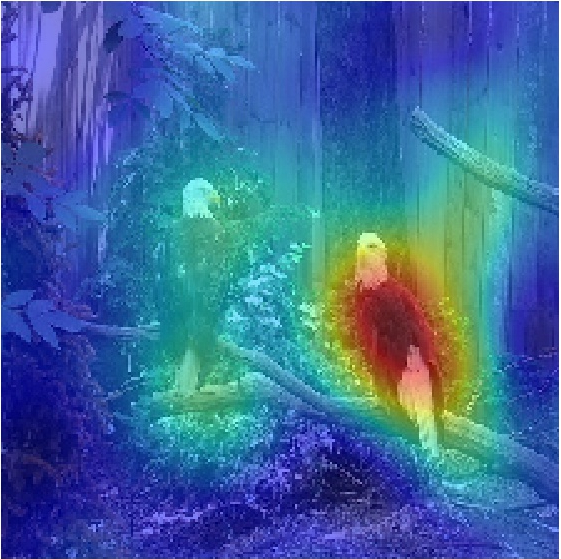

# 4 - Perturbation and Sampling Methods

[toc]

> **TL;DR:** Perturbation-based methods build explanations by measuring how model output changes when inputs are systematically modified — no access to gradients required, making them truly model-agnostic. LIME (Ribeiro et al., 2016) fits a local interpretable surrogate on neighbourhood samples; RISE (Petsiuk et al., 2018) estimates pixel importance via random binary masks with provable convergence; occlusion sensitivity slides a grey patch to build a coarse importance map. The fundamental challenge is that perturbing pixels independently violates the data manifold, producing out-of-distribution inputs that the model may handle arbitrarily.

## Vocabulary

**Model-agnostic explanation**: An explanation method that treats the model as a black box, querying it only via forward passes. Gradient-free; works on any classifier including random forests, SVMs, or remote APIs.

---

**Local surrogate**: An interpretable model (linear, shallow decision tree) fitted on samples in the neighbourhood of the input of interest. Valid only locally — it approximates the black-box model near $x$, not globally.

---

**Interpretable representation $x'$**: In LIME, a binary vector encoding the presence/absence of interpretable components (superpixels for images, words for text, discretized bins for tabular features). The surrogate is fitted in this interpretable space, not in raw pixel space.

```math
x' \in \{0, 1\}^{d'}
```

---

**Proximity kernel $\pi_x$**: A locality-aware weighting function in LIME that assigns higher weight to samples closer to $x$. For images, exponential kernel over cosine distance between superpixel presence vectors is standard.

```math
\pi_x(z) = \exp\!\left(-\frac{D(x, z)^2}{\sigma^2}\right)
```

---

**K-LASSO (sparse linear explanation)**: LIME's algorithm for fitting the local surrogate with at most $K$ features — LASSO regression with $K$ as the sparsity budget. Produces human-readable "this image was classified as X because superpixels A, B, C were present."

---

**SP-LIME**: Submodular Pick LIME — a greedy algorithm that selects a set of $B$ representative examples whose explanations collectively cover the most important features in the dataset, giving a global summary from local explanations.

---

**RISE** (Randomized Input Sampling for Explanation): Estimates the importance of pixel location $\lambda$ as the expected model confidence over all binary masks $M$ conditioned on that location being unmasked.

```math
S_{I,f}(\lambda) = \mathbb{E}[f(I \odot M) \mid M(\lambda) = 1]
```

---

**Mask generation (RISE)**: Random binary masks are generated on a low-resolution grid (e.g., 7×7) and bilinearly upsampled to image resolution, producing smooth masks that avoid sharp boundary artifacts. Each mask cell is Bernoulli($p$) independently.

---

**Monte Carlo RISE estimator**: The expectation in RISE is approximated by averaging over $N$ sampled masks:

```math
\hat{S}_{I,f}(\lambda) = \frac{1}{\mathbb{E}[M(\lambda)]} \cdot \frac{1}{N} \sum_{n=1}^{N} f(I \odot M_n) \cdot M_n(\lambda)
```

The normalization factor $\mathbb{E}[M(\lambda)] = p$ ensures the estimator is unbiased.

---

**Deletion metric**: A faithfulness evaluation: start with the full image, progressively remove the top-$k\%$ most important pixels (replace with grey), and measure how quickly model confidence drops. A faithful explanation should cause rapid confidence drop early.

---

**Insertion metric**: The dual: start with a blurred image, progressively insert the top-$k\%$ most important pixels, and measure how quickly confidence rises. Insertion correlates with the method's ability to identify the truly diagnostic region.

---

**Occlusion sensitivity**: A simple perturbation method. A grey (or mean-colour) patch of fixed size slides across the image in a grid pattern. At each position, the model confidence is recorded. Low confidence → patch covers an important region.

---

**Data manifold**: The low-dimensional submanifold of input space occupied by real data. When perturbation methods replace pixels with grey or zero values, the resulting input typically lies far off the data manifold. The model's behaviour on such inputs is undefined by training and may produce arbitrary outputs.

---

**Meaningful perturbation (Fong & Vedaldi, 2017)**: A perturbation method that constrains deletions to remain on the data manifold by using blurring or noise rather than grey patches, and adds a total-variation regularizer on the mask to encourage spatial coherence.

---

## Intuition

Gradient-based methods measure sensitivity by asking "what happens if I nudge this pixel infinitesimally?" Perturbation methods ask a coarser but more operationally honest question: "what happens if I actually remove this region?" The difference matters because neural networks are highly nonlinear — an infinitesimal perturbation tells you about a tangent hyperplane, not about the finite region of input space that a feature actually occupies.

LIME makes this operational by fitting a *local linear model* — it is essentially asking: "around this specific input, which features can I flip on and off to predict the model's output changes?" The linear approximation is only trusted in the neighbourhood (controlled by $\pi_x$), not globally.

RISE takes a different angle — instead of fitting a surrogate, it directly estimates a pixel-importance function as the expected model output under random masking. The connection to conditional expectation makes RISE's estimator principled: the importance of pixel $\lambda$ is how much the model cares about seeing that pixel, averaged over all possible contexts (all possible masks of the other pixels).

The key challenge both methods face is the *off-manifold* problem: removing pixels and replacing them with a constant colour produces inputs that the model has never seen during training. The model may respond to such inputs in unpredictable ways — overconfident, wildly misclassified, or inexplicably confused. This is not a failure of the perturbation method per se; it is an irreducible problem in model-agnostic XAI.

## How it works

### LIME: Local Interpretable Model-Agnostic Explanations

LIME's workflow for a single image explanation has four steps: (1) convert the image to an interpretable representation using superpixel segmentation; (2) sample neighbourhood inputs by randomly toggling superpixels on/off; (3) query the black-box model on each sampled input; (4) fit a weighted LASSO regression in the interpretable space using proximity weights.

The interpretable representation $x'$ encodes which superpixels are present. A "0" for superpixel $k$ means that superpixel is replaced by its mean colour (or grey). The surrogate $g(z') = w^\top z'$ is fitted to predict the black-box output $f(x)$ for each sample $z$ near $x$.

```python
import numpy as np
import torch
from skimage.segmentation import slime as skslic  # SLIC superpixels
from sklearn.linear_model import Lasso
from sklearn.preprocessing import normalize
from scipy.spatial.distance import cosine
from torchvision import models, transforms
from PIL import Image
from typing import Callable

def lime_image_explain(
    predict_fn: Callable[[np.ndarray], np.ndarray],  # (N, H, W, C) -> (N, num_classes)
    image: np.ndarray,                                # (H, W, 3) uint8
    target_class: int,
    num_superpixels: int = 50,
    num_samples: int = 1000,
    num_features: int = 10,       # K in K-LASSO
    kernel_width: float = 0.25,
) -> tuple[np.ndarray, np.ndarray]:
    """
    Returns (superpixel_segments, top_K_attribution_weights).
    Segments are integer-labelled arrays of shape (H, W).
    Attribution weights shape: (num_superpixels,) — positive = evidence for class.
    """
    from skimage.segmentation import slic
    segments = slic(image, n_segments=num_superpixels, compactness=10,
                    sigma=1, start_label=0)
    n_segs = segments.max() + 1

    # Sample: for each sample, randomly toggle superpixels
    samples_z_prime = np.random.binomial(1, 0.5, (num_samples, n_segs))
    # Always include the original (all ones)
    samples_z_prime[0] = 1

    # Build perturbed images
    perturbed_images = []
    for z_prime in samples_z_prime:
        perturbed = image.copy().astype(float)
        for seg_id in range(n_segs):
            if z_prime[seg_id] == 0:
                # Replace with mean colour of that superpixel (avoids grey-patch artifact)
                mask = segments == seg_id
                perturbed[mask] = image[mask].mean(axis=0)
        perturbed_images.append(perturbed)

    perturbed_images_np = np.stack(perturbed_images, axis=0).astype(np.uint8)
    # Query black box
    model_outputs = predict_fn(perturbed_images_np)[:, target_class]

    # Proximity weights: cosine distance between z' and x' (all-ones)
    x_prime = np.ones(n_segs)
    distances = np.array([cosine(x_prime, z) for z in samples_z_prime])
    distances = np.clip(distances, 0, None)  # cosine can be slightly negative
    weights = np.exp(-(distances ** 2) / (kernel_width ** 2))

    # Weighted LASSO
    lasso = Lasso(alpha=1e-3, max_iter=5000)
    lasso.fit(samples_z_prime * weights[:, None], model_outputs * weights)
    attribution_weights = lasso.coef_   # shape: (n_segs,)

    # Keep only the top K features
    top_k_idx = np.argsort(np.abs(attribution_weights))[-num_features:]
    sparse_weights = np.zeros(n_segs)
    sparse_weights[top_k_idx] = attribution_weights[top_k_idx]

    return segments, sparse_weights
```

> [!WARNING]
> The `num_samples` parameter controls the quality of the local linear fit. For images with many superpixels ($> 100$), you need at least 1,000–5,000 samples to get a stable LASSO solution. Insufficient samples produce unstable explanations that vary between runs — this is not a property of the model, it is LIME's sampling variance.

### RISE: Randomized Input Sampling for Explanation

RISE generates $N$ random binary masks, queries the model on each masked image, and accumulates a weighted sum of masks — each mask weighted by the model's confidence on that masked version. Pixels that appear in high-confidence masked images receive high importance.

The key implementation detail is the mask generation procedure. Masks are sampled at a low resolution (e.g., $h_0 \times w_0 = 7 \times 7$), then bilinearly upsampled to the image resolution ($H \times W = 224 \times 224$) and binarized at threshold 0.5. This produces spatially smooth masks that avoid the "salt-and-pepper" noise artifact of per-pixel masking, and ensures the masked regions correspond to semantically meaningful spatial extents.

```python
import torch
import torch.nn.functional as F
import numpy as np
from torchvision import models, transforms
from PIL import Image

def rise_importance_map(
    model: torch.nn.Module,
    image_tensor: torch.Tensor,    # [1, 3, H, W] normalized
    target_class: int,
    n_masks: int = 4000,
    mask_prob: float = 0.5,        # Bernoulli p for each cell
    mask_low_res: int = 7,         # low-resolution grid size
    batch_size: int = 64,
) -> torch.Tensor:                 # [H, W] importance map
    """
    RISE estimator (Petsiuk et al. 2018).
    Returns unnormalised importance map; normalize to [0,1] for display.
    """
    model.eval()
    _, _, H, W = image_tensor.shape
    importance = torch.zeros(H, W, device=image_tensor.device)
    total_processed = 0

    with torch.no_grad():
        for batch_start in range(0, n_masks, batch_size):
            batch_n = min(batch_size, n_masks - batch_start)

            # Generate low-res masks: [batch_n, 1, mask_low_res, mask_low_res]
            masks_low = torch.bernoulli(
                torch.full((batch_n, 1, mask_low_res, mask_low_res), mask_prob,
                           device=image_tensor.device)
            )
            # Upsample to [batch_n, 1, H, W]
            masks = F.interpolate(masks_low, size=(H, W), mode="bilinear",
                                  align_corners=False)
            masks = (masks > 0.5).float()

            # Apply masks: image_tensor [1,3,H,W] broadcast with masks [B,1,H,W]
            masked_images = image_tensor * masks   # [B, 3, H, W]

            # Query model
            logits = model(masked_images)              # [B, num_classes]
            confidences = torch.softmax(logits, dim=1)[:, target_class]  # [B]

            # Accumulate: confidence-weighted sum of masks
            # confidences [B] -> [B, 1, 1] for broadcasting with masks [B, H, W]
            importance += (confidences.view(-1, 1, 1) * masks.squeeze(1)).sum(0)
            total_processed += batch_n

    # Normalise by E[M(lambda)] = p * n_masks
    importance /= (mask_prob * total_processed)
    return importance   # [H, W]


model = models.resnet50(weights=models.ResNet50_Weights.IMAGENET1K_V2)
preprocess = transforms.Compose([
    transforms.Resize(256), transforms.CenterCrop(224), transforms.ToTensor(),
    transforms.Normalize(mean=[0.485, 0.456, 0.406], std=[0.229, 0.224, 0.225]),
])
img = Image.open("cat.jpg").convert("RGB")
x = preprocess(img).unsqueeze(0)
importance_map = rise_importance_map(model, x, target_class=281, n_masks=4000)
```

> [!TIP]
> Set `n_masks=4000` as a minimum for stable RISE maps on 224×224 images. The standard error of the Monte Carlo estimator decreases as $1/\sqrt{N}$, so doubling `n_masks` to 8000 halves the noise but doubles the compute. The Petsiuk et al. paper used 8000 masks; 4000 is acceptable for exploratory use.

### Occlusion sensitivity

Occlusion is the simplest perturbation method — a grey patch of size $s \times s$ slides over the image in a grid pattern with stride $\delta$. The model's output confidence is recorded at each position. The resulting map is a coarse inverse-importance map (low confidence = high importance).

```python
import torch
import torch.nn.functional as F
import numpy as np
from torchvision import models

def occlusion_sensitivity(
    model: torch.nn.Module,
    image_tensor: torch.Tensor,   # [1, 3, H, W]
    target_class: int,
    patch_size: int = 16,
    stride: int = 8,
    fill_value: float = 0.5,      # grey patch in normalized space
) -> np.ndarray:                  # importance map [H, W], range [0, 1]
    """
    Occlusion sensitivity (Zeiler & Fergus, 2013).
    Returns confidence-drop map: high values = important region.
    """
    model.eval()
    _, _, H, W = image_tensor.shape

    with torch.no_grad():
        baseline_conf = torch.softmax(model(image_tensor), dim=1)[0, target_class].item()

    drop_map = np.zeros((H, W))
    count_map = np.zeros((H, W))

    with torch.no_grad():
        for i in range(0, H - patch_size + 1, stride):
            for j in range(0, W - patch_size + 1, stride):
                occluded = image_tensor.clone()
                occluded[0, :, i:i+patch_size, j:j+patch_size] = fill_value
                conf = torch.softmax(model(occluded), dim=1)[0, target_class].item()
                drop = baseline_conf - conf   # positive = patch hurts confidence
                drop_map[i:i+patch_size, j:j+patch_size] += drop
                count_map[i:i+patch_size, j:j+patch_size] += 1

    count_map = np.maximum(count_map, 1)
    drop_map /= count_map
    # Normalize to [0,1]: higher = more important
    drop_map = (drop_map - drop_map.min()) / (drop_map.max() - drop_map.min() + 1e-8)
    return drop_map
```



## Math

The RISE estimator is an unbiased Monte Carlo estimate of the conditional expectation:

```math
S(\lambda) = \mathbb{E}[f(I \odot M) \mid M(\lambda) = 1]
```

Using the definition of conditional expectation and Bayes' theorem:

```math
S(\lambda) = \frac{\mathbb{E}[f(I \odot M) \cdot M(\lambda)]}{\Pr[M(\lambda) = 1]} = \frac{\mathbb{E}[f(I \odot M) \cdot M(\lambda)]}{p}
```

The Monte Carlo approximation with $N$ masks has variance:

```math
\text{Var}[\hat{S}(\lambda)] = \frac{\text{Var}[f(I \odot M) \cdot M(\lambda)]}{N p^2} = O\!\left(\frac{1}{N}\right)
```

For LIME, the local fidelity-complexity objective is:

```math
\xi(x) = \arg\min_{g \in G} \mathcal{L}(f, g, \pi_x) + \Omega(g)
```

where $\mathcal{L}$ is the locally-weighted MSE:

```math
\mathcal{L}(f, g, \pi_x) = \sum_{z, z' \in \mathcal{Z}} \pi_x(z) \left(f(z) - g(z')\right)^2
```

and $\Omega(g)$ is the complexity penalty (number of active features for linear models, depth for trees).

The deletion/insertion metrics at top-$k\%$ pixels are area-under-curve summaries:

```math
\text{AUC}_{\text{del}} = \int_0^1 f_k \, dk, \qquad \text{AUC}_{\text{ins}} = \int_0^1 f_k^{\text{insert}} \, dk
```

## Real-world example

LIME is routinely used to audit NLP classifiers for spurious correlations. The following example audits a sentiment classifier and discovers it is using the word "disappointing" as a strong negative signal even in positive-sentiment reviews where the word appears in a negation ("not at all disappointing").

```python
import numpy as np
import torch
from transformers import pipeline, AutoTokenizer, AutoModelForSequenceClassification
from typing import Callable

def lime_text_explain(
    classifier_fn: Callable[[list[str]], np.ndarray],
    text: str,
    target_class: int = 1,          # 1 = positive sentiment
    num_samples: int = 500,
    num_features: int = 8,
    kernel_width: float = 0.3,
) -> dict[str, float]:
    """
    Token-level LIME for text classification.
    Returns mapping from token to attribution weight.
    """
    tokens = text.split()
    n = len(tokens)

    # Sample: randomly drop tokens
    rng = np.random.default_rng(42)
    z_primes = rng.binomial(1, 0.5, (num_samples, n))
    z_primes[0] = 1  # include original

    # Build perturbed texts
    perturbed_texts = []
    for z_prime in z_primes:
        kept = [tok for tok, keep in zip(tokens, z_prime) if keep]
        perturbed_texts.append(" ".join(kept) if kept else "[EMPTY]")

    # Query classifier
    preds = classifier_fn(perturbed_texts)[:, target_class]  # shape [num_samples]

    # Proximity weights (cosine distance between z' and all-ones)
    from scipy.spatial.distance import cosine
    x_prime = np.ones(n)
    dists = np.array([cosine(x_prime, z) if z.sum() > 0 else 1.0 for z in z_primes])
    weights = np.exp(-(dists ** 2) / (kernel_width ** 2))

    # Weighted Lasso
    from sklearn.linear_model import Lasso
    lasso = Lasso(alpha=1e-3, max_iter=5000)
    lasso.fit(z_primes * weights[:, None], preds * weights)
    coeffs = lasso.coef_

    # Top K
    top_k = np.argsort(np.abs(coeffs))[-num_features:]
    return {tokens[i]: float(coeffs[i]) for i in sorted(top_k)}


# Sentiment model from HuggingFace
tokenizer = AutoTokenizer.from_pretrained("distilbert-base-uncased-finetuned-sst-2-english")
hf_model = AutoModelForSequenceClassification.from_pretrained(
    "distilbert-base-uncased-finetuned-sst-2-english"
)
hf_model.eval()

def predict(texts: list[str]) -> np.ndarray:
    inputs = tokenizer(texts, return_tensors="pt", padding=True, truncation=True,
                       max_length=128)
    with torch.no_grad():
        logits = hf_model(**inputs).logits
    return torch.softmax(logits, dim=1).numpy()

review = "the film was not at all disappointing and I thoroughly enjoyed every scene"
attribution = lime_text_explain(predict, review, target_class=1)
for token, weight in sorted(attribution.items(), key=lambda kv: -abs(kv[1])):
    print(f"  {token:20s}  {weight:+.4f}")
```

> [!NOTE]
> LIME for NLP uses token presence/absence as the interpretable representation, which treats the sentence as a bag of words. This misses syntactic structure — the negation "not at all disappointing" is tokenized as four independent tokens, and LIME may assign high negative weight to "disappointing" without accounting for the "not at all" context. For syntactically-aware text XAI, gradient-based methods that operate in the embedding space are more appropriate.

## In practice

**LIME explanations have high variance.** The local linear fit is stochastic: different random seeds produce different explanations for the same input, especially when `num_samples` is small or the superpixel boundaries are poorly chosen. Before using LIME for debugging, always run 5–10 independent explanations and report the median; single-run LIME explanations in papers are often cherry-picked.

**RISE requires many model queries (8,000 × 1 forward pass = 8,000 forward passes per image).** On a V100 GPU with batch size 64, this is roughly 2–3 seconds per image for ResNet-50. For large-scale audits of a production model, RISE explanations should be pre-computed offline and cached.

**The off-manifold problem is worst for LIME's grey-patch replacement.** When superpixels are set to constant grey, the boundary between the grey region and the intact image creates synthetic edges that do not exist in natural images. The model may respond to these synthetic edges rather than to the absence of the superpixel content. Replacing removed superpixels with mean-sampled pixels from the training distribution is more principled but computationally expensive.

> [!CAUTION]
> Never use LIME or occlusion sensitivity explanations for security-sensitive decisions (fraud detection, access control) without first running Adebayo-style data-randomization sanity checks. LIME's explanations can pass visual inspection while being almost entirely driven by sampling artifacts rather than model behaviour. See [[6-counterfactuals-and-sanity-checks]] for the formal test protocol.

**Deletion/insertion curves are sensitive to the replacement strategy.** If "deleted" pixels are replaced with the training mean, the deletion AUC measures different information than if they are replaced with zero or blurred values. Published deletion/insertion benchmarks use inconsistent replacement strategies, making cross-paper comparisons unreliable.

## Pitfalls

- **Wrong belief: More superpixels in LIME gives better explanations.** Correction: More superpixels increase the sparsity challenge — with $d' = 200$ superpixels, you need $\gg 1000$ samples to reliably estimate a sparse linear model in 200 dimensions. The number of LIME samples should scale roughly with $\sqrt{d'}$.
- **Wrong belief: LIME's local linear model is a valid global approximation.** Correction: LIME is explicitly local. The coefficients are meaningless outside the neighbourhood defined by $\pi_x$. Using a LIME explanation to justify the model's behaviour globally is a category error.
- **Wrong belief: RISE with more masks is always better.** Correction: RISE has an irreducible bias from the data manifold violation — masked images are out-of-distribution regardless of how many masks you use. More masks reduce Monte Carlo variance but not distributional bias.
- **Wrong belief: Occlusion maps faithfully measure importance.** Correction: Overlapping patches in standard occlusion sensitivity cause interaction effects — removing region A may change the importance of region B. The map shows marginal importances, not Shapley-fair attributions.
- **Wrong belief: The grey-patch baseline is neutral.** Correction: A grey constant colour has pixel-level statistics very different from the training distribution and is itself an "informative" input to the model, just in the wrong direction. A training-mean replacement or blurred replacement is more defensible.

## Sources

- Ribeiro, M. T., Singh, S., & Guestrin, C. (2016). *"Why Should I Trust You?" Explaining the Predictions of Any Classifier.* arXiv:1602.04938.
- Petsiuk, V., Das, A., & Saenko, K. (2018). *RISE: Randomized Input Sampling for Explanation of Black-box Models.* arXiv:1806.07421.
- Zeiler, M. D. & Fergus, R. (2013). *Visualizing and Understanding Convolutional Networks.* arXiv:1311.2901 (occlusion sensitivity).
- Fong, R. C. & Vedaldi, A. (2017). *Interpretable Explanations of Black Boxes by Meaningful Perturbation.* arXiv:1704.03296.
- Conversation with user on 2026-05-19.

## Related

- [[1-why-explainability-matters]]
- [[3-attribution-and-gradient-methods]]
- [[5-shap-and-shapley-values]]
- [[6-counterfactuals-and-sanity-checks]]
