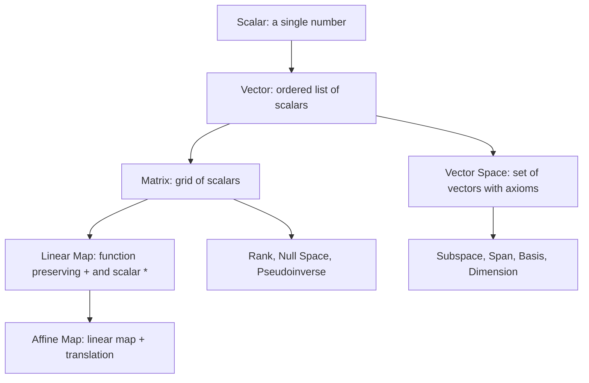
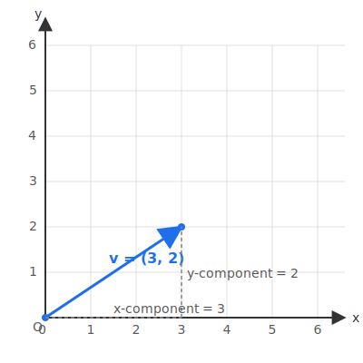
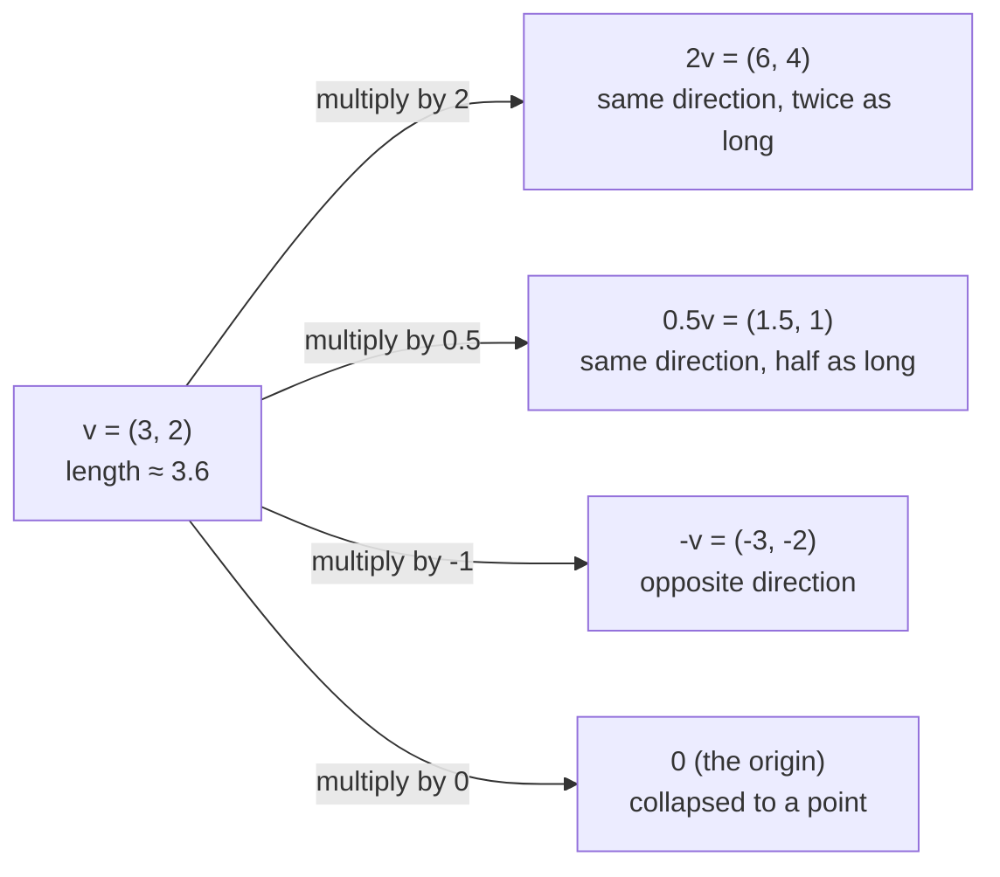
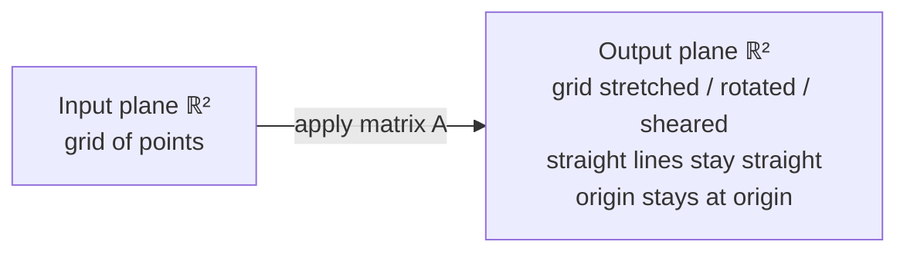
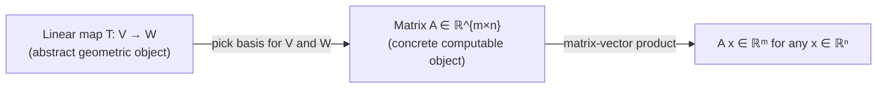

# 1 - What is Linear Algebra

[toc]

> **TL;DR:** Linear algebra is the study of vectors, matrices, and the linear transformations between them. It is the mathematical backbone of machine learning: every neural network forward pass, every PCA, every least-squares fit is, at its core, a sequence of linear-algebraic operations. This series of notes builds the subject from scratch, assuming only high-school algebra.

## Vocabulary

Each entry below pairs a bolded term with a plain-prose definition, followed by the standard symbol on its own line in a `math` fenced block. Use this section as the master glossary for the whole series — refer back whenever a later note uses a term you have forgotten.

**Scalar**: A single real number such as 3, −0.5, or π. A scalar applies *uniformly* to every element it touches — multiplying the vector (4, 5, 6) by the scalar 2 yields (8, 10, 12).

```math
a \in \mathbb{R}
```

---

**Vector**: An ordered list of n scalars, often written as a column. Represents a point or a direction in n-dimensional space.

```math
\mathbf{v} \in \mathbb{R}^n
```

---

**Matrix**: A rectangular array of scalars with m rows and n columns. Encodes a linear transformation, a system of equations, or a dataset.

```math
A \in \mathbb{R}^{m \times n}
```

---

**Polynomial**: An expression with real coefficients, like p(x) = 3 + 2x − x². Polynomials of degree at most n form a vector space — see [7 - Vector Spaces](./7-vector-spaces.md).

```math
p(x) = c_0 + c_1 x + c_2 x^2 + \cdots + c_n x^n
```

---

**Linear combination**: A weighted sum of vectors using scalar weights. The single most important construction in the subject.

```math
c_1 \mathbf{v}_1 + c_2 \mathbf{v}_2 + \cdots + c_k \mathbf{v}_k
```

---

**Linear transformation**: A function between two vector spaces that respects both addition and scalar multiplication. Every linear transformation is implemented as multiplication by some matrix.

```math
f(\mathbf{u} + \mathbf{v}) = f(\mathbf{u}) + f(\mathbf{v}), \qquad f(c \mathbf{v}) = c\, f(\mathbf{v})
```

---

**System of linear equations**: A set of equations of degree 1 in the unknowns. Solving means finding the vector x that satisfies every equation simultaneously.

```math
A \mathbf{x} = \mathbf{b}
```

---

**Vector space**: A set of vectors equipped with addition and scalar multiplication that obey eight specific axioms — formally defined in [7 - Vector Spaces](./7-vector-spaces.md).

```math
V
```

---

**Basis**: A minimal linearly independent set of vectors that reaches every vector in the space via linear combinations — introduced in [9 - Basis and Rank](./9-basis-and-rank.md).

```math
\{\mathbf{b}_1, \mathbf{b}_2, \ldots, \mathbf{b}_n\}
```

---

**Dimension**: The number of vectors in any basis of the space; the number of independent directions in V.

```math
\dim V
```

---

**Eigenvalue and Eigenvector**: A scalar λ and a nonzero vector v for which A acts on v only by scaling. Covered in later study, not in this series.

```math
A \mathbf{v} = \lambda \mathbf{v}
```

---

## Notation: What is ℝ? What is ℝⁿ?

Two symbols appear constantly in this series and across every machine-learning paper. Get them locked in now.

**ℝ (the real numbers)**: The set of *all* real numbers — every number you can put on a number line. That includes:

- Integers like −5, 0, 17.
- Fractions / rationals like 1/2, −3/4, 0.25.
- Irrationals like π ≈ 3.14159, √2 ≈ 1.41421, e ≈ 2.71828.

Whenever you write "a is a real number," the shorthand is `a ∈ ℝ` (read aloud as "a is in R"). In code, ℝ corresponds roughly to Python's `float` or NumPy's `np.float64`. The "ℝ" symbol is just the capital letter R drawn with a double left stroke — same letter, fancy font.

```math
\mathbb{R} = \{\, \ldots, -3, -1.7, 0, \tfrac{1}{2}, \pi, 17, \ldots \,\}
```

---

**ℝⁿ (n-dimensional real space)**: The set of *all ordered tuples* of n real numbers. An element of ℝⁿ is a vector with n components, each one a real number.

- ℝ¹ is just ℝ — a single real number.
- ℝ² is the 2-D plane — every vector is a pair (x, y).
- ℝ³ is 3-D space — every vector is a triple (x, y, z).
- ℝ⁷⁶⁸ is a 768-dimensional space — every vector has 768 components (this is the BERT embedding space).

Whenever you write "v is an n-dimensional real vector," the shorthand is `v ∈ ℝⁿ`. In code, ℝⁿ corresponds to a NumPy array of shape `(n,)` or `(n, 1)`.

```math
\mathbb{R}^n = \{\, (x_1, x_2, \ldots, x_n) : x_i \in \mathbb{R} \,\}
```

A concrete example — three different vectors, each living in a different ℝⁿ:

```math
\underbrace{\begin{bmatrix} 1.7 \end{bmatrix}}_{\in\, \mathbb{R}^1}, \qquad \underbrace{\begin{bmatrix} 3 \\ -2 \end{bmatrix}}_{\in\, \mathbb{R}^2}, \qquad \underbrace{\begin{bmatrix} 1 \\ 0 \\ 4 \\ -7 \end{bmatrix}}_{\in\, \mathbb{R}^4}
```

> [!IMPORTANT]
> **The superscript n in ℝⁿ is the dimension, not an exponent.** ℝ³ does *not* mean "cube the real numbers." It means "the space of 3-element real-number vectors." Read ℝⁿ as "R-en" (R to the n) and always think *dimension*, not multiplication. Same rule for ℝ^(m×n): "m by n," not "m times n."

The same idea extends to matrices: ℝ^(m×n) is the set of all matrices with m rows and n columns of real entries. When you see `A ∈ ℝ^(m×n)` in a paper, that is saying "A is an m × n real matrix."

```math
\mathbb{R}^{m \times n} = \{\, A : A \text{ has } m \text{ rows and } n \text{ columns of real entries} \,\}
```

---

## Intuition

Think of a vector as an arrow in space: a pair of numbers like (3, 2) means "go 3 right and 2 up." Written as a column, the same vector looks like:

```math
\mathbf{v} = \begin{bmatrix} 3 \\ 2 \end{bmatrix}
```

A matrix is a machine that takes arrows and transforms them — stretching, rotating, or collapsing them — while obeying the rule that straight lines stay straight and the origin stays fixed. Linear algebra is entirely about understanding what these machines can and cannot do.

The "linear" in linear algebra is the key constraint. Functions like f(x) = 2x are linear; functions like f(x) = x² or f(x) = sin(x) are not. Linearity means you can break a big problem into smaller ones, solve them independently, and add the results — that decomposition principle is why virtually every tractable ML algorithm relies on linear algebra as its foundation.

## Why Linear Algebra for Machine Learning

Linear algebra is not just a prerequisite you survive — it is the language in which ML algorithms are written. Understanding it at this level makes reading papers and debugging implementations feel natural rather than opaque.

Here are the direct connections to ML that each topic in this series unlocks:

| Note | Topic | ML connection |
| :--- | :--- | :--- |
| 2 | Systems of equations | Least-squares regression |
| 3 | Matrices | Data as matrices; neural network weight layers |
| 4 | Gaussian elimination | Solving A x = b; numerical stability |
| 5 | Null space / pseudoinverse | Underdetermined systems; Moore–Penrose for least-squares |
| 6 | Groups | Algebraic scaffolding for vector spaces |
| 7 | Vector spaces | Formal foundation for embeddings and feature spaces |
| 8 | Linear independence | Redundant features; rank deficiency |
| 9 | Basis & rank | PCA, dimensionality reduction |
| 10 | Linear mappings | Formal view of layers in a network |
| 11 | Matrix representation | Change of basis; coordinate transforms |
| 12 | Affine spaces | Neural layers with bias (W x + b) |

## The Objects We Study

Linear algebra has a small cast of characters. Getting comfortable with them visually before the formalism makes later definitions click rather than blur. The diagram below shows how each object relates to the next as the series builds.



### Scalars

A scalar is a single real number, applied **uniformly** to every element it touches. If your vector is (4, 5, 6) and your scalar is 2, multiplying gives (8, 10, 12) — the same factor 2 hit *every* component. That uniformity is the whole point: a scalar is not "a number I happen to multiply a vector by," it is the operation of *rescaling the entire vector at once*.

```math
2 \cdot \begin{bmatrix} 4 \\ 5 \\ 6 \end{bmatrix} = \begin{bmatrix} 8 \\ 10 \\ 12 \end{bmatrix}
```

Scalars participate in more than multiplication. You can also add a scalar to each entry of a vector (treating a as the constant vector a · 1), or scale a matrix the same way. The word "scalar" is the catch-all for "a single number used in operations on a larger structure," and the operation does the same thing to every entry. **Why scalars matter:** scaling is the basic building block of the second of the two vector-space operations (alongside addition); without scalars, you cannot stretch, shrink, or flip vectors.

> [!NOTE]
> Scalar multiplication is *not* the same as the dot product of two vectors. Scalar multiplication takes (scalar, vector) → vector. Dot product takes (vector, vector) → scalar. The word "scalar" is shared, but the operations are different.

### Vectors

A vector is one of those words that means three different things at once, and getting comfortable with all three is what makes the rest of linear algebra click.

#### View 1 — A vector is an arrow rooted at the origin

This is the geometric view, and it is by far the most useful mental picture. A vector in ℝ² is an *arrow* drawn from the origin (the point (0, 0)) to some target point. The arrow has a **tail** (always at the origin) and a **head** (at the target).

The vector v = (3, 2)ᵀ is the arrow whose tail is at (0, 0) and whose head is at (3, 2):



The whole arrow *is* the vector. Two arrows pointing the same way and the same length represent the **same** vector — even if you draw them in different places on the page, the geometric object is the displacement, not the location. By convention we always draw vectors with their tails at the origin, which is why you will hear vectors described as "rooted at the origin."

> [!IMPORTANT]
> **A vector is not a single point — it is an arrow from the origin to that point.** When you write v = (3, 2)ᵀ, the entries (3, 2) tell you the target *head*. The tail is always at (0, 0). This convention is what lets us add and scale vectors using simple component-wise rules.

#### View 2 — A vector is a point in space

You can also think of a vector simply as the point where the arrowhead lands. Both views are equivalent and you will flip between them constantly:

- When you say "the vector v has length 5," you mean "the arrow has length 5."
- When you say "the vector v is in the upper-right quadrant," you mean "the head is in that quadrant."

In ℝ³, the same idea extends to 3D space. The vector v = (3, 2, 5)ᵀ is the arrow from (0, 0, 0) to the point (3, 2, 5), measured along the standard x, y, z axes:

```
z
^
|
5 -----.
|     /|
|    / |  <- head at (3, 2, 5)
|   /  |
|  /   |
| /    |
0 *---+----+----> x
 / \   2
/   \
y    \
      v
     tail at origin
```

The three numbers (3, 2, 5) are the **coordinates** of the head along the x, y, z axes respectively.

#### View 3 — A vector is an ordered list of numbers

This is the algebraic view that lets you compute. A vector is just a column of n real numbers, also called its **components** or **entries**:

```math
\mathbf{v} = \begin{bmatrix} v_1 \\ v_2 \\ \vdots \\ v_n \end{bmatrix}
```

For ℝ² and ℝ³ the geometric picture and the algebraic picture overlap beautifully. For ℝⁿ with n ≥ 4 the geometric picture breaks down — you cannot draw a 768-dimensional arrow — but the algebraic rules carry over unchanged. That algebraic generalisation is precisely why linear algebra works in high dimensions: the formulas keep working even when the pictures stop.

> [!TIP]
> When you read a paper and see "the embedding vector v ∈ ℝ⁷⁶⁸," do not try to *picture* a 768-dimensional arrow. Instead, *reason geometrically by analogy with ℝ² and ℝ³*: distances, angles, projections, and inner products all behave the same way in any dimension. The intuition you build in 2D and 3D transfers to high dimensions essentially for free.

#### Operations on vectors — visually

Linear algebra is built on exactly two vector operations: **addition** and **scalar multiplication**. Both have clean geometric interpretations.

**Vector addition** is the **tip-to-tail rule**: to compute u + v, draw u from the origin, then draw v starting from the head of u. The sum u + v is the arrow from the origin to the new endpoint. Equivalently, it is the diagonal of the parallelogram with sides u and v (the "parallelogram rule"). Algebraically, you just add the components:

```math
\begin{bmatrix} 1 \\ 2 \end{bmatrix} + \begin{bmatrix} 3 \\ 1 \end{bmatrix} = \begin{bmatrix} 4 \\ 3 \end{bmatrix}
```

```
y
^
3 - - - - - - - -.----*  <- u + v = (4, 3)
|              /     /
2 - - -.------/-----/
|     /|     /     /
1 - -*-+----/-----+         v shifted to start at u's head
|   / |  v / new   |
0 - O--+--*--+--+-->  x
0   1  2   3   4
   (1,2)= u    (3,1)= v
```

**Scalar multiplication** rescales the arrow without changing its direction. Multiplying v by 2 doubles the length; multiplying by −1 flips it to point the opposite way; multiplying by 0 collapses it to the origin. Algebraically, multiply every entry:

```math
2 \cdot \begin{bmatrix} 3 \\ 2 \end{bmatrix} = \begin{bmatrix} 6 \\ 4 \end{bmatrix}, \qquad -1 \cdot \begin{bmatrix} 3 \\ 2 \end{bmatrix} = \begin{bmatrix} -3 \\ -2 \end{bmatrix}
```



> [!NOTE]
> Negative scalars flip a vector through the origin (180°). This is why subtracting vectors is just addition with a flipped sign: u − v = u + (−1)v.

#### Dimensions in ML

In ML, the dimension n is rarely 2 or 3 — it is hundreds or thousands. Some examples:

- **Word embeddings (Word2Vec, GloVe):** typically ℝ³⁰⁰.
- **BERT-base token embeddings:** ℝ⁷⁶⁸.
- **GPT-3 hidden state:** ℝ¹²²⁸⁸.
- **Llama 3 70B hidden state:** ℝ⁸¹⁹².
- **A 224×224 RGB image flattened:** ℝ¹⁵⁰⁵²⁸.

These vectors are not arrows you can draw. They are points in a very high-dimensional space, and "training a model" means moving those points around using exactly the same addition and scalar-multiplication rules you learned for ℝ². The algebra is identical; only the dimension is bigger.

### Matrices

A matrix is a rectangular grid of scalars with m rows and n columns. Its size is written **m × n** — always rows-then-columns — and that order never changes.

```math
A = \begin{bmatrix} a_{11} & a_{12} & a_{13} \\ a_{21} & a_{22} & a_{23} \end{bmatrix} \in \mathbb{R}^{2 \times 3}
```

A 2 × 3 matrix has 2 rows and 3 columns. The entry `a_(ij)` lives at row i, column j (the first subscript is *always* the row).

#### View 1 — Matrix as a transformer of space

The deepest interpretation: a matrix A ∈ ℝ^(m×n) is a *machine* that eats a vector x ∈ ℝⁿ and produces a vector A x ∈ ℝᵐ. It transforms the input space ℝⁿ into the output space ℝᵐ. For a 2 × 2 matrix, you can literally watch what it does to the plane:



A matrix can stretch the plane along one axis, rotate it, reflect it across a line, shear it, or even collapse it onto a single line — but it *cannot* curve the plane. That preservation of straight lines (and of the origin) is what makes the transformation **linear**.

> [!IMPORTANT]
> **Every linear transformation of ℝⁿ to ℝᵐ is a matrix, and every matrix is a linear transformation.** This bridge between geometry (transformations) and algebra (matrices) is the central insight of linear algebra. We will build it up rigorously in [10 - Linear Mappings](./10-linear-mappings.md) and [11 - Matrix Representation of Linear Mappings](./11-matrix-representation-of-linear-mappings.md).

#### View 2 — Matrix as a data table

The matrix X ∈ ℝ^(m×n) can also store a dataset: row i is the i-th training example, column j is feature j. This is exactly what a pandas DataFrame is. A 1000-row, 50-column matrix is "a dataset of 1000 samples with 50 features each."

#### View 3 — Matrix as a system of equations

A matrix is also the compact form of a system of linear equations. The equations from [2 - Systems of Linear Equations](./2-systems-of-linear-equations.md) become a single matrix equation A x = b, where A holds the coefficients, x holds the unknowns, and b holds the right-hand sides.

These three views are the *same object* viewed from different angles. The power of matrix notation is that one symbol A serves all three purposes — and the same arithmetic rules apply to all three interpretations.

#### Why non-commutativity matters

For ordinary numbers, 2 · 3 = 3 · 2. For matrices, **A B ≠ B A** in general. Order matters because applying transformations in different orders gives different results — rotating then stretching is not the same as stretching then rotating. This single fact is the most important difference between matrix arithmetic and scalar arithmetic, and it is covered in depth in [3 - Matrices](./3-matrices.md).

> [!WARNING]
> Forgetting that A B ≠ B A is the most common beginner mistake in linear algebra. Whenever you swap the order of a matrix product, *stop and verify* that you meant to — algebraically and geometrically. PyTorch shape errors almost always trace back to a transposed or reversed product.

### Linear Maps

A **linear map** (or linear transformation) is a function T: V → W between two vector spaces that obeys two simple rules:

1. **Additivity:** T(u + v) = T(u) + T(v). The map respects vector addition.
2. **Homogeneity:** T(c · v) = c · T(v). The map respects scalar multiplication.

Both rules can be combined into one: T(a u + b v) = a T(u) + b T(v). A linear map sends linear combinations to linear combinations.

Geometrically, every linear map of ℝⁿ to ℝᵐ does some combination of: stretching axes, rotating, reflecting, shearing, and projecting. It *cannot* bend, curve, or shift the origin. Examples of maps that **are** linear:

- **Scaling:** v ↦ 3v (stretch by 3 in every direction).
- **Rotation:** v ↦ Rᶿ v (rotate by angle θ in the plane).
- **Projection:** (x, y, z) ↦ (x, y, 0) (drop onto the xy-plane).
- **Differentiation** on polynomials: p(x) ↦ p'(x). Yes, derivatives are linear!

Examples of maps that **are not** linear:

- **Translation:** v ↦ v + (1, 1)ᵀ. Adds a constant; sends origin to (1, 1), violating linearity.
- **Squaring components:** (x, y) ↦ (x², y²). Quadratic; T(2v) = 4 T(v), not 2 T(v).
- **The ReLU activation:** v ↦ max(v, 0). Breaks at zero; not additive.

> [!IMPORTANT]
> **A linear map always sends the zero vector to the zero vector.** Set c = 0 in the homogeneity rule: T(0 · v) = 0 · T(v) = 0. So if a map sends 0 anywhere except 0, it cannot be linear. This is the fastest single-line test for non-linearity. Affine maps (T(v) = A v + b) fail this test because of the bias term — they shift the origin to b.

The fundamental theorem of this whole series: **every linear map between finite-dimensional vector spaces can be represented by a matrix**, once you pick a basis for each side. Conversely, every matrix represents a linear map. This is why we spend so much time studying matrices — they are the computable face of linear maps.



### Polynomials (preview of "vector is bigger than you think")

A polynomial like p(x) = 3 + 2x − x² is determined by its list of coefficients (3, 2, −1) — a length-3 list of real numbers. You can add two polynomials by adding coefficients and scale a polynomial by a scalar, exactly as you would with vectors in ℝ³. Polynomials of degree at most n therefore behave like vectors in ℝⁿ⁺¹, and the formal theory in [7 - Vector Spaces](./7-vector-spaces.md) makes this precise. We mention them now so you know up front: the word "vector" is not restricted to columns of numbers — anything you can add and scale the right way is a vector.

## A Concrete Taste: What ML Looks Like in Linear Algebra

Before the formalism, here is a real ML operation translated into linear algebra terms. A single dense (fully connected) layer with no activation function takes an input vector x in ℝ^(d_in) and produces an output vector y in ℝ^(d_out) via the affine map:

```math
\mathbf{y} = W \mathbf{x} + \mathbf{b}
```

where W is the weight matrix of shape (d_out, d_in) and b is the bias vector of length d_out. This is an affine map (note 12). The weight matrix W implements a linear transformation; adding b shifts the origin (making it affine, not purely linear). Every forward pass through a transformer is thousands of operations exactly like this one.

## Real-world Example

To make this concrete right from note 1, here is a two-neuron linear layer forward pass computed from scratch in NumPy. Each array operation below has a direct algebraic interpretation — study the shapes, they are the algebra made visible.

```python
import numpy as np

# A 3-dimensional input vector (one sample)
x = np.array([1.0, 2.0, 3.0])          # shape: (3,)  — vector in R^3

# Weight matrix: maps R^3 -> R^2
# Row 0 says "output[0] = 0.1*x[0] + 0.2*x[1] + 0.3*x[2]"
W = np.array([[0.1, 0.2, 0.3],         # shape: (2, 3) — matrix in R^{2x3}
              [0.4, 0.5, 0.6]])

# Bias vector in R^2
b = np.array([0.1, -0.1])              # shape: (2,)

# Affine map: y = Wx + b
y = W @ x + b                          # shape: (2,)  — vector in R^2

print(y)
# [1.5  3.1]
# Computed: y[0] = 0.1*1 + 0.2*2 + 0.3*3 + 0.1 = 0.1+0.4+0.9+0.1 = 1.5
#           y[1] = 0.4*1 + 0.5*2 + 0.6*3 - 0.1 = 0.4+1.0+1.8-0.1 = 3.1
```

> [!NOTE]
> The `@` operator in Python/NumPy is matrix multiplication — the W x part of the affine map above. Regular `*` is element-wise — a completely different operation. This distinction will matter throughout the series.

## In Practice

Linear algebra is the layer *below* PyTorch's autograd. When you write `y = x @ W.T + b`, PyTorch records that operation, but what executes on the GPU is a highly optimized BLAS/cuBLAS matrix multiplication. Understanding the algebra tells you *what* the GPU is computing; understanding BLAS tells you *how fast* it runs. Both matter for writing production ML systems.

Real ML matrices are large: GPT-3's largest weight matrix is 12288 × 12288 = roughly 150 million parameters. Operations on such matrices dominate training time, which is why hardware vendors build entire chips (the Google TPU, NVIDIA Tensor Core) whose primary purpose is to accelerate matrix multiplication.

> [!TIP]
> When reading a paper and you see an operation written in the form below,
>
> ```math
> h = \sigma(W \mathbf{x} + \mathbf{b})
> ```
>
> mentally decompose it: W x is a matrix-vector product (a linear map), + b adds a bias (shifting to an affine map), and σ(·) applies a nonlinearity element-wise. Linear algebra explains the first two steps; this series gets you to the point where they are obvious.

## Pitfalls

- **"Linear algebra is just solving for unknowns."** — Solving systems of equations (notes 2–4) is one application. The deeper subject is about the *structure* of vector spaces and the nature of linear maps. Thinking only in terms of equation solving misses most of the power.
- **"Vectors are always arrows in 2D or 3D."** — The geometric picture is the best intuition, but vectors in ML live in ℝ⁵¹² or ℝ⁴⁰⁹⁶. The same algebraic rules apply regardless of dimension.
- **"Matrix multiplication is like multiplying numbers."** — It is not commutative: A B ≠ B A in general. This is one of the most important differences from scalar arithmetic and trips up beginners constantly (covered in note 3).
- **"I need to understand the proofs before I understand the concepts."** — The proofs verify correctness; the vocabulary and examples build intuition. Read for understanding first, verify with proofs second.

## Exercises

Work through these before reading the solutions. Each one re-exercises a key concept from this note.

### Exercise 1 — Is this a linear map?

Decide whether each function is linear. Justify each answer in one sentence.

- f(x, y) = (3 x, −y)
- g(x, y) = (x + 1, y)
- h(x, y) = (x², y)
- k(x, y) = (y, x)

#### Solution 1

A function is linear iff it preserves addition and scalar multiplication, equivalently iff f(c u + d v) = c f(u) + d f(v) for all scalars and vectors. The quickest screen is whether f(0) = 0.

- **f(x, y) = (3x, −y)** — **Linear**. f(0, 0) = (0, 0). Each component is a linear combination of the inputs (3x is linear; −y is linear). You can also see that f is matrix multiplication by `[[3, 0], [0, −1]]`.
- **g(x, y) = (x + 1, y)** — **Not linear**. g(0, 0) = (1, 0) ≠ (0, 0). The constant +1 makes this an *affine* map, not linear.
- **h(x, y) = (x², y)** — **Not linear**. h(2, 0) = (4, 0) but 2·h(1, 0) = (2, 0). Squaring breaks homogeneity (f(c·v) ≠ c·f(v)).
- **k(x, y) = (y, x)** — **Linear**. k swaps coordinates — that is the matrix `[[0, 1], [1, 0]]` applied to (x, y). Reflections across the line y = x are linear.

### Exercise 2 — Identify the space

For each vector, state which ℝⁿ it lives in.

- a = (3, −2)
- b = (1, 0, 0, 4, −7)
- c = a length-768 BERT embedding
- d = the 4×4 identity matrix flattened into a row

#### Solution 2

The space ℝⁿ is determined by the *number of components*.

- **a ∈ ℝ²** — two components.
- **b ∈ ℝ⁵** — five components.
- **c ∈ ℝ⁷⁶⁸** — by definition of a BERT embedding.
- **d ∈ ℝ¹⁶** — a 4×4 matrix has 16 entries; flattening gives a length-16 vector. (Equivalently, ℝ^(4×4) is isomorphic to ℝ¹⁶ — see note 7.)

### Exercise 3 — Vector arithmetic, by hand

Given u = (1, 2)ᵀ and v = (3, −1)ᵀ, compute:

1. u + v
2. 2 u − v
3. The vector that starts at the head of u and ends at the head of v (call it w)
4. ‖u‖ (the Euclidean length of u)

#### Solution 3

Vector addition and scaling are **component-wise**.

1. **u + v** = (1 + 3, 2 + (−1)) = **(4, 1)**.
2. **2 u − v** = (2·1 − 3, 2·2 − (−1)) = **(−1, 5)**.
3. **w** — the vector from u's head to v's head is v − u (subtract the start from the end). w = v − u = (3 − 1, −1 − 2) = **(2, −3)**.
4. **‖u‖** = √(1² + 2²) = √5 ≈ **2.236**. (The norm is the length of the arrow from origin to head.)

> [!TIP]
> Exercise 3-3 is a recurring trick: **the displacement from point P to point Q is Q − P**, never P − Q. This sign convention shows up constantly in graphics, physics, and machine learning gradients.

### Exercise 4 — Reading shape conventions

A neural-network layer is declared as `nn.Linear(in_features=768, out_features=10, bias=True)`. Answer:

1. What shape is the weight matrix W?
2. What ℝⁿ does the input vector x live in?
3. What ℝⁿ does the output vector y live in?
4. Is the layer a linear map or an affine map?

#### Solution 4

This is a fully connected layer y = W x + b.

1. **W has shape (10, 768)** — `out_features` rows, `in_features` columns. The convention `(out, in)` is universal in PyTorch.
2. **x ∈ ℝ⁷⁶⁸** — the input dimension.
3. **y ∈ ℝ¹⁰** — the output dimension.
4. **Affine, not linear** — because `bias=True` adds the translation b. The matrix-multiply part W x is linear; the +b makes the whole thing affine. If `bias=False`, the layer would be a pure linear map. (See note 12 for the formal affine vs linear distinction.)

## Sources

- Deisenroth, M. P., Faisal, A. A., & Ong, C. S. (2020). *Mathematics for Machine Learning*. Cambridge University Press. Chapter 2. https://mml-book.github.io/
- Strang, G. MIT 18.06 Linear Algebra. https://ocw.mit.edu/courses/18-06-linear-algebra-spring-2010/
- 3Blue1Brown. *Essence of Linear Algebra* (YouTube playlist). https://www.youtube.com/playlist?list=PLZHQObOWTQDPD3MizzM2xVFitgF8hE_ab

## Related

This is the first note in the Linear Algebra series. Subsequent notes build directly on the vocabulary defined here.

- [2 - Systems of Linear Equations](./2-systems-of-linear-equations.md)
- [3 - Matrices](./3-matrices.md)
- [4 - Solving Systems of Linear Equations](./4-solving-systems-of-linear-equations.md)
- [5 - Null Space and Pseudoinverse](./5-null-space-and-pseudoinverse.md)
- [6 - Groups](./6-groups.md)
- [7 - Vector Spaces](./7-vector-spaces.md)
- [8 - Linear Independence](./8-linear-independence.md)
- [9 - Basis and Rank](./9-basis-and-rank.md)
- [10 - Linear Mappings](./10-linear-mappings.md)
- [11 - Matrix Representation of Linear Mappings](./11-matrix-representation-of-linear-mappings.md)
- [12 - Affine Spaces and Affine Mappings](./12-affine-spaces-and-affine-mappings.md)
