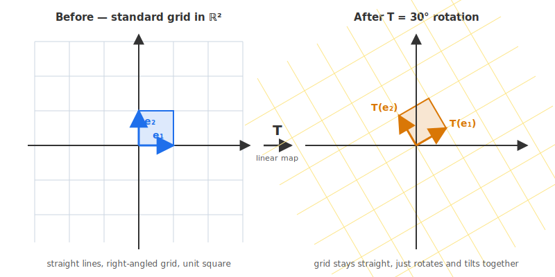
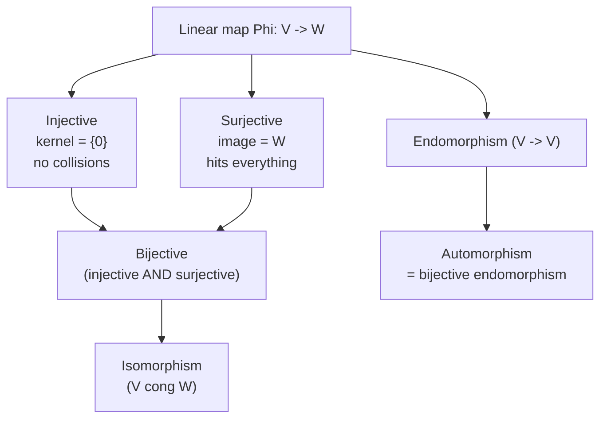
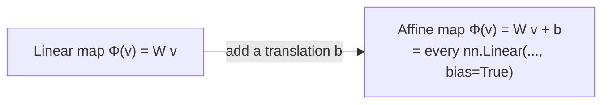
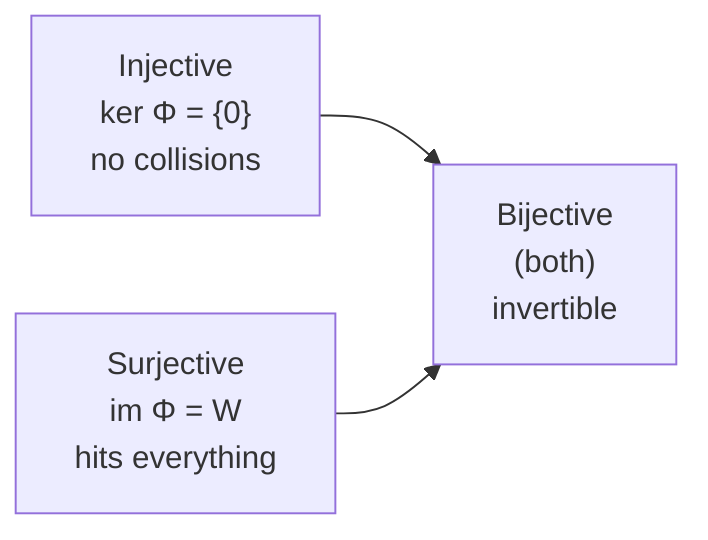

# 10 - Linear Mappings

[toc]

> **TL;DR:** A **linear mapping** (or linear transformation) is a function Φ: V → W between vector spaces that preserves both addition and scalar multiplication. Special cases get their own names: **injective**, **surjective**, **bijective**, and the structurally most important — **isomorphisms** (bijective linear maps), which say that two vector spaces are "the same up to relabelling." Linear mappings are the natural functions between vector spaces, exactly as group homomorphisms are the natural functions between groups.

## Vocabulary

**Linear mapping**: A function between vector spaces that respects both addition and scalar multiplication.

```math
\Phi: V \to W, \quad \Phi(\mathbf{u} + \mathbf{v}) = \Phi(\mathbf{u}) + \Phi(\mathbf{v}),\; \Phi(c\mathbf{v}) = c\, \Phi(\mathbf{v})
```

---

**Homomorphism**: The general algebra term for a structure-preserving map between two algebraic objects of the same kind. A linear map is a *vector-space homomorphism*.

---

**Domain**: The input space V in Φ: V → W.

```math
V
```

---

**Codomain**: The space the outputs could live in, namely W in Φ: V → W.

```math
W
```

---

**Image / range**: The set of vectors that Φ can actually produce. A subspace of the codomain W.

```math
\operatorname{im}\Phi = \{\, \Phi(\mathbf{v}) : \mathbf{v} \in V \,\}
```

---

**Kernel**: The set of input vectors that Φ sends to the zero vector. A subspace of the domain V.

```math
\ker \Phi = \{\, \mathbf{v} \in V : \Phi(\mathbf{v}) = \mathbf{0} \,\}
```

---

**Injective (one-to-one)**: Different inputs always map to different outputs. Equivalent to the kernel being just the zero vector.

```math
\Phi(\mathbf{u}) = \Phi(\mathbf{v}) \;\Longrightarrow\; \mathbf{u} = \mathbf{v}, \qquad \ker\Phi = \{\mathbf{0}\}
```

---

**Surjective (onto)**: Every vector in W is hit by some input. Equivalent to the image being all of W.

```math
\operatorname{im}\Phi = W
```

---

**Bijective**: Both injective and surjective — a perfect one-to-one correspondence.

```math
\Phi \text{ injective and surjective}
```

---

**Isomorphism**: A bijective linear map. Two vector spaces are isomorphic when such a map exists between them.

```math
V \cong W
```

---

**Endomorphism**: A linear map from a space to itself.

```math
\Phi: V \to V
```

---

**Automorphism**: A bijective endomorphism. The automorphisms of V form a group, called the general linear group of V.

```math
\operatorname{Aut}(V) = \operatorname{GL}(V)
```

---

**Identity mapping**: The map that sends every vector to itself. Always an automorphism.

```math
\operatorname{id}_V: \mathbf{v} \mapsto \mathbf{v}
```

---

**Identity automorphism**: The identity mapping viewed as the identity element of the automorphism group.

```math
\operatorname{id}_V \in \operatorname{Aut}(V)
```

---

## Intuition

A vector space has structure: you can add vectors and scale them. A function between vector spaces is **linear** if it respects that structure — sums and scalar multiples on the input side correspond to sums and scalar multiples on the output side. Linear maps are the "well-behaved" functions; they are exactly the ones whose action you can fully understand by understanding what they do to a basis.

Geometrically, a linear map takes the rectangular coordinate grid of the input and produces a *new, possibly tilted, possibly stretched, but always-straight* grid in the output. Below: T is a 30° rotation. Grid lines stay straight; right-angled cells become tilted parallelograms; the origin stays at the origin.



The four cardinal properties — injective, surjective, bijective — answer questions about *information loss*:

- **Injective**: no two different inputs collide. No information is lost; the input can be recovered from the output.
- **Surjective**: every potential output is reachable. The map "uses" the entire codomain.
- **Bijective**: both at once. The map is a perfect relabelling — it has an inverse function, also linear, also bijective.

An isomorphism is the strongest possible kinship between two vector spaces: they are algebraically indistinguishable. ℝ^(2×2) and ℝ⁴ are isomorphic — flatten the matrix and you have a vector. That is why we can store $2 \times 2$ matrices as length-4 arrays and lose nothing.



## The Definition of Linearity

A map Φ: V → W is **linear** when both of these hold for all u, v ∈ V and c ∈ ℝ:

```math
\Phi(\mathbf{u} + \mathbf{v}) = \Phi(\mathbf{u}) + \Phi(\mathbf{v}) \qquad \text{(additivity)}
```

```math
\Phi(c \mathbf{v}) = c\, \Phi(\mathbf{v}) \qquad \text{(homogeneity)}
```

These two combine into one compact statement: for all scalars a, b and vectors u, v,

```math
\Phi(a \mathbf{u} + b \mathbf{v}) = a\, \Phi(\mathbf{u}) + b\, \Phi(\mathbf{v})
```

> [!IMPORTANT]
> **Every linear map sends 0 to 0.** Setting c = 0 in homogeneity: Φ(0) = Φ(0 · v) = 0 · Φ(v) = 0. **If a candidate map does not send the zero vector to the zero vector, it is not linear.** This single check eliminates most non-examples in one line.

## Linear vs Affine

A common confusion: the function f(x) = a x + b from ℝ to ℝ is **not** linear unless b = 0, because f(0) = b ≠ 0. Functions of the form "linear plus a constant" are called **affine** maps and are the subject of [12 - Affine Spaces and Affine Mappings](./12-affine-spaces-and-affine-mappings.md).

In ML this matters: a fully connected layer y = W x + b is **affine**, not linear, because of the bias term. The matrix-multiplication part W x is linear; the addition of b shifts the origin away from itself.



## Examples and Non-Examples

| Map | Linear? | Reason |
| :--- | :---: | :--- |
| Φ(v) = A v (matrix multiplication) | ✓ | Distributivity of matrix-vector product |
| Φ(v) = 0 (zero map) | ✓ | Trivially preserves both axioms |
| Φ(v) = v (identity) | ✓ | Trivially preserves both axioms |
| Φ(v) = c v (scaling by a fixed scalar) | ✓ | Φ commutes with both axioms |
| Φ(v) = v + c with c ≠ 0 | ✗ | Φ(0) = c ≠ 0 — affine, not linear |
| Φ(v) = v ⊙ v (entry-wise square) | ✗ | Φ(2 v) = 4 Φ(v) ≠ 2 Φ(v) |
| Φ(v) = ‖v‖ (norm) | ✗ | Homogeneity fails for negative scalars: Φ(−v) = ‖v‖ ≠ −‖v‖ |
| Φ(f) = ∫₀¹ f(x) dx | ✓ | Integration is linear |
| Φ(f) = f' (derivative) | ✓ | Differentiation is linear |
| Φ(v) = vᵀ A v (quadratic form) | ✗ | Φ(c v) = c² Φ(v) — quadratic, not linear |

## Linear Maps Are Determined by Their Action on a Basis

The single biggest pedagogical fact about linear maps:

> [!IMPORTANT]
> **Once you know what Φ does to a basis of V, you know what Φ does to every vector in V.**

If {b₁, …, b_n} is a basis of V, and you know Φ(b₁), …, Φ(b_n), then for any v = c₁ b₁ + … + c_n b_n:

```math
\Phi(\mathbf{v}) = c_1 \Phi(\mathbf{b}_1) + c_2 \Phi(\mathbf{b}_2) + \cdots + c_n \Phi(\mathbf{b}_n)
```

This is the reason a linear map between finite-dimensional spaces has a **matrix representation** (developed in [11 - Matrix Representation of Linear Mappings](./11-matrix-representation-of-linear-mappings.md)): the matrix's columns are precisely Φ(b₁), …, Φ(b_n).

## Injective, Surjective, Bijective

These are general function-theoretic properties, but for *linear* maps they have especially clean characterisations.

### Injective

Φ is **injective** iff different inputs always map to different outputs. For linear maps this collapses to a single test on the kernel:

```math
\Phi \text{ injective} \iff \ker \Phi = \{\mathbf{0}\}
```

If a nonzero vector were in the kernel, then Φ(0) = Φ(that nonzero vector) = 0 — two different inputs would collide. Injectivity is *exactly* the absence of such collisions.

### Surjective

Φ is **surjective** iff every w ∈ W is hit by some input. Equivalently:

```math
\operatorname{im} \Phi = W
```

For matrix maps A: ℝⁿ → ℝᵐ, surjectivity is the statement that the columns of A span all of ℝᵐ — equivalently, rank(A) = m.

### Bijective

Φ is **bijective** iff it is both injective and surjective. A bijective linear map has an inverse Φ⁻¹: W → V which is itself linear (small proof, standard).



## Isomorphisms

An **isomorphism** is a bijective linear map. When such a map exists between V and W, we write V ≅ W and say the two spaces are **isomorphic** — they have identical structure, just possibly different labellings of their elements.

The basic theorem: **two finite-dimensional vector spaces are isomorphic iff they have the same dimension.** So

```math
\mathbb{R}^4 \;\cong\; \mathbb{R}^{2 \times 2} \;\cong\; \mathbb{P}_3 \;\cong\; \text{any 4-dim vector space}
```

All four-dimensional real vector spaces are, in this strong sense, "the same space." This is the deepest pay-off of the abstract definition: **the only invariant of a finite-dimensional real vector space is its dimension**.

> [!TIP]
> When you reshape a 4-D tensor of shape (2, 3, 4, 5) into a 1-D vector of length 120, you are applying an isomorphism between ℝ^(2×3×4×5) and ℝ¹²⁰. The two spaces are *literally the same* vector space — you are just choosing a different basis to represent the same data. `tensor.view(-1)` is an isomorphism in code form.

## Endomorphisms and Automorphisms

A linear map from a space to itself, Φ: V → V, is called an **endomorphism**. The set of endomorphisms is closed under composition and addition, so it forms an algebraic object called the *endomorphism ring* — but we will not need that level of detail here.

A bijective endomorphism is called an **automorphism**. The set of automorphisms of V forms a group under composition:

```math
\operatorname{Aut}(V) = \{\, \Phi: V \to V \mid \Phi \text{ is bijective and linear}\,\} \cong \operatorname{GL}(V)
```

For V = ℝⁿ this is exactly GL_n(ℝ) from [6 - Groups](./6-groups.md) — the group of invertible n × n matrices. **Every automorphism of ℝⁿ is matrix multiplication by an invertible matrix, and every invertible matrix gives an automorphism.** The connection comes full circle.

### The identity automorphism

The identity mapping id_V: V → V, v ↦ v is linear (trivially), bijective (trivially), and so it is an automorphism — the **identity automorphism**. In matrix form against any basis, it is the identity matrix Iₙ. It is the identity element of the automorphism group.

```math
\operatorname{id}_V(\mathbf{v}) = \mathbf{v}
```

## Real-world Example

In ML, the most important class of linear maps is exactly matrix multiplication — every neural-network layer without bias and without activation is a linear map. Below we (1) verify linearity, (2) check the four cardinal properties, and (3) show how isomorphism (`reshape`) is used in PyTorch.

```python
import numpy as np

rng = np.random.default_rng(0)

# ---- (1) Verify a matrix map is linear ----
A = np.array([[1, 2],
              [3, 4],
              [5, 6]], dtype=float)   # R^2 -> R^3

u = np.array([1.0, -1.0])
v = np.array([2.0,  3.0])
c = 7.5

assert np.allclose(A @ (u + v), A @ u + A @ v)        # additivity
assert np.allclose(A @ (c * v), c * (A @ v))         # homogeneity
print("A: R^2 -> R^3 is linear ✓")

# ---- (2a) Injective? ker(A) = {0} iff rank == #columns ----
def is_injective(A: np.ndarray) -> bool:
    return np.linalg.matrix_rank(A) == A.shape[1]

# A is 3x2 with rank 2 (full column rank) -> injective
print("Is A injective?", is_injective(A))   # True

# A non-injective example: A_zero with a zero column has kernel containing (0,1)
A_zero = np.array([[1, 0],
                   [2, 0]], dtype=float)
print("Is A_zero injective?", is_injective(A_zero))   # False

# ---- (2b) Surjective? im(A) = R^m iff rank == #rows ----
def is_surjective(A: np.ndarray) -> bool:
    return np.linalg.matrix_rank(A) == A.shape[0]

# A is 3x2 with rank 2; can't surject onto R^3 (rank < m)
print("Is A surjective?", is_surjective(A))   # False

# A surjective example: 2x3 with rank 2
A_sur = np.array([[1, 0, 0],
                  [0, 1, 0]], dtype=float)
print("Is A_sur surjective?", is_surjective(A_sur))   # True

# ---- (2c) Bijective? Square and full-rank ----
def is_bijective(A: np.ndarray) -> bool:
    m, n = A.shape
    return m == n and np.linalg.matrix_rank(A) == n

A_bij = np.array([[2, 1],
                  [1, 3]], dtype=float)   # invertible
print("Is A_bij bijective?", is_bijective(A_bij))   # True

# ---- (3) Isomorphism via reshape ----
# R^{2x3} is isomorphic to R^6. PyTorch's view/reshape implements that isomorphism.
import torch
X = torch.arange(6).reshape(2, 3).float()
v = X.reshape(-1)                # R^{2x3} -> R^6
X_back = v.reshape(2, 3)         # R^6 -> R^{2x3}
print("Reshape is an isomorphism:", torch.allclose(X, X_back))   # True

# Identity automorphism
I = np.eye(3)
v3 = rng.standard_normal(3)
assert np.allclose(I @ v3, v3)
print("Identity matrix is the identity automorphism of R^3 ✓")
```

> [!NOTE]
> The numerical checks for "injective" and "surjective" rely on `matrix_rank`, which has a tolerance for treating tiny singular values as zero. For mathematically clean matrices this is fine; for noisy real-world matrices, decide your tolerance carefully (see [9 - Basis and Rank](./9-basis-and-rank.md)).

## In Practice

Linear mappings appear everywhere in ML, often in disguise:

- **Linear layers** in neural networks (`nn.Linear(in, out, bias=False)`) are exactly linear maps; with `bias=True` they become affine.
- **Embeddings** are linear maps from one-hot vectors to dense representations — they implement a particular kind of ℝᵛ → ℝᵈ map.
- **Attention scores** are computed via a sequence of linear maps ( Q = X W_Q, K = X W_K, V = X W_V, each a linear map from ℝ^(d_model) to ℝ^(d_k) or ℝ^(d_v) ).
- **Convolutional layers** are *linear* in the input image: a convolution is a structured matrix multiplication. The structure (sparsity + parameter sharing) is what makes them efficient.
- **PCA** finds an orthogonal automorphism of ℝⁿ that aligns axes with directions of maximum variance.
- **Reshape / permute / view** in PyTorch are all isomorphisms — they relabel the same data without changing its information content.

> [!CAUTION]
> Nonlinear activation functions (ReLU, sigmoid, GELU) break linearity. The *whole reason* deep networks can express nonlinear functions is that they alternate linear layers with nonlinearities. Without activations, stacking 100 linear layers would still be a single linear map.

## Pitfalls

- **"Linear means f(x) = m x + b."** — In linear algebra, "linear" means **homogeneous and additive**, ruling out the constant term. The high-school usage is technically the *affine* case.
- **"Injective and surjective are different sides of the same coin."** — They are independent properties for maps between spaces of different dimensions. A map ℝ² → ℝ³ can be injective but never surjective. A map ℝ³ → ℝ² can be surjective but never injective.
- **"Bijective requires the spaces to have the same dimension."** — True for finite-dimensional spaces. For finite-dimensional V, W: bijective iff dim V = dim W and Φ injective (equivalently, surjective). For infinite-dimensional spaces, injective and surjective decouple again.
- **"Endomorphism is the same as automorphism."** — Every automorphism is an endomorphism, but not every endomorphism is bijective. The projection Φ(x, y) = (x, 0) is an endomorphism of ℝ² but not an automorphism (its image is just the x-axis).
- **"Linear maps preserve norms."** — Most do not. Only *orthogonal* maps preserve norms; general linear maps stretch and squish. Norm preservation is a strong extra condition.

## Exercises

### Exercise 1 — Is it linear?

Decide whether each is a linear map. Justify each.

1. T(x, y) = (x + y, x − y)
2. T(x, y) = (x², y)
3. T(x, y) = (x + 1, 2 y)
4. T(p) = p' on ℙₙ → ℙₙ₋₁ (derivative)
5. T(f) = f(0) on C[−1, 1] → ℝ (point evaluation)

#### Solution 1

Test: (i) T(0) = 0; (ii) additivity and homogeneity.

1. **Linear.** T(0) = 0. Both components are linear in x and y. Matrix form: `[[1, 1], [1, −1]]`.
2. **Not linear.** T(2, 0) = (4, 0) ≠ 2 T(1, 0) = (2, 0). Squaring breaks homogeneity.
3. **Not linear.** T(0) = (1, 0) ≠ 0. Affine, not linear.
4. **Linear.** (p + q)' = p' + q' and (c p)' = c p'. Differentiation is linear — a beautiful example beyond matrices.
5. **Linear.** (f + g)(0) = f(0) + g(0) and (c f)(0) = c f(0). Point evaluation is a linear functional.

### Exercise 2 — Build the matrix from images of basis vectors

T: ℝ² → ℝ² is rotation by 90° counter-clockwise. Construct A_T using the rule "columns of A_T are images of the input basis," then verify on (3, 1)ᵀ.

#### Solution 2

- T(e₁) = T(1, 0) = (0, 1).
- T(e₂) = T(0, 1) = (−1, 0).

```math
A_T = \begin{bmatrix} 0 & -1 \\ 1 & 0 \end{bmatrix}
```

Apply to (3, 1)ᵀ:

```math
A_T \begin{bmatrix} 3 \\ 1 \end{bmatrix} = \begin{bmatrix} 0·3 + (-1)·1 \\ 1·3 + 0·1 \end{bmatrix} = \begin{bmatrix} -1 \\ 3 \end{bmatrix}
```

Verify geometrically: (3, 1) rotated 90° CCW lands at (−1, 3). The new x = − old y; the new y = old x. ✓

### Exercise 3 — Injective, surjective, bijective

For each matrix A: ℝⁿ → ℝᵐ, decide injective / surjective / both / neither. Justify using rank.

```math
A_1 = \begin{bmatrix} 1 & 0 \\ 0 & 1 \\ 1 & 1 \end{bmatrix}, \quad A_2 = \begin{bmatrix} 1 & 0 & 1 \\ 0 & 1 & 1 \end{bmatrix}, \quad A_3 = \begin{bmatrix} 1 & 2 \\ 3 & 6 \end{bmatrix}
```

#### Solution 3

Key facts: **injective ⇔ rank = n** (full column rank, kernel = {0}); **surjective ⇔ rank = m** (full row rank).

1. **A₁** — shape (3, 2). Columns (1, 0, 1) and (0, 1, 1) are independent → rank 2. rank = n = 2 → **injective**. rank ≠ m = 3 → **not surjective**.
2. **A₂** — shape (2, 3). First two columns are e₁ and e₂ → rank 2. rank = m = 2 → **surjective**. rank ≠ n = 3 → **not injective** (the third column equals e₁ + e₂, giving a 1-D kernel).
3. **A₃** — shape (2, 2). Row 2 = 3·row 1 → rank 1. **Neither injective nor surjective**.

### Exercise 4 — Reshape as an isomorphism

Explain why PyTorch's `tensor.view(-1)` (flattening) is an **isomorphism** of vector spaces. For a tensor of shape (2, 3, 4), identify the two isomorphic spaces.

#### Solution 4

`view(-1)` reorders the same numeric values into a 1-D layout without changing them. As a function ℝ^(2×3×4) → ℝ²⁴:

1. **Linear** — adding two tensors then flattening equals flattening then adding (flatten is a permutation of indices). Scalar multiplication commutes with flattening too.
2. **Bijective** — `view(2, 3, 4)` exactly undoes `view(-1)`.

A linear bijection is an **isomorphism**.

**The two spaces:** ℝ^(2×3×4) (24-dimensional space of (2, 3, 4) tensors) and ℝ²⁴ (24-dimensional space of length-24 vectors). They have the same dimension (24), hence are isomorphic. `view(-1)` realises one specific isomorphism between them.

> [!TIP]
> `view` is essentially free in PyTorch — no data is copied. The underlying numbers don't move; only the strides change. The isomorphism is realised by **reinterpreting memory layout**, not by performing arithmetic.

## Sources

- Deisenroth, M. P., Faisal, A. A., & Ong, C. S. (2020). *Mathematics for Machine Learning*. Chapter 2.7. https://mml-book.github.io/
- Strang, G. MIT 18.06 Lecture 30 (linear transformations and their matrices). https://ocw.mit.edu/courses/18-06-linear-algebra-spring-2010/
- Axler, S. (2015). *Linear Algebra Done Right* (3rd ed.). Chapter 3.

## Related

- [3 - Matrices](./3-matrices.md)
- [6 - Groups](./6-groups.md)
- [7 - Vector Spaces](./7-vector-spaces.md)
- [9 - Basis and Rank](./9-basis-and-rank.md)
- [11 - Matrix Representation of Linear Mappings](./11-matrix-representation-of-linear-mappings.md)
- [12 - Affine Spaces and Affine Mappings](./12-affine-spaces-and-affine-mappings.md)
