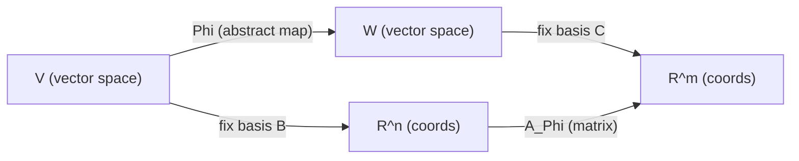
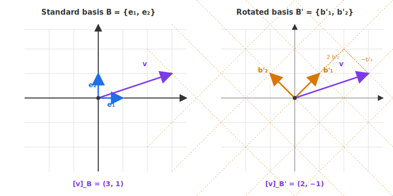

# 11 - Matrix Representation of Linear Mappings

[toc]

> **TL;DR:** Once you fix a basis on the input space and a basis on the output space, **every linear mapping has a unique matrix representation**: its columns are the coordinates of the basis vectors of the input under the mapping. Changing basis changes the matrix but not the underlying mapping — and the formula that converts one matrix to another under a basis change is itself a piece of linear algebra worth memorising.

## Vocabulary

**Transformation matrix**: The matrix that represents a linear mapping Φ once a basis B of the domain and a basis C of the codomain are fixed.

```math
A_\Phi \in \mathbb{R}^{m \times n}, \qquad [\Phi(\mathbf{v})]_C = A_\Phi\, [\mathbf{v}]_B
```

---

**Coordinate vector**: The column of coefficients (c₁, …, c_n) for which v = c₁ b₁ + … + c_n b_n in basis B.

```math
[\mathbf{v}]_B = (c_1, c_2, \ldots, c_n)^\top
```

---

**Change-of-basis matrix**: The invertible matrix P that converts coordinates from one basis to another in the same space. The columns of P are the new basis vectors expressed in old-basis coordinates.

```math
[\mathbf{v}]_{B'} = P^{-1}\, [\mathbf{v}]_B
```

---

**Similar matrices**: Two matrices that represent the same endomorphism in different bases. They are related by a change-of-basis transformation.

```math
\tilde{A} = P^{-1} A P
```

---

**Image of a linear mapping**: The column space of any transformation matrix that represents Φ. Its dimension (the rank) is basis-independent.

```math
\operatorname{im}\Phi = \operatorname{im}(A_\Phi)
```

---

**Kernel of a linear mapping**: The null space of any transformation matrix that represents Φ. Its dimension (the nullity) is basis-independent.

```math
\ker\Phi = \ker(A_\Phi)
```

---

**Coordinate isomorphism**: For a fixed basis B of V, the map sending each vector to its coordinate column is an isomorphism between V and ℝⁿ.

```math
V \xrightarrow{\;\mathbf{v} \mapsto [\mathbf{v}]_B\;} \mathbb{R}^n
```

---

## Intuition

A linear mapping Φ: V → W is an abstract function. To compute with it on a machine, you need numbers. The way to get numbers is to fix coordinate systems on both sides: a basis B on V and a basis C on W. Once those bases are chosen, every vector becomes a column of coordinates and the mapping becomes a matrix. The matrix is *just the table* that records what Φ does to the basis vectors of V, written in C-coordinates.

The mapping itself is **basis-independent** — Φ is the same function whether you describe it in the standard basis or a rotated basis or some weird basis derived from PCA. What changes when you re-coordinate is the *matrix*: same abstract mapping, different numerical representation. The change-of-basis formula tells you exactly how the matrix transforms.



## Coordinate Vectors

Pick a basis B = {b₁, …, bₙ} of V. Every vector v ∈ V has a **unique** expansion

```math
\mathbf{v} = c_1 \mathbf{b}_1 + c_2 \mathbf{b}_2 + \cdots + c_n \mathbf{b}_n
```

The column of coefficients is the **coordinate vector** of v in basis B:

```math
[\mathbf{v}]_B = \begin{bmatrix} c_1 \\ c_2 \\ \vdots \\ c_n \end{bmatrix} \in \mathbb{R}^n
```

The same abstract vector v has different coordinates in different bases. In the standard basis e₁, …, eₙ, coordinates and components coincide — that is why we usually never notice the distinction. Once you change basis, the coordinates change too.

The same purple arrow v lives in the same spot in space — but its **coordinates** depend entirely on which basis you measure along. In the standard basis it reads (3, 1); in the 45°-rotated basis it reads (2, −1).



## Building the Transformation Matrix

Given Φ: V → W, a basis B of V, and a basis C of W, the transformation matrix A_Φ with shape (m, n) is built one column at a time:

```math
\text{column } j \text{ of } A_\Phi \;=\; [\Phi(\mathbf{b}_j)]_C
```

That is: take the j-th basis vector of V, push it through Φ to get a vector in W, then express that result in coordinates with respect to C. Do this for each j = 1, …, n and stack the resulting columns.

With this construction, computing Φ(v) for any v reduces to a matrix-vector product on the coordinate side:

```math
[\Phi(\mathbf{v})]_C \;=\; A_\Phi \, [\mathbf{v}]_B
```

> [!IMPORTANT]
> **The columns of the transformation matrix are exactly the images of the input basis.** This is the single most useful fact for constructing A_Φ from scratch: ignore the rest of the input space and only chase what happens to b₁, …, bₙ.

## Worked Example

Let Φ: ℝ² → ℝ² be the rotation by 90° counter-clockwise. In the standard basis B = C = {e₁, e₂}:

```math
\Phi(\mathbf{e}_1) = \mathbf{e}_2 = (0, 1)^\top, \qquad \Phi(\mathbf{e}_2) = -\mathbf{e}_1 = (-1, 0)^\top
```

Stacking those as columns:

```math
A_\Phi = \begin{bmatrix} 0 & -1 \\ 1 & 0 \end{bmatrix}
```

Verification with the test vector (1, 2)ᵀ:

```math
A_\Phi \begin{bmatrix} 1 \\ 2 \end{bmatrix} = \begin{bmatrix} -2 \\ 1 \end{bmatrix}
```

which is exactly the 90° rotation of (1, 2)ᵀ. ✓

Now suppose we change basis. Let B' = {(1, 1)ᵀ, (1, −1)ᵀ}. The same rotation now has a *different matrix*; we compute it below in the "Basis Change" section.

## Image and Kernel from the Matrix

Once a basis is fixed, the image and kernel of Φ have direct matrix interpretations (introduced earlier in [5 - Null Space and Pseudoinverse](./5-null-space-and-pseudoinverse.md) and [9 - Basis and Rank](./9-basis-and-rank.md)):

```math
\operatorname{im} \Phi = \operatorname{im} A_\Phi \;\;\text{(column space of } A_\Phi\text{)}
```

```math
\ker \Phi = \ker A_\Phi \;\;\text{(null space of } A_\Phi\text{)}
```

So the *image of the linear mapping* is the *column space of any matrix that represents it*, and the *kernel* is the *null space*. Different bases give different matrices, but the column-space dimension (rank) and null-space dimension (nullity) are **invariants of the mapping**.

> [!TIP]
> Rank is basis-independent — it is a property of the linear mapping itself. Whichever basis you pick, the rank of the resulting matrix A_Φ is always the same number: dim(im Φ). The same is true for nullity = dim(ker Φ).

## Basis Change — The Key Formula

Two bases of the same space are related by an **invertible change-of-basis matrix**. Let B and B' be two bases of V. There exists a unique invertible P with shape (n, n) such that

```math
[\mathbf{v}]_{B'} = P^{-1}\, [\mathbf{v}]_B \quad \text{for every } \mathbf{v} \in V
```

The columns of P are the new basis vectors written in **old-basis** coordinates. So P translates "new-basis coordinates" back to "old-basis coordinates," and inverting gives the conversion in the other direction.

For an **endomorphism** Φ: V → V, the matrix representations in the two bases are related by

```math
A_{B'} = P^{-1}\, A_B\, P
```

This is the **similarity transformation**. Two matrices are *similar* iff they represent the same linear mapping in different bases.


> [!NOTE]
> **Read P⁻¹ A_B P from right to left**: P converts new-basis coordinates into old-basis coordinates; A_B applies Φ in the old basis; P⁻¹ converts the result back to the new basis. The composition is Φ expressed in the new basis.

### Worked Example, Continued

For the rotation Φ above with new basis B' = {(1, 1)ᵀ, (1, −1)ᵀ}:

```math
P = \begin{bmatrix} 1 & 1 \\ 1 & -1 \end{bmatrix}, \qquad P^{-1} = \tfrac{1}{2} \begin{bmatrix} 1 & 1 \\ 1 & -1 \end{bmatrix}
```

The transformation matrix in B' is:

```math
A_{B'} = P^{-1} A_B P = \tfrac{1}{2} \begin{bmatrix} 1 & 1 \\ 1 & -1 \end{bmatrix} \begin{bmatrix} 0 & -1 \\ 1 & 0 \end{bmatrix} \begin{bmatrix} 1 & 1 \\ 1 & -1 \end{bmatrix} = \begin{bmatrix} 0 & 1 \\ -1 & 0 \end{bmatrix}
```

This is *also* a 90° rotation matrix — just the rotation expressed in the rotated basis. **Same mapping, different numbers.**

## Rectangular Case — Φ: V → W with Different Bases

If V and W are different spaces, basis changes happen independently on each side. Let P be the change-of-basis matrix on V (from B to B') and Q on W (from C to C'). The new matrix is:

```math
A_{B', C'} = Q^{-1}\, A_{B, C}\, P
```

For the special case of an endomorphism (V = W with P = Q on both sides), this reduces to the similarity transformation P⁻¹ A P above.

## Real-world Example

Below we (1) build a transformation matrix from "what the map does to a basis," (2) verify the basis-change formula numerically, and (3) show that PyTorch's linear layer is literally a transformation matrix.

```python
import numpy as np

# ---- (1) Build a transformation matrix from images of basis vectors ----
# Mapping: reflection across the line y = x in R^2
def Phi(v):
    return np.array([v[1], v[0]])

e1 = np.array([1.0, 0.0])
e2 = np.array([0.0, 1.0])
# Columns = Phi(e_j)
A = np.column_stack([Phi(e1), Phi(e2)])
print("Reflection matrix:\n", A)
# [[0, 1],
#  [1, 0]]

# Test on a random vector
v = np.array([3.0, 5.0])
assert np.allclose(A @ v, Phi(v))   # matrix product reproduces Phi
print("Phi(v) = A v ✓")

# ---- (2) Basis change formula ----
# Original basis B = standard, new basis B' = {(1,1), (1,-1)}
P = np.array([[1.0, 1.0],
              [1.0, -1.0]])     # columns are new basis in old coords
P_inv = np.linalg.inv(P)

# Rotation by 90 deg counterclockwise in standard basis
A_B = np.array([[0.0, -1.0],
                [1.0,  0.0]])

A_Bp = P_inv @ A_B @ P
print("Rotation in B' coordinates:")
print(A_Bp)

# Verify: compute Phi(v) two ways
v = np.array([2.0, 3.0])
v_in_Bp = P_inv @ v                      # coords of v in new basis
result_in_Bp = A_Bp @ v_in_Bp            # apply mapping in new basis
result_back = P @ result_in_Bp           # convert back to standard
print("Direct:        ", A_B @ v)
print("Via new basis: ", result_back)
assert np.allclose(A_B @ v, result_back)

# ---- (3) PyTorch linear layer is literally a transformation matrix ----
import torch
import torch.nn as nn

torch.manual_seed(0)
layer = nn.Linear(3, 2, bias=False)   # purely linear; bias=False
x = torch.randn(3)
y = layer(x)

W = layer.weight.detach().numpy()    # shape (2, 3) — the transformation matrix
y_manual = W @ x.detach().numpy()
print("Layer output:        ", y.detach().numpy())
print("Manual W @ x output: ", y_manual)
assert np.allclose(y.detach().numpy(), y_manual)

# Image and kernel of the layer
print("Rank of W:    ", np.linalg.matrix_rank(W))                 # image dim
print("Nullity of W: ", W.shape[1] - np.linalg.matrix_rank(W))    # kernel dim
```

> [!TIP]
> When you read a paper that says "the weight matrix lives in the rotated basis given by the PCA of the inputs," the author is computing P⁻¹ W P where P is the PCA basis. The action of the layer is unchanged; the *representation* changes to one whose axes align with directions of high variance in the data.

## In Practice

Basis-change manoeuvring underlies a number of practical techniques:

- **Whitening / PCA preprocessing** is a basis change on the input space.
- **Spectral methods** — diagonalising a matrix A = P D P⁻¹ is finding a basis in which A is a diagonal matrix; the new basis consists of eigenvectors.
- **Coordinate-equivariant networks** — designing layers so that the same physics is represented across different bases without retraining.
- **LoRA and other parameter-efficient methods** — express the update ΔW in a low-rank basis U Vᵀ rather than full coordinates.
- **Numerical solvers** — Krylov-subspace methods (CG, GMRES) implicitly perform a sequence of basis changes into low-dimensional subspaces where the problem is easier.

> [!CAUTION]
> Confusing P with P⁻¹ is one of the most common bugs in implementations of basis change. Remember the convention: the **columns of P are the new basis vectors written in old-basis coordinates**. This means P converts new coordinates → old coordinates, so P⁻¹ converts old → new.

## Pitfalls

- **"Different basis means different mapping."** — Different basis means different *matrix* for the *same* mapping. The mapping is basis-free.
- **"The transformation matrix is unique."** — It is unique only given a *choice* of bases. Change either basis and the matrix changes.
- **"Similar matrices have the same entries."** — Similar matrices typically have *different* entries; what they share is invariants like rank, determinant, trace, and eigenvalues.
- **"The image of Φ is the column space of *any* matrix."** — Only matrices that *represent Φ relative to a chosen basis of the codomain* have this property. The column space depends on the codomain basis when reading it as a subspace of W, but its *dimension* (the rank) is invariant.
- **"A_B' = P A_B P⁻¹."** — Easy to flip. The correct formula is A_B' = P⁻¹ A_B P. Memorise the right-to-left reading: convert into old basis, apply mapping, convert back.

## Exercises

### Exercise 1 — Build the matrix from basis images

T: ℝ² → ℝ³ is given by T(x, y) = (x + 2 y, 3 x − y, 4 y). Build the matrix A_T relative to the standard bases of ℝ² and ℝ³.

#### Solution 1

The columns of A_T are T(e₁) and T(e₂) written in the standard basis of ℝ³.

- **T(e₁)** = T(1, 0) = (1, 3, 0).
- **T(e₂)** = T(0, 1) = (2, −1, 4).

Stack as columns:

```math
A_T = \begin{bmatrix} 1 & 2 \\ 3 & -1 \\ 0 & 4 \end{bmatrix}
```

Verify on (5, 2)ᵀ: A_T · (5, 2)ᵀ = (5·1 + 2·2, 5·3 + 2·(−1), 5·0 + 2·4) = (9, 13, 8). Compare to T(5, 2) = (5 + 4, 15 − 2, 8) = (9, 13, 8). ✓

### Exercise 2 — Coordinates in a non-standard basis

Let B = {b₁, b₂} = {(1, 1)ᵀ, (1, −1)ᵀ} be a basis of ℝ². Find the coordinate vector of v = (3, 5)ᵀ in basis B.

#### Solution 2

We seek c₁, c₂ with c₁ b₁ + c₂ b₂ = v, i.e.

```math
c_1 \begin{bmatrix} 1 \\ 1 \end{bmatrix} + c_2 \begin{bmatrix} 1 \\ -1 \end{bmatrix} = \begin{bmatrix} 3 \\ 5 \end{bmatrix}
```

This gives c₁ + c₂ = 3 and c₁ − c₂ = 5. Adding: 2 c₁ = 8 → c₁ = 4. Subtracting: 2 c₂ = −2 → c₂ = −1.

```math
[\mathbf{v}]_B = \begin{bmatrix} 4 \\ -1 \end{bmatrix}
```

Verify: 4·(1, 1) + (−1)·(1, −1) = (4 − 1, 4 + 1) = (3, 5). ✓

Equivalently, build the change-of-basis matrix P (columns = b₁, b₂) and compute P⁻¹ v:

```math
P = \begin{bmatrix} 1 & 1 \\ 1 & -1 \end{bmatrix}, \quad P^{-1} = \frac{1}{2} \begin{bmatrix} 1 & 1 \\ 1 & -1 \end{bmatrix}, \quad [\mathbf{v}]_B = P^{-1} \mathbf{v} = \frac{1}{2}\begin{bmatrix} 8 \\ -2 \end{bmatrix} = \begin{bmatrix} 4 \\ -1 \end{bmatrix} \checkmark
```

### Exercise 3 — Similar matrices

In the standard basis of ℝ², T is represented by:

```math
A_B = \begin{bmatrix} 2 & 1 \\ 0 & 3 \end{bmatrix}
```

Compute the matrix A_B' of the same transformation in the new basis B' = {(1, 1)ᵀ, (1, −1)ᵀ}.

#### Solution 3

Use A_B' = P⁻¹ A_B P with P from Exercise 2.

```math
A_B P = \begin{bmatrix} 2 & 1 \\ 0 & 3 \end{bmatrix} \begin{bmatrix} 1 & 1 \\ 1 & -1 \end{bmatrix} = \begin{bmatrix} 3 & 1 \\ 3 & -3 \end{bmatrix}
```

```math
A_{B'} = P^{-1} (A_B P) = \frac{1}{2}\begin{bmatrix} 1 & 1 \\ 1 & -1 \end{bmatrix} \begin{bmatrix} 3 & 1 \\ 3 & -3 \end{bmatrix} = \frac{1}{2}\begin{bmatrix} 6 & -2 \\ 0 & 4 \end{bmatrix} = \begin{bmatrix} 3 & -1 \\ 0 & 2 \end{bmatrix}
```

**A_B' = [[3, −1], [0, 2]].**

Sanity check: similar matrices have the same trace and determinant.

- trace A_B = 2 + 3 = 5; trace A_B' = 3 + 2 = 5. ✓
- det A_B = 6; det A_B' = 6. ✓

These invariants survive the basis change — they are properties of the *mapping*, not the matrix representation.

### Exercise 4 — Image and kernel from the matrix

Given:

```math
A_T = \begin{bmatrix} 1 & 2 & 3 \\ 2 & 4 & 6 \end{bmatrix}
```

(representing some T: ℝ³ → ℝ² in standard bases), find a basis for im T and a basis for ker T. State the dimensions.

#### Solution 4

**Image** = column space of A_T. Row 2 = 2·row 1, so rank = 1. The columns of A_T are (1, 2), (2, 4), (3, 6) — all scalar multiples of (1, 2). A basis for im T is:

```math
\operatorname{im} T = \operatorname{span}\!\{ (1, 2)^\top \}, \qquad \dim \operatorname{im} T = 1
```

**Kernel** = null space of A_T. Reduce A_T to RREF:

```math
\begin{bmatrix} 1 & 2 & 3 \\ 0 & 0 & 0 \end{bmatrix} \to \operatorname{RREF}(A_T) = \begin{bmatrix} 1 & 2 & 3 \\ 0 & 0 & 0 \end{bmatrix}
```

Pivot in column 1. Free variables x₂ and x₃. From row 1: x₁ = −2 x₂ − 3 x₃.

- Set x₂ = 1, x₃ = 0: vector (−2, 1, 0)ᵀ.
- Set x₂ = 0, x₃ = 1: vector (−3, 0, 1)ᵀ.

```math
\ker T = \operatorname{span}\!\left\{\, \begin{bmatrix} -2 \\ 1 \\ 0 \end{bmatrix},\; \begin{bmatrix} -3 \\ 0 \\ 1 \end{bmatrix} \,\right\}, \qquad \dim \ker T = 2
```

Verify rank–nullity: rank (1) + nullity (2) = 3 = n. ✓

## Sources

- Deisenroth, M. P., Faisal, A. A., & Ong, C. S. (2020). *Mathematics for Machine Learning*. Chapter 2.7.2–2.7.3. https://mml-book.github.io/
- Strang, G. MIT 18.06 Lecture 30 (linear transformations and their matrices), Lecture 31 (change of basis). https://ocw.mit.edu/courses/18-06-linear-algebra-spring-2010/
- Axler, S. (2015). *Linear Algebra Done Right* (3rd ed.). Chapter 3.

## Related

- [3 - Matrices](./3-matrices.md)
- [5 - Null Space and Pseudoinverse](./5-null-space-and-pseudoinverse.md)
- [9 - Basis and Rank](./9-basis-and-rank.md)
- [10 - Linear Mappings](./10-linear-mappings.md)
- [12 - Affine Spaces and Affine Mappings](./12-affine-spaces-and-affine-mappings.md)
