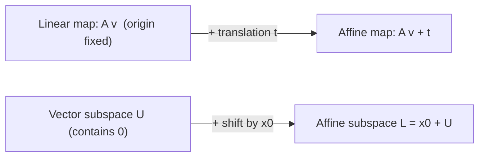
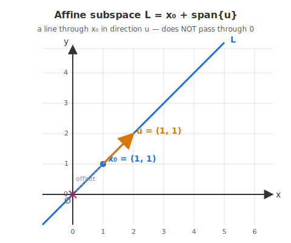

# 12 - Affine Spaces and Affine Mappings

[toc]

> **TL;DR:** An **affine space** is a vector space with no preferred origin — a flat set that can be shifted away from the zero vector. An **affine subspace** is a vector subspace translated by a fixed offset: L = x₀ + U, written parametrically as x₀ + λ₁ u₁ + … + λ_k u_k. **Affine mappings** are linear maps plus a translation, Φ(v) = A v + t — the form of every fully-connected neural network layer (with bias) on the planet.

## Vocabulary

**Affine combination**: A weighted sum of points whose coefficients sum to 1. Unlike linear combinations, this construction gives no special role to the zero vector.

```math
\sum_{i=1}^{k} c_i \mathbf{x}_i, \qquad \sum_{i=1}^{k} c_i = 1
```

---

**Affine space / affine subspace**: A vector subspace U translated by a fixed support vector x₀. Geometrically, the subspace U shifted away from the origin.

```math
L = \mathbf{x}_0 + U = \{\, \mathbf{x}_0 + \mathbf{u} : \mathbf{u} \in U \,\}
```

---

**Direction space**: The (vector) subspace underlying an affine subspace. Basis-independent and the only invariant of L.

```math
U \subseteq V
```

---

**Support point**: Any chosen point in the affine subspace. Not unique — any point in L can serve as the support point.

```math
\mathbf{x}_0 \in L
```

---

**Parametric equation**: The affine subspace written as the support point plus a linear combination of direction-space basis vectors.

```math
\mathbf{x} = \mathbf{x}_0 + \lambda_1 \mathbf{u}_1 + \lambda_2 \mathbf{u}_2 + \cdots + \lambda_k \mathbf{u}_k
```

---

**Parameters**: The free scalars λ₁, …, λ_k that sweep through the affine subspace as they vary over ℝ.

```math
\lambda_1, \lambda_2, \ldots, \lambda_k \in \mathbb{R}
```

---

**Dimension of an affine subspace**: The dimension of its underlying direction space U.

```math
\dim L = \dim U
```

---

**Point**: A 0-dimensional affine subspace — a single point, with the trivial direction space.

```math
L = \{\mathbf{x}_0\}, \qquad U = \{\mathbf{0}\}
```

---

**Line**: A 1-dimensional affine subspace.

```math
\mathbf{x} = \mathbf{x}_0 + \lambda \mathbf{u}, \qquad \lambda \in \mathbb{R}
```

---

**Plane**: A 2-dimensional affine subspace.

```math
\mathbf{x} = \mathbf{x}_0 + \lambda_1 \mathbf{u}_1 + \lambda_2 \mathbf{u}_2
```

---

**Hyperplane**: An (n − 1)-dimensional affine subspace of ℝⁿ. Equivalently, the solution set of a single linear equation with normal vector w and offset b.

```math
\{\, \mathbf{x} \in \mathbb{R}^n : \mathbf{w}^\top \mathbf{x} = b \,\}
```

---

**Affine mapping**: A linear map plus a fixed translation vector. The form of every fully-connected neural network layer with bias.

```math
\Phi(\mathbf{v}) = A \mathbf{v} + \mathbf{t}
```

---

**Translation**: The affine mapping whose linear part is the identity — it simply shifts every point by a fixed vector.

```math
\mathbf{v} \mapsto \mathbf{v} + \mathbf{t}
```

---

## Intuition

In a vector space, the origin is *special* — it is the additive identity, every subspace must contain it, every linear map fixes it. The affine viewpoint deliberately gives that up. An **affine space** is what you get when you take a vector space and forget which point is the origin. You can still talk about differences between points (those are vectors), but no single point is privileged.

In practice, affine spaces show up as **translated subspaces**: a plane in ℝ³ that does *not* pass through the origin is an affine subspace, not a vector subspace. A linear function with a constant term, f(x) = a x + b, traces an affine subspace (a line) of ℝ². The constant term is the translation that pulls the line away from the origin.

The bias in a neural-network layer, y = W x + b, is exactly the same translation idea. Without the bias the layer is linear; with the bias it is affine. The single most common operation in deep learning is the application of an affine mapping.



## Affine Subspaces

Formally, an **affine subspace** of ℝⁿ is a set of the form

```math
L = \mathbf{x}_0 + U = \{\, \mathbf{x}_0 + \mathbf{u} : \mathbf{u} \in U \,\}
```

where U is a vector subspace of ℝⁿ (the **direction space**) and x₀ ∈ ℝⁿ is a **support point**. The geometric picture: take the subspace U (a set passing through the origin) and shift the entire set by adding **x₀** to every point.

> [!IMPORTANT]
> The support point **x₀** is **not unique**. Any point in L can serve as the support point — pick a different starting point and the parameters change, but the same affine subspace is described. The direction space U is the only basis-free invariant of L.

### When is an affine subspace also a vector subspace?

An affine subspace L = x₀ + U is also a *vector* subspace iff 0 ∈ L, iff x₀ ∈ U, iff we can choose x₀ = 0. Otherwise L is a "translated" subspace that misses the origin.

## Parametric Equations

Pick a basis {u₁, …, u_k} of the direction space U. Then every point in L can be written:

```math
\mathbf{x} = \mathbf{x}_0 + \lambda_1 \mathbf{u}_1 + \lambda_2 \mathbf{u}_2 + \cdots + \lambda_k \mathbf{u}_k
```

where λ₁, …, λ_k ∈ ℝ are the **parameters**. This is the **parametric equation** of L. Sweeping the parameters through all of ℝᵏ sweeps x through all of L.

### Lines, Planes, Hyperplanes

The dimension of L equals dim U = k. The named cases:

- **k = 0** — L = {x₀} is a single **point**.
- **k = 1** — L is a **line** through x₀ in direction u₁:

```math
\mathbf{x} = \mathbf{x}_0 + \lambda\, \mathbf{u}_1
```

- **k = 2** — L is a **plane** through x₀ spanned by u₁ and u₂:

```math
\mathbf{x} = \mathbf{x}_0 + \lambda_1 \mathbf{u}_1 + \lambda_2 \mathbf{u}_2
```

- **k = n − 1** — L is a **hyperplane**, the largest proper affine subspace of ℝⁿ.

A hyperplane has another, more useful equivalent description: it is the solution set of a single linear equation,

```math
\mathbf{w}^\top \mathbf{x} = b
```

The vector w is **normal** to the hyperplane; the offset b shifts the hyperplane away from the origin. Setting b = 0 gives a hyperplane through the origin, which *is* a vector subspace.

> [!TIP]
> Every linear classifier in ML defines a hyperplane: SVM, logistic regression's decision boundary, the final dense layer of a feed-forward network. The "weight vector" w is the **normal direction**, and "b" is the **bias term**. When you ask "which side of the boundary does this point fall on?" you are computing wᵀ x − b and checking its sign.

## Affine Mappings

An **affine mapping** Φ: V → W is a function of the form:

```math
\Phi(\mathbf{v}) = A \mathbf{v} + \mathbf{t}
```

where A: V → W is a linear map and t ∈ W is a fixed translation vector. When t = 0, the affine mapping reduces to a linear one.

Affine mappings preserve **affine combinations** — sums whose coefficients sum to 1:

```math
\Phi\!\left( \sum_i c_i \mathbf{x}_i \right) = \sum_i c_i\, \Phi(\mathbf{x}_i) \quad \text{when } \sum_i c_i = 1
```

This is the affine analogue of the linearity property. Geometrically it captures the intuition that affine maps preserve **"lines as lines, planes as planes"** — they cannot bend a flat set.

### Composition of Affine Mappings

The composition of two affine mappings is again affine. If Φ₁(v) = A₁ v + t₁ and Φ₂(v) = A₂ v + t₂, then:

```math
(\Phi_2 \circ \Phi_1)(\mathbf{v}) = A_2 (A_1 \mathbf{v} + \mathbf{t}_1) + \mathbf{t}_2 = (A_2 A_1)\, \mathbf{v} + (A_2 \mathbf{t}_1 + \mathbf{t}_2)
```

The new linear part is A₂ A₁ and the new translation is A₂ t₁ + t₂. Notice the translation is **not** just t₁ + t₂ — it gets pushed through A₂ first.

> [!NOTE]
> Stacking two linear-with-bias layers without an activation gives another linear-with-bias layer. **That is exactly the composition formula above.** The reason deep networks express nonlinear functions is the *nonlinearity* between layers; without activations, depth buys you nothing — you collapse back to a single affine map.

### The Augmented-Matrix Trick

A standard implementation trick: write an affine map as a *linear* map in one higher dimension. Embed v ∈ ℝⁿ as ṽ = (v, 1)ᵀ ∈ ℝⁿ⁺¹, and replace A and t by the **augmented matrix**:

```math
\tilde{A} = \begin{bmatrix} A & \mathbf{t} \\ \mathbf{0}^\top & 1 \end{bmatrix} \in \mathbb{R}^{(m+1) \times (n+1)}
```

Then:

```math
\tilde{A}\, \tilde{\mathbf{v}} = \begin{bmatrix} A \mathbf{v} + \mathbf{t} \\ 1 \end{bmatrix}
```

The affine map is now a linear map on the augmented vector. This trick is the standard way to represent **homogeneous coordinates** in computer graphics — a single 4 × 4 matrix can encode any 3D rotation, translation, scaling, or projective transformation in a uniform algebra.

## Worked Example — a Line in ℝ³

Find the line through (1, 0, 2) in the direction of (2, 1, −1):

```math
\mathbf{x} = \begin{bmatrix} 1 \\ 0 \\ 2 \end{bmatrix} + \lambda \begin{bmatrix} 2 \\ 1 \\ -1 \end{bmatrix}
```

For λ = 0 we get the support point (1, 0, 2). For λ = 1 we get (3, 1, 1). Setting λ = −1 gives (−1, −1, 3). All three points lie on the same line, in the same direction (2, 1, −1).

In 2D the picture is cleaner — here is an affine line L = x₀ + span{u} with support point x₀ = (1, 1) and direction u = (1, 1). The line misses the origin (red ✗), which is exactly why it is **affine** and not a vector subspace.



## Worked Example: a Plane (Hyperplane) in ℝ³

The plane x + y + z = 6 is a hyperplane in ℝ³. Its **normal** is w = (1, 1, 1)ᵀ and **offset** b = 6. Two basis vectors for the underlying 2-D direction space are, for example, u₁ = (1, −1, 0)ᵀ and u₂ = (1, 0, −1)ᵀ — both orthogonal to w. A convenient support point is the solution x₀ = (6, 0, 0)ᵀ. The parametric form is:

```math
\mathbf{x} = \begin{bmatrix} 6 \\ 0 \\ 0 \end{bmatrix} + \lambda_1 \begin{bmatrix} 1 \\ -1 \\ 0 \end{bmatrix} + \lambda_2 \begin{bmatrix} 1 \\ 0 \\ -1 \end{bmatrix}
```

Both the implicit form (wᵀ x = b) and the parametric form (x₀ + λ₁ u₁ + λ₂ u₂) describe **the same hyperplane** — just with different machinery.

## Real-world Example

Affine mappings show up most prominently as neural-network layers. Below we (1) construct affine maps, (2) verify the composition formula, and (3) connect to PyTorch's `nn.Linear`.

```python
import numpy as np
import torch
import torch.nn as nn

rng = np.random.default_rng(0)

# ---- (1) Construct and apply an affine mapping ----
A = np.array([[1.0, 2.0],
              [3.0, 4.0],
              [5.0, 6.0]])    # 3x2 linear part
t = np.array([0.1, -0.2, 0.3])  # translation in R^3

def Phi(v: np.ndarray) -> np.ndarray:
    return A @ v + t

v = np.array([1.0, -1.0])
print("Phi(v) =", Phi(v))      # A v + t

# Affine, not linear: Phi(0) is NOT zero
print("Phi(0) =", Phi(np.zeros(2)))     # equals t

# ---- (2) Composition of affine mappings ----
A1 = rng.standard_normal((2, 2))
t1 = rng.standard_normal(2)

A2 = rng.standard_normal((2, 2))
t2 = rng.standard_normal(2)

Phi1 = lambda v: A1 @ v + t1
Phi2 = lambda v: A2 @ v + t2

A_compose = A2 @ A1
t_compose = A2 @ t1 + t2

v = rng.standard_normal(2)
direct = Phi2(Phi1(v))
formula = A_compose @ v + t_compose
assert np.allclose(direct, formula)
print("Composition formula verified: A2 A1 v + (A2 t1 + t2) ✓")

# ---- (3) Augmented-matrix trick: affine as linear in R^{n+1} ----
# Build a 3x3 affine map x -> A_sq x + t_sq, then express it as a
# pure linear (n+1)-by-(n+1) map acting on (x, 1).
A_sq = rng.standard_normal((3, 3))
t_sq = rng.standard_normal(3)

A_aug = np.block([
    [A_sq, t_sq.reshape(-1, 1)],
    [np.zeros(3), np.array([1.0])]
])   # shape (4, 4)

v3 = rng.standard_normal(3)
v3_aug = np.append(v3, 1.0)        # shape (4,)
out_aug = A_aug @ v3_aug           # shape (4,) — last entry stays 1
print("Affine via augmented linear map:", out_aug[:3])
print("Direct affine:                  ", A_sq @ v3 + t_sq)
assert np.allclose(out_aug[:3], A_sq @ v3 + t_sq)
assert np.isclose(out_aug[3], 1.0)

# ---- (4) PyTorch nn.Linear is an affine map ----
torch.manual_seed(0)
layer = nn.Linear(3, 2, bias=True)
x = torch.randn(3)
y = layer(x)

W = layer.weight.detach().numpy()
b = layer.bias.detach().numpy()
y_manual = W @ x.detach().numpy() + b
print("PyTorch layer output:     ", y.detach().numpy())
print("Manual affine map output: ", y_manual)
assert np.allclose(y.detach().numpy(), y_manual)
print("nn.Linear(3, 2, bias=True) is the affine map x -> W x + b ✓")

# ---- (5) Hyperplane as decision boundary ----
# Decision boundary of a linear classifier: {x : w^T x = b}
w = np.array([1.0, 1.0])
b = 1.0
xs = np.linspace(-2, 2, 5)
ys = (b - w[0] * xs) / w[1]   # solve w^T x = b for x_2
print("Points on the hyperplane x_1 + x_2 = 1:")
for x_, y_ in zip(xs, ys):
    assert np.isclose(w @ np.array([x_, y_]), b)
    print(f"  ({x_:.2f}, {y_:.2f})")
```

> [!NOTE]
> The **bias** parameter of every PyTorch and TensorFlow linear layer is just the translation **t** of an affine mapping. When you set `bias=False`, you are insisting that the layer be a *linear* map (origin fixed); with `bias=True` it is affine. The choice matters for theory (proofs about scale invariance often require linear, not affine) and for practice (affine layers are strictly more expressive).

## In Practice

Affine concepts permeate ML:

- **Linear classifiers** — SVM, logistic regression, perceptron: each defines a hyperplane wᵀ x = b, an affine subspace separating classes.
- **Neural-network layers with bias** — every `nn.Linear`, `nn.Conv2d`, etc. is an affine mapping. Without nonlinearities, a deep network is the composition of affine maps, which is itself affine — so depth alone buys you nothing.
- **Homogeneous coordinates** — in graphics, computer vision, and robotics, points are stored in ℝ⁴ to make affine and perspective transformations into matrix multiplications.
- **Affine flows in generative modelling** — normalising flows use composed affine transformations interleaved with element-wise nonlinearities to build invertible neural networks.
- **Affine optimisation feasible sets** — many ML optimisations have constraints like A x = b, which define an affine subspace. Linear programming, equality-constrained quadratic programs, etc.

> [!CAUTION]
> Many "linear models" in ML/statistics are actually affine. When a paper says "linear regression," it almost always includes an intercept term — that is an affine model, not a strictly linear one. The distinction matters when proving that "scaling the input by c scales the output by c" — that property holds for linear models, not affine ones.

## Pitfalls

- **"Affine subspaces are subspaces."** — They are *vector* subspaces only when they contain the origin. Translated subspaces are affine, not linear.
- **"Affine maps preserve **0**."** — They preserve **0** iff t = 0, i.e., iff they are actually linear. A bias-shifted layer doesn't fix the origin.
- **"Parameters λ_i have meaning by themselves."** — They are dependent on the chosen basis {u_i} and support point **x₀**. Change either and the same point **x** gets different parameter values.
- **"Hyperplane equations are unique."** — The hyperplane wᵀ x = b is the same as (2 w)ᵀ x = 2 b. Equations are unique only up to nonzero scalar multiplication.
- **"Composing linear and affine maps gives a linear map."** — It gives an affine map. Only when both maps are linear (both translations zero) is the composition linear.

## Exercises

### Exercise 1 — Linear or affine?

For each map, decide whether it is linear, affine, or neither. Justify each.

1. T(x, y) = (3 x + 2 y, x − y)
2. T(x, y) = (3 x + 2 y + 1, x − y)
3. T(x, y) = (x · y, x + y)
4. T(x) = W x + b for fixed W ∈ ℝ^(m×n) and b ∈ ℝᵐ
5. T(x) = W x for fixed W

#### Solution 1

The fastest screen: linear iff T(0) = 0 AND the map is "matrix multiply by some W." Affine iff T = W x + b for some constant b. Neither if there is a nonlinear operation (multiplication of unknowns, squares, etc.).

1. **Linear.** T(0, 0) = (0, 0). Each component is a linear combination — matrix `[[3, 2], [1, −1]]`.
2. **Affine, not linear.** T(0, 0) = (1, 0) ≠ 0. The +1 is a translation; otherwise linear.
3. **Neither.** The product x · y is nonlinear in the input; T(2, 1) = (2, 3) but 2·T(1, 1) = (2, 4). Quadratic terms break linearity AND affinity.
4. **Affine** (linear when b = 0). This is exactly an `nn.Linear(..., bias=True)` layer.
5. **Linear.** No translation, just matrix multiplication. This is `nn.Linear(..., bias=False)`.

### Exercise 2 — Parametric vs implicit form of a hyperplane

The plane H in ℝ³ has implicit equation 2 x − y + z = 6.

1. Find one particular point on H.
2. Find two linearly independent direction vectors lying in H.
3. Write the parametric equation of H.

#### Solution 2

1. **Particular point.** Set y = 0, z = 0: 2 x = 6 → x = 3. So **x₀ = (3, 0, 0)ᵀ** is on H.

2. **Direction vectors.** Direction vectors lie in the *underlying vector subspace* U, which is the set of solutions to the **homogeneous** equation 2 x − y + z = 0.
   - Set y = 1, z = 0: 2 x = 1 → x = 1/2. **u₁ = (1/2, 1, 0)ᵀ**. Scale to integers: (1, 2, 0)ᵀ.
   - Set y = 0, z = 1: 2 x = −1 → x = −1/2. **u₂ = (−1/2, 0, 1)ᵀ**. Scale to integers: (−1, 0, 2)ᵀ.

   These are independent (they are not scalar multiples; they pass the basis test for U).

3. **Parametric form:**

```math
\mathbf{x} = \begin{bmatrix} 3 \\ 0 \\ 0 \end{bmatrix} + \lambda_1 \begin{bmatrix} 1 \\ 2 \\ 0 \end{bmatrix} + \lambda_2 \begin{bmatrix} -1 \\ 0 \\ 2 \end{bmatrix}
```

Verify: plug into 2 x − y + z. 2·(3 + λ₁ − λ₂) − (2 λ₁) + (2 λ₂) = 6 + 2 λ₁ − 2 λ₂ − 2 λ₁ + 2 λ₂ = 6. ✓ Every choice of λ₁, λ₂ stays on H.

### Exercise 3 — Composition of affine maps

Let Φ₁(v) = A₁ v + t₁ and Φ₂(v) = A₂ v + t₂ where

```math
A_1 = \begin{bmatrix} 2 & 0 \\ 0 & 3 \end{bmatrix}, \; \mathbf{t}_1 = \begin{bmatrix} 1 \\ -1 \end{bmatrix}, \; A_2 = \begin{bmatrix} 0 & 1 \\ -1 & 0 \end{bmatrix}, \; \mathbf{t}_2 = \begin{bmatrix} 2 \\ 0 \end{bmatrix}
```

Compute the composition Φ₂ ∘ Φ₁ in the form A v + t.

#### Solution 3

The general formula: if Φ₁(v) = A₁ v + t₁ and Φ₂(v) = A₂ v + t₂, then:

```math
(\Phi_2 \circ \Phi_1)(\mathbf{v}) = A_2 (A_1 \mathbf{v} + \mathbf{t}_1) + \mathbf{t}_2 = (A_2 A_1)\, \mathbf{v} + (A_2 \mathbf{t}_1 + \mathbf{t}_2)
```

So the new linear part is A_new = A₂ A₁ and the new translation is t_new = A₂ t₁ + t₂.

**Compute A₂ A₁:**

```math
A_2 A_1 = \begin{bmatrix} 0 & 1 \\ -1 & 0 \end{bmatrix} \begin{bmatrix} 2 & 0 \\ 0 & 3 \end{bmatrix} = \begin{bmatrix} 0 & 3 \\ -2 & 0 \end{bmatrix}
```

**Compute A₂ t₁ + t₂:**

```math
A_2 \mathbf{t}_1 = \begin{bmatrix} 0 & 1 \\ -1 & 0 \end{bmatrix} \begin{bmatrix} 1 \\ -1 \end{bmatrix} = \begin{bmatrix} -1 \\ -1 \end{bmatrix}
```

```math
A_2 \mathbf{t}_1 + \mathbf{t}_2 = \begin{bmatrix} -1 \\ -1 \end{bmatrix} + \begin{bmatrix} 2 \\ 0 \end{bmatrix} = \begin{bmatrix} 1 \\ -1 \end{bmatrix}
```

**Composition:**

```math
(\Phi_2 \circ \Phi_1)(\mathbf{v}) = \begin{bmatrix} 0 & 3 \\ -2 & 0 \end{bmatrix} \mathbf{v} + \begin{bmatrix} 1 \\ -1 \end{bmatrix}
```

> [!IMPORTANT]
> The new translation is **not** t₁ + t₂ = (3, −1). It is A₂ t₁ + t₂ = (1, −1) — the first translation gets pushed through A₂ first. This is exactly what happens when you stack two `nn.Linear(..., bias=True)` layers: the biases don't simply add; the first bias gets transformed by the second weight matrix.

### Exercise 4 — Why deep linear networks collapse

Suppose you build a deep neural network using only `nn.Linear(..., bias=True)` layers with **no activation functions** between them: y = W_L (W_(L−1) (… W_1 x + b_1 …) + b_(L−1)) + b_L.

Prove that this entire network is equivalent to a **single affine map** y = W_eff x + b_eff. State what W_eff and b_eff are. What does this say about depth without nonlinearity?

#### Solution 4

By Exercise 3, composing two affine maps gives an affine map. By induction, composing any finite number of affine maps gives a single affine map.

For an L-layer stack:

```math
W_\text{eff} = W_L \, W_{L-1} \, \cdots \, W_1
```

```math
\mathbf{b}_\text{eff} = W_L \, W_{L-1} \cdots W_2 \, \mathbf{b}_1 + W_L \, W_{L-1} \cdots W_3 \, \mathbf{b}_2 + \cdots + W_L \, \mathbf{b}_{L-1} + \mathbf{b}_L
```

The effective weight matrix is the product of all W's; the effective bias is a complicated sum where each b_i gets pushed through all the later W's.

**Implication:** any stack of linear-with-bias layers, no matter how deep, is functionally identical to a *single* linear-with-bias layer with weights W_eff and bias b_eff. **Depth without nonlinearity buys you no expressive power.** It just multiplies your parameter count.

This is why neural networks need **nonlinear activation functions** (ReLU, GELU, sigmoid, tanh) between linear layers — without them, depth is meaningless. The activations are what break the affine-composition collapse and let deep networks represent functions that no shallow affine map can.

> [!CAUTION]
> This is a foundational fact behind every neural-net architecture. The first thing to verify in any "novel" deep architecture is that there *is* a nonlinearity between every pair of linear layers — otherwise the model is effectively shallow regardless of how many `nn.Linear` modules you stacked.

## Sources

- Deisenroth, M. P., Faisal, A. A., & Ong, C. S. (2020). *Mathematics for Machine Learning*. Chapter 2.8. https://mml-book.github.io/
- Strang, G. MIT 18.06 Lecture 6 (column space and nullspace), and graphics-related material on transformations. https://ocw.mit.edu/courses/18-06-linear-algebra-spring-2010/
- Boyd, S., & Vandenberghe, L. (2018). *Introduction to Applied Linear Algebra*. Chapters 1–6 (affine functions). https://web.stanford.edu/~boyd/vmls/

## Related

- [3 - Matrices](./3-matrices.md)
- [7 - Vector Spaces](./7-vector-spaces.md)
- [10 - Linear Mappings](./10-linear-mappings.md)
- [11 - Matrix Representation of Linear Mappings](./11-matrix-representation-of-linear-mappings.md)
