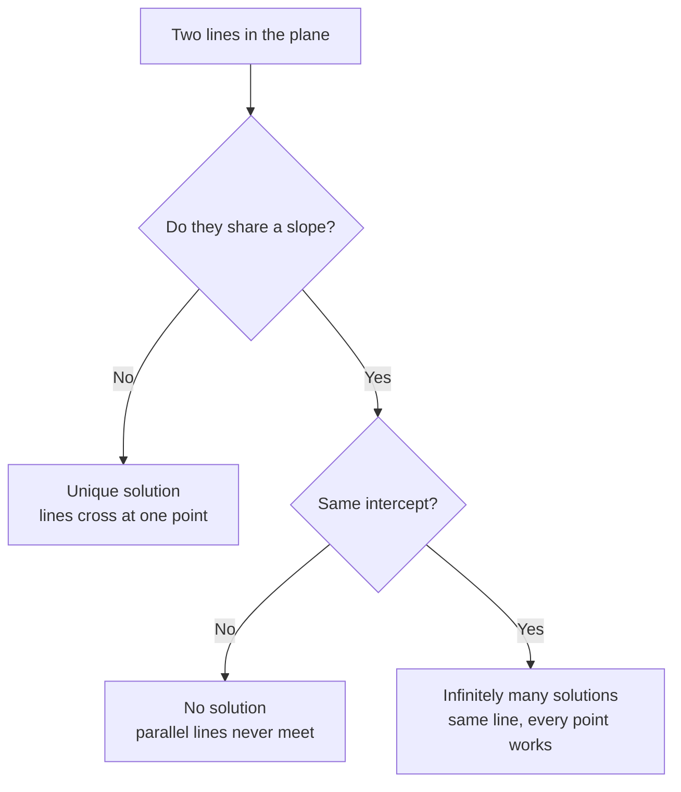
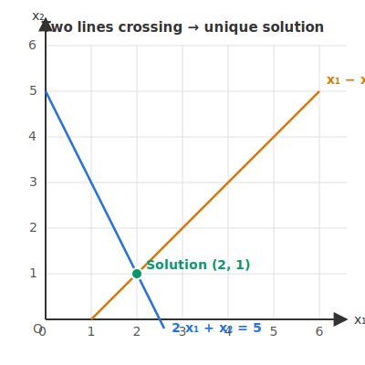
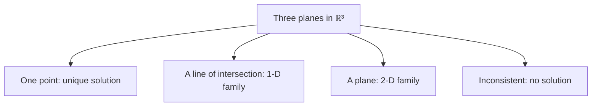

# 2 - Systems of Linear Equations

[toc]

> **TL;DR:** A system of linear equations asks: for what values of the unknowns do all equations hold simultaneously? Geometrically, each equation describes a line (in 2D) or plane (in 3D), and the solution is their intersection. Systems of linear equations are the foundational computational problem of linear algebra — every algorithm in this series is ultimately a method for characterizing or solving them.

## Vocabulary

**Unknown / variable**: The quantities we solve for. Also called indeterminates.

```math
x_1, x_2, \ldots, x_n
```

---

**Coefficient**: The scalar multiplying an unknown in an equation. In row i, column j of the coefficient matrix, this is the entry a_(ij).

```math
a_{ij}
```

---

**System of linear equations**: A collection of m equations in n unknowns where every term is of degree 1 — no squares, no products of variables, no nonlinear functions.

```math
\begin{aligned}
a_{11} x_1 + a_{12} x_2 + \cdots + a_{1n} x_n &= b_1 \\
&\;\;\vdots \\
a_{m1} x_1 + a_{m2} x_2 + \cdots + a_{mn} x_n &= b_m
\end{aligned}
```

---

**Consistent system**: A system that has at least one solution.

---

**Inconsistent system**: A system that has no solution; the geometric objects (lines, planes) do not intersect.

---

**Unique solution**: Exactly one set of values satisfies all equations; the intersection is a single point.

---

**Infinitely many solutions**: The equations are not independent enough to pin down a unique answer; the solution is a family parameterized by free variables.

---

**Coefficient matrix**: The matrix A whose entry at (i, j) is the coefficient of unknown x_j in equation i.

```math
A \in \mathbb{R}^{m \times n}
```

---

**Right-hand side vector**: The vector b of constants on the right side of each equation.

```math
\mathbf{b} \in \mathbb{R}^m
```

---

**Solution set**: The set of all vectors x that satisfy A x = b simultaneously.

```math
\{\, \mathbf{x} \in \mathbb{R}^n : A \mathbf{x} = \mathbf{b} \,\}
```

---

**Homogeneous system**: A system where the right-hand side is the zero vector. Always consistent — the zero vector is always a solution.

```math
A \mathbf{x} = \mathbf{0}
```

---

**Overdetermined system**: More equations than unknowns (m > n). Generically inconsistent, solved approximately via least-squares.

---

**Underdetermined system**: Fewer equations than unknowns (m < n). Generically has infinitely many solutions.

---

## Intuition

A system of linear equations is just a list of conditions, all of which must hold at the same time. Geometrically, *each equation is a constraint that carves out a flat shape* in the space of unknowns, and the **solution is the intersection of every constraint at once**.

### One equation in two unknowns — a line

Take a single equation in ℝ²:

```math
2 x_1 + x_2 = 5
```

This is the equation of a *line*. Infinitely many points (x₁, x₂) lie on it — pick x₁ = 0 and x₂ = 5; pick x₁ = 2 and x₂ = 1; pick x₁ = 2.5 and x₂ = 0. Every such point is a "solution" to this one equation. With only one equation, you have a 1-dimensional family of answers parameterized by where you slide along the line.

```
x₂
^
5---*                  line: 2 x₁ + x₂ = 5
|    \
4 -   \
|      \
3 -     \
|        \
2 -       \
|          \
1 -         * (2, 1)
|            \
0 ----------- *--->  x₁
0   1   2   2.5
```

### Two equations in two unknowns — intersect two lines

Add a second equation:

```math
x_1 - x_2 = 1
```

This is *another* line. Now the question becomes: *where do the two lines meet?* Three things can happen.



For our example, the lines cross at exactly (2, 1):



### Three equations in three unknowns — intersect three planes

In ℝ³, each linear equation `a x + b y + c z = d` describes a **plane**. The triple-intersection of three planes is where all three constraints hold simultaneously. The richer geometry in 3D:

- **Three planes meet at one point** → unique solution.
- **Three planes share a common line** → infinitely many solutions (a 1-D family).
- **Three planes share a common plane** → infinitely many solutions (a 2-D family).
- **Two planes are parallel, or the three planes form a triangular prism** → no solution.



> [!IMPORTANT]
> **The same three outcomes — unique, infinite, or none — extend to *every* dimension.** Whether you have 2 unknowns, 3 unknowns, or 4096 unknowns, the geometric question is always: "where do all my constraints meet?" The algebraic machinery (Gaussian elimination, rank, null space) is just bookkeeping for that intersection.

## Writing a System Formally

A general system of m equations in n unknowns looks like:

```math
\begin{aligned}
a_{11}x_1 + a_{12}x_2 + \cdots + a_{1n}x_n &= b_1 \\
a_{21}x_1 + a_{22}x_2 + \cdots + a_{2n}x_n &= b_2 \\
&\;\;\vdots \\
a_{m1}x_1 + a_{m2}x_2 + \cdots + a_{mn}x_n &= b_m
\end{aligned}
```

The subscript a_(ij) follows the universal convention that i is the equation number (row) and j is the unknown index (column). Memorise this — every matrix in the series uses it.

In compact matrix notation (developed fully in [3 - Matrices](./3-matrices.md)):

```math
A \mathbf{x} = \mathbf{b}
```

where A ∈ ℝ^(m×n), x ∈ ℝⁿ, b ∈ ℝᵐ. The entire system is captured in three symbols.

> [!IMPORTANT]
> Shape convention: A has **m rows** (one per equation) and **n columns** (one per unknown). Always check shapes before any matrix operation — dimension mismatch is the most common algebraic error in PyTorch code, NumPy code, and hand calculations alike.

### Two ways to "read" A x = b

The single equation A x = b admits two equally important interpretations, and switching between them is one of the most useful tricks in linear algebra.

**Row view:** each row of A gives one equation. Solving A x = b means finding x that satisfies *every row* simultaneously — the intersection-of-shapes picture above.

**Column view:** rewrite A x = b as a linear combination of A's columns. With A's columns labelled c₁, …, c_n:

```math
x_1 \mathbf{c}_1 + x_2 \mathbf{c}_2 + \cdots + x_n \mathbf{c}_n = \mathbf{b}
```

Now the question becomes: "can b be built as a linear combination of A's columns, and if so, with what weights x₁, …, x_n?" This *column view* is what makes the connection to the column space (in [5 - Null Space and Pseudoinverse](./5-null-space-and-pseudoinverse.md) and [9 - Basis and Rank](./9-basis-and-rank.md)) and to neural-network weight columns.

> [!TIP]
> Whenever a system has *no* solution, the column view says it cleanly: **b lies outside the span of A's columns**. Whenever a system has *infinitely many* solutions, the column view says: **there are multiple ways to combine columns to reach b**. Both insights are invisible in the row view.

## Step-by-Step Example: Two Equations, Two Unknowns

Here is a concrete system. The goal is to find x₁ and x₂.

```math
\begin{aligned}
2 x_1 + x_2 &= 5 \quad (E_1)\\
 x_1 - x_2 &= 1 \quad (E_2)
\end{aligned}
```

**Step 1 — Add the equations** to eliminate x₂. Computing (E₁) + (E₂):

```math
3 x_1 = 6 \;\;\Longrightarrow\;\; x_1 = 2
```

**Step 2 — Substitute** x₁ = 2 back into (E₂):

```math
2 - x_2 = 1 \;\;\Longrightarrow\;\; x_2 = 1
```

**Check** in both equations:

```math
2(2) + 1 = 5 \;\;\checkmark, \qquad 2 - 1 = 1 \;\;\checkmark
```

The solution is the single point (x₁, x₂) = (2, 1) — the unique intersection of the two lines we drew above.

## Three Equations, Three Unknowns

Scaling up to three unknowns reveals why we need a *systematic* method rather than clever ad hoc tricks. Consider:

```math
\begin{aligned}
 x_1 + 2 x_2 -  x_3 &= 3 \quad (E_1)\\
2 x_1 +  x_2 +  x_3 &= 7 \quad (E_2)\\
- x_1 +  x_2 + 2 x_3 &= 2 \quad (E_3)
\end{aligned}
```

The strategy is the same — eliminate variables one at a time — but the bookkeeping grows. [4 - Solving Systems of Linear Equations](./4-solving-systems-of-linear-equations.md) formalises this process as Gaussian elimination with augmented matrices, which is the algorithm that scales to any size.

## What Happens with No Solution?

Consider:

```math
\begin{aligned}
x_1 + x_2 &= 2 \\
x_1 + x_2 &= 5
\end{aligned}
```

These two lines are parallel — same left-hand side, different right-hand sides. Subtracting the first from the second gives:

```math
0 = 3
```

That is a contradiction. The system is **inconsistent**: no (x₁, x₂) satisfies both equations.

```
x₂
^
5 -*                E₁:  x₁ + x₂ = 5
|   \
4 -  \
|     \             E₂:  x₁ + x₂ = 2
3 -    \  *
|       \  \
2 -      \  \   <- two parallel lines, no intersection
|         \  \
1 -        \  \
|           \  \
0 -----------*--*--->  x₁
0   1   2   3   4   5
```

> [!WARNING]
> In ML, **overdetermined systems** (m > n) arise constantly — you have more training examples than parameters. These are almost always inconsistent: no exact solution exists. The standard response is to minimise the squared residual ‖A x − b‖² — that is ordinary **least-squares regression**, and it is exactly what `np.linalg.lstsq` does under the hood.

## What Happens with Infinitely Many Solutions?

Consider:

```math
\begin{aligned}
 x_1 + 2 x_2 &= 4 \\
2 x_1 + 4 x_2 &= 8
\end{aligned}
```

The second equation is exactly twice the first — it contains no new information. The two "lines" are actually the same line drawn twice. Any point satisfying x₁ = 4 − 2 x₂ is a solution. We can write the solution family in **parametric form**:

```math
x_1 = 4 - 2 t, \qquad x_2 = t, \qquad t \in \mathbb{R}
```

Here t is a **free variable** — it can be anything in ℝ. The solution set is the entire line, not a point. As a column it looks like:

```math
\mathbf{x} = \begin{bmatrix} 4 \\ 0 \end{bmatrix} + t \begin{bmatrix} -2 \\ 1 \end{bmatrix}
```

This is *one particular solution* (4, 0)ᵀ **plus** a multiple of *the direction (−2, 1)ᵀ*. That decomposition — particular solution + direction of free movement — is the deep structural fact about solution sets that [4 - Solving Systems of Linear Equations](./4-solving-systems-of-linear-equations.md) makes systematic.

> [!NOTE]
> Infinitely many solutions ≠ "the problem is broken." It means the problem is *underconstrained*. In ML this happens when features are perfectly collinear (one feature is always a multiple of another) — the linear model has too many degrees of freedom for the data to pin down. Regularisation (ridge, lasso) is how we break the tie.

## Real-world Example

Least-squares regression is the ubiquitous ML application of linear equation systems. A dataset with m training samples each of dimension n gives an overdetermined system A x ≈ b. NumPy's `lstsq` finds the x that minimises the squared residual:

```math
\hat{\mathbf{x}} = \arg\min_{\mathbf{x}} \|A \mathbf{x} - \mathbf{b}\|_2^2
```

```python
import numpy as np

# Fitting y = w0 + w1*x to 4 data points
# Each row of A is [1, x_i] (the "1" accounts for the intercept term)
A = np.array([
    [1, 1.0],
    [1, 2.0],
    [1, 3.0],
    [1, 4.0],
])  # shape: (4, 2)

b = np.array([2.1, 3.9, 6.1, 7.8])  # observed y values, shape: (4,)

# Solve Ax = b in the least-squares sense: minimize ||Ax - b||^2
x, residuals, rank, sv = np.linalg.lstsq(A, b, rcond=None)

print(f"w0 (intercept) = {x[0]:.4f}")
print(f"w1 (slope)     = {x[1]:.4f}")
# w0 (intercept) ≈ 0.15
# w1 (slope)     ≈ 1.93
# Fitted line: y ≈ 0.15 + 1.93*x

# Verify: this is a 4x2 system with 2 unknowns — overdetermined, no exact solution
# The residuals tell us how far the best-fit line is from the data
print(f"Rank: {rank}")   # Should be 2: full column rank
```

> [!TIP]
> The 4-row, 2-column matrix `A` above is precisely the coefficient matrix of the linear system. The `lstsq` solver is implementing the **normal equations** under the hood:
>
> ```math
> (A^\top A)\, \mathbf{x} = A^\top \mathbf{b}
> ```
>
> This is a square, smaller system whose unique solution (when A^T A is invertible) gives the best-fit x. The full derivation lives in [4 - Solving Systems of Linear Equations](./4-solving-systems-of-linear-equations.md).

## In Practice

In real ML pipelines, you almost never solve linear systems by hand — NumPy/SciPy/LAPACK handle it. But you *do* need to know:

1. **Whether a system is consistent** — if A is rank-deficient, `np.linalg.solve` raises `LinAlgError`. Understanding the geometric meaning (parallel planes, dependent rows) tells you why.
2. **When to use `solve` vs `lstsq`** — `solve` requires a square, full-rank A and gives the *exact* solution. `lstsq` handles overdetermined and underdetermined systems via the pseudoinverse (see [5 - Null Space and Pseudoinverse](./5-null-space-and-pseudoinverse.md)).
3. **Numerical conditioning** — even a "unique solution" system can be ill-conditioned: tiny changes in b cause large changes in x. The **condition number** κ(A) quantifies this sensitivity:

```math
\kappa(A) = \|A\| \cdot \|A^{-1}\| = \frac{\sigma_{\max}(A)}{\sigma_{\min}(A)}
```

A κ near 1 means the system is well-conditioned; κ ≫ 10⁶ means tiny floating-point errors get amplified into huge solution errors.

> [!NOTE]
> In deep learning, you rarely solve A x = b directly during training — you use gradient descent because A is implicitly defined by the loss landscape and changes every step. But in **linear probing**, **ridge regression**, **closed-form attention** in some efficient transformers, and **layer-norm statistics**, you absolutely do solve linear systems.

## Pitfalls

- **"More equations always means a better solution."** — More equations can mean more contradictions. An overdetermined system is generically inconsistent; more equations do not help unless they are "compatible" (rank-friendly).
- **"If I can isolate one variable, I have the solution."** — Substitution works for small systems but is not a systematic algorithm. Gaussian elimination (note 4) is the general method.
- **"A system with n equations in n unknowns always has a unique solution."** — Only when the equations are independent. Dependent equations (redundant rows, parallel planes) can still yield infinite solutions or no solution even when m = n.
- **"Free variables are mistakes."** — Free variables are structurally correct. They appear precisely when the system is underdetermined or has dependent equations. ML uses underdetermined systems deliberately (e.g., overparameterised neural networks have *many* more parameters than data).

## Exercises

### Exercise 1 — Three cases by inspection

For each system, decide whether it has a unique solution, no solution, or infinitely many. Justify geometrically.

1. 2 x + y = 3 and 4 x + 2 y = 6
2. x + y = 1 and x + y = 4
3. 3 x − y = 5 and x + 2 y = 4

#### Solution 1

Two equations in two unknowns describe two lines. Three cases come from how the lines relate.

1. **Infinitely many solutions.** The second equation is exactly the first multiplied by 2. They describe the *same* line, so every point on that line satisfies both equations.
2. **No solution.** Both lines have the same left-hand side (slope) but different right-hand sides. They are **parallel** and never meet.
3. **Unique solution.** The slopes differ (the first line has slope 3, the second slope −1/2), so the lines cross at one point. Solving: from the first equation y = 3 x − 5; substituting gives x + 2(3 x − 5) = 4, so 7 x = 14, x = 2, y = 1. The unique solution is **(2, 1)**.

### Exercise 2 — Solve by elimination

Solve the system:

```math
\begin{aligned}
 x +  y +  z &= 6 \\
2 x -  y + 3 z &= 14 \\
 x + 4 y -  z &= 2
\end{aligned}
```

#### Solution 2

Eliminate variables one at a time, top-down.

**Step 1** — eliminate x from equations 2 and 3. Compute (E₂) − 2·(E₁) and (E₃) − (E₁):

```math
\begin{aligned}
(E_2) - 2(E_1): & \quad -3 y +  z = 2 \\
(E_3) - (E_1):   & \quad  3 y - 2 z = -4
\end{aligned}
```

**Step 2** — add these two equations to eliminate y:

```math
(-3 y + z) + (3 y - 2 z) = 2 + (-4) \;\;\Longrightarrow\;\; -z = -2 \;\;\Longrightarrow\;\; z = 2
```

**Step 3** — back-substitute z = 2 into −3 y + z = 2: −3 y + 2 = 2, so y = 0.

**Step 4** — back-substitute into x + y + z = 6: x + 0 + 2 = 6, so x = 4.

**Check** in the original equations: 4 + 0 + 2 = 6 ✓, 8 − 0 + 6 = 14 ✓, 4 + 0 − 2 = 2 ✓.

The solution is **(x, y, z) = (4, 0, 2)**.

### Exercise 3 — Recognise overdetermined vs underdetermined

For each shape of A in A x = b, state whether the system is overdetermined, underdetermined, or square. Also state what *generically* happens — unique, none, or infinitely many.

1. A is 5 × 3
2. A is 2 × 7
3. A is 4 × 4
4. A is 100 × 10 (think: a regression problem)

#### Solution 3

The rule: m rows = number of equations; n columns = number of unknowns. Compare m to n.

1. **m=5, n=3 → overdetermined** (more equations than unknowns). **Generically inconsistent** — no exact solution. ML uses least-squares to find the best approximate x.
2. **m=2, n=7 → underdetermined** (more unknowns than equations). **Generically infinitely many solutions** — a 5-parameter family (7 unknowns minus 2 equations).
3. **m=4, n=4 → square.** **Generically a unique solution** — provided A is invertible (full rank). If A is rank-deficient, you get either no solution or infinitely many.
4. **m=100, n=10 → overdetermined.** This is the canonical least-squares regression shape: 100 training samples, 10 parameters. **No exact solution**; minimise ‖A x − b‖² instead. This is the bread-and-butter of linear regression.

### Exercise 4 — Particular plus homogeneous

The system A x = b has the solution set described by:

```math
\mathbf{x} = \begin{bmatrix} 1 \\ 0 \\ 3 \end{bmatrix} + t \begin{bmatrix} 2 \\ 1 \\ -1 \end{bmatrix}, \qquad t \in \mathbb{R}
```

Answer:

1. What is one particular solution?
2. What is the homogeneous direction?
3. Is the solution set a point, line, or plane?
4. Find a *different* particular solution by choosing t = 2.

#### Solution 4

The general form is (particular solution) + (any homogeneous solution).

1. **Particular solution** = (1, 0, 3)ᵀ. Set t = 0 to read it off.
2. **Homogeneous direction** = (2, 1, −1)ᵀ. This is the vector that, when added to any solution, produces another solution. It satisfies A · (2, 1, −1)ᵀ = 0 — it lies in the **null space** of A (note 5).
3. The solution set is a **line** in ℝ³. The parameter t sweeps through ℝ, tracing the line through (1, 0, 3) in the direction (2, 1, −1).
4. With t = 2: x = (1, 0, 3) + 2·(2, 1, −1) = **(5, 2, 1)**. This is just as valid a "particular solution" as (1, 0, 3) — the choice of particular solution is not unique.

> [!IMPORTANT]
> Exercise 4 shows the **affine structure** of the solution set: one anchor point (the particular solution) + a direction of free movement (the homogeneous part). This decomposition is the topic of note 4 and the foundation for the null space in note 5.

## Sources

- Deisenroth, M. P., Faisal, A. A., & Ong, C. S. (2020). *Mathematics for Machine Learning*. Chapter 2.1. https://mml-book.github.io/
- Strang, G. MIT 18.06 Lecture 2: Elimination with Matrices. https://ocw.mit.edu/courses/18-06-linear-algebra-spring-2010/
- 3Blue1Brown. *Linear combinations, span, and basis vectors* (Essence of Linear Algebra, video 2). https://www.youtube.com/watch?v=k7RM-ot2NWY

## Related

- [1 - What is Linear Algebra](./1-what-is-linear-algebra.md)
- [3 - Matrices](./3-matrices.md)
- [4 - Solving Systems of Linear Equations](./4-solving-systems-of-linear-equations.md)
- [5 - Null Space and Pseudoinverse](./5-null-space-and-pseudoinverse.md)
