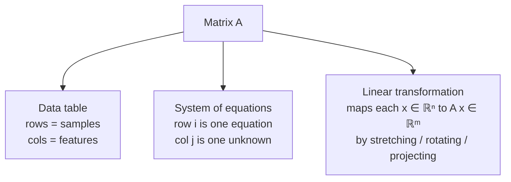
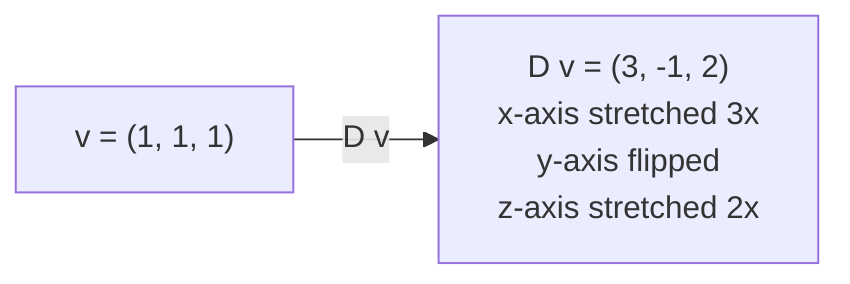
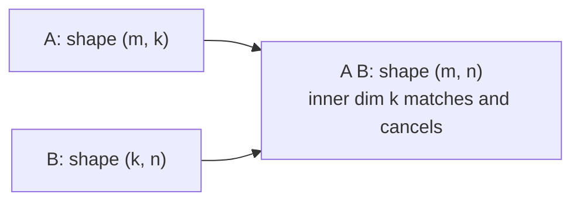

# 3 - Matrices

[toc]

> **TL;DR:** A matrix is a rectangular grid of numbers that compactly encodes a linear transformation, a dataset, or a system of equations. Matrix operations — addition, scalar multiplication, multiplication, and transpose — are the arithmetic of linear algebra and the literal operations executed by every GPU kernel in deep learning. This note covers the full catalog of matrix operations and their properties, with special attention to what non-commutativity means geometrically.

## Vocabulary

**Matrix**: A rectangular array of scalars with m rows and n columns. The entry in row i, column j is written a_(ij).

```math
A \in \mathbb{R}^{m \times n}
```

---

**Row vector**: A matrix with one row; a vector written horizontally.

```math
\mathbf{a}^\top \in \mathbb{R}^{1 \times n}
```

---

**Column vector**: A matrix with one column; the default orientation for vectors in this series.

```math
\mathbf{a} \in \mathbb{R}^{m \times 1}
```

---

**Square matrix**: Same number of rows and columns.

```math
A \in \mathbb{R}^{n \times n}
```

---

**Diagonal matrix**: A square matrix where every off-diagonal entry is zero; only the main diagonal can be nonzero.

```math
D = \begin{bmatrix} d_1 & & \\ & \ddots & \\ & & d_n \end{bmatrix}
```

---

**Identity matrix**: The diagonal matrix with all diagonal entries equal to 1. Multiplying by it leaves any matrix unchanged.

```math
I_n A = A I_n = A
```

---

**Zero matrix**: All entries are zero; the additive identity of the matrix space.

```math
\mathbf{0} \in \mathbb{R}^{m \times n}
```

---

**Transpose**: Swap rows and columns. The (i, j) entry of A^T is the (j, i) entry of A.

```math
A^\top \in \mathbb{R}^{n \times m}, \quad (A^\top)_{ij} = A_{ji}
```

---

**Symmetric matrix**: A square matrix equal to its own transpose. All Gram matrices A^T A are symmetric.

```math
A = A^\top
```

---

**Inverse matrix**: For a square non-singular A, the matrix A^(-1) for which both products with A give the identity.

```math
A A^{-1} = A^{-1} A = I_n
```

---

**Hadamard product**: Element-wise multiplication. Requires both matrices to have the same shape.

```math
(A \odot B)_{ij} = a_{ij}\, b_{ij}
```

---

**Matrix multiplication**: A linear combination of columns. The inner dimensions must match.

```math
(AB)_{ij} = \sum_k a_{ik}\, b_{kj}
```

---

**Scalar multiplication**: Multiply every entry of A by a scalar c.

```math
(cA)_{ij} = c \cdot a_{ij}
```

---

**Non-singular (invertible) matrix**: A square matrix whose inverse exists; equivalently, whose determinant is nonzero.

---

## Intuition

A matrix is three things at once. Mastering the *switch* between these views is the single biggest leap in linear algebra fluency.

1. **A data table** — the matrix X with shape (m, n) where row i is the i-th training example with n features. You have seen this in pandas DataFrames.
2. **A system of equations** — the coefficient matrix A from [2 - Systems of Linear Equations](./2-systems-of-linear-equations.md), collecting all coefficients in a grid.
3. **A linear transformation** — the map x ↦ A x that stretches, rotates, projects, or otherwise reshapes the input space. This is the deepest interpretation and the lens we will return to constantly in [10 - Linear Mappings](./10-linear-mappings.md) and [11 - Matrix Representation of Linear Mappings](./11-matrix-representation-of-linear-mappings.md).



These three views are genuinely the same object — the power of matrix notation is that the symbol A simultaneously plays all three roles. The same numerical entries do all three jobs.

The geometric "transformation" view is the most visual. The figure below shows what `A = [[2, 1], [1, 2]]` does to the unit square: the basis vectors e₁ and e₂ get mapped to the **columns of A** (which are (2, 1) and (1, 2)), and the unit square gets sheared into a parallelogram.

![The matrix A = [[2, 1], [1, 2]] mapping the unit square to a sheared parallelogram; e₁ → first column of A, e₂ → second column of A](./assets/3-matrices/matrix-transforms-unit-square.svg)

> [!IMPORTANT]
> When you read ML code, every `nn.Linear(in_features, out_features)` is creating a matrix of shape `(out, in)`. That matrix is both **a transformation** (multiply input by it during forward pass), **a set of equations** (gradient = the system whose solution updates weights), and **a data table** (each row is an output neuron's "perspective" on the input). Switching views fluently is what separates a beginner from a fluent practitioner.

## Matrix Notation and Indexing

A matrix A with shape (m, n) is written with entries arranged in rows and columns. The first subscript is always the row, the second is always the column:

```math
A = \begin{bmatrix}
a_{11} & a_{12} & \cdots & a_{1n} \\
a_{21} & a_{22} & \cdots & a_{2n} \\
\vdots & \vdots & \ddots & \vdots \\
a_{m1} & a_{m2} & \cdots & a_{mn}
\end{bmatrix}
```

For example, a 2 × 3 matrix:

```math
A = \begin{bmatrix} 1 & 2 & 3 \\ 4 & 5 & 6 \end{bmatrix}
```

Here a₁₂ = 2 (row 1, column 2) and a₂₁ = 4 (row 2, column 1). The two entries differ — *order of subscripts matters absolutely*.

> [!IMPORTANT]
> **In math, indexing starts at 1. In Python/NumPy/PyTorch, indexing starts at 0.** The entry a₁₂ in math is `A[0, 1]` in NumPy. Both traditions appear in the same codebases all the time. Stay conscious of which you are using — translating mentally is required for reading papers while writing code.

## Special Matrices

Several matrices appear so frequently that they have names worth memorizing.

### Identity Matrix

The identity matrix Iₙ is the matrix equivalent of the number 1 — multiplying by it changes nothing. It has 1s on the main diagonal and 0s everywhere else:

```math
I_3 = \begin{bmatrix} 1 & 0 & 0 \\ 0 & 1 & 0 \\ 0 & 0 & 1 \end{bmatrix}
```

For any matrix A with shape (m, n): I_m A = A and A Iₙ = A. Note that I_m left-multiplies (size matches A's rows) while Iₙ right-multiplies (size matches A's columns).

Geometrically, the identity matrix is the *do-nothing* transformation: every point in ℝⁿ maps to itself.

### Diagonal Matrix

A diagonal matrix only has nonzero entries on the main diagonal. It scales each dimension independently:

```math
D = \begin{bmatrix} 3 & 0 & 0 \\ 0 & -1 & 0 \\ 0 & 0 & 2 \end{bmatrix}
```

Multiplying a vector by D stretches its first component by 3, flips the second, and stretches the third by 2. Geometrically, D rescales each coordinate axis independently — no rotation, no shearing, just scale per-axis.



Diagonal matrices appear in **singular value decomposition (SVD)**, **batch-normalisation scaling**, and any setting where per-axis weights are explicit.

### Zero Matrix

The zero matrix has all entries equal to zero. It is the additive identity:

```math
A + \mathbf{0} = A
```

Geometrically, the zero matrix is the **collapse-everything-to-the-origin** transformation. Whatever you give it, you get back the zero vector.

## Matrix Operations

### Addition and Scalar Multiplication

Matrix addition is defined only when the two matrices have the same shape. It is performed entry-wise:

```math
(A + B)_{ij} = a_{ij} + b_{ij}
```

Scalar multiplication scales every entry:

```math
(c A)_{ij} = c \cdot a_{ij}
```

Both operations are commutative and associative. This means matrices under addition form a vector space (formalised in [7 - Vector Spaces](./7-vector-spaces.md)). The rules feel identical to adding and scaling numbers — because under addition, matrices *behave* like a generalised kind of number.

### Transpose

The transpose Aᵀ flips a matrix along its main diagonal: rows become columns and columns become rows. If A has shape (m, n), then Aᵀ has shape (n, m).

```math
\text{If}\;\; A = \begin{bmatrix} 1 & 2 & 3 \\ 4 & 5 & 6 \end{bmatrix},\;\; \text{then}\;\; A^\top = \begin{bmatrix} 1 & 4 \\ 2 & 5 \\ 3 & 6 \end{bmatrix}
```

Key transpose identities you will use constantly:

```math
(A^\top)^\top = A
```

```math
(A + B)^\top = A^\top + B^\top
```

```math
(A B)^\top = B^\top A^\top
```

The last identity is critical: **the transpose of a product reverses the order**. Forgetting this reversal is one of the most frequent sources of shape errors in PyTorch code.

> [!WARNING]
> If you find yourself writing `A.T @ B.T` and "knowing" the answer should be `(A @ B).T`, **stop and verify**. The identity says (A B)ᵀ = Bᵀ Aᵀ. The order *flips* — A becomes the right factor, B becomes the left factor. The same flip applies to inverses: (A B)⁻¹ = B⁻¹ A⁻¹.

### Matrix Multiplication

Matrix multiplication is the most important operation in linear algebra and the most important computation in deep learning. Two matrices A with shape (m, k) and B with shape (k, n) can be multiplied to give C = A B with shape (m, n). **The inner dimension k must match.**



Each entry of C is a dot product between a row of A and a column of B:

```math
c_{ij} = \sum_{\ell=1}^{k} a_{i\ell}\, b_{\ell j}
```

A concrete 2 × 2 example:

```math
\begin{bmatrix} 1 & 2 \\ 3 & 4 \end{bmatrix}
\begin{bmatrix} 5 & 6 \\ 7 & 8 \end{bmatrix}
=
\begin{bmatrix} 1 \cdot 5 + 2 \cdot 7 & 1 \cdot 6 + 2 \cdot 8 \\ 3 \cdot 5 + 4 \cdot 7 & 3 \cdot 6 + 4 \cdot 8 \end{bmatrix}
=
\begin{bmatrix} 19 & 22 \\ 43 & 50 \end{bmatrix}
```

#### Why matrix multiplication is defined that way

The formula looks arbitrary until you realise it is *composition of linear transformations*. If A represents one transformation and B represents another, then A B represents "apply B first, then A." The reason rows-dot-columns is the right rule is that this is *exactly* the bookkeeping needed for "first transform the input by B, then transform that intermediate result by A." If you ever wonder "why this formula?" — that is the answer.

> [!IMPORTANT]
> **Matrix multiplication is composition.** Reading A B = C as "do B, then do A" is the geometric interpretation. It also explains immediately why **A B ≠ B A in general**: doing "rotate then stretch" is not the same as doing "stretch then rotate."

#### Non-commutativity

```math
A B \neq B A \quad \text{(in general)}
```

Even when both products are defined (which requires A and B square of the same size), they typically give different results. Concrete example:

```math
\begin{bmatrix} 1 & 2 \\ 3 & 4 \end{bmatrix} \begin{bmatrix} 5 & 6 \\ 7 & 8 \end{bmatrix} = \begin{bmatrix} 19 & 22 \\ 43 & 50 \end{bmatrix}
```

```math
\begin{bmatrix} 5 & 6 \\ 7 & 8 \end{bmatrix} \begin{bmatrix} 1 & 2 \\ 3 & 4 \end{bmatrix} = \begin{bmatrix} 23 & 34 \\ 31 & 46 \end{bmatrix}
```

Same matrices, different orders, completely different results. This is the **single most important difference** between matrix arithmetic and scalar arithmetic.

**Properties of matrix multiplication:**

| Property | Formula | What it means |
| :--- | :--- | :--- |
| Associativity | (A B) C = A (B C) | Grouping does not matter — but order does. |
| Distributivity | A (B + C) = A B + A C | Multiplication distributes over addition. |
| Scalar compatibility | (c A) B = c (A B) | Scalars commute freely with matrices. |
| Transpose reversal | (A B)ᵀ = Bᵀ Aᵀ | Order flips when you transpose a product. |
| **Non-commutativity** | A B ≠ B A | **No commutativity** — order matters. |

### Hadamard Product

The Hadamard product A ⊙ B (also called the **element-wise product**) multiplies corresponding entries:

```math
(A \odot B)_{ij} = a_{ij}\, b_{ij}
```

Both matrices must have identical shape. Unlike regular matrix multiplication, it **is** commutative: A ⊙ B = B ⊙ A.

> [!NOTE]
> In PyTorch, `A * B` is the **Hadamard** product and `A @ B` is **matrix** multiplication. In the attention mechanism, the **mask** is applied as a Hadamard operation; the **attention scores** are computed via matrix multiplication. Confusing the two gives silently wrong results — the code runs, but the numerics are garbage.

### Inverse Matrix

For a square matrix A of size (n, n), the **inverse** A⁻¹ (if it exists) satisfies:

```math
A A^{-1} = A^{-1} A = I_n
```

The inverse exists if and only if A is **non-singular** — equivalently, A has full rank, equivalently, det A ≠ 0, equivalently, the columns of A are linearly independent (see [8 - Linear Independence](./8-linear-independence.md)). Many equivalent conditions, all the same thing.

```math
(A B)^{-1} = B^{-1} A^{-1}
```

Order reverses, just like transpose. Geometrically, A⁻¹ is the "undo" transformation: it sends every output A x back to its original input x. If A rotates 30°, A⁻¹ rotates −30°. If A stretches by 5, A⁻¹ shrinks by 5.

> [!CAUTION]
> Not every matrix has an inverse. A matrix that collapses dimensions — say, projecting ℝ³ onto an xy-plane — **destroys information**. You cannot un-project; an entire z-axis is gone. Such matrices are *singular*, and `np.linalg.inv` will raise `LinAlgError`. The pseudoinverse ([5 - Null Space and Pseudoinverse](./5-null-space-and-pseudoinverse.md)) gives the best fallback when the true inverse does not exist.

## Math: Properties Summary

The full property table for matrix operations:

```math
\begin{aligned}
A + B &= B + A &\text{(addition is commutative)} \\
(A + B) + C &= A + (B + C) &\text{(addition is associative)} \\
(A B) C &= A (B C) &\text{(multiplication is associative)} \\
A (B + C) &= A B + A C &\text{(left distributive)} \\
(A + B) C &= A C + B C &\text{(right distributive)} \\
(A B)^{-1} &= B^{-1} A^{-1} &\text{(inverse reverses order)} \\
(A B)^\top &= B^\top A^\top &\text{(transpose reverses order)}
\end{aligned}
```

## Real-world Example

Here is a complete NumPy demonstration of every matrix operation from this note, with shapes labeled. In ML, you perform these operations thousands of times per training step — getting the shapes right is non-negotiable.

```python
import numpy as np

# ----- Define two matrices -----
A = np.array([[1, 2, 3],
              [4, 5, 6]])   # shape: (2, 3)

B = np.array([[7, 8, 9],
              [1, 2, 3]])   # shape: (2, 3)

# ----- Addition (same shape required) -----
C = A + B                   # shape: (2, 3)
print("A + B:\n", C)
# [[8, 10, 12], [5, 7, 9]]

# ----- Scalar multiplication -----
D = 2 * A                   # shape: (2, 3)
print("2*A:\n", D)

# ----- Transpose -----
print("A^T shape:", A.T.shape)   # (3, 2)

# ----- Matrix multiplication: (2,3) @ (3,2) -> (2,2) -----
E = A @ A.T                  # shape: (2, 2) — a Gram matrix, always symmetric
print("A @ A^T:\n", E)
# [[14, 32], [32, 77]]  — symmetric!

# ----- Non-commutativity demo -----
M = np.array([[1, 2], [3, 4]])
N = np.array([[5, 6], [7, 8]])
print("MN:\n", M @ N)        # [[19, 22], [43, 50]]
print("NM:\n", N @ M)        # [[23, 34], [31, 46]]
# MN != NM

# ----- Hadamard (element-wise) product -----
P = np.array([[1, 2], [3, 4]])
Q = np.array([[5, 0], [1, 2]])
print("Hadamard P*Q:\n", P * Q)   # [[5, 0], [3, 8]]

# ----- Identity matrix -----
I = np.eye(3)               # 3x3 identity
print("I @ A:\n", I @ A.T)  # same as A.T

# ----- Inverse (square matrix only) -----
M_inv = np.linalg.inv(M)
print("M^-1:\n", M_inv)
print("M @ M^-1:\n", np.round(M @ M_inv, 6))  # Should be identity
```

> [!TIP]
> The **Gram matrix** Aᵀ A (or `A.T @ A` in NumPy) appears everywhere in ML: in the normal equations for linear regression, in the kernel trick, in the attention mechanism as Q Kᵀ. It is always square, and always **symmetric positive semi-definite** — properties that are geometrically meaningful (the connection to projection lives in [9 - Basis and Rank](./9-basis-and-rank.md)).

## In Practice

In deep learning, matrix multiplication is the dominant operation. An entire forward pass through a transformer is essentially a sequence of matrix multiplications, each one implemented as a **GEMM** (General Matrix Multiply) call to cuBLAS on the GPU. The shape of every tensor flowing through a model can be tracked as a sequence of (m, k) × (k, n) → (m, n) operations.

Understanding transpose behaviour is critical for debugging PyTorch code. A common error pattern: you write `A @ B` expecting shape `(m, n)` but get `(m, m)` — meaning either B's shape was transposed from what you expected, or you have the operands reversed. **The fix is always to check shapes before the `@` operator.**

> [!CAUTION]
> Calling `np.linalg.inv(A)` on a near-singular matrix (condition number κ(A) ≫ 10⁶) gives a numerically useless result that passes **no error**. In practice, use `np.linalg.lstsq`, or add L2 regularisation to the Gram matrix before inverting:
>
> ```math
> (A^\top A + \lambda I)^{-1}
> ```
>
> The regularised matrix is always well-conditioned when λ > 0. This is the algorithm under ridge regression and many "stable inverse" tricks in deep learning.

## Pitfalls

- **"A B is undefined when the shapes don't match."** — Technically the product A B with A of shape (m, k) and B of shape (ℓ, n) is undefined when k ≠ ℓ. NumPy raises a `ValueError`; PyTorch raises a `RuntimeError`. Always track (m, k) × (k, n) → (m, n).
- **"(A B)ᵀ = Aᵀ Bᵀ."** — Wrong: it is (A B)ᵀ = Bᵀ Aᵀ. The order **reverses**. Same flip for inverses: (A B)⁻¹ = B⁻¹ A⁻¹.
- **"The identity matrix is just for theoretical proofs."** — `torch.eye(n)` is used in production code to initialise weight matrices (orthogonal init), to regularise (A + λI), to test numerical stability, and to compute Jacobians. It is intensely practical.
- **"Hadamard product and matrix product are interchangeable."** — They are completely different operations with completely different geometric meanings. Hadamard is used for **masking**, **gating** (LSTM, GRU), and **element-wise activation**. Matrix product is used for **projections** and **transformations**.
- **"A square matrix always has an inverse."** — False. Singular matrices (e.g. one with a zero row, or two identical rows, or rank < n) have no inverse. The geometric reason: the transformation collapses dimensions and you cannot un-collapse them.

## Exercises

### Exercise 1 — Compute a matrix product by hand

Compute A B where

```math
A = \begin{bmatrix} 1 & 2 \\ 3 & 4 \end{bmatrix}, \qquad B = \begin{bmatrix} 0 & 1 \\ -1 & 2 \end{bmatrix}
```

Then compute B A and verify the result is different. State what shape rule you applied.

#### Solution 1

Both A and B are 2 × 2, so the inner dimensions (the 2 in A and the 2 in B) match — the products are defined and have shape 2 × 2.

Each entry (A B)_(ij) = (row i of A) · (column j of B):

```math
A B = \begin{bmatrix} 1·0 + 2·(-1) & 1·1 + 2·2 \\ 3·0 + 4·(-1) & 3·1 + 4·2 \end{bmatrix} = \begin{bmatrix} -2 & 5 \\ -4 & 11 \end{bmatrix}
```

```math
B A = \begin{bmatrix} 0·1 + 1·3 & 0·2 + 1·4 \\ -1·1 + 2·3 & -1·2 + 2·4 \end{bmatrix} = \begin{bmatrix} 3 & 4 \\ 5 & 6 \end{bmatrix}
```

**A B ≠ B A.** The entries differ in every position. This is the canonical demonstration that matrix multiplication is **not commutative**.

### Exercise 2 — Transpose properties

Given A and B as in Exercise 1, verify the identity (A B)ᵀ = Bᵀ Aᵀ by computing both sides.

#### Solution 2

From Exercise 1, A B = `[[-2, 5], [-4, 11]]`. Take the transpose by flipping rows and columns:

```math
(A B)^\top = \begin{bmatrix} -2 & -4 \\ 5 & 11 \end{bmatrix}
```

Now compute Bᵀ Aᵀ:

```math
A^\top = \begin{bmatrix} 1 & 3 \\ 2 & 4 \end{bmatrix}, \qquad B^\top = \begin{bmatrix} 0 & -1 \\ 1 & 2 \end{bmatrix}
```

```math
B^\top A^\top = \begin{bmatrix} 0·1 + (-1)·2 & 0·3 + (-1)·4 \\ 1·1 + 2·2 & 1·3 + 2·4 \end{bmatrix} = \begin{bmatrix} -2 & -4 \\ 5 & 11 \end{bmatrix}
```

The two results match. ✓ Notice that **the order flipped**: (A B)ᵀ becomes Bᵀ Aᵀ, not Aᵀ Bᵀ. This is the most-forgotten identity in linear algebra — drill it in.

### Exercise 3 — Hadamard vs matrix product

Given

```math
A = \begin{bmatrix} 1 & 2 \\ 3 & 4 \end{bmatrix}, \qquad B = \begin{bmatrix} 2 & 0 \\ 1 & -1 \end{bmatrix}
```

compute both A ⊙ B (Hadamard / element-wise) and A B (matrix multiplication). State what each one geometrically *means* in an ML context.

#### Solution 3

**Hadamard A ⊙ B** — multiply corresponding entries:

```math
A \odot B = \begin{bmatrix} 1·2 & 2·0 \\ 3·1 & 4·(-1) \end{bmatrix} = \begin{bmatrix} 2 & 0 \\ 3 & -4 \end{bmatrix}
```

**Matrix multiplication A B** — rows-of-A dot columns-of-B:

```math
A B = \begin{bmatrix} 1·2 + 2·1 & 1·0 + 2·(-1) \\ 3·2 + 4·1 & 3·0 + 4·(-1) \end{bmatrix} = \begin{bmatrix} 4 & -2 \\ 10 & -4 \end{bmatrix}
```

**ML meanings:**

- **Hadamard ⊙** is used for **masking** (zero out positions, e.g. attention masks), **gating** (LSTM/GRU gates), and **element-wise activations**. PyTorch: `A * B`.
- **Matrix product** is used for **linear transformations**: every fully connected layer, every Q Kᵀ score in attention, every projection in PCA. PyTorch: `A @ B`.

Confusing the two gives **silently wrong** code that still runs. Always know which operator you mean.

### Exercise 4 — Identity, inverse, sanity check

Let

```math
A = \begin{bmatrix} 2 & 1 \\ 1 & 1 \end{bmatrix}
```

Answer:

1. Compute det A.
2. Is A invertible? If yes, compute A⁻¹.
3. Verify that A A⁻¹ = I.

#### Solution 4

1. **det A** = 2·1 − 1·1 = **1**. The determinant is nonzero, so A is invertible.
2. **A⁻¹** — for a 2 × 2 matrix [[a, b], [c, d]] with det = ad − bc, the inverse is (1/det) · [[d, −b], [−c, a]]:

```math
A^{-1} = \frac{1}{1} \begin{bmatrix} 1 & -1 \\ -1 & 2 \end{bmatrix} = \begin{bmatrix} 1 & -1 \\ -1 & 2 \end{bmatrix}
```

3. **Verify** A A⁻¹ = I:

```math
A A^{-1} = \begin{bmatrix} 2 & 1 \\ 1 & 1 \end{bmatrix} \begin{bmatrix} 1 & -1 \\ -1 & 2 \end{bmatrix} = \begin{bmatrix} 2·1 + 1·(-1) & 2·(-1) + 1·2 \\ 1·1 + 1·(-1) & 1·(-1) + 1·2 \end{bmatrix} = \begin{bmatrix} 1 & 0 \\ 0 & 1 \end{bmatrix} = I \;\checkmark
```

The inverse "undoes" A — applying A then A⁻¹ leaves every vector unchanged.

### Exercise 5 — Shape detective

For each operation, predict the output shape (or "undefined").

Let A be (3, 4), B be (4, 5), C be (3, 5), D be (5, 3), E be (4, 4).

1. A B
2. A C
3. B D
4. Aᵀ C
5. E E
6. A ⊙ C

#### Solution 5

Rule for A B: inner dims must match — (m, k) × (k, n) → (m, n). For Hadamard, shapes must be identical.

1. **A B**: (3, 4) × (4, 5) → **(3, 5)** ✓ inner dim 4 matches.
2. **A C**: (3, 4) × (3, 5) → **undefined** ✗ inner dim 4 ≠ 3.
3. **B D**: (4, 5) × (5, 3) → **(4, 3)** ✓ inner dim 5 matches.
4. **Aᵀ C**: Aᵀ is (4, 3). (4, 3) × (3, 5) → **(4, 5)** ✓.
5. **E E**: (4, 4) × (4, 4) → **(4, 4)** ✓.
6. **A ⊙ C**: (3, 4) ⊙ (3, 5) → **undefined** ✗ shapes don't match exactly.

> [!TIP]
> Whenever a PyTorch error says "size mismatch," recreate the shape table above mentally. The fix is almost always a missing transpose or a reversed operand order.

## Sources

- Deisenroth, M. P., Faisal, A. A., & Ong, C. S. (2020). *Mathematics for Machine Learning*. Chapter 2.2. https://mml-book.github.io/
- Strang, G. MIT 18.06 Lectures 1–3. https://ocw.mit.edu/courses/18-06-linear-algebra-spring-2010/
- 3Blue1Brown. *Matrix multiplication as composition* (Essence of Linear Algebra, video 4). https://www.youtube.com/watch?v=XkY2DOUCWMU

## Related

- [1 - What is Linear Algebra](./1-what-is-linear-algebra.md)
- [2 - Systems of Linear Equations](./2-systems-of-linear-equations.md)
- [4 - Solving Systems of Linear Equations](./4-solving-systems-of-linear-equations.md)
- [5 - Null Space and Pseudoinverse](./5-null-space-and-pseudoinverse.md)
- [7 - Vector Spaces](./7-vector-spaces.md)
- [10 - Linear Mappings](./10-linear-mappings.md)
- [11 - Matrix Representation of Linear Mappings](./11-matrix-representation-of-linear-mappings.md)
