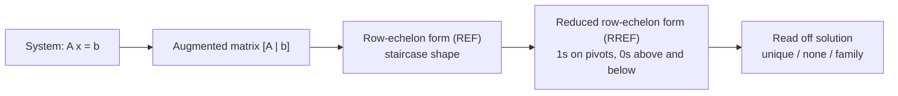
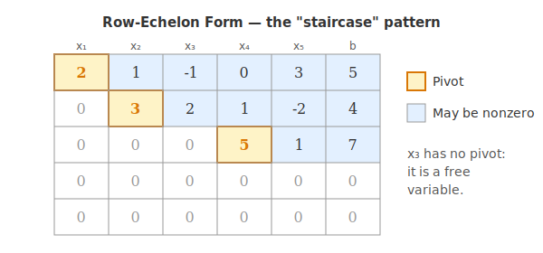
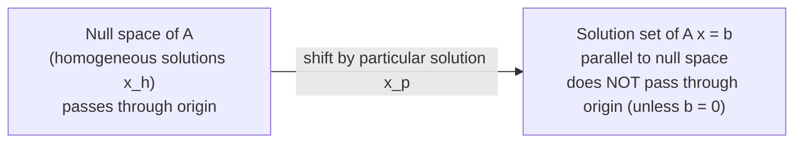

# 4 - Solving Systems of Linear Equations

[toc]

> **TL;DR:** Gaussian elimination is the universal algorithm for solving A x = b. By writing the system as an augmented matrix $[\,A \mid \mathbf{b}\,]$ and applying three elementary row operations, we drive the matrix into reduced row-echelon form (RREF). The RREF reveals everything — whether a solution exists, whether it is unique, and what the full family of solutions looks like.

## Vocabulary

**Augmented matrix**: The coefficient matrix A with the right-hand side b appended as an extra column. A complete record of the system on one piece of paper.

```math
[\,A \mid \mathbf{b}\,]
```

---

**Elementary row operations**: Three reversible operations on rows — (1) swap two rows, (2) multiply a row by a nonzero scalar, (3) add a scalar multiple of one row to another. These never change the solution set.

```math
R_i \leftrightarrow R_j, \qquad R_i \to c\, R_i, \qquad R_i \to R_i + c\, R_j
```

---

**Row-echelon form (REF)**: A matrix where each row's leading nonzero entry (the *pivot*) is strictly to the right of the pivot above it, and rows of all zeros are at the bottom.

---

**Reduced row-echelon form (RREF)**: REF plus two stricter conditions — every pivot equals 1, and every pivot is the only nonzero entry in its column.

---

**Pivot (leading 1)**: The leftmost nonzero entry of a nonzero row in (R)REF. The column it sits in is called a *pivot column*.

---

**Free variable**: A variable whose column has no pivot. It can take any real value, and the other variables are expressed in terms of it.

---

**Basic (leading) variable**: A variable whose column has a pivot. Its value is determined once the free variables are chosen.

---

**Particular solution**: Any single vector that satisfies A x = b.

```math
\mathbf{x}_p
```

---

**General solution**: The particular solution plus every solution of the homogeneous system A x = 0.

```math
\mathbf{x} = \mathbf{x}_p + \mathbf{x}_h, \quad A \mathbf{x}_h = \mathbf{0}
```

---

**Gaussian elimination**: The forward phase — use elementary row operations to drive the augmented matrix into REF.

---

**Gauss–Jordan elimination**: Gaussian elimination plus a backward phase that produces full RREF.

---

**Back-substitution**: Once in REF, solve from the bottom row upward, substituting known values into the rows above.

---

## Intuition

Solving A x = b by hand for a 50 × 50 system is impossible — but solving it for a 2 × 2 system is easy because you can just stare at it. **Gaussian elimination is the bridge:** a mechanical procedure that turns a hard system into a sequence of trivial ones by zeroing out coefficients one at a time. Each elementary row operation preserves the solution set, so the final easy system has the *same* solutions as the original hard system.

The mental picture: you are taking the augmented matrix and slowly grinding it into a **staircase shape**. Once it is a staircase (REF), the bottom row solves one variable, the row above solves another given the first, and so on up the staircase. RREF takes this one step further — once you reach RREF the answer is sitting in the rightmost column, no back-substitution needed.



> [!IMPORTANT]
> **Every elementary row operation preserves the solution set.** Swapping rows reorders equations, scaling multiplies a whole equation by a nonzero constant, and adding a multiple of one row to another combines two equations into a new (equivalent) constraint. None of these operations changes *which* (x₁, …, x_n) satisfy the system. That invariance is the whole reason elimination works.

## The Augmented Matrix

The augmented matrix is just A with b pasted on as an extra column, separated by a vertical bar for readability. The bar is bookkeeping — it reminds you which column is the right-hand side, not the coefficient of a new variable. For the system

```math
\begin{aligned}
2 x_1 + x_2 - x_3 &= 8 \\
-3 x_1 - x_2 + 2 x_3 &= -11 \\
-2 x_1 + x_2 + 2 x_3 &= -3
\end{aligned}
```

the augmented matrix is

```math
[\,A \mid \mathbf{b}\,] =
\left[\begin{array}{rrr|r}
2 & 1 & -1 & 8 \\
-3 & -1 & 2 & -11 \\
-2 & 1 & 2 & -3
\end{array}\right]
```

Every elementary row operation now acts on *entire rows, including the right-hand side*. That coupling is precisely why the solution set is preserved.

## The Three Elementary Row Operations

These are the only operations Gaussian elimination uses. Each one is **reversible**, which is what guarantees the solution set never changes.

| # | Operation | Notation | Effect |
| :--- | :--- | :--- | :--- |
| 1 | Swap two rows | R_i ↔ R_j | Reorders equations |
| 2 | Scale a row by c ≠ 0 | R_i → c R_i | Multiplies an equation by a nonzero constant |
| 3 | Add a multiple of one row to another | R_i → R_i + c R_j | Replaces an equation with a combination |

> [!WARNING]
> Operation 2 requires c ≠ 0. Multiplying a row by zero destroys an equation — that is *not* a reversible operation, and it *changes* the solution set. The same restriction is why "divide a row by zero" is never a legal step.

## Row-Echelon Form

A matrix is in **row-echelon form (REF)** when it looks like a staircase descending to the right. Formally, three conditions must hold:

1. Any rows consisting entirely of zeros are at the bottom.
2. The first nonzero entry of each nonzero row (its *pivot*) is strictly to the right of the pivot of the row above.
3. All entries below a pivot are zero.

A REF matrix looks like (with pivots shown in bold):

```math
\left[\begin{array}{rrrr|r}
\mathbf{2} & 1 & -1 & 0 & 8 \\
0 & \mathbf{1} & 3 & 2 & -1 \\
0 & 0 & 0 & \mathbf{5} & 4 \\
0 & 0 & 0 & 0 & 0
\end{array}\right]
```

Columns 1, 2, 4 are *pivot columns*. Column 3 has no pivot — that means x₃ will be a **free variable** in the solution.

Visualised as a colour-coded staircase (golden = pivot; pale blue = may be nonzero; grey = forced to zero):



## Reduced Row-Echelon Form

**RREF** adds two stronger conditions to REF:

4. Every pivot equals exactly 1.
5. Every column containing a pivot has zeros everywhere else (above the pivot, not just below).

RREF is **unique** for a given matrix — every other form you can reach by row operations is non-canonical, but RREF is one specific matrix. That uniqueness is what makes it the canonical form.

```math
\text{RREF: }
\left[\begin{array}{rrrr|r}
\mathbf{1} & 0 & 2 & 0 & 3 \\
0 & \mathbf{1} & 3 & 0 & -1 \\
0 & 0 & 0 & \mathbf{1} & 4 \\
0 & 0 & 0 & 0 & 0
\end{array}\right]
```

You can read the solution off this directly:

```math
x_1 + 2 x_3 = 3, \qquad x_2 + 3 x_3 = -1, \qquad x_4 = 4, \qquad x_3 \text{ free}
```

In parametric form (with t = x₃):

```math
\mathbf{x} = \begin{bmatrix} 3 \\ -1 \\ 0 \\ 4 \end{bmatrix} + t \begin{bmatrix} -2 \\ -3 \\ 1 \\ 0 \end{bmatrix}
```

That is one **particular solution** plus a multiple of one **homogeneous direction** — exactly the decomposition we develop in the next section.

## Gaussian Elimination — Step by Step

We will fully solve the system from the augmented matrix above. The strategy is: produce zeros below each pivot one column at a time, working left to right.

### Forward phase

We start with

```math
\left[\begin{array}{rrr|r}
2 & 1 & -1 & 8 \\
-3 & -1 & 2 & -11 \\
-2 & 1 & 2 & -3
\end{array}\right]
```

**Step 1** — eliminate column 1 below the pivot a₁₁ = 2. Apply R₂ → R₂ + (3/2) R₁ and R₃ → R₃ + R₁:

```math
\left[\begin{array}{rrr|r}
2 & 1 & -1 & 8 \\
0 & 1/2 & 1/2 & 1 \\
0 & 2 & 1 & 5
\end{array}\right]
```

**Step 2** — eliminate column 2 below pivot a₂₂ = 1/2. Apply R₃ → R₃ − 4 R₂:

```math
\left[\begin{array}{rrr|r}
2 & 1 & -1 & 8 \\
0 & 1/2 & 1/2 & 1 \\
0 & 0 & -1 & 1
\end{array}\right]
```

The matrix is now in REF. Every pivot column has zeros below the pivot, and the staircase descends.

### Back-substitution

Read the rows bottom-up:

```math
\text{Row 3: } -x_3 = 1 \;\;\Longrightarrow\;\; x_3 = -1
```

```math
\text{Row 2: } \tfrac{1}{2} x_2 + \tfrac{1}{2} x_3 = 1 \;\;\Longrightarrow\;\; x_2 = 3
```

```math
\text{Row 1: } 2 x_1 + x_2 - x_3 = 8 \;\;\Longrightarrow\;\; 2 x_1 + 3 + 1 = 8 \;\;\Longrightarrow\;\; x_1 = 2
```

The unique solution is:

```math
(x_1, x_2, x_3) = (2,\; 3,\; -1)
```

> [!TIP]
> Always verify by plugging the solution back into the *original* equations. Arithmetic mistakes during elimination are extremely easy to make — sign errors, off-by-half-units, missed scalings. A final check takes ten seconds and catches almost every error.

## Particular and General Solutions

When a system has infinitely many solutions, the solution set has a *precise structure*. Every solution is the sum of one **particular solution** x_p (any single vector satisfying A x = b) and the **full set of solutions** to the associated homogeneous system A x = 0:

```math
\{\, \mathbf{x} : A \mathbf{x} = \mathbf{b} \,\} = \mathbf{x}_p + \{\, \mathbf{x}_h : A \mathbf{x}_h = \mathbf{0} \,\}
```

The homogeneous solution set is the **null space** of A (formal definition in [5 - Null Space and Pseudoinverse](./5-null-space-and-pseudoinverse.md)). Geometrically, x_p is a single point in the solution set, and adding any null-space vector to x_p gives another solution. The full solution set is an **affine subspace** — a line, plane, or hyperplane parallel to the null space but shifted away from the origin by x_p.



> [!IMPORTANT]
> The decomposition **x = x_p + x_h** is the single most important structural fact about linear systems. It generalises: solutions to *any* inhomogeneous linear problem (linear systems, linear ODEs, linear PDEs, linear regression) decompose into one particular solution plus the kernel of the linear operator. This pattern repeats everywhere in mathematics.

## Real-world Example

In NumPy, Gaussian elimination is hidden inside `np.linalg.solve` (for square nonsingular systems) and `np.linalg.lstsq` (for general systems). For an explicit RREF you reach for SymPy, which is the right tool for understanding the algorithm itself.

```python
import numpy as np
from sympy import Matrix

# The system we solved by hand:
A = np.array([[ 2,  1, -1],
              [-3, -1,  2],
              [-2,  1,  2]], dtype=float)
b = np.array([8, -11, -3], dtype=float)

# Direct solve (uses LU decomposition under the hood)
x = np.linalg.solve(A, b)
print("Unique solution:", x)
# [ 2.  3. -1.]

# Inspect the RREF using SymPy
aug = Matrix(np.column_stack([A, b]))
rref_mat, pivot_cols = aug.rref()
print("RREF:")
print(rref_mat)
print("Pivot columns:", pivot_cols)
# Pivot columns (0, 1, 2) -> all variables are basic, no free variables,
# so the system has a unique solution.

# An underdetermined system with infinitely many solutions
A2 = np.array([[1, 2, -1],
               [2, 4, -2]], dtype=float)   # row 2 = 2 * row 1
b2 = np.array([3, 6], dtype=float)
aug2 = Matrix(np.column_stack([A2, b2]))
rref2, piv2 = aug2.rref()
print("Underdetermined RREF:")
print(rref2)
print("Pivot columns:", piv2)
# One pivot column (0). Columns 1 and 2 are free -> 2-parameter family of solutions.
```

> [!NOTE]
> `np.linalg.solve` does **not** compute the RREF — it factors A = L U (LU decomposition) and back-solves, which is numerically more stable and faster than RREF for floating-point inputs. RREF is conceptually clean and exact in *symbolic* computation, but on a GPU you always use **LU, QR, or Cholesky** factorisations.

## In Practice

In production ML you almost never run Gaussian elimination by hand or even via SymPy. You call LAPACK routines: `dgesv` for general square systems (used by `np.linalg.solve`), `dgels` for least-squares (used by `np.linalg.lstsq`), `dposv` for symmetric positive-definite systems (used by Cholesky-based solvers). These all use carefully engineered variants of elimination that respect floating-point precision.

But understanding RREF is still load-bearing for:

- **Closed-form linear regression** — the normal equations Aᵀ A x = Aᵀ b are solved with the same machinery.
- **Computing rank** — the number of pivots in RREF *is* the rank of the matrix (see [9 - Basis and Rank](./9-basis-and-rank.md)).
- **Finding bases** — pivot columns of the original matrix form a basis for the column space; the parameterisation of free variables yields a basis for the null space.
- **Symbolic math** — anywhere you need exact answers (CAS, control theory, optimisation duals).

> [!CAUTION]
> Gaussian elimination without *partial pivoting* (swapping rows to put the largest available entry as the pivot) is numerically unstable. Naive elimination on a matrix with a small pivot can blow up tiny rounding errors into completely wrong answers. NumPy/LAPACK always pivot — if you ever implement elimination yourself, do the same.

## Pitfalls

- **"REF is unique."** — REF is **not** unique; many different REF forms exist for the same matrix depending on the row operations you chose. *RREF is unique* — that uniqueness is what makes it canonical.
- **"Free variable means error."** — Free variables are a structural feature, not a bug. They tell you the system is underdetermined and the solution is a family parameterized by those variables.
- **"Pivot must be an integer."** — Pivots can be any nonzero number; in floating point they will often be ugly decimals. The algorithm cares only that they are nonzero.
- **"I should check for solvability before eliminating."** — No — just eliminate. A row that becomes [0  0  ⋯  0 | c] with c ≠ 0 during elimination means the system is inconsistent. The algorithm itself tells you whether a solution exists.
- **"Gauss-Jordan is always better than Gaussian elimination."** — Gauss-Jordan produces RREF (cleaner output) but costs ~50% more arithmetic operations. For numerical solving, plain Gaussian elimination + back-substitution wins on speed; for symbolic understanding, RREF wins on clarity.

## Exercises

### Exercise 1 — Full Gaussian elimination, by hand

Solve the system:

```math
\begin{aligned}
 x + 2 y -  z &= -3 \\
2 x +  y +  z &= 7 \\
- x +  y + 2 z &= 9
\end{aligned}
```

Write the augmented matrix, drive it to REF, and back-substitute.

#### Solution 1

**Augmented matrix:**

```math
\left[\begin{array}{rrr|r}
1 & 2 & -1 & -3 \\
2 & 1 & 1 & 7 \\
-1 & 1 & 2 & 9
\end{array}\right]
```

**Step 1** — zero column 1 below the pivot a₁₁ = 1. Apply R₂ → R₂ − 2 R₁ and R₃ → R₃ + R₁:

```math
\left[\begin{array}{rrr|r}
1 & 2 & -1 & -3 \\
0 & -3 & 3 & 13 \\
0 & 3 & 1 & 6
\end{array}\right]
```

**Step 2** — zero column 2 below pivot a₂₂ = −3. Apply R₃ → R₃ + R₂:

```math
\left[\begin{array}{rrr|r}
1 & 2 & -1 & -3 \\
0 & -3 & 3 & 13 \\
0 & 0 & 4 & 19
\end{array}\right]
```

This is REF. Three pivots → unique solution.

**Back-substitute:**

- Row 3: 4 z = 19 → z = 19/4.
- Row 2: −3 y + 3·(19/4) = 13 → −3 y = 13 − 57/4 = −5/4 → y = 5/12.
- Row 1: x + 2·(5/12) − 19/4 = −3 → x = −3 + 19/4 − 5/6 = −36/12 + 57/12 − 10/12 = 11/12.

**Solution: (x, y, z) = (11/12, 5/12, 19/4).** Verify by substitution into the originals.

### Exercise 2 — Recognise inconsistency from elimination

Eliminate to REF and decide unique / no / infinitely many:

```math
\begin{aligned}
x + 2 y &= 4 \\
3 x + 6 y &= 12 \\
2 x + 4 y &= 9
\end{aligned}
```

#### Solution 2

```math
\left[\begin{array}{rr|r}
1 & 2 & 4 \\
3 & 6 & 12 \\
2 & 4 & 9
\end{array}\right]
```

R₂ → R₂ − 3 R₁, R₃ → R₃ − 2 R₁:

```math
\left[\begin{array}{rr|r}
1 & 2 & 4 \\
0 & 0 & 0 \\
0 & 0 & 1
\end{array}\right]
```

Row 2 says 0 = 0 (always true). Row 3 says 0 = 1 — **contradiction**. The system is **inconsistent**.

Geometrically: the first two equations are the same line (E₂ = 3·E₁), but the third describes a *parallel* line at a different offset.

### Exercise 3 — Free variables and parametric form

The RREF of an augmented matrix is:

```math
\left[\begin{array}{rrrr|r}
1 & 0 & 2 & 0 & 5 \\
0 & 1 & -1 & 0 & 3 \\
0 & 0 & 0 & 1 & 2
\end{array}\right]
```

Identify free variables, write the parametric solution, and state its dimension.

#### Solution 3

Pivots are in columns 1, 2, 4. **Column 3 has no pivot, so x₃ is free.** Basic variables are x₁, x₂, x₄.

- Row 1: x₁ = 5 − 2 x₃.
- Row 2: x₂ = 3 + x₃.
- Row 3: x₄ = 2.

Let t = x₃:

```math
\mathbf{x} = \begin{bmatrix} 5 \\ 3 \\ 0 \\ 2 \end{bmatrix} + t \begin{bmatrix} -2 \\ 1 \\ 1 \\ 0 \end{bmatrix}, \qquad t \in \mathbb{R}
```

**One-dimensional solution set** (a line in ℝ⁴). The anchor is (5, 3, 0, 2)ᵀ; the homogeneous direction is (−2, 1, 1, 0)ᵀ.

### Exercise 4 — Why partial pivoting matters

In floating-point arithmetic, why is partial pivoting (swap rows to put the largest entry at the pivot position) essential? Consider:

```math
\begin{aligned}
10^{-20}\, x +  y &= 1 \\
       x +  y &= 2
\end{aligned}
```

What goes wrong without pivoting?

#### Solution 4

**Without pivoting,** the pivot is 10⁻²⁰. To eliminate x from row 2, R₂ → R₂ − 10²⁰ R₁:

```math
\left[\begin{array}{rr|r}
10^{-20} & 1 & 1 \\
0 & 1 - 10^{20} & 2 - 10^{20}
\end{array}\right]
```

In **exact arithmetic** this gives y ≈ 1, x ≈ 1.

In **double-precision floating point** (~16 significant digits), the value `1 − 10²⁰` rounds to `−10²⁰` — the "1" is lost to round-off. Back-substitution gives 10⁻²⁰ x + 1 = 1, so **x = 0** — catastrophically wrong.

**With partial pivoting,** swap rows first so the largest entry (1) is the pivot:

```math
\left[\begin{array}{rr|r}
1 & 1 & 2 \\
10^{-20} & 1 & 1
\end{array}\right]
```

R₂ → R₂ − 10⁻²⁰ R₁:

```math
\left[\begin{array}{rr|r}
1 & 1 & 2 \\
0 & 1 - 10^{-20} & 1 - 2·10^{-20}
\end{array}\right]
```

Now 1 − 10⁻²⁰ ≈ 1 in floating point (the tiny value is below precision but the dominant 1 survives). Back-substitution gives y ≈ 1, x = 2 − 1 = 1. **Correct.**

> [!CAUTION]
> All production solvers (NumPy `linalg.solve`, LAPACK `dgesv`) pivot automatically. If you ever roll your own Gaussian elimination on floating-point inputs, you must pivot — otherwise you get silently wrong answers.

## Sources

- Deisenroth, M. P., Faisal, A. A., & Ong, C. S. (2020). *Mathematics for Machine Learning*. Chapter 2.3. https://mml-book.github.io/
- Strang, G. MIT 18.06 Lectures 2–3 (Elimination, multiplication, inverses). https://ocw.mit.edu/courses/18-06-linear-algebra-spring-2010/
- Trefethen, L. N., & Bau, D. (1997). *Numerical Linear Algebra*, Chapters 20–22. (For the numerical-stability story behind partial pivoting.)

## Related

- [1 - What is Linear Algebra](./1-what-is-linear-algebra.md)
- [2 - Systems of Linear Equations](./2-systems-of-linear-equations.md)
- [3 - Matrices](./3-matrices.md)
- [5 - Null Space and Pseudoinverse](./5-null-space-and-pseudoinverse.md)
- [9 - Basis and Rank](./9-basis-and-rank.md)
