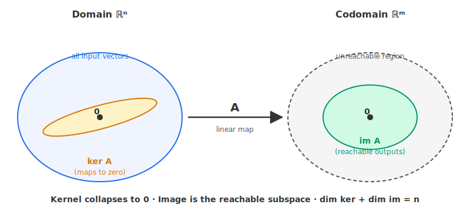
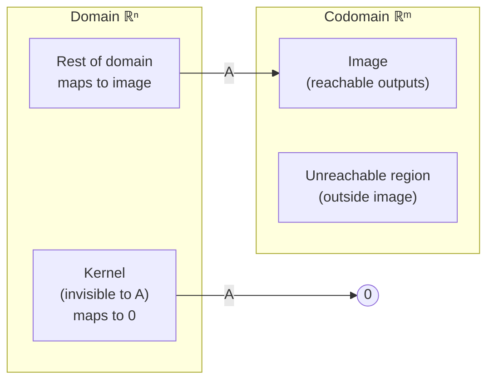

# 5 - Null Space and Pseudoinverse

[toc]

> **TL;DR:** The null space (kernel) of a matrix A is the set of all input vectors that A crushes to zero — these are exactly the directions A cannot see. When A is not square or not full-rank, the ordinary inverse A⁻¹ does not exist, but the **Moore–Penrose pseudoinverse** A⁺ always exists and gives the *best possible* answer: the least-squares solution for overdetermined systems and the minimum-norm solution for underdetermined ones.

## Vocabulary

**Null space / kernel**: The set of all input vectors that A sends to the zero vector. Always a subspace of the domain.

```math
\ker A = \{\, \mathbf{x} \in \mathbb{R}^n : A \mathbf{x} = \mathbf{0} \,\}
```

---

**Nullity**: The dimension of the null space; equals the number of free variables in the RREF of A.

```math
\dim \ker A
```

---

**Image / column space / range**: The set of all outputs A can produce. Equivalently, the span of the columns of A.

```math
\operatorname{im} A = \{\, A \mathbf{x} : \mathbf{x} \in \mathbb{R}^n \,\}
```

---

**Rank**: The dimension of the column space; equals the number of pivots in the RREF of A.

```math
\operatorname{rank}(A) = \dim \operatorname{im} A
```

---

**Rank–nullity theorem**: For any matrix A of shape m × n, the rank plus the nullity equals the number of columns.

```math
\operatorname{rank}(A) + \dim \ker(A) = n
```

---

**Singular matrix**: A square matrix with determinant zero, equivalently one whose kernel is not just the zero vector. No ordinary inverse exists.

```math
\det A = 0 \iff \ker A \neq \{\mathbf{0}\}
```

---

**Moore–Penrose pseudoinverse**: The unique matrix satisfying the four "Penrose conditions." Coincides with the ordinary inverse when A is square and invertible.

```math
A^{+} \in \mathbb{R}^{n \times m}
```

---

**Least-squares solution**: For an overdetermined system A x = b with no exact solution, the x that minimizes the squared residual. Given by the pseudoinverse.

```math
\hat{\mathbf{x}} = \arg\min_{\mathbf{x}} \|A \mathbf{x} - \mathbf{b}\|_2^2 = A^{+} \mathbf{b}
```

---

**Minimum-norm solution**: For an underdetermined system A x = b with infinitely many solutions, the unique x with the smallest norm. Also given by the pseudoinverse.

```math
\hat{\mathbf{x}} = A^{+} \mathbf{b}, \qquad \|\hat{\mathbf{x}}\| \le \|\mathbf{x}\| \text{ for every other solution}
```

---

**Singular value decomposition (SVD)**: The factorisation A = U Σ Vᵀ. The pseudoinverse has a clean SVD formula by reciprocating each nonzero singular value.

```math
A = U \Sigma V^\top, \qquad A^{+} = V \Sigma^{+} U^\top
```

---

## Intuition

A matrix A: ℝⁿ → ℝᵐ does two things at once:

1. **Some inputs survive** — they map to nonzero outputs in ℝᵐ. The set of reachable outputs is the **image** of A, a subspace of ℝᵐ.
2. **Some inputs vanish** — they map to the zero vector. The set of "invisible" inputs is the **kernel** (null space) of A, a subspace of ℝⁿ.

A is invertible if and only if **both** are trivial: every input survives (kernel = {0}) **and** every output is reachable (image = ℝᵐ). Anything less, and the ordinary inverse A⁻¹ cannot exist — multiple inputs collide on the same output, or some outputs are simply unreachable.





The **pseudoinverse** A⁺ is the canonical fix for both failures. For an overdetermined system A x = b with no exact solution, A⁺ gives the input that gets *as close as possible* to b (the least-squares fit). For an underdetermined system with infinitely many solutions, A⁺ gives the *smallest* such input (the minimum-norm fit). For a square invertible matrix, A⁺ = A⁻¹ exactly. One operator, three roles.

## The Null Space

The null space of A is the solution set of the **homogeneous** system A x = 0. It is always a subspace of ℝⁿ — three quick checks against the subspace axioms ([7 - Vector Spaces](./7-vector-spaces.md)):

```math
A \mathbf{0} = \mathbf{0} \quad \text{(contains zero)}
```

```math
A \mathbf{u} = \mathbf{0},\; A \mathbf{v} = \mathbf{0} \;\Longrightarrow\; A(\mathbf{u} + \mathbf{v}) = \mathbf{0} \quad \text{(closed under +)}
```

```math
A \mathbf{u} = \mathbf{0} \;\Longrightarrow\; A(c \mathbf{u}) = \mathbf{0} \quad \text{(closed under scalar ·)}
```

So the kernel is always a real, honest subspace — closed under both vector-space operations.

### Finding the null space from RREF

Bring A to RREF. Each free variable corresponds to one basis vector of the null space, constructed by setting that free variable to 1 and all the other free variables to 0, then solving for the basic variables. For example, if

```math
\operatorname{RREF}(A) =
\begin{bmatrix}
1 & 0 & 2 & 0 \\
0 & 1 & 3 & 0 \\
0 & 0 & 0 & 1
\end{bmatrix}
```

then x₃ is the only free variable. Setting x₃ = 1 forces x₁ = −2, x₂ = −3, x₄ = 0, giving the basis:

```math
\ker A = \operatorname{span}\!\left\{\, \begin{bmatrix} -2 \\ -3 \\ 1 \\ 0 \end{bmatrix} \,\right\}
```

The null space is one-dimensional because there is one free variable.

> [!IMPORTANT]
> **The dimension of the null space equals the number of *non-pivot* columns of A.** The number of pivot columns equals the rank. Together they sum to n — that is the **rank–nullity theorem** in its simplest form.

## The Image (Column Space)

The image of A is everything you can produce as an output:

```math
\operatorname{im} A = \{\, A \mathbf{x} : \mathbf{x} \in \mathbb{R}^n \,\}
```

Equivalently, the image is the **span of the columns of A**, because A x is a linear combination of A's columns with weights from x:

```math
A \mathbf{x} = x_1 \mathbf{c}_1 + x_2 \mathbf{c}_2 + \cdots + x_n \mathbf{c}_n
```

A basis for the image is given by the *pivot columns of A itself* (not the pivot columns of its RREF — the RREF tells you *which* columns are pivots, but you keep the original columns). The dimension of the image is the rank of A.

> [!TIP]
> Two important geometric questions are answered by the column space. (1) **Is A x = b solvable?** Yes iff b ∈ im A. (2) **What outputs can a neural-network layer produce?** Exactly the column space of its weight matrix — the same geometric object, dressed up in ML language.

## Why A⁻¹ Sometimes Does Not Exist

The ordinary inverse A⁻¹ requires A to be (1) **square** and (2) **of full rank** — equivalently, the kernel must be {0} and the image must be all of ℝⁿ. Either failure breaks the inverse:

| Situation | Why no A⁻¹ | Example |
| :--- | :--- | :--- |
| A is not square | Domain and codomain have different dimensions; no two-sided inverse possible | Any A with m ≠ n |
| A has nontrivial kernel | Two different inputs give the same output → inverse is ambiguous | A projection matrix, a matrix with a zero row |
| A's image is a proper subspace of ℝᵐ | Some outputs are unreachable → inverse would need to invent inputs | Same as above (these two are dual) |

**The pseudoinverse exists for every matrix.** It reduces to A⁻¹ exactly when A is square and invertible.

## The Moore–Penrose Pseudoinverse

The pseudoinverse A⁺ is defined by four equations called the **Penrose conditions** that together pin down a unique matrix for any A:

```math
A A^{+} A = A
```

```math
A^{+} A A^{+} = A^{+}
```

```math
(A A^{+})^\top = A A^{+}
```

```math
(A^{+} A)^\top = A^{+} A
```

You rarely compute A⁺ by checking these directly. Instead, you compute it through **SVD**: if A = U Σ Vᵀ is the singular value decomposition, then

```math
A^{+} = V \Sigma^{+} U^\top
```

where Σ⁺ is built by reciprocating each *nonzero* singular value of Σ and then transposing the matrix. Singular values that are zero (or below a numerical tolerance) stay zero in Σ⁺. **That is the trick** that lets the pseudoinverse handle rank deficiency where the ordinary inverse fails.

### Closed-form formulas for common cases

When A has independent columns (full column rank, m ≥ n) — the **tall** case typical of overdetermined least-squares:

```math
A^{+} = (A^\top A)^{-1} A^\top \qquad \text{(left inverse)}
```

When A has independent rows (full row rank, m ≤ n) — the **wide** case typical of underdetermined minimum-norm:

```math
A^{+} = A^\top (A A^\top)^{-1} \qquad \text{(right inverse)}
```

When A is square and invertible, both formulas collapse to A⁺ = A⁻¹. When A is rank-deficient, **neither** formula applies and you must use the SVD definition.

## Connection to Least Squares

For an overdetermined system A x = b with no exact solution, the least-squares problem is:

```math
\hat{\mathbf{x}} = \arg\min_{\mathbf{x}} \|A \mathbf{x} - \mathbf{b}\|_2^2
```

The answer is exactly:

```math
\hat{\mathbf{x}} = A^{+} \mathbf{b}
```

When A has full column rank, this equals the closed-form **normal-equation** solution (Aᵀ A)⁻¹ Aᵀ b. The pseudoinverse generalises that closed form to the rank-deficient case, where the normal equations themselves become singular.

> [!TIP]
> Every "fit a linear model" you have ever done — linear regression, polynomial regression on a fixed basis, even the closed-form ridge solution as λ → 0⁺ — is internally a pseudoinverse computation. PyTorch's `torch.linalg.lstsq` and NumPy's `np.linalg.lstsq` both call SVD-based pseudoinverse under the hood.

## Real-world Example

Below we (1) compute a null-space basis, (2) demonstrate the pseudoinverse for an overdetermined and an underdetermined system, and (3) cross-check the pseudoinverse against `lstsq`.

```python
import numpy as np
from scipy.linalg import null_space

# ---- (1) Null space of a rank-deficient matrix ----
A = np.array([[1, 2, 3],
              [2, 4, 6],
              [1, 1, 1]], dtype=float)
# Row 2 = 2 * Row 1, so rank is 2 and nullity is 3 - 2 = 1.

N = null_space(A)
print("Null space basis (one column per basis vector):")
print(N)
print("A @ n:", A @ N)   # Should be (approximately) the zero vector

print("rank:", np.linalg.matrix_rank(A))     # 2
print("nullity:", N.shape[1])                 # 1
# Rank + nullity = 2 + 1 = 3 = number of columns ✓

# ---- (2a) Overdetermined least-squares via pseudoinverse ----
A_over = np.array([[1, 1.0],
                   [1, 2.0],
                   [1, 3.0],
                   [1, 4.0]])
b_over = np.array([2.1, 3.9, 6.1, 7.8])

x_pinv = np.linalg.pinv(A_over) @ b_over
x_lstsq, *_ = np.linalg.lstsq(A_over, b_over, rcond=None)
print("Pseudoinverse solution:", x_pinv)
print("lstsq solution:       ", x_lstsq)   # Identical

# ---- (2b) Underdetermined system: minimum-norm solution ----
A_under = np.array([[1, 2, 3],
                    [4, 5, 6]], dtype=float)
b_under = np.array([1, 2], dtype=float)

x_min = np.linalg.pinv(A_under) @ b_under
print("Min-norm solution:", x_min)
print("Residual A x - b :", A_under @ x_min - b_under)   # ~ 0
print("Norm of x_min    :", np.linalg.norm(x_min))

# Any other x_alt that solves A_under @ x_alt = b will have ||x_alt|| >= ||x_min||.
```

> [!NOTE]
> `np.linalg.pinv` uses SVD with a tolerance for treating small singular values as zero. The default tolerance is reasonable but if you know your problem is exactly rank-deficient, lowering or raising `rcond` can matter. Reading the docstring once will save you a debugging session later.

## In Practice

In real ML pipelines, the pseudoinverse appears in:

- **Linear regression** with possibly collinear features — `pinv` is numerically safer than direct normal-equation solve.
- **Hat / projection matrices** — the orthogonal projector onto im A is exactly A A⁺.
- **Ridge regression as λ → 0⁺** — converges to the pseudoinverse solution, giving a precise meaning to "regularisation-free regression on rank-deficient data."
- **Influence functions and leave-one-out estimates** — both involve a Hessian inverse that becomes a pseudoinverse in the singular case.
- **Solving A x = b when nobody told you the rank** — `lstsq` / `pinv` are robust to surprises that `solve` is not.

> [!CAUTION]
> The pseudoinverse is not always cheap. Computing `pinv(A)` does a full SVD, which costs roughly O(min(m n², m² n)) flops. For large sparse systems you almost always want iterative solvers (LSQR, conjugate gradient on the normal equations) instead. Reach for `pinv` when **interpretability** matters or the matrix is small; reach for an iterative method when **scale** matters.

## Pitfalls

- **"Kernel only contains the zero vector."** — Only when A has full column rank. Rank-deficient matrices always have a nontrivial kernel.
- **"A⁺ A = I."** — Only when A has full column rank. In general A⁺ A is the orthogonal projector onto the row space, and A A⁺ is the orthogonal projector onto the column space.
- **"(A⁺)⁺ = A."** — Actually true (it is a consequence of the Penrose conditions), but easy to misremember as false.
- **"Pseudoinverse always exists, so I should always use it."** — Pseudoinverse via SVD is dense, O(n³)-ish, and numerically expensive. For square invertible problems, `solve` is faster and equally accurate. Match the tool to the situation.
- **"A⁺ b is the unique minimum-residual solution."** — Among solutions that minimise ‖A x − b‖, A⁺ b is the one with smallest ‖x‖. That tie-breaking by norm is what makes it unique.

## Exercises

### Exercise 1 — Null-space basis from RREF

Given:

```math
\operatorname{RREF}(A) = \begin{bmatrix} 1 & 0 & 3 & -2 \\ 0 & 1 & -1 & 4 \\ 0 & 0 & 0 & 0 \end{bmatrix}
```

Find a basis for ker A and state its dimension.

#### Solution 1

Pivots are in columns 1, 2. **Free variables: x₃, x₄.** Nullity = 2.

Reading rows: x₁ = −3 x₃ + 2 x₄, x₂ = x₃ − 4 x₄.

- Set (x₃, x₄) = (1, 0): basis vector **(−3, 1, 1, 0)ᵀ**.
- Set (x₃, x₄) = (0, 1): basis vector **(2, −4, 0, 1)ᵀ**.

```math
\ker A = \operatorname{span}\!\left\{\, \begin{bmatrix} -3 \\ 1 \\ 1 \\ 0 \end{bmatrix},\; \begin{bmatrix} 2 \\ -4 \\ 0 \\ 1 \end{bmatrix} \,\right\}
```

The null space is a 2-D subspace of ℝ⁴.

### Exercise 2 — Apply rank–nullity

A has shape (6, 9) with rank 4. Compute:

1. Nullity.
2. Number of free variables in A x = 0.
3. Is A surjective onto ℝ⁶? Injective from ℝ⁹?

#### Solution 2

1. **rank + nullity = n = 9 → nullity = 5.**
2. **5 free variables** (one per non-pivot column; equals nullity).
3. **Surjective?** No — surjectivity needs rank = m = 6, but rank is 4. The image is a 4-D subspace of ℝ⁶, so 2 dimensions of ℝ⁶ are unreachable.
   **Injective?** No — injectivity needs ker A = {0}, but the kernel is 5-D. Many inputs collide on the same output.

### Exercise 3 — Pseudoinverse for least-squares regression

Fit y = w₀ + w₁ x to data (1, 2), (2, 3.5), (3, 5.1), (4, 6.8).

1. Set up A and b.
2. Compute Aᵀ A and Aᵀ b.
3. Solve (Aᵀ A) w = Aᵀ b.

#### Solution 3

**Step 1:**

```math
A = \begin{bmatrix} 1 & 1 \\ 1 & 2 \\ 1 & 3 \\ 1 & 4 \end{bmatrix}, \qquad \mathbf{b} = \begin{bmatrix} 2 \\ 3.5 \\ 5.1 \\ 6.8 \end{bmatrix}
```

**Step 2** — Aᵀ A is 2×2, Aᵀ b is 2×1:

```math
A^\top A = \begin{bmatrix} 4 & 10 \\ 10 & 30 \end{bmatrix}, \qquad A^\top \mathbf{b} = \begin{bmatrix} 17.4 \\ 50.5 \end{bmatrix}
```

(Σ x = 10, Σ x² = 30, Σ y = 17.4, Σ x y = 1·2 + 2·3.5 + 3·5.1 + 4·6.8 = 50.5.)

**Step 3** — invert Aᵀ A. det = 4·30 − 10·10 = 20.

```math
(A^\top A)^{-1} = \frac{1}{20} \begin{bmatrix} 30 & -10 \\ -10 & 4 \end{bmatrix}
```

```math
\mathbf{w} = \frac{1}{20} \begin{bmatrix} 30·17.4 - 10·50.5 \\ -10·17.4 + 4·50.5 \end{bmatrix} = \frac{1}{20} \begin{bmatrix} 17 \\ 28 \end{bmatrix} = \begin{bmatrix} 0.85 \\ 1.40 \end{bmatrix}
```

**Best-fit line: y ≈ 0.85 + 1.40 x.** This is exactly what `np.linalg.lstsq` returns.

### Exercise 4 — Inverse vs no inverse

For each matrix, state whether A⁻¹ exists, and if not, what fails.

```math
A_1 = \begin{bmatrix} 1 & 2 \\ 3 & 4 \end{bmatrix}, \;\; A_2 = \begin{bmatrix} 1 & 2 \\ 2 & 4 \end{bmatrix}, \;\; A_3 = \begin{bmatrix} 1 & 0 & 0 \\ 0 & 1 & 0 \end{bmatrix}, \;\; A_4 = \begin{bmatrix} 1 \\ 2 \\ 3 \end{bmatrix}
```

#### Solution 4

- **A₁** — square; det = 1·4 − 2·3 = −2 ≠ 0. **A₁⁻¹ exists.**
- **A₂** — square; row 2 = 2·row 1; det = 0. **No inverse** — nontrivial kernel (rank-1 matrix in ℝ²).
- **A₃** — shape (2, 3), **not square**. No ordinary inverse. Pseudoinverse A₃⁺ is (3, 2). rank = 2 = m: surjective, not injective.
- **A₄** — shape (3, 1), **not square**. No ordinary inverse. Pseudoinverse A₄⁺ is (1, 3). rank = 1 = n: injective, not surjective.

In every non-invertible case, the **Moore–Penrose pseudoinverse** is the canonical generalisation that gives the least-squares or minimum-norm answer.

## Sources

- Deisenroth, M. P., Faisal, A. A., & Ong, C. S. (2020). *Mathematics for Machine Learning*. Chapter 2.3.4, 4.5 (SVD). https://mml-book.github.io/
- Strang, G. MIT 18.06 Lecture 33 (left and right inverses, pseudoinverse). https://ocw.mit.edu/courses/18-06-linear-algebra-spring-2010/
- Penrose, R. (1955). A generalized inverse for matrices. *Mathematical Proceedings of the Cambridge Philosophical Society*, 51(3), 406–413.

## Related

- [3 - Matrices](./3-matrices.md)
- [4 - Solving Systems of Linear Equations](./4-solving-systems-of-linear-equations.md)
- [7 - Vector Spaces](./7-vector-spaces.md)
- [9 - Basis and Rank](./9-basis-and-rank.md)
- [11 - Matrix Representation of Linear Mappings](./11-matrix-representation-of-linear-mappings.md)
