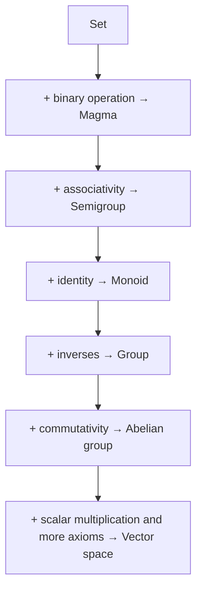
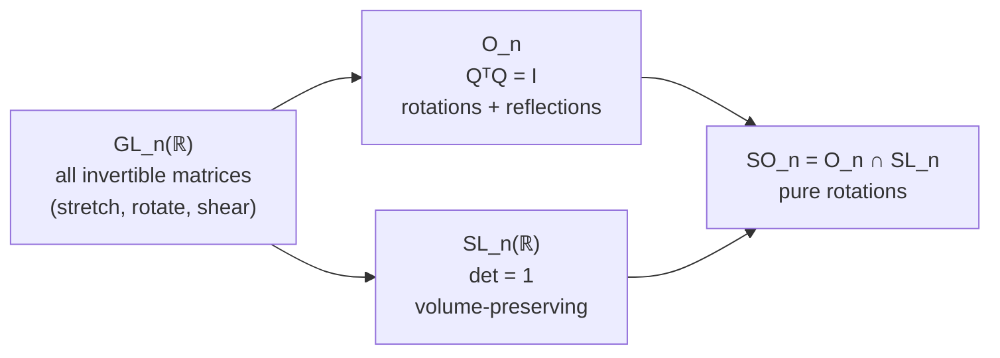
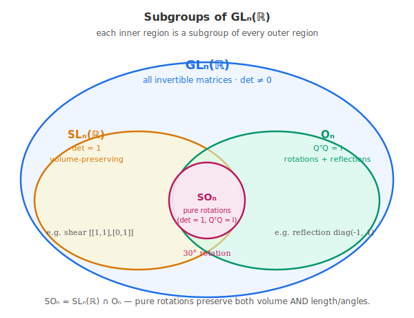

# 6 - Groups

[toc]

> **TL;DR:** A **group** is a set with one operation that satisfies four axioms — closure, associativity, identity, and inverses. Groups capture the bare minimum needed for "you can combine elements and undo combinations." Vector spaces are built on top of *abelian groups* (commutative groups), and the *general linear group* GL_n(ℝ) — invertible n × n matrices under multiplication — is the central group of linear algebra.

## Vocabulary

**Set**: A collection of elements. No structure beyond membership.

```math
S
```

---

**Binary operation**: A rule that combines two elements of S to produce another element of S.

```math
\circ : S \times S \to S
```

---

**Closure**: The operation never leaves the set — combining any two elements stays in S.

```math
\forall a, b \in S: \quad a \circ b \in S
```

---

**Associativity**: Grouping does not matter when combining three elements.

```math
(a \circ b) \circ c = a \circ (b \circ c)
```

---

**Neutral / identity element**: An element e that leaves every other element unchanged when combined. Unique if it exists.

```math
a \circ e = e \circ a = a
```

---

**Inverse element**: For each element a, the element that "undoes" it back to the identity. Each a has its own.

```math
a \circ a^{-1} = a^{-1} \circ a = e
```

---

**Group**: A set with a binary operation satisfying closure, associativity, identity, and inverses.

```math
(S, \circ)
```

---

**Abelian (commutative) group**: A group where the operation commutes — the order of combination doesn't matter.

```math
a \circ b = b \circ a
```

---

**Subgroup**: A subset of G that is itself a group under the same operation.

```math
H \subseteq G
```

---

**General linear group**: The group of n × n invertible real matrices under matrix multiplication.

```math
\operatorname{GL}_n(\mathbb{R}) = \{\, A \in \mathbb{R}^{n \times n} : \det A \neq 0 \,\}
```

---

**Special linear group**: The subgroup of GL_n(ℝ) consisting of matrices with determinant equal to 1.

```math
\operatorname{SL}_n(\mathbb{R}) = \{\, A \in \mathbb{R}^{n \times n} : \det A = 1 \,\}
```

---

**Orthogonal group**: Matrices whose transpose is their inverse — rotations and reflections.

```math
\operatorname{O}_n = \{\, Q \in \mathbb{R}^{n \times n} : Q^\top Q = I \,\}
```

---

**Order of a group**: The number of elements in S. Can be finite or infinite.

---

## Intuition

You already know several groups; you just have not called them that. The integers under addition form a group: you can add any two integers and get an integer (closure), the order in which you nest sums does not matter (associativity), zero is the identity, and every integer n has the inverse −n. The nonzero real numbers under multiplication form another: closed under multiplication, associative, identity 1, inverse 1/a. These two examples are the prototypes — abstract groups are anything that *behaves like* one of these.

The reason group theory matters for linear algebra is structural: every theorem about a vector space starts by observing that the vectors form an **abelian group under addition**. We do not need to re-prove that addition is associative for vectors — we inherit it from the group axioms. Groups are the scaffolding; vector spaces add scalar multiplication on top.



The diagram is a "structure tower." Each step *adds* one axiom and rules out fewer examples. By the time you reach a vector space, you have eight axioms and a *very* specific kind of structure — but the bottom rungs (groups, abelian groups) are doing most of the work.

## The Four Group Axioms

A group is a pair (G, ∘) — a set G with a binary operation ∘ — satisfying exactly four conditions.

### Closure

For every a, b ∈ G, the combination a ∘ b must lie in G. The integers under addition are closed; the *positive* integers under subtraction are **not** closed (1 − 5 = −4 leaves the set). Closure is the unspoken assumption that "the operation actually makes sense as a binary operation on this set."

```math
\forall a, b \in G: \quad a \circ b \in G
```

### Associativity

Grouping does not matter when combining three elements:

```math
(a \circ b) \circ c = a \circ (b \circ c)
```

Real-number addition is associative: (1 + 2) + 3 = 1 + (2 + 3). Real-number subtraction is **not**: (5 − 3) − 1 = 1, but 5 − (3 − 1) = 3. So (ℝ, −) is not a group — subtraction fails the second axiom.

### Identity (neutral element)

There must exist an element e ∈ G that leaves every element unchanged:

```math
a \circ e = e \circ a = a \quad \text{for every } a \in G
```

For integers-under-addition this is 0; for nonzero-reals-under-multiplication this is 1; for matrix multiplication on GL_n(ℝ) this is the identity matrix Iₙ. The identity is **unique** — if two elements both behaved as identities, they would equal each other.

### Inverses

Every element a ∈ G must have an inverse a⁻¹ ∈ G that undoes it back to the identity:

```math
a \circ a^{-1} = a^{-1} \circ a = e
```

For integers-under-addition this is −a; for nonzero-reals-under-multiplication this is 1/a; for GL_n(ℝ) this is the matrix inverse A⁻¹. This is exactly why GL_n(ℝ) **excludes** singular matrices — without the inverse axiom, you do not have a group.

> [!IMPORTANT]
> When you read "the matrix inverse A⁻¹" in linear algebra, you are reading "the inverse of A in the group GL_n(ℝ)." The notation is borrowed from group theory directly. The same is why (A B)⁻¹ = B⁻¹ A⁻¹ — that identity holds in *every* group, not just for matrices.

## Abelian (Commutative) Groups

A group is **abelian** if the operation commutes:

```math
a \circ b = b \circ a \quad \text{for all } a, b \in G
```

Both (ℤ, +) and (ℝ\{0}, ·) are abelian. Vectors under addition form an abelian group — that is one of the load-bearing facts the vector space definition will assume.

**Non-abelian groups** are everywhere too. The most important for this series: GL_n(ℝ) for n ≥ 2 is *not* abelian, because matrix multiplication is not commutative. That non-commutativity propagates into linear algebra: composition of linear maps depends on order, change-of-basis transformations depend on order, and so on.

> [!NOTE]
> The word "abelian" honours Niels Henrik Abel (1802–1829). When you see the term in ML papers (often in deep-learning theory and equivariant networks), it always means "commutative."

## Examples and Non-Examples

The table below shows several common candidates and which axioms they pass. Building intuition for *why* something fails is more useful than memorising what works.

| Set & operation | Closure | Assoc. | Identity | Inverses | Group? |
| :--- | :---: | :---: | :---: | :---: | :---: |
| (ℤ, +) | ✓ | ✓ | 0 | −n | ✓ (abelian) |
| (ℕ, +) (naturals incl. 0) | ✓ | ✓ | 0 | ✗ (no negatives) | ✗ |
| (ℝ, ·) | ✓ | ✓ | 1 | ✗ (0 has no inverse) | ✗ |
| (ℝ\{0}, ·) | ✓ | ✓ | 1 | 1/a | ✓ (abelian) |
| (ℝ, −) | ✓ | ✗ | ✗ | — | ✗ |
| (ℝⁿ, +) vector addition | ✓ | ✓ | 0 | −v | ✓ (abelian) |
| (ℝ^(n×n), ·) all matrices | ✓ | ✓ | I | ✗ (singular matrices) | ✗ |
| (GL_n(ℝ), ·) | ✓ | ✓ | I | A⁻¹ | ✓ (non-abelian for n ≥ 2) |

## The General Linear Group

The **general linear group** GL_n(ℝ) is the central group of this entire series:

```math
\operatorname{GL}_n(\mathbb{R}) = \{\, A \in \mathbb{R}^{n \times n} : \det A \neq 0 \,\}
```

with matrix multiplication as the group operation. Each element is an invertible n × n matrix — geometrically, a linear transformation of ℝⁿ that does not collapse any dimension. The identity is Iₙ, the inverse of A is the matrix inverse A⁻¹, and the product A B is matrix multiplication.

Useful subgroups of GL_n(ℝ):

- **SL_n(ℝ)** — the **special linear group**, matrices with determinant 1; volume-preserving transformations.
- **O_n** — the **orthogonal group**, matrices satisfying Qᵀ Q = I; rotations and reflections; preserve lengths and angles.
- **SO_n** — the **special orthogonal group**, the intersection O_n ∩ SL_n; pure rotations (no reflections).



As a Venn-style picture: SL and O are two overlapping subgroups of GL, and SO is their intersection.



> [!TIP]
> In ML, the orthogonal group O_n shows up as the family of weight matrices that preserve L₂ norms — useful for stable RNN initialisations, normalising flows, and any architecture where you want gradients neither to vanish nor explode through a linear layer. Orthogonal initialisation in PyTorch (`torch.nn.init.orthogonal_`) samples from O_n.

## Why Groups Matter for ML

You will see groups three places in modern ML:

1. **Vector spaces** — every vector space is built on an underlying abelian group (vectors under addition). Every theorem in [7 - Vector Spaces](./7-vector-spaces.md) about addition implicitly invokes the group axioms.
2. **Symmetry groups in equivariant networks** — group-equivariant CNNs (Cohen & Welling, 2016) treat the symmetries of the data (rotations, translations, reflections) as a group and design layers that respect that group structure. "Translation equivariance" of convolutions is literally a statement about the group of translations.
3. **Manifold optimisation** — when weights are constrained to lie in SO_n or SL_n (these are **Lie groups**), gradient descent must respect the group's geometry, leading to algorithms like Riemannian SGD.

## Real-world Example

Verifying group axioms numerically gives you a feel for what each axiom buys. Below we (1) verify (ℤ, +) properties on a small sample, (2) verify the group axioms for GL_n(ℝ) on random invertible matrices, and (3) confirm that matrix multiplication is non-commutative.

```python
import numpy as np

# ---- (1) Integers under addition: simple, abelian, infinite group ----
a, b, c = 3, 7, -4
assert (a + b) + c == a + (b + c)          # associativity
assert a + 0 == a                          # identity
assert a + (-a) == 0                       # inverse
assert a + b == b + a                      # abelian

# ---- (2) GL_n(R): the group of n x n invertible matrices ----
rng = np.random.default_rng(42)
n = 3

def random_invertible(n: int) -> np.ndarray:
    while True:
        M = rng.standard_normal((n, n))
        if abs(np.linalg.det(M)) > 1e-6:
            return M

A = random_invertible(n)
B = random_invertible(n)
C = random_invertible(n)
I = np.eye(n)

# Closure: product of invertibles is invertible (det != 0)
assert abs(np.linalg.det(A @ B)) > 1e-9

# Associativity
assert np.allclose((A @ B) @ C, A @ (B @ C))

# Identity
assert np.allclose(A @ I, A)
assert np.allclose(I @ A, A)

# Inverse
A_inv = np.linalg.inv(A)
assert np.allclose(A @ A_inv, I)
assert np.allclose(A_inv @ A, I)

print("GL_3(R) axioms verified on a random sample.")

# ---- (3) Non-abelian! ----
print("A @ B - B @ A (should NOT be zero):")
print(A @ B - B @ A)
# For 2x2 and larger, AB != BA in general.

# ---- (4) Orthogonal group: a subgroup of GL_n(R) ----
from scipy.stats import ortho_group
Q1 = ortho_group.rvs(dim=n, random_state=rng)
Q2 = ortho_group.rvs(dim=n, random_state=rng)
# Closure under multiplication
assert np.allclose((Q1 @ Q2).T @ (Q1 @ Q2), I)
# Inverse equals transpose
assert np.allclose(Q1.T @ Q1, I)
print("O(3) is closed and inverses equal transposes.")
```

> [!NOTE]
> Numerical verification is not a proof — it only shows the axioms hold on the samples tested. Mathematical proofs work for *all* elements, not just the ones you sampled. But running a numerical check is a great way to internalize what each axiom is saying before reading a formal proof.

## In Practice

You will rarely write group-theoretic code directly in ML, but the language matters:

- When a paper says "the weight matrix is in SO(3)," it means rotation matrices in 3D — useful for 3D vision and robotics.
- When PyTorch says "orthogonal initialisation," it is sampling from O_n.
- When a flow-based generative model talks about "Lie group structure," it is using the differentiable-manifold extension of group theory.
- When equivariance papers talk about "the convolution is equivariant under the translation group," they are formalising the idea that "shifted input gives a shifted output" as a group-theoretic statement.

> [!CAUTION]
> Beware of confusing "group" (one operation) with "ring" or "field" (two operations) or "vector space" (group + scalar action). The level of structure changes what you are allowed to assume. Vector spaces are *abelian groups under addition* with an additional scalar-multiplication structure on top — when we get to [7 - Vector Spaces](./7-vector-spaces.md) the first four axioms will be exactly the group axioms.

## Pitfalls

- **"Closure is trivial."** — It is trivial *to state*, but it constantly fails. Subtraction on the naturals fails closure. Matrix multiplication on the set of $2 \times 3$ matrices fails closure (shape mismatch). Always check closure before assuming the rest.
- **"Identity must be the number 1 (or 0)."** — The identity is whatever element of the set acts neutrally under the operation. For matrix multiplication it is I; for function composition on bijections it is id; for symmetric-difference of sets it is ∅.
- **"Inverses must be additive inverses."** — Inverse means "undo the operation." If the operation is multiplication, the inverse is $1/a$. If the operation is matrix multiplication, the inverse is A⁻¹.
- **"All groups are abelian."** — Most interesting groups in linear algebra are *not* abelian. The general linear group, rotation groups, and permutation groups all fail commutativity for n ≥ 2.
- **"Group ≠ vector space."** — A group has one operation; a vector space has two (vector addition and scalar multiplication). Every vector space is built on a group, but a group alone is not a vector space.

## Exercises

### Exercise 1 — Check the axioms

For each (set, operation), decide whether it forms a group. If not, name which axiom fails.

1. (ℤ, ·) — integers under multiplication
2. ({+1, −1}, ·) — the set {+1, −1} under multiplication
3. (ℝ≥0, +) — non-negative reals under addition
4. The set of 2×2 invertible diagonal matrices, under matrix multiplication

#### Solution 1

1. **(ℤ, ·) — NOT a group.** Closure ✓ (integer × integer = integer). Associativity ✓. Identity is 1 ✓. But **inverses fail** — the integer 2 has no integer inverse (1/2 is not an integer). Only ±1 are invertible.
2. **({+1, −1}, ·) — IS a group** (abelian). Closure ✓ (the product of any two is ±1). Associativity ✓. Identity = 1. Inverse of +1 is +1; inverse of −1 is −1. This is the smallest non-trivial group; it has order 2.
3. **(ℝ≥0, +) — NOT a group.** Closure ✓. Associativity ✓. Identity is 0 ✓. But **inverses fail** — for 3, the inverse would be −3, which is not in ℝ≥0.
4. **Invertible 2×2 diagonal matrices, under matrix multiplication — IS a group** (abelian). Closure ✓ (product of diagonal matrices is diagonal; invertible × invertible = invertible). Associativity ✓ (matrix multiplication is associative). Identity is I. Inverse exists by hypothesis (we restricted to invertible diagonals). Commutativity ✓ — diagonal matrices commute. Note this is a subgroup of GL_n(ℝ).

### Exercise 2 — Identify and use group identities

In the group GL_n(ℝ), prove (A B C)⁻¹ = C⁻¹ B⁻¹ A⁻¹ using only the group axioms (no specific matrix manipulations).

#### Solution 2

We want to show that C⁻¹ B⁻¹ A⁻¹ is the inverse of A B C, i.e. their product (in either order) equals the identity.

```math
(A B C)(C^{-1} B^{-1} A^{-1}) = A B (C C^{-1}) B^{-1} A^{-1} = A B \cdot I \cdot B^{-1} A^{-1}
```

Using identity·X = X:

```math
= A B B^{-1} A^{-1} = A (B B^{-1}) A^{-1} = A \cdot I \cdot A^{-1} = A A^{-1} = I
```

The order had to **reverse** to make the inner pairs cancel one by one. The same proof works in *any* group — the identity holds for permutations, function compositions, rotations, etc.

> [!IMPORTANT]
> This is the deep reason for (A B)⁻¹ = B⁻¹ A⁻¹ and (A B)ᵀ = Bᵀ Aᵀ. Both are instances of "operation that reverses-order with inverse-like behavior" in some group structure. Memorise the principle: when "undoing" a composition, peel off the layers from the *outside in*.

### Exercise 3 — Recognize the general linear group in code

The following NumPy snippet produces a 4×4 matrix. State whether it is (a) in GL₄(ℝ), and (b) what subgroup of GL₄(ℝ), if any, it belongs to.

```python
import numpy as np
from scipy.stats import ortho_group
A = ortho_group.rvs(dim=4, random_state=0)
```

#### Solution 3

`ortho_group.rvs(dim=4)` samples uniformly from O₄ — the **orthogonal group** of 4×4 matrices satisfying Qᵀ Q = I.

(a) **Yes, A ∈ GL₄(ℝ).** Every orthogonal matrix is invertible (Qᵀ Q = I means Q⁻¹ = Qᵀ), so it has nonzero determinant.

(b) **A is in O₄**, a subgroup of GL₄(ℝ). Furthermore, since `scipy.stats.ortho_group` samples from the Haar measure on O₄, det A is either +1 or −1 with equal probability. If det A = +1, then A is in **SO₄** (rotations); if det A = −1, then A is in **O₄ \ SO₄** (improper rotations / reflections).

In ML, orthogonal matrices preserve L₂ norms and are used in **orthogonal weight initialisation** to keep gradients well-conditioned through deep networks.

### Exercise 4 — Build a group multiplication table

The set ℤ/4ℤ = {0, 1, 2, 3} forms an abelian group under addition mod 4. Build the multiplication table and identify (a) the identity, (b) the inverse of each element.

#### Solution 4

The "multiplication" here is the group operation, which is **addition mod 4**: a + b is computed normally, then reduced mod 4.

| + (mod 4) | 0 | 1 | 2 | 3 |
| :---: | :---: | :---: | :---: | :---: |
| **0** | 0 | 1 | 2 | 3 |
| **1** | 1 | 2 | 3 | 0 |
| **2** | 2 | 3 | 0 | 1 |
| **3** | 3 | 0 | 1 | 2 |

(a) **Identity = 0.** Every row/column where 0 appears, the element is unchanged (e.g., 1 + 0 = 1, 0 + 3 = 3).

(b) **Inverses:**

- inv(0) = 0 (since 0 + 0 = 0).
- inv(1) = 3 (since 1 + 3 = 4 ≡ 0 mod 4).
- inv(2) = 2 (since 2 + 2 = 4 ≡ 0 mod 4).
- inv(3) = 1 (since 3 + 1 = 4 ≡ 0 mod 4).

This is a **cyclic group of order 4**, written ℤ/4ℤ. Cyclic groups are the simplest examples of finite groups; they show up in cryptography (Diffie–Hellman over a finite cyclic group), in classifying symmetries (rotations of a square), and in modular arithmetic everywhere.

> [!NOTE]
> The table is **symmetric across the main diagonal** — that is exactly the visual signature of an *abelian* group. A non-abelian group's table is asymmetric.

## Sources

- Deisenroth, M. P., Faisal, A. A., & Ong, C. S. (2020). *Mathematics for Machine Learning*. Chapter 2.4. https://mml-book.github.io/
- Dummit, D. S., & Foote, R. M. (2004). *Abstract Algebra* (3rd ed.). Chapters 1–2 (gentle introduction to groups).
- Cohen, T., & Welling, M. (2016). Group Equivariant Convolutional Networks. https://arxiv.org/abs/1602.07576

## Related

- [3 - Matrices](./3-matrices.md)
- [7 - Vector Spaces](./7-vector-spaces.md)
- [10 - Linear Mappings](./10-linear-mappings.md)
