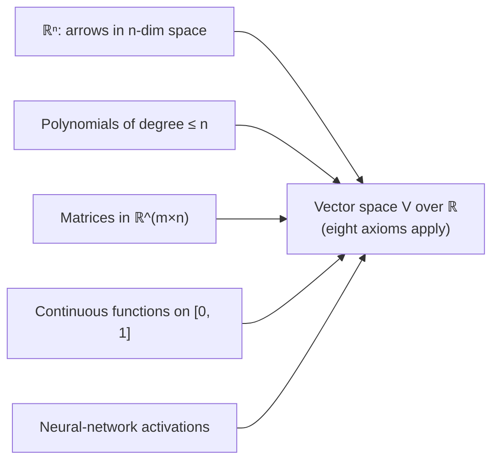
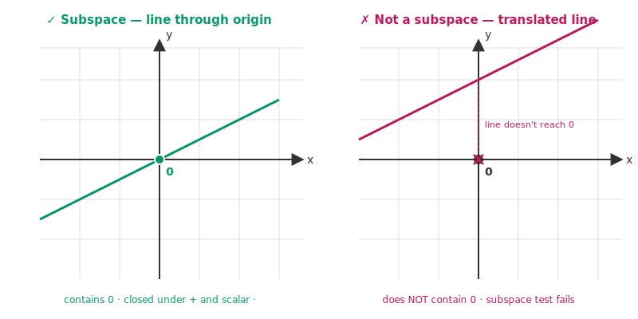
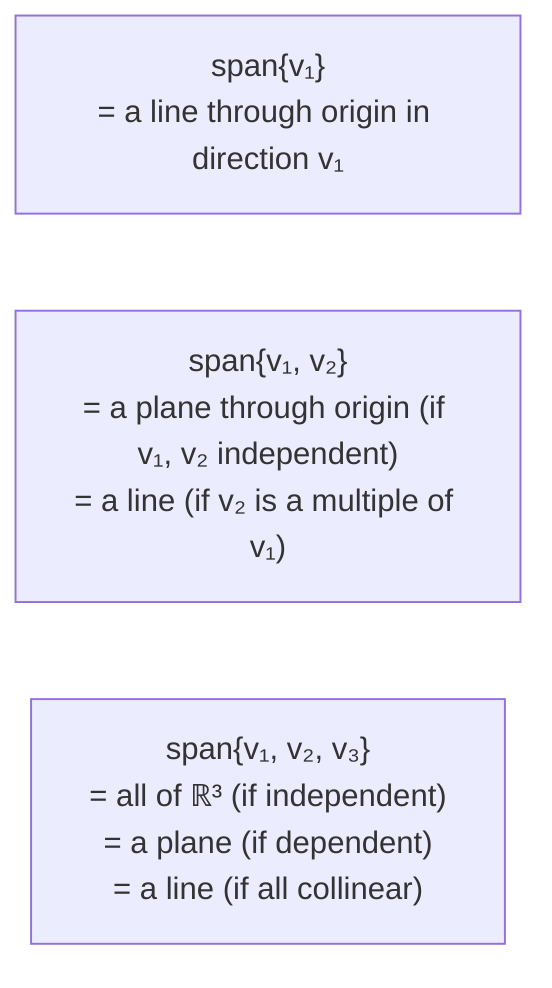

# 7 - Vector Spaces

[toc]

> **TL;DR:** A **vector space** is an abelian group under addition together with a *scalar multiplication* that mixes elements with real numbers and obeys eight axioms. Any set whose elements can be added and scaled "the way arrows in ℝⁿ can be added and scaled" is a vector space — including spaces of polynomials, matrices, functions, and the embedding tensors flowing through every neural network.

## Vocabulary

**Field**: A set of "scalars" with addition, multiplication, subtraction, and division behaving like the real numbers ℝ or the complex numbers ℂ. For ML, always ℝ.

```math
\mathbb{F} \in \{\mathbb{R}, \mathbb{C}\}
```

---

**Vector space (over a field)**: A set V with two operations — addition V × V → V and scalar multiplication 𝔽 × V → V — satisfying the eight axioms in the next section.

```math
V \text{ over } \mathbb{F}
```

---

**Vector**: Any element of a vector space, not just a column of numbers.

```math
\mathbf{v} \in V
```

---

**Zero vector**: The additive identity of the vector space. Unique.

```math
\mathbf{0} \in V
```

---

**Column vector**: A vector written as a vertical stack — an element of ℝ^(n×1). The default orientation in this series.

```math
\mathbf{v} \in \mathbb{R}^{n \times 1}
```

---

**Row vector**: A vector written as a horizontal stack — an element of ℝ^(1×n). Usually a column vector that has been transposed.

```math
\mathbf{v}^\top \in \mathbb{R}^{1 \times n}
```

---

**Transpose of a vector**: If v is a column vector, vᵀ is the corresponding row vector and vice versa.

```math
\mathbf{v}^\top
```

---

**Inner product (dot product)**: A scalar formed by summing the products of corresponding components. The single most common operation in ML.

```math
\mathbf{u}^\top \mathbf{v} = \sum_{i=1}^{n} u_i v_i
```

---

**Outer product**: A matrix formed by every pairwise product of components. Always rank-1.

```math
(\mathbf{u}\mathbf{v}^\top)_{ij} = u_i v_j
```

---

**Subspace**: A subset of V that is itself a vector space under the same operations.

```math
U \subseteq V
```

---

**Zero subspace**: The smallest possible subspace — just the zero vector.

```math
\{\mathbf{0}\}
```

---

**Span**: The set of all linear combinations of a given list of vectors. Always a subspace.

```math
\operatorname{span}\{\mathbf{v}_1, \ldots, \mathbf{v}_k\} = \{\, c_1 \mathbf{v}_1 + \cdots + c_k \mathbf{v}_k : c_i \in \mathbb{R} \,\}
```

---

## Intuition

Up to now, "vector" has meant an arrow in ℝⁿ. The grand abstraction is that **anything you can add and scale like ℝⁿ vectors is a vector space**. Polynomials? Add two polynomials, scale by a real number — yes. Matrices in ℝ^(m×n)? Add component-wise, scale component-wise — yes. Continuous functions on the interval [0, 1]? Same — that is the function space C[0, 1] that powers signal processing and PDEs.

This unification is the payoff of the abstraction: theorems proved about "vector spaces" apply to all these settings simultaneously. We state the definition once, prove that subspaces have certain properties once, define bases once — and the theory carries over to spaces of matrices, polynomials, image patches, and embedding tensors **without rewriting anything**.



## The Eight Axioms

A vector space (V, +, ·) over ℝ satisfies eight conditions. The first five are the abelian-group axioms from [6 - Groups](./6-groups.md); the next four govern scalar multiplication.

**Group axioms for addition** (for all u, v, w ∈ V):

```math
\mathbf{u} + \mathbf{v} \in V \qquad \text{(closure)}
```

```math
(\mathbf{u} + \mathbf{v}) + \mathbf{w} = \mathbf{u} + (\mathbf{v} + \mathbf{w}) \qquad \text{(associativity)}
```

```math
\exists\, \mathbf{0} \in V:\; \mathbf{v} + \mathbf{0} = \mathbf{v} \qquad \text{(identity)}
```

```math
\forall \mathbf{v} \in V \;\exists\, (-\mathbf{v}) \in V:\; \mathbf{v} + (-\mathbf{v}) = \mathbf{0} \qquad \text{(inverses)}
```

```math
\mathbf{u} + \mathbf{v} = \mathbf{v} + \mathbf{u} \qquad \text{(commutativity)}
```

**Scalar multiplication axioms** (for all a, b ∈ ℝ and u, v ∈ V):

```math
a(\mathbf{u} + \mathbf{v}) = a \mathbf{u} + a \mathbf{v} \qquad \text{(distributivity over vector +)}
```

```math
(a + b) \mathbf{v} = a \mathbf{v} + b \mathbf{v} \qquad \text{(distributivity over scalar +)}
```

```math
(a b) \mathbf{v} = a (b \mathbf{v}) \qquad \text{(scalar-vs-scaling associativity)}
```

```math
1 \cdot \mathbf{v} = \mathbf{v} \qquad \text{(scalar identity)}
```

> [!NOTE]
> Books vary: some count 8 axioms, some 9, some 10 by splitting closure into separate items for addition and scalar multiplication. The mathematical content is identical — only the bookkeeping differs.

## Canonical Examples

The four examples below are not "exotic" — they appear in production ML code constantly.

### ℝⁿ

The most familiar vector space. Elements are columns of n real numbers. Addition is component-wise, scalar multiplication scales each component. The zero vector has all components zero. This is what `np.array([...])` represents.

### ℝ^(m×n) — the space of matrices

Add two matrices entry-wise, scale by a real number entry-wise. Closure, associativity, distributivity all inherit from real arithmetic. The zero element is the all-zero matrix. This is why we said in [3 - Matrices](./3-matrices.md) that matrix addition and scalar multiplication "feel identical to real numbers" — they obey the *same axioms*.

### ℙₙ — polynomials of degree at most n

A polynomial of degree at most n is determined by its n + 1 coefficients, so ℙₙ is isomorphic to ℝⁿ⁺¹. Polynomial addition adds coefficients, scalar multiplication scales them. This is the vector space underlying **spline interpolation** and many basis-expansion methods.

### C[a, b] — continuous functions on an interval

Add two continuous functions pointwise; scale pointwise. Sums of continuous functions are continuous; scalar multiples are continuous. The zero element is the constant function f(x) = 0. This is an **infinite-dimensional** vector space — the basis for Fourier and wavelet analysis.

## Column vs. Row Vectors and the Transpose

By convention in this series, a vector is a **column** — an n × 1 matrix:

```math
\mathbf{v} = \begin{bmatrix} v_1 \\ v_2 \\ \vdots \\ v_n \end{bmatrix} \in \mathbb{R}^{n \times 1}
```

The transpose flips it to a **row vector**:

```math
\mathbf{v}^\top = \begin{bmatrix} v_1 & v_2 & \cdots & v_n \end{bmatrix} \in \mathbb{R}^{1 \times n}
```

These contain the same information but interact differently with matrices. A linear transformation A with shape (m, n) takes a column vector v ∈ ℝⁿ and produces another column vector A v ∈ ℝᵐ. Row vectors live on the *left* of matrices: vᵀ A is a (1, n) row times an (n, k) matrix yielding a (1, k) row.

> [!WARNING]
> NumPy's 1-D arrays (`shape = (n,)`) are neither row nor column vectors — they are rank-1 tensors that broadcast in ways that surprise beginners. For clarity, especially when prototyping math from a paper, use `x.reshape(-1, 1)` to make a column or `x.reshape(1, -1)` to make a row.

## Inner Product vs. Outer Product

These two operations look similar in notation but produce **wildly different** objects.

### Inner product (dot product)

```math
\mathbf{u}^\top \mathbf{v} = \sum_{i=1}^{n} u_i v_i \in \mathbb{R}
```

A **scalar**. Geometrically:

```math
\mathbf{u}^\top \mathbf{v} = \|\mathbf{u}\|\, \|\mathbf{v}\| \cos \theta
```

where θ is the angle between the two arrows. The inner product underlies **similarity**, **projection**, and **attention scores** in ML.

### Outer product

```math
\mathbf{u}\, \mathbf{v}^\top \in \mathbb{R}^{m \times n}, \qquad (\mathbf{u} \mathbf{v}^\top)_{ij} = u_i v_j
```

A **matrix**. Always **rank 1**: every row is a multiple of vᵀ, every column is a multiple of u. Outer products appear in low-rank approximations, in the gradient of wᵀ x with respect to w, and as the building blocks of SVD:

```math
A = \sum_{i} \sigma_i \mathbf{u}_i \mathbf{v}_i^\top
```

> [!TIP]
> **Memorise the shapes.** With u ∈ ℝᵐ and v ∈ ℝⁿ: the inner product uᵀ v is a *single number* (defined only when m = n), while the outer product u vᵀ is an (m, n) *matrix* (always defined). Confusing the two is the most common shape error in PyTorch code — by far.

## Vector Subspaces

A **subspace** is a subset U ⊆ V that is *itself* a vector space under the inherited operations. Rather than re-checking all eight axioms, you only need to verify three conditions (the "**subspace test**"):

```math
\mathbf{0} \in U \qquad \text{(contains zero)}
```

```math
\mathbf{u}_1, \mathbf{u}_2 \in U \;\Longrightarrow\; \mathbf{u}_1 + \mathbf{u}_2 \in U \qquad \text{(closed under +)}
```

```math
\mathbf{u} \in U,\; c \in \mathbb{R} \;\Longrightarrow\; c \mathbf{u} \in U \qquad \text{(closed under scalar ·)}
```

If all three hold, the eight vector-space axioms are inherited automatically.

### Subspace examples and non-examples

| Subset of ℝ³ | Subspace? | Reason |
| :--- | :---: | :--- |
| Origin alone, {0} | ✓ | Trivially closed; contains zero |
| x-axis: {(t, 0, 0) : t ∈ ℝ} | ✓ | Closed under +, ·; contains 0 |
| Plane x + y + z = 0 through origin | ✓ | Hyperplane through origin |
| Plane x + y + z = 1 (does not pass through origin) | ✗ | Does not contain 0 |
| First quadrant {(x, y, z) : x, y, z ≥ 0} | ✗ | Not closed under scalar multiplication by −1 |
| Unit sphere ‖v‖ = 1 | ✗ | Does not contain 0; not closed under + |
| Whole space ℝ³ | ✓ | Always |

> [!IMPORTANT]
> **Every subspace passes through the origin.** A set that does not contain the zero vector cannot be a subspace, no matter how nice it looks. This is why a plane "tilted away from the origin" is *not* a subspace — it is an **affine subspace** (covered in [12 - Affine Spaces and Affine Mappings](./12-affine-spaces-and-affine-mappings.md)).

The figure below makes the distinction visible: the green line on the left is a subspace because it passes through the origin; the red line on the right has the same direction but is shifted up, so it misses 0 and fails the test.



## Building Subspaces: Span

The **span** of a list of vectors v₁, …, v_k ∈ V is the set of every linear combination:

```math
\operatorname{span}\{\mathbf{v}_1, \ldots, \mathbf{v}_k\} = \{\, c_1 \mathbf{v}_1 + c_2 \mathbf{v}_2 + \cdots + c_k \mathbf{v}_k : c_i \in \mathbb{R} \,\}
```

The span is always a subspace — it contains the zero vector (set every c_i = 0), is closed under addition, and is closed under scalar multiplication. **Spans are the standard way to construct subspaces** and the bridge into the next note, [8 - Linear Independence](./8-linear-independence.md).



## Real-world Example

Below we verify that ℝ^(2×2) is a vector space, demonstrate inner vs. outer products, and check whether a sample subset of ℝ³ is a subspace.

```python
import numpy as np

# ---- Matrix space R^{2x2} as a vector space ----
A = np.array([[1, 2], [3, 4]], dtype=float)
B = np.array([[0, 1], [1, 0]], dtype=float)
zero = np.zeros((2, 2))

# (3) Identity:
assert np.array_equal(A + zero, A)
# (4) Inverses (additive):
assert np.array_equal(A + (-A), zero)
# (5) Commutativity:
assert np.array_equal(A + B, B + A)
# (8) Scalar associativity:
assert np.array_equal((2 * 3) * A, 2 * (3 * A))
# (9) Scalar identity:
assert np.array_equal(1.0 * A, A)
print("R^{2x2} passes a subset of the vector-space axioms.")

# ---- Inner vs outer product ----
u = np.array([1, 2, 3])
v = np.array([4, 5, 6])

inner = u @ v             # scalar: 1*4 + 2*5 + 3*6 = 32
outer = np.outer(u, v)    # 3x3 matrix
print("Inner product u^T v =", inner)
print("Outer product u v^T =")
print(outer)
# Outer product is rank-1:
print("Rank of outer product:", np.linalg.matrix_rank(outer))   # 1

# ---- Subspace test on a candidate set ----
def is_subspace_sample(check_membership) -> bool:
    """Sanity-check: zero in set? closed under +? closed under scalar *?"""
    if not check_membership(np.zeros(3)):
        return False
    rng = np.random.default_rng(0)
    for _ in range(100):
        a = rng.standard_normal(3) * 5
        b = rng.standard_normal(3) * 5
        if not (check_membership(a) and check_membership(b)):
            continue
        if not check_membership(a + b):
            return False
        if not check_membership(-3.7 * a):
            return False
    return True

# Plane x + y + z = 0 (through origin) — should be a subspace
plane_through_origin = lambda v: abs(v[0] + v[1] + v[2]) < 1e-9
# Build random vectors that satisfy it for sampling
def sample_membership(test, gen, n=100):
    rng = np.random.default_rng(1)
    for _ in range(n):
        x, y = rng.standard_normal(2)
        v = gen(x, y)
        assert test(v)
        # closure under +
        x2, y2 = rng.standard_normal(2)
        w = gen(x2, y2)
        assert test(v + w)
        # closure under scalar
        c = rng.standard_normal()
        assert test(c * v)

sample_membership(plane_through_origin, lambda x, y: np.array([x, y, -(x + y)]))
print("Plane x + y + z = 0 behaves like a subspace ✓")

# Plane x + y + z = 1 is NOT a subspace: 0 not in it
print("Is (0,0,0) on plane x+y+z=1?", abs(0 + 0 + 0 - 1) < 1e-9)   # False -> not a subspace
```

> [!NOTE]
> NumPy makes the abstraction tangible. The same `+` and `*` operators that work on ℝⁿ also work on ℝ^(m×n) — that is the whole point of an abstract vector space. PyTorch's autograd carries this further: gradients flow through any tensor operation that respects vector-space structure.

## In Practice

Wherever you see "the space of X" in ML, it is (almost always) a vector space:

- **Weight space** of a neural network is a high-dimensional ℝᵈ. Training is gradient descent in this space.
- **Embedding space** of a language model. Tokens map to vectors in ℝ^(d_embed); the "meaning" lives in the geometry.
- **Function space** in kernel methods. The Reproducing Kernel Hilbert Space is an infinite-dimensional vector space of functions.
- **Image space** in computer vision. An H × W × 3 image is a point in ℝ^(3HW).

> [!CAUTION]
> "Vector space" is a technical term. A set of objects with a `__add__` method does **not** automatically form a vector space — the operations must satisfy all eight axioms. Probability distributions, for example, do not form a vector space under addition (sum of two PDFs is not a PDF without normalisation). The Wasserstein space of distributions is *not* a vector space; it is a metric space with a much richer geometry.

## Pitfalls

- **"Subspaces can avoid the origin."** — Subspaces must contain the zero vector. A set that does not is not a subspace.
- **"NumPy 1-D arrays are column vectors."** — They are neither rows nor columns; their behaviour under `@` depends on context. Use 2-D arrays or `reshape(-1, 1)` for unambiguous semantics.
- **"uᵀ v and u vᵀ are interchangeable."** — One is a scalar, the other is a matrix. They differ in shape, rank, and meaning.
- **"Polynomials are not vectors."** — They are. The vector-space concept generalises beyond columns of numbers.
- **"Function spaces are infinite-dimensional, so the theorems break."** — Most finite-dimensional theorems generalise to infinite dimensions with mild extra conditions (completeness, separability). The proofs get harder, but the geometric intuitions usually carry over.

## Exercises

### Exercise 1 — Subspace test

For each subset of ℝ³, decide whether it is a subspace. Justify by checking (i) zero, (ii) closure under +, (iii) closure under scalar ·.

1. U₁ = {(x, y, z) : x + y + z = 0}
2. U₂ = {(x, y, z) : x ≥ 0, y ≥ 0, z ≥ 0}
3. U₃ = {(x, y, z) : x² + y² + z² ≤ 1} (the unit ball)
4. U₄ = {(t, 2t, −t) : t ∈ ℝ}

#### Solution 1

1. **U₁ is a subspace.** (i) (0, 0, 0) satisfies 0 + 0 + 0 = 0. ✓ (ii) If (x, y, z) and (x', y', z') both satisfy x + y + z = 0, their sum satisfies (x+x') + (y+y') + (z+z') = 0 + 0 = 0. ✓ (iii) For scalar c: c x + c y + c z = c (x + y + z) = c · 0 = 0. ✓ This is a 2-D plane through the origin.

2. **U₂ is NOT a subspace.** (i) Contains 0. ✓ (ii) Closed under +. ✓ (iii) **Fails scalar ·**: (1, 0, 0) is in U₂, but −1 · (1, 0, 0) = (−1, 0, 0) is not (x < 0). The first octant is closed under non-negative scalar multiplication but not under negatives.

3. **U₃ is NOT a subspace.** (i) (0, 0, 0) has norm 0 ≤ 1. ✓ (ii) **Fails closure under +**: (0.9, 0, 0) and (0.9, 0, 0) are both in U₃, but their sum (1.8, 0, 0) has norm 1.8 > 1. (iii) Also fails scalar ·: 2 · (0.9, 0, 0) = (1.8, 0, 0) leaves U₃. The unit ball is bounded; subspaces are always unbounded (or just {0}).

4. **U₄ is a subspace.** It is the **span** of (1, 2, −1) — a line through the origin. Spans are automatically subspaces. (i) t = 0 gives (0, 0, 0). ✓ (ii) (t, 2t, −t) + (s, 2s, −s) = (t+s, 2(t+s), −(t+s)), still in U₄ (with new parameter t+s). ✓ (iii) c · (t, 2t, −t) = (ct, 2ct, −ct), still in U₄. ✓

### Exercise 2 — Inner product, outer product, shapes

Given u = (1, 2, 3)ᵀ and v = (4, −1, 2)ᵀ:

1. Compute uᵀ v.
2. Compute u vᵀ. State its shape and rank.
3. Compute the geometric angle θ between u and v using the dot-product formula.

#### Solution 2

1. **Inner product:** uᵀ v = 1·4 + 2·(−1) + 3·2 = 4 − 2 + 6 = **8**.

2. **Outer product:**

```math
\mathbf{u}\, \mathbf{v}^\top = \begin{bmatrix} 1·4 & 1·(-1) & 1·2 \\ 2·4 & 2·(-1) & 2·2 \\ 3·4 & 3·(-1) & 3·2 \end{bmatrix} = \begin{bmatrix} 4 & -1 & 2 \\ 8 & -2 & 4 \\ 12 & -3 & 6 \end{bmatrix}
```

**Shape (3, 3). Rank 1.** Every row is a scalar multiple of vᵀ (row 1 is 1·vᵀ, row 2 is 2·vᵀ, row 3 is 3·vᵀ); every column is a scalar multiple of u.

3. **Angle.** ‖u‖ = √(1 + 4 + 9) = √14 ≈ 3.742. ‖v‖ = √(16 + 1 + 4) = √21 ≈ 4.583.

```math
\cos \theta = \frac{\mathbf{u}^\top \mathbf{v}}{\|\mathbf{u}\| \, \|\mathbf{v}\|} = \frac{8}{\sqrt{14} \cdot \sqrt{21}} = \frac{8}{\sqrt{294}} \approx 0.467
```

**θ ≈ arccos(0.467) ≈ 62.2°.**

### Exercise 3 — Polynomials as vectors

In the vector space ℙ₂ of polynomials of degree at most 2, let p(x) = 1 + 2 x − x² and q(x) = 3 − x + 2 x².

1. Compute p + q and 3 p − 2 q.
2. Identify each polynomial with its coordinate vector in the basis {1, x, x²}.
3. Verify that step 1 in polynomial form matches step 1 done component-wise on the coordinates.

#### Solution 3

1. **p + q** = (1 + 3) + (2 + (−1)) x + (−1 + 2) x² = **4 + x + x²**.
   **3 p − 2 q** = 3·(1 + 2 x − x²) − 2·(3 − x + 2 x²) = (3 − 6) + (6 + 2) x + (−3 − 4) x² = **−3 + 8 x − 7 x²**.

2. In coordinates with basis {1, x, x²}:

```math
[p] = \begin{bmatrix} 1 \\ 2 \\ -1 \end{bmatrix}, \qquad [q] = \begin{bmatrix} 3 \\ -1 \\ 2 \end{bmatrix}
```

3. Vector arithmetic on the coordinates:

```math
[p] + [q] = \begin{bmatrix} 4 \\ 1 \\ 1 \end{bmatrix} \;\;\checkmark, \qquad 3 [p] - 2 [q] = \begin{bmatrix} 3 \\ 6 \\ -3 \end{bmatrix} - \begin{bmatrix} 6 \\ -2 \\ 4 \end{bmatrix} = \begin{bmatrix} -3 \\ 8 \\ -7 \end{bmatrix} \;\;\checkmark
```

Both match. **This is the isomorphism ℙ₂ ≅ ℝ³ in action** — polynomials of degree at most 2 behave *exactly* like vectors in ℝ³ under the basis {1, x, x²}.

### Exercise 4 — Why must subspaces contain 0?

Prove using only the subspace test (closure under scalar multiplication) that **any non-empty subspace U must contain the zero vector**.

#### Solution 4

Suppose U is a non-empty subspace of V. Then there exists at least one vector v ∈ U.

By **closure under scalar multiplication**, for any scalar c ∈ ℝ, the vector c · v ∈ U.

In particular, choose c = 0. Then 0 · v ∈ U.

But 0 · v = **0** (the zero vector) for any v in any vector space — this is one of the consequences of the vector-space axioms (specifically, the fact that 0 · v = 0 follows from the distributive law: 0 · v = (0 + 0) · v = 0·v + 0·v, so subtracting 0·v from both sides gives 0·v = 0).

Therefore **0 ∈ U**. ∎

> [!IMPORTANT]
> This proof shows why "contains 0" is not a separate axiom — it follows from closure under scalar multiplication. But it is so commonly checked in practice that it is convenient to list it explicitly as the first item in the subspace test.

## Sources

- Deisenroth, M. P., Faisal, A. A., & Ong, C. S. (2020). *Mathematics for Machine Learning*. Chapter 2.4.2–2.4.3. https://mml-book.github.io/
- Strang, G. MIT 18.06 Lecture 5 (vector spaces and subspaces). https://ocw.mit.edu/courses/18-06-linear-algebra-spring-2010/
- Axler, S. (2015). *Linear Algebra Done Right* (3rd ed.). Chapter 1.

## Related

- [3 - Matrices](./3-matrices.md)
- [6 - Groups](./6-groups.md)
- [8 - Linear Independence](./8-linear-independence.md)
- [9 - Basis and Rank](./9-basis-and-rank.md)
- [12 - Affine Spaces and Affine Mappings](./12-affine-spaces-and-affine-mappings.md)
