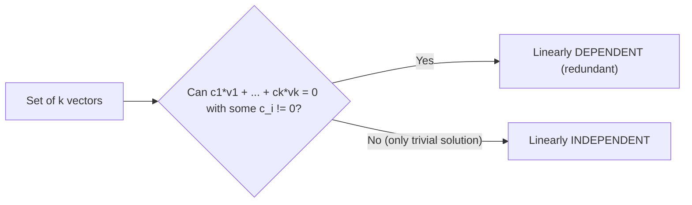
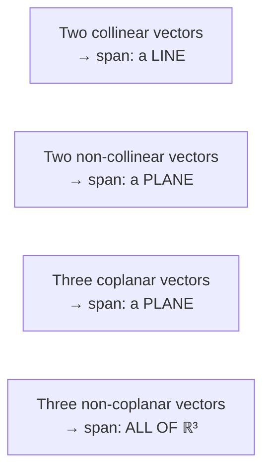
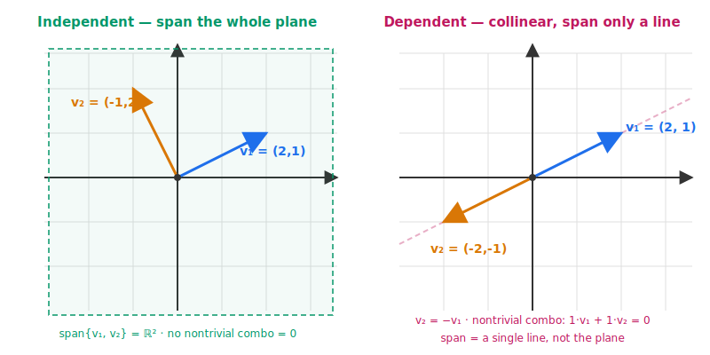
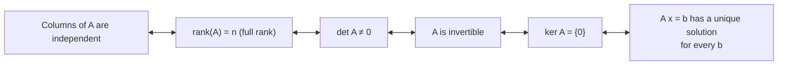

# 8 - Linear Independence

[toc]

> **TL;DR:** A set of vectors is **linearly independent** when no vector can be built from the others — every one of them adds a new direction. A set is **linearly dependent** when at least one is a redundant linear combination of the rest. Independence is the criterion for "no wasted vectors," and it is what separates a minimal *basis* from an arbitrary *generating set*.

## Vocabulary

**Linear combination**: A weighted sum of vectors using scalar weights c₁, …, c_k.

```math
c_1 \mathbf{v}_1 + c_2 \mathbf{v}_2 + \cdots + c_k \mathbf{v}_k
```

---

**Trivial combination**: All coefficients are zero. Gives the zero vector.

```math
0 \cdot \mathbf{v}_1 + 0 \cdot \mathbf{v}_2 + \cdots + 0 \cdot \mathbf{v}_k = \mathbf{0}
```

---

**Nontrivial combination**: At least one coefficient is nonzero.

```math
\exists\, i:\; c_i \neq 0
```

---

**Linearly dependent**: There exists a nontrivial linear combination that equals zero. Equivalently, at least one vector is a linear combination of the others.

```math
\exists\, (c_1, \ldots, c_k) \neq \mathbf{0}\;\text{with}\; c_1\mathbf{v}_1 + \cdots + c_k\mathbf{v}_k = \mathbf{0}
```

---

**Linearly independent**: The only linear combination equal to zero is the trivial one. Equivalently, no vector in the set is a linear combination of the others.

```math
c_1 \mathbf{v}_1 + \cdots + c_k \mathbf{v}_k = \mathbf{0} \;\Longrightarrow\; c_1 = c_2 = \cdots = c_k = 0
```

---

**Generating set / spanning set**: A set whose span is the entire vector space V. May contain redundant vectors.

```math
\operatorname{span}(S) = V
```

---

**Span**: The set of all linear combinations of vectors in S. Always a subspace.

```math
\operatorname{span}(S) = \{\, c_1 \mathbf{v}_1 + \cdots + c_k \mathbf{v}_k : \mathbf{v}_i \in S,\, c_i \in \mathbb{R} \,\}
```

---

**Collinearity**: Two nonzero vectors are collinear iff one is a scalar multiple of the other. Equivalently, they are linearly dependent.

```math
\mathbf{v} = c\, \mathbf{u} \quad \text{for some } c \in \mathbb{R}
```

---

**Coplanarity**: Three vectors are coplanar iff they are linearly dependent — their span has dimension at most 2.

```math
\dim \operatorname{span}\{\mathbf{u}, \mathbf{v}, \mathbf{w}\} \le 2
```

---

## Intuition

Imagine you are building a route system in a city. Each vector is a road direction (N, NE, E, etc.). If you have "go north" and "go south," one of them is redundant — going north 5 units undoes going south 5 units. They are *linearly dependent*: one is a scalar multiple of the other. If you have "go north" and "go east," neither one can be built from the other; together they reach every point in the plane. They are *linearly independent*.

The defining test is symmetric and clean: a set is independent if and only if the **only** way to combine the vectors to get the zero vector is to multiply each by zero. If any other combination produces zero, you have found a redundant vector — one of them can be solved for in terms of the others.



## The Formal Definition

A set {v₁, …, v_k} ⊆ V is **linearly independent** if the *only* way to combine them to zero is to multiply each by zero:

```math
c_1 \mathbf{v}_1 + c_2 \mathbf{v}_2 + \cdots + c_k \mathbf{v}_k = \mathbf{0} \;\;\Longrightarrow\;\; c_1 = c_2 = \cdots = c_k = 0
```

If there exists a choice of scalars **not all zero** making the sum zero, the set is **linearly dependent**. Equivalently, a set is dependent iff some v_i can be written as a linear combination of the others.

> [!IMPORTANT]
> Independence is a property of the **set**, not of an individual vector. A vector is never "independent" or "dependent" on its own — only in the context of a collection. (Edge case: a single nonzero vector forms an independent set by itself; the zero vector alone is dependent because 1 · 0 = 0 with a nonzero coefficient.)

## Linear Combinations and Span

A **linear combination** of v₁, …, v_k is just a sum of scalar multiples. The collection of *all* possible linear combinations is the **span**:

```math
\operatorname{span}\{\mathbf{v}_1, \ldots, \mathbf{v}_k\} = \{\, c_1 \mathbf{v}_1 + \cdots + c_k \mathbf{v}_k : c_i \in \mathbb{R} \,\}
```

The span is a subspace and is the smallest subspace containing the original vectors.

If the set is dependent, the span equals the span of a *smaller* subset — some vector contributed nothing new. If the set is independent, **removing any vector strictly shrinks the span**. That is what "no wasted vectors" means.

## Three Equivalent Characterisations

Independence can be stated three ways. Each is more useful in a different setting; verifying one suffices.

1. **Definition** — the only solution to c₁ v₁ + … + c_k v_k = 0 is the trivial one.
2. **Redundancy view** — no v_i is a linear combination of the others.
3. **Matrix view** — stack the vectors as columns of a matrix A; the columns are independent iff ker A = {0}, iff A has full column rank.

The matrix view is the one you compute with — running Gaussian elimination on [v₁ | … | v_k] tells you the rank, and rank-versus-k tells you whether the set is independent.

## Worked Examples

### Example 1 — independent pair in ℝ²

```math
\mathbf{v}_1 = \begin{bmatrix} 1 \\ 0 \end{bmatrix}, \qquad \mathbf{v}_2 = \begin{bmatrix} 0 \\ 1 \end{bmatrix}
```

The equation c₁ v₁ + c₂ v₂ = 0 becomes (c₁, c₂) = (0, 0), so only the trivial solution exists. The set is independent and spans ℝ² — it is the **standard basis**.

### Example 2 — dependent triple in ℝ²

```math
\mathbf{v}_1 = \begin{bmatrix} 1 \\ 0 \end{bmatrix}, \qquad \mathbf{v}_2 = \begin{bmatrix} 0 \\ 1 \end{bmatrix}, \qquad \mathbf{v}_3 = \begin{bmatrix} 1 \\ 1 \end{bmatrix}
```

We can write v₃ = v₁ + v₂. Equivalently:

```math
1 \cdot \mathbf{v}_1 + 1 \cdot \mathbf{v}_2 - 1 \cdot \mathbf{v}_3 = \mathbf{0}
```

This is a nontrivial combination giving zero, so the set is dependent. Note that **any three vectors in ℝ² are automatically dependent** because the space has only two independent directions.

### Example 3 — tricky dependent triple in ℝ³

```math
\mathbf{v}_1 = \begin{bmatrix} 1 \\ 2 \\ 3 \end{bmatrix}, \qquad \mathbf{v}_2 = \begin{bmatrix} 2 \\ 4 \\ 6 \end{bmatrix}, \qquad \mathbf{v}_3 = \begin{bmatrix} 1 \\ 1 \\ 0 \end{bmatrix}
```

Here v₂ = 2 v₁, so the set is dependent — v₂ is collinear with v₁. The span is only 2-dimensional even though we have three vectors. Removing v₂ leaves an independent set with the same span.

> [!WARNING]
> "k vectors in ℝⁿ with k ≤ n" does **not** imply independence. The vectors can still be dependent — collinear pairs, coplanar triples in ℝ³, and so on. You must check.

## Geometric Picture

In ℝ²:

- **One** nonzero vector is independent — its span is a line through the origin.
- **Two** non-collinear vectors are independent — their span is the whole plane ℝ².
- **Two** collinear vectors are dependent — their span is just a line.

In ℝ³:

- **Three** vectors are independent iff they do not all lie in a common plane through the origin.
- If they are coplanar, they are dependent and span only a 2-D subspace (a plane).



In 2D, the difference is sharp: two non-collinear arrows reach the whole plane; two collinear arrows reach only the line they share.



## Generating Sets vs. Independent Sets

A **generating set** for V is any set whose span is all of V. There can be redundancy — you can throw in extra vectors and still generate the same space. An **independent set** has no redundancy but may not generate the whole space. A **basis** (next note) is precisely a generating set that is *also* independent — **the minimum-size generating set, the maximum-size independent set, both at once.**

| Property | Independent | Spanning | Basis |
| :--- | :---: | :---: | :---: |
| No nontrivial combo = 0 | ✓ | not required | ✓ |
| Spans V | not required | ✓ | ✓ |
| Minimum vectors needed | ≤ dim V | ≥ dim V | exactly dim V |
| Can shrink without losing property? | ✗ | sometimes | ✗ |
| Can grow without losing property? | sometimes | ✓ | ✗ |

## Connection to Rank, Determinant, and Invertibility

For columns of a **square** matrix A of size (n, n), all of the following are equivalent — different views of the same fact:

1. The columns of A are linearly independent.
2. A has full rank: rank(A) = n.
3. det A ≠ 0.
4. A is invertible.
5. ker A = {0}.
6. A x = b has a unique solution for every b ∈ ℝⁿ.



This list is sometimes called the **Invertible Matrix Theorem**. Internalising it is one of the biggest "everything clicks" moments in linear algebra: independence, rank, determinant, invertibility, and unique solvability are not separate ideas — they are the same idea seen from different angles.

> [!TIP]
> In ML, "linearly dependent features" is a polite way of saying "you have wasted columns in your design matrix." Linear regression on a dependent feature matrix has no unique solution; **ridge regression** is one way to break the tie. **PCA** detects dependence by finding zero (or near-zero) singular values; that is why PCA can compress data with little loss when features are correlated.

## Real-world Example

Below we (1) construct independent and dependent sets, (2) use rank to detect dependence, and (3) show how dependence wrecks `np.linalg.solve` but `np.linalg.lstsq` survives.

```python
import numpy as np

# ---- (1) Three vectors in R^3: independent triple ----
V_indep = np.array([
    [1, 0, 0],
    [0, 1, 0],
    [0, 0, 1],
], dtype=float).T   # columns = vectors

print("rank of independent set:", np.linalg.matrix_rank(V_indep))   # 3
# Spans all of R^3

# ---- (2) Dependent triple (v2 = 2*v1) ----
V_dep = np.array([
    [1, 2, 3],
    [2, 4, 6],
    [1, 1, 0],
], dtype=float).T

print("rank of dependent set:  ", np.linalg.matrix_rank(V_dep))     # 2 (not 3!)
# Span has dimension 2 — a plane in R^3.

# ---- (3) Solve a system with independent vs dependent columns ----
b = np.array([1.0, 2.0, 3.0])

# Works:
x1 = np.linalg.solve(V_indep, b)
print("Solve (independent):", x1)

# Fails: singular matrix
try:
    np.linalg.solve(V_dep, b)
except np.linalg.LinAlgError as e:
    print("Solve (dependent): LinAlgError —", e)

# lstsq survives by giving the pseudo-inverse / least-squares answer
x_ls, residuals, rank, sv = np.linalg.lstsq(V_dep, b, rcond=None)
print("lstsq (dependent): x =", x_ls, "rank reported =", rank)

# ---- (4) Test independence with np.linalg.matrix_rank ----
def is_independent(vectors: np.ndarray) -> bool:
    """vectors is a matrix whose COLUMNS are the candidate vectors."""
    return np.linalg.matrix_rank(vectors) == vectors.shape[1]

print("indep set is independent? ", is_independent(V_indep))   # True
print("dep set is independent?   ", is_independent(V_dep))     # False

# ---- (5) Standard basis is always independent ----
I = np.eye(5)
print("Standard basis of R^5 is independent?", is_independent(I))   # True
```

> [!NOTE]
> `np.linalg.matrix_rank` uses a tolerance to decide whether a singular value is "really zero." With noisy data, two columns that are theoretically dependent may appear independent to NumPy. When you care, pass an explicit `tol` argument; for cleaner detection, look at the singular values from `np.linalg.svd` and see whether any are negligible compared to the largest.

## In Practice

Independence is one of the most-checked properties in real ML systems, usually implicitly:

- **Feature selection:** correlated features create a near-dependent design matrix, inflating variance in linear models. Tools like VIF (variance inflation factor) measure how close to dependent your features are.
- **Multicollinearity in regression:** dependent features mean the regression solution is not unique. Ridge regression breaks the tie deterministically by adding λ I to Aᵀ A.
- **PCA:** the singular values of a centred data matrix tell you the *effective* number of independent directions; small singular values indicate near-dependence.
- **Neural-network weight pruning:** rows of a weight matrix can be near-dependent. Pruning takes advantage of this redundancy to shrink models with little accuracy loss.
- **Numerical conditioning:** as columns approach dependence, the condition number κ(A) = σ_max / σ_min blows up. Conditioning is the practical face of independence.

> [!CAUTION]
> In floating-point arithmetic, no two real-world vectors are *exactly* independent or dependent — there is only "how close to dependence" measured by the smallest singular value. Treat near-dependence as a numerical risk, not a binary failure: the question is not "is rank 3?" but "is the smallest singular value much larger than ε · σ_max?".

## Pitfalls

- **"Independence is a property of one vector."** — It is a property of a *set* of vectors. A vector is never "independent" alone (except trivially: a single nonzero vector).
- **"If two vectors are not equal, they are independent."** — Wrong: they could be scalar multiples ( **v** and $3\mathbf{v}$ are not equal but are collinear and dependent).
- **"k vectors in ℝⁿ with k ≤ n are independent."** — Not necessarily. Independence has to be tested; it is not guaranteed by counting.
- **"k vectors in ℝⁿ with k > n are independent if they are 'all different'."** — They can never be independent. Any set of more than n vectors in ℝⁿ is dependent — the pigeonhole-like result follows from rank ≤ n.
- **"Dependent means useless."** — Dependent vectors are redundant *for spanning*, but they may still encode useful information (e.g. as features) — they just do not contribute new directions to the span.

## Exercises

### Exercise 1 — Test independence by inspection

For each set of vectors, decide whether the set is linearly independent. Justify each.

1. {(1, 0), (0, 1), (3, 4)} in ℝ²
2. {(1, 2, 3), (2, 4, 6)} in ℝ³
3. {(1, 0, 0), (0, 1, 0), (0, 0, 1)} in ℝ³
4. {(1, 1), (1, −1), (1, 0)} in ℝ²

#### Solution 1

1. **Dependent.** Any 3 vectors in ℝ² are automatically dependent — the space has only 2 independent directions. Explicitly: (3, 4) = 3·(1, 0) + 4·(0, 1).
2. **Dependent.** (2, 4, 6) = 2·(1, 2, 3). Two collinear vectors are always dependent.
3. **Independent.** This is the standard basis of ℝ³. The only way to get c₁ e₁ + c₂ e₂ + c₃ e₃ = 0 is c₁ = c₂ = c₃ = 0.
4. **Dependent.** Three vectors in ℝ² cannot be independent. Explicitly: (1, 0) = (1/2)·(1, 1) + (1/2)·(1, −1).

> [!TIP]
> **The k-vs-n rule:** in ℝⁿ, a set of more than n vectors is always dependent; a set of fewer than n vectors *can* be independent or dependent (you must check). When k > n, you can stop checking and declare dependent.

### Exercise 2 — Test by reduction to RREF

Determine whether {v₁, v₂, v₃} is independent, where:

```math
\mathbf{v}_1 = \begin{bmatrix} 1 \\ 2 \\ 3 \end{bmatrix},\;\; \mathbf{v}_2 = \begin{bmatrix} 4 \\ 5 \\ 6 \end{bmatrix},\;\; \mathbf{v}_3 = \begin{bmatrix} 7 \\ 8 \\ 9 \end{bmatrix}
```

#### Solution 2

Stack as columns:

```math
A = \begin{bmatrix} 1 & 4 & 7 \\ 2 & 5 & 8 \\ 3 & 6 & 9 \end{bmatrix}
```

Reduce to REF: R₂ → R₂ − 2 R₁, R₃ → R₃ − 3 R₁:

```math
\left[\begin{array}{rrr}
1 & 4 & 7 \\
0 & -3 & -6 \\
0 & -6 & -12
\end{array}\right]
```

R₃ → R₃ − 2 R₂:

```math
\left[\begin{array}{rrr}
1 & 4 & 7 \\
0 & -3 & -6 \\
0 & 0 & 0
\end{array}\right]
```

**Only 2 pivots** for 3 columns. Therefore rank A = 2, and the vectors are **dependent**. The null space is 1-D — there is exactly one non-trivial relation. To find it: from R₂, x₂ = −2 x₃; from R₁, x₁ = −4 x₂ − 7 x₃ = 8 x₃ − 7 x₃ = x₃. So with x₃ = 1: (x₁, x₂, x₃) = (1, −2, 1), meaning **v₁ − 2 v₂ + v₃ = 0**.

Verify: (1, 2, 3) − 2·(4, 5, 6) + (7, 8, 9) = (1 − 8 + 7, 2 − 10 + 8, 3 − 12 + 9) = (0, 0, 0). ✓

### Exercise 3 — Build a maximal independent subset

From the set {(1, 0, 1), (2, 1, 3), (3, 1, 4), (1, 1, 2)} in ℝ³, extract a maximally independent subset (i.e., one that spans the same subspace but has no redundancy).

#### Solution 3

Stack as columns and reduce:

```math
A = \begin{bmatrix} 1 & 2 & 3 & 1 \\ 0 & 1 & 1 & 1 \\ 1 & 3 & 4 & 2 \end{bmatrix}
```

R₃ → R₃ − R₁:

```math
\left[\begin{array}{rrrr}
1 & 2 & 3 & 1 \\
0 & 1 & 1 & 1 \\
0 & 1 & 1 & 1
\end{array}\right]
```

R₃ → R₃ − R₂:

```math
\left[\begin{array}{rrrr}
1 & 2 & 3 & 1 \\
0 & 1 & 1 & 1 \\
0 & 0 & 0 & 0
\end{array}\right]
```

Pivots in columns 1 and 2. **Take the original columns 1 and 2** from A:

```math
\{(1, 0, 1)^\top,\; (2, 1, 3)^\top\}
```

This is a maximally independent subset (rank = 2). The other two original vectors are linear combinations of these.

> [!IMPORTANT]
> **Take the original columns, not the RREF columns.** The RREF tells you *which positions* are pivots, but the columns themselves change under row operations. Always read pivot positions from the RREF, then go back to A and grab those *original* columns.

### Exercise 4 — Independence and the Invertible Matrix Theorem

A square matrix A has the property that A x = 0 has only the solution x = 0. What can you conclude about A? List as many equivalent statements as possible.

#### Solution 4

A x = 0 having only the trivial solution means **ker A = {0}**. By the **Invertible Matrix Theorem**, the following statements are *all equivalent* — knowing one is true means all the others are true:

1. ker A = {0}.
2. The columns of A are **linearly independent**.
3. The rows of A are linearly independent.
4. rank A = n (full rank).
5. det A ≠ 0.
6. A is invertible (A⁻¹ exists).
7. A x = b has a **unique solution** for every b ∈ ℝⁿ.
8. A is surjective (im A = ℝⁿ).
9. A is injective.
10. A is bijective as a linear map ℝⁿ → ℝⁿ.

In ML this fact is everywhere: when a design matrix has full column rank, OLS regression has a unique closed-form solution (Aᵀ A)⁻¹ Aᵀ b; when it does not, you must regularise or switch to the pseudoinverse.

## Sources

- Deisenroth, M. P., Faisal, A. A., & Ong, C. S. (2020). *Mathematics for Machine Learning*. Chapter 2.5. https://mml-book.github.io/
- Strang, G. MIT 18.06 Lecture 9 (independence, basis, dimension). https://ocw.mit.edu/courses/18-06-linear-algebra-spring-2010/
- Axler, S. (2015). *Linear Algebra Done Right* (3rd ed.). Chapter 2.

## Related

- [5 - Null Space and Pseudoinverse](./5-null-space-and-pseudoinverse.md)
- [7 - Vector Spaces](./7-vector-spaces.md)
- [9 - Basis and Rank](./9-basis-and-rank.md)
