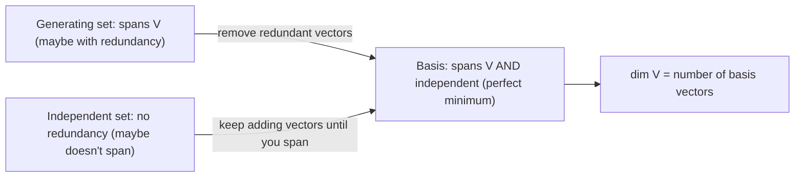
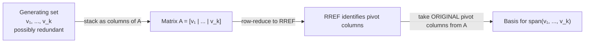
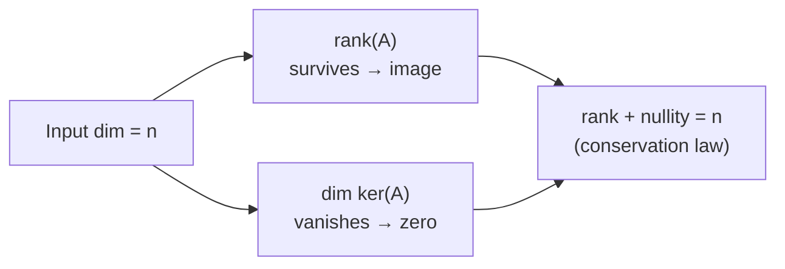
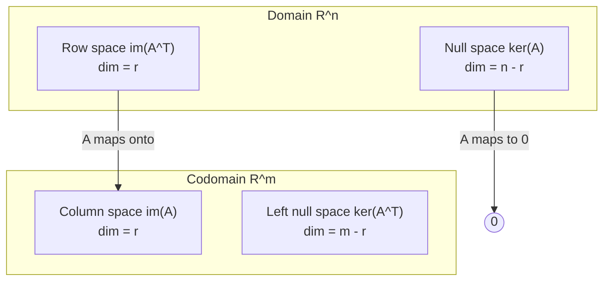
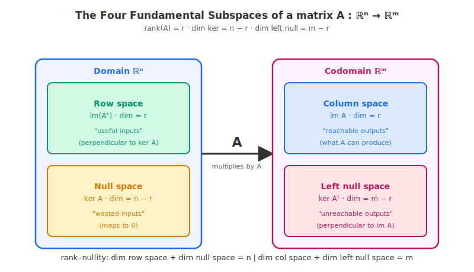

# 9 - Basis and Rank

[toc]

> **TL;DR:** A **basis** is a linearly independent set that spans the entire vector space — the smallest possible *generating* set and the largest possible *independent* set. Its size is the **dimension** of the space. The **rank** of a matrix is the dimension of its column space and the single most informative scalar summary of a matrix's behaviour: it tells you how many independent directions A actually uses.

## Vocabulary

**Basis**: A linearly independent set that spans the entire vector space V. Every vector in V has a **unique** expansion as a linear combination of basis vectors.

```math
B = \{\mathbf{b}_1, \mathbf{b}_2, \ldots, \mathbf{b}_n\}
```

---

**Standard basis**: For ℝⁿ, the basis where the i-th vector has a 1 in position i and zeros elsewhere.

```math
\{\mathbf{e}_1, \mathbf{e}_2, \ldots, \mathbf{e}_n\}
```

---

**Dimension**: The common size of every basis of V. An intrinsic property of the space.

```math
\dim V
```

---

**Coordinates / components**: For an expansion v = c₁ b₁ + … + c_n b_n, the scalars (c₁, …, c_n) are the coordinates of v relative to basis B.

```math
[\mathbf{v}]_B = (c_1, c_2, \ldots, c_n)^\top
```

---

**Rank**: The dimension of the column space of A. Equivalently, the dimension of the row space.

```math
\operatorname{rank}(A) = \dim \operatorname{im}(A) = \dim \operatorname{im}(A^\top)
```

---

**Full column rank**: The rank equals the number of columns; the columns are linearly independent.

```math
\operatorname{rank}(A) = n
```

---

**Full row rank**: The rank equals the number of rows; the rows are linearly independent.

```math
\operatorname{rank}(A) = m
```

---

**Rank deficiency**: The rank is strictly less than the smaller of the two dimensions — there is redundancy among columns or rows.

```math
\operatorname{rank}(A) < \min(m, n)
```

---

**Rank–nullity theorem**: For any matrix A of shape m × n, the rank plus the nullity equals the number of columns.

```math
\operatorname{rank}(A) + \dim \ker(A) = n
```

---

**Effective rank**: In numerical practice, the number of singular values "significantly" larger than zero. Distinct from algebraic rank when working with noisy data.

```math
\#\{\, i : \sigma_i > \tau \cdot \sigma_{\max} \,\}
```

---

## Intuition

The dimension of a vector space is the number of *independent directions* you need to describe every point in the space. To pin down a point in ℝ³, you need three numbers — that is what makes ℝ³ three-dimensional. A basis is the *coordinate system* you use to assign those numbers: each basis vector points along one of the independent directions, and a vector's components are its measurements along those directions.

The rank of a matrix A is the dimension of the *image* of A — the subspace of outputs A can actually produce. If A ∈ ℝ^(5×3) has rank 2, then no matter what input you give it, the output lies in a 2-dimensional plane inside ℝ⁵. The other dimensions of ℝ⁵ are unreachable. Rank is *how much of the codomain A can hit*.



## What a Basis Is

A basis B = {b₁, …, bₙ} of a vector space V must satisfy two conditions:

1. **Spans V:** every vector v ∈ V can be written as v = c₁ b₁ + … + cₙ bₙ for some choice of scalars.
2. **Independent:** the only way to combine the b_i to get **0** is with all c_i = 0.

The two conditions together imply that the expansion in (1) is **unique** — for each **v** there is exactly one tuple (c₁, …, cₙ) giving it. Those c_i are the **coordinates** of **v** in basis B.

### The standard basis of ℝⁿ

The standard basis is the simplest example:

```math
\mathbf{e}_1 = \begin{bmatrix} 1 \\ 0 \\ \vdots \\ 0 \end{bmatrix}, \qquad
\mathbf{e}_2 = \begin{bmatrix} 0 \\ 1 \\ \vdots \\ 0 \end{bmatrix}, \qquad \ldots, \qquad
\mathbf{e}_n = \begin{bmatrix} 0 \\ 0 \\ \vdots \\ 1 \end{bmatrix}
```

In this basis, the coordinates of v are *just* the entries of v. That is the secret to why the standard basis feels invisible: **coordinates and entries coincide**.

### Bases are not unique

A vector space has *many* bases. ℝ² has bases including:

- The standard basis {e₁, e₂}.
- The rotated basis {(1/√2, 1/√2)ᵀ, (−1/√2, 1/√2)ᵀ} — rotated 45° from standard.
- The basis {(1, 0)ᵀ, (1, 1)ᵀ} — non-orthogonal but still a basis.

All have size 2 because dim ℝ² = 2 — that is the invariant.

> [!IMPORTANT]
> **Every basis of a given vector space has the same number of elements.** This is the foundational theorem that makes dimension a well-defined quantity. Different bases give different **coordinates** but never different **dimensions**.

## Dimension

The dimension dim V is the size of any basis of V. Common examples:

| Vector space | Dimension | A standard basis |
| :--- | :---: | :--- |
| ℝⁿ | n | e₁, …, eₙ |
| ℝ^(m×n) (all matrices) | m · n | E_(ij) (one 1, rest 0) for each (i, j) |
| ℙₙ (polynomials of degree ≤ n) | n + 1 | {1, x, x², …, xⁿ} |
| {0} (zero subspace) | 0 | empty set |
| C[0, 1] (continuous functions) | ∞ | no finite basis; use Fourier, wavelets, etc. |

Subspaces inherit dimension from how many independent directions they admit: a line through the origin in ℝ³ is 1-D, a plane through the origin is 2-D, and {0} alone is 0-D.

## Determining a Basis from a Generating Set

Given a spanning set with potentially redundant vectors, you can extract a basis by removing dependencies. The mechanical procedure:

1. Stack the candidate vectors as **columns** of a matrix A.
2. Reduce A to RREF (see [4 - Solving Systems of Linear Equations](./4-solving-systems-of-linear-equations.md)).
3. Identify pivot columns.
4. The **original columns of A** corresponding to the pivot positions form a basis for the span.



> [!WARNING]
> Take the **original** columns of A, **not** the columns of the RREF. The RREF tells you which positions are pivots, but the columns themselves change under row operations. The original pivot columns are the ones you want as basis vectors.

## What Is Rank?

For A with shape (m, n), the **rank** is the dimension of the column space — equivalently, the maximum number of linearly independent columns. Several equivalent definitions:

- rank(A) = number of pivots in the RREF of A.
- rank(A) = number of nonzero singular values of A.
- rank(A) = dim(im A).
- rank(A) = rank(Aᵀ) — column rank equals row rank, an elegant theorem.

The last identity is non-obvious: it says the dimension of the column space and the dimension of the row space are **always equal**, even though the columns and rows live in spaces of different dimensions (ℝᵐ and ℝⁿ).

### Bounds on rank

```math
0 \le \operatorname{rank}(A) \le \min(m, n)
```

When rank(A) = min(m, n), A has **full rank**. Anything less is **rank-deficient** and signals redundancy — either among columns (when n < m) or among rows (when m < n) or both.

## The Rank–Nullity Theorem

The most important structural theorem in this note. For A with shape (m, n):

```math
\operatorname{rank}(A) + \dim \ker(A) = n
```

In words: the number of "useful" input directions (rank) plus the number of "wasted" input directions (the null-space dimension) equals the total number of input dimensions n. **Every input direction either contributes to the output (counts toward rank) or is squashed to zero (counts toward nullity).** There is no other place for dimensions to go.



> [!TIP]
> Rank–nullity is a **conservation law**. When a paper says "the kernel has dimension k, so the image has dimension n − k," that is rank–nullity invoked. It is also how you reason about **pruning** in neural networks: zeroing out a weight matrix's rank-1 component reduces rank by 1, increases nullity by 1, and removes one independent output direction from that layer.

## The Four Fundamental Subspaces

Every matrix A ∈ ℝ^(m×n) gives rise to four subspaces, two in ℝⁿ and two in ℝᵐ. These are Strang's *Four Fundamental Subspaces*:

| Subspace | Lives in | Dimension | Geometric meaning |
| :--- | :---: | :---: | :--- |
| Column space im A | ℝᵐ | rank(A) = r | "What A can output" |
| Null space ker A | ℝⁿ | n - r | "Inputs A crushes to zero" |
| Row space im Aᵀ | ℝⁿ | r | "Independent equations" |
| Left null space ker Aᵀ | ℝᵐ | m - r | "Outputs A cannot create" |

The dimensions of these four subspaces satisfy rank–nullity in ℝⁿ (column space + null space dimensions = n ) and in ℝᵐ (row space + left null space dimensions = m ). All four bases are read directly off the SVD or the RREF.





## Real-world Example

Below we (1) extract a basis from a redundant generating set, (2) verify the rank–nullity theorem, and (3) compute rank both algebraically (RREF) and numerically (SVD).

```python
import numpy as np
from sympy import Matrix

# ---- (1) Pull a basis out of a redundant generating set in R^4 ----
# Five candidate vectors; one is a duplicate, one is a combination of others.
V = np.array([
    [1, 0, 0, 1, 2],
    [2, 1, 0, 3, 2],
    [3, 1, 1, 4, 3],
    [4, 2, 0, 6, 4],
], dtype=float)
# Columns = candidate vectors

# Find pivot columns via SymPy RREF
rref_mat, pivot_cols = Matrix(V).rref()
print("Pivot columns of V:", pivot_cols)
basis_cols = V[:, list(pivot_cols)]
print("Basis (taken from ORIGINAL columns):")
print(basis_cols)

# These pivot columns span the same subspace as the originals but are independent.
assert np.linalg.matrix_rank(basis_cols) == len(pivot_cols)

# ---- (2) Rank-nullity ----
from scipy.linalg import null_space

A = np.array([
    [1, 2, 3, 4],
    [2, 4, 6, 8],
    [1, 1, 1, 1],
], dtype=float)   # rows 1 and 2 are dependent

r = np.linalg.matrix_rank(A)
n = A.shape[1]
nullity = null_space(A).shape[1]
print(f"rank = {r}, nullity = {nullity}, n = {n}")
assert r + nullity == n
print("rank-nullity verified: r + nullity = n ✓")

# ---- (3) Numerical rank from SVD ----
# Rank-1 perturbed by tiny noise to mimic floating-point reality
A_clean = np.outer([1, 2, 3], [4, 5, 6])      # rank 1
A_noisy = A_clean + 1e-12 * np.random.randn(3, 3)
sv = np.linalg.svd(A_noisy, compute_uv=False)
print("Singular values:", sv)
# Naively rank is 3 (no zeros), but effectively rank 1.
print("Naive rank:    ", np.linalg.matrix_rank(A_noisy))
print("Effective rank:", np.linalg.matrix_rank(A_noisy, tol=1e-8))

# ---- (4) The standard basis as a sanity check ----
I = np.eye(4)
print("Standard basis spans R^4:", np.linalg.matrix_rank(I) == 4)   # True
print("Standard basis is independent:", np.linalg.matrix_rank(I) == I.shape[1])
```

> [!NOTE]
> When the user says "what is the dimension of this subspace?" they almost always mean "compute the rank of the matrix whose columns span it." Dimension and rank become the same number for column spaces. The fact that rank is the *same* whether you take the column or row space is the deep theorem.

## In Practice

Rank is the practitioner's diagnostic for a matrix's health:

- **Effective rank from SVD** — when you have a noisy data matrix, the count of "significant" singular values is the dimension of the underlying signal. Drop-off in singular values is the standard PCA story.
- **Compression / low-rank approximation** — if A has rank r ≪ min(m, n), it can be stored in ~ r(m + n) numbers instead of m·n. This is the core idea behind LoRA, low-rank adapters, and most matrix-factorisation methods.
- **Conditioning** — the ratio σ_max / σ_min is the condition number; near-rank-deficiency means a huge condition number means numerical instability.
- **Identifiability** — if your design matrix is rank-deficient, your model parameters are not identifiable: many parameter vectors fit the data equally well. Regularisation is the usual cure.

> [!CAUTION]
> Numerical rank is fragile. `np.linalg.matrix_rank` uses a default tolerance proportional to σ_max, but with poorly scaled data this can be misleading. Always look at the singular values themselves (`np.linalg.svd(A, compute_uv=False)`) and decide where the meaningful drop is.

## Pitfalls

- **"Rank is the number of nonzero rows."** — Only after RREF, not for the original matrix. For A as given, rank is best computed via SVD or RREF.
- **"Different bases give different dimensions."** — No: dimension is invariant. Different bases give different *coordinates*.
- **"A square matrix has the same row and column rank because it is square."** — Row and column rank are equal for **every** matrix, square or not. This is Strang's first theorem.
- **"Rank-deficient matrices are pathological."** — In ML, nearly all real-world matrices are *effectively* rank-deficient: data lives on lower-dimensional manifolds. The pathology is the assumption of full rank.
- **"The columns of the RREF are a basis for the column space."** — Wrong: the columns of the RREF lie in a *different* column space. Use the **original** columns of A at the pivot positions.

## Exercises

### Exercise 1 — Verify a basis

Decide whether each set is a basis for ℝ³. If yes, justify. If no, say what fails (not spanning, not independent, or wrong size).

1. B₁ = {(1, 0, 0), (0, 1, 0), (0, 0, 1)}
2. B₂ = {(1, 1, 0), (1, 0, 1), (0, 1, 1)}
3. B₃ = {(1, 2, 3), (4, 5, 6)}
4. B₄ = {(1, 0, 0), (0, 1, 0), (0, 0, 1), (1, 1, 1)}

#### Solution 1

A basis of ℝ³ must be (a) linearly independent, (b) span ℝ³. For finite-dim spaces, **a set of size n is a basis iff it is independent OR (equivalently) iff it spans** — once you have the right number of vectors, either condition implies the other.

1. **B₁ is a basis** — the standard basis. 3 vectors, independent, spans ℝ³.
2. **B₂ is a basis.** Stack as columns; det = 1·(0·1 − 1·1) − 1·(1·1 − 1·0) + 0 = 1·(−1) − 1·(1) + 0 = −2 ≠ 0. Three independent vectors in ℝ³ form a basis.
3. **B₃ is NOT a basis.** Only 2 vectors in ℝ³ — too few. Two vectors can span at most a 2-D subspace.
4. **B₄ is NOT a basis.** 4 vectors in ℝ³ — too many. Any 4 vectors in ℝ³ are dependent (k > n forces dependence).

### Exercise 2 — Compute the rank

For each matrix, compute the rank by reducing to REF.

```math
A_1 = \begin{bmatrix} 1 & 2 \\ 3 & 6 \end{bmatrix}, \quad A_2 = \begin{bmatrix} 1 & 2 & 3 \\ 0 & 1 & 4 \\ 0 & 0 & 5 \end{bmatrix}, \quad A_3 = \begin{bmatrix} 1 & 2 & 3 \\ 2 & 4 & 6 \\ 1 & 1 & 1 \end{bmatrix}
```

#### Solution 2

1. **A₁** — R₂ → R₂ − 3 R₁ gives `[[1, 2], [0, 0]]`. One pivot. **rank A₁ = 1**.
2. **A₂** — already upper-triangular with nonzero diagonal. Three pivots. **rank A₂ = 3** (full rank).
3. **A₃** — R₂ → R₂ − 2 R₁: `[[1, 2, 3], [0, 0, 0], [1, 1, 1]]`. R₃ → R₃ − R₁: `[[1, 2, 3], [0, 0, 0], [0, −1, −2]]`. Swap rows 2 and 3: `[[1, 2, 3], [0, −1, −2], [0, 0, 0]]`. Two pivots. **rank A₃ = 2**.

### Exercise 3 — Rank–nullity and the four fundamental subspaces

Matrix A has shape (5, 8) and rank 3. State:

1. dim(col space of A).
2. dim(row space of A).
3. dim(null space of A).
4. dim(left null space of A).
5. Verify the two rank–nullity identities for ℝ⁸ and ℝ⁵.

#### Solution 3

Let r = rank = 3, m = 5, n = 8.

1. **dim(col space) = r = 3.** Lives in ℝ⁵.
2. **dim(row space) = r = 3.** Lives in ℝ⁸. (Row rank = column rank — always.)
3. **dim(null space) = n − r = 8 − 3 = 5.** Lives in ℝ⁸.
4. **dim(left null space) = m − r = 5 − 3 = 2.** Lives in ℝ⁵.

5. **Verify:**
   - **In ℝ⁸ (the domain):** row space (3) + null space (5) = 8 = n ✓.
   - **In ℝ⁵ (the codomain):** column space (3) + left null space (2) = 5 = m ✓.

Both rank–nullity identities hold simultaneously. This is the content of the **Fundamental Theorem of Linear Algebra** in its complete form.

### Exercise 4 — Find a basis for the column space

Given:

```math
A = \begin{bmatrix} 1 & 2 & 0 & 3 \\ 0 & 1 & 1 & 1 \\ 2 & 5 & 1 & 7 \end{bmatrix}
```

1. Reduce A to RREF.
2. Identify the pivot columns.
3. State a basis for the column space (im A).
4. State the rank.

#### Solution 4

**Step 1 — RREF.** R₃ → R₃ − 2 R₁:

```math
\begin{bmatrix} 1 & 2 & 0 & 3 \\ 0 & 1 & 1 & 1 \\ 0 & 1 & 1 & 1 \end{bmatrix}
```

R₃ → R₃ − R₂:

```math
\begin{bmatrix} 1 & 2 & 0 & 3 \\ 0 & 1 & 1 & 1 \\ 0 & 0 & 0 & 0 \end{bmatrix}
```

R₁ → R₁ − 2 R₂:

```math
\operatorname{RREF}(A) = \begin{bmatrix} 1 & 0 & -2 & 1 \\ 0 & 1 & 1 & 1 \\ 0 & 0 & 0 & 0 \end{bmatrix}
```

**Step 2 — Pivots are in columns 1 and 2.**

**Step 3 — Basis for column space.** Take the **original** columns 1 and 2 of A:

```math
\operatorname{im} A = \operatorname{span}\!\left\{\, \begin{bmatrix} 1 \\ 0 \\ 2 \end{bmatrix},\; \begin{bmatrix} 2 \\ 1 \\ 5 \end{bmatrix} \,\right\}
```

**Step 4 — rank A = 2.** The column space is a 2-D plane through the origin in ℝ³.

Sanity check via rank–nullity: rank (2) + nullity (n − r = 2) = 4 = number of columns ✓.

## Sources

- Deisenroth, M. P., Faisal, A. A., & Ong, C. S. (2020). *Mathematics for Machine Learning*. Chapter 2.6. https://mml-book.github.io/
- Strang, G. MIT 18.06 Lectures 9–10 (independence, basis, dimension; four fundamental subspaces). https://ocw.mit.edu/courses/18-06-linear-algebra-spring-2010/
- Strang, G. (2009). The Fundamental Theorem of Linear Algebra. *American Mathematical Monthly*, 100(9), 848–855.

## Related

- [4 - Solving Systems of Linear Equations](./4-solving-systems-of-linear-equations.md)
- [5 - Null Space and Pseudoinverse](./5-null-space-and-pseudoinverse.md)
- [7 - Vector Spaces](./7-vector-spaces.md)
- [8 - Linear Independence](./8-linear-independence.md)
- [11 - Matrix Representation of Linear Mappings](./11-matrix-representation-of-linear-mappings.md)
