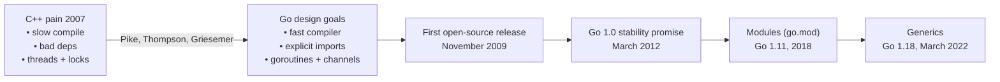

# 1 - What is Go

[toc]

> **TL;DR:** Go is a statically typed, compiled language designed at Google by Rob Pike, Ken Thompson, and Robert Griesemer to address the pain of large-scale C++/Java codebases: slow compilation, byzantine dependency graphs, and poor concurrency primitives. It trades generality for consistency — one obvious way to do each thing — and ships a single self-contained binary with a garbage collector, a goroutine scheduler, and a rich standard library baked in.

## Vocabulary

**Package**: The unit of code organisation and compilation in Go. Every `.go` source file belongs to exactly one package. Packages are the import targets, not individual files.

---

**Module**: A collection of related packages versioned together. Defined by a `go.mod` file at the root. The module path is the canonical import prefix for all packages in the module.

```go
module github.com/acme/myapp

go 1.22
```

---

**Build constraint**: A comment directive that restricts which files are compiled for which OS/arch. Written as `//go:build linux` (Go 1.17+) or the older `// +build linux` form.

---

**Goroutine**: A lightweight, cooperatively and preemptively scheduled execution unit managed by the Go runtime. Not an OS thread. Covered in depth in [7 - Goroutines and Channels](./7-goroutines-and-channels.md).

---

**GOPATH**: The legacy workspace directory. Replaced by modules (Go 1.11+). Still used as the installation root for `go install`-ed binaries (`$GOPATH/bin`).

---

**GOROOT**: The directory where the Go toolchain itself is installed. Not the workspace; not where your code lives.

---

**`go.sum`**: A lock file of cryptographic hashes for every module version in the dependency graph. Guarantees reproducible, tamper-evident builds.

---

**Zero value**: The default value a variable holds when declared without an explicit initialiser. Every type has one. Covered thoroughly in [2 - Types, Zero Values, and Declarations](./2-types-and-zero-values.md).

---

**`init()` function**: A special no-argument, no-return function that runs automatically after package-level variables are initialised, before `main()`. A package can have multiple `init()` functions.

---

## Intuition

Think of Go as "C with a garbage collector, first-class concurrency, and a package manager that doesn't make you cry." The language surface area is tiny by design — there is no inheritance, no operator overloading, no generics-until-1.18, no exceptions. What you lose in expressive power you gain in readability and build speed: a fresh build of a million-line Go project takes seconds, not minutes, because every package's compiled form is cached and the compiler does no header-file re-parsing.

The philosophy is captured in the original design FAQ: "Simplicity is prerequisite for reliability." When there is only one idiomatic way to iterate over a slice, every Go programmer reads every other Go programmer's code without a mental syntax-translation step.

## Why Go Exists — the Design Story

In 2007, Google engineers Rob Pike, Ken Thompson, and Robert Griesemer were waiting for a 45-minute C++ compile to finish and started designing a better language on a whiteboard. They wanted to keep the things C++ got right — static typing, high performance, compiled binaries — while discarding the things that made large-scale development painful.

The three concrete problems they were solving:

1. **Compilation speed.** C++ template instantiation and header parsing meant full rebuilds took tens of minutes. Go's compiler is deliberately simple (no templates, explicit imports not headers) and is fast by design — the entire standard library compiles in seconds.
2. **Dependency management.** C/C++ headers create implicit transitive dependencies. Go requires explicit imports, and unused imports are a compile error. Every package's compiled form (`.a` file) includes its own type information, so the compiler never re-reads transitive sources.
3. **Concurrency.** Threads + locks were the dominant model in 2007. Go baked in goroutines and channels (CSP-style concurrency) at the language level, making it practical to have tens of thousands of concurrent units without the overhead of OS threads.



> [!NOTE]
> Ken Thompson co-invented Unix and C. Rob Pike co-invented UTF-8 with Thompson. When they say the language is designed around "what Google's infrastructure engineers actually need," they speak from direct experience building the systems that Go now helps maintain.

## The Toolchain

Go ships as a single `go` binary that is the compiler, linker, test runner, dependency manager, formatter, and documentation server in one. There is no separate `make`, no separate package manager, no separate formatter to install.

### `go run`

`go run` compiles and immediately executes a Go program without leaving a binary on disk. It is the closest Go has to a scripting feel. Under the hood, it compiles to a temp dir and exec's the result.

```bash
# hello.go
# package main
# func main() { println("hello, world") }

go run hello.go
# hello, world
```

`go run` accepts multiple files or a directory. It does not accept packages by import path — use `go build` or `go install` for that.

### `go build`

`go build` compiles a package and its dependencies into a binary. For the `main` package, the output is an executable. For library packages, no output is written — the build just verifies the code compiles. The result is a statically linked binary (by default on Linux when CGO is disabled) with the Go runtime embedded.

```bash
go build -o myapp ./cmd/myapp
# Produces ./myapp — a self-contained executable, no runtime install needed on target
```

> [!TIP]
> `CGO_ENABLED=0 GOOS=linux GOARCH=amd64 go build -o myapp ./cmd/myapp` produces a fully static Linux binary from a macOS development machine. This is the canonical pattern for building Go containers — the final Docker image can be `FROM scratch` with nothing but the binary.

### `go test`

`go test` finds every `_test.go` file in the named packages and runs them. It is also the benchmark and fuzz-test runner.

```bash
go test ./...                    # test all packages in the module
go test -v ./pkg/...             # verbose: print each test name
go test -run TestFoo ./pkg       # run only tests matching the regex
go test -bench=. -benchmem ./... # run benchmarks with memory alloc stats
go test -fuzz=FuzzParse ./pkg    # fuzz-test the FuzzParse function
go test -race ./...              # enable the race detector
```

### `go mod`

`go mod` manages the module. The three commands you use daily:

```bash
go mod init github.com/acme/myapp   # create go.mod
go mod tidy                          # add missing, remove unused dependencies
go mod download                      # pre-fetch all deps to module cache
```

### `go vet` and `gofmt`

`go vet` runs a suite of static analysis passes that catch real bugs: mismatched `Printf` format strings, unreachable code, suspicious sync usage. It is not a linter; it is a bug finder.

`gofmt` is the canonical formatter. There is no argument about tabs vs spaces in Go: the language ships its own formatter and the community enforces it. Running `gofmt -w .` is always safe.

```bash
go vet ./...
gofmt -l .         # list files that differ from gofmt style
gofmt -w .         # rewrite all files in place
```

> [!IMPORTANT]
> `go vet` is included in `go test` — it runs automatically before tests. Any `go vet` failure fails the test run. This is not optional and cannot be disabled per-invocation; fix the vet errors, they are real bugs.

## The Standard Library Philosophy

Go's standard library is deliberately batteries-included for server-side, networking, and systems work. You can write a production HTTP server, a JSON encoder/decoder, a TLS client, a cryptographic hash, and a concurrent worker pool using only the standard library. The design principle is: if a use case is common enough that most real programs need it, it belongs in the standard library, implemented once and maintained by the core team.

Key packages to know:

| Package | What it provides |
| :--- | :--- |
| `fmt` | Formatted I/O (Printf, Println, Errorf, Sprintf) |
| `errors` | Error creation, wrapping, Is/As |
| `io` | Core I/O interfaces: Reader, Writer, Closer |
| `bufio` | Buffered I/O, line-by-line reading |
| `os` | OS primitives: files, env vars, signals, stdin/stdout |
| `net/http` | Full HTTP/1.1 + HTTP/2 server and client |
| `encoding/json` | JSON encode/decode with struct tags |
| `context` | Cancellation, deadlines, request-scoped values |
| `sync` | Mutex, RWMutex, WaitGroup, Once, Pool |
| `testing` | Table tests, subtests, benchmarks, fuzzing |
| `log/slog` | Structured logging (Go 1.21+) |
| `database/sql` | Database-agnostic SQL interface |
| `crypto/...` | TLS, SHA, AES, RSA, ECDSA — full suite |

> [!NOTE]
> Go does NOT have a built-in GUI toolkit, a built-in ORM, or a built-in web framework. Those live in the third-party ecosystem. The stdlib focuses on infrastructure: networking, concurrency, encoding, and OS integration.

## Real-world Example

Below is the canonical "hello, world" extended to a real server skeleton — the pattern that starts virtually every Go service. Notice: explicit error handling, no framework, stdlib `net/http` only.

```go
// Package main is the entry point for the hello service.
package main

import (
	"errors"
	"fmt"
	"log"
	"net/http"
	"os"
)

// main starts an HTTP server on the port given by the PORT env variable.
// It exits with a non-zero code if the server fails to start.
func main() {
	port := os.Getenv("PORT")
	if port == "" {
		port = "8080"
	}

	mux := http.NewServeMux()
	mux.HandleFunc("/", helloHandler)

	addr := fmt.Sprintf(":%s", port)
	log.Printf("listening on %s", addr)

	if err := http.ListenAndServe(addr, mux); err != nil {
		// http.ListenAndServe only returns on error.
		if !errors.Is(err, http.ErrServerClosed) {
			log.Fatalf("server error: %v", err)
		}
	}
}

// helloHandler writes a greeting to w.
func helloHandler(w http.ResponseWriter, r *http.Request) {
	fmt.Fprintf(w, "hello from Go %s\n", r.URL.Path)
}
```

```bash
go run main.go
# 2026/05/19 10:00:00 listening on :8080

curl localhost:8080/world
# hello from Go /world
```

Every pattern shown here is idiomatic and repeated in production Go services at scale: stdlib only for the HTTP layer, explicit error handling with `log.Fatalf` on fatal startup errors, and `fmt.Fprintf` directly to the `http.ResponseWriter` (which implements `io.Writer`).

## In Practice

Go's single-binary deployment model is a massive operational advantage. The binary embeds the runtime, all package code, and (by default, with CGO disabled) the libc. You ship one file, run it anywhere with a matching OS/arch, and the only failure mode is a missing environment variable — not a missing `.so`, not a wrong Python version, not a missing gem.

Go's compilation speed means the inner loop of development (edit → compile → test) is nearly instant for most codebases. A 500,000-line Go service typically builds in under 5 seconds from scratch; incremental builds (only changed packages) take under a second.

> [!TIP]
> Keep the `go.sum` file committed to version control. Without it, module download is not reproducible and CI is vulnerable to upstream tampering. With it, `go mod verify` can detect if any cached module has been modified after download.

> [!WARNING]
> `init()` functions run in dependency order, and multiple `init()` functions within a single package run in source-file order (alphabetically by filename). Putting side effects — database connections, global state mutation — in `init()` makes code hard to test and hard to reason about. Prefer explicit initialisation in `main()`.

## Pitfalls

- **"Go is a scripting language because of `go run`."** — `go run` compiles to a temp binary; it has the same performance as a built binary. There is no interpreter. The startup latency is compile time, which is near-instant for small files.
- **"Unused imports are a warning."** — They are a compile error. The compiler refuses to build. This is intentional: it prevents dependency bloat and makes the import graph explicit.
- **"GOPATH is where my code lives."** — GOPATH is the legacy pre-modules workspace. Since Go 1.11 modules are the standard. Your code goes anywhere; `go.mod` tells the toolchain what module it belongs to.
- **"I need to run `gofmt` manually."** — Most editors run `gofmt` (or `goimports`) on save. CI should gate on `gofmt -l .` returning empty output. Non-formatted Go code is a social and tooling violation.
- **"Go has no generics."** — Go 1.18 (March 2022) introduced type parameters. See [11 - Generics](./11-generics.md).

## Exercises

### Exercise 1 — Conceptual: What is the Go stability promise?

Go 1.0 was released in March 2012 with a formal compatibility guarantee. Explain what that promise covers and what it explicitly excludes.

#### Solution

The Go 1 compatibility promise states that any program that compiled with Go 1.0 will continue to compile and run correctly with any Go 1.x release, for all x. This covers the language specification (syntax, semantics), the standard library API surface (no removal or incompatible signature changes), and the `go` tool flags.

The promise explicitly excludes:
- The `unsafe` package (which by definition bypasses the type system).
- Operating-system-specific behavior the Go standard library exposes.
- Performance characteristics — the runtime can change scheduling, GC behavior, or memory layout between versions.
- Packages under `golang.org/x/...` (the "sub-repositories") — those have their own versioning.
- Security fixes that must break compatibility to remove a vulnerability.

This promise is why Go is genuinely safe to upgrade. You can go from Go 1.18 to Go 1.22 on a large production codebase and expect the existing tests to pass — and typically you also get a free performance improvement from runtime improvements.

---

### Exercise 2 — Code output: What does this print, and why?

```go
package main

import "fmt"

func init() { fmt.Println("init 1") }
func init() { fmt.Println("init 2") }

func main() { fmt.Println("main") }
```

#### Solution

Output:
```
init 1
init 2
main
```

Go allows multiple `init()` functions in the same file (and across multiple files in the same package). They run in the order they appear in the source — top to bottom within a file, files processed in alphabetical order by filename across a package. All `init()` functions in a package run before `main()`. Neither `init()` function can be called explicitly from user code; they are invoked only by the runtime initialisation sequence.

---

### Exercise 3 — Implementation: Write the minimal `go.mod` for a module

You are starting a new service at import path `github.com/acme/paymentsvc` targeting Go 1.22. Write the `go.mod` content and explain each line.

#### Solution

```
module github.com/acme/paymentsvc

go 1.22
```

Line by line:
- `module github.com/acme/paymentsvc` — declares the module path. This is the canonical prefix for every package in the module. Any package at `./internal/ledger` is imported as `github.com/acme/paymentsvc/internal/ledger`. The path does not need to be a real URL, but using a domain you control prevents collisions in the global module proxy.
- `go 1.22` — the minimum Go version this module requires. The toolchain uses this to enable language features introduced in 1.22 (e.g., loop variable semantics fix) and to warn if the user's installed toolchain is older. After `go mod tidy` adds dependencies, `require` blocks will also appear.

---

### Exercise 4 — Bug finding: Why does this program fail to compile?

```go
package main

import (
	"fmt"
	"os"
)

func main() {
	fmt.Println("hello")
}
```

#### Solution

The import `"os"` is unused. Go treats unused imports as a compile error:

```
./main.go:5:2: "os" imported and not used
```

The fix is either to use the package, or to remove the import. If you need the side-effect of an import without using its exported names (e.g., for a SQL driver's `init()` registration), use the blank import: `import _ "github.com/lib/pq"`. But for `"os"`, there is no side-effect reason — simply delete the import.

---

### Exercise 5 — Toolchain: What is the difference between `go build ./...` and `go vet ./...`?

#### Solution

`go build ./...` compiles every package matching the `./...` pattern and discards the output (since none of these packages is `main`). Its purpose is to verify that the code compiles — it catches type errors, missing imports, syntax errors. It produces no output on success.

`go vet ./...` runs the built-in static analysis suite over every package. It catches things the type checker does not: `fmt.Printf("%d", "a string")` (mismatched format verb), calling `sync.Mutex` by value (which breaks the lock), unreachable code after a `return`, and several more patterns. It emits diagnostics only when it finds problems.

In CI you want both: `go build` guarantees compilation; `go vet` catches real bugs that type-checking misses. `go test` runs `go vet` automatically before executing tests, so in practice your test suite already gates on vet.

## Sources

- Go FAQ: https://go.dev/doc/faq
- The Go Programming Language (Donovan & Kernighan, 2016) — Chapter 1.
- Go 1 and the Future of Go Programs: https://go.dev/doc/go1compat
- Go modules reference: https://go.dev/ref/mod
- Effective Go: https://go.dev/doc/effective_go
- Rob Pike, "Simplicity is Complicated" (GopherCon 2015): https://go.dev/talks/2015/simplicity-is-complicated.slide

## Related

- [2 - Types, Zero Values, and Declarations](./2-types-and-zero-values.md)
- [7 - Goroutines and Channels](./7-goroutines-and-channels.md)
- [11 - Generics](./11-generics.md)
- [12 - Building Production Services in Go](./12-building-production-services.md)
