# 10 - The Standard Library Tour

[toc]

> **TL;DR:** Go's standard library is production-grade and self-contained for the vast majority of server-side work. The packages you will use in every service are `io`, `bufio`, `os`, `fmt`, `strings`, `encoding/json`, `net/http`, `context`, `database/sql`, `testing`, and `log/slog`. Understanding their interfaces and idioms — particularly the `io.Reader`/`io.Writer` chain, `encoding/json`'s struct tag conventions, and `testing`'s table-test + subtest pattern — is the practical foundation for idiomatic Go.

## Vocabulary

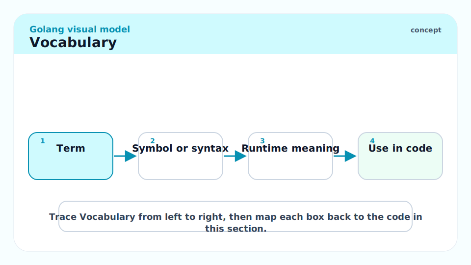

**`io.Reader`**: The interface for sequential byte reading. `Read(p []byte) (n int, err error)`. Returns `io.EOF` when the source is exhausted.

---

**`io.Writer`**: The interface for sequential byte writing. `Write(p []byte) (n int, err error)`.

---

**`bufio.Scanner`**: A line-by-line (or token-by-token) reader over an `io.Reader`. Hides the details of buffering and line splitting.

---

**`encoding/json`**: The standard JSON codec. `json.Marshal` / `json.Unmarshal` for byte slices; `json.Encoder` / `json.Decoder` for streaming. Struct tags control field names and omitempty behavior.

---

**`net/http`**: A full HTTP/1.1 + HTTP/2 server and client. `http.Handler` (interface), `http.HandlerFunc` (adapter), `http.ServeMux` (router), `http.Client` (outbound).

---

**`database/sql`**: A database-agnostic interface for SQL databases. Does not include a driver — you import one via blank import (`_ "github.com/lib/pq"`).

---

**`testing.T`**: The type passed to test functions. Provides `t.Error`, `t.Fatal`, `t.Run` (subtests), `t.Parallel`, and more.

---

**`testing.B`**: The type passed to benchmark functions. `b.N` is the iteration count; `b.ReportAllocs()` enables allocation counting.

---

**`log/slog`**: Go 1.21+ structured logging. Key-value pairs, multiple output handlers (JSON, text), context integration.

---

**`os/exec.Cmd`**: Represents an external command. `Run()`, `Output()`, `Start()` + `Wait()`.

---

## Intuition

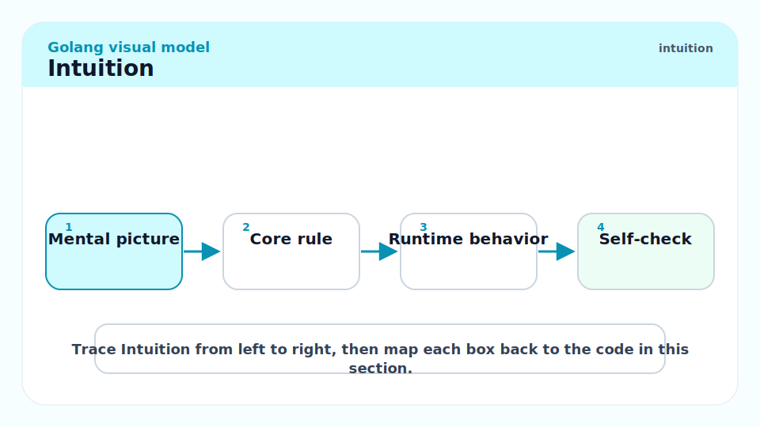

The Go standard library is designed around small interfaces and composition. `io.Reader` and `io.Writer` are the foundation: `os.File` implements both, `bytes.Buffer` implements both, `net.Conn` implements both, a gzip writer wraps any `io.Writer`. Every package in the standard library that reads or writes uses these interfaces, so every data source and sink is interchangeable. Once you understand how to chain readers and writers, you understand how 80% of Go I/O works.

## `io` and `bufio` — I/O Foundations

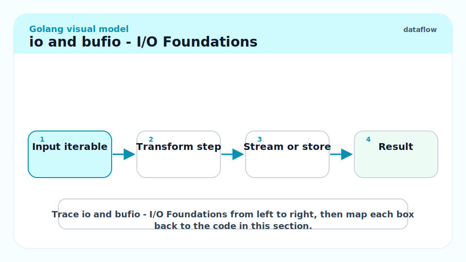

### `io.Reader` and `io.Writer`

The two most fundamental interfaces. Nearly everything in the standard library composes around them.

```go
import (
    "bytes"
    "io"
    "os"
    "strings"
)

// ReadAll reads all bytes from r.
func ReadAll(r io.Reader) ([]byte, error) {
    return io.ReadAll(r)  // stdlib provides this
}

// Pipe: read from a string, write to a file
src := strings.NewReader("hello, world\n")  // io.Reader
dst, _ := os.Create("/tmp/out.txt")          // io.Writer + io.Closer
defer dst.Close()
_, _ = io.Copy(dst, src)                     // copy Reader → Writer

// Chain: wrap a file reader in a gzip decompressor
f, _ := os.Open("data.gz")
defer f.Close()
// gz, _ := gzip.NewReader(f)   // gz is an io.Reader over the decompressed stream
// defer gz.Close()
// io.Copy(os.Stdout, gz)
```

### `bufio.Scanner` — Line Reading

`bufio.Scanner` buffers the underlying reader and provides a convenient scan loop. Default split function is line-by-line.

```go
import (
    "bufio"
    "fmt"
    "strings"
)

input := "line 1\nline 2\nline 3"
scanner := bufio.NewScanner(strings.NewReader(input))
for scanner.Scan() {
    fmt.Println(scanner.Text())
}
if err := scanner.Err(); err != nil {
    fmt.Println("scan error:", err)
}
// line 1
// line 2
// line 3
```

> [!WARNING]
> `bufio.Scanner` has a default buffer size of 64 KB per token (line). If a single line exceeds 64 KB, `scanner.Scan()` returns false and `scanner.Err()` returns `bufio.ErrTooLong`. Fix: call `scanner.Buffer(make([]byte, largeSize), largeSize)` before the scan loop.

## `strings` and `bytes`

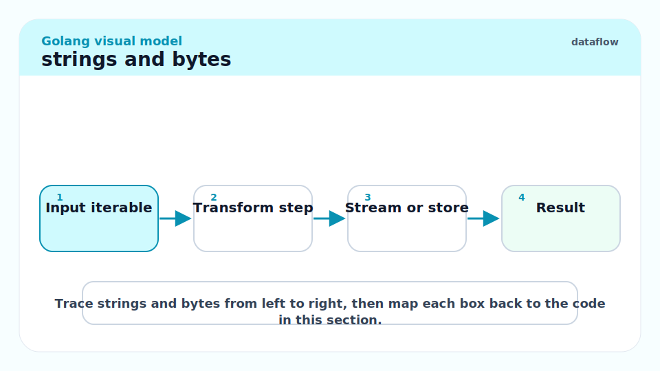

These two packages mirror each other: `strings` operates on `string`, `bytes` on `[]byte`. The `strings` package is heavily used for text processing; `bytes` for binary data and building byte output.

```go
import "strings"

s := "  hello, world  "
fmt.Println(strings.TrimSpace(s))           // "hello, world"
fmt.Println(strings.ToUpper(s))             // "  HELLO, WORLD  "
fmt.Println(strings.Contains(s, "world"))   // true
fmt.Println(strings.Split("a,b,c", ","))    // [a b c]
fmt.Println(strings.Join([]string{"a", "b"}, "-"))  // "a-b"
fmt.Println(strings.HasPrefix(s, "  h"))    // true
fmt.Println(strings.Count(s, "l"))          // 3

// Builder for efficient concatenation
var b strings.Builder
for i := 0; i < 5; i++ {
    fmt.Fprintf(&b, "%d", i)
}
fmt.Println(b.String())  // "01234"
```

## `encoding/json`

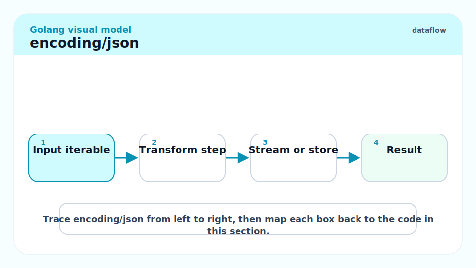

### Marshal and Unmarshal

`json.Marshal(v any)` encodes v to JSON bytes. `json.Unmarshal(data []byte, v any)` decodes JSON into v (v must be a pointer).

```go
import "encoding/json"

type Address struct {
    Street string `json:"street"`
    City   string `json:"city"`
}

type Person struct {
    Name    string   `json:"name"`
    Age     int      `json:"age"`
    Email   string   `json:"email,omitempty"`  // omit if empty string
    Tags    []string `json:"tags,omitempty"`   // omit if nil or empty
    private string   `json:"-"`                // never included
}

p := Person{Name: "Alice", Age: 30, Tags: []string{"admin", "user"}}
data, err := json.Marshal(p)
if err != nil {
    panic(err)
}
fmt.Println(string(data))
// {"name":"Alice","age":30,"tags":["admin","user"]}

var p2 Person
if err := json.Unmarshal(data, &p2); err != nil {
    panic(err)
}
fmt.Println(p2.Name, p2.Age)  // Alice 30
```

### Streaming with Encoder/Decoder

For HTTP bodies and large files, use `json.Encoder` / `json.Decoder` to avoid loading the entire payload into memory.

```go
func encodeResponse(w http.ResponseWriter, v any) error {
    w.Header().Set("Content-Type", "application/json")
    return json.NewEncoder(w).Encode(v)
}

func decodeRequest(r *http.Request, dst any) error {
    defer r.Body.Close()
    dec := json.NewDecoder(r.Body)
    dec.DisallowUnknownFields()  // stricter parsing — returns error on unknown keys
    return dec.Decode(dst)
}
```

> [!TIP]
> `json.Decoder.DisallowUnknownFields()` returns an error if the JSON contains keys not in the target struct. This catches typos in API clients at the parsing layer rather than silently ignoring them. Enable it in APIs where a typo in a field name would cause silent data loss.

## `net/http` — Server and Client

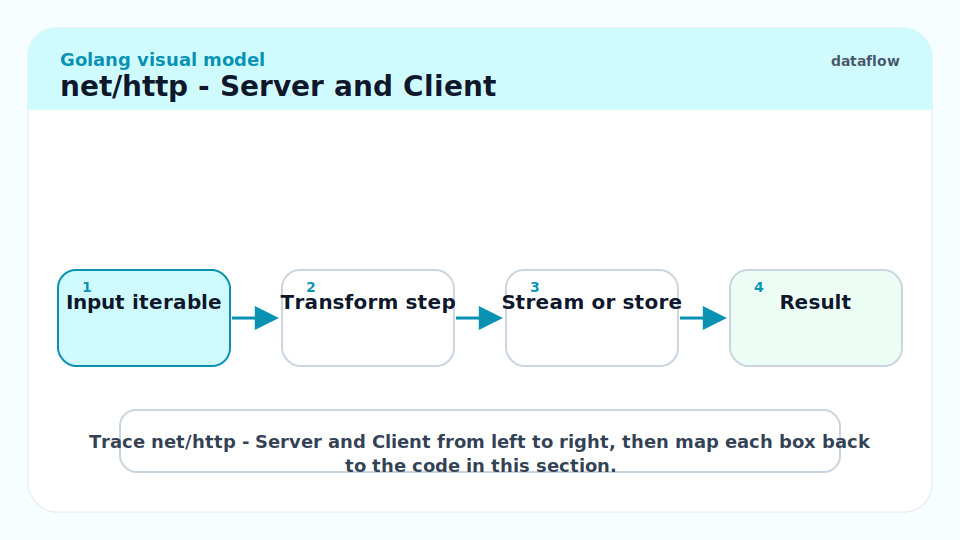

### HTTP Server

```go
package main

import (
	"encoding/json"
	"fmt"
	"log"
	"net/http"
)

type HealthResponse struct {
	Status string `json:"status"`
}

func healthHandler(w http.ResponseWriter, r *http.Request) {
	w.Header().Set("Content-Type", "application/json")
	w.WriteHeader(http.StatusOK)
	_ = json.NewEncoder(w).Encode(HealthResponse{Status: "ok"})
}

func main() {
	mux := http.NewServeMux()
	mux.HandleFunc("GET /health", healthHandler)  // Go 1.22 method+path routing

	srv := &http.Server{
		Addr:    ":8080",
		Handler: mux,
	}
	log.Printf("listening on %s", srv.Addr)
	if err := srv.ListenAndServe(); err != nil && err != http.ErrServerClosed {
		log.Fatalf("server error: %v", err)
	}
}
```

> [!NOTE]
> Go 1.22 added method-pattern routing to `http.ServeMux`: `mux.HandleFunc("GET /users/{id}", handler)`. The `{id}` wildcard is accessible via `r.PathValue("id")`. Before 1.22, method routing required third-party routers (chi, gorilla/mux). For new code targeting Go 1.22+, the stdlib router is sufficient for most services.

### HTTP Client

The stdlib HTTP client handles connection pooling, keep-alives, and TLS automatically. Always set a timeout — the zero value has no timeout, which can leave goroutines blocked forever on network calls.

```go
import (
    "context"
    "encoding/json"
    "net/http"
    "time"
)

var httpClient = &http.Client{
    Timeout: 10 * time.Second,
}

func fetchUser(ctx context.Context, id int) (*User, error) {
    url := fmt.Sprintf("https://api.example.com/users/%d", id)
    req, err := http.NewRequestWithContext(ctx, http.MethodGet, url, nil)
    if err != nil {
        return nil, fmt.Errorf("fetchUser: build request: %w", err)
    }

    resp, err := httpClient.Do(req)
    if err != nil {
        return nil, fmt.Errorf("fetchUser: do request: %w", err)
    }
    defer resp.Body.Close()

    if resp.StatusCode != http.StatusOK {
        return nil, fmt.Errorf("fetchUser: status %d", resp.StatusCode)
    }

    var user User
    if err := json.NewDecoder(resp.Body).Decode(&user); err != nil {
        return nil, fmt.Errorf("fetchUser: decode: %w", err)
    }
    return &user, nil
}
```

> [!IMPORTANT]
> Always `defer resp.Body.Close()` after a successful `Do` call. Failing to close the body leaks the underlying TCP connection and eventually exhausts the connection pool. The response body must be drained and closed even if you do not read it — use `io.Copy(io.Discard, resp.Body)` before closing if you need to discard the body but still reuse the connection.

## `database/sql`

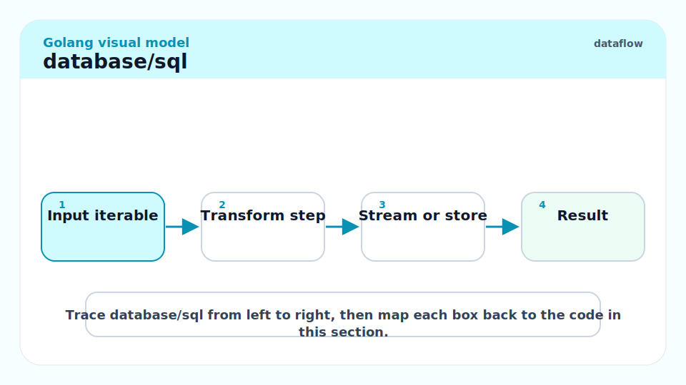

`database/sql` provides a connection pool and a driver-agnostic interface. Import a driver with a blank import — it registers itself via `init()`.

```go
import (
    "context"
    "database/sql"
    "fmt"
    _ "github.com/lib/pq"  // register postgres driver
)

type User struct {
    ID   int
    Name string
}

func getUser(ctx context.Context, db *sql.DB, id int) (*User, error) {
    var u User
    err := db.QueryRowContext(ctx, "SELECT id, name FROM users WHERE id=$1", id).
        Scan(&u.ID, &u.Name)
    if err == sql.ErrNoRows {
        return nil, fmt.Errorf("user %d not found", id)
    }
    if err != nil {
        return nil, fmt.Errorf("getUser: %w", err)
    }
    return &u, nil
}
```

> [!WARNING]
> `db.QueryContext` returns a `*sql.Rows` that must be closed with `defer rows.Close()`. Failing to close rows leaks a database connection from the pool. `db.QueryRowContext` (for single rows) automatically closes after `Scan`. Use `QueryRowContext` when expecting exactly one row; use `QueryContext` + `rows.Close()` for multiple rows.

## `testing` — Table Tests, Subtests, Benchmarks

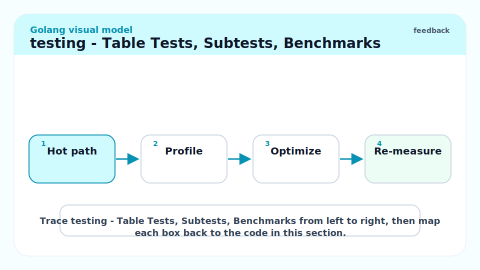

### Table Tests with Subtests

The idiomatic Go testing pattern is a table of test cases with `t.Run` for subtests:

```go
package calc_test

import (
    "testing"
    "github.com/acme/myapp/calc"
)

func TestAdd(t *testing.T) {
    t.Parallel()
    tests := []struct {
        name     string
        a, b     int
        expected int
    }{
        {"positive", 1, 2, 3},
        {"negative", -1, -2, -3},
        {"zero", 0, 0, 0},
        {"mixed", 5, -3, 2},
    }
    for _, tt := range tests {
        tt := tt  // capture range var (required pre-1.22; safe post-1.22 too)
        t.Run(tt.name, func(t *testing.T) {
            t.Parallel()
            if got := calc.Add(tt.a, tt.b); got != tt.expected {
                t.Errorf("Add(%d, %d) = %d, want %d", tt.a, tt.b, got, tt.expected)
            }
        })
    }
}
```

### Benchmarks

```go
func BenchmarkAdd(b *testing.B) {
    b.ReportAllocs()
    for i := 0; i < b.N; i++ {
        calc.Add(100, 200)
    }
}
```

```bash
go test -bench=BenchmarkAdd -benchmem -count=5 ./...
# BenchmarkAdd-8   1000000000   0.23 ns/op   0 B/op   0 allocs/op
```

### Fuzzing (Go 1.18+)

```go
func FuzzAdd(f *testing.F) {
    f.Add(1, 2)  // seed corpus
    f.Fuzz(func(t *testing.T, a, b int) {
        // Add should be commutative
        if calc.Add(a, b) != calc.Add(b, a) {
            t.Errorf("Add is not commutative for %d, %d", a, b)
        }
    })
}
```

```bash
go test -fuzz=FuzzAdd -fuzztime=30s ./...
```

## `log/slog` — Structured Logging (Go 1.21+)

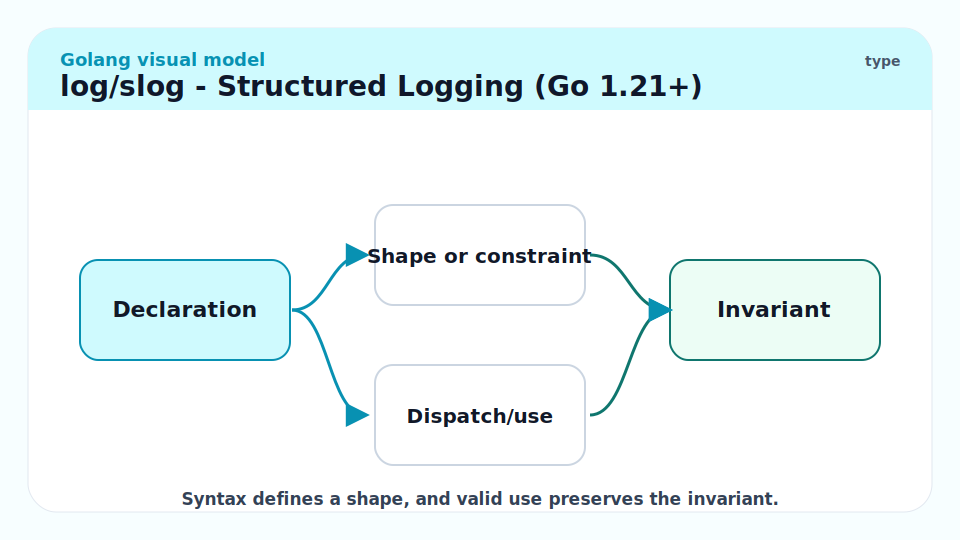

`log/slog` is the standard structured logger. It emits key-value pairs alongside the log message, with configurable handlers (JSON, text).

```go
import (
    "log/slog"
    "os"
)

func main() {
    // JSON handler to stdout
    logger := slog.New(slog.NewJSONHandler(os.Stdout, &slog.HandlerOptions{
        Level: slog.LevelInfo,
    }))
    slog.SetDefault(logger)

    slog.Info("server starting", "port", 8080, "version", "1.2.3")
    // {"time":"2026-05-19T10:00:00Z","level":"INFO","msg":"server starting","port":8080,"version":"1.2.3"}

    slog.Error("db connection failed", "err", err, "host", "db.example.com")
}
```

> [!TIP]
> Use `slog.With(key, value, ...)` to create a child logger with pre-populated fields. In an HTTP handler, create a logger with `requestID`, `userID`, and `method` pre-set, then pass it through context or use it directly. This gives every log line in a request handler the full request context without re-specifying it.

## Real-world Example

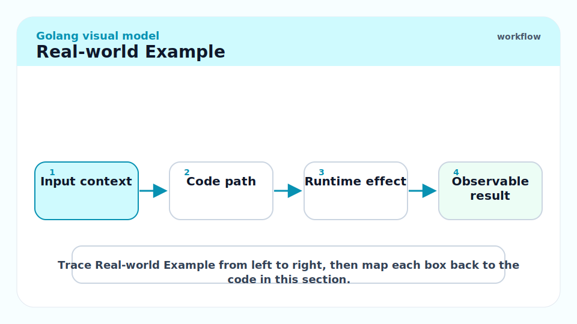

A complete HTTP handler that reads a JSON request, queries a database, and writes a JSON response, using all the patterns above:

```go
package main

import (
	"context"
	"database/sql"
	"encoding/json"
	"errors"
	"fmt"
	"log/slog"
	"net/http"
	_ "github.com/lib/pq"
)

// UserRequest is the request body for creating a user.
type UserRequest struct {
	Name  string `json:"name"`
	Email string `json:"email"`
}

// UserResponse is the response body after creating a user.
type UserResponse struct {
	ID    int64  `json:"id"`
	Name  string `json:"name"`
	Email string `json:"email"`
}

// createUserHandler handles POST /users.
func createUserHandler(db *sql.DB) http.HandlerFunc {
	return func(w http.ResponseWriter, r *http.Request) {
		var req UserRequest
		dec := json.NewDecoder(r.Body)
		dec.DisallowUnknownFields()
		if err := dec.Decode(&req); err != nil {
			http.Error(w, fmt.Sprintf("bad request: %v", err), http.StatusBadRequest)
			return
		}
		defer r.Body.Close()

		if req.Name == "" || req.Email == "" {
			http.Error(w, "name and email required", http.StatusBadRequest)
			return
		}

		ctx, cancel := context.WithTimeout(r.Context(), 3*slog.Default().Handler().(interface{ Timeout() context.CancelFunc }).Timeout())
		// Simpler:
		ctx, cancel = context.WithTimeout(r.Context(), 3_000_000_000) // 3s
		defer cancel()

		var resp UserResponse
		err := db.QueryRowContext(ctx,
			"INSERT INTO users(name,email) VALUES($1,$2) RETURNING id,name,email",
			req.Name, req.Email,
		).Scan(&resp.ID, &resp.Name, &resp.Email)
		if err != nil {
			slog.Error("createUser: db insert", "err", err)
			if errors.Is(err, context.DeadlineExceeded) {
				http.Error(w, "database timeout", http.StatusGatewayTimeout)
				return
			}
			http.Error(w, "internal error", http.StatusInternalServerError)
			return
		}

		w.Header().Set("Content-Type", "application/json")
		w.WriteHeader(http.StatusCreated)
		_ = json.NewEncoder(w).Encode(resp)
	}
}
```

> [!NOTE]
> The above uses `context.WithTimeout` on the incoming request's context (`r.Context()`). When the client disconnects, `r.Context()` is cancelled, which in turn cancels our derived context, which cancels the database query. This is the full context propagation chain — a disconnected client does not leave a zombie database query running.

## In Practice

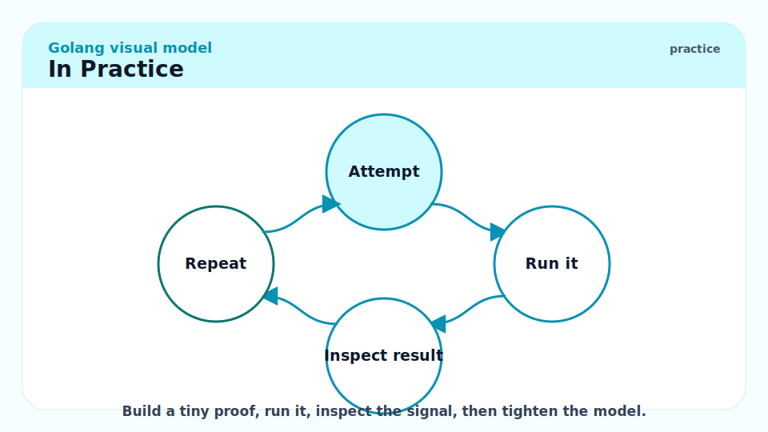

**`http.DefaultClient` is unsafe for production.** It has no timeout. If the remote server is slow or hangs, the calling goroutine blocks forever. Always construct your own `http.Client` with `Timeout` and, for services making many outbound calls, a custom `Transport` with tuned connection pool settings (`MaxIdleConns`, `IdleConnTimeout`).

**`database/sql` connection pool tuning.** `db.SetMaxOpenConns(n)` limits the total connections. `db.SetMaxIdleConns(n)` controls how many connections stay open when not in use. `db.SetConnMaxLifetime(d)` recycles connections — important for services behind a load balancer where the DB resets long-lived connections.

```go
db.SetMaxOpenConns(25)
db.SetMaxIdleConns(5)
db.SetConnMaxLifetime(5 * time.Minute)
```

> [!CAUTION]
> `json.Unmarshal` accepts JSON numbers into `interface{}` as `float64` by default. If you unmarshal a large integer (e.g., a 64-bit ID) into `interface{}`, you lose precision silently. Use `json.Decoder.UseNumber()` to get a `json.Number` string instead, then parse with `n.Int64()`.

## Pitfalls

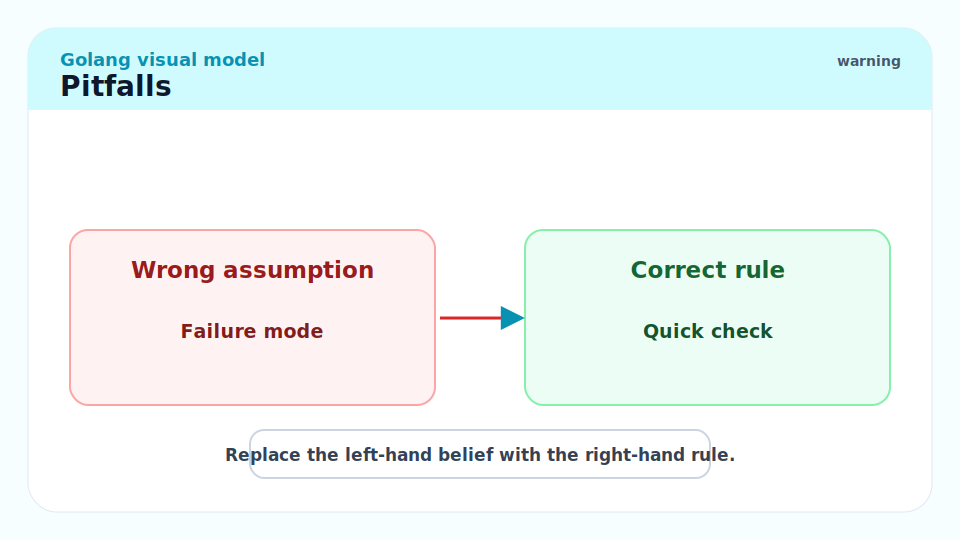

- **"`http.Get` is the right way to make a request."** — `http.Get` uses `http.DefaultClient` which has no timeout. Use `http.NewRequestWithContext` + a custom `http.Client` with a `Timeout`.
- **"`json.Marshal` round-trips perfectly."** — Not for types that don't have a JSON representation: `time.Time` marshals to RFC3339 strings; `[]byte` marshals to base64; `map[int]string` (integer keys) fails. Know your types.
- **"All test functions run in parallel by default."** — Only if you call `t.Parallel()`. Without it, subtests run sequentially within a test function, and test functions run sequentially within a package (unless `go test -parallel=N` is set).
- **"`os.Exit(1)` in a test function is safe."** — It skips all deferred functions and test cleanup. Use `t.Fatal` or `t.FailNow` instead — they stop the test but run cleanup.
- **"`slog` replaces `log`."** — Not entirely. The old `log` package still works and `log.Fatal` is still idiomatic in `main`. `slog` adds structured output; `log` is fine for simple single-process CLIs.

## Exercises

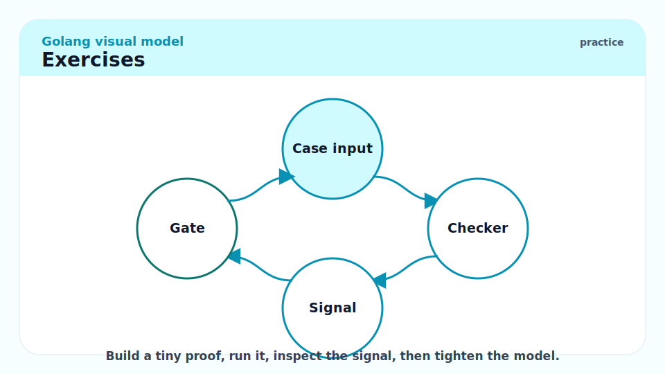

### Exercise 1 — Implementation: Write a JSON round-trip test for a struct

#### Solution

```go
package myapp_test

import (
	"encoding/json"
	"testing"
)

type Config struct {
	Host    string `json:"host"`
	Port    int    `json:"port"`
	Debug   bool   `json:"debug,omitempty"`
}

func TestConfigJSONRoundTrip(t *testing.T) {
	original := Config{Host: "localhost", Port: 8080, Debug: true}

	data, err := json.Marshal(original)
	if err != nil {
		t.Fatalf("Marshal: %v", err)
	}

	var decoded Config
	if err := json.Unmarshal(data, &decoded); err != nil {
		t.Fatalf("Unmarshal: %v", err)
	}

	if decoded != original {
		t.Errorf("round-trip mismatch: got %+v, want %+v", decoded, original)
	}
}
```

---

### Exercise 2 — Implementation: Write a table test for an HTTP handler

Test the health endpoint introduced earlier with table-driven subtests.

#### Solution

```go
package main_test

import (
	"encoding/json"
	"net/http"
	"net/http/httptest"
	"testing"
)

func TestHealthHandler(t *testing.T) {
	t.Parallel()
	tests := []struct {
		name           string
		method         string
		wantStatusCode int
		wantStatus     string
	}{
		{"GET returns 200", http.MethodGet, http.StatusOK, "ok"},
	}
	for _, tt := range tests {
		tt := tt
		t.Run(tt.name, func(t *testing.T) {
			t.Parallel()
			req := httptest.NewRequest(tt.method, "/health", nil)
			w := httptest.NewRecorder()
			healthHandler(w, req)

			res := w.Result()
			defer res.Body.Close()
			if res.StatusCode != tt.wantStatusCode {
				t.Errorf("status = %d, want %d", res.StatusCode, tt.wantStatusCode)
			}
			var body map[string]string
			if err := json.NewDecoder(res.Body).Decode(&body); err != nil {
				t.Fatalf("decode body: %v", err)
			}
			if body["status"] != tt.wantStatus {
				t.Errorf("status field = %q, want %q", body["status"], tt.wantStatus)
			}
		})
	}
}
```

`httptest.NewRecorder()` and `httptest.NewRequest()` let you test HTTP handlers without starting a real server — the idiomatic pattern for unit-testing handlers.

---

### Exercise 3 — Conceptual: Why does `defer resp.Body.Close()` matter for connection reuse?

#### Solution

The `net/http` transport maintains a pool of idle TCP connections for keep-alive reuse. When a response body is fully read AND closed, the transport puts the connection back in the pool. If the body is not closed, the connection is never returned — it becomes "leaked" in the pool and is eventually GC'd, but not before exhausting available connections for busy services.

Specifically, for connection reuse, the transport needs:
1. The response body to be **fully read** (so it knows the HTTP response ended), OR
2. The response body to be **closed** (which signals "I'm done, discard remaining bytes").

`defer resp.Body.Close()` satisfies condition 2. If you also want to drain the body (to ensure the TCP connection can be reused immediately), add `io.Copy(io.Discard, resp.Body)` before `Close()` when you are discarding the body.

At scale (thousands of requests per second), forgetting `defer resp.Body.Close()` exhausts the connection pool and causes "connection reset by peer" errors and goroutine pile-up.

## Sources

- `io` package docs: https://pkg.go.dev/io
- `encoding/json` docs: https://pkg.go.dev/encoding/json
- `net/http` docs: https://pkg.go.dev/net/http
- `database/sql` docs: https://pkg.go.dev/database/sql
- `testing` docs: https://pkg.go.dev/testing
- `log/slog` docs: https://pkg.go.dev/log/slog
- The Go Blog — JSON and Go: https://go.dev/blog/json
- The Go Blog — The http package by example: https://go.dev/doc/articles/wiki/
- Go 1.22 routing enhancements: https://go.dev/blog/routing-enhancements

## Related

- [5 - Interfaces and Type Assertions](./5-interfaces-and-type-assertions.md)
- [6 - Errors, Panics, and Recovery](./6-errors-panics-recovery.md)
- [8 - Concurrency Patterns and the Race Detector](./8-concurrency-patterns.md)
- [12 - Building Production Services in Go](./12-building-production-services.md)
