# 11 - Generics (Go 1.18+)

[toc]

> **TL;DR:** Go 1.18 (March 2022) introduced type parameters — the language's approach to generics. A type parameter is a placeholder type in a function or type declaration, constrained by an interface that specifies what operations are available on the type. Generics eliminate repetitive code for containers and algorithms that work on any type satisfying a constraint, without sacrificing compile-time type safety or requiring boxing. The cost story is real: instantiation adds compile time and binary size; use generics where they genuinely remove duplication, not as a default.

## Vocabulary

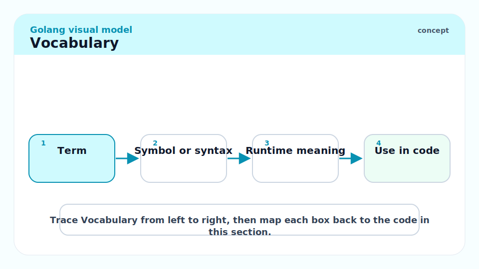

**Type parameter**: A placeholder type written in square brackets before the regular parameters. `func Min[T constraints.Ordered](a, b T) T`.

---

**Constraint**: An interface that restricts what types a type parameter can be. Constraints can list specific methods or use type set syntax (`~int | ~float64`) to restrict to types with a given underlying type.

---

**Type set**: The set of types that satisfy an interface when used as a constraint. An interface used as a constraint can contain type literals, making it a type set rather than a method set.

---

**`comparable`**: A built-in constraint satisfied by any type that supports `==` and `!=`. Required for map keys, for use in `sync.Map`, and any function that needs to compare values.

---

**`any`**: The alias for `interface{}`, a built-in constraint satisfied by all types. A type parameter `[T any]` has no restrictions — you can store and retrieve `T` values but cannot call any methods or operators on them.

---

**`constraints.Ordered`**: From `golang.org/x/exp/constraints`. Satisfied by all types that support `<`, `<=`, `>`, `>=`: integers, floats, and strings.

---

**Type inference**: The compiler's ability to deduce type arguments from function argument types. `Min(3, 5)` — the compiler infers `T = int` from the arguments.

---

**Instantiation**: The process of creating a concrete version of a generic function or type for a specific type argument. Each instantiation may produce separate compiled code (monomorphisation) or share code via a GC shape dictionary.

---

**Type approximation (`~T`)**: The `~` prefix in a constraint means "this type OR any type whose underlying type is T." `~int` matches `int`, `type MyInt int`, etc.

---

## Intuition

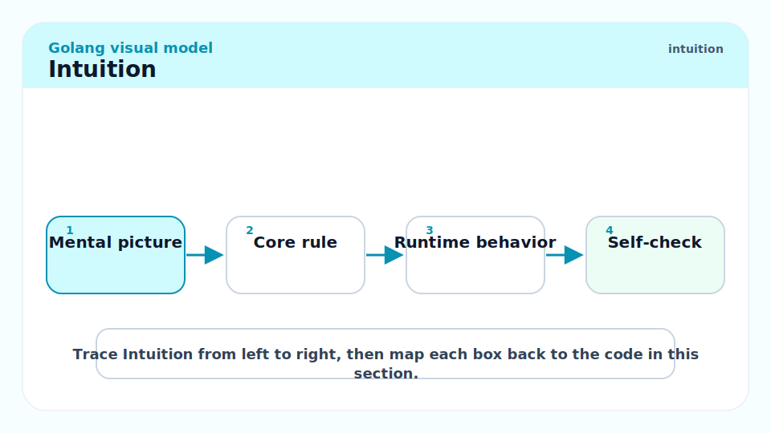

Before generics, Go had two approaches to "write once, use with any type": empty interfaces (`interface{}` / `any`) with type assertions, and code generation (e.g., `go generate` + templates). Empty interfaces lose type safety; code generation is tedious. Generics provide a third option: type-parameterised functions and types that are checked at compile time.

The constraint system is the key innovation. Rather than "any type" (Java-style `<T>`), Go constraints are interfaces with a type set. `[T comparable]` means "any type that supports `==`." `[T interface{ ~int | ~float64 }]` means "any type whose underlying type is int or float64." This gives the compiler enough information to generate correct code and gives you enough safety to catch misuse at compile time.

## Syntax

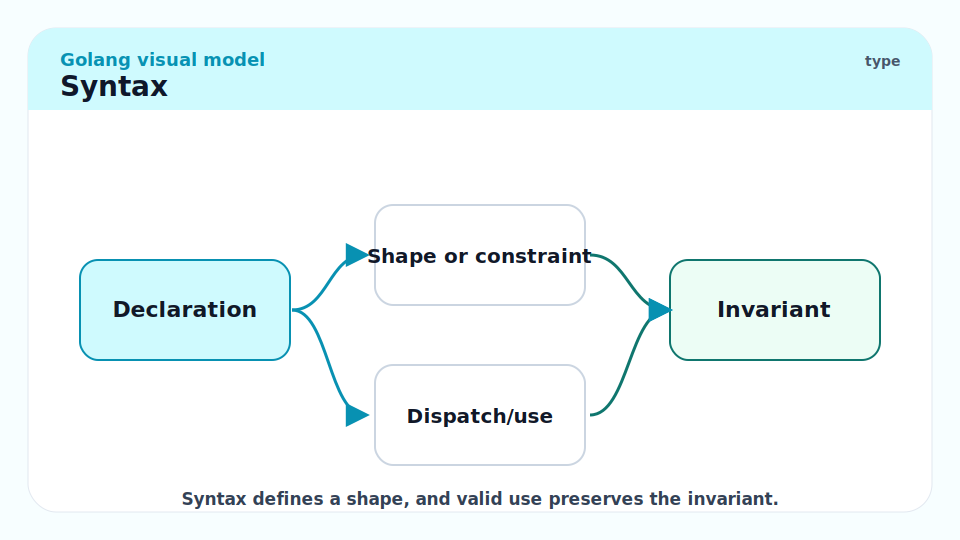

### Generic Functions

```go
// Min returns the smaller of a and b.
// T must satisfy constraints.Ordered (has < operator).
func Min[T interface{ ~int | ~float64 | ~string }](a, b T) T {
    if a < b {
        return a
    }
    return b
}

// With the constraints package (golang.org/x/exp/constraints):
// import "golang.org/x/exp/constraints"
// func Min[T constraints.Ordered](a, b T) T { ... }

fmt.Println(Min(3, 5))       // 3 — T inferred as int
fmt.Println(Min(3.14, 2.72)) // 2.72 — T inferred as float64
fmt.Println(Min("b", "a"))   // "a" — T inferred as string
```

### Generic Types

```go
// Stack is a generic LIFO stack.
type Stack[T any] struct {
    items []T
}

// Push adds v to the top of the stack.
func (s *Stack[T]) Push(v T) {
    s.items = append(s.items, v)
}

// Pop removes and returns the top item.
// Returns zero value and false if empty.
func (s *Stack[T]) Pop() (T, bool) {
    if len(s.items) == 0 {
        var zero T
        return zero, false
    }
    v := s.items[len(s.items)-1]
    s.items = s.items[:len(s.items)-1]
    return v, true
}

// Len returns the number of items.
func (s *Stack[T]) Len() int { return len(s.items) }

// Usage:
var intStack Stack[int]
intStack.Push(1)
intStack.Push(2)
v, ok := intStack.Pop()  // v=2, ok=true
```

### Constraints

Constraints are interfaces. They can include methods and type sets:

```go
// Number constrains T to numeric types.
type Number interface {
    ~int | ~int8 | ~int16 | ~int32 | ~int64 |
        ~uint | ~uint8 | ~uint16 | ~uint32 | ~uint64 |
        ~float32 | ~float64
}

// Sum returns the sum of all values.
func Sum[T Number](values []T) T {
    var total T
    for _, v := range values {
        total += v
    }
    return total
}

fmt.Println(Sum([]int{1, 2, 3}))           // 6
fmt.Println(Sum([]float64{1.1, 2.2, 3.3})) // 6.6
```

> [!IMPORTANT]
> The `~` prefix in type sets means "any type with this underlying type." `~int` matches `int` and also `type MyID int` and `type Count int`. Without `~`, only the exact type matches. For most constraints involving numeric or string types, you want `~`.

## Built-in Constraints

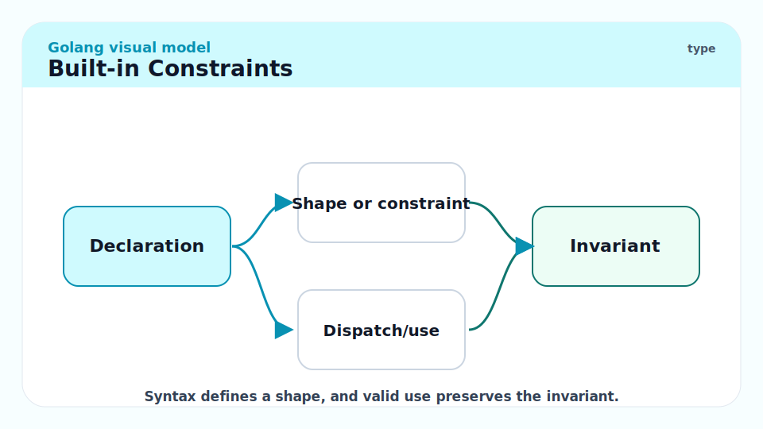

### `comparable`

The built-in constraint for types that support `==` and `!=`. Required for map keys and set implementations:

```go
// Set is a generic set backed by a map.
type Set[T comparable] map[T]struct{}

// Add adds v to the set.
func (s Set[T]) Add(v T) { s[v] = struct{}{} }

// Contains reports whether v is in the set.
func (s Set[T]) Contains(v T) bool {
    _, ok := s[v]
    return ok
}

words := make(Set[string])
words.Add("go")
words.Add("is")
fmt.Println(words.Contains("go"))  // true
fmt.Println(words.Contains("slow")) // false
```

### `any`

`any` (`interface{}`) is the maximally permissive constraint — no restrictions. You can only store, retrieve, and compare (with `==` if the dynamic type is comparable) values of type `any`. You cannot call any methods or use any operators.

```go
// Map applies fn to each element of slice.
func Map[T, U any](slice []T, fn func(T) U) []U {
    result := make([]U, len(slice))
    for i, v := range slice {
        result[i] = fn(v)
    }
    return result
}

doubled := Map([]int{1, 2, 3}, func(x int) int { return x * 2 })
// [2 4 6]
strs := Map([]int{1, 2, 3}, func(x int) string { return fmt.Sprintf("%d", x) })
// ["1" "2" "3"]
```

## Common Generic Patterns

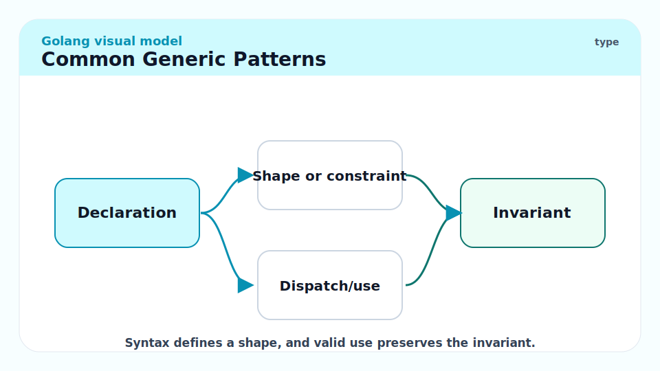

### `Filter` and `Reduce`

```go
// Filter returns elements of slice for which keep returns true.
func Filter[T any](slice []T, keep func(T) bool) []T {
    var result []T
    for _, v := range slice {
        if keep(v) {
            result = append(result, v)
        }
    }
    return result
}

// Reduce reduces slice to a single value using fn and initial value init.
func Reduce[T, Acc any](slice []T, init Acc, fn func(Acc, T) Acc) Acc {
    acc := init
    for _, v := range slice {
        acc = fn(acc, v)
    }
    return acc
}

evens := Filter([]int{1, 2, 3, 4, 5, 6}, func(x int) bool { return x%2 == 0 })
// [2 4 6]
total := Reduce([]int{1, 2, 3, 4}, 0, func(acc, x int) int { return acc + x })
// 10
```

### Generic Cache with `sync.Map`

```go
// TypedCache is a goroutine-safe cache for values of type V keyed by K.
type TypedCache[K comparable, V any] struct {
    m sync.Map
}

// Store stores v under key k.
func (c *TypedCache[K, V]) Store(k K, v V) {
    c.m.Store(k, v)
}

// Load retrieves the value for k. Returns zero value and false if not found.
func (c *TypedCache[K, V]) Load(k K) (V, bool) {
    v, ok := c.m.Load(k)
    if !ok {
        var zero V
        return zero, false
    }
    return v.(V), true
}
```

## When Generics Help and When They Don't

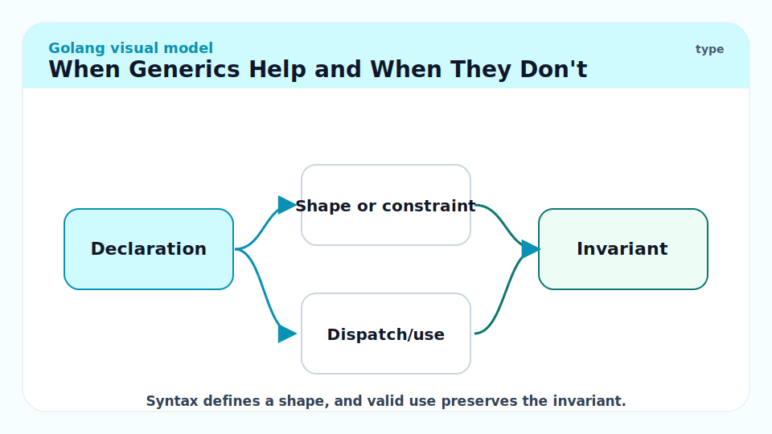

Generics are the right tool when:

1. You are writing a **container type** (stack, queue, set, ordered map) that should work for any element type.
2. You are writing a **utility function** (Map, Filter, Reduce, Min, Max, Contains) that should work on any type satisfying a minimal constraint.
3. You have **duplicated code** where the only difference is the type — generics are the refactor.

Generics are the wrong tool when:

1. You just need **any type** at runtime and don't need compile-time type safety — `interface{}` / `any` is simpler.
2. You need **behaviour polymorphism** — different types implementing different logic — that's interfaces, not generics.
3. The **types are known at call sites** and the number of concrete types is small — just write the specific functions.

> [!NOTE]
> The Go team's position: "If you find yourself writing the same code three or more times with different types and cannot use interfaces, consider generics." This is a conservative, pragmatic stance — generics are not the default design tool, they are the refactoring tool.

## The Cost Story

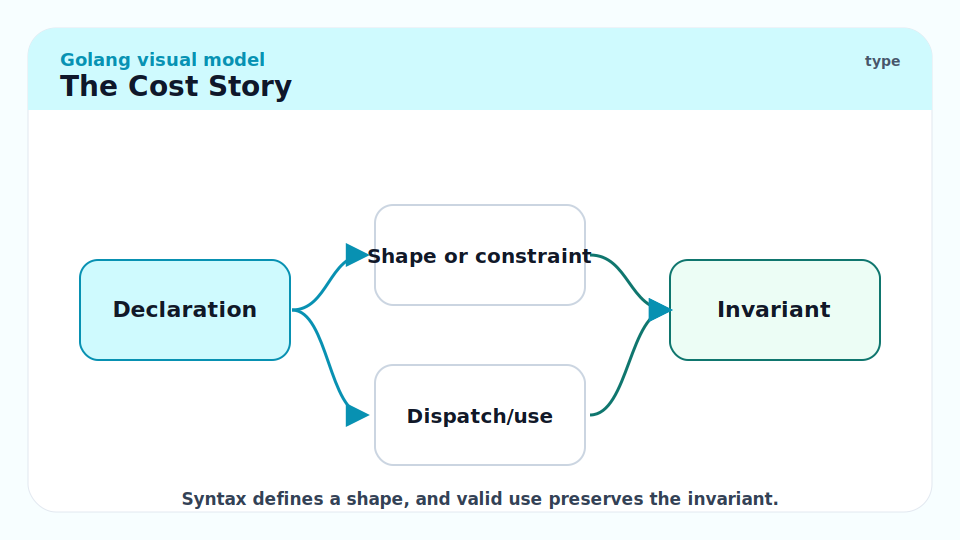

Generics in Go are implemented via a hybrid strategy called GC shapes (dictionaries + partial monomorphisation):

- Types with the same "GC shape" (same pointer layout) share compiled code, using a dictionary of type-specific metadata.
- Types with different pointer layouts may generate separate code.

In practice:
- **Compile time** increases for packages that use generics — each distinct instantiation is compiled separately.
- **Binary size** increases modestly — fewer in practice than C++ templates because of GC-shape sharing.
- **Runtime performance** is generally equivalent to a non-generic version — the dictionary overhead is small.
- **Code clarity** is the primary benefit, not performance.

```bash
# Check binary size with and without generics:
go build -o myapp-generic ./generic/...
go build -o myapp-concrete ./concrete/...
ls -la myapp-*
```

> [!WARNING]
> Overly complex constraint hierarchies slow compilation noticeably. If you have 10 layers of constraint embedding and 50 type parameters, compile time can balloon. Keep constraints simple and specific.

## Real-world Example

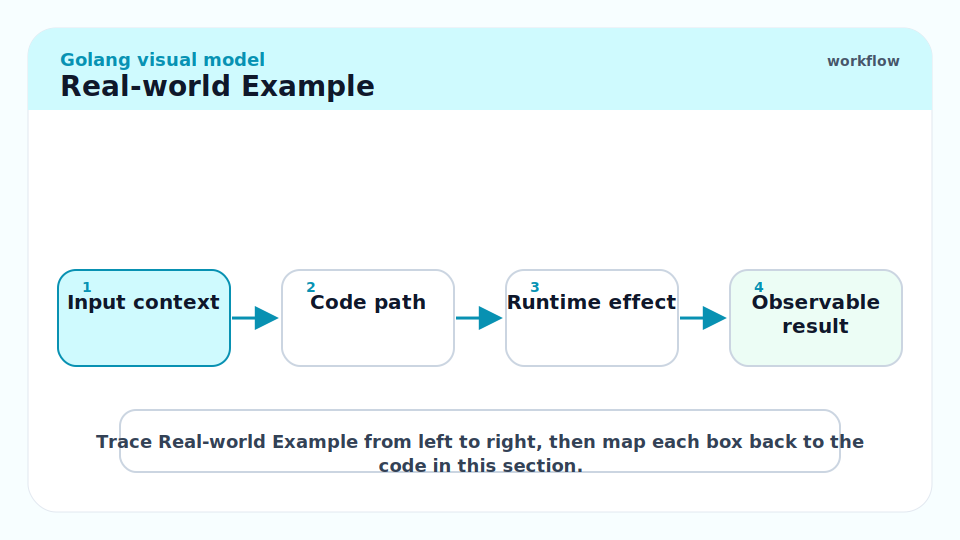

A generic result type (similar to Rust's `Result<T, E>`) that makes error handling more explicit in pipelines:

```go
package main

import "fmt"

// Result holds either a value of type T or an error.
type Result[T any] struct {
    val T
    err error
}

// Ok wraps a successful value.
func Ok[T any](v T) Result[T] { return Result[T]{val: v} }

// Err wraps a failure.
func Err[T any](err error) Result[T] { return Result[T]{err: err} }

// Unwrap returns the value or panics if there is an error.
func (r Result[T]) Unwrap() T {
    if r.err != nil {
        panic(fmt.Sprintf("Unwrap called on error Result: %v", r.err))
    }
    return r.val
}

// Value returns the value and a boolean indicating success.
func (r Result[T]) Value() (T, bool) { return r.val, r.err == nil }

// Err returns the error, or nil if success.
func (r Result[T]) Error() error { return r.err }

// Map applies fn to the value if successful.
func Map[T, U any](r Result[T], fn func(T) U) Result[U] {
    if r.err != nil {
        return Err[U](r.err)
    }
    return Ok(fn(r.val))
}

func parseInt(s string) Result[int] {
    var n int
    if _, err := fmt.Sscan(s, &n); err != nil {
        return Err[int](fmt.Errorf("parseInt %q: %w", s, err))
    }
    return Ok(n)
}

func main() {
    r := parseInt("42")
    doubled := Map(r, func(n int) int { return n * 2 })
    fmt.Println(doubled.Unwrap())  // 84

    bad := parseInt("oops")
    fmt.Println(bad.Error())       // parseInt "oops": expected integer
}
```

> [!TIP]
> The `Result[T]` pattern is more common in functional Go code than in idiomatic Go. Standard Go returns `(T, error)`. `Result[T]` shines in pipeline-style code where you want to chain transformations and defer error handling to the end. Use judiciously — it adds a new type to learn for your team.

## In Practice

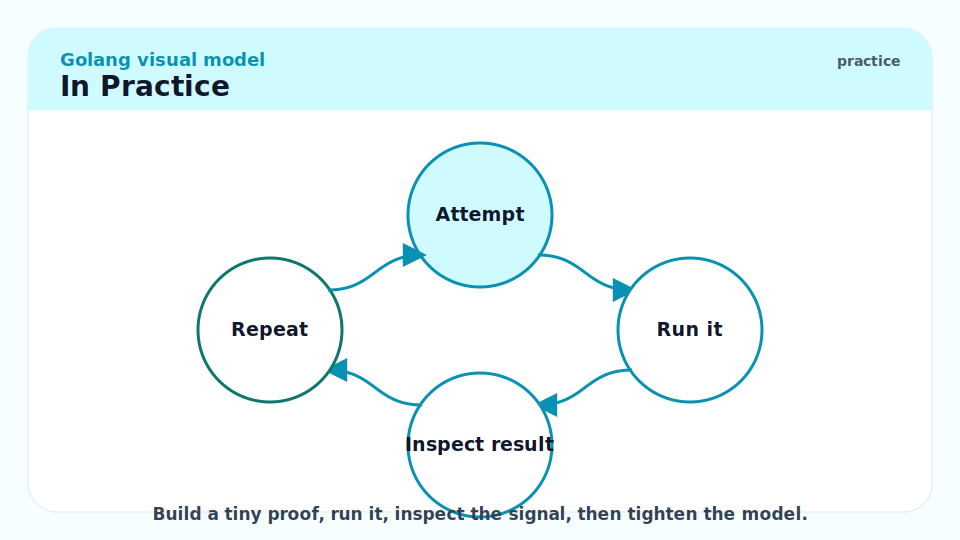

The `slices` and `maps` packages (Go 1.21) use generics to provide utility functions for slices and maps that previously required manual implementation or code generation:

```go
import (
    "cmp"
    "slices"
    "maps"
)

s := []int{3, 1, 4, 1, 5, 9}
slices.Sort(s)              // [1 1 3 4 5 9]
fmt.Println(slices.Max(s))  // 9
fmt.Println(slices.Contains(s, 4))  // true
fmt.Println(slices.Index(s, 5))     // 4

m := map[string]int{"a": 1, "b": 2, "c": 3}
keys := slices.Collect(maps.Keys(m))
slices.Sort(keys)
fmt.Println(keys)  // [a b c]
```

> [!NOTE]
> The `cmp` package (Go 1.21) provides `cmp.Compare[T cmp.Ordered](a, b T) int` for three-way comparison and `cmp.Less[T cmp.Ordered](a, b T) bool`. These replace the common pre-generic pattern of writing separate comparison functions for each type.

## Pitfalls

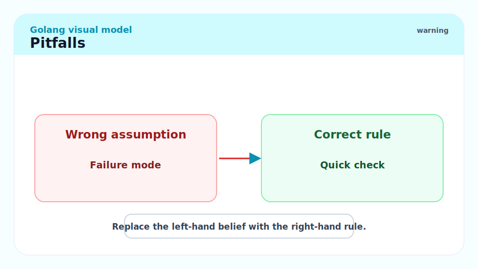

- **"Generics replace interfaces."** — No. Interfaces are for behaviour polymorphism (different types, different implementations, selected at runtime). Generics are for type-safe algorithms and containers (same code, different types, resolved at compile time). They serve different purposes and often appear together.
- **"Type parameters can be used with any operator."** — Only operators supported by the constraint. `[T any]` supports nothing; `[T comparable]` supports `==`; `[T constraints.Ordered]` supports `<`, `>`, etc. Attempting `a + b` with `[T any]` is a compile error.
- **"Generics always improve performance."** — They are performance-neutral in most cases. The benefit is code reuse and type safety, not speed.
- **"Methods on generic types can have their own type parameters."** — They cannot. Methods on `Stack[T]` use `T` from the type declaration but cannot introduce new type parameters. Use package-level generic functions instead.
- **"You must specify type arguments explicitly."** — Usually not; type inference handles it for function calls. For type literals (`Stack[int]{}`), you must specify because there are no arguments to infer from.

## Exercises

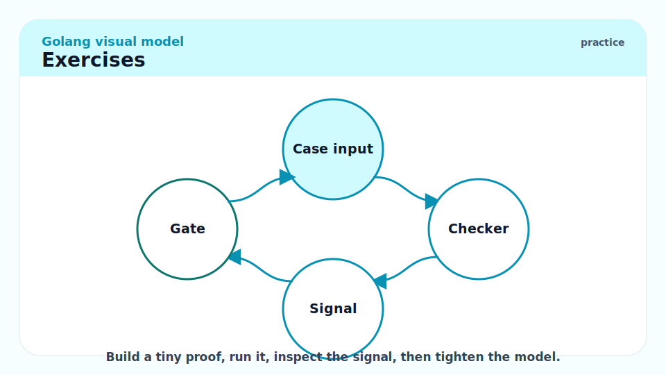

### Exercise 1 — Implementation: Write a generic `Contains` function

Write `Contains[T comparable](slice []T, val T) bool`.

#### Solution

```go
package main

import "fmt"

// Contains reports whether val appears in slice.
func Contains[T comparable](slice []T, val T) bool {
	for _, v := range slice {
		if v == val {
			return true
		}
	}
	return false
}

func main() {
	fmt.Println(Contains([]int{1, 2, 3}, 2))       // true
	fmt.Println(Contains([]int{1, 2, 3}, 5))       // false
	fmt.Println(Contains([]string{"go", "is"}, "go")) // true
}
```

The `comparable` constraint is necessary because we use `==`. Without it, the compiler rejects `v == val` since not all types support `==`.

---

### Exercise 2 — Conceptual: Why can't you use a slice as a map key, and how does `comparable` enforce this?

#### Solution

Slices are not comparable in Go — they do not support `==` (only `== nil`). Map keys must support `==` so the hash table can check for key equality. The type system encodes this requirement: map key types must implement the `comparable` constraint.

When you write `func Lookup[K comparable, V any](m map[K]V, key K) (V, bool)`, the `comparable` constraint on `K` means you cannot call `Lookup` with a `[]int` key — the compiler rejects it at the instantiation site:

```go
Lookup(map[[]int]string{{1,2}: "a"}, []int{1,2})
// compile error: []int does not implement comparable
```

Without generics, this would be a runtime panic (or silently wrong behaviour). With generics and `comparable`, it is a compile-time error.

---

### Exercise 3 — Implementation: Write a generic `Keys` function for maps

Write `Keys[K comparable, V any](m map[K]V) []K`.

#### Solution

```go
package main

import (
	"fmt"
	"sort"
)

// Keys returns all keys of m in unspecified order.
func Keys[K comparable, V any](m map[K]V) []K {
	result := make([]K, 0, len(m))
	for k := range m {
		result = append(result, k)
	}
	return result
}

func main() {
	m := map[string]int{"c": 3, "a": 1, "b": 2}
	keys := Keys(m)
	sort.Strings(keys)  // sort for deterministic output
	fmt.Println(keys)   // [a b c]

	m2 := map[int]string{1: "one", 2: "two"}
	fmt.Println(Keys(m2))  // [1 2] or [2 1] — map iteration order is random
}
```

Note: `golang.org/x/exp/maps.Keys` and the Go 1.21 `maps.Keys` provide this in the standard library now. Writing it yourself illustrates the constraint system.

---

### Exercise 4 — Conceptual: When should you prefer `interface{}` over `[T any]`?

#### Solution

Use `interface{}` / `any` (non-generic) when:

1. The concrete type is determined at **runtime** and you need dynamic dispatch — you don't know at compile time what type you'll have.
2. You need to store **values of different types in the same collection** (e.g., `[]any` for a heterogeneous list).
3. The function's body **doesn't care about the type at all** — it just stores and retrieves it.
4. You are working with **reflection-based code** (JSON encoding, ORM) that already operates on `any`.

Use `[T any]` (generic) when:

1. The concrete type is determined at **compile time** at each call site.
2. You want to ensure **all elements in a collection are the same type** (a `Stack[int]` cannot accidentally hold strings).
3. You are writing a function that is **called with the same type** consistently and you want to avoid type assertions.

The rule: generic when compile-time type safety matters; `any` when runtime flexibility is needed.

## Sources

- The Go Specification — Type parameters: https://go.dev/ref/spec#Type_parameter_declarations
- The Go Blog — An Introduction to Generics: https://go.dev/blog/intro-generics
- The Go Blog — When to use generics: https://go.dev/blog/when-generics
- `golang.org/x/exp/constraints`: https://pkg.go.dev/golang.org/x/exp/constraints
- `slices` package (Go 1.21): https://pkg.go.dev/slices
- `maps` package (Go 1.21): https://pkg.go.dev/maps
- Go 1.18 release notes: https://go.dev/doc/go1.18

## Related

- [2 - Types, Zero Values, and Declarations](./2-types-and-zero-values.md)
- [5 - Interfaces and Type Assertions](./5-interfaces-and-type-assertions.md)
- ##### [3 - Composite Types](./3-composite-types.md)
