# 12 - Building Production Services in Go

[toc]

> **TL;DR:** A production Go HTTP service is assembled from stdlib primitives — `net/http`, `context`, `log/slog`, `os/signal` — plus a small set of de-facto standard observability libraries: Prometheus for metrics, OpenTelemetry for distributed tracing, and `net/http/pprof` for on-demand profiling. The patterns in this note (graceful shutdown, structured logging with request context, middleware chains, pprof endpoints, connection pool tuning) are present in nearly every serious Go service at companies that run Go at scale.

## Vocabulary

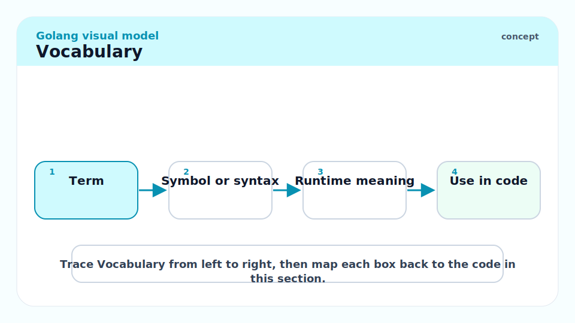

**Graceful shutdown**: Stopping an HTTP server without dropping in-flight requests. The server stops accepting new connections, waits for existing handlers to complete (up to a deadline), then exits.

---

**Middleware**: A function that wraps an `http.Handler`, adding behaviour (logging, auth, tracing, recovery) before and/or after the inner handler.

---

**`os/signal.NotifyContext`**: Go 1.16+. Creates a `context.Context` that is cancelled when a specified OS signal (SIGTERM, SIGINT) is received. The idiomatic hook for graceful shutdown.

---

**`net/http/pprof`**: A package that, when imported with a blank import, registers `/debug/pprof/` endpoints on `http.DefaultServeMux`. Provides CPU, heap, goroutine, mutex, and block profiles over HTTP.

---

**`log/slog`**: Go 1.21. Structured logger with pluggable handlers. JSON handler for machine-readable output; text handler for development.

---

**Prometheus**: A pull-based metrics system. The Go client library (`github.com/prometheus/client_golang`) registers metric types (Counter, Gauge, Histogram) and exposes them at `/metrics` in the Prometheus exposition format.

---

**OpenTelemetry (OTel)**: A CNCF standard for distributed tracing, metrics, and logs. The Go SDK (`go.opentelemetry.io/otel`) propagates trace context across service calls and exports spans to Jaeger, Tempo, or a collector.

---

**`http.Server.Shutdown`**: The method that initiates graceful shutdown. It immediately stops the listener and waits for in-flight requests to complete.

---

## Intuition

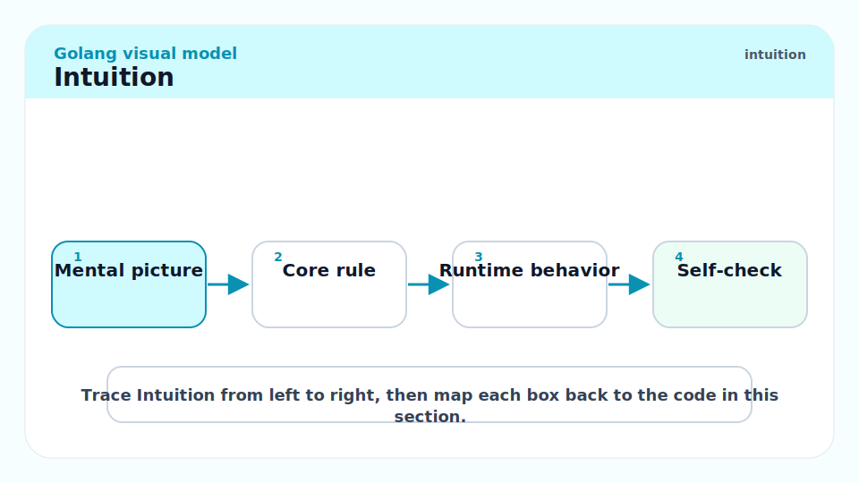

A production Go HTTP service is architecturally simple: an `http.Server` with a `ServeMux` (or a third-party router for complex routing), wrapped in a middleware chain, with observability (logs, metrics, traces) wired at the middleware layer rather than scattered through business logic. The `context.Context` carries the request's identity through every layer, enabling cancellation, tracing, and structured logging that automatically includes the request ID.

Graceful shutdown is the most common operational gap between tutorial services and production ones. Without it, a rolling deploy terminates in-flight requests mid-flight. With it, the server drains existing requests within a deadline before exiting, making zero-downtime deploys possible.

## Project Layout

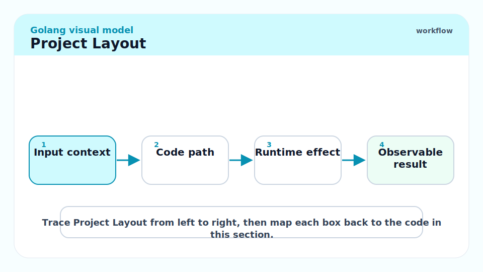

A conventional Go service layout for a medium-sized service:

```
myservice/
├── cmd/
│   └── server/
│       └── main.go          // binary entry point
├── internal/
│   ├── handler/             // HTTP handlers
│   ├── service/             // business logic
│   ├── store/               // database layer
│   └── middleware/          // HTTP middleware
├── pkg/                     // exported, reusable packages
├── go.mod
├── go.sum
└── Dockerfile
```

`internal/` is enforced by the Go toolchain — packages under `internal/` cannot be imported by packages outside the module. This makes `internal/` safe for private APIs.

## Graceful Shutdown

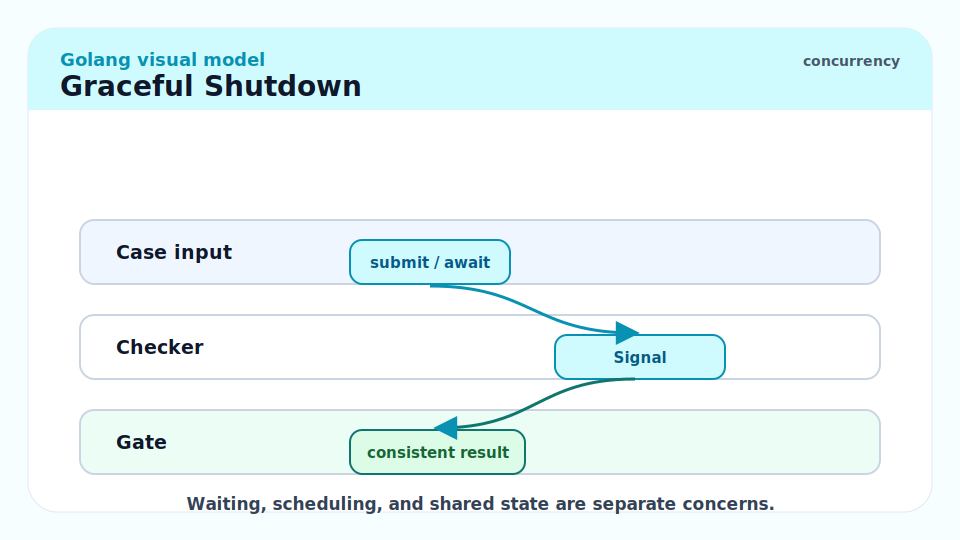

The standard graceful shutdown pattern uses `signal.NotifyContext` to listen for SIGTERM/SIGINT and `http.Server.Shutdown` to drain:

```go
package main

import (
	"context"
	"errors"
	"log/slog"
	"net/http"
	"os"
	"os/signal"
	"syscall"
	"time"
)

func main() {
	logger := slog.New(slog.NewJSONHandler(os.Stdout, &slog.HandlerOptions{
		Level: slog.LevelInfo,
	}))
	slog.SetDefault(logger)

	mux := http.NewServeMux()
	mux.HandleFunc("GET /health", func(w http.ResponseWriter, r *http.Request) {
		w.WriteHeader(http.StatusOK)
		_, _ = w.Write([]byte(`{"status":"ok"}`))
	})

	srv := &http.Server{
		Addr:         ":8080",
		Handler:      mux,
		ReadTimeout:  5 * time.Second,
		WriteTimeout: 10 * time.Second,
		IdleTimeout:  60 * time.Second,
	}

	// Start serving in a goroutine.
	go func() {
		slog.Info("server starting", "addr", srv.Addr)
		if err := srv.ListenAndServe(); !errors.Is(err, http.ErrServerClosed) {
			slog.Error("server error", "err", err)
			os.Exit(1)
		}
	}()

	// Wait for SIGTERM or SIGINT.
	ctx, stop := signal.NotifyContext(context.Background(), syscall.SIGTERM, syscall.SIGINT)
	defer stop()
	<-ctx.Done()

	slog.Info("shutdown signal received; draining connections")
	shutdownCtx, cancel := context.WithTimeout(context.Background(), 30*time.Second)
	defer cancel()
	if err := srv.Shutdown(shutdownCtx); err != nil {
		slog.Error("shutdown error", "err", err)
	}
	slog.Info("server stopped")
}
```

> [!IMPORTANT]
> Always set `ReadTimeout`, `WriteTimeout`, and `IdleTimeout` on `http.Server`. The zero values mean no timeout — a slow or malicious client can hold connections forever, exhausting file descriptors and goroutines. `ReadTimeout` covers reading the request headers and body; `WriteTimeout` covers writing the response; `IdleTimeout` covers keep-alive connections between requests.

## Middleware

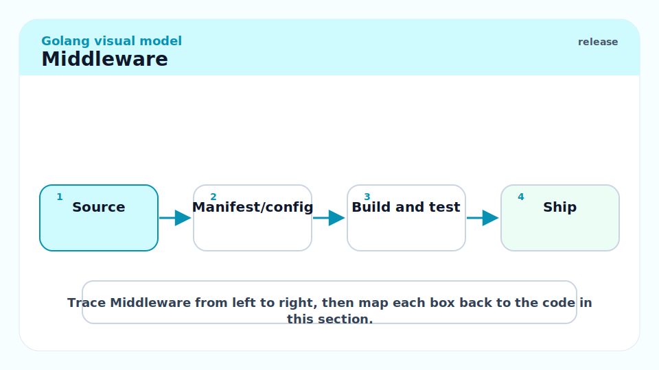

Middleware in Go is a function `func(http.Handler) http.Handler`. Middleware chains are built by wrapping the inner handler with each middleware in order.

```go
package middleware

import (
	"log/slog"
	"net/http"
	"time"

	"github.com/google/uuid"
)

// RequestID injects a unique request ID into the context and response header.
func RequestID(next http.Handler) http.Handler {
	return http.HandlerFunc(func(w http.ResponseWriter, r *http.Request) {
		id := uuid.NewString()
		w.Header().Set("X-Request-ID", id)
		ctx := r.Context() // in production, use a typed key
		r = r.WithContext(ctx)
		next.ServeHTTP(w, r)
	})
}

// Logger logs each request with duration, method, path, and status.
func Logger(next http.Handler) http.Handler {
	return http.HandlerFunc(func(w http.ResponseWriter, r *http.Request) {
		start := time.Now()
		ww := &statusWriter{ResponseWriter: w, status: http.StatusOK}
		next.ServeHTTP(ww, r)
		slog.Info("request",
			"method", r.Method,
			"path", r.URL.Path,
			"status", ww.status,
			"duration", time.Since(start).String(),
		)
	})
}

// Recover catches panics in handlers and returns 500.
func Recover(next http.Handler) http.Handler {
	return http.HandlerFunc(func(w http.ResponseWriter, r *http.Request) {
		defer func() {
			if rec := recover(); rec != nil {
				slog.Error("handler panic", "panic", rec)
				http.Error(w, "internal server error", http.StatusInternalServerError)
			}
		}()
		next.ServeHTTP(w, r)
	})
}

// statusWriter wraps ResponseWriter to capture the status code.
type statusWriter struct {
	http.ResponseWriter
	status int
}

func (sw *statusWriter) WriteHeader(code int) {
	sw.status = code
	sw.ResponseWriter.WriteHeader(code)
}
```

### Chaining Middleware

```go
// Chain applies middlewares in order, outermost first.
func Chain(h http.Handler, middlewares ...func(http.Handler) http.Handler) http.Handler {
	for i := len(middlewares) - 1; i >= 0; i-- {
		h = middlewares[i](h)
	}
	return h
}

// Usage in main:
handler := middleware.Chain(
    mux,
    middleware.Recover,
    middleware.Logger,
    middleware.RequestID,
)
```

> [!TIP]
> Apply middleware in the order you want them to execute on the request path. `Chain(mux, Recover, Logger, RequestID)` applies `RequestID` first (innermost), then `Logger`, then `Recover` outermost. For a request: `Recover → Logger → RequestID → handler`. On the response path the order reverses: `handler → RequestID → Logger → Recover`.

## Structured Logging with `log/slog`

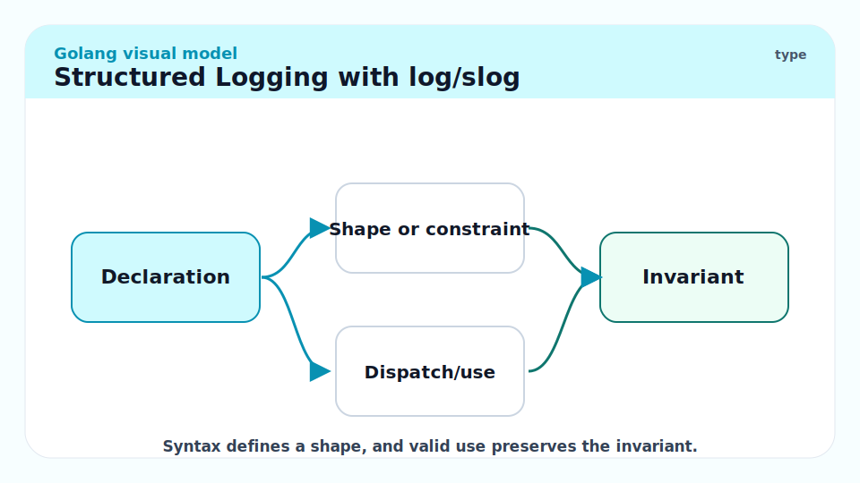

`log/slog` (Go 1.21) is the standard structured logger. The JSON handler produces machine-readable output suitable for log aggregation systems (Loki, Elasticsearch, Splunk).

```go
// Setup in main:
logger := slog.New(slog.NewJSONHandler(os.Stdout, &slog.HandlerOptions{
    Level:     slog.LevelInfo,
    AddSource: true, // include file:line in log output
}))
slog.SetDefault(logger)

// Per-request logger with context fields:
reqLogger := slog.With(
    "request_id", requestID,
    "method", r.Method,
    "path", r.URL.Path,
)
reqLogger.Info("processing request")
reqLogger.Error("db query failed", "err", err, "table", "users")
```

Log output:
```json
{"time":"2026-05-19T10:00:01Z","level":"INFO","source":{"function":"handler.go:42"},"msg":"processing request","request_id":"abc-123","method":"GET","path":"/users/1"}
```

## Metrics with Prometheus

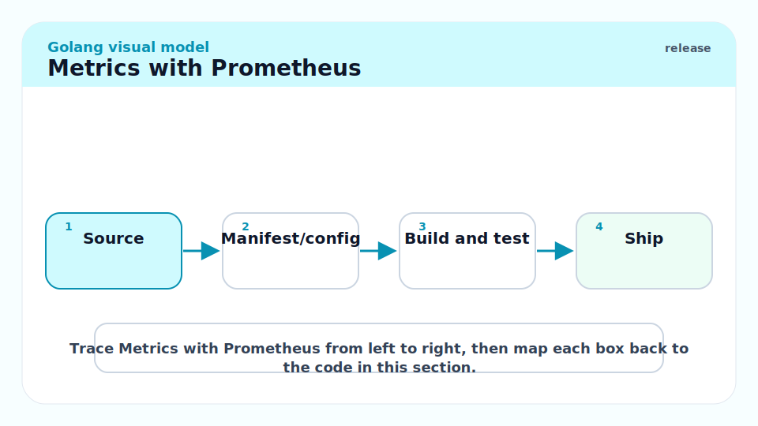

The Prometheus Go client (`github.com/prometheus/client_golang`) registers metrics and exposes them at `/metrics`. Use `promauto` for auto-registering metrics without managing a registry.

```go
import (
    "github.com/prometheus/client_golang/prometheus"
    "github.com/prometheus/client_golang/prometheus/promauto"
    "github.com/prometheus/client_golang/prometheus/promhttp"
)

var (
    httpRequests = promauto.NewCounterVec(prometheus.CounterOpts{
        Name: "http_requests_total",
        Help: "Total HTTP requests by method, path, and status.",
    }, []string{"method", "path", "status"})

    httpDuration = promauto.NewHistogramVec(prometheus.HistogramOpts{
        Name:    "http_request_duration_seconds",
        Help:    "HTTP request duration in seconds.",
        Buckets: prometheus.DefBuckets,
    }, []string{"method", "path"})
)

// In a middleware:
func Metrics(next http.Handler) http.Handler {
    return http.HandlerFunc(func(w http.ResponseWriter, r *http.Request) {
        start := time.Now()
        ww := &statusWriter{ResponseWriter: w, status: http.StatusOK}
        next.ServeHTTP(ww, r)
        httpRequests.WithLabelValues(r.Method, r.URL.Path, strconv.Itoa(ww.status)).Inc()
        httpDuration.WithLabelValues(r.Method, r.URL.Path).Observe(time.Since(start).Seconds())
    })
}

// In main, register the /metrics endpoint:
mux.Handle("/metrics", promhttp.Handler())
```

> [!WARNING]
> Use high-cardinality labels (e.g., user ID, request ID, full URL path) in Prometheus metrics with care. Each unique combination of label values creates a new time series in Prometheus. Thousands of unique user IDs as label values create thousands of time series, which can OOM the Prometheus server. Use low-cardinality labels: method, path template (not exact path), status code.

## Profiling with `pprof`

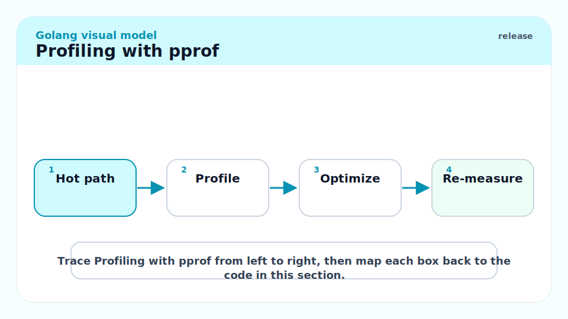

Import `net/http/pprof` with a blank import to auto-register the profiling endpoints. In production, expose them on a **separate internal port** so they are not publicly accessible.

```go
import _ "net/http/pprof"

// Internal debug server (NOT the public handler):
go func() {
    debugMux := http.NewServeMux()
    debugMux.Handle("/debug/pprof/", http.DefaultServeMux)
    log.Fatal(http.ListenAndServe(":6060", debugMux))
}()
```

```bash
# CPU profile (30 seconds):
go tool pprof http://localhost:6060/debug/pprof/profile?seconds=30

# Heap profile:
go tool pprof http://localhost:6060/debug/pprof/heap

# Goroutine list (useful for diagnosing goroutine leaks):
curl http://localhost:6060/debug/pprof/goroutine?debug=2

# Block profile (goroutines blocked on sync):
go tool pprof http://localhost:6060/debug/pprof/block
```

> [!CAUTION]
> `pprof` endpoints expose detailed internal information about the running process (memory layout, goroutine stacks, file paths). Never expose them on a public port. Use a separate internal port, an internal VPN endpoint, or require authentication. A leaked pprof endpoint is an information disclosure vulnerability.

## Configuration Management

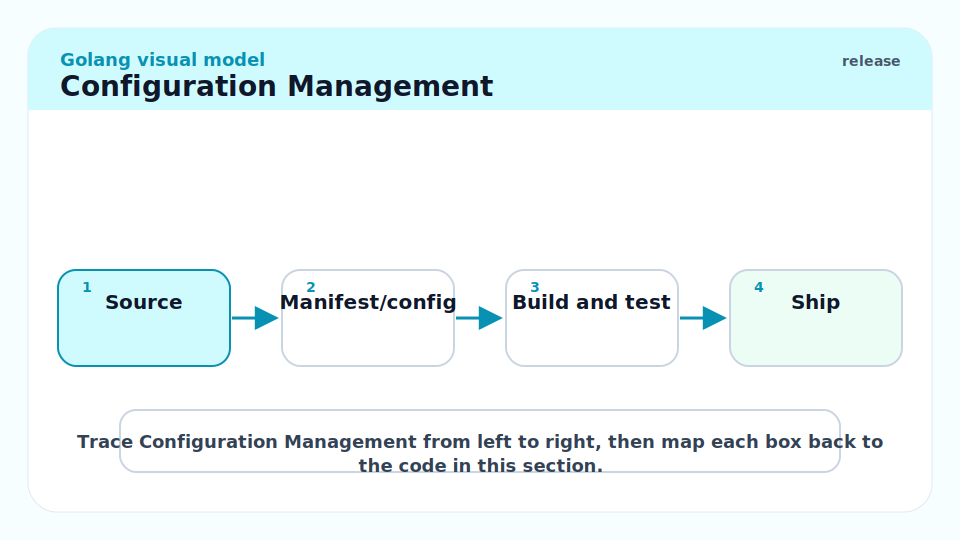

Configuration should come from environment variables (12-factor app style) or a config file. Avoid reading configuration from command-line flags for services (they don't work well with `docker run`). The `os.Getenv` pattern is simple and testable.

```go
type Config struct {
    Port        string
    DatabaseDSN string
    LogLevel    slog.Level
}

// LoadConfig reads configuration from environment variables.
func LoadConfig() (Config, error) {
    cfg := Config{
        Port:        envOrDefault("PORT", "8080"),
        DatabaseDSN: os.Getenv("DATABASE_DSN"),
    }
    if cfg.DatabaseDSN == "" {
        return cfg, fmt.Errorf("DATABASE_DSN is required")
    }
    return cfg, nil
}

func envOrDefault(key, dflt string) string {
    if v := os.Getenv(key); v != "" {
        return v
    }
    return dflt
}
```

## Real-world Example

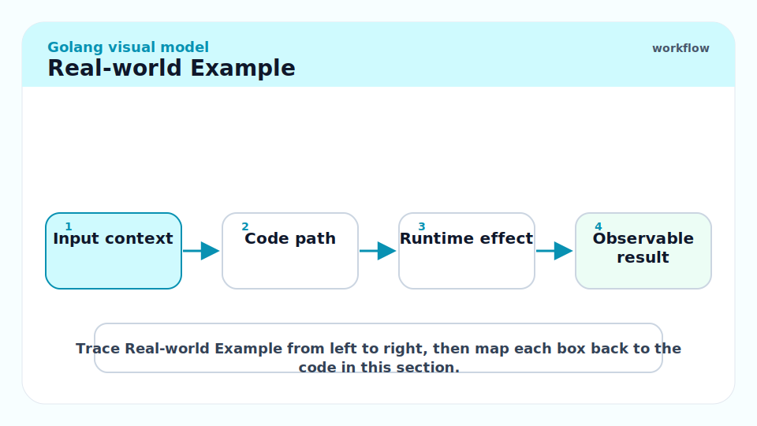

A complete minimal production-ready service skeleton in one file:

```go
package main

import (
	"context"
	"encoding/json"
	"errors"
	"log/slog"
	"net/http"
	_ "net/http/pprof"
	"os"
	"os/signal"
	"syscall"
	"time"
)

// HealthResponse is the response body for the health endpoint.
type HealthResponse struct {
	Status  string `json:"status"`
	Version string `json:"version"`
}

const version = "1.0.0"

// loggingMiddleware logs each request.
func loggingMiddleware(next http.Handler) http.Handler {
	return http.HandlerFunc(func(w http.ResponseWriter, r *http.Request) {
		start := time.Now()
		next.ServeHTTP(w, r)
		slog.Info("request", "method", r.Method, "path", r.URL.Path, "duration", time.Since(start))
	})
}

// recoverMiddleware catches panics and returns 500.
func recoverMiddleware(next http.Handler) http.Handler {
	return http.HandlerFunc(func(w http.ResponseWriter, r *http.Request) {
		defer func() {
			if rec := recover(); rec != nil {
				slog.Error("panic", "err", rec)
				http.Error(w, "internal error", http.StatusInternalServerError)
			}
		}()
		next.ServeHTTP(w, r)
	})
}

func main() {
	slog.SetDefault(slog.New(slog.NewJSONHandler(os.Stdout, &slog.HandlerOptions{Level: slog.LevelInfo})))

	mux := http.NewServeMux()
	mux.HandleFunc("GET /health", func(w http.ResponseWriter, r *http.Request) {
		w.Header().Set("Content-Type", "application/json")
		_ = json.NewEncoder(w).Encode(HealthResponse{Status: "ok", Version: version})
	})

	handler := recoverMiddleware(loggingMiddleware(mux))

	srv := &http.Server{
		Addr:         ":8080",
		Handler:      handler,
		ReadTimeout:  5 * time.Second,
		WriteTimeout: 10 * time.Second,
		IdleTimeout:  120 * time.Second,
	}

	// Pprof on separate internal port.
	go func() {
		if err := http.ListenAndServe(":6060", nil); err != nil {
			slog.Error("pprof server error", "err", err)
		}
	}()

	// Serve.
	go func() {
		slog.Info("server starting", "addr", srv.Addr, "version", version)
		if err := srv.ListenAndServe(); !errors.Is(err, http.ErrServerClosed) {
			slog.Error("server error", "err", err)
			os.Exit(1)
		}
	}()

	// Wait for shutdown signal.
	ctx, stop := signal.NotifyContext(context.Background(), syscall.SIGTERM, syscall.SIGINT)
	defer stop()
	<-ctx.Done()

	slog.Info("shutting down")
	shutCtx, cancel := context.WithTimeout(context.Background(), 30*time.Second)
	defer cancel()
	if err := srv.Shutdown(shutCtx); err != nil {
		slog.Error("shutdown error", "err", err)
	}
	slog.Info("server stopped")
}
```

> [!TIP]
> The `go build -ldflags="-s -w"` flags strip the symbol table and DWARF debug info, reducing binary size by ~30%. For production containers, combine with `CGO_ENABLED=0` for a fully static binary: `CGO_ENABLED=0 go build -ldflags="-s -w" -o /app/server ./cmd/server`.

## In Practice

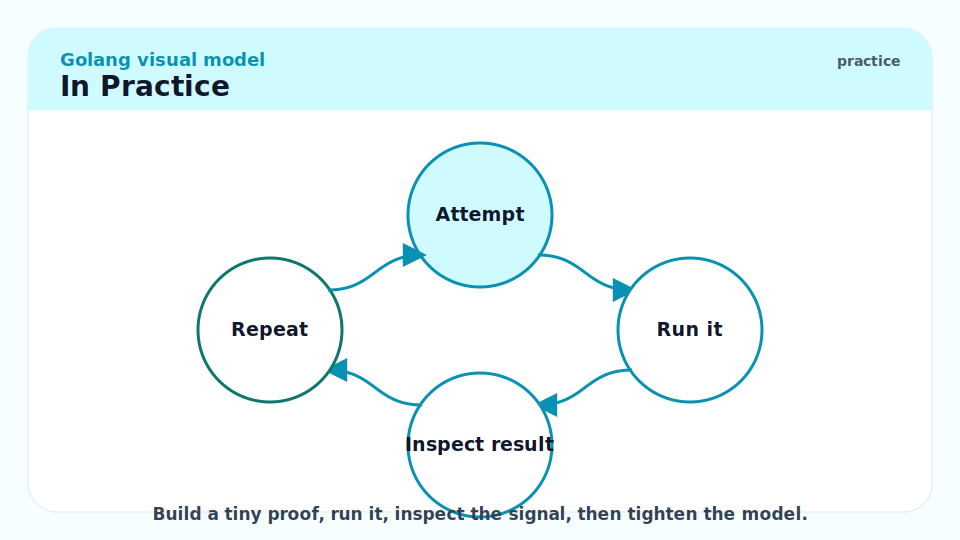

**Container resource limits.** Set `GOMAXPROCS` to match the container's CPU limit, not the host's full CPU count. In a container with 2 CPUs, `GOMAXPROCS=2`. The `go.uber.org/automaxprocs` library does this automatically by reading `/proc/self/cgroup`. Without this, a Go service in a 2-CPU container may spawn 64 OS threads (on a 64-core host), overwhelming the scheduler.

**Connection pool tuning for `database/sql`.**

```go
db.SetMaxOpenConns(25)           // max simultaneous connections to DB
db.SetMaxIdleConns(5)            // keep at most 5 idle connections open
db.SetConnMaxLifetime(5*time.Minute) // recycle connections every 5 min
db.SetConnMaxIdleTime(1*time.Minute) // close idle connections after 1 min
```

These numbers vary by workload. Start with `MaxOpenConns = 10-25`, observe the DB's connection limit and latency, and tune.

**Request body size limiting.** By default, `http.Request.Body` is unbounded. Malicious clients can send multi-GB request bodies. Wrap with `http.MaxBytesReader`:

```go
func handler(w http.ResponseWriter, r *http.Request) {
    r.Body = http.MaxBytesReader(w, r.Body, 1<<20) // 1 MB limit
    defer r.Body.Close()
    // ...
}
```

> [!WARNING]
> Forgetting `r.Body.Close()` in an HTTP handler leaks the connection in `http.DefaultTransport`'s pool (for client-side code). On the server side, the Go standard library handles body cleanup after the handler returns — but you should still close it explicitly if you're done reading early, for clarity and to signal the client to stop sending.

## Pitfalls

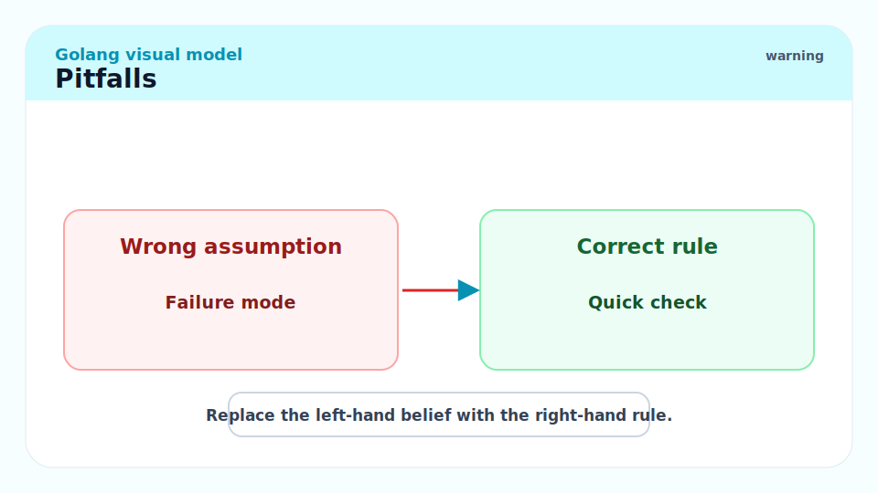

- **"I'll add observability later."** — Observability is much harder to retrofit than to build in. Add `log/slog`, Prometheus metrics, and pprof from the first commit. The cost is minimal; the benefit in debugging is enormous.
- **"My handler is fast; timeouts don't matter."** — Your handler calls a database, which calls a cloud endpoint, which gets rate-limited at 3 AM during a deploy. Without context timeouts at each layer, one slow downstream call can back-pressure all goroutines to a halt. Use `context.WithTimeout` at every I/O boundary.
- **"I'll handle SIGTERM later."** — Kubernetes sends SIGTERM before SIGKILL when rolling a deploy. Without graceful shutdown, every deploy drops some requests. This is silent in low-traffic environments and catastrophic at scale.
- **"Prometheus high-cardinality labels are fine if I clean them up."** — You cannot clean up Prometheus time series without restarting the server. Once written, they stay until the next restart. High cardinality (user IDs, trace IDs in metric labels) causes memory issues in the Prometheus server.
- **"`pprof` is dev-only."** — Production pprof profiles (on an internal port) are the single most powerful tool for debugging CPU and memory issues in a running service. Enable it always; protect it with network controls.

## Exercises

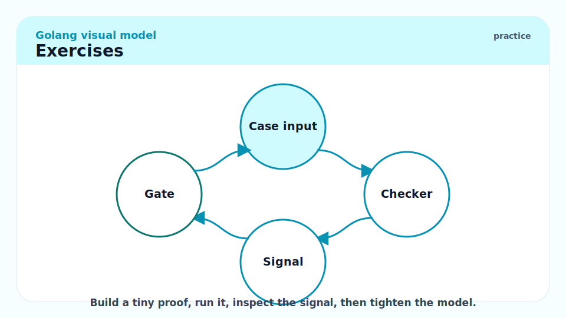

### Exercise 1 — Implementation: Write a middleware that adds a `X-Request-ID` header

The ID should be a UUID generated per request. Store it in the context for use by downstream handlers.

#### Solution

```go
package middleware

import (
	"context"
	"net/http"

	"github.com/google/uuid"
)

type contextKey string

const requestIDKey contextKey = "requestID"

// RequestID adds a unique ID to each request.
func RequestID(next http.Handler) http.Handler {
	return http.HandlerFunc(func(w http.ResponseWriter, r *http.Request) {
		id := r.Header.Get("X-Request-ID")
		if id == "" {
			id = uuid.NewString()
		}
		w.Header().Set("X-Request-ID", id)
		ctx := context.WithValue(r.Context(), requestIDKey, id)
		next.ServeHTTP(w, r.WithContext(ctx))
	})
}

// GetRequestID retrieves the request ID from the context.
func GetRequestID(ctx context.Context) string {
	if id, ok := ctx.Value(requestIDKey).(string); ok {
		return id
	}
	return ""
}
```

This pattern — check the incoming header first (for propagation from upstream services), generate if absent, store in context, set on response — is the standard request tracing entry point.

---

### Exercise 2 — Conceptual: Why is `GOMAXPROCS` important in containers?

#### Solution

`GOMAXPROCS` controls how many OS threads can run Go code simultaneously. The default is `runtime.NumCPU()`, which reads the number of logical CPUs on the host machine — not the container's CPU limit.

A Go service in a Kubernetes pod with `cpu: "2"` (2 CPU cores limit) running on a 64-core host will set `GOMAXPROCS=64` by default. The runtime creates 64 OS threads, all of which contend for the 2 CPUs actually available. Context switches increase, throughput decreases, and the CFS (Completely Fair Scheduler) throttles the container aggressively.

`uber-go/automaxprocs` reads the cgroup CPU quota and sets `GOMAXPROCS` accordingly:

```go
import _ "go.uber.org/automaxprocs"
```

This blank import is the canonical fix. The library runs at init time and sets `GOMAXPROCS = ceil(quota/period)`. For a 2-CPU pod, `GOMAXPROCS` becomes 2, and the scheduler operates correctly within the container's resource budget.

---

### Exercise 3 — Implementation: Write a graceful shutdown test

Write a test that starts an HTTP server, sends a signal, and verifies in-flight requests complete before the server stops.

#### Solution

```go
package main_test

import (
	"context"
	"net/http"
	"net/http/httptest"
	"sync"
	"testing"
	"time"
)

func TestGracefulShutdown(t *testing.T) {
	// Slow handler that takes 200ms to respond.
	slowHandler := http.HandlerFunc(func(w http.ResponseWriter, r *http.Request) {
		time.Sleep(200 * time.Millisecond)
		w.WriteHeader(http.StatusOK)
	})

	srv := httptest.NewServer(slowHandler)
	defer srv.Close()

	// Start a request that will be in-flight during shutdown.
	var wg sync.WaitGroup
	var statusCode int
	wg.Add(1)
	go func() {
		defer wg.Done()
		resp, err := http.Get(srv.URL)
		if err != nil {
			t.Errorf("request failed: %v", err)
			return
		}
		defer resp.Body.Close()
		statusCode = resp.StatusCode
	}()

	// Give the request time to start, then shut down with a generous deadline.
	time.Sleep(50 * time.Millisecond)
	ctx, cancel := context.WithTimeout(context.Background(), 2*time.Second)
	defer cancel()
	if err := srv.Config.Shutdown(ctx); err != nil {
		t.Fatalf("shutdown: %v", err)
	}

	wg.Wait()
	if statusCode != http.StatusOK {
		t.Errorf("in-flight request got %d, want 200", statusCode)
	}
}
```

This test verifies that `Shutdown` waits for the in-flight 200 ms handler to complete before the server stops, confirming graceful shutdown semantics.

## Sources

- `net/http` package: https://pkg.go.dev/net/http
- `os/signal` package: https://pkg.go.dev/os/signal
- `log/slog` package: https://pkg.go.dev/log/slog
- Prometheus Go client: https://github.com/prometheus/client_golang
- OpenTelemetry Go: https://opentelemetry.io/docs/instrumentation/go/
- `net/http/pprof` package: https://pkg.go.dev/net/http/pprof
- `go.uber.org/automaxprocs`: https://github.com/uber-go/automaxprocs
- The Go Blog — Graceful shutdown: https://go.dev/doc/articles/wiki/
- 100 Go Mistakes (Harsanyi) — Mistakes #80–85 (production patterns).
- Google SRE Book — Service reliability patterns (chapters on graceful degradation).

## Related

- [7 - Goroutines and Channels](./7-goroutines-and-channels.md)
- [8 - Concurrency Patterns and the Race Detector](./8-concurrency-patterns.md)
- [9 - Memory Management and the GC](./9-memory-management-gc.md)
- [10 - The Standard Library Tour](./10-standard-library-tour.md)
