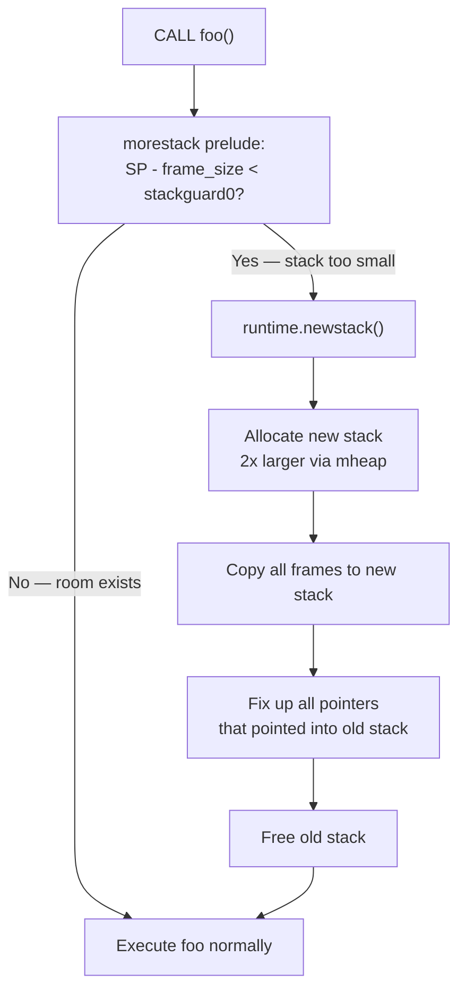

# 13 - Memory: Stack, Heap, and Variables

[toc]

> **TL;DR:** Every Go variable is a named, typed region of memory whose bytes are either on a goroutine's stack or on the shared heap — the compiler decides which via escape analysis, not you. Stack allocation is a single pointer bump, is zeroed automatically, and evaporates when the frame returns; heap allocation is managed by the runtime allocator and reclaimed by the GC. Understanding the escape-analysis rules, the stack-frame layout, and the allocator's size-class design is the prerequisite for any serious Go performance work.

## Vocabulary

**Stack frame**: The contiguous block of memory the runtime reserves on the goroutine's stack for a single function call. It holds local variables, spill storage, and the saved return address. Torn down automatically on `return`.

---

**Heap**: The runtime-managed memory region shared by all goroutines. Objects whose lifetime cannot be bounded to a single frame live here. Allocated by the runtime allocator (tcmalloc-derived); freed by the GC.

---

**Escape analysis**: The compiler pass — runs at `go build` time — that decides whether each variable can live on the stack or must be moved ("escape") to the heap. Inspect decisions with `go build -gcflags='-m'`.

---

**Zero value**: The bit pattern of all-zeros that Go guarantees every variable has at the moment it is declared. Not a runtime init loop — the operating system maps BSS pages as zeroed, and the allocator zeroes heap objects when it hands them out.

---

**morestack**: The runtime stub inserted at the top of most functions. At call time it checks whether the goroutine stack has enough room for the new frame. If not, it triggers a stack-growth event.

---

**mcache / mcentral / mheap**: The three tiers of Go's runtime allocator. `mcache` is a per-P (processor) lock-free cache of pre-fetched spans. `mcentral` is a per-size-class central free list. `mheap` is the global arena backed by OS `mmap` calls.

---

**Size class**: One of ~70 discrete object sizes the allocator recognises (e.g., 8, 16, 24, 32, 48, 64, 80, 96, 128 … bytes). An allocation request is rounded up to the nearest size class, avoiding per-object metadata overhead and making reclamation O(1).

---

**mspan**: A contiguous run of one or more 8 KB pages carved into fixed-size objects of one size class. The allocator's unit of currency at the `mcentral`/`mheap` level.

---

**`unsafe.Pointer`**: A Go type that can hold a pointer to any type and that is exempt from Go's pointer restrictions. The only way to do pointer arithmetic in Go (via `uintptr` conversion). GC does not track bare `uintptr` values — an important hazard.

---

**`runtime.KeepAlive`**: A no-op function that prevents the GC from finalising (and potentially collecting) a value before the call site. Required when passing a Go-allocated pointer to C via `unsafe`.

---

## Intuition

Think of the goroutine stack as a stack of legal pads: every function call grabs a fresh sheet at the top, scribbles its local variables on it, and tears it off when it returns. Sheets are cheap — you never ask a librarian (the allocator), you just flip to the next blank page. The heap, by contrast, is a large shared whiteboard: anyone can write on it, but a janitor (the GC) has to periodically erase what nobody references anymore.

The compiler's job in escape analysis is exactly this question: "can this variable fit on the current legal pad, or does it need to go on the shared whiteboard?" The answer depends on whether the variable's address will outlive the function that created it, not on how you declared it. `var x int` and `x := new(int)` both *can* go on the stack — if the compiler sees that `x`'s address never escapes the frame, it will keep it there regardless of how you spelled it.

> [!IMPORTANT]
> In Go, `new(T)` does not force a heap allocation. Neither does `&T{...}`. The compiler allocates on the stack if escape analysis proves the lifetime is bounded. Do not conflate the C meaning of `malloc` with Go's `new`.

## How it works

### The Go program address space

When a Go binary runs, the operating system gives it a virtual address space. The Go runtime carves this space into several regions, each with a distinct purpose and lifecycle.

```
High addresses  ┌────────────────────────────────────────────────────────┐
                │  Kernel space (not accessible to user-space code)      │
                ├────────────────────────────────────────────────────────┤
                │  Stack(s)  — one per goroutine, grows downward         │
                │  (initial ~2–8 KB, can grow to GOMAXSTACK ~1 GB)       │
                ├────────────────────────────────────────────────────────┤
                │  Heap  — grows upward, managed by runtime allocator    │
                │           and reclaimed by GC                          │
                ├────────────────────────────────────────────────────────┤
                │  BSS  — zero-initialised global variables              │
                ├────────────────────────────────────────────────────────┤
                │  Data (.data) — non-zero global variables              │
                ├────────────────────────────────────────────────────────┤
                │  Rodata (.rodata) — string constants, type descriptors │
                ├────────────────────────────────────────────────────────┤
Low addresses   │  Text (.text) — machine code                           │
                └────────────────────────────────────────────────────────┘
```

Global variables (declared at package level with `var`) live in BSS or `.data`. String and numeric literals live in `.rodata`. Everything local to a function lives on the stack or (after escape) on the heap.

### Variables and zero values

A variable in Go is a named, typed region of memory with a compile-time-known size. The size is `unsafe.Sizeof(T)` bytes, aligned to `unsafe.Alignof(T)`. The compiler reserves the space and the runtime zeroes it.

The zero value of every type is the all-zeros bit pattern — but *semantically* different per type:

```
Type            Bytes (64-bit)    Zero bit pattern    Semantic zero value
──────────────  ────────────────  ──────────────────  ──────────────────────
bool            1                 0x00                false
int / int64     8                 0x0000000000000000  0
*T              8                 0x0000000000000000  nil pointer
string          16                0x0000…00 0x0000    data=nil, len=0  → ""
[]T (slice)     24                0x0000…00 0x00 0x00 ptr=nil, len=0, cap=0
map[K]V         8                 0x0000000000000000  nil hmap pointer
chan T           8                 0x0000000000000000  nil hchan pointer
interface{}     16                0x0000…00 0x0000    tab=nil, data=nil
```

All zeros is safe to use without initialisation for most types. A nil map and nil channel are safe to read (returns zero value, blocks forever respectively) but panic or block on write — which is why zero values were designed this way.

### Stack frames

Each function call on a goroutine pushes a stack frame. The frame layout on amd64 (Plan 9 calling convention) looks like:

```
High address  ┌──────────────────────────────────────┐
              │   Caller's frame  (locals, args, …)   │
              ├──────────────────────────────────────┤
              │   Return address (8 bytes)            │  <── pushed by CALL
              ├──────────────────────────────────────┤
              │   Saved BP / frame pointer (8 bytes)  │  <── saved by prologue
              ├──────────────────────────────────────┤  <── FP (frame pointer)
              │   Local variable: x  (8 bytes)        │
              │   Local variable: y  (8 bytes)        │
              │   Local variable: z  (8 bytes)        │
              │   Spill area  (register saves)        │
              ├──────────────────────────────────────┤
              │   Outgoing arguments to next call     │
Low address   └──────────────────────────────────────┘  <── SP (stack pointer)
```

The stack pointer (SP) always points to the top of the live stack. A new frame pushes SP downward. When the function returns, SP is restored to the caller's value and the frame disappears — no zeroing, no GC involvement, the bytes are simply no longer "live".

> [!NOTE]
> Go 1.17+ uses a register-based calling convention on amd64 and arm64: the first ~9 integer/pointer arguments and return values are passed in registers (AX, BX, CX, DI, SI, R8, R9, R10, R11), not pushed on the stack. The frame still exists for spills and for variables whose addresses are taken, but it is smaller than the old stack-based ABI.

### Stack growth — contiguous stacks

Go goroutines start with a small stack (~2 KB for goroutines spawned after Go 1.4; initial value is tunable). When a function call would overflow the current stack, the `morestack` prelude fires. The sequence is:



The key constraint of contiguous stacks: **every pointer into a goroutine's own stack can be invalidated by a stack-growth event**. The runtime tracks these pointers (via the stack frame maps generated by the compiler) and rewrites them. This is why you cannot store the address of a stack variable across a function call boundary into a structure that survives the frame — the compiler forces such variables to escape to the heap instead.

### Escape analysis rules

The compiler runs a data-flow analysis to find all values whose addresses flow to places that outlive the creating frame. The six escape triggers:

```
Trigger                               Example
──────────────────────────────────────────────────────────────────────────
1. Address returned from function     return &x
2. Address stored in heap object      h.field = &x  (where h is on heap)
3. Stored in interface                var i any = x  (if x is non-ptr)
4. Captured by escaping closure       f := func(){ use(x) }; go f()
5. Sent on channel                    ch <- &x
6. Size unknown at compile time       make([]byte, n) where n is runtime
   or exceeds stack threshold (~64 KB)
```

```go
package main

import "fmt"

// Point is a simple two-field struct.
type Point struct{ X, Y int }

// newPoint returns a pointer — &p must escape to heap.
// go build -gcflags='-m' prints: "moved to heap: p"
func newPoint() *Point {
	p := Point{1, 2}
	return &p
}

// sumPoint takes by value — p stays on the stack.
// go build -gcflags='-m' prints: "p does not escape"
func sumPoint(p Point) int {
	return p.X + p.Y
}

func main() {
	hp := newPoint()
	fmt.Println(sumPoint(*hp))
}
```

To verify:

```bash
go build -gcflags='-m' ./...
# ./main.go:10:2: moved to heap: p
# ./main.go:16:16: p does not escape
```

### Pass-by-value semantics

Go passes everything by value. What "value" means depends on the type:

```
Type             What is copied           Size of copy (64-bit)
──────────────   ──────────────────────   ─────────────────────
int              the integer itself       8 bytes
struct{X,Y int}  both fields              16 bytes
*Point           the 8-byte pointer       8 bytes  (cheap!)
[]int            {ptr, len, cap}          24 bytes  (backing array NOT copied)
string           {ptr, len}               16 bytes  (bytes NOT copied)
map[K]V          the 8-byte hmap pointer  8 bytes   (map NOT copied)
```

```
Stack frame of caller               Stack frame of callee
┌─────────────────────┐             ┌─────────────────────┐
│ p = &Point{1,2}     │             │ p (copy of pointer) │
│ [8 bytes: 0xC0001A]─┼──────────── ┼─[8 bytes: 0xC0001A] │
└─────────────────────┘             └─────────────────────┘
                                              │
                                    ┌─────────▼──────────┐
                                    │   Heap: Point{1,2}  │
                                    │   addr: 0xC0001A    │
                                    └─────────────────────┘
```

Passing a large struct by pointer (`*BigStruct`) copies 8 bytes regardless of `BigStruct`'s size. Passing by value copies every field. For structs larger than ~64 bytes, a pointer is generally faster because the copy cost exceeds the indirection cost.

### The runtime allocator — tcmalloc-style size classes

When escape analysis determines a value must live on the heap, the compiler emits a `runtime.newobject(typ *_type)` call. This goes through three tiers:

```
Allocation request
         │
         ▼
┌────────────────────────────────────────────────────────────┐
│  P-local mcache (no locks)                                 │
│  ● Per-P free list of pre-fetched mspans per size class    │
│  ● Bump pointer within a span — typically 1–5 ns           │
└────────────────────────┬───────────────────────────────────┘
                         │ span exhausted
                         ▼
┌────────────────────────────────────────────────────────────┐
│  mcentral (per size class, one lock per class)             │
│  ● Central free list of non-empty/empty spans              │
│  ● Refills mcache with a new span                          │
└────────────────────────┬───────────────────────────────────┘
                         │ no free spans
                         ▼
┌────────────────────────────────────────────────────────────┐
│  mheap (global, one lock)                                  │
│  ● Manages 8 KB pages from OS via mmap / VirtualAlloc      │
│  ● Carves new spans; returns to OS via scavenger           │
└────────────────────────────────────────────────────────────┘
```

Objects ≥ 32 KB skip the size-class system and are allocated directly from `mheap` as large spans. Objects ≤ 32 KB are rounded to the nearest size class, placed in a span, and tracked per-span — freeing a span requires no per-object metadata, only a per-span bitmap.

### unsafe and runtime.KeepAlive

`unsafe.Pointer` is the escape hatch for cases where you need raw memory access — CGo interop, custom memory layouts, reading struct fields from an opaque byte buffer. The GC tracks `unsafe.Pointer` as a live reference. A bare `uintptr` is an integer: the GC does not follow it, and the heap object it points to may be collected.

```go
// WRONG: GC can collect obj between uintptr conversion and use
p := uintptr(unsafe.Pointer(obj)) + offset
// ... GC runs, obj collected, p now dangling ...
use(*(*int)(unsafe.Pointer(p)))

// CORRECT: keep unsafe.Pointer alive throughout
ptr := unsafe.Pointer(uintptr(unsafe.Pointer(obj)) + offset)
use(*(*int)(ptr))
runtime.KeepAlive(obj) // ensure obj is not collected before this line
```

> [!CAUTION]
> Storing a `uintptr` (rather than `unsafe.Pointer`) across a GC point is undefined behaviour in Go. The GC is free to move… wait, Go does not compact; but finalizers can run and objects can be freed. The `runtime.KeepAlive` call is the only guaranteed way to prevent premature collection in CGo scenarios.

## Math

Struct size and alignment follow the standard C ABI rules. For a 64-bit platform:

```math
\text{sizeof}(T) = \text{smallest multiple of } \text{alignof}(T) \geq \sum_i \text{sizeof}(f_i) + \text{padding}_i
```

For `type Person struct { Name string; Age int }`:

```
Field   Type    Size   Align   Offset   Padding after
──────  ──────  ─────  ──────  ───────  ─────────────
Name    string  16     8       0        0
Age     int     8      8       16       0
────────────────────────────────────────────────────
Total           24     8
```

`unsafe.Sizeof(Person{})` = 24 bytes on a 64-bit system.

For `type Bad struct { A bool; B int64; C bool }`:

```
Field   Type    Size   Align   Offset   Padding after
──────  ──────  ─────  ──────  ───────  ─────────────
A       bool    1      1       0        7 (pad to align B)
B       int64   8      8       8        0
C       bool    1      1       16       7 (pad struct to align 8)
────────────────────────────────────────────────────
Total           24     8
```

Reordered `type Good struct { B int64; A bool; C bool }`:

```
Field   Type    Size   Align   Offset   Padding after
──────  ──────  ─────  ──────  ───────  ─────────────
B       int64   8      8       0        0
A       bool    1      1       8        0
C       bool    1      1       9        6 (pad struct to align 8)
────────────────────────────────────────────────────
Total           16     8
```

Reordering largest-first saves 8 bytes — 33% — here.

## Real-world example

The following program exercises four of the six escape triggers. Read the `gcflags='-m'` output to verify each prediction.

```go
package main

import (
	"fmt"
	"sync"
)

// Point holds a 2D coordinate.
type Point struct{ X, Y int }

// newHeapPoint demonstrates trigger 1: returning a pointer forces heap escape.
func newHeapPoint(x, y int) *Point {
	p := Point{x, y} // "moved to heap: p"
	return &p
}

// sumStack demonstrates stack allocation: p is passed by value, never escapes.
func sumStack(p Point) int {
	return p.X + p.Y // "p does not escape"
}

// closureEscape demonstrates trigger 4: closure captures &n; n escapes.
func closureEscape(n int) func() int {
	return func() int { // closure allocated on heap
		n++ // n escapes because closure outlives closureEscape's frame
		return n
	}
}

// interfaceBox demonstrates trigger 3: assigning int to any causes boxing.
func interfaceBox(vals []int) []any {
	result := make([]any, len(vals))
	for i, v := range vals {
		result[i] = v // each v is heap-boxed into the interface
	}
	return result
}

func main() {
	hp := newHeapPoint(3, 4)
	fmt.Println(sumStack(*hp))

	counter := closureEscape(0)
	fmt.Println(counter(), counter())

	var wg sync.WaitGroup
	wg.Add(1)
	go func() { // goroutine creation forces the closure to heap
		defer wg.Done()
		fmt.Println(sumStack(Point{1, 2}))
	}()
	wg.Wait()
}
```

```bash
go build -gcflags='-m' ./...
# ./main.go:13:2: moved to heap: p
# ./main.go:20:9: p does not escape
# ./main.go:24:9: func literal escapes to heap
# ./main.go:25:3: moved to heap: n
# ./main.go:30:14: make([]any, len(vals)) escapes to heap
# ./main.go:32:14: v escapes to heap
# ./main.go:43:5: func literal escapes to heap
```

> [!TIP]
> Pass `-gcflags='-m -m'` (double `-m`) to get the *reason* for each escape decision, not just the fact. The second `-m` prints the dataflow chain that caused the escape — invaluable when a value escapes unexpectedly.

## In practice

**Stack-frame sizing and the 64 KB threshold**: The Go compiler places a hard limit of roughly 64 KB on the size of a single local variable (a very large struct or array). Beyond that, it forces a heap allocation regardless of lifetime. This is intentional — a 1 MB local struct would require a 1 MB stack growth event, defeating the purpose of cheap goroutine stacks.

**Inlining interacts with escape analysis**: When the compiler inlines a callee into the caller, the callee's variables become part of the caller's frame. This can *prevent* escapes — a value that would escape from the inlined function no longer needs to, because the "return" is now inside the same frame. Use `//go:noinline` to force a function out of the inlining budget when benchmarking allocation behaviour.

**Goroutine stack initial size**: Go 1.4 lowered the initial goroutine stack from 8 KB to 2 KB to allow millions of goroutines. The first stack growth doubles it to 4 KB, next to 8 KB, etc. The doubling strategy means the amortised cost of stack growth is O(total stack space used), not O(number of growths).

> [!WARNING]
> Stack-growth events move the stack to a new memory location. Code that stores a pointer to a goroutine's stack variable *outside* that goroutine — e.g., via `unsafe.Pointer` passed to C — will have a dangling pointer after a stack growth. This is one of the key rules in CGo: Go stack addresses are not stable. Always pin to heap via `new(T)` or ensure the C call completes before any Go stack operation can grow the stack.

**The scavenger**: The Go runtime's background scavenger periodically returns unused heap pages to the OS via `MADV_DONTNEED`. By default it targets returning memory within ~5 minutes of it becoming unused. `GOMEMLIMIT` makes the scavenger more aggressive. You can observe this with `runtime.ReadMemStats` comparing `HeapSys` (total reserved from OS) vs `HeapIdle` (reserved but not used).

## Pitfalls

- **"`new(T)` allocates on the heap."** — Not necessarily. `p := new(Point)` is syntactic sugar for `var tmp Point; p = &tmp`. If `p` never escapes the frame, the compiler allocates `tmp` on the stack.
- **"Pointer receivers are always faster than value receivers."** — For small structs (≤ 3–4 words), value receivers avoid the indirection and can be cheaper. The cost of passing a pointer also includes the GC needing to track it. Measure with `go test -benchmem`.
- **"Stack variables always outlive the function call."** — The frame is torn down on return. Any pointer to a stack-allocated value that outlives the frame is only valid because the compiler *moved the value to the heap* — the pointer now points to heap memory, not stack memory.
- **"Variables declared with `var` are on the stack; variables created with `make`/`new` are on the heap."** — Completely wrong. Escape analysis determines placement. Both `var x int` and `x := new(int)` can end up on either side.
- **"`uintptr` keeps a heap object alive."** — It does not. Only `unsafe.Pointer` and typed pointer variables prevent GC collection. A `uintptr` is opaque to the GC.
- **"Stack growth is free."** — A stack-growth event copies all live frames, rewrites all internal pointers, and frees the old stack. For a deep call stack with many captured variables, this can take microseconds. Tight latency-critical loops should avoid stack-growth events by pre-warming goroutines with a short hot function to trigger early growth.

## Exercises

### Exercise 1 — Predict escape, then verify

Given the function below, predict which variables escape and why. Then verify with `go build -gcflags='-m'`.

```go
package main

import "fmt"

type Config struct {
	Debug   bool
	Workers int
	Name    string
}

func defaultConfig() Config {
	return Config{Debug: false, Workers: 4, Name: "default"}
}

func newConfig() *Config {
	c := Config{Debug: true, Workers: 8, Name: "custom"}
	return &c
}

func printConfig(c *Config) {
	fmt.Printf("config: %+v\n", c)
}

func main() {
	a := defaultConfig()
	b := newConfig()
	printConfig(&a)
	printConfig(b)
}
```

#### Solution

Step through each variable:

- `defaultConfig()` returns a `Config` by value. `Config{...}` is a local composite literal; it is never addressed, and the return copies the bytes. The compiler will print: *"Config literal does not escape."* The value lands in the caller's `a` variable on the stack.
- `newConfig()` takes the address of local `c` (`return &c`). This is escape trigger 1: the pointer outlives the frame. The compiler prints: *"moved to heap: c"*. `b` on main's stack holds a pointer to the heap.
- `printConfig(&a)` passes `&a`. This is a stack address passed to another function. The compiler analyses `printConfig` and sees `c` is only used for `fmt.Printf` — it does not store the pointer in a heap object. However, `fmt.Printf` accepts `...any`, so `c` will be boxed into an interface and the value escapes. The compiler prints: *"c escapes to heap"* (through the `fmt.Printf` interface).

Verification:

```bash
go build -gcflags='-m' ./...
# ./main.go:12:9: Config literal does not escape  (defaultConfig)
# ./main.go:17:2: moved to heap: c               (newConfig)
# ./main.go:22:2: c escapes to heap               (printConfig, via fmt.Printf)
```

Key takeaway: passing anything to `fmt.Printf` or any function accepting `any`/`interface{}` causes an escape. In hot paths, prefer typed functions over variadic-interface functions.

---

### Exercise 2 — Closure capture and heap promotion

What happens to `x`'s storage in the following snippet? Trace it precisely.

```go
func makeAdder(n int) func(int) int {
    x := n * 2
    return func(a int) int {
        return x + a
    }
}
```

#### Solution

1. `x` is a local `int` in `makeAdder`'s frame.
2. The returned `func(int) int` is a closure that *captures* `x` by reference — it needs `x`'s value to be alive after `makeAdder` returns.
3. This is escape trigger 4: the closure escapes (it is returned), and the closure references `x`. The compiler detects that `x` must outlive `makeAdder`'s frame.
4. Result: the compiler *moves `x` to the heap*. The closure struct (also heap-allocated) contains a pointer to `x`'s heap location.
5. The returned function value is an 8-byte pointer to the closure struct. The closure struct contains: (a) a function pointer to the anonymous function's compiled code, (b) a pointer to `x`'s heap-allocated `int`.

`go build -gcflags='-m'` output:

```
moved to heap: x
func literal escapes to heap
```

When the caller holds the returned closure, both the closure struct and `x` are pinned on the heap by GC tracing.

---

### Exercise 3 — Struct sizing and alignment

What is `unsafe.Sizeof` for each of these structs on a 64-bit system? Then reorder `Bloated` to minimise size.

```go
type Compact struct {
    A int64
    B int32
    C int32
}

type Bloated struct {
    A bool
    B int64
    C bool
    D int32
}
```

#### Solution

`Compact`:
```
Field   Type    Size   Align   Offset   Padding after
A       int64   8      8       0        0
B       int32   4      4       8        0
C       int32   4      4       12       0
─────────────────────────────────────────────────
Total   16 bytes (alignment of struct = 8; 16 is already a multiple)
```

`unsafe.Sizeof(Compact{})` = **16 bytes**. No padding needed — fields are placed in decreasing-alignment order.

`Bloated`:
```
Field   Type    Size   Align   Offset   Padding after
A       bool    1      1       0        7 (pad to align B at 8)
B       int64   8      8       8        0
C       bool    1      1       16       3 (pad to align D at 4)
D       int32   4      4       20       4 (pad struct to align 8, total→24)
─────────────────────────────────────────────────
Total   24 bytes
```

`unsafe.Sizeof(Bloated{})` = **24 bytes**. 14 bytes of real data, 10 bytes of padding.

Reordered `type Lean struct { B int64; D int32; A bool; C bool }`:
```
Field   Type    Size   Align   Offset   Padding after
B       int64   8      8       0        0
D       int32   4      4       8        0
A       bool    1      1       12       0
C       bool    1      1       13       2 (pad to align 8, total→16)
─────────────────────────────────────────────────
Total   16 bytes
```

`unsafe.Sizeof(Lean{})` = **16 bytes** — saving 8 bytes (33%) vs `Bloated`.

Rule of thumb: sort fields largest-first (by `unsafe.Alignof`). For mixed-size structs in hot paths (e.g., network packet headers, cache-line-sensitive work-stealing deque entries), field ordering is the cheapest optimisation available.

---

### Exercise 4 — Goroutine leak via retained references

Find the memory leak in the following worker pool, and fix it.

```go
func startWorkers(jobs <-chan Job) {
    for i := 0; i < 10; i++ {
        go func() {
            for job := range jobs {
                result := process(job)
                store(result) // stores result in a global map
            }
        }()
    }
}
```

The caller creates `jobs`, sends 100 items, then closes `jobs`. Everything looks fine. But after several calls to `startWorkers` in a long-running service, memory grows unboundedly.

#### Solution

The leak is in `store(result)`: each call stores a value in a global map that is never pruned. But that is an application-level issue. The memory leak in the goroutine layer is more subtle:

1. `for job := range jobs` blocks until `jobs` is closed — so far correct.
2. However, if `jobs` is replaced with a new channel on the next call to `startWorkers`, the previous 10 goroutines correctly exit when the old `jobs` is closed.

The actual leak scenario is when `startWorkers` is called with a `jobs` channel that is *never closed* (e.g., if the sender panics before closing, or the caller forgets to close after draining). Each goroutine blocks forever on `range jobs`. Since goroutines hold a reference to their stack (and captured variables), and each stack starts at 2 KB, 10 leaked goroutines is small — but in a production service called repeatedly, goroutine count grows without bound.

Fix: use `context.Context` for cancellation so goroutines can exit even if `jobs` is never closed.

```go
// startWorkers launches workers that process jobs until ctx is cancelled
// or jobs is closed, whichever comes first.
func startWorkers(ctx context.Context, jobs <-chan Job) {
	for i := 0; i < 10; i++ {
		go func() {
			for {
				select {
				case <-ctx.Done():
					return // clean shutdown
				case job, ok := <-jobs:
					if !ok {
						return // channel closed
					}
					result := process(job)
					store(result)
				}
			}
		}()
	}
}
```

Verify with `runtime.NumGoroutine()` before and after multiple calls — the count should stay bounded.

---

### Exercise 5 — Reading gcflags output

The following output from `go build -gcflags='-m -m'` was produced by a hot JSON-decoding path. Identify the two most expensive allocations and suggest one fix for each.

```
./decoder.go:14:6: inlining call to bytes.NewReader
./decoder.go:15:6: moved to heap: r                  # r *bytes.Reader
./decoder.go:22:6: moved to heap: out                 # out map[string]any
./decoder.go:28:12: make([]byte, n) escapes to heap   # n is a runtime variable
./decoder.go:34:6: v escapes to heap                  # v any (interface boxing)
```

#### Solution

**Most expensive: `out map[string]any` on line 22** — every call allocates an `hmap` struct on the heap for the output map. Fix: pass a pre-allocated output map as a parameter (`func decode(data []byte, out map[string]any) error`) or use a `sync.Pool` to reuse map instances if the caller clears them between uses.

**Second most expensive: `v escapes to heap` (interface boxing) on line 34** — every value stored into `map[string]any` is heap-boxed. If the caller only ever uses a fixed set of typed fields, replace the `map[string]any` with a typed struct and a `json.Unmarshal` into it. This eliminates all interface boxing allocations and the map allocation itself.

**`make([]byte, n)` on line 28** — size unknown at compile time forces heap. If an upper bound on `n` is known, pre-allocate a fixed-size `[N]byte` array on the stack and slice it: `var buf [4096]byte; slice := buf[:n]`. If `n` can exceed the bound, fall back to heap allocation only for the large case.

## Sources

- Go compiler internals — escape analysis: https://github.com/golang/go/blob/master/src/cmd/compile/internal/escape/escape.go
- Go runtime allocator: https://github.com/golang/go/blob/master/src/runtime/malloc.go
- Go runtime stack implementation: https://github.com/golang/go/blob/master/src/runtime/stack.go
- "Contiguous stacks in Go" (proposal and implementation notes): https://docs.google.com/document/d/1wAaf1rYoM4S4gtnPh0zOlGzWtrZFQ5suE8qr2sD8uWQ
- The Go Memory Model: https://go.dev/ref/mem
- Effective Go — Allocation with new and make: https://go.dev/doc/effective_go#allocation_new
- "Getting to Go: The Journey of Go's Garbage Collector" (Rick Hudson, GopherCon 2018): https://blog.golang.org/ismmkeynote
- Go proposal: register-based calling convention (Go 1.17): https://go.dev/s/regabi
- The Go Programming Language (Donovan & Kernighan) — §4.1 Arrays, §4.2 Slices.

## Related

- [2 - Types, Zero Values, and Declarations](./2-types-and-zero-values.md)
- [3 - Composite Types: Arrays, Slices, Maps, Structs](./3-composite-types.md)
- [9 - Memory Management and the GC](./9-memory-management-gc.md)
- [14 - Reference Types and Internal Headers](./14-reference-types-and-internal-headers.md)
- [4 - Functions, Closures, and Methods](./4-functions-closures-methods.md)
- [../../../Computer-Architecture/6-memory-hierarchy-and-caches.md](../../Computer-Architecture/6-memory-hierarchy-and-caches.md)
- [../../../Computer-Architecture/7-virtual-memory-and-tlbs.md](../../Computer-Architecture/7-virtual-memory-and-tlbs.md)
