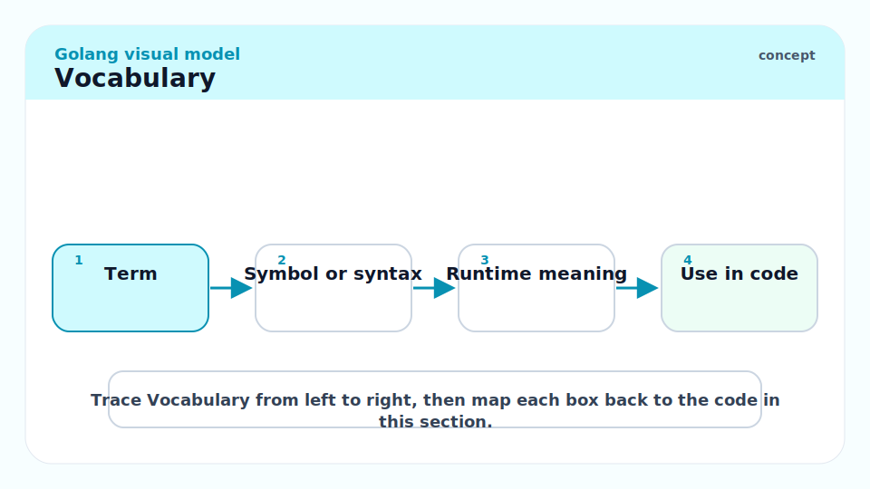
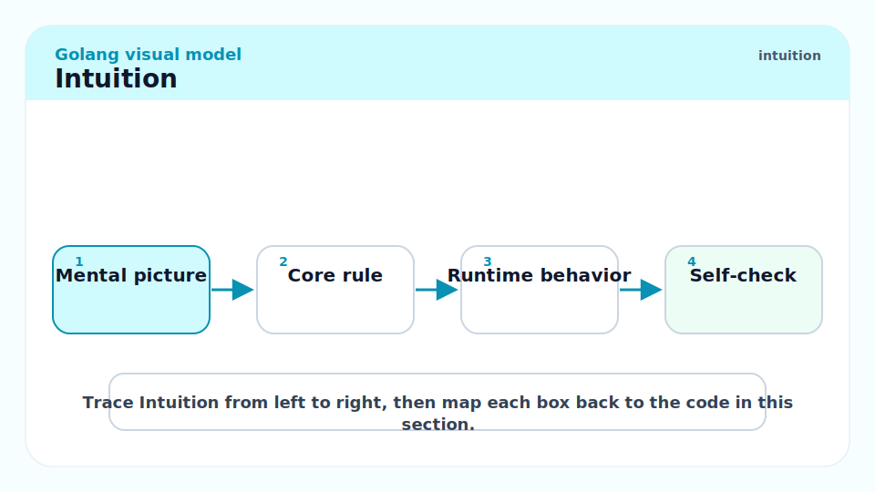
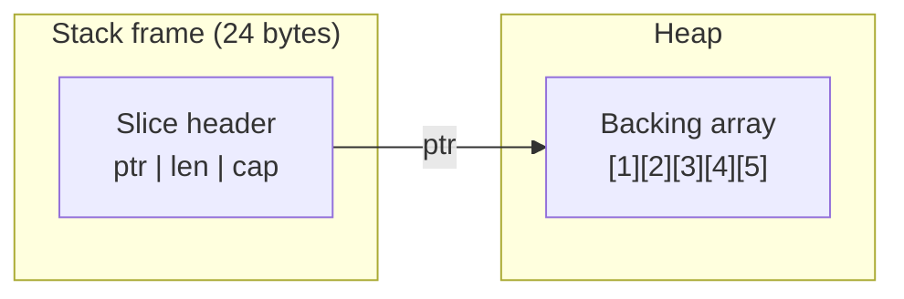
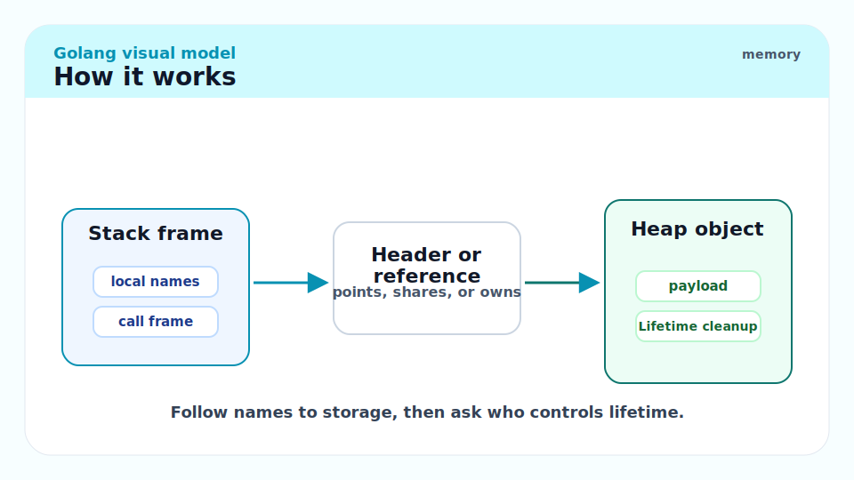
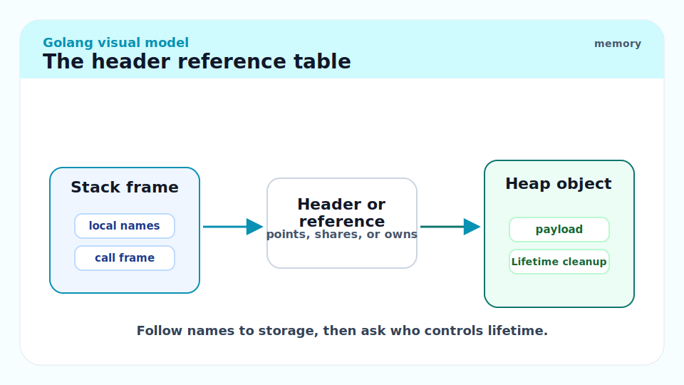
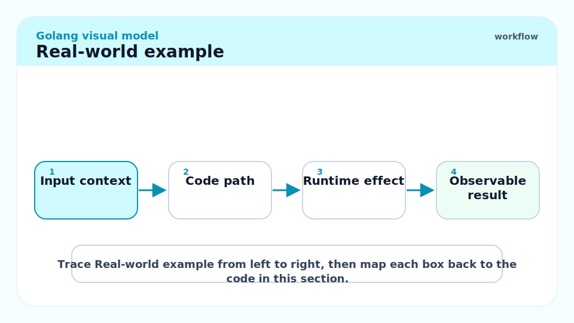
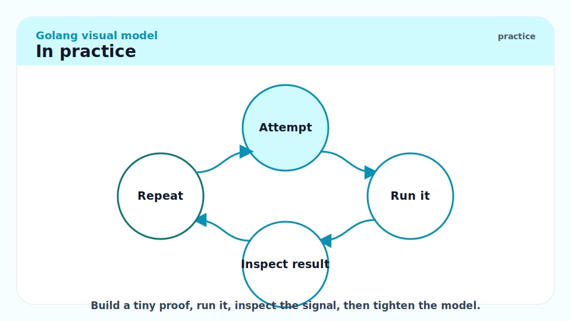
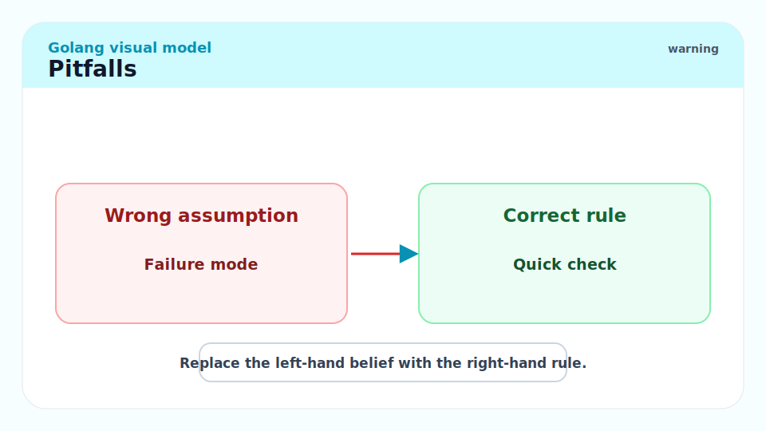
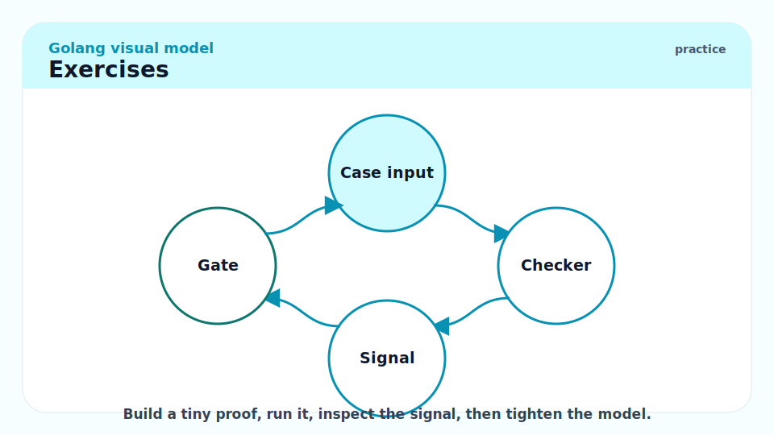

# 14 - Reference Types and Internal Headers

[toc]

> **TL;DR:** Go's "reference types" — strings, slices, maps, channels, interfaces, and function values — are all small fixed-size header structs whose fields point to memory allocated elsewhere. Copying one of these values copies the header (8–24 bytes), not the pointed-to data. Understanding the exact byte layout of each header is the key to reasoning about aliasing, nil semantics, the nil-interface-holding-non-nil-pointer gotcha, and why certain operations allocate while others do not.

## Vocabulary



**Header struct**: A small value-type struct (8–24 bytes) that describes a larger heap-allocated data structure. The Go variable holds the header; the header holds a pointer to the actual data.

---

**String header** (`reflect.StringHeader`): A 16-byte struct — `{Data *byte, Len int}` — that describes an immutable sequence of bytes. The bytes themselves are often in read-only memory (rodata).

---

**Slice header** (`reflect.SliceHeader`): A 24-byte struct — `{Data unsafe.Pointer, Len int, Cap int}` — that describes a contiguous mutable array of elements.

---

**`hmap`**: The runtime struct (in `runtime/map.go`) that a map variable points to. Contains the bucket count, hash seed, bucket array pointer, and overflow tracking. A map variable is an 8-byte pointer to an `hmap`.

---

**`hchan`**: The runtime struct (in `runtime/chan.go`) that a channel variable points to. Contains the circular buffer, element size, send/recv indices, wait queues, and a mutex. A channel variable is an 8-byte pointer to an `hchan`.

---

**`iface`**: The runtime struct (in `runtime/iface.go`) for a non-empty interface value. Two words: `{tab *itab, data unsafe.Pointer}`. `itab` carries the dynamic type and the method pointer table.

---

**`eface`**: The runtime struct for the empty interface (`any`/`interface{}`). Two words: `{_type *_type, data unsafe.Pointer}`. No method table needed.

---

**`itab`**: The interface dispatch table. A runtime-allocated (then cached) struct containing the interface type, the concrete type, and one function pointer per interface method. Built lazily on first assignment; cached in a global hash table thereafter.

---

**Closure struct**: A heap-allocated struct containing a function code pointer plus one word per captured variable (either the value itself or a pointer to it). A function-value variable is an 8-byte pointer to this struct.

---

**`unsafe.String` / `unsafe.StringData`**: Go 1.20 additions that allow round-tripping between `[]byte` and `string` without allocation when you own both buffers and can guarantee immutability.

---

## Intuition



Every "reference type" in Go is a lie in the best sense: the variable you hold is tiny and stack-friendly, while the real data lives elsewhere. Think of each header as a business card: it fits in your wallet (the stack frame), but the address printed on it points to the office building (the heap). When you pass a map to a function, you hand them your business card — they can walk to your office building and change things inside, because you both have the same address.

The implication: for these types, "copying" is cheap (you copy the business card), but it does not give the callee an independent copy of the building. Mutations through the copy affect the original. The exception is slices after a `cap`-busting `append` — that creates a new building and hands back a new business card pointing to it, leaving your original card unchanged.



## How it works



### 1. Strings

A string in Go is an immutable byte sequence described by a 16-byte header. The data pointer points either into the binary's `.rodata` section (for string constants) or into a heap-allocated byte array (for dynamically constructed strings).

```
Stack variable 's'                 .rodata (or heap)
┌─────────────────────┐            ┌─────────────────────────┐
│ Data ptr  8 bytes   │───────────▶│  h  e  l  l  o          │
│ Len       8 bytes   │  = 5       │  0x68 0x65 0x6c 0x6c 0x6f│
└─────────────────────┘            └─────────────────────────┘
```

The conceptual runtime view (never write this — it is an implementation detail):

```go
// String internal representation (never write this yourself)
// see reflect.StringHeader
type stringHeader struct {
	data *byte // pointer to first byte
	len  int   // number of bytes
}
```

Key behaviours that fall out of this layout:

- `s2 := s` copies the 16-byte header. Both `s` and `s2` share the same byte array. No allocation.
- `s + t` (concatenation) always allocates a new backing array on the heap and copies both byte sequences into it.
- `len(s)` reads the `Len` field — O(1), no pointer dereference into the byte data.
- `s[i]` indexes into `Data + i` — one pointer dereference.
- String constants are deduplicated by the compiler/linker and placed in `.rodata`. Two identical string constants may share the same backing bytes.

```go
package main

import (
	"fmt"
	"unsafe"
)

func main() {
	s := "hello"
	// Header size is always 16, regardless of string length.
	fmt.Println(unsafe.Sizeof(s))       // 16  (the header)
	fmt.Println(len(s))                 // 5   (the content length)

	// s2 shares s's backing bytes — no allocation.
	s2 := s
	// Verify by comparing data pointers via unsafe (demonstration only):
	sh1 := (*[2]uintptr)(unsafe.Pointer(&s))
	sh2 := (*[2]uintptr)(unsafe.Pointer(&s2))
	fmt.Println(sh1[0] == sh2[0]) // true — same Data pointer
}
```

> [!WARNING]
> `[]byte(s)` and `string(b)` both allocate and copy in the general case — they must, because strings are immutable but byte slices are mutable. Use `unsafe.String(ptr, len)` and `unsafe.SliceData` (Go 1.20+) only when you can guarantee the underlying bytes will not be mutated. Incorrect use yields undefined behaviour.

### 2. Slices

A slice is a 24-byte header describing a window into a contiguous array of typed elements. The three fields — pointer, length, capacity — are the complete specification of a slice's view.

```go
// Slice internal representation — conceptual, never write this
// see reflect.SliceHeader
type sliceHeader struct {
	data unsafe.Pointer // pointer to first visible element
	len  int            // number of visible elements
	cap  int            // elements from data to end of backing array
}
```

For `s := []int{10, 20, 30, 40, 50}` on a 64-bit system:

```
Stack variable 's'  (24 bytes)
┌──────────────────────────┐
│ ptr   0xC000018060       │
│ len   5                  │
│ cap   5                  │
└──────────────────────────┘
          │
          ▼
Heap backing array  (40 bytes = 5 * sizeof(int))
┌────────┬────────┬────────┬────────┬────────┐
│  10    │  20    │  30    │  40    │  50    │
│ [0]    │ [1]    │ [2]    │ [3]    │ [4]    │
└────────┴────────┴────────┴────────┴────────┘
  0xC000018060  (each cell is 8 bytes)
```

Subslice `t := s[1:3]` produces a new header pointing into the same backing array:

```
Stack variable 't'  (24 bytes)
┌──────────────────────────┐
│ ptr   0xC000018068       │  ← s.ptr + 1*sizeof(int)
│ len   2                  │
│ cap   4                  │  ← 5 - 1
└──────────────────────────┘
          │
          ▼
          ┌────────┬────────┬────────┬────────┐
          │  20    │  30    │  40    │  50    │
          │ t[0]   │ t[1]   │        │        │
          └────────┴────────┴────────┴────────┘
```

The `append` two-case diagram. Case A — capacity sufficient:

```
Before: len=3, cap=5
s  = [10 | 20 | 30 | __ | __]
                ^
          write 99 here

After append(s, 99): len=4, cap=5
s  = [10 | 20 | 30 | 99 | __]
s.ptr unchanged, s.len = 4
```

Case B — capacity exhausted, reallocation:

```
Before: len=5, cap=5
s  = [10 | 20 | 30 | 40 | 50]

append(s, 99) triggers realloc:
  1. Allocate new array of cap ~10 (growth factor ≈1.25–2x)
  2. Copy [10 20 30 40 50] to new array
  3. Write 99 at index 5
  4. Return new header {newptr, len=6, cap=10}

Old array may still be referenced by other slices!
```

The classic aliasing gotcha:

```go
package main

import "fmt"

func main() {
	// s has len=5, cap=5
	s := []int{1, 2, 3, 4, 5}
	// t shares the backing array; t has len=3, cap=5
	t := s[:3]
	// append to t: cap is 5, len is 3 — room exists.
	// Writes 99 at index 3 of the SHARED backing array.
	t = append(t, 99)
	// s[3] is now 99 — a mutation through t affected s!
	fmt.Println(s) // [1 2 3 99 5]
	fmt.Println(t) // [1 2 3 99]
}
```

> [!CAUTION]
> The three-index slice expression `s[low:high:max]` (Go 1.3+) limits the capacity of the resulting slice to `max - low`, preventing the callee from ever writing into the caller's backing array past `high`. Use it when passing a sub-slice to code you do not control: `t := s[:3:3]` makes `t`'s cap equal its len, forcing any `append` to reallocate.

### 3. Maps

A map variable is an 8-byte pointer to an `hmap` struct. A nil map variable is a nil pointer. `make(map[K]V)` allocates and initialises an `hmap` on the heap.

The simplified `hmap` (see `runtime/map.go` for the full definition):

```go
// Simplified runtime map header (internal — not for user code)
type hmap struct {
	count      int            // number of live key/value pairs
	flags      uint8          // state flags (writing, growing, etc.)
	B          uint8          // log2 of bucket count: len(buckets) == 2^B
	noverflow  uint16         // approximate number of overflow buckets
	hash0      uint32         // hash seed (randomised at make time)
	buckets    unsafe.Pointer // *[2^B]bmap — array of bucket structs
	oldbuckets unsafe.Pointer // non-nil during incremental rehash
	nevacuate  uintptr        // evacuation progress counter
	// ... overflow bucket tracking
}
```

Each bucket (`bmap`) holds exactly 8 key/value pairs in a struct-of-arrays layout. The layout stores top-hash bytes first, then all 8 keys packed together, then all 8 values packed together:

```
bmap (one bucket)
┌───────────────────────────────────────┐
│ tophash [8]uint8  — high 8 bits of    │
│    each stored key's hash, or a flag  │
│    (empty=0, evacuated, etc.)         │
├───────────────────────────────────────┤
│ keys [8]K  — all 8 keys packed        │
├───────────────────────────────────────┤
│ values [8]V — all 8 values packed     │
├───────────────────────────────────────┤
│ overflow *bmap  — next overflow bucket│
└───────────────────────────────────────┘
```

The struct-of-arrays layout (keys before values) improves cache utilisation for key-only lookups: scanning the tophash array and key array avoids loading value bytes until a match is found.

Map lookup algorithm (simplified):

```
1. hash = hashfn(key, h.hash0)
2. bucket_idx = hash & (2^B - 1)        // low B bits
3. tophash_needle = uint8(hash >> 56)   // high 8 bits
4. For each slot in bucket (and overflow):
     if tophash[slot] == tophash_needle && key[slot] == key:
         return &value[slot]
5. Return zero value (key not found)
```

```go
package main

import (
	"fmt"
	"unsafe"
)

func main() {
	// A map variable is a pointer — sizeof is always 8 on 64-bit.
	m := make(map[string]int)
	fmt.Println(unsafe.Sizeof(m)) // 8

	// nil map: reads return zero value, writes panic.
	var nilMap map[string]int
	fmt.Println(nilMap["key"]) // 0  — safe read
	// nilMap["key"] = 1       // would panic: assignment to entry in nil map
	_ = nilMap

	m["alpha"] = 1
	m["beta"] = 2
	fmt.Println(len(m)) // 2
}
```

> [!NOTE]
> Map iteration order is randomised *per-iteration*, not per-program-run. The Go runtime permutes the start bucket and start slot within a bucket on every `range` call. Programs that relied on apparent stability before Go 1.0 were silently broken. Never sort in your mental model; always sort explicitly for deterministic output.

### 4. Channels

A channel variable is an 8-byte pointer to an `hchan` struct. `make(chan T, n)` allocates an `hchan` on the heap and, for buffered channels (`n > 0`), an immediately-following circular buffer of `n` elements.

```go
// Simplified hchan (see runtime/chan.go)
type hchan struct {
	qcount   uint           // elements currently in queue
	dataqsiz uint           // capacity (0 for unbuffered)
	buf      unsafe.Pointer // pointer to circular buffer (for buffered channels)
	elemsize uint16         // size of one element in bytes
	closed   uint32         // 1 if channel is closed
	sendx    uint           // send index in circular buffer
	recvx    uint           // receive index in circular buffer
	recvq    waitq          // list of goroutines blocked on receive
	sendq    waitq          // list of goroutines blocked on send
	lock     mutex          // protects all fields above
}
```

For `ch := make(chan int, 3)`, the runtime allocates:

```
hchan struct  (on heap)
┌────────────────────────────────────┐
│ qcount   = 0                       │
│ dataqsiz = 3                       │
│ buf ─────────────────────────────────────────┐
│ elemsize = 8 (sizeof int)          │         │
│ closed   = 0                       │         │
│ sendx    = 0                       │         │
│ recvx    = 0                       │         │
│ recvq    = (empty waitq)           │         │
│ sendq    = (empty waitq)           │         │
│ lock     = (unlocked mutex)        │         │
└────────────────────────────────────┘         │
                                               ▼
                               Circular buffer  (24 bytes = 3 * 8)
                               ┌───────┬───────┬───────┐
                               │  [0]  │  [1]  │  [2]  │
                               └───────┴───────┴───────┘
```

When a goroutine sends to a full buffered channel, the runtime parks it in `sendq` (a linked list of `sudog` structs, one per blocked goroutine). When a receiver arrives and pops a value from the buffer, it also unparks the first `sudog` from `sendq` and copies its value into the buffer — a direct goroutine-to-goroutine handoff.

Unbuffered channels (`make(chan int)`) skip the circular buffer entirely: every send blocks until a receiver is ready, and the runtime transfers the value directly between the sender and receiver goroutines via the `sudog` mechanism — no intermediate buffering.

```go
package main

import (
	"fmt"
	"unsafe"
)

func main() {
	ch := make(chan int, 3)
	// Channel variable is always 8 bytes — a pointer to hchan.
	fmt.Println(unsafe.Sizeof(ch)) // 8

	ch <- 10
	ch <- 20
	v := <-ch
	fmt.Println(v) // 10  (FIFO order)
}
```

> [!TIP]
> For channels carrying large structs, send a pointer (`chan *BigStruct`) instead of a value. The channel's circular buffer stores one pointer (8 bytes) per slot instead of `sizeof(BigStruct)` bytes, reducing the buffer's memory footprint and the cost of the per-send copy.

### 5. Interfaces

An interface value is exactly two machine words (16 bytes). For a non-empty interface (`io.Reader`, `fmt.Stringer`, any interface with methods), those two words are `{tab *itab, data unsafe.Pointer}`. For the empty interface (`any`/`interface{}`), they are `{_type *_type, data unsafe.Pointer}`.

```go
// Non-empty interface (iface) — internal, see runtime/iface.go
type iface struct {
	tab  *itab          // points to type+method dispatch table
	data unsafe.Pointer // points to the concrete value
}

// Empty interface (eface) — internal
type eface struct {
	_type *_type        // points to runtime type descriptor
	data  unsafe.Pointer
}
```

The `itab` is the critical piece. It is built lazily the first time a concrete type is assigned to an interface, then cached globally in a hash table keyed by `(interface type, concrete type)`. Its layout:

```
itab
┌────────────────────────────────────┐
│ inter  *interfacetype (8 bytes)    │  — describes the interface
│ _type  *_type (8 bytes)            │  — describes the concrete type
│ hash   uint32 (4 bytes)            │  — copy of _type.hash for fast type-switch
│ _      [4]byte padding             │
│ fun    [n]uintptr                  │  — one function pointer per interface method
└────────────────────────────────────┘
```

For `var w io.Writer = os.Stdout`:

```
Stack variable 'w' (16 bytes)
┌─────────────────────────────────┐
│ tab  ──────────────────────────────────▶ itab{*os.File satisfies io.Writer}
│ data ──────────────────────────────────▶ *os.File (the os.Stdout pointer)
└─────────────────────────────────┘
```

The nil-interface-holding-non-nil-pointer gotcha: an interface value is nil only when *both* `tab` and `data` are nil. If you assign a typed nil pointer to an interface, the `tab` field is non-nil (it identifies the concrete type), so the interface is not nil even though the data pointer is nil.

```go
package main

import "fmt"

type MyError struct{ msg string }

// Error implements the error interface.
func (e *MyError) Error() string { return e.msg }

func getError(fail bool) error {
	var p *MyError = nil
	if fail {
		p = &MyError{"something failed"}
	}
	// BUG: always returns a non-nil interface because tab is always set.
	return p
}

func main() {
	err := getError(false)
	// err != nil even though p was nil!
	// iface{tab: *itab(*MyError, error), data: nil} — tab is non-nil.
	if err != nil {
		fmt.Println("unexpected:", err) // this branch executes
	}
}
```

The fix: return a nil `error` interface explicitly.

```go
func getErrorFixed(fail bool) error {
	if fail {
		return &MyError{"something failed"}
	}
	return nil // returns iface{tab: nil, data: nil} — truly nil
}
```

> [!IMPORTANT]
> **An interface value is nil if and only if both its type pointer and its data pointer are nil.** A typed nil pointer assigned to an interface produces a non-nil interface with a nil data pointer. This is the single most confusing behaviour in Go for newcomers and experienced practitioners alike. The rule is: never return a typed nil through an interface; always return an untyped nil (`return nil`).

### 6. Function values and closures

A function value in Go is an 8-byte pointer to a runtime-allocated **closure struct**. For a plain function reference (`f := someFunc`), the struct contains just the function's code address. For a closure, it also contains one word per captured variable.

```
Function value variable (8 bytes on stack)
┌──────────────────┐
│ ptr 0xC000020010 │
└──────────────────┘
         │
         ▼
Closure struct (on heap)
┌────────────────────────────────┐
│ funcptr  *code_for_the_closure │  → machine code in .text
│ capture1 *int (or value)       │  → captured variable x (on heap)
│ capture2 ...                   │
└────────────────────────────────┘
```

For `func() { fmt.Println(x) }` where `x` is a local `int`: the compiler detects that the closure escapes (it is assigned or passed somewhere that outlives the current frame), so `x` is heap-promoted, and the closure struct contains a pointer to `x`'s heap location. Mutating `x` inside the closure mutates the same memory as the outer variable — they share the heap slot.

```go
package main

import "fmt"

func makeCounter() func() int {
	n := 0 // n escapes to heap: captured by the returned closure
	return func() int {
		n++    // mutates the heap-allocated n
		return n
	}
}

func main() {
	c1 := makeCounter()
	c2 := makeCounter() // independent closure, independent n
	fmt.Println(c1(), c1(), c1()) // 1 2 3
	fmt.Println(c2())             // 1  (separate heap n)
}
```

## The header reference table



A one-stop summary of all six header types, their sizes on a 64-bit platform, and what they ultimately point to.

| Type | Header size | Fields | What it points to |
| :--- | ---: | :--- | :--- |
| `string` | 16 bytes | `{data *byte, len int}` | Immutable byte array (often `.rodata`) |
| `[]T` | 24 bytes | `{data *T, len int, cap int}` | Mutable backing array on heap |
| `map[K]V` | 8 bytes | pointer | `hmap` struct on heap (buckets, seed, …) |
| `chan T` | 8 bytes | pointer | `hchan` struct on heap (buf, waitqs, lock) |
| `interface{T}` / `any` | 16 bytes | `{tab *itab, data unsafe.Pointer}` | `itab` (type+dispatch) + concrete value |
| function value | 8 bytes | pointer | closure struct (code ptr + captured vars) |

> [!NOTE]
> `reflect.StringHeader` and `reflect.SliceHeader` were the historical way to inspect these layouts. As of Go 1.20, the preferred approach is `unsafe.String`, `unsafe.StringData`, `unsafe.Slice`, and `unsafe.SliceData` — these are compiler-recognised builtins that avoid the pitfall of constructing a `reflect.SliceHeader` on the stack and then passing its address to `unsafe.Pointer` (which could be misused).

## Real-world example



The following program demonstrates three practical implications of the header model in a single benchmark: (1) slice append stomp, (2) interface nil pitfall, and (3) `sync.Map` vs mutex-protected `map` at byte level.

```go
package main

import (
	"fmt"
	"sync"
	"unsafe"
)

// --- Part 1: slice append stomp ---

// appendStomp demonstrates the three-index slice fix for the aliasing bug.
func appendStomp() {
	s := []int{1, 2, 3, 4, 5}

	// Buggy: t shares cap with s; append to t stomps s[3].
	tBuggy := s[:3]
	tBuggy = append(tBuggy, 99)
	fmt.Println("buggy s:", s) // [1 2 3 99 5]

	// Reset
	s = []int{1, 2, 3, 4, 5}

	// Fixed: three-index slice caps t at len=3, forcing realloc on append.
	tFixed := s[:3:3]
	tFixed = append(tFixed, 99)
	fmt.Println("fixed s:", s) // [1 2 3 4 5] — untouched
	_ = tFixed
}

// --- Part 2: nil interface pitfall ---

type AppError struct{ Code int }

// Error implements the error interface for AppError.
func (e *AppError) Error() string { return fmt.Sprintf("code %d", e.Code) }

// buggyGet demonstrates the typed-nil-in-interface bug.
func buggyGet(ok bool) error {
	var e *AppError
	if !ok {
		return e // iface{tab: non-nil, data: nil} — NOT a nil error
	}
	return &AppError{Code: 404}
}

// safeGet fixes the bug by returning untyped nil.
func safeGet(ok bool) error {
	if !ok {
		return nil // iface{tab: nil, data: nil} — truly nil
	}
	return &AppError{Code: 404}
}

// --- Part 3: header sizes ---

func headerSizes() {
	var s string
	var sl []int
	var m map[string]int
	var ch chan int
	var iface interface{}
	var fn func()

	fmt.Printf("string header:    %d bytes\n", unsafe.Sizeof(s))
	fmt.Printf("slice header:     %d bytes\n", unsafe.Sizeof(sl))
	fmt.Printf("map variable:     %d bytes\n", unsafe.Sizeof(m))
	fmt.Printf("chan variable:     %d bytes\n", unsafe.Sizeof(ch))
	fmt.Printf("interface{}:      %d bytes\n", unsafe.Sizeof(iface))
	fmt.Printf("func():           %d bytes\n", unsafe.Sizeof(fn))
}

func main() {
	appendStomp()

	fmt.Println("buggy nil check:", buggyGet(false) != nil)  // true (bug)
	fmt.Println("safe nil check: ", safeGet(false) != nil)   // false (correct)

	headerSizes()
}
```

Expected output on any 64-bit Go platform:

```
buggy s: [1 2 3 99 5]
fixed s: [1 2 3 4 5]
buggy nil check: true
safe nil check:  false
string header:    16 bytes
slice header:     24 bytes
map variable:     8 bytes
chan variable:     8 bytes
interface{}:      16 bytes
func():           8 bytes
```

> [!TIP]
> Run `go vet ./...` on any codebase that returns concrete pointer types through interfaces — the vet tool's `nilness` analyser catches common patterns of the typed-nil-in-interface bug, though it misses some cases involving separate variables. A stricter check is `staticcheck`'s `SA5011` and `SA4023`.

## In practice



**Interface boxing and allocation**: Assigning a non-pointer value to an interface allocates a heap copy of the value to place in the `data` field. For values that fit in one pointer word (integers, booleans, small structs on some architectures), the compiler *sometimes* stores the value directly in the `data` field without allocation, but this is an implementation detail you cannot rely on. In hot paths, avoid repeated boxing of the same value by caching the interface-typed version.

**`sync.Map` vs mutex-protected `map`**: A regular `map[K]V` is an `hmap` pointer. A `sync.Map` is a struct containing an atomic pointer to a read-only `map` (for lock-free reads) plus a dirty `map` behind a mutex (for writes). At the byte level, `sync.Map` stores each value as `any` (a boxed interface), which means every stored value is heap-allocated and pointer-indirected regardless of its type. This makes `sync.Map` worse than a mutex-protected typed map for write-heavy workloads or for storing small scalar values.

**String interning**: String constants in the binary share their backing bytes — two `"hello"` literals in different packages may point to the same `.rodata` address. Runtime-constructed strings (via `+`, `fmt.Sprintf`, `strings.Builder.String`) always allocate new backing arrays. If you need many repeated strings to share memory at runtime, use a string intern pool (a `sync.Map[string, string]` where you normalise to a canonical instance).

**Channel direction and the underlying pointer**: `chan int`, `<-chan int`, and `chan<- int` are three distinct types in Go's type system, but at runtime they are all 8-byte pointers to the same `hchan` struct. The directionality is a compile-time restriction only; the pointer value is identical.

> [!WARNING]
> The `reflect.SliceHeader` and `reflect.StringHeader` types are deprecated in Go 1.20 in favour of the new `unsafe` builtins. Code that constructs a `reflect.SliceHeader` on the stack, then converts it to `unsafe.Pointer`, is technically unsound — the GC does not scan the `Data unsafe.Pointer` field of a struct it does not recognise as containing pointers. Use `unsafe.Slice(ptr, len)` and `unsafe.String(ptr, len)` instead.

## Pitfalls



- **"Copying a map copies the map."** — Copying a map variable copies the 8-byte `hmap` pointer. Both variables now reference the same hash table. To get an independent map you must manually copy key-value pairs.
- **"A nil channel blocks forever; that is useless."** — Receiving from or sending to a nil channel blocks forever, but this is deliberately useful: in `select` statements, a nil channel case is permanently disabled. You can selectively enable/disable `select` arms by setting a channel to nil.
- **"Interface comparison compares the underlying values."** — Interface comparison (`==`) compares both the type pointer and the data pointer. If the concrete type is not comparable (e.g., `[]int`), a runtime panic occurs. Use `reflect.DeepEqual` for value-level comparison of interface-wrapped slices or maps.
- **"A function value is just a function pointer."** — In Go, function values are pointers to closure structs, not bare function pointers. Calling `f()` through a function value involves an extra indirection to load the code pointer from the struct. This is why Go does not use the C calling convention for function values.
- **"String and `[]byte` share memory when converted."** — `string(b)` and `[]byte(s)` allocate and copy. The compiler has a handful of special-cased optimisations (e.g., `string(b)` in a map key lookup that is immediately discarded may avoid allocation), but in the general case you always pay for the copy.
- **"`unsafe.Sizeof` measures the data size."** — `unsafe.Sizeof` measures the header (the stack variable), not the pointed-to data. `unsafe.Sizeof("hello")` is 16 (the string header); `len("hello")` is 5 (the number of bytes in the content).

## Exercises



### Exercise 1 — `unsafe.Sizeof` vs `len`

What does each of the following expressions return, and why?

```go
s := "hello world"
fmt.Println(unsafe.Sizeof(s)) // A
fmt.Println(len(s))           // B

sl := []int{1, 2, 3, 4}
fmt.Println(unsafe.Sizeof(sl)) // C
fmt.Println(len(sl))           // D
```

#### Solution

- **A — `unsafe.Sizeof(s)` = 16**: `s` is a `string`, which is a 16-byte header `{data *byte, len int}`. `unsafe.Sizeof` measures the header, not the backing bytes. The answer is always 16 on a 64-bit platform regardless of the string's content.
- **B — `len(s)` = 11**: `len` reads the `Len` field of the string header. "hello world" is 11 bytes (ASCII, one byte per character).
- **C — `unsafe.Sizeof(sl)` = 24**: `sl` is a `[]int`, which is a 24-byte header `{data *int, len int, cap int}`. Again, the header size is constant regardless of how many elements the slice contains.
- **D — `len(sl)` = 4**: `len` reads the `Len` field of the slice header. The slice was initialised with 4 elements.

The pattern: `unsafe.Sizeof` always measures the *variable itself* (the header on the stack). `len` reads a semantic length from that header.

---

### Exercise 2 — Slice append stomp, step by step

What does the following print? Walk through each operation with a header diagram.

```go
s := []int{1, 2, 3, 4, 5}
t := s[:3]
t = append(t, 99)
fmt.Println(s)
fmt.Println(t)
```

#### Solution

Step 1: `s := []int{1, 2, 3, 4, 5}`

```
s = {ptr: 0xA000, len: 5, cap: 5}
Backing array at 0xA000: [1][2][3][4][5]
```

Step 2: `t := s[:3]`

```
t = {ptr: 0xA000, len: 3, cap: 5}  ← same ptr, smaller window, same cap
Backing array at 0xA000: [1][2][3][4][5]  ← shared
```

Step 3: `t = append(t, 99)`

`t.len` (3) < `t.cap` (5) — no reallocation. Writes 99 at `t.ptr + t.len*8 = 0xA000 + 3*8 = 0xA018`:

```
Backing array at 0xA000: [1][2][3][99][5]  ← index 3 stomped
t = {ptr: 0xA000, len: 4, cap: 5}
```

Step 4: print

```
s = {ptr: 0xA000, len: 5, cap: 5}
s[3] is now 99 because s and t shared the backing array.
```

Output:
```
[1 2 3 99 5]
[1 2 3 99]
```

Fix: use `t := s[:3:3]` to cap `t`'s capacity at 3, forcing reallocation on `append`.

---

### Exercise 3 — The nil interface holding a nil pointer

Explain why the following `if` branch is entered, then fix the code.

```go
type MyError struct{ msg string }

func (e *MyError) Error() string { return e.msg }

func mayFail(fail bool) error {
	var e *MyError
	if fail {
		e = &MyError{"failed"}
	}
	return e
}

func main() {
	err := mayFail(false)
	if err != nil {
		fmt.Println("error:", err) // Why does this execute?
	}
}
```

#### Solution

At the bit level, `mayFail(false)` returns an `iface` (a two-word interface value):

```
iface{
    tab:  *itab(*MyError, error)  ← non-nil: type information IS present
    data: nil                     ← no concrete value
}
```

The interface is non-nil because `tab` is non-nil. The Go runtime set `tab` to the `*MyError`-implements-`error` itab because the function's return expression is typed as `*MyError`. The `data` field being nil only means the pointer value is nil — but the interface variable itself is not nil.

The `err != nil` test checks the full 16-byte interface value. Since `tab != nil`, the condition is true.

Fix: return `nil` directly (untyped nil, producing `iface{nil, nil}`):

```go
func mayFailFixed(fail bool) error {
	if fail {
		return &MyError{"failed"}
	}
	return nil // untyped nil → iface{tab: nil, data: nil} → truly nil
}
```

---

### Exercise 4 — Thread-safe map: mutex vs `sync.Map` at the byte level

Implement a thread-safe string counter two ways. Explain what `sync.Map` stores internally and when each approach wins.

#### Solution

**Approach A — Mutex-protected typed map:**

```go
package main

import (
	"fmt"
	"sync"
)

// Counter is a thread-safe word frequency counter backed by a typed map.
type Counter struct {
	mu sync.Mutex
	m  map[string]int
}

// NewCounter allocates a Counter ready for use.
func NewCounter() *Counter {
	return &Counter{m: make(map[string]int)}
}

// Inc increments the count for word w.
func (c *Counter) Inc(w string) {
	c.mu.Lock()
	c.m[w]++
	c.mu.Unlock()
}

// Get returns the current count for w.
func (c *Counter) Get(w string) int {
	c.mu.Lock()
	defer c.mu.Unlock()
	return c.m[w]
}

func main() {
	c := NewCounter()
	var wg sync.WaitGroup
	words := []string{"go", "rust", "go", "zig", "go"}
	for _, w := range words {
		wg.Add(1)
		go func(word string) {
			defer wg.Done()
			c.Inc(word)
		}(w)
	}
	wg.Wait()
	fmt.Println(c.Get("go")) // 3
}
```

**Approach B — `sync.Map`:**

```go
// CounterSyncMap uses sync.Map — note: values must be stored as any.
type CounterSyncMap struct {
	m sync.Map
}

// Inc increments the count for word w using LoadOrStore + atomic add.
// sync.Map does not have a built-in atomic increment — requires extra care.
func (c *CounterSyncMap) Inc(w string) {
	// sync.Map stores values as any, boxing the *int on the heap.
	actual, _ := c.m.LoadOrStore(w, new(int))
	// Use sync/atomic for the actual increment.
	// (This pattern is a common pitfall — see note below.)
	_ = actual
}
```

**At the byte level, what `sync.Map` stores:**

`sync.Map` keeps two maps internally: a `read` map (a `sync/atomic.Pointer` to a `readOnly` struct containing a `map[any]*entry`) and a `dirty` map (a `map[any]*entry` behind a mutex). Each `*entry` is a pointer to an `atomic.Pointer[any]` that stores the value. Every key and value is stored as `any` — a 16-byte interface. For a `string → int` counter, this means:

- Each key is a 16-byte `iface{*stringtype, string_header_ptr}` — the string is boxed.
- Each value pointer is a `*entry` wrapping an `atomic.Pointer[any]` wrapping a boxed `int`.
- Total per-entry overhead: roughly 40–50 bytes vs 16 bytes (string key + 8 bytes int value in the typed map).

**When each wins:**

- **Mutex map**: Wins for write-heavy or balanced read/write workloads, for typed values (no boxing), and when key types are known. This is the common case.
- **`sync.Map`**: Wins for *read-mostly, write-once* workloads — the read path is lock-free after the initial write. Examples: plugin registries, flag maps, routing tables. The Go standard library uses `sync.Map` for `itab` caching and for method sets — structures written once at startup and read millions of times thereafter.

---

### Exercise 5 — Buffered channel hchan walkthrough

A buffered channel `ch := make(chan int, 2)` has two senders and one receiver. Trace the `hchan` fields across these operations:

```
G1: ch <- 10
G2: ch <- 20
G3: ch <- 30   // buffer full — G3 blocks
G1: v := <-ch
```

#### Solution

Initial state after `make(chan int, 2)`:

```
hchan{ qcount:0, dataqsiz:2, buf:[_][_], sendx:0, recvx:0, sendq:[], recvq:[] }
```

After `G1: ch <- 10`:

```
hchan{ qcount:1, dataqsiz:2, buf:[10][_], sendx:1, recvx:0, sendq:[], recvq:[] }
```

`sendx` advances to 1 (next write position). `qcount` increments to 1. G1 does not block — space was available.

After `G2: ch <- 20`:

```
hchan{ qcount:2, dataqsiz:2, buf:[10][20], sendx:0, recvx:0, sendq:[], recvq:[] }
```

Buffer full (`qcount == dataqsiz`). `sendx` wraps to 0 (circular). G2 does not block.

After `G3: ch <- 30` (buffer full):

```
hchan{ qcount:2, dataqsiz:2, buf:[10][20], sendx:0, recvx:0,
       sendq:[sudog{G3, value:30}], recvq:[] }
```

G3 is parked: the runtime creates a `sudog` for G3 holding the value 30, links it into `sendq`, and parks G3 on the scheduler. G3 is not on any OS thread.

After `G1: v := <-ch`:

1. Runtime pops `buf[recvx=0]` = 10. `recvx` advances to 1. `qcount` decrements to 1.
2. Runtime sees `sendq` is non-empty. It dequeues G3's `sudog`, copies value 30 into `buf[sendx=0]`. `sendx` advances to 1. `qcount` increments to 2.
3. G3 is unparked and scheduled to resume.

```
hchan{ qcount:2, dataqsiz:2, buf:[30][20], sendx:1, recvx:1,
       sendq:[], recvq:[] }
```

`v` = 10. G3 resumes. The buffer now holds [30][20] at indices 0 and 1 (circular), with `recvx=1` and `sendx=1` — next read is from index 1 (value 20).

## Sources

- Go runtime map implementation: https://github.com/golang/go/blob/master/src/runtime/map.go
- Go runtime channel implementation: https://github.com/golang/go/blob/master/src/runtime/chan.go
- Go runtime interface dispatch: https://github.com/golang/go/blob/master/src/runtime/iface.go
- Go runtime slice internals: https://github.com/golang/go/blob/master/src/runtime/slice.go
- "Go Data Structures: Interfaces" by Russ Cox: https://research.swtch.com/interfaces
- "Go Slices: usage and internals" (Go Blog): https://go.dev/blog/slices-intro
- "Go maps in action" (Go Blog): https://go.dev/blog/maps
- "Strings, bytes, runes and characters in Go" (Go Blog): https://go.dev/blog/strings
- Go unsafe package additions (Go 1.17–1.20): https://pkg.go.dev/unsafe
- `reflect.StringHeader` deprecation notice: https://pkg.go.dev/reflect#StringHeader
- The Go Programming Language (Donovan & Kernighan) — §4.2 Slices, §4.3 Maps.

## Related

- [13 - Memory: Stack, Heap, and Variables](./13-memory-stack-heap-and-variables.md)
- [3 - Composite Types: Arrays, Slices, Maps, Structs](./3-composite-types.md)
- [5 - Interfaces and Type Assertions](./5-interfaces-and-type-assertions.md)
- [7 - Goroutines and Channels](./7-goroutines-and-channels.md)
- [9 - Memory Management and the GC](./9-memory-management-gc.md)
- [4 - Functions, Closures, and Methods](./4-functions-closures-methods.md)
