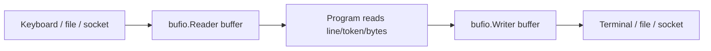

# 15 - Buffers, Input, and Output

[toc]

> **TL;DR:** In Go, input and output are usually byte streams behind the `io.Reader` and `io.Writer` interfaces. A buffer is temporary memory placed between the program and a slower source or sink, such as a terminal, file, socket, or HTTP body. When debugging `bufio.Reader`, the useful value is usually the line or token returned by the read call; the internal backing buffer often contains extra zero bytes because it was allocated with spare capacity.

## Vocabulary

**Byte stream**: A sequence of bytes read or written in order. Files, terminal input, network connections, and HTTP bodies are all modeled as streams.

---

**`io.Reader`**: The standard interface for pulling bytes from a source. Its method is `Read(p []byte) (n int, err error)`, where `p` is caller-owned scratch space and `n` says how many bytes were filled.

---

**`io.Writer`**: The standard interface for pushing bytes to a destination. Its method is `Write(p []byte) (n int, err error)`, where `p` contains the bytes the caller wants written.

---

**Input buffer**: Temporary memory that stores bytes already read from an underlying source but not yet consumed by the program.

---

**Output buffer**: Temporary memory that stores bytes the program has written but that have not yet been flushed to the underlying destination.

---

**`bufio.Reader`**: A buffered wrapper around an `io.Reader`. It reads larger chunks from the source, keeps them in memory, and serves smaller reads from that memory.

---

**`bufio.Writer`**: A buffered wrapper around an `io.Writer`. It collects small writes in memory and sends them to the destination when the buffer fills or when `Flush` is called.

---

**`bytes.Buffer`**: An in-memory buffer that implements both `io.Reader` and `io.Writer`. It is useful for tests, string/byte construction, and temporary output.

---

**Flush**: The operation that forces buffered output to leave memory and go to the underlying writer. Forgetting to flush a `bufio.Writer` is a common reason output appears to be missing.

---

## Intuition

Raw I/O is slow compared with memory. A terminal, file, or socket often delivers bytes in chunks, while the program may want one line, one token, or one field at a time. A buffer absorbs that mismatch: it reads or writes in efficient chunks while exposing a convenient API to the rest of the program.

For input, the buffer answers "what bytes have arrived but have not been consumed yet?" For output, the buffer answers "what bytes has my program produced but not pushed out yet?" The same word "buffer" appears in both directions, but the ownership and failure modes differ.



## How Input Works

Input starts outside the program. When a user types `3` and presses Enter in a terminal, the terminal provides two bytes to the process: the ASCII byte for `3`, then a newline byte. In decimal that is `[51, 10]`; in hex that is `[0x33, 0x0a]`.

### `os.Stdin` to `bufio.Reader`

`os.Stdin` is an `*os.File`, and it implements `io.Reader`. Wrapping it in `bufio.NewReader` gives the program line-oriented helpers such as `ReadString('\n')`, `ReadBytes('\n')`, and `ReadSlice('\n')`.

```go
reader := bufio.NewReader(os.Stdin)
line, err := reader.ReadString('\n')
```

The call to `ReadString('\n')` keeps reading until it sees a newline byte or an error. If the user typed `3` and pressed Enter, the returned string is `"3\n"`.

### Trimming User Input

Most CLI menus do not want the newline. They want the command text. That is why a helper usually trims whitespace before returning the user's choice.

```go
func readLine(reader *bufio.Reader) (string, error) {
	line, err := reader.ReadString('\n')
	if err != nil && len(line) == 0 {
		return "", err
	}
	return strings.TrimSpace(line), nil
}
```

With input `3\n`, this function behaves like this:

| Step | Value |
| :--- | :--- |
| Raw terminal bytes | `[51, 10]` |
| Raw string from `ReadString` | `"3\n"` |
| After `strings.TrimSpace` | `"3"` |
| Menu branch matched | `case "3"` |

> [!IMPORTANT]
> A debugger does not rewind execution. If you press `3` before setting a breakpoint, the program already ran that branch. Set the breakpoint on an executable line in the branch or inside the called function, then enter `3` again.

### Understanding the Debugger Buffer View

When inspecting a `bufio.Reader` in a debugger, you may see an internal field named `buf` with many entries. That is the reader's backing byte slice, not the clean logical input value. The slice has spare capacity, so unused slots often appear as `0`.

Example debugger values:

```text
[0] = 51 = 0x33
[1] = 10 = 0x0a
[2] = 0 = 0x0
```

The meaningful bytes are the first two: `51` is the ASCII byte for `"3"`, and `10` is newline. The zero at index 2 is usually just unused capacity in the internal buffer.

> [!TIP]
> In a debugger, inspect the returned local variables first: `line`, `choice`, `err`, and any parsed value. Internal `bufio.Reader` fields are useful for learning, but production logic should depend on exported methods and returned values.

## How Output Works

Output is the reverse direction. The program produces bytes and writes them to an `io.Writer`, such as `os.Stdout`, `os.Stderr`, a file, an HTTP response, or a `bytes.Buffer` in a test.

### Direct Writes

The `fmt` package writes formatted text to any `io.Writer`. A CLI can print to `out io.Writer` instead of hard-coding `os.Stdout`, which makes the code easier to test.

```go
func printMenu(out io.Writer) {
	fmt.Fprintln(out, "1. Create market order")
	fmt.Fprintln(out, "2. Select popular forex pair")
	fmt.Fprintln(out, "3. Check config")
	fmt.Fprintln(out, "4. Quit")
	fmt.Fprint(out, "Choose an option: ")
}
```

This function does not care whether `out` is the terminal, a file, or a test buffer. It only needs something that satisfies `io.Writer`.

### Buffered Writes

`bufio.Writer` is useful when the program performs many small writes to a slower destination. The writer accumulates bytes in memory, then writes a larger chunk to the underlying destination.

```go
w := bufio.NewWriter(os.Stdout)
fmt.Fprintln(w, "hello")
fmt.Fprintln(w, "world")

if err := w.Flush(); err != nil {
	return err
}
```

Until `Flush` runs, the output may still be inside the process. That is different from `fmt.Fprintln(os.Stdout, ...)`, which writes directly to the terminal's file descriptor.

> [!WARNING]
> If you use `bufio.Writer`, always flush it before returning, exiting, or handing control back to code that expects the output to be visible. A missing `Flush` is one of the most common buffered-output bugs.

## Real-world Example

This example models a CLI prompt without using the real terminal. The input is a `strings.Reader`; the output is a `bytes.Buffer`. That lets a test prove the menu behavior without typing interactively.

```go
package main

import (
	"bufio"
	"bytes"
	"fmt"
	"io"
	"strings"
)

func prompt(in io.Reader, out io.Writer) (string, error) {
	reader := bufio.NewReader(in)

	fmt.Fprintln(out, "1. Create market order")
	fmt.Fprintln(out, "2. Select popular forex pair")
	fmt.Fprintln(out, "3. Check config")
	fmt.Fprintln(out, "4. Quit")
	fmt.Fprint(out, "Choose an option: ")

	line, err := reader.ReadString('\n')
	if err != nil && len(line) == 0 {
		return "", err
	}
	return strings.TrimSpace(line), nil
}

func main() {
	input := strings.NewReader("3\n")
	var output bytes.Buffer

	choice, err := prompt(input, &output)
	if err != nil {
		panic(err)
	}

	fmt.Printf("choice: %q\n", choice)
	fmt.Printf("captured output:\n%s", output.String())
}
```

The input source contains exactly the bytes a user would have typed: `"3\n"`. The function under test does not know that the bytes came from memory instead of a keyboard. That is the power of programming to `io.Reader` and `io.Writer`.

Expected output:

```text
choice: "3"
captured output:
1. Create market order
2. Select popular forex pair
3. Check config
4. Quit
Choose an option:
```

## Debugging Checklist

When a buffered input or output path looks confusing, start with the values your code actually consumes. Internal buffers are implementation details, and they often contain stale or unused bytes that distract from the bug.

1. Break on the read call, such as `ReadString`, `ReadBytes`, `Scanner.Scan`, or `io.ReadAll`.
2. Step over the read call and inspect `line`, `bytes`, `scanner.Text()`, `n`, and `err`.
3. For menu input, inspect the value after trimming or parsing, such as `choice`.
4. For output, inspect the concrete writer: `os.Stdout`, `bytes.Buffer`, `http.ResponseWriter`, or `bufio.Writer`.
5. If using `bufio.Writer`, confirm `Flush` runs on every successful path and every error path that still needs visible output.

> [!NOTE]
> A `bufio.Reader` may read more bytes from the underlying source than the current call returns. That is normal. The extra bytes remain buffered for the next read.

## In Practice

Use `bufio.Reader` when you need line-oriented or token-oriented input from a stream. Use `bufio.Scanner` for simple token loops, but remember its default token limit. Use `ReadString`, `ReadBytes`, or `ReadSlice` when you need explicit delimiter behavior or very long lines.

Use `bytes.Buffer` or `strings.Builder` when the data lives entirely in memory. Use `bytes.Buffer` when you need `[]byte` behavior or an `io.Writer`; use `strings.Builder` when you are building text and only need the final string.

For CLIs, prefer function signatures like `func run(args []string, in io.Reader, out io.Writer) error`. That keeps terminal I/O at the boundary and makes the core behavior testable with memory-backed readers and writers.

## Pitfalls

Most buffering bugs come from looking at the wrong layer. Ask whether the problem is in the bytes supplied by the source, the buffered wrapper, the parsed value, or the final destination.

- **Inspecting the whole internal buffer as if it were input**: The backing slice contains capacity, not just meaningful bytes. Prefer the returned line/token.
- **Setting a breakpoint after the branch already ran**: The debugger pauses future execution only. Trigger the input again or restart the session.
- **Forgetting `Flush`**: A `bufio.Writer` can hold output in memory until flushed.
- **Assuming one read equals one user action**: A buffered reader may read ahead and keep extra bytes for later calls.
- **Using `Scanner` for unbounded lines**: The default token limit can reject long input. Increase the buffer or use `Reader` methods.
- **Hard-coding `os.Stdin` and `os.Stdout` inside logic**: Passing `io.Reader` and `io.Writer` keeps the logic testable.

## Sources

These official package docs define the interfaces and concrete buffer types used throughout the note.

- Go package documentation: `io` - https://pkg.go.dev/io
- Go package documentation: `bufio` - https://pkg.go.dev/bufio
- Go package documentation: `bytes` - https://pkg.go.dev/bytes
- Go package documentation: `strings` - https://pkg.go.dev/strings
- Go package documentation: `fmt` - https://pkg.go.dev/fmt

## Related

These notes cover the interfaces, memory model, and reference-type behavior that make buffered I/O easier to reason about.

- [5 - Interfaces and Type Assertions](./5-interfaces-and-type-assertions.md)
- [10 - The Standard Library Tour](./10-standard-library-tour.md)
- [13 - Memory, Stack, Heap, and Variables](./13-memory-stack-heap-and-variables.md)
- [14 - Reference Types and Internal Headers](./14-reference-types-and-internal-headers.md)
