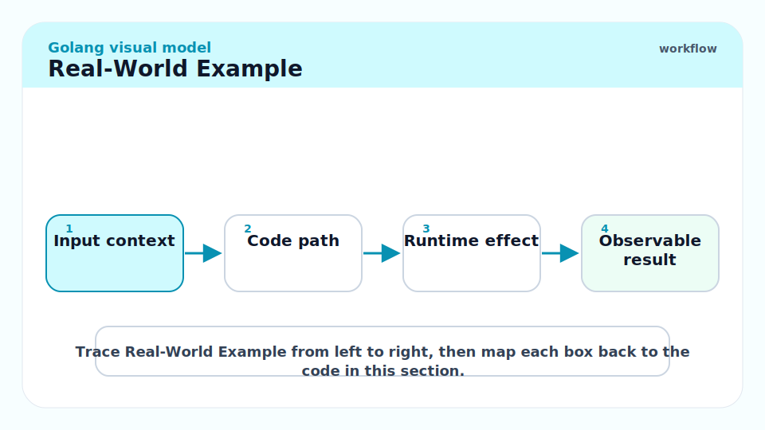
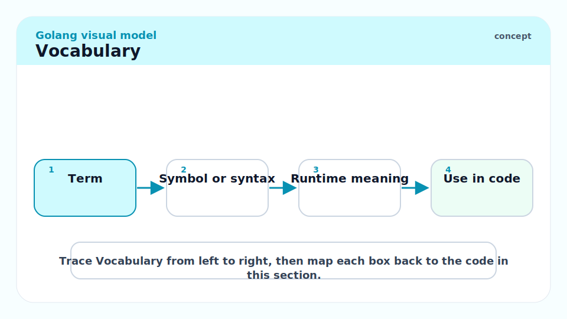
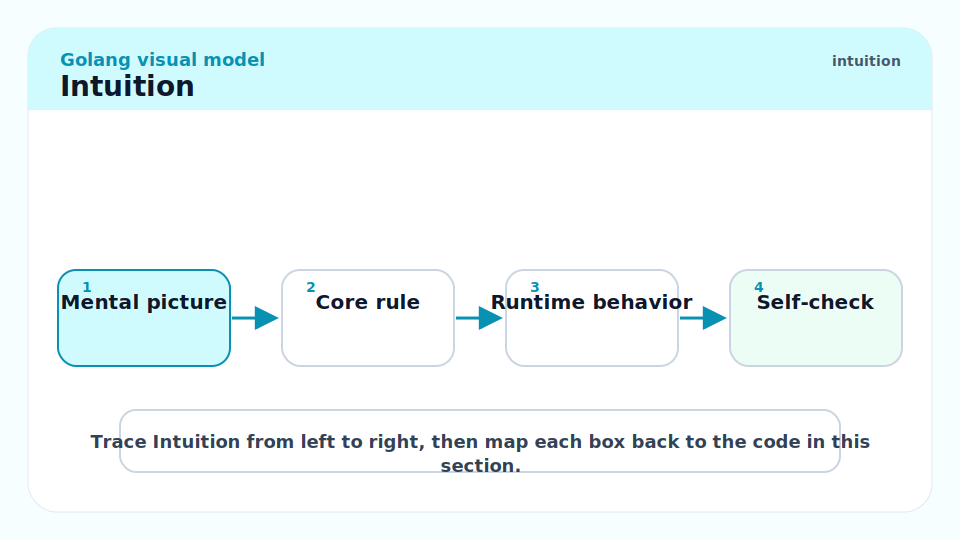
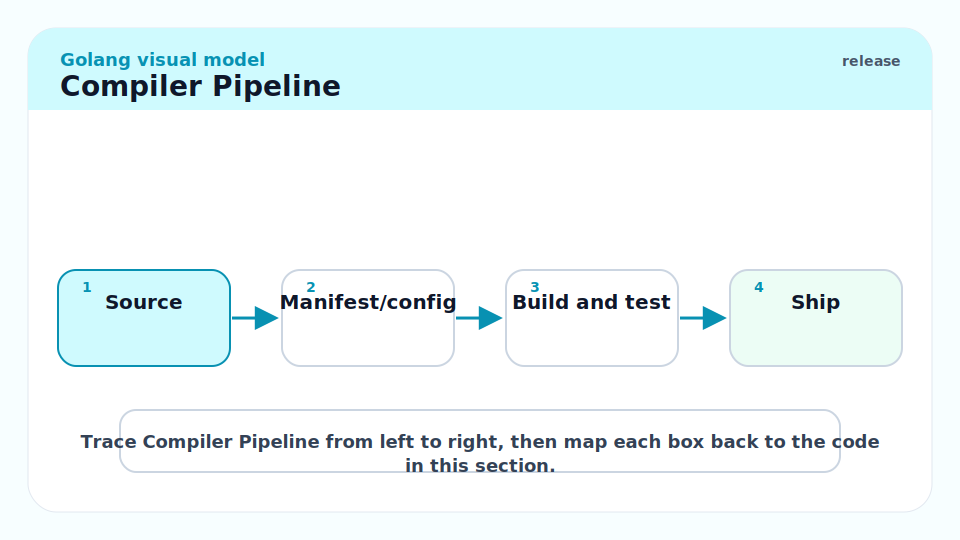
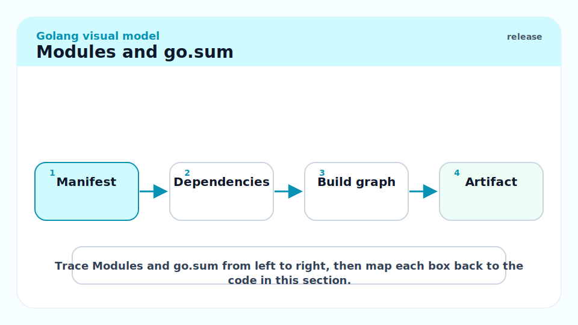
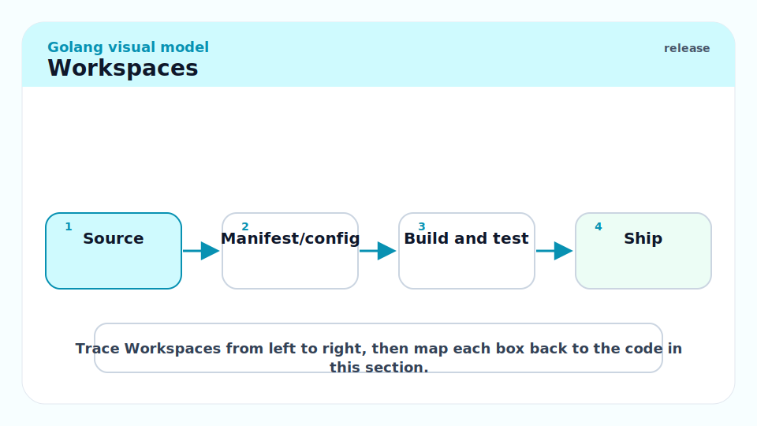
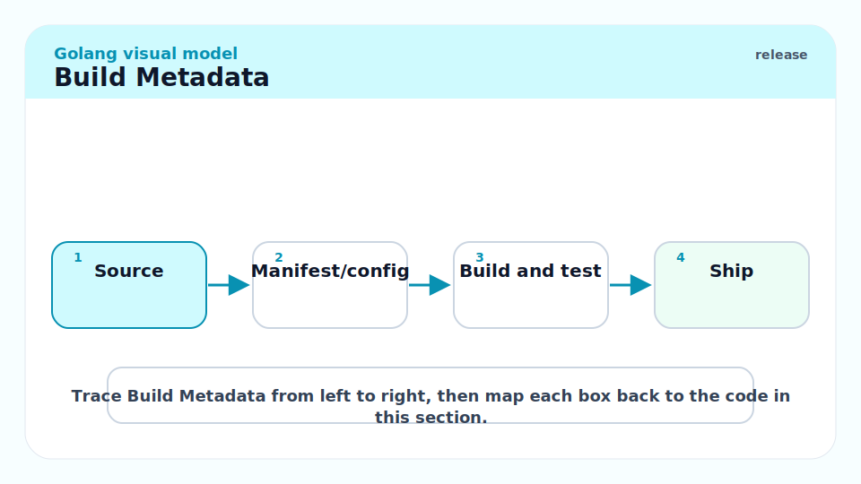
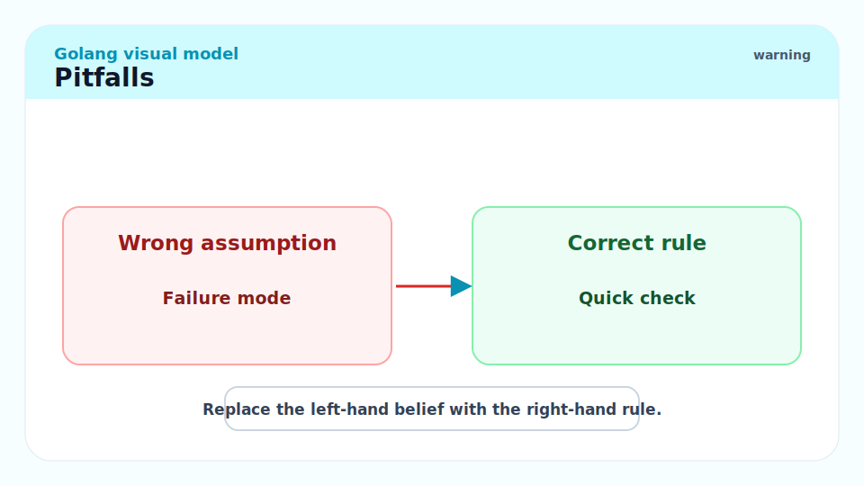
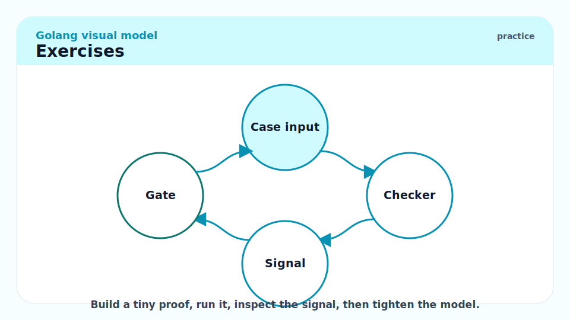

# 16 - Toolchain, Modules, Builds, and Release Engineering

[toc]

> **TL;DR:** Go's build story is part of the language experience: packages compile separately, modules select dependency versions, the build cache makes iteration fast, and release binaries carry build metadata. Mastery means knowing `go.mod`, `go.sum`, workspaces, cross-compilation, linker flags, VCS stamping, and how the compiler pipeline shapes code.

## Real-World Example



This command sequence builds a reproducible release binary and then inspects the embedded build info.

```bash
go mod tidy
go test ./...
CGO_ENABLED=0 GOOS=linux GOARCH=amd64 go build -trimpath -ldflags='-s -w' -o dist/myapp ./cmd/myapp
go version -m dist/myapp
```

## Vocabulary



**Module**: A versioned collection of packages rooted at a `go.mod` file.

---

**Package**: A compile unit. Go imports packages, not individual files.

---

**Build cache**: The Go command cache of compiled packages and test results.

---

**Minimal Version Selection**: Go's dependency algorithm that chooses the minimum required version across the module graph.

---

**Workspace**: A `go.work` file that lets multiple local modules act as main modules during development.

---

**Linker flag**: An option passed to the Go linker, often through `-ldflags`.

---

**VCS stamping**: Embedding version-control metadata into binaries when available.

## Intuition



Go's compiler is fast because packages are explicit boundaries. When package A imports package B, the compiler reads B's compiled export data, not all of B's source and transitive dependencies. That is why import cycles are illegal: they would destroy independent compilation.

Modules solve versioning. Workspaces solve local multi-module development. Release engineering ties both to a binary you can inspect, reproduce, and deploy.

## Compiler Pipeline



The simplified path is:


You rarely call `go tool compile` directly. The `go` command orchestrates compile, vet, test, link, module download, cache, and environment selection.

```bash
go list ./...
go env
go clean -cache
go tool compile -h
```

## Modules and `go.sum`



`go.mod` declares module path, Go version, dependencies, and replacement directives. `go.sum` records cryptographic hashes for module downloads.

```go
module example.com/myapp

go 1.25

require golang.org/x/sync v0.17.0
```

Use `go mod tidy` to reconcile imports with module requirements.

```bash
go mod tidy
go mod download
go list -m all
```

## Workspaces



Use `go.work` when developing multiple modules together. Do not rely on it for release builds; released modules need real versions or explicit module requirements.

```bash
go work init ./app ./lib
go work use ./another-module
go work sync
```

## Cross-Compilation


Go's cross-compilation is simple when CGO is off. With CGO on, you need a C cross-compiler and platform libraries.

```bash
GOOS=linux GOARCH=arm64 CGO_ENABLED=0 go build -o dist/myapp-linux-arm64 ./cmd/myapp
GOOS=darwin GOARCH=arm64 go build -o dist/myapp-darwin-arm64 ./cmd/myapp
```

## Build Metadata



Modern Go binaries can include module and VCS metadata. Inspect it with:

```bash
go version -m ./myapp
go version -m -json ./myapp
```

Go 1.25 added JSON output for `go version -m`, making it easier to integrate binary metadata checks into CI.

## Pitfalls



- **Committing `go.work` accidentally**: It may make local paths affect other developers or CI.
- **Using `replace` in release modules**: Local replacements do not describe a real dependency graph.
- **CGO surprise**: `CGO_ENABLED=1` can make binaries depend on system libraries.
- **Ignoring build metadata**: You should be able to trace a binary to source, module versions, and VCS state.
- **Import cycles**: They are design feedback that package boundaries are wrong.

## Exercises



1. Build the same program for Linux and macOS.
2. Run `go version -m` on a binary and explain every field.
3. Create two local modules in a `go.work` workspace.
4. Remove `go.work` and make the dependency work through a real module version or `replace`.
5. Use `go list -deps` to inspect the package graph.

## Sources

- https://go.dev/ref/mod
- https://go.dev/doc/tutorial/workspaces
- https://go.dev/cmd/go/
- https://go.dev/cmd/compile/
- https://go.dev/doc/go1.25
- Conversation with user on 2026-06-07

## Related

- Previous: [15 - Buffers, Input, and Output](./15-buffers-input-and-output.md)
- Earlier: [1 - What is Go](./1-what-is-go.md)
- Earlier: [12 - Building Production Services in Go](./12-building-production-services.md)
- Next: [17 - Testing, Fuzzing, Vet, Race Detector, and CI](./17-testing-fuzzing-vet-race-detector-and-ci.md)

