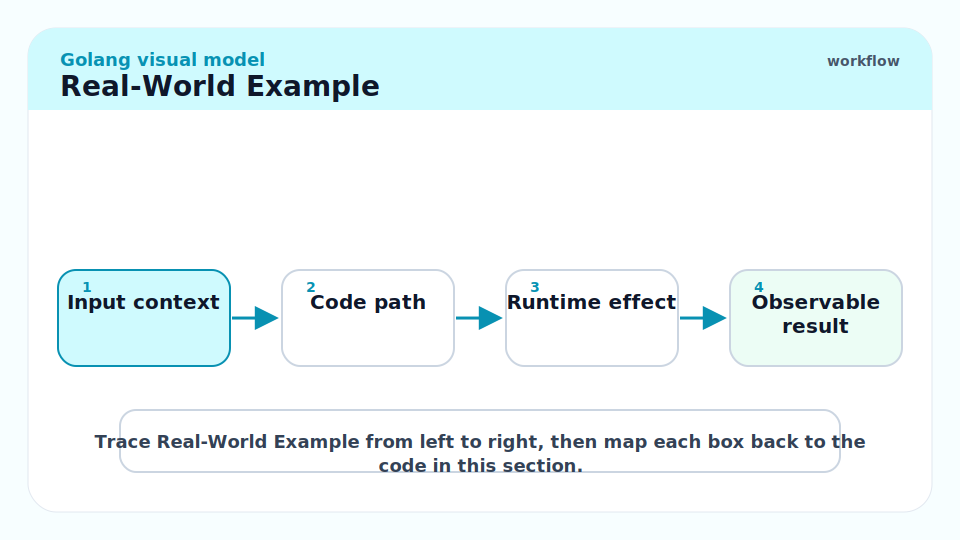
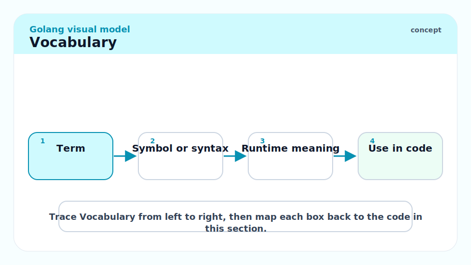
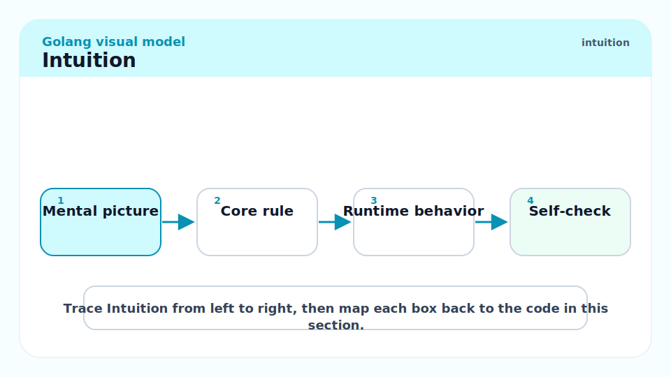
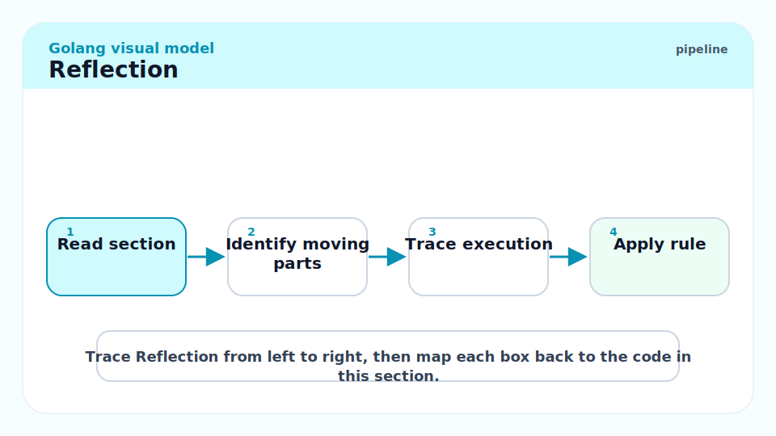
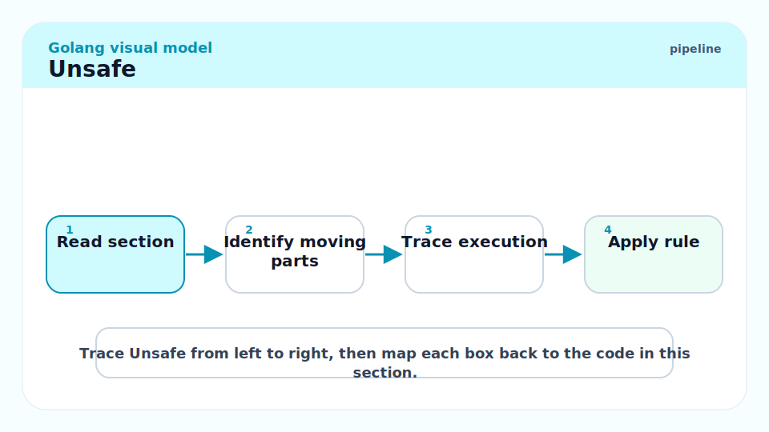
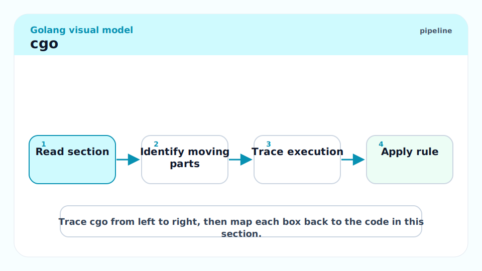
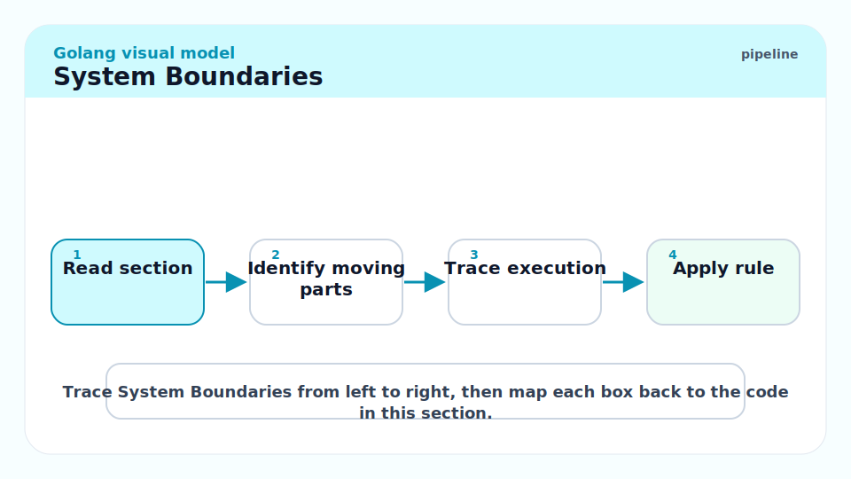
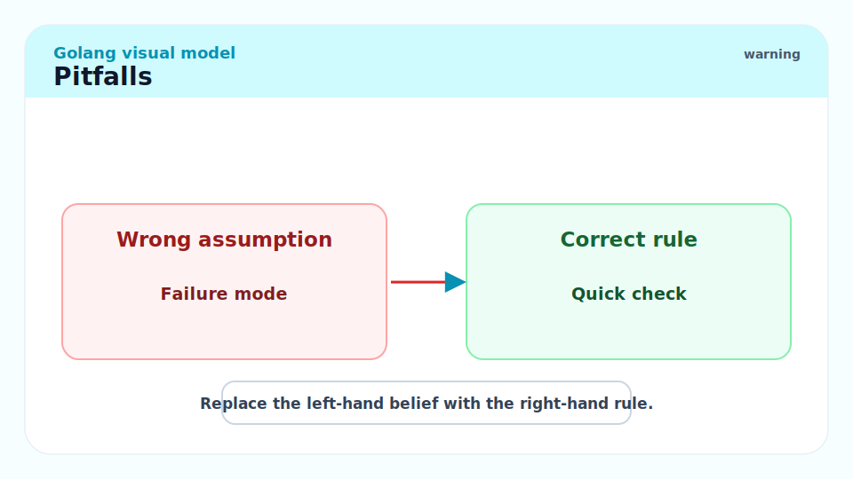
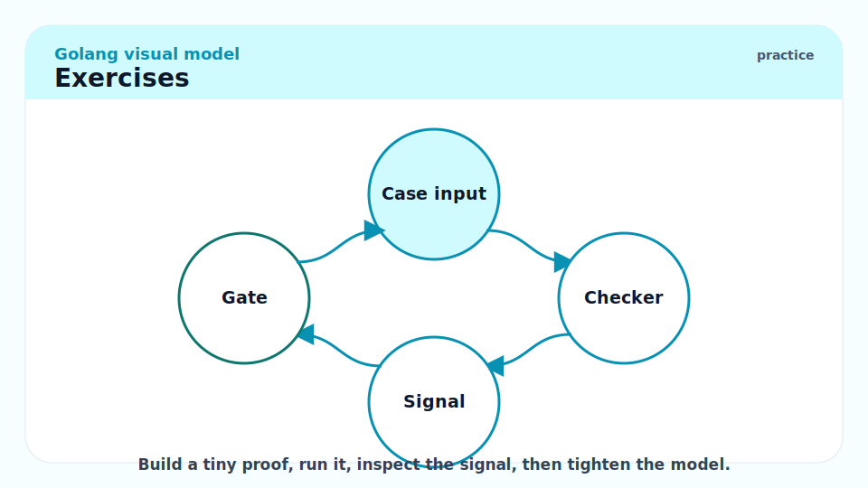

# 18 - Reflection, Unsafe, cgo, and System Boundaries

[toc]

> **TL;DR:** Go is type-safe until you deliberately step outside the fence. Reflection inspects values dynamically, `unsafe` bypasses type safety, cgo crosses into C, and system calls bind you to OS behavior; use all four behind small, reviewed boundaries.

## Real-World Example



This example uses reflection to print struct field names and values. It is useful for tooling, but you would not use it in a hot path without measuring.

```go
package main

import (
    "fmt"
    "reflect"
)

type User struct {
    ID   string
    Name string
}

func PrintFields(v any) {
    rv := reflect.ValueOf(v)
    rt := rv.Type()

    for i := 0; i < rv.NumField(); i++ {
        fmt.Printf("%s=%v\n", rt.Field(i).Name, rv.Field(i).Interface())
    }
}

func main() {
    PrintFields(User{ID: "u-1", Name: "Ava"})
}
```

## Vocabulary



**Reflection**: Runtime inspection of values and types through the `reflect` package.

---

**Unsafe pointer**: A value from package `unsafe` that can bypass normal type safety.

---

**cgo**: Go tooling that lets Go packages call C code and C code call exported Go functions.

---

**Pointer passing rule**: Restrictions on passing Go pointers to C so the garbage collector remains correct.

---

**Syscall boundary**: Direct interaction with OS APIs and platform-specific behavior.

---

**Portability**: Whether code behaves across GOOS/GOARCH targets.

## Intuition



Reflection, unsafe, and cgo are not badges of seniority. They are escape hatches. The best Go code usually keeps them out of business logic and wraps them in small APIs with tests.

Reflection trades compile-time knowledge for runtime flexibility. `unsafe` trades safety for layout control. cgo trades Go's simple deployment story for access to existing native libraries. Each trade can be right; none should be accidental.

## Reflection



Use reflection for serializers, validators, dependency injection containers, test helpers, and developer tooling. Prefer generics or interfaces when static types can express the problem.

```go
func TypeName(v any) string {
    if v == nil {
        return "<nil>"
    }
    return reflect.TypeOf(v).String()
}
```

## Unsafe



The `unsafe` package lets code step around type safety. The Go spec explicitly says packages using `unsafe` must be vetted manually and may not be portable.

```go
package main

import (
    "fmt"
    "unsafe"
)

func main() {
    var n int64 = 42
    fmt.Println(unsafe.Sizeof(n))
}
```

> [!CAUTION]
> Never use `unsafe` to avoid learning the safe API. Use it only when layout, interop, or measured performance requires it, and isolate it behind tests.

## cgo



cgo is powerful but changes the build and runtime story. It can require a C compiler, system headers, dynamic libraries, platform-specific packaging, and careful pointer ownership.

```go
/*
#include <stdlib.h>
*/
import "C"
import "unsafe"

func CStringLength(s string) int {
    cs := C.CString(s)
    defer C.free(unsafe.Pointer(cs))
    return int(C.strlen(cs))
}
```

This sketch shows the important rule: memory allocated by `C.CString` must be released with `C.free`.

## System Boundaries



Prefer packages in the standard library or `golang.org/x/sys` over raw syscalls. Keep platform-specific files behind build tags.

```go
//go:build linux

package platform
```

## Pitfalls



- **Reflect in hot paths**: It allocates and loses static type information.
- **Unsafe pointer lifetime bugs**: Go's GC and stack movement rules matter.
- **cgo deployment surprise**: Your "single static binary" may no longer be static.
- **OS-specific assumptions**: Filesystems, signals, sockets, and process behavior differ by platform.
- **Bypassing visibility through reflection/unsafe**: If you need private state, reconsider the design.

## Exercises



1. Use reflection to print field tags from a struct.
2. Replace a reflection-based helper with a generic helper.
3. Use `unsafe.Sizeof` to compare struct layouts before and after field reordering.
4. Write down the ownership rules for a cgo function that allocates C memory.
5. Add build tags for Linux and Darwin implementations of a small platform function.

## Sources

- https://pkg.go.dev/reflect
- https://go.dev/ref/spec
- https://go.dev/pkg/unsafe/
- https://pkg.go.dev/cmd/cgo
- https://go.dev/wiki/cgo
- Conversation with user on 2026-06-07

## Related

- Previous: [17 - Testing, Fuzzing, Vet, Race Detector, and CI](./17-testing-fuzzing-vet-race-detector-and-ci.md)
- Earlier: [5 - Interfaces and Type Assertions](./5-interfaces-and-type-assertions.md)
- Earlier: [14 - Reference Types and Internal Headers](./14-reference-types-and-internal-headers.md)
- Next: [19 - Profiling, Tracing, PGO, and Runtime Tuning](./19-profiling-tracing-pgo-and-runtime-tuning.md)

