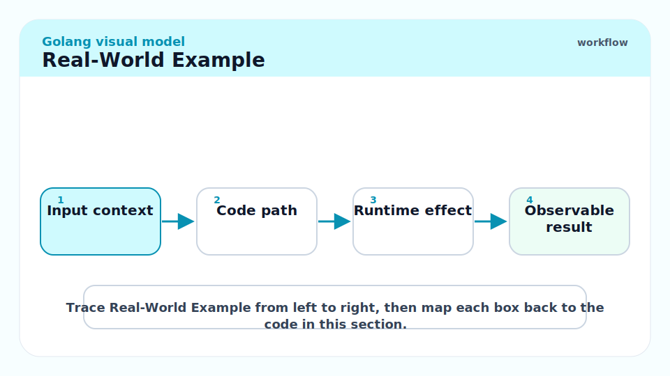
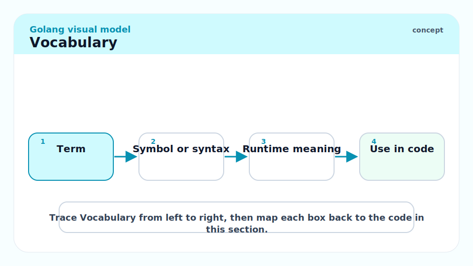
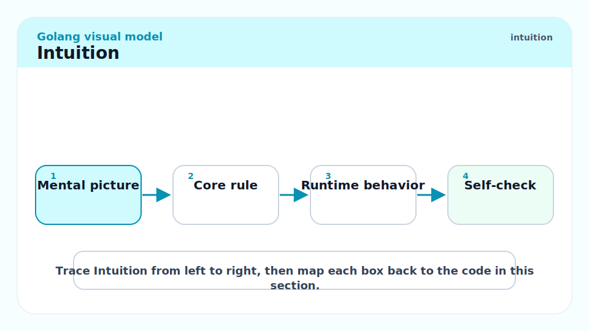
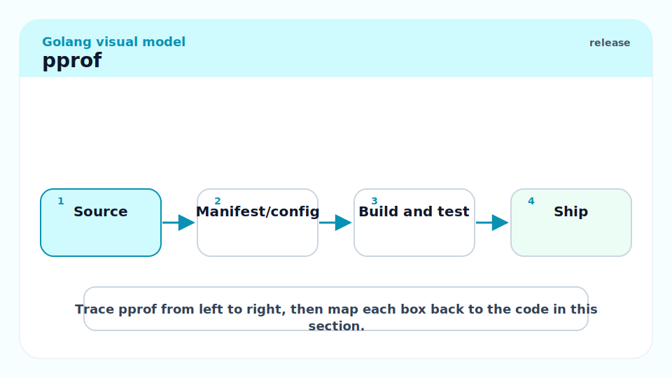
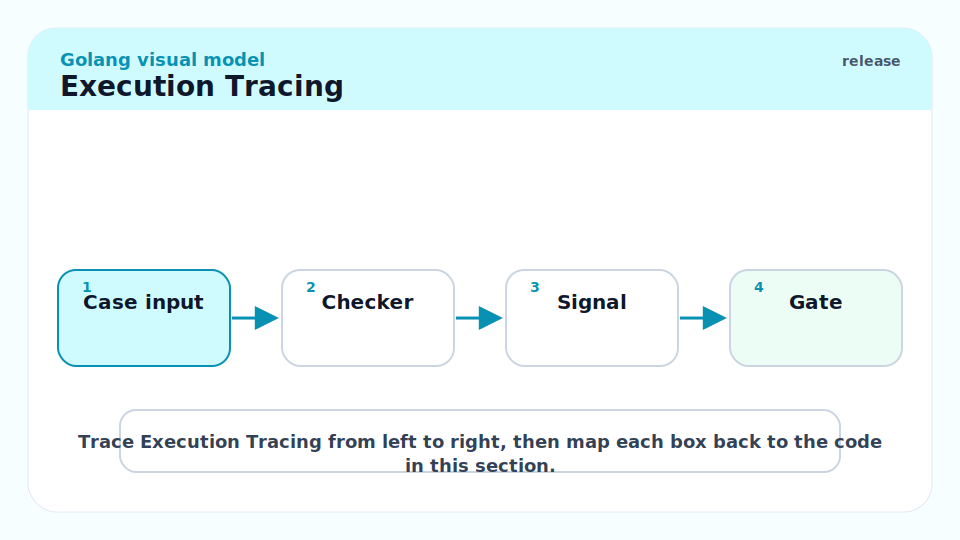
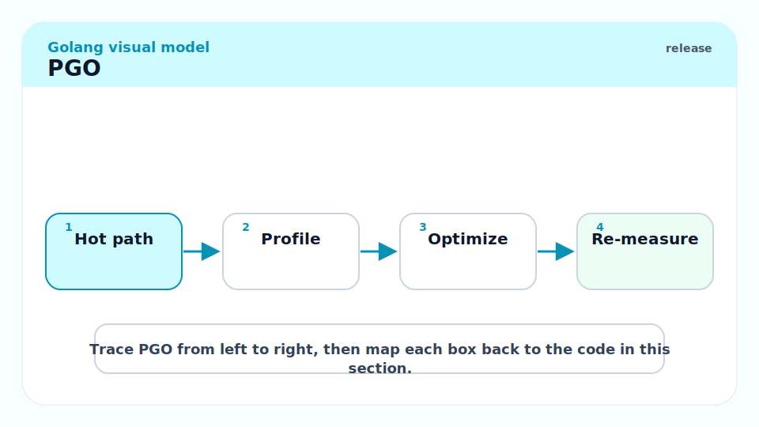
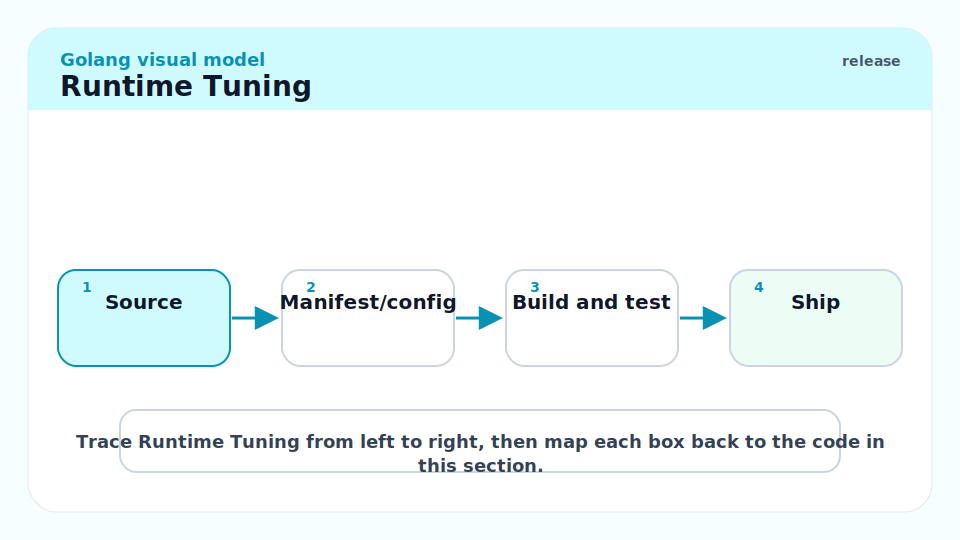
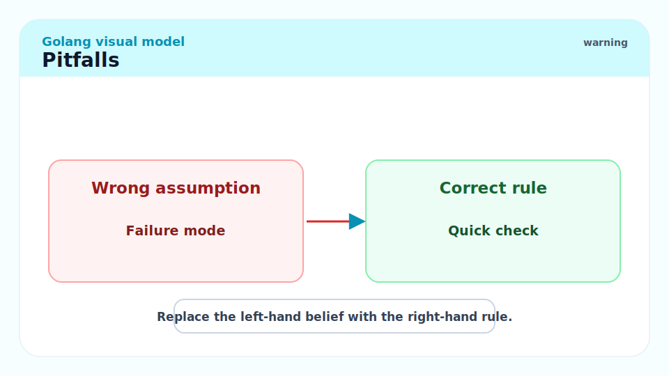
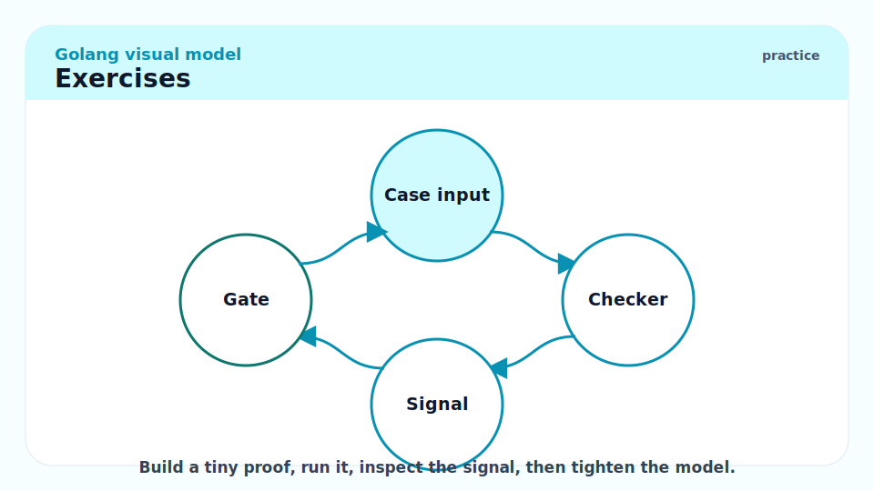

# 19 - Profiling, Tracing, PGO, and Runtime Tuning

[toc]

> **TL;DR:** Go performance work starts with profiles, not guesses. Use benchmarks, `pprof`, execution traces, runtime metrics, GC settings, container-aware `GOMAXPROCS`, and profile-guided optimization when the workload is representative.

## Real-World Example



This benchmark records allocations for two formatting approaches. The output tells you whether the optimization mattered.

```go
package format

import (
    "strconv"
    "testing"
)

func BenchmarkItoa(b *testing.B) {
    for i := 0; i < b.N; i++ {
        _ = strconv.Itoa(i)
    }
}
```

Run with memory stats.

```bash
go test -bench=. -benchmem ./...
```

## Vocabulary



**pprof**: Go's profile format and analysis tool for CPU, heap, goroutine, mutex, and block profiles.

---

**Trace**: A timeline of goroutines, processors, syscalls, GC, network blocking, and scheduler events.

---

**PGO**: Profile-guided optimization. The compiler uses a CPU profile from representative runs to optimize a later build.

---

**GOMAXPROCS**: Runtime setting controlling how many logical processors execute Go code simultaneously.

---

**GOGC**: GC target percentage controlling how much the heap can grow before the next collection.

---

**GOMEMLIMIT**: Runtime memory limit that makes the GC work harder near a configured ceiling.

## Intuition



Go gives you a production-grade profiler in the standard toolchain. Use it. If CPU is hot, take a CPU profile. If memory grows, take heap profiles over time. If goroutines stall, use traces and goroutine dumps. If GC dominates, inspect allocation rate and live heap.

Runtime tuning should come after code-level evidence. A better algorithm, less allocation, or fixed goroutine leak beats tweaking `GOGC`.

## pprof



Expose pprof in trusted environments or capture profiles directly in code.

```go
import _ "net/http/pprof"
```

```bash
go tool pprof http://localhost:6060/debug/pprof/profile?seconds=30
go tool pprof http://localhost:6060/debug/pprof/heap
```

Inside `pprof`, start with:

```text
top
list FunctionName
web
```

## Execution Tracing



Use `go test -trace` or `runtime/trace` when the question is scheduler behavior, blocking, or goroutine timing.

```bash
go test -run TestSomething -trace trace.out ./...
go tool trace trace.out
```

## PGO



Go's PGO consumes CPU pprof profiles. The official guidance is to use representative production profiles; unrepresentative profiles can produce little or no gain.

```bash
go build -pgo=cpu.pprof -o myapp ./cmd/myapp
```

As of Go 1.22, Go's docs report benchmark gains around 2 to 14 percent for representative programs, with future improvements expected.

## Runtime Tuning



Use runtime knobs deliberately:

```bash
GOGC=100 ./myapp
GOMEMLIMIT=512MiB ./myapp
GOMAXPROCS=4 ./myapp
```

Go 1.25 changed default `GOMAXPROCS` behavior on Linux to consider cgroup CPU bandwidth limits, which matters in Kubernetes and other container runtimes.

## Pitfalls



- **Profiling non-representative input**: Optimizing a toy path can hurt the real workload.
- **Heap profile confusion**: Allocated bytes and live bytes answer different questions.
- **Tuning before fixing allocations**: GC knobs cannot fix a needless allocation storm.
- **Leaving pprof open publicly**: Profiles can leak secrets and implementation details.
- **Forgetting container limits**: Runtime behavior depends on CPU and memory limits.

## Exercises



1. Add a benchmark and compare `allocs/op`.
2. Capture a CPU profile and identify the hottest function.
3. Capture heap profiles before and after a workload.
4. Record a trace and find blocked goroutines.
5. Build once with and once without PGO using the same benchmark.

## Sources

- https://pkg.go.dev/runtime/pprof
- https://pkg.go.dev/net/http/pprof
- https://pkg.go.dev/runtime/trace
- https://go.dev/doc/pgo
- https://go.dev/doc/go1.25
- Conversation with user on 2026-06-07

## Related

- Previous: [18 - Reflection, Unsafe, cgo, and System Boundaries](./18-reflection-unsafe-cgo-and-system-boundaries.md)
- Earlier: [9 - Memory Management and the GC](./9-memory-management-gc.md)
- Earlier: [12 - Building Production Services in Go](./12-building-production-services.md)
- Next: [20 - Go Mastery Capstones and Review Checklist](./20-go-mastery-capstones-and-review-checklist.md)

