# 2 - Types, Zero Values, and Declarations

[toc]

> **TL;DR:** Go's type system is static, explicit, and deliberately small. Every variable has a type determined at compile time, every type has a well-defined zero value (no uninitialised memory), and the two declaration syntaxes (`var` and `:=`) have distinct scoping and usage rules. Understanding zero values is not academic — it is the foundation for understanding nil slices, nil maps, nil errors, and zero-value struct idioms that appear in every Go codebase.

## Vocabulary

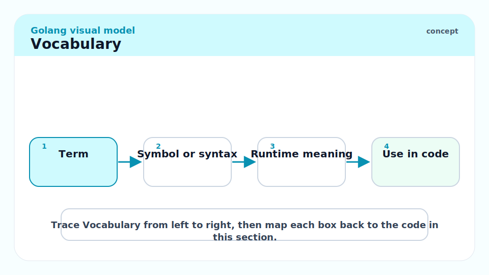

**Built-in type**: A type provided by the language itself, not defined in any package. Includes `bool`, all integer types, `float32`, `float64`, `complex64`, `complex128`, `string`, `byte` (alias for `uint8`), `rune` (alias for `int32`), `error` (interface), `any` (alias for `interface{}`).

---

**Zero value**: The value a variable holds immediately after declaration, before any explicit assignment. Defined for every type. Not undefined behaviour — the Go spec guarantees it.

---

**`var` declaration**: The explicit declaration form. Can appear at package scope or function scope. Allows specifying the type explicitly without an initialiser.

```go
var x int           // zero value: 0
var s string        // zero value: ""
var p *int          // zero value: nil
```

---

**Short variable declaration (`:=`)**: The implicit declaration form. Infers the type from the right-hand side. Only valid inside function bodies. At least one name on the left must be new.

```go
x := 42         // int
s := "hello"    // string
```

---

**Untyped constant**: A constant whose type is not yet fixed; it carries a "kind" (integer, floating-point, rune, string, boolean, complex) and is given a concrete type at the point of use. Allows constants to be used across numeric types without explicit conversion.

```go
const MaxItems = 100   // untyped integer constant — fits int, int64, uint, etc.
```

---

**Named type**: A type created with `type NewName Underlying`. Distinct from its underlying type for assignment purposes, but shares the same method set rules.

```go
type Celsius float64
type Fahrenheit float64
// Celsius and Fahrenheit are distinct; you cannot add them without conversion
```

---

**Type alias**: A `type A = B` declaration that makes A a perfect synonym for B — same type, same method set, interchangeable everywhere.

```go
type byte = uint8   // byte is literally uint8
type rune = int32   // rune is literally int32
```

---

**Type conversion**: An explicit conversion `T(expr)` that changes the type of a value. Go never implicitly converts between numeric types, not even `int` to `int64`. Every conversion is visible in source.

---

## Intuition

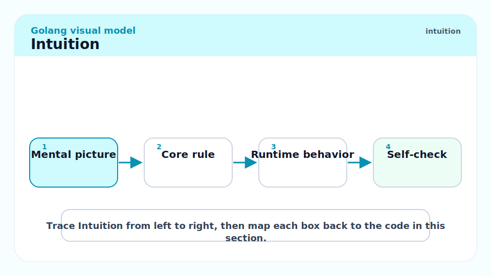

Go's philosophy on types has two key ideas. First: every piece of memory has a known, compile-time type, and there is no implicit coercion between numeric types — if you want to add an `int` to an `int64`, you write `int64(myInt) + myInt64`. This verbosity is intentional; it forces you to think about overflow and truncation at the call site. Second: the zero value makes programs safe by default. A freshly declared `sync.Mutex` is unlocked and ready to use; a freshly declared `[]byte` slice is nil but safe to `append` to; a freshly declared `map` is nil but safe to read from (though not write to). Understanding what is safe at zero value — and what is not — is one of the most practically important things to internalise.

## All Built-in Types

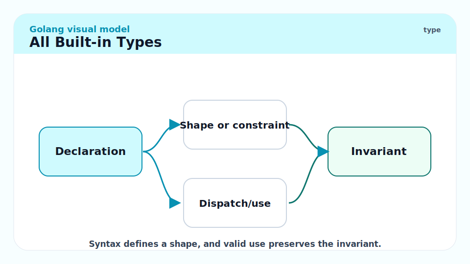

### Boolean

`bool` has two values: `true` and `false`. Zero value is `false`.

```go
var active bool       // false
active = true
fmt.Println(active)   // true
```

### Integer Types

Go has both sized and architecture-dependent integer types. The sized types have guaranteed widths:

| Type | Width | Range |
| :--- | :---: | :--- |
| `int8` | 8 bits | −128 to 127 |
| `int16` | 16 bits | −32768 to 32767 |
| `int32` (`rune`) | 32 bits | −2³¹ to 2³¹−1 |
| `int64` | 64 bits | −2⁶³ to 2⁶³−1 |
| `uint8` (`byte`) | 8 bits | 0 to 255 |
| `uint16` | 16 bits | 0 to 65535 |
| `uint32` | 32 bits | 0 to 2³²−1 |
| `uint64` | 64 bits | 0 to 2⁶⁴−1 |
| `int` | platform | 32 or 64 bits, matches pointer size |
| `uint` | platform | same width as `int` |
| `uintptr` | platform | large enough to hold a pointer value |

Use `int` unless you have a specific reason for a sized type (protocol fields, file formats, serialisation). Zero value for all integer types is `0`.

> [!IMPORTANT]
> `int` is NOT always 64 bits. On a 32-bit platform it is 32 bits. If you are storing a value that must survive a 64-bit range — a Unix timestamp post-2038, a file offset larger than 2 GB — use `int64` explicitly.

### Floating-point Types

`float32` (32-bit IEEE 754, ~7 decimal digits of precision) and `float64` (64-bit IEEE 754, ~15 decimal digits). Default float literal type is `float64`. Zero value is `0.0`.

```go
var pi float64 = 3.14159265358979
x := 1.5      // float64 by default
y := float32(1.5)
```

### Complex Types

`complex64` (two `float32` parts) and `complex128` (two `float64` parts). Rarely used outside numerical computing. `real(c)` and `imag(c)` extract parts; `complex(r, i)` constructs.

### String

`string` is an immutable sequence of bytes (not characters). Go source files are UTF-8; string literals are byte sequences, but iterating with `range` decodes UTF-8 runes. Zero value is `""` (empty string, not nil — strings cannot be nil).

```go
s := "hello, 世界"
fmt.Println(len(s))         // 13 — byte count, not rune count
for i, r := range s {
    fmt.Printf("%d: %c\n", i, r)
}
// 0: h  1: e  2: l  3: l  4: o  5: ,  6:    7: 世  10: 界
// note byte indices 7 and 10 — "世" is 3 bytes in UTF-8
```

> [!WARNING]
> `s[i]` indexes a string by byte, returning `uint8` (byte), not a rune (Unicode code point). Slicing non-ASCII strings by byte index will produce garbled output or broken UTF-8. Use `[]rune(s)` or `unicode/utf8` when you need character-level indexing.

### Byte and Rune

`byte` is an alias for `uint8` — used when treating data as raw bytes. `rune` is an alias for `int32` — used when treating data as Unicode code points. They are not distinct types; they are alternative names.

```go
var b byte = 'A'    // 65
var r rune = '世'   // 19990 (Unicode code point U+4E16)
```

## `var` vs `:=` — Declaration Rules

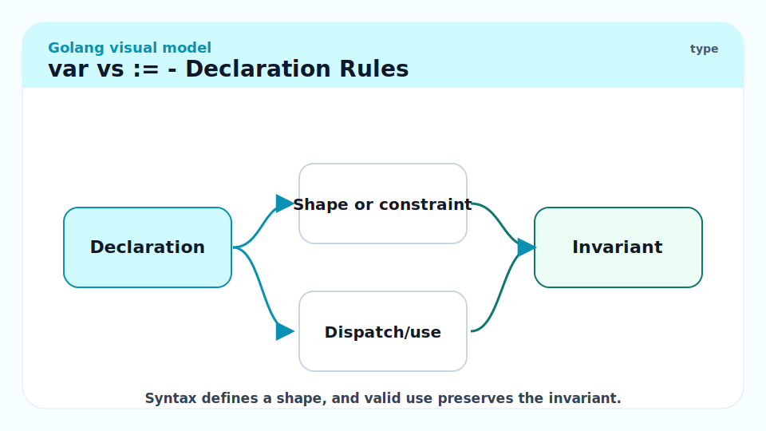

The two declaration forms are not interchangeable. Understanding when each applies prevents subtle scoping bugs.

### `var` — explicit declaration

`var` can appear at package scope or function scope. It always creates a new binding. The type can be explicit, inferred from an initialiser, or both.

```go
// Package scope — allowed
var globalLimit = 100

// Function scope
func process() {
    var count int           // type explicit, no initialiser → zero value (0)
    var name = "alice"      // type inferred from "alice" → string
    var x, y int = 1, 2     // multiple variables same type
    _, _ = count, name, x, y
}
```

### `:=` — short variable declaration

`:=` is only valid inside function bodies. It requires at least one name on the left to be new to the current scope (existing names on the left are reassigned, not re-declared). This "at least one new" rule enables idiomatic multi-return error handling.

```go
func readConfig(path string) (Config, error) {
    f, err := os.Open(path)        // both f and err are new
    if err != nil {
        return Config{}, err
    }
    defer f.Close()

    var cfg Config
    decoder := json.NewDecoder(f)
    if err := decoder.Decode(&cfg); err != nil {  // new err in inner scope
        return Config{}, err
    }
    return cfg, nil
}
```

> [!WARNING]
> The inner `if err :=` in the example above creates a new `err` variable scoped to the `if` block, shadowing the outer `err`. This is intentional and idiomatic for error handling. But if you accidentally shadow a variable you intended to reassign, the outer value goes unchanged — a subtle bug. `go vet` does not catch this; `staticcheck` does.

### When to use which

| Situation | Form |
| :--- | :--- |
| Package-level variable | `var` only (`:=` not allowed outside functions) |
| Function-level, type matters (e.g., want `float64` but literal would be `int`) | `var x float64 = expr` |
| Function-level, type obvious from initialiser | `:=` |
| Declaring without initialiser (zero value) | `var` only |
| Multiple assignment from multi-return function | `:=` or `=` |

## Zero Values — The Full Table

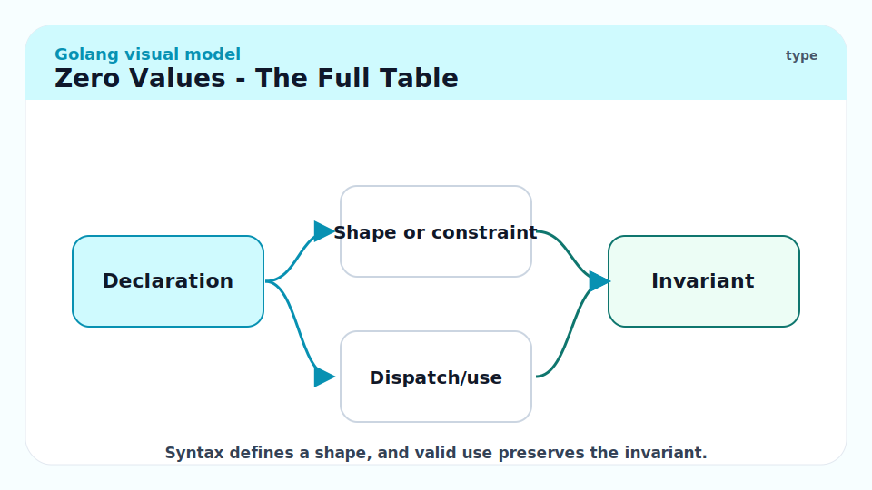

Every type's zero value is guaranteed by the spec. This table is worth memorising:

| Type category | Zero value | Safe to use at zero? |
| :--- | :--- | :--- |
| `bool` | `false` | Yes |
| All integer types | `0` | Yes |
| `float32`, `float64` | `0.0` | Yes |
| `complex64`, `complex128` | `0+0i` | Yes |
| `string` | `""` | Yes |
| Pointer (`*T`) | `nil` | Read: no (dereference panics). Nil-check before use. |
| Slice (`[]T`) | `nil` | `len`, `cap`, `range`, `append` all work. Write: no (need make/literal). |
| Map (`map[K]V`) | `nil` | Read: returns zero value for K. Write: **panics**. |
| Channel (`chan T`) | `nil` | Send/receive block forever. Close panics. |
| Function (`func(...)`) | `nil` | Call panics. |
| Interface | `nil` | Method call panics. Comparison to nil works. |
| Struct | field-wise zero | Depends on fields. |

```go
// Zero value usage examples
var s []int
fmt.Println(s == nil)   // true
fmt.Println(len(s))     // 0 — safe
s = append(s, 1, 2, 3) // safe — append handles nil slice

var m map[string]int
v := m["key"]           // 0 — safe read from nil map
m["key"] = 1            // PANIC: assignment to entry in nil map
```

> [!CAUTION]
> Writing to a nil map panics at runtime with `assignment to entry in nil map`. This is one of the most common Go panics in code that initialises maps lazily. Always `make(map[K]V)` or use a map literal before writing. Reading from a nil map is safe and returns the zero value — this asymmetry surprises many newcomers.

## Untyped Constants

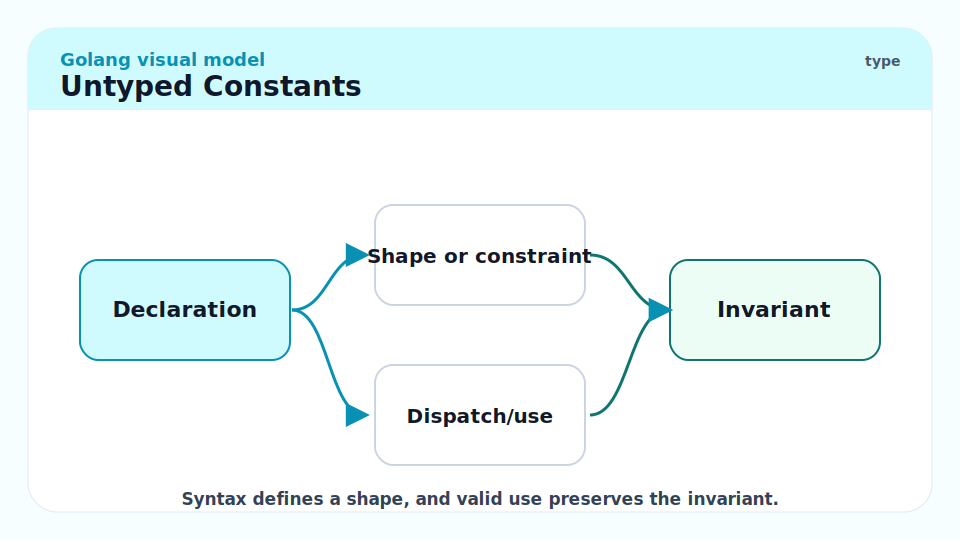

Constants in Go can be typed or untyped. An untyped constant has a *kind* (untyped integer, untyped float, untyped string, etc.) but no fixed type until it is used. This allows a single constant to serve multiple numeric types without explicit casting.

```go
const Pi = 3.14159      // untyped floating-point constant

var f32 float32 = Pi    // Pi used as float32 — no explicit conversion needed
var f64 float64 = Pi    // same constant, used as float64

const MaxUint = ^uint(0)                 // untyped integer constant
const MaxInt = int(MaxUint >> 1)         // typed int constant
```

Typed constants fix the type at declaration:

```go
const TypedPi float64 = 3.14159         // typed — only assignable to float64
```

The distinction matters at interface boundaries: an untyped integer constant `0` satisfies `byte`, `int`, `uint32`, etc. A typed constant `int(0)` does not satisfy `byte` without conversion.

## Explicit Type Conversions

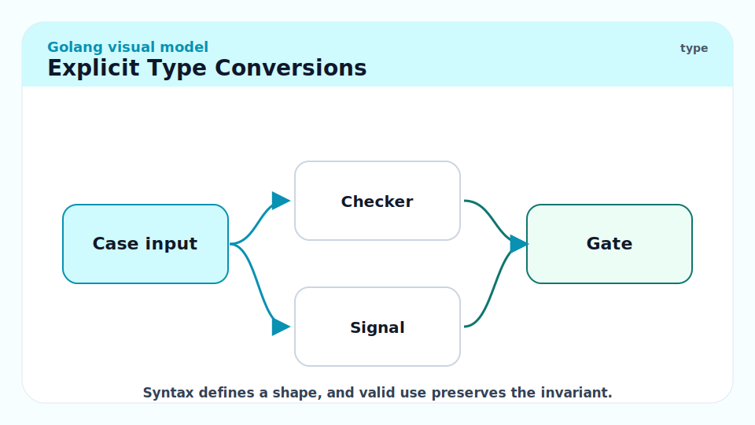

Go never implicitly converts between numeric types. Every conversion is written as `T(expr)`.

```go
var i int = 42
var f float64 = float64(i)   // int → float64 — must be explicit
var u uint = uint(f)          // float64 → uint — truncates, no rounding

// String conversions
s := string(65)              // "A" — int to unicode rune, NOT "65"
s2 := strconv.Itoa(65)       // "65" — int to decimal string
n, err := strconv.Atoi("42") // string to int
_, _ = s2, n, err
```

> [!WARNING]
> `string(65)` produces `"A"`, not `"65"`. The integer is interpreted as a Unicode code point (rune). This is almost never what you want when converting a number to its decimal string representation. Use `strconv.Itoa` or `fmt.Sprintf("%d", n)` for that. Go vet will flag `string(int_value)` with a warning since Go 1.15.

## Real-world Example

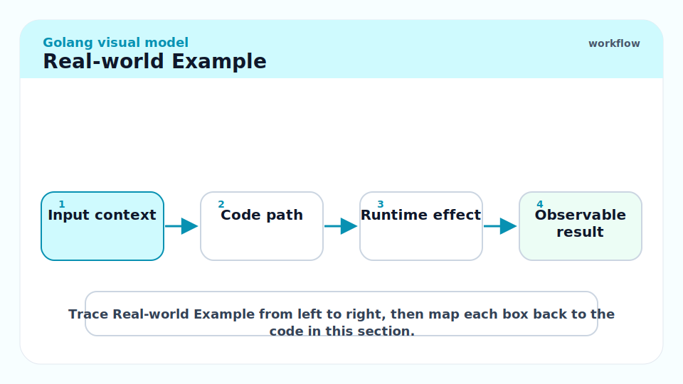

This example shows type declarations, zero values, and the `:=` pattern working together in a realistic data processing function. Every annotation shows the type and what would happen at zero value.

```go
package main

import (
	"fmt"
	"strconv"
)

// Measurement represents a named numeric reading.
type Measurement struct {
	Name  string  // zero: ""
	Value float64 // zero: 0.0
	Unit  string  // zero: ""
}

// ParseMeasurement parses "name=value unit" strings.
// It demonstrates var, :=, and explicit type conversion in a real scenario.
func ParseMeasurement(s string) (Measurement, error) {
	var m Measurement // zero value struct — all fields are zero values

	var name, rest string
	n, err := fmt.Sscanf(s, "%s %s %s", &name, &rest, &m.Unit)
	if err != nil || n < 2 {
		return m, fmt.Errorf("ParseMeasurement: malformed input %q", s)
	}
	m.Name = name

	// strconv.ParseFloat returns float64; explicit conversion not needed here
	// because m.Value IS float64.
	val, err := strconv.ParseFloat(rest, 64)
	if err != nil {
		return m, fmt.Errorf("ParseMeasurement: bad value %q: %w", rest, err)
	}
	m.Value = val

	return m, nil
}

func main() {
	inputs := []string{
		"temperature 36.6 C",
		"pressure 101.3 kPa",
		"speed notanumber m/s",
	}
	for _, s := range inputs {
		m, err := ParseMeasurement(s)
		if err != nil {
			fmt.Printf("error: %v\n", err)
			continue
		}
		fmt.Printf("%s = %.2f %s\n", m.Name, m.Value, m.Unit)
	}
}
// temperature = 36.60 C
// pressure = 101.30 kPa
// error: ParseMeasurement: bad value "notanumber": strconv.ParseFloat: parsing "notanumber": invalid syntax
```

## In Practice

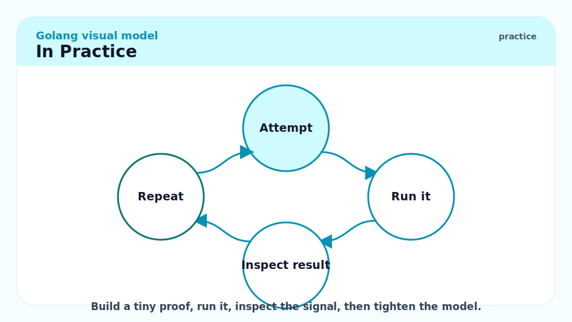

At scale, the most common type-related bugs are:

1. **nil map writes** — caught immediately at runtime (panic), but often only hit in a code path exercised under load. Initialise maps at struct construction, not lazily.
2. **int vs int64 overflow** — storing a row count in `int` works fine on 64-bit servers but breaks on 32-bit embedded targets. If the value can exceed 2³¹, use `int64`.
3. **String/byte slice aliasing** — `[]byte(s)` copies the string's backing bytes into a new slice (in general). But the compiler may optimise away the copy in some contexts. Never mutate a `[]byte` you converted from a string, as the spec does not guarantee the copy in all future compiler versions.

> [!TIP]
> The `stringer` tool (`go generate` + `//go:generate stringer -type=Direction`) auto-generates `String()` methods for named integer types used as enums. This makes them print humanly readable instead of as raw numbers in logs. Run it once; regenerate whenever you add a new constant.

## Pitfalls

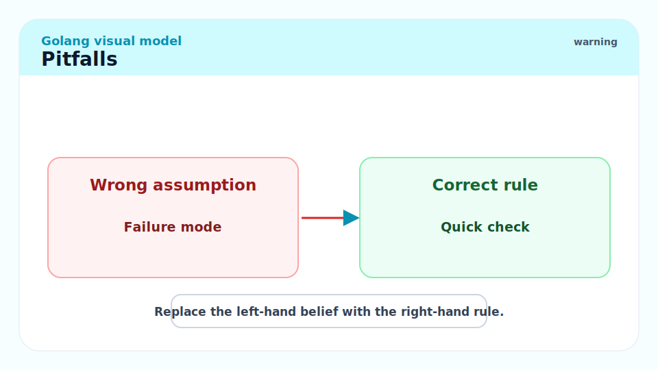

- **"`var x int` and `x := 0` are identical."** — They produce the same value but `:=` is only valid inside functions. At package scope you must use `var`.
- **"nil and zero value are the same thing."** — For pointer, slice, map, channel, and interface types, nil IS the zero value. But `string`'s zero value is `""` not nil (strings cannot be nil). And a nil interface is not the same as an interface holding a nil pointer — see [5 - Interfaces and Type Assertions](./5-interfaces-and-type-assertions.md) for that subtlety.
- **"I can add `int` and `int32` directly."** — No. `var a int = 1; var b int32 = 2; _ = a + b` is a compile error. Every cross-type addition requires an explicit conversion.
- **"Untyped constants are always safe."** — Untyped integer constants with values outside the target type's range cause a compile error. `const Big = 1 << 100; var x int = Big` fails at compile time, not silently truncates.
- **"A zero-value struct is always safe to use."** — It depends on the fields. A zero-value `sync.Mutex` is safe and unlocked. A zero-value `http.Client` is functional. But a zero-value `os.File` (which holds a nil internal pointer) panics if you call `Read` on it. Know your types.

## Exercises

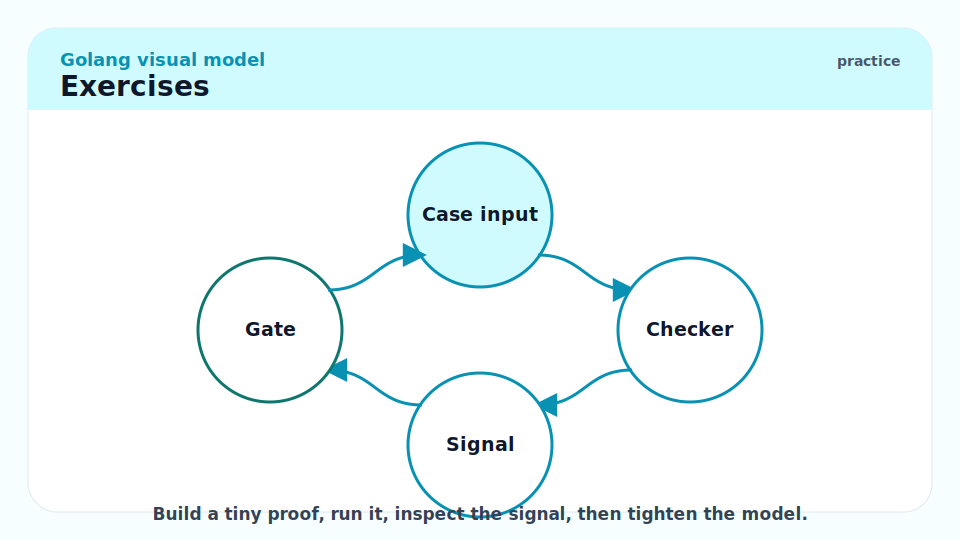

### Exercise 1 — Conceptual: Why does `string(65)` produce `"A"`?

Explain the Go spec rule that causes this, and provide two correct alternatives for converting the integer 65 to the string `"65"`.

#### Solution

The Go spec says that `string(x)` where `x` is an integer type produces a string containing the UTF-8 encoding of the Unicode code point with value `x`. Code point 65 is U+0041, which is the ASCII character `'A'`. This is the rune-to-string conversion, not number-to-string.

The two idiomatic alternatives:

```go
import (
    "fmt"
    "strconv"
)

s1 := strconv.Itoa(65)        // "65" — int to decimal string
s2 := fmt.Sprintf("%d", 65)   // "65" — format verb %d formats an integer
```

`strconv.Itoa` is faster (no reflection, no format string parsing). `fmt.Sprintf` is more flexible when you need padding or other format options.

---

### Exercise 2 — Code output: What are the types of a, b, c?

```go
a := 1
b := 1.0
c := 1 + 1.0
```

#### Solution

```go
a := 1      // int      — integer literal without decimal point → int
b := 1.0    // float64  — decimal-point literal → float64 (default float type)
c := 1 + 1.0 // float64 — untyped integer constant 1 + untyped float constant 1.0
             // the untyped integer widens to untyped float for the addition,
             // then the result is assigned → float64
```

Key rule: when an untyped constant expression mixes integer and float kinds, the integer widens to float. The final type of `:=` is the default type for the kind: `int` for untyped integer, `float64` for untyped float.

---

### Exercise 3 — Bug finding: What is wrong with this code?

```go
package main

import "fmt"

func counter() func() int {
    count := 0
    return func() int {
        count++
        return count
    }
}

func main() {
    c := counter()
    fmt.Println(c()) // 1
    fmt.Println(c()) // 2

    counts := make([]int, 3)
    for i := 0; i < 3; i++ {
        counts[i] = c()
    }
    fmt.Println(counts) // want [3 4 5]
}
```

Actually, the above has no bug. Identify the type of `count` inside `counter` and explain why the closure captures it by reference (pointer to the variable), not by value.

#### Solution

The type of `count` is `int`, declared with `:=`. When the anonymous function `func() int { count++; return count }` is created, it captures the variable `count` itself — a reference to the variable's storage location, not a copy of its current value. This is called a *closed-over variable*.

In Go, closures always capture variables by reference. The anonymous function holds a pointer to the `count` variable in `counter`'s stack frame (which has been heap-escaped since the closure outlives `counter`'s execution). Each call to `c()` increments the same `count`. The output is:

```
1
2
[3 4 5]
```

This is correct and expected. The classic Go gotcha is the *loop variable capture* problem (pre-Go 1.22): if you capture a loop variable `i` in a closure inside a `for` loop, all closures share the same final value of `i`. Go 1.22 fixed this — each loop iteration now gets its own copy of `i`. See [8 - Concurrency Patterns and the Race Detector](./8-concurrency-patterns.md) for the race detector version.

---

### Exercise 4 — Implementation: Write a type-safe temperature converter

Define named types `Celsius` and `Fahrenheit`, and write conversion functions between them, demonstrating that direct addition between them is a compile error.

#### Solution

```go
package main

import "fmt"

// Celsius is a temperature in degrees Celsius.
type Celsius float64

// Fahrenheit is a temperature in degrees Fahrenheit.
type Fahrenheit float64

// ToFahrenheit converts c to the equivalent Fahrenheit temperature.
func ToFahrenheit(c Celsius) Fahrenheit {
	return Fahrenheit(c*9/5 + 32)
}

// ToCelsius converts f to the equivalent Celsius temperature.
func ToCelsius(f Fahrenheit) Celsius {
	return Celsius((f - 32) * 5 / 9)
}

func main() {
	boiling := Celsius(100)
	fmt.Printf("%.1f°C = %.1f°F\n", boiling, ToFahrenheit(boiling))
	// 100.0°C = 212.0°F

	body := Fahrenheit(98.6)
	fmt.Printf("%.1f°F = %.1f°C\n", body, ToCelsius(body))
	// 98.6°F = 37.0°C

	// The following would NOT compile:
	// _ = boiling + body   // invalid operation: boiling + body (mismatched types Celsius and Fahrenheit)
}
```

Named types prevent accidental mixing of semantically incompatible values even when the underlying types are identical. This is a zero-cost abstraction: at runtime, `Celsius` and `float64` have the same representation and performance.

## Sources

- The Go Specification — Types: https://go.dev/ref/spec#Types
- The Go Specification — Declarations: https://go.dev/ref/spec#Declarations_and_scope
- The Go Specification — Constants: https://go.dev/ref/spec#Constants
- The Go Programming Language (Donovan & Kernighan) — Chapter 2.
- Effective Go — Names, Declarations: https://go.dev/doc/effective_go#names

## Related

- [1 - What is Go](./1-what-is-go.md)
- [3 - Composite Types](./3-composite-types.md)
- [5 - Interfaces and Type Assertions](./5-interfaces-and-type-assertions.md)
