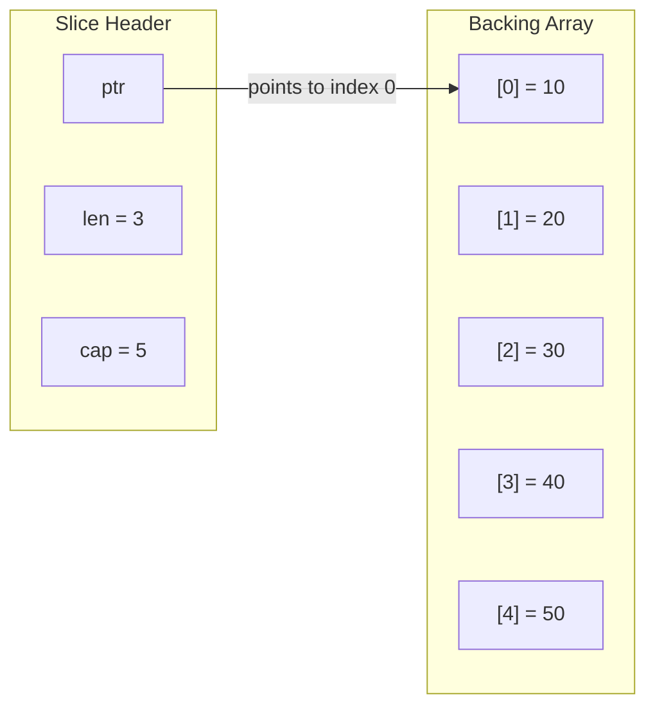

# 3 - Composite Types: Arrays, Slices, Maps, Structs

[toc]

> **TL;DR:** Go's four composite types — arrays, slices, maps, and structs — are the building blocks of every real Go program. Slices are the workhorse (not arrays), and their three-word header (pointer, length, capacity) is the key to understanding `append` semantics, subslice aliasing, and why passing a slice to a function does not always behave like passing by reference. Maps are hash tables with O(1) amortised operations but unordered iteration. Structs enable composition over inheritance, and embedding is Go's mechanism for code reuse without subtyping.

## Vocabulary

**Array**: A fixed-length, contiguous sequence of elements of a single type. Length is part of the type: `[3]int` and `[4]int` are distinct, incompatible types. Arrays are value types — assignment copies all elements.

---

**Slice**: A dynamically-sized view into an underlying array. Represented as a three-word header: a pointer to the first element, a length, and a capacity.

```go
// Internal representation (conceptual — not how you write it)
type sliceHeader struct {
    Data unsafe.Pointer
    Len  int
    Cap  int
}
```

---

**`append`**: The built-in that adds elements to a slice. If `len < cap`, it writes in place. If `len == cap`, it allocates a new backing array (typically 2x the old capacity), copies, and returns a new slice header. The original variable is not updated unless you assign the return value.

---

**Subslice**: A slice formed by slicing an existing slice with `s[low:high]`. Shares the same backing array up to `cap`. Mutations to the subslice are visible through the original.

---

**Map**: A built-in hash table mapping keys to values. Key type must be *comparable* (supports `==`). Not safe for concurrent read/write. Zero value is nil (reads safe, writes panic).

---

**Struct**: A composite type grouping named fields of potentially different types. Structs are value types — assignment copies all fields.

---

**Struct embedding**: Placing a type (without a field name) inside a struct to promote its fields and methods. Go's mechanism for composition.

```go
type Animal struct { Name string }
type Dog struct {
    Animal          // embedded — Dog.Name promoted to Dog.Animal.Name
    Breed string
}
```

---

**Struct tag**: A string literal following a field declaration, used as metadata by reflection-based packages (JSON, XML, ORM, validation). Not enforced by the compiler.

```go
type User struct {
    Name  string `json:"name"`
    Email string `json:"email,omitempty"`
}
```

---

## Intuition

Think of an array as a fixed-length stack allocation — its size is baked into its type, so it behaves more like a C array (`int arr[5]`) than a Python list. Slices are the Go equivalent of Python lists or Java `ArrayList`: a window into a potentially larger array, with a length (how much is visible) and a capacity (how much room before reallocation). The most important thing to internalise is that slices are headers, not containers — two slices can point at the same backing array, and a mutation through one is visible through the other.

Maps are Go's hash table, straightforward to use but with two sharp edges: nil maps panic on write, and iteration order is deliberately randomised on every run (the runtime permutes the hash seed at startup, specifically to prevent programs from relying on a specific order).

Structs are Go's primary way to group state. There is no class hierarchy — instead, Go uses embedding (a struct contains another struct's fields and methods inline) to achieve reuse. The mantra is "prefer composition over inheritance," and embedding makes that idiom syntactically cheap.

## Arrays

Arrays are value types with a fixed length that is part of the type. They are rarely used directly in Go — slices are almost always what you want. Arrays matter as the backing storage for slices and as a way to ensure a fixed-size allocation without heap escape.

```go
var a [5]int                  // [0 0 0 0 0] — zero value
b := [3]string{"go", "is", "fast"}
c := [...]float64{1.1, 2.2, 3.3}  // [...] infers length from literal

fmt.Println(len(b))  // 3
fmt.Println(a == [5]int{})  // true — arrays support == when element type does
```

> [!NOTE]
> Passing an array to a function passes a copy of the entire array. For a `[1024]byte` this copies 1 KiB. If you need the function to see the original, pass a slice (`a[:]`) or a pointer (`&a`).

## Slices

Slices are the most important data structure in Go. Every slice is a three-word value: a pointer to the first visible element in a backing array, a length (number of visible elements), and a capacity (number of elements from the pointer to the end of the backing array).



### Creating Slices

Three ways to create a slice:

```go
// 1. Slice literal — allocates backing array, sets len and cap
s := []int{10, 20, 30}   // len=3, cap=3

// 2. make — allocates backing array of given capacity
s2 := make([]int, 3, 5)  // len=3, cap=5, all zeros

// 3. Slice an array or existing slice
arr := [5]int{10, 20, 30, 40, 50}
s3 := arr[1:4]            // len=3 (indices 1,2,3), cap=4 (indices 1..4)
```

### `append` Semantics

`append` is the function that adds elements. It returns a new slice header — always assign it back to the same variable.

```go
s := make([]int, 0, 4)    // len=0, cap=4
s = append(s, 1)           // len=1, cap=4 — fits in place
s = append(s, 2, 3, 4)    // len=4, cap=4 — still fits
s = append(s, 5)           // len=5, cap=8 — new backing array, roughly 2x growth
```

> [!IMPORTANT]
> After `append` causes a reallocation, the new slice no longer shares its backing array with any slice that pointed to the old one. If `b := a` and then `a = append(a, x)` causes a reallocation, modifying `a[0]` does NOT affect `b[0]` anymore. Before reallocation, they share. After, they don't. This is the most common source of subtle slice bugs.

### Subslice Sharing

Subslices share the backing array until either is extended past the capacity:

```go
original := []int{1, 2, 3, 4, 5}
sub := original[1:3]   // [2 3], shares backing array

sub[0] = 99
fmt.Println(original)  // [1 99 3 4 5] — mutation visible in original!

// Avoid sharing when you need independence:
safe := append([]int(nil), original[1:3]...)   // explicit copy
safe[0] = 42
fmt.Println(original)  // [1 99 3 4 5] — original unchanged
```

### Nil vs Empty Slice

```go
var nilSlice []int          // nil slice: ptr=nil, len=0, cap=0
emptySlice := []int{}       // empty slice: ptr=non-nil, len=0, cap=0

fmt.Println(nilSlice == nil)    // true
fmt.Println(emptySlice == nil)  // false
fmt.Println(len(nilSlice))      // 0
fmt.Println(len(emptySlice))    // 0
// Both are safe to append to and range over.
// JSON encoding: nil → "null", empty → "[]" — this matters!
```

> [!WARNING]
> If you return `nil` from a function that returns `[]T` and the caller JSON-encodes it, the result is `null`, not `[]`. If the API contract requires an empty array, return `[]T{}` or `make([]T, 0)`. Many frontend clients break on `null` where `[]` is expected.

## Maps

A map is a reference type backed by a runtime hash table. The key type must be comparable (`==` defined). Common key types: `string`, integer types, structs with all-comparable fields. Slices, maps, and functions cannot be map keys.

```go
// Creation
ages := map[string]int{
    "alice": 30,
    "bob":   25,
}
ages2 := make(map[string]int)   // empty, ready to write

// Read
a := ages["alice"]              // 30
c := ages["carol"]              // 0 — key absent → zero value for value type

// Presence check (comma-ok idiom)
val, ok := ages["carol"]
if !ok {
    fmt.Println("carol not found")
}

// Write
ages["carol"] = 28

// Delete
delete(ages, "bob")

// Iteration — order is RANDOM every run
for name, age := range ages {
    fmt.Printf("%s: %d\n", name, age)
}
```

### Map Internals (brief)

The Go runtime map is a hash table with open addressing at the bucket level. Each bucket holds 8 key-value pairs plus a pointer to an overflow bucket. The load factor target is ~6.5 entries per bucket; when exceeded, the map grows by doubling bucket count and rehashes incrementally. Map growth invalidates iteration state in the sense that concurrent writes during `range` are a data race.

> [!CAUTION]
> Go maps are NOT safe for concurrent use. Concurrent reads are fine, but any concurrent write (including `delete`) races with any other read or write. Use `sync.RWMutex` or `sync.Map` for concurrent access. The race detector (`go test -race`) catches these; the runtime also detects concurrent map writes and panics with "concurrent map writes."

## Structs

A struct is a named collection of fields. It is a value type — assignment copies all fields. Structs are the primary way to group state in Go; there are no classes.

```go
// Declaration
type Point struct {
    X, Y float64
}

// Initialisation
p1 := Point{X: 1.0, Y: 2.0}   // named fields — preferred
p2 := Point{1.0, 2.0}          // positional — order-sensitive, fragile, avoid
var p3 Point                    // zero value: {0.0, 0.0}

// Anonymous struct
config := struct {
    Host string
    Port int
}{Host: "localhost", Port: 8080}
```

### Struct Embedding — Composition over Inheritance

Embedding a type (by type name only, no field name) promotes the embedded type's fields and methods to the outer struct's method set. This is Go's substitute for inheritance.

```go
type Animal struct {
    Name string
}

// Speak returns a generic sound for a.
func (a Animal) Speak() string {
    return a.Name + " makes a sound"
}

type Dog struct {
    Animal          // embedded — Animal's fields and methods promoted
    Breed string
}

d := Dog{Animal: Animal{Name: "Rex"}, Breed: "Labrador"}
fmt.Println(d.Name)    // "Rex" — promoted from Animal
fmt.Println(d.Speak()) // "Rex makes a sound" — promoted method

// Override by implementing Speak on Dog:
func (d Dog) Speak() string {
    return d.Name + " barks"
}
// Now d.Speak() returns "Rex barks" (Dog's method shadows Animal's)
// d.Animal.Speak() still returns "Rex makes a sound" (explicit access)
```

> [!NOTE]
> Embedding is NOT inheritance. `Dog` does not have type `Animal`; you cannot pass a `Dog` where an `Animal` is expected (unless `Animal` is an interface). Embedding is syntactic sugar for delegation — `d.Name` is exactly `d.Animal.Name`, and `d.Speak()` (when not overridden) is exactly `d.Animal.Speak()`.

### Struct Tags

Tags are metadata strings following field declarations. They are invisible to the compiler but readable via `reflect.TypeOf(T).Field(i).Tag`. The `encoding/json`, `encoding/xml`, `database/sql` scan, and popular ORMs all read tags.

```go
type User struct {
    ID        int64  `json:"id"                db:"id"`
    FirstName string `json:"first_name"        db:"first_name"`
    Email     string `json:"email,omitempty"   db:"email"`
    Password  string `json:"-"`                // omit from JSON entirely
}
```

Tag keys are conventionally lowercase. Multiple tags for different packages are space-separated. The `json:"-"` convention tells `encoding/json` to skip the field entirely — critical for passwords, secrets, and internal fields.

## Real-world Example

The following function aggregates log lines by service name, returning a summary map and a sorted-key slice. It exercises slice append, map creation, and struct usage in a realistic ETL pattern.

```go
package main

import (
	"fmt"
	"sort"
	"strings"
)

// LogLine represents a single parsed log entry.
type LogLine struct {
	Service string
	Level   string
	Message string
}

// Aggregate counts log lines per (service, level) pair and returns
// a summary map and a sorted list of service names seen.
func Aggregate(lines []LogLine) (map[string]map[string]int, []string) {
	counts := make(map[string]map[string]int)
	for _, line := range lines {
		if _, ok := counts[line.Service]; !ok {
			counts[line.Service] = make(map[string]int)
		}
		counts[line.Service][strings.ToUpper(line.Level)]++
	}

	// Collect and sort service names for deterministic output.
	services := make([]string, 0, len(counts))
	for svc := range counts {
		services = append(services, svc)
	}
	sort.Strings(services)

	return counts, services
}

func main() {
	lines := []LogLine{
		{Service: "auth", Level: "error", Message: "invalid token"},
		{Service: "auth", Level: "info", Message: "login ok"},
		{Service: "payments", Level: "warn", Message: "high latency"},
		{Service: "auth", Level: "error", Message: "expired token"},
	}

	counts, services := Aggregate(lines)
	for _, svc := range services {
		fmt.Printf("%s: %v\n", svc, counts[svc])
	}
}
// auth: map[ERROR:2 INFO:1]
// payments: map[WARN:1]
```

> [!TIP]
> When iterating over a map for output, always collect keys into a slice and sort it before printing. Map iteration order is randomised — un-sorted output causes flaky tests and confusing logs. `sort.Strings(keys)` is the idiomatic fix.

## In Practice

**Slice pre-allocation**: If you know the approximate final size of a slice, pre-allocate with `make([]T, 0, n)`. This avoids repeated `append` reallocations, each of which copies all existing elements. For large slices in hot paths, this is a measurable improvement.

**Map pre-sizing**: `make(map[K]V, hint)` passes a size hint to the runtime, which pre-allocates buckets. For a map you know will hold ~N entries, `make(map[K]V, N)` avoids incremental rehashing.

**Struct field ordering for memory layout**: Go aligns struct fields to their size. Ordering fields largest-first minimises padding. A `struct{ bool; int64; bool }` has more padding than `struct{ int64; bool; bool }`. This rarely matters in application code but matters in performance-sensitive hot structs.

> [!TIP]
> `go build -gcflags='-m'` prints escape analysis output. `make([]byte, 0, 1024)` in a frequently-called function may escape to the heap if the slice outlives the function. Benchmarking with `go test -benchmem` shows allocations per operation — the single most useful metric for identifying unnecessary heap pressure.

## Pitfalls

- **"Appending to a nil slice requires special handling."** — A nil slice is a perfectly valid `append` target. `append(nil, 1, 2, 3)` returns `[]int{1, 2, 3}`. No special case needed.
- **"Passing a slice to a function lets the function resize it."** — The function receives a copy of the slice header (pointer, len, cap). It can mutate elements through the pointer, but if it appends past capacity, the new slice is local to the function. The caller's slice is unchanged. Return the new slice if you need the caller to see a resized version.
- **"Map iteration order is undefined but stable within a run."** — The order is NOT stable within a run. The Go runtime shuffles the start bucket on every `range`. Programs that relied on stability before this was randomised (Go 1.0) were broken. Never assume any order.
- **"Struct embedding is the same as struct inheritance."** — Embedding is delegation, not subtyping. A `Dog` is not an `Animal` in Go's type system. You cannot pass a `Dog` to a function expecting `Animal` (unless `Animal` is an interface that `Dog` satisfies).
- **"A nil map read always panics."** — Reading from a nil map returns the zero value and does not panic. Only writing to a nil map panics.

## Exercises

### Exercise 1 — Code output: What does this print?

```go
a := []int{1, 2, 3, 4, 5}
b := a[1:3]
b[0] = 99
a = append(a, 6)
b = append(b, 100)
fmt.Println(a)
fmt.Println(b)
```

#### Solution

Step by step:

1. `a = [1, 2, 3, 4, 5]`, len=5, cap=5.
2. `b = a[1:3]` → `b` points into `a`'s backing array at index 1. `b = [2, 3]`, len=2, cap=4 (indices 1 through 4).
3. `b[0] = 99` → writes to index 1 of the backing array → `a = [1, 99, 3, 4, 5]`.
4. `a = append(a, 6)` → `a` has len=5, cap=5: no room. New backing array allocated. `a = [1, 99, 3, 4, 5, 6]`, len=6, cap≥10. **`a` no longer shares its backing array with `b`.**
5. `b = append(b, 100)` → `b` has len=2, cap=4 (room in the OLD backing array). `100` is written at index 3 of the old array. `b = [99, 3, 100]`, len=3, cap=4. The old backing array is now `[1, 99, 3, 100, 5]` — but `a` no longer references it.

Output:
```
[1 99 3 4 5 6]
[99 3 100]
```

The key insight: `append(a, 6)` caused reallocation, so subsequent modifications to `b` (which still points to the old array) do not affect `a`.

---

### Exercise 2 — Implementation: Write a word frequency counter

Write a function `WordFreq(text string) map[string]int` that returns a map of word → count. Words are space-separated and case-insensitive.

#### Solution

```go
package main

import (
	"fmt"
	"strings"
)

// WordFreq counts the frequency of each word in text.
// Words are split on whitespace and normalised to lowercase.
func WordFreq(text string) map[string]int {
	freq := make(map[string]int)
	for _, word := range strings.Fields(text) {
		freq[strings.ToLower(word)]++
	}
	return freq
}

func main() {
	counts := WordFreq("Go is fast Go is simple Go")
	// Print in sorted order for deterministic output
	words := []string{"go", "is", "fast", "simple"}
	for _, w := range words {
		fmt.Printf("%s: %d\n", w, counts[w])
	}
}
// go: 3
// is: 2
// fast: 1
// simple: 1
```

`strings.Fields` splits on any whitespace (spaces, tabs, newlines) and discards empty tokens — cleaner than `strings.Split(text, " ")` which preserves empty strings between consecutive spaces.

---

### Exercise 3 — Conceptual: Explain why JSON-encoding a nil slice produces `null` and why this matters

#### Solution

In Go, `encoding/json` reflects the distinction between nil and non-nil slices:

```go
import "encoding/json"

var nilS []int
emptyS := []int{}
b, _ := json.Marshal(nilS)   // b = []byte("null")
b2, _ := json.Marshal(emptyS) // b2 = []byte("[]")
```

A nil slice has a nil internal pointer, which `encoding/json` maps to JSON `null` (the absence of a value). An empty (non-nil) slice has a non-nil pointer to a zero-length array, which encodes as `[]` (an empty JSON array).

This matters because many REST API clients — JavaScript, Python, Java — distinguish between `null` (field missing or no value) and `[]` (field present but empty). An endpoint that returns `null` for "no items" can break clients that iterate over the response:

```javascript
// JavaScript client
const items = response.items; // null
items.forEach(fn); // TypeError: Cannot read property 'forEach' of null
```

The idiomatic fix: always initialise lists you intend to return as `make([]T, 0)` or `[]T{}` so they encode as `[]` even when empty.

---

### Exercise 4 — Bug finding: What is the data race in this code?

```go
results := make(map[string]int)
var wg sync.WaitGroup
for _, word := range words {
    wg.Add(1)
    go func(w string) {
        defer wg.Done()
        results[w]++
    }(word)
}
wg.Wait()
```

#### Solution

Multiple goroutines concurrently read and write `results`. The `results[w]++` operation involves a map read (get current value), increment, and map write (store new value) — none of which are atomic, and Go maps are not safe for concurrent access. This is a data race.

`go test -race` will flag this with output like: `DATA RACE: Write at ... by goroutine N; Read at ... by goroutine M`.

The fix depends on the use case:

```go
// Option 1: Mutex (most general)
var mu sync.Mutex
for _, word := range words {
    wg.Add(1)
    go func(w string) {
        defer wg.Done()
        mu.Lock()
        results[w]++
        mu.Unlock()
    }(word)
}

// Option 2: sync.Map (for maps that are mostly-read after initial writes)
var sm sync.Map
for _, word := range words {
    wg.Add(1)
    go func(w string) {
        defer wg.Done()
        v, _ := sm.LoadOrStore(w, new(int))
        // Still need atomic for counter — this pattern is complex.
        // For simple counting, prefer Option 1.
    }(word)
}

// Option 3: Channel-based aggregation (worker pool pattern, see note 7)
```

For a simple word counter, Option 1 (mutex) is the most readable and correct.

## Sources

- The Go Specification — Composite types: https://go.dev/ref/spec#Composite_types
- The Go Blog — Arrays, slices (and strings): The mechanics of 'append': https://go.dev/blog/slices-intro
- The Go Programming Language (Donovan & Kernighan) — Chapter 4.
- 100 Go Mistakes (Harsanyi) — Mistake #20 (nil vs empty slices), #27 (map iteration order).

## Related

- [2 - Types, Zero Values, and Declarations](./2-types-and-zero-values.md)
- [4 - Functions, Closures, and Methods](./4-functions-closures-methods.md)
- [7 - Goroutines and Channels](./7-goroutines-and-channels.md)
- [8 - Concurrency Patterns and the Race Detector](./8-concurrency-patterns.md)
