# 4 - Functions, Closures, and Methods

[toc]

> **TL;DR:** Go functions are first-class values, support multiple return values, and use `defer` for deterministic cleanup in LIFO order. Closures capture variables by reference — not by value — which is both their power and their primary footgun. Methods are functions with a receiver; the choice between value receiver and pointer receiver determines whether the method can mutate the receiver and whether the type satisfies an interface, making it one of the most consequential decisions in Go API design.

## Vocabulary

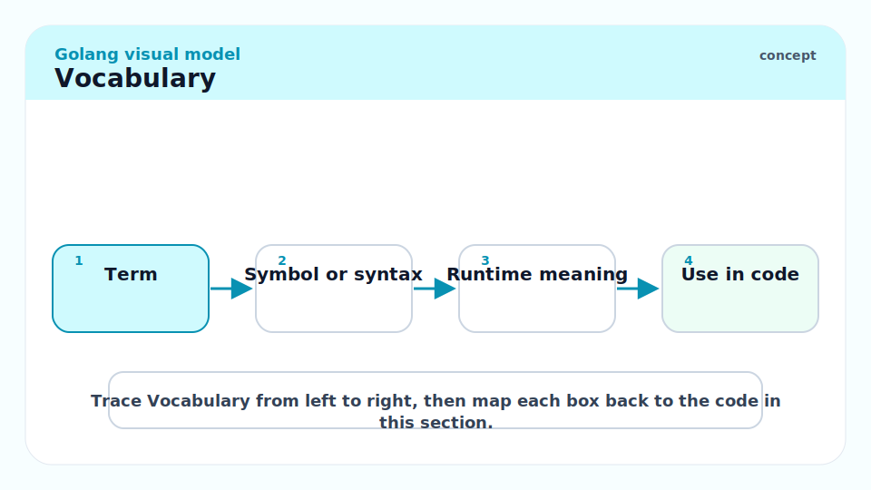

**Multiple return values**: A Go function can return more than one value. The idiomatic pattern is to return `(result, error)`.

---

**Named return values**: Return values can be given names, making them pre-declared variables in the function body. A bare `return` returns the current values of all named returns.

```go
func divide(a, b float64) (result float64, err error) {
    if b == 0 {
        err = fmt.Errorf("divide by zero")
        return  // returns (0.0, err) — bare return
    }
    result = a / b
    return
}
```

---

**Variadic function**: A function whose last parameter is a `...T` type, accepting zero or more arguments of type `T`. Inside the function, the parameter is a `[]T`. Pass a slice with `slice...` expansion.

---

**`defer`**: A statement that schedules a function call to run just before the surrounding function returns. Multiple defers run in LIFO order. The deferred function's arguments are evaluated immediately at the `defer` statement.

---

**Closure**: A function literal (anonymous function) that captures variables from its surrounding scope. The closure retains access to those variables even after the surrounding function returns.

---

**Method**: A function associated with a specific type (its receiver). Declared with a receiver between `func` and the method name.

```go
func (r ReceiverType) MethodName(params) returnTypes { ... }
```

---

**Value receiver**: A copy of the receiver is passed. The method cannot mutate the original.

---

**Pointer receiver**: A pointer to the receiver is passed. The method can mutate the original. The method is in the method set of both `*T` and (sometimes) `T`.

---

**Method set**: The set of methods associated with a type. For `T`, the method set contains only value-receiver methods. For `*T`, the method set contains both value-receiver and pointer-receiver methods. Interface satisfaction depends on the method set.

---

## Intuition

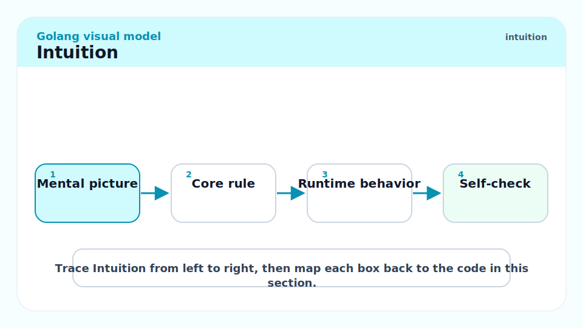

Functions in Go are values — you can store them in variables, pass them to functions, return them from functions, put them in maps. This is first-class functions, the same model as Python or JavaScript, but with static typing. Closures are the natural extension: when a function literal references a variable from an outer scope, it "closes over" that variable, holding a reference to it.

The receiver syntax for methods is just syntactic sugar for "the first parameter has a special name and is written before the function name." A method `(p *Point) Scale(f float64)` is semantically identical to `Scale(p *Point, f float64)` — the compiler rewrites one to the other. This means there is no hidden `this` or `self` — the receiver is explicit, typed, and can have any name you choose.

`defer` is the single most useful feature for resource cleanup. Instead of a complex `try/finally` or `RAII` destructor, you write `defer f.Close()` immediately after opening the file, and the close is guaranteed to run regardless of which `return` or `panic` path the function takes.

## Multiple Return Values

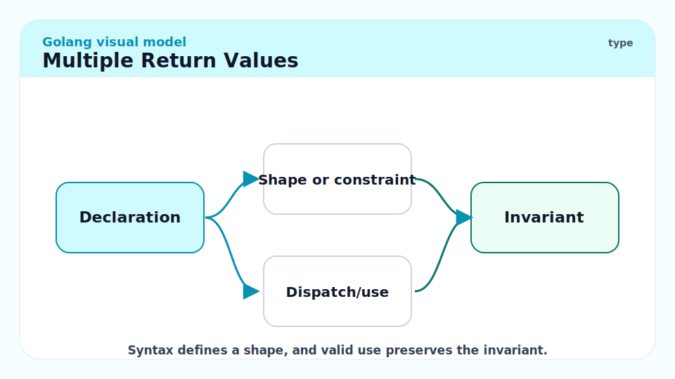

Go encourages returning errors as ordinary values alongside results, rather than using exceptions. The `(T, error)` pattern appears in virtually every function that can fail.

```go
package main

import (
	"fmt"
	"strconv"
)

// parsePositive converts s to a positive integer or returns an error.
func parsePositive(s string) (int, error) {
	n, err := strconv.Atoi(s)
	if err != nil {
		return 0, fmt.Errorf("parsePositive: %w", err)
	}
	if n <= 0 {
		return 0, fmt.Errorf("parsePositive: %d is not positive", n)
	}
	return n, nil
}

func main() {
	n, err := parsePositive("42")
	if err != nil {
		fmt.Println("error:", err)
		return
	}
	fmt.Println(n) // 42

	_, err = parsePositive("-5")
	fmt.Println(err) // parsePositive: -5 is not positive
}
```

The `_` blank identifier discards a return value you do not need. Never use `_` to discard an error without checking it — that is a bug.

> [!WARNING]
> Discarding the `error` return with `_` silently swallows failures. `f, _ := os.Open(path)` compiles and runs but `f` will be nil if the file does not exist, and the next `f.Read()` will panic. Always check errors. `errcheck` and `staticcheck` flag unchecked errors in CI.

## Variadic Functions

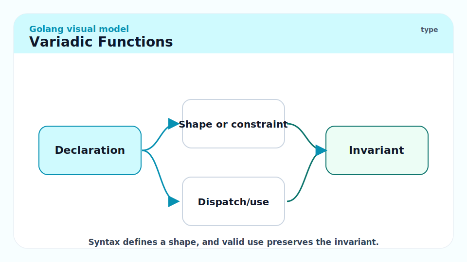

A variadic parameter `...T` collects all trailing arguments into a `[]T`. The caller can pass individual values or spread a slice with `...`.

```go
// Sum returns the sum of all provided integers.
func Sum(nums ...int) int {
    total := 0
    for _, n := range nums {
        total += n
    }
    return total
}

fmt.Println(Sum(1, 2, 3))          // 6
fmt.Println(Sum())                  // 0
nums := []int{4, 5, 6}
fmt.Println(Sum(nums...))           // 15 — spread slice
```

`fmt.Println` itself is variadic: `func Println(a ...any) (n int, err error)`.

## `defer` — Guaranteed Cleanup in LIFO Order

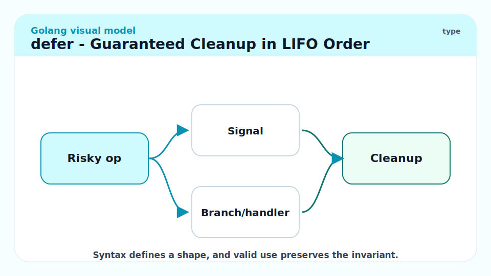

`defer` evaluates its arguments immediately but delays the call until the enclosing function returns (normally or via panic). Multiple defers stack in LIFO order.

```go
import "os"

// copyFile demonstrates defer for guaranteed resource cleanup.
func copyFile(src, dst string) error {
    in, err := os.Open(src)
    if err != nil {
        return fmt.Errorf("copyFile: open source: %w", err)
    }
    defer in.Close()   // runs after copyFile returns, regardless of path

    out, err := os.Create(dst)
    if err != nil {
        return fmt.Errorf("copyFile: create dest: %w", err)
    }
    defer out.Close()  // runs before in.Close() — LIFO

    _, err = io.Copy(out, in)
    return err
}
```

### Defer argument evaluation

The deferred function's **arguments are evaluated at the `defer` statement**, not at execution time. The function itself runs later.

```go
func demo() {
    i := 0
    defer fmt.Println(i)   // i is evaluated NOW → deferred call is fmt.Println(0)
    i = 42
    // Returns here; deferred fmt.Println(0) runs → prints "0"
}
```

To defer with a value captured at return time, use a closure:

```go
func demo2() {
    i := 0
    defer func() { fmt.Println(i) }()  // i captured by reference
    i = 42
    // Deferred func runs → prints "42"
}
```

> [!IMPORTANT]
> Named return values interact with `defer` in a surprising way: a deferred function that assigns to a named return value changes what the function returns. This is used in the error-wrapping pattern for `recover`. See [6 - Errors, Panics, and Recovery](./6-errors-panics-recovery.md) for the full pattern.

### LIFO ordering

```go
func lifoDemo() {
    for i := 0; i < 3; i++ {
        defer fmt.Println(i) // defers: println(0), println(1), println(2)
    }
}
// Output:
// 2
// 1
// 0
```

> [!WARNING]
> Deferring inside a loop is a common performance mistake. If the loop runs 10,000 iterations and each iteration defers a function, you accumulate 10,000 deferred calls that all fire when the surrounding function returns. For a loop that opens and processes files, this means all files stay open simultaneously. Use an inner closure with its own defer scope, or call cleanup explicitly.

## Closures

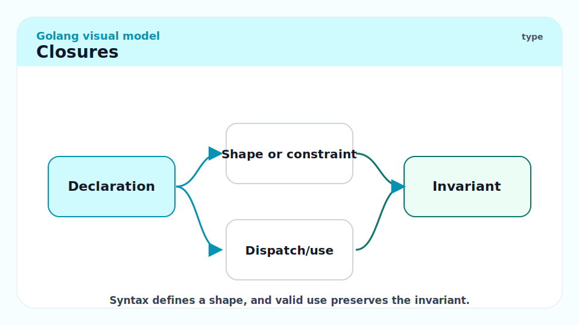

A closure is a function that references variables from outside its own body. The function "closes over" those variables — it holds a reference, not a copy.

```go
// makeCounter returns a closure that increments an internal counter.
func makeCounter() func() int {
    n := 0
    return func() int {
        n++
        return n
    }
}

c1 := makeCounter()
c2 := makeCounter()
fmt.Println(c1(), c1(), c1())  // 1 2 3 — independent state
fmt.Println(c2())               // 1 — c2 has its own n
```

### The Loop Variable Capture Gotcha (Pre-Go 1.22)

Before Go 1.22, the loop variable `i` in a `for` loop was a single variable mutated on each iteration. Closures capturing `i` all captured the same variable, not its value at the time of capture.

```go
// PRE-1.22 FOOTGUN
funcs := make([]func(), 3)
for i := 0; i < 3; i++ {
    funcs[i] = func() { fmt.Println(i) }
}
funcs[0]() // 3 — i is 3 after loop ends
funcs[1]() // 3
funcs[2]() // 3

// Pre-1.22 fix: copy the loop variable inside the loop
for i := 0; i < 3; i++ {
    i := i  // new variable i in inner scope
    funcs[i] = func() { fmt.Println(i) }
}

// Go 1.22+: each iteration gets its own i — the footgun is gone.
```

> [!NOTE]
> Go 1.22 (February 2024) changed for-loop variable semantics so each iteration gets its own copy of the loop variable. If your module's `go` directive in `go.mod` is `go 1.22` or later, the old footgun no longer applies. For modules still on older go lines, the `i := i` fix is required.

## Methods — Value vs Pointer Receivers

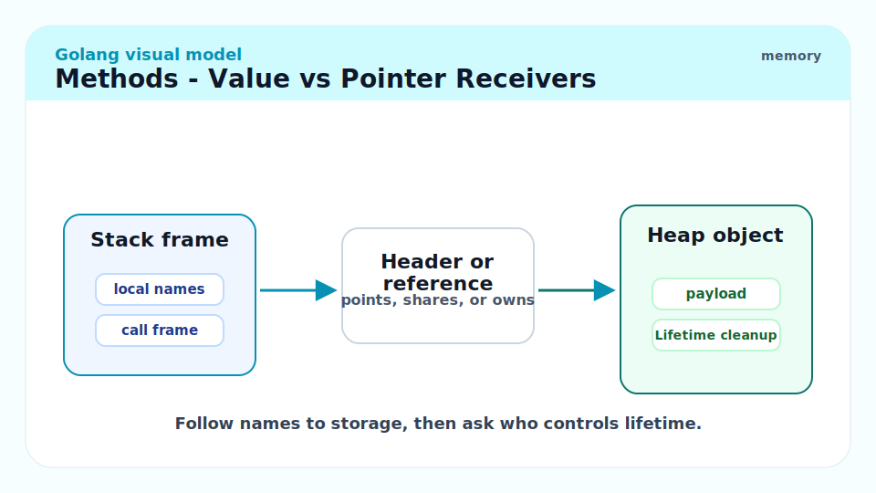

A method is a function declared with a receiver. The receiver is the type the method is "on." The receiver name is idiomatic (usually one or two letters matching the type name), not `this` or `self`.

```go
type Rectangle struct {
    Width, Height float64
}

// Area uses a value receiver — does not need to mutate Rectangle.
func (r Rectangle) Area() float64 {
    return r.Width * r.Height
}

// Scale uses a pointer receiver — mutates r.
func (r *Rectangle) Scale(factor float64) {
    r.Width *= factor
    r.Height *= factor
}

rect := Rectangle{Width: 4, Height: 3}
fmt.Println(rect.Area())   // 12.0

rect.Scale(2)              // Go auto-takes address: (&rect).Scale(2)
fmt.Println(rect.Area())   // 48.0 — Width=8, Height=6
```

### When to use which receiver

| Condition | Receiver |
| :--- | :--- |
| Method must mutate the receiver | Pointer `*T` |
| Receiver is a large struct (avoid copy cost) | Pointer `*T` |
| Method must be callable on nil receiver (sentinel pattern) | Pointer `*T` |
| Receiver is a small value type and mutation is wrong | Value `T` |
| Type is used as a map key or in `sync.WaitGroup`-like patterns | Value `T` |

> [!IMPORTANT]
> Be consistent: if any method on a type uses a pointer receiver, all methods should use pointer receivers. Mixed receivers confuse interface satisfaction. The interface only includes methods in the method set of the declared variable's type — a value `T` does NOT have pointer-receiver methods in its method set, but `*T` does have all methods. If your struct implements an interface and you mix receivers, you may find that `var _ MyInterface = T{}` fails while `var _ MyInterface = &T{}` succeeds.

### Method Sets and Interface Satisfaction

```go
type Stringer interface {
    String() string
}

type Counter struct{ n int }

// String uses a pointer receiver.
func (c *Counter) String() string {
    return fmt.Sprintf("counter(%d)", c.n)
}

var s Stringer = &Counter{}  // *Counter has String() — OK
// var s2 Stringer = Counter{}  // COMPILE ERROR: Counter does not implement Stringer
//                               // (String method has pointer receiver)
```

## Real-world Example

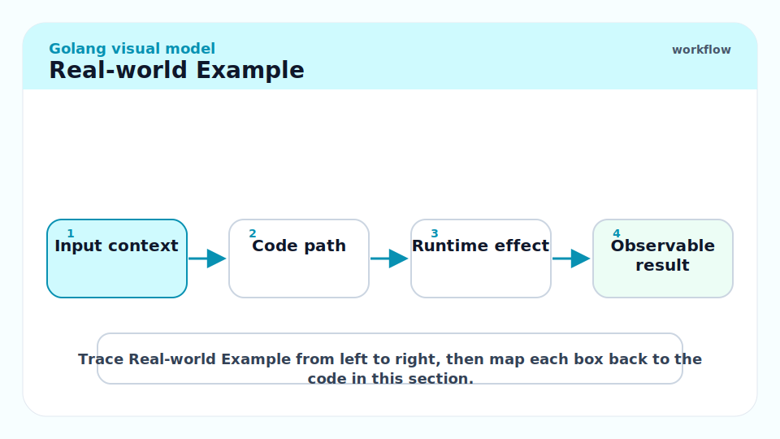

A middleware pattern using closures and function values — the bread-and-butter of Go HTTP servers:

```go
package main

import (
	"fmt"
	"log"
	"net/http"
	"time"
)

// loggingMiddleware wraps an http.Handler and logs the request duration.
// It returns a new http.Handler — a closure that captures the inner handler.
func loggingMiddleware(next http.Handler) http.Handler {
	return http.HandlerFunc(func(w http.ResponseWriter, r *http.Request) {
		start := time.Now()
		next.ServeHTTP(w, r)
		log.Printf("%s %s %s", r.Method, r.URL.Path, time.Since(start))
	})
}

// greet is a simple handler.
func greet(w http.ResponseWriter, r *http.Request) {
	fmt.Fprintf(w, "hello\n")
}

func main() {
	mux := http.NewServeMux()
	mux.HandleFunc("/", greet)

	// Wrap the mux with logging middleware.
	handler := loggingMiddleware(mux)

	log.Fatal(http.ListenAndServe(":8080", handler))
}
```

`loggingMiddleware` is a higher-order function: it takes a function (`http.Handler`) and returns a new function. The returned closure captures `next`. Every request triggers the closure, which records start time, delegates to `next`, then logs the duration. This is the entire foundation of Go middleware chains.

> [!TIP]
> `http.HandlerFunc` is a named type `type HandlerFunc func(ResponseWriter, *Request)` with a `ServeHTTP` method. Casting a `func(w, r)` function to `http.HandlerFunc` makes it satisfy the `http.Handler` interface without defining a separate struct. This pattern — named function types that implement interfaces — is one of the most elegant idioms in the standard library.

## In Practice

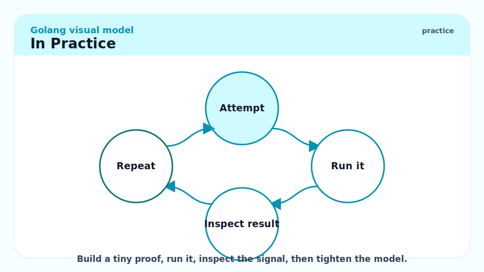

`defer` has non-zero overhead — each deferred call allocates a "defer record" on the goroutine stack (though the compiler optimises away some of these in Go 1.14+). In hot loops (thousands of calls per second), avoiding defer and calling cleanup explicitly can reduce allocations. Profile first (`pprof`) before eliminating defers for performance — readability is usually the more important variable.

Closures that capture large variables keep those variables alive for the closure's lifetime. A background goroutine that closes over a large request object will keep that request's memory alive until the goroutine exits. Prefer passing values as explicit parameters to goroutines rather than capturing them by closure when the lifetime matters.

> [!WARNING]
> `defer mu.Unlock()` after `mu.Lock()` is the correct pattern. But `defer mu.Lock(); defer mu.Unlock()` in the same function does not make sense — the Lock runs on return, after Unlock, which panics. A surprisingly common mistake is writing `defer` on both the lock and the unlock calls.

## Pitfalls

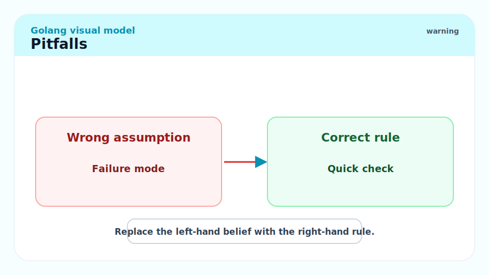

- **"Deferred arguments are captured at call time."** — The arguments are evaluated immediately; only the call is deferred. `defer f(x)` captures the current value of `x`. Use a closure if you want the deferred call to see `x`'s value at return time.
- **"A closure captures values, not variables."** — Closures capture variables (the storage location). If you modify the variable after creating the closure, the closure sees the modification.
- **"Value receivers can implement any interface."** — Value receivers methods are in the method set of `T`. Pointer receiver methods are in the method set of `*T` only. If the interface requires a pointer-receiver method, only `*T` (not `T`) satisfies it.
- **"`defer` is too expensive to use in hot paths."** — Go 1.14+ made defer much cheaper via open-coded defers (compiler inlines the defer logic instead of allocating a defer record). Measure before removing defer for performance.
- **"Named return values always improve clarity."** — Named returns are useful when the function is complex or when you use defer to modify them on error. For simple functions, they add confusion by introducing extra variables. Use them deliberately.

## Exercises

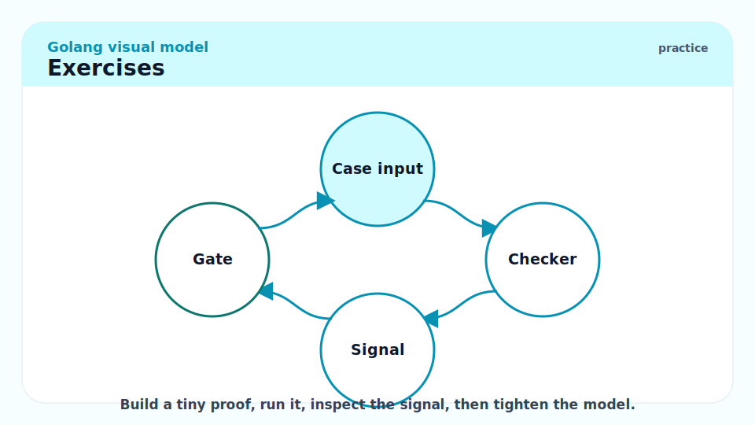

### Exercise 1 — Code output: What does this function return?

```go
func f() (n int) {
    defer func() { n++ }()
    return 5
}
fmt.Println(f())
```

#### Solution

Output: `6`

`return 5` sets the named return variable `n` to 5, then executes deferred functions before actually returning. The deferred closure captures `n` by reference and increments it to 6. The function returns 6. This is the "deferred function modifies named return" pattern — intentional and documented in the spec.

---

### Exercise 2 — Implementation: Write a `memoize` function

Write a generic-ish memoize that wraps any `func(string) int` and caches results.

#### Solution

```go
package main

import "fmt"

// memoize returns a new function that caches results of calls to f.
// The returned function is NOT safe for concurrent use.
func memoize(f func(string) int) func(string) int {
	cache := make(map[string]int)
	return func(key string) int {
		if v, ok := cache[key]; ok {
			return v
		}
		v := f(key)
		cache[key] = v
		return v
	}
}

func expensiveCompute(s string) int {
	fmt.Printf("computing for %q\n", s)
	return len(s) * 42
}

func main() {
	memoized := memoize(expensiveCompute)
	fmt.Println(memoized("hello"))  // computing for "hello"\n 210
	fmt.Println(memoized("hello"))  // 210 (no "computing" print — cache hit)
	fmt.Println(memoized("world"))  // computing for "world"\n 210
}
```

The closure captures `cache`, which persists between calls. Each call to `memoized` checks the cache before calling `f`. The map and the original `f` are private to the returned function.

---

### Exercise 3 — Bug finding: What is wrong with this defer usage?

```go
func processFiles(paths []string) error {
    for _, path := range paths {
        f, err := os.Open(path)
        if err != nil {
            return err
        }
        defer f.Close()
        if err := processOne(f); err != nil {
            return err
        }
    }
    return nil
}
```

#### Solution

The bug: `defer f.Close()` is inside the `for` loop. Deferred calls run when the *function* returns, not when the current loop iteration ends. If `paths` has 1000 elements, all 1000 files remain open until `processFiles` returns. On most systems the file descriptor limit is 1024. With enough files this causes "too many open file descriptors" errors.

The fix: extract the per-file work into a helper function so each call gets its own `defer`:

```go
func processFiles(paths []string) error {
    for _, path := range paths {
        if err := processOne(path); err != nil {
            return err
        }
    }
    return nil
}

func processOne(path string) error {
    f, err := os.Open(path)
    if err != nil {
        return err
    }
    defer f.Close()   // now scoped to processOne — closes after each iteration
    return process(f)
}
```

---

### Exercise 4 — Conceptual: Why does this fail to compile?

```go
type Writer interface { Write([]byte) error }
type MyWriter struct{}
func (w MyWriter) Write(b []byte) error { return nil }

var _ Writer = MyWriter{}   // line A
var _ Writer = &MyWriter{}  // line B
```

Both lines A and B involve `MyWriter` with a value receiver method. Which compiles? Why?

#### Solution

Both lines compile. `Write` uses a value receiver (`MyWriter`), so it is in the method set of both `MyWriter` and `*MyWriter`. The interface `Writer` is satisfied by both.

The situation reverses when the method uses a pointer receiver:

```go
func (w *MyWriter) Write(b []byte) error { return nil }

var _ Writer = MyWriter{}   // COMPILE ERROR: MyWriter does not implement Writer
var _ Writer = &MyWriter{}  // OK: *MyWriter has Write
```

Pointer receiver methods are only in the method set of `*T`. A value `T` stored in an interface requires that all interface methods be value-receiver methods (or that the caller stored a `*T` in the interface).

## Sources

- The Go Specification — Function declarations: https://go.dev/ref/spec#Function_declarations
- The Go Specification — Method sets: https://go.dev/ref/spec#Method_sets
- The Go Specification — Defer: https://go.dev/ref/spec#Defer_statements
- The Go Programming Language (Donovan & Kernighan) — Chapter 5 (Functions).
- Effective Go — Methods, Interfaces: https://go.dev/doc/effective_go#methods
- Go 1.22 release notes (loop variable change): https://go.dev/doc/go1.22

## Related

- [2 - Types, Zero Values, and Declarations](./2-types-and-zero-values.md)
- [5 - Interfaces and Type Assertions](./5-interfaces-and-type-assertions.md)
- [6 - Errors, Panics, and Recovery](./6-errors-panics-recovery.md)
- [7 - Goroutines and Channels](./7-goroutines-and-channels.md)
