# 5 - Interfaces and Type Assertions

[toc]

> **TL;DR:** Go interfaces are satisfied implicitly — a type need not declare that it implements an interface, it just needs to have the right methods. This structural (duck-typed) approach makes Go interfaces extraordinarily composable: small interfaces (one or two methods) are the idiomatic unit, and every type in the standard library (Reader, Writer, Closer, Handler, Stringer) is defined this way. The empty interface `any` (`interface{}`) holds any value, but loses all static type information; type assertions and type switches recover it.

## Vocabulary

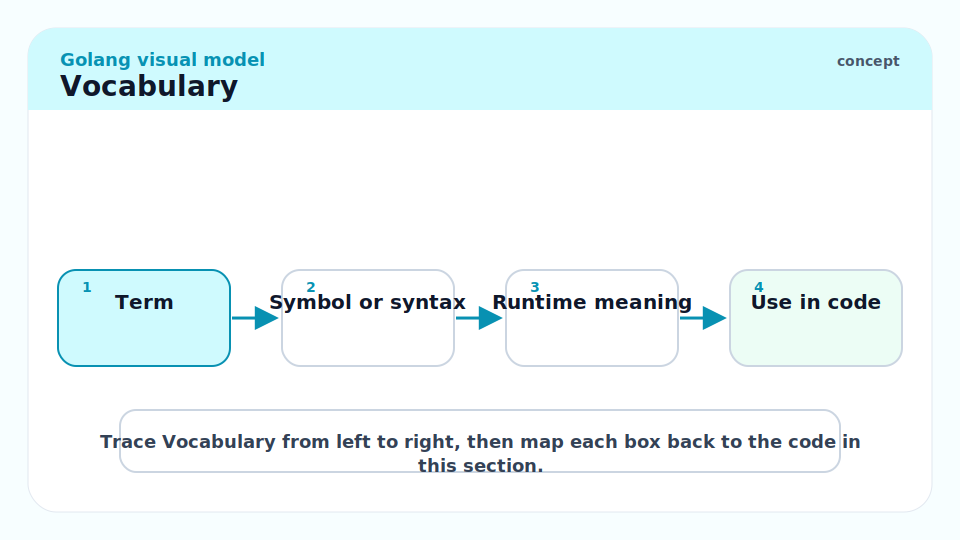

**Interface**: A type defined by a set of method signatures. Any type that implements all the methods implicitly satisfies the interface. No explicit `implements` keyword.

---

**Implicit satisfaction**: A type satisfies an interface automatically if it has all the required methods with matching signatures. The type need not mention the interface.

---

**Type assertion**: An expression `x.(T)` that extracts the concrete value stored in interface `x` as type `T`. Panics if `x` does not hold a `T`. Two-value form `v, ok := x.(T)` is non-panicking.

---

**Type switch**: A switch statement that branches on the dynamic type of an interface value. The case patterns are types, not values.

```go
switch v := x.(type) {
case int:    fmt.Println("int:", v)
case string: fmt.Println("string:", v)
default:     fmt.Println("unknown")
}
```

---

**`any`**: The predeclared alias for `interface{}` introduced in Go 1.18. Holds any value. Replaces `interface{}` in new code for readability.

---

**Interface value**: A two-word runtime value: a pointer to the concrete type's type descriptor (`itab` / type info) and a pointer to the concrete data. Both words are nil for a nil interface.

---

**`errors.Is`**: Unwraps an error chain and checks if any error in the chain equals a target error (by identity or by implementing `Is(error) bool`).

---

**`errors.As`**: Unwraps an error chain and checks if any error in the chain can be assigned to a given type (pointer target).

---

**`io.Reader` / `io.Writer`**: The two most important interfaces in the standard library. Defined by a single method each. Compose into `io.ReadWriter`, `io.ReadCloser`, etc.

---

## Intuition

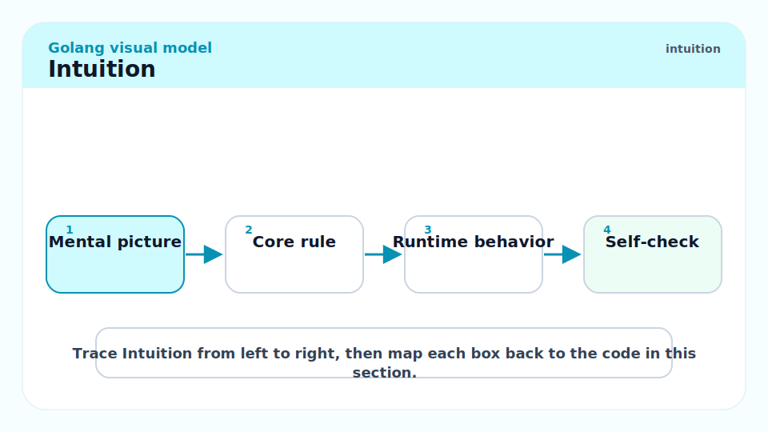

In Java or C++, you declare that a class implements an interface (`implements Runnable`, `extends AbstractBase`). In Go, satisfaction is checked by the compiler by structural matching — if the type has the methods, it satisfies the interface, full stop. This means you can define an interface in your package that an external type (from the standard library, from a third party) satisfies without changing that external type. You are not constrained by the library author's hierarchy.

The mantra "accept interfaces, return structs" captures the design idiom: function parameters should be interfaces (accept the minimal surface a caller can provide), and return types should be concrete structs (give the caller the full concrete type so they can use everything). This keeps APIs flexible on the input side and explicit on the output side.

## Interface Declaration and Satisfaction

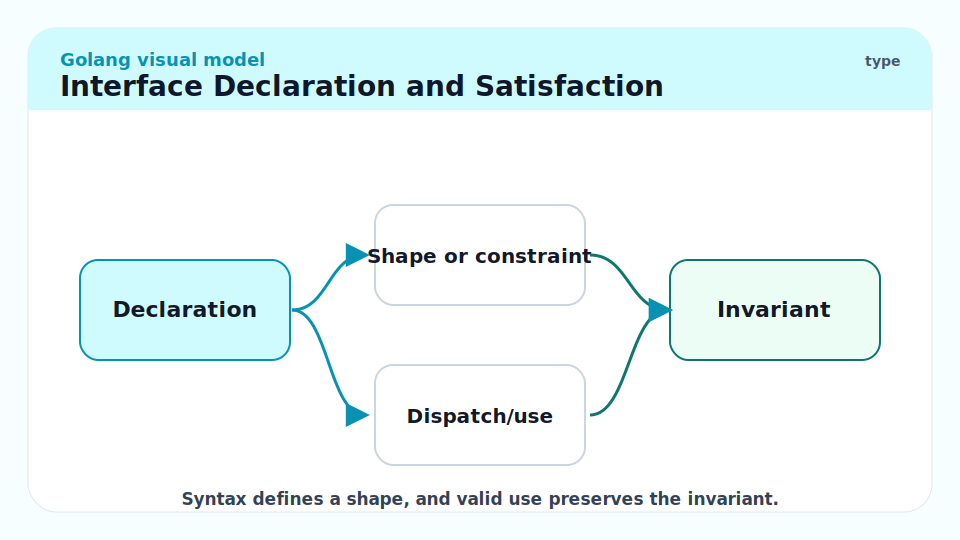

An interface groups method signatures. A type satisfies the interface if it has all listed methods with matching signatures.

```go
// Stringer is satisfied by any type with a String() string method.
type Stringer interface {
    String() string
}

type Point struct{ X, Y float64 }

// Point satisfies Stringer — no declaration needed.
func (p Point) String() string {
    return fmt.Sprintf("(%.2f, %.2f)", p.X, p.Y)
}

var s Stringer = Point{1.5, 2.5}
fmt.Println(s.String())  // (1.50, 2.50)
fmt.Println(s)           // fmt calls String() automatically: (1.50, 2.50)
```

### Compile-time interface check

Use a blank assignment to force the compiler to check interface satisfaction at compile time rather than waiting for a runtime assignment that may never be reached:

```go
// Assert at compile time that *MyReader implements io.Reader.
var _ io.Reader = (*MyReader)(nil)
```

This line compiles only if `*MyReader` has a `Read([]byte) (int, error)` method. It is a zero-cost compile-time guard.

> [!TIP]
> Put `var _ io.Reader = (*MyReader)(nil)` immediately after your type declaration. This documents the intent and catches mistakes immediately — you learn about a missing method at compile time, not when a test fails at runtime.

## The Standard Library's Small Interfaces

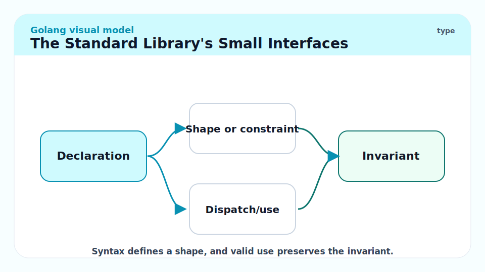

The standard library exemplifies the small-interface design. Every package builds on a handful of one- or two-method interfaces:

| Interface | Package | Method(s) |
| :--- | :--- | :--- |
| `io.Reader` | `io` | `Read(p []byte) (n int, err error)` |
| `io.Writer` | `io` | `Write(p []byte) (n int, err error)` |
| `io.Closer` | `io` | `Close() error` |
| `fmt.Stringer` | `fmt` | `String() string` |
| `error` | builtin | `Error() string` |
| `http.Handler` | `net/http` | `ServeHTTP(ResponseWriter, *Request)` |
| `sort.Interface` | `sort` | `Len() int; Less(i, j int) bool; Swap(i, j int)` |

Because `io.Reader` and `io.Writer` are single-method, virtually every type that produces or consumes bytes satisfies them: `os.File`, `bytes.Buffer`, `strings.Reader`, `net.Conn`, `http.Request.Body`, a gzip decompressor, a TLS layer. You can chain them without adapters.

## Interface Values Under the Hood

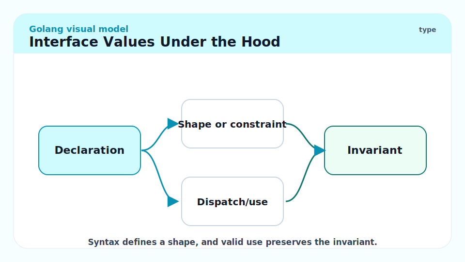

An interface value is a two-word pair at runtime: a pointer to the type descriptor (runtime type info / itab) and a pointer to the concrete data. A nil interface has both words nil.

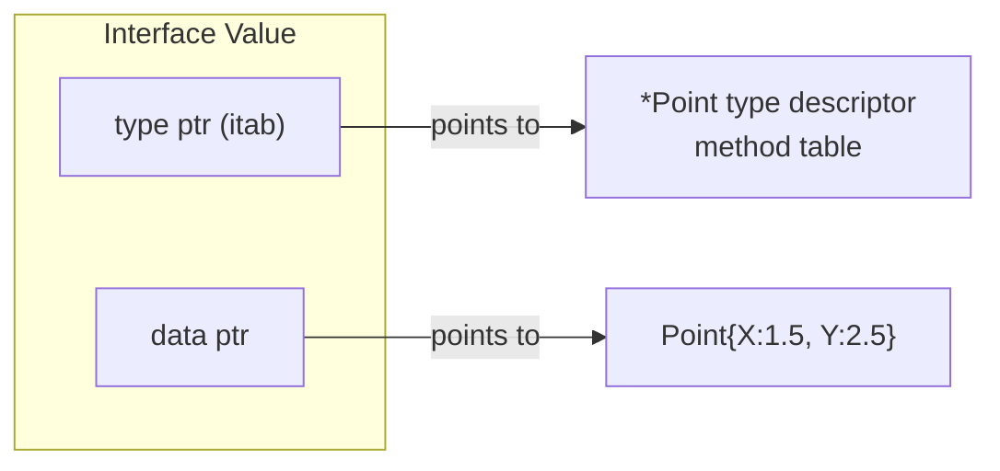

A nil interface is not the same as an interface containing a nil pointer. This is the most common source of the "nil interface that is not nil" bug:

```go
type MyError struct{ msg string }
func (e *MyError) Error() string { return e.msg }

func mayFail(fail bool) error {
    var e *MyError  // nil pointer to MyError
    if fail {
        e = &MyError{"something failed"}
    }
    return e  // BUG: returns non-nil interface containing nil pointer
}

err := mayFail(false)
fmt.Println(err == nil)  // FALSE — interface type word is *MyError, not nil
```

> [!CAUTION]
> Never return a typed nil pointer as an `error`. `return (*MyError)(nil)` returns a non-nil interface value (type word = `*MyError`, data word = nil). The caller's `if err != nil` check passes. The correct pattern: always return the untyped `nil` literal when there is no error, or return a concrete error value. See [6 - Errors, Panics, and Recovery](./6-errors-panics-recovery.md).

## Type Assertions

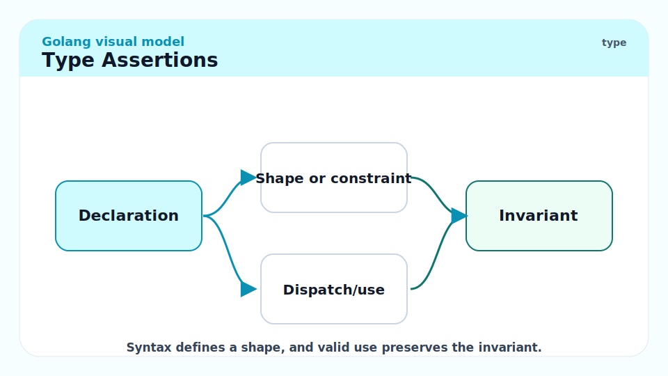

A type assertion `x.(T)` extracts the concrete value from interface `x` as type `T`. Single-value form panics if `x` does not hold a `T`. Two-value (comma-ok) form is safe.

```go
var x any = "hello"

// Single-value — panics if wrong type
s := x.(string)
fmt.Println(s)  // hello

// Two-value (comma-ok) — never panics
s2, ok := x.(string)
fmt.Println(s2, ok)  // hello true

n, ok := x.(int)
fmt.Println(n, ok)   // 0 false — safe, no panic

// Would panic:
// n := x.(int)  // panic: interface conversion: interface {} is string, not int
```

> [!WARNING]
> Single-value type assertions panic at runtime when the type does not match. In library code that accepts `any`, always use the comma-ok form. Single-value assertions are appropriate only when you have already checked the type (e.g., inside a type switch case).

## Type Switches


A type switch branches on the dynamic type of an interface value. It is the idiomatic pattern for handling a sum of types.

```go
// describe prints a human-readable description of x's type and value.
func describe(x any) string {
    switch v := x.(type) {
    case nil:
        return "nil"
    case int:
        return fmt.Sprintf("int: %d", v)
    case float64:
        return fmt.Sprintf("float64: %f", v)
    case string:
        return fmt.Sprintf("string: %q", v)
    case []int:
        return fmt.Sprintf("[]int of len %d", len(v))
    case error:
        return fmt.Sprintf("error: %v", v)
    default:
        return fmt.Sprintf("unknown type %T", v)
    }
}

fmt.Println(describe(42))           // int: 42
fmt.Println(describe("hi"))         // string: "hi"
fmt.Println(describe([]int{1, 2}))  // []int of len 2
```

Inside each `case`, `v` has the concrete type of that case — `v` is `int` in the `case int` branch, `string` in the `case string` branch.

## `errors.Is` and `errors.As`

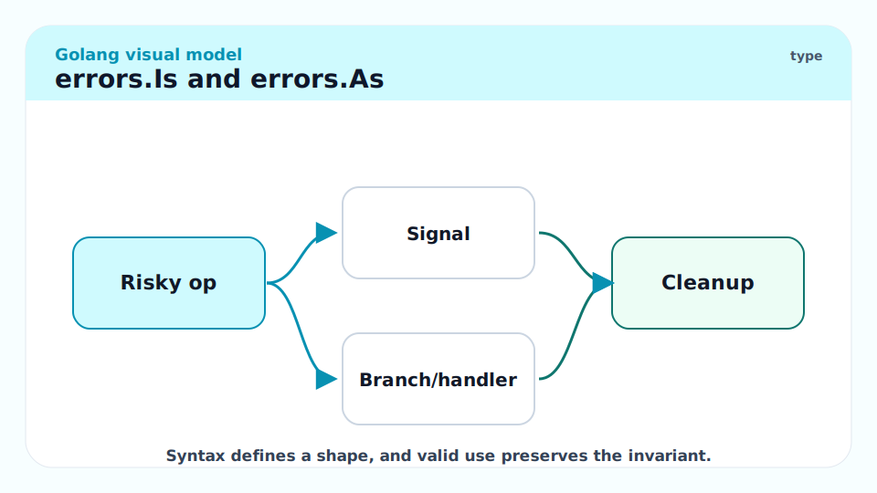

The `errors` package provides two essential functions for working with wrapped error chains. Modern Go code should use these instead of direct equality comparisons or type assertions on errors.

```go
import (
    "errors"
    "fmt"
    "os"
)

// errors.Is checks identity in the chain
func readFile(path string) error {
    _, err := os.Open(path)
    if err != nil {
        return fmt.Errorf("readFile %s: %w", path, err)  // wrap with %w
    }
    return nil
}

err := readFile("/nonexistent")
if errors.Is(err, os.ErrNotExist) {
    fmt.Println("file not found")  // prints this
}

// errors.As extracts a concrete type from the chain
var pathErr *os.PathError
if errors.As(err, &pathErr) {
    fmt.Println("path:", pathErr.Path)  // /nonexistent
}
```

`errors.Is` traverses the chain (via `Unwrap()`) until it finds an error that equals the target or has an `Is(error) bool` method that returns true. `errors.As` traverses the chain until it finds an error assignable to the target type.

> [!IMPORTANT]
> Use `fmt.Errorf("...: %w", err)` to wrap errors (note the `%w` verb, not `%v`). The `%w` verb makes the wrapped error accessible via `errors.Is` and `errors.As`. Using `%v` wraps the string but makes the original error opaque to the chain-walking functions.

## Interface Design Principles

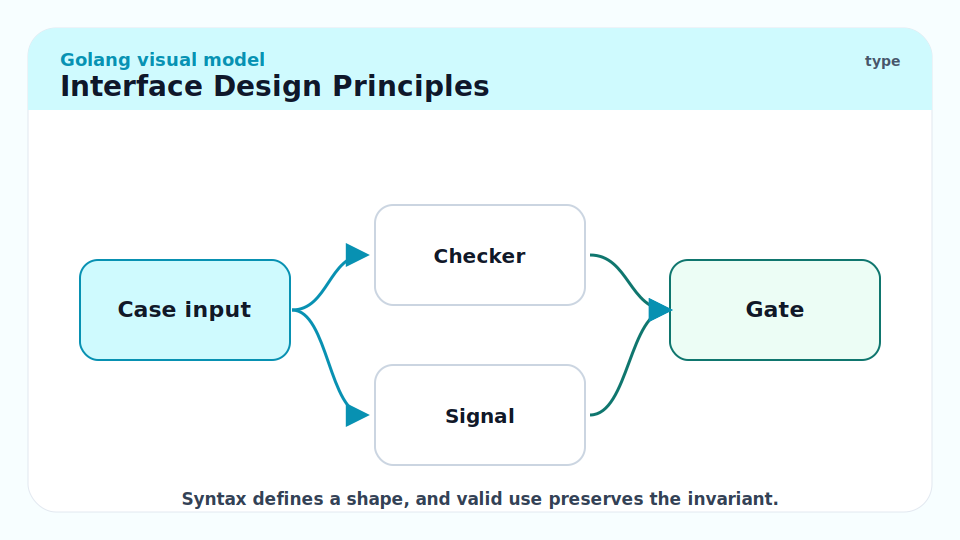

Three idioms that appear in every well-designed Go codebase:

**1. Accept interfaces, return structs.** Function parameters should be the narrowest interface that satisfies your needs. This makes the function testable with mocks and usable with any type that satisfies the interface.

```go
// Good: accepts io.Reader — works with files, buffers, network conns, test fakes
func ParseCSV(r io.Reader) ([]Record, error) { ... }

// Bad: accepts *os.File — caller must provide a real file, cannot mock
func ParseCSV(f *os.File) ([]Record, error) { ... }
```

**2. Small interfaces.** Define interfaces with the minimum number of methods. If you need both reading and closing, use `io.ReadCloser` (a composed interface) rather than defining a new one.

**3. Define interfaces where they are used, not where types are defined.** If package A defines type `T` and package B needs to call one method of `T`, define the interface in B. This avoids import cycles and keeps package A free of unnecessary abstractions.

## Real-world Example

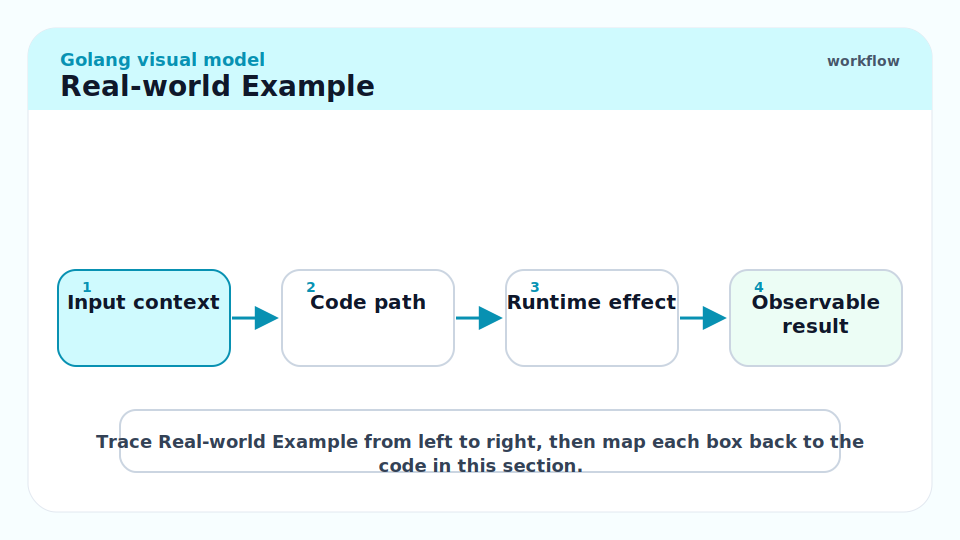

A pluggable notification system using interfaces — allows swapping email, SMS, and Slack backends without changing the notification logic.

```go
package main

import "fmt"

// Notifier can send a notification message.
type Notifier interface {
    Notify(recipient, message string) error
}

// EmailNotifier sends notifications via email (stub).
type EmailNotifier struct{ SMTPHost string }

// Notify sends an email notification to recipient.
func (e EmailNotifier) Notify(recipient, message string) error {
    fmt.Printf("EMAIL to %s via %s: %s\n", recipient, e.SMTPHost, message)
    return nil
}

// SlackNotifier sends notifications to a Slack channel (stub).
type SlackNotifier struct{ WebhookURL string }

// Notify posts a Slack notification.
func (s SlackNotifier) Notify(recipient, message string) error {
    fmt.Printf("SLACK to %s: %s\n", recipient, message)
    return nil
}

// AlertService sends alerts using any Notifier.
type AlertService struct {
    notifier Notifier
}

// NewAlertService creates an AlertService with the given notifier.
func NewAlertService(n Notifier) *AlertService {
    return &AlertService{notifier: n}
}

// Alert sends a high-priority alert.
func (a *AlertService) Alert(user, msg string) error {
    return a.notifier.Notify(user, "[ALERT] "+msg)
}

func main() {
    email := NewAlertService(EmailNotifier{SMTPHost: "smtp.example.com"})
    slack := NewAlertService(SlackNotifier{WebhookURL: "https://hooks.slack.com/..."})

    _ = email.Alert("ops-team", "disk usage > 90%")
    _ = slack.Alert("#oncall", "disk usage > 90%")
}
// EMAIL to ops-team via smtp.example.com: [ALERT] disk usage > 90%
// SLACK to #oncall: [ALERT] disk usage > 90%
```

> [!TIP]
> Testing `AlertService` in isolation is trivial: define a `mockNotifier` struct with `Notify` that records calls and inject it. The interface boundary is the test seam. This is why "accept interfaces" is so powerful — it makes testing without external services essentially free.

## In Practice

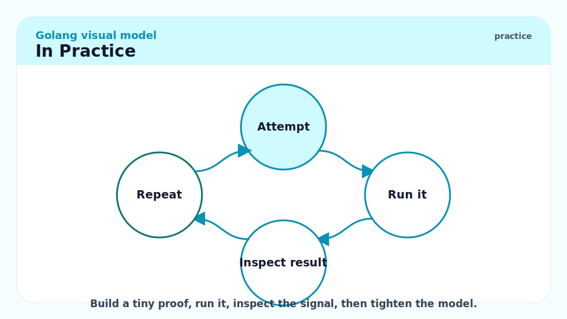

Interface overhead is real but small. A direct method call dispatches via a vtable (one indirect call). In tight loops (nanosecond-scale per iteration), this is measurable. In any I/O-bound or network code, it is invisible. Don't optimise it away unless profiling shows it matters.

The `any` type is used heavily in reflection-based code (JSON, gRPC marshalling, ORM). Every `any`-typed value may escape to the heap (the compiler cannot always prove it doesn't), adding GC pressure. For performance-sensitive generic containers, use Go 1.18 generics (type parameters) instead of `any` to preserve static types and avoid boxing.

> [!WARNING]
> Comparing two interface values with `==` compares both the type and the data. If the concrete type is not comparable (e.g., a slice), the comparison panics at runtime. Two interface values holding nil concrete-typed pointers of different types are not equal. Use `errors.Is`/`errors.As` for errors, and type switches for general type comparisons.

## Pitfalls

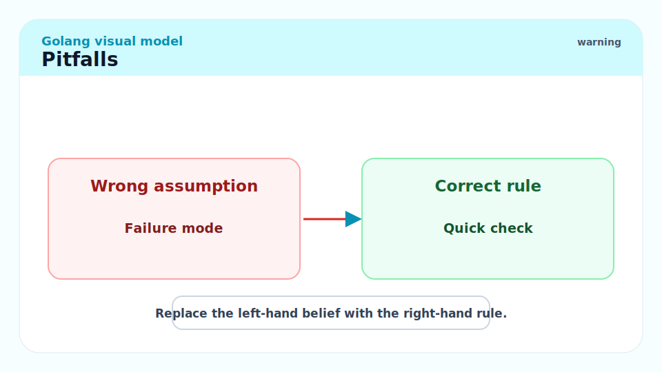

- **"A nil pointer satisfies an interface."** — A nil pointer stored in an interface gives a non-nil interface value. `if err != nil` will be true even though the underlying `*MyError` is nil. Always return the bare `nil` literal from functions returning `error`.
- **"Interfaces are implemented explicitly."** — No declaration needed. If the type has the methods, it satisfies the interface. This is a feature, not a bug — but it means you can accidentally satisfy an interface and not realise it until something unexpected is passed to a function.
- **"Type assertion always works if I know the type."** — Use the comma-ok form in any code path that could receive varying types. Single-value assertions panic on mismatch; a wrong assumption causes a production panic.
- **"`errors.Is` and `errors.As` are just fancy `==`."** — They traverse the error chain via `Unwrap`. Without `%w` wrapping, `errors.Is` cannot see through the wrapping layer.
- **"Interfaces should be large to be useful."** — The opposite. Large interfaces are hard to mock, hard to satisfy, and couple implementations to a specific framework. The Go standard library's most used interfaces have one method.

## Exercises

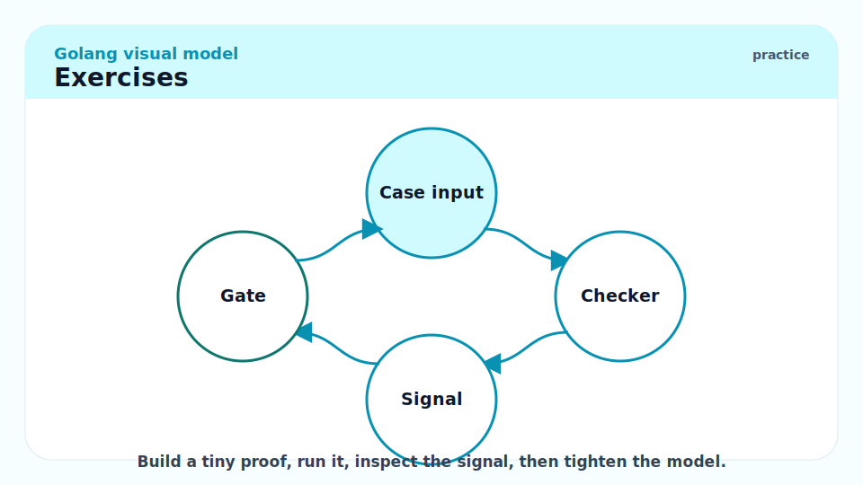

### Exercise 1 — Conceptual: Why is `var e *MyError; return e` a bug when the return type is `error`?

#### Solution

Returning a typed nil pointer as an `error` interface creates a non-nil interface value. An interface value is two words: type descriptor and data pointer. `return e` where `e` is a `*MyError` nil pointer sets the interface's type word to `*MyError` and the data word to nil — but the type word is non-nil, so the interface value is non-nil.

```go
var e *MyError = nil
var err error = e
fmt.Println(err == nil)   // false — type word is *MyError, not nil
fmt.Println(e == nil)     // true — e itself is nil
```

The caller's `if err != nil` check sees a non-nil interface and enters the error branch, even though no error occurred. Fix: return the untyped `nil` when there is no error.

---

### Exercise 2 — Implementation: Implement `sort.Interface` for a custom type

Sort a slice of `Employee` structs by salary descending, then name ascending.

#### Solution

```go
package main

import (
	"fmt"
	"sort"
)

// Employee holds basic employee information.
type Employee struct {
	Name   string
	Salary int
}

// BySalaryThenName implements sort.Interface for []Employee.
type BySalaryThenName []Employee

func (b BySalaryThenName) Len() int      { return len(b) }
func (b BySalaryThenName) Swap(i, j int) { b[i], b[j] = b[j], b[i] }

// Less returns true if b[i] should sort before b[j]:
// higher salary first, then alphabetical by name.
func (b BySalaryThenName) Less(i, j int) bool {
	if b[i].Salary != b[j].Salary {
		return b[i].Salary > b[j].Salary // descending salary
	}
	return b[i].Name < b[j].Name // ascending name
}

func main() {
	employees := []Employee{
		{"Charlie", 80000},
		{"Alice", 100000},
		{"Bob", 100000},
		{"Diana", 90000},
	}
	sort.Sort(BySalaryThenName(employees))
	for _, e := range employees {
		fmt.Printf("%s: %d\n", e.Name, e.Salary)
	}
}
// Alice: 100000
// Bob: 100000
// Diana: 90000
// Charlie: 80000
```

Note: `sort.Slice` offers an alternative with a less-function closure, avoiding the named type, but implementing `sort.Interface` is worth knowing as the foundational pattern.

---

### Exercise 3 — Bug finding: What is wrong with this error check?

```go
func getUser(id int) (*User, error) {
    if id <= 0 {
        var err *ValidationError = &ValidationError{Field: "id", Msg: "must be positive"}
        return nil, err
    }
    return &User{ID: id}, nil
}

u, err := getUser(-1)
if err != nil {
    switch e := err.(type) {
    case *ValidationError:
        fmt.Println("validation:", e.Msg)
    }
}
```

There's actually no bug here — but explain what would happen if `getUser` returned `nil, nil` and how you would check for that case correctly.

#### Solution

If `getUser` returned `nil, nil` for a valid user that simply doesn't exist in the database (common pattern for "not found"), the caller would get `u == nil` and `err == nil`. The code does not handle this case.

The idiomatic Go patterns for "not found" are:
1. Return a sentinel error: `var ErrNotFound = errors.New("not found")` and `return nil, ErrNotFound`. Caller uses `errors.Is(err, ErrNotFound)`.
2. Return `(value, bool)` for operations that may find nothing: `func getUser(id int) (*User, bool)`.
3. Return the zero value with no error (only appropriate when the zero value is meaningful).

Option 1 is most common for database-style lookups:

```go
var ErrUserNotFound = errors.New("user not found")

func getUser(id int) (*User, error) {
    // ... query ...
    if !found {
        return nil, ErrUserNotFound
    }
    return user, nil
}

u, err := getUser(99)
if errors.Is(err, ErrUserNotFound) {
    fmt.Println("no such user")
} else if err != nil {
    fmt.Println("error:", err)
} else {
    fmt.Println("found:", u.Name)
}
```

---

### Exercise 4 — Conceptual: Explain the difference between `errors.Is` and direct `==` comparison

#### Solution

Direct `==` compares two error values for equality. For sentinel errors created with `errors.New`, this is pointer identity. It does NOT traverse wrapped errors.

```go
var ErrNotFound = errors.New("not found")

wrapped := fmt.Errorf("getUser: %w", ErrNotFound)

fmt.Println(wrapped == ErrNotFound)          // false — different pointer
fmt.Println(errors.Is(wrapped, ErrNotFound)) // true — Is traverses Unwrap chain
```

`errors.Is(err, target)` calls `err.Unwrap()` repeatedly to walk the chain. At each level, it checks if the current error equals `target` (via `==` or a custom `Is(error) bool` method). This means you can wrap errors across multiple layers and still correctly check for a specific root cause anywhere in the stack.

## Sources

- The Go Specification — Interface types: https://go.dev/ref/spec#Interface_types
- The Go Specification — Type assertions: https://go.dev/ref/spec#Type_assertions
- The Go Blog — Error handling and Go: https://go.dev/blog/error-handling-and-go
- The Go Blog — Working with Errors in Go 1.13: https://go.dev/blog/go1.13-errors
- The Go Programming Language (Donovan & Kernighan) — Chapter 7 (Interfaces).
- Effective Go — Interfaces: https://go.dev/doc/effective_go#interfaces

## Related

- [4 - Functions, Closures, and Methods](./4-functions-closures-methods.md)
- [6 - Errors, Panics, and Recovery](./6-errors-panics-recovery.md)
- [10 - The Standard Library Tour](./10-standard-library-tour.md)
