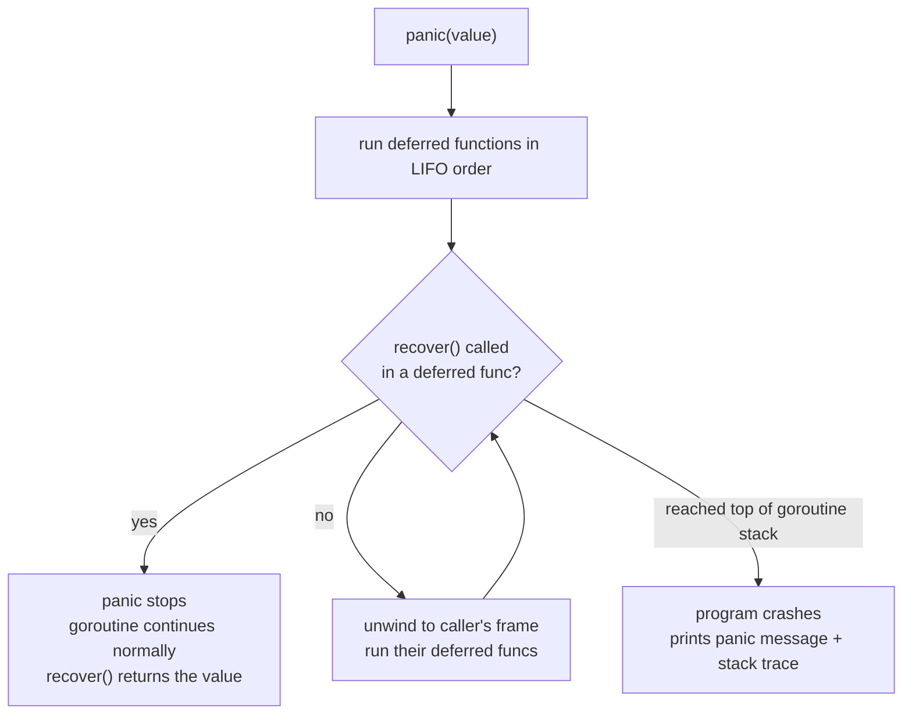

# 6 - Errors, Panics, and Recovery

[toc]

> **TL;DR:** Go treats errors as ordinary values returned from functions, not as exceptions that unwind the stack. This makes error handling explicit and visible in every call site. Panics are reserved for programmer errors (index out of bounds, nil dereference, assertion failures) and are not a flow-control mechanism. `recover()` inside a deferred function can intercept a panic, but this is a sharp tool used almost exclusively at process boundaries (HTTP handlers, goroutine entry points) to prevent one bad request from killing the server.

## Vocabulary

**`error`**: A built-in interface with a single method `Error() string`. Any type implementing that method is an error. The idiomatic convention: `nil` means no error; non-nil means failure.

---

**Sentinel error**: A package-level variable of type `error` created with `errors.New`. Used for identity comparison via `errors.Is`. Examples: `io.EOF`, `os.ErrNotExist`, `sql.ErrNoRows`.

```go
var ErrNotFound = errors.New("not found")
```

---

**Wrapped error**: An error that contains another error, created with `fmt.Errorf("...: %w", err)` or a custom type implementing `Unwrap() error`. Enables `errors.Is` and `errors.As` chain traversal.

---

**Custom error type**: A struct (or other type) that implements the `error` interface, typically to carry additional context (field names, error codes, HTTP status).

---

**Panic**: A runtime signal that terminates the current goroutine's normal execution and begins unwinding the call stack, running deferred functions as it goes. Can be triggered by the runtime (nil dereference, index out of bounds) or explicitly by `panic(value)`.

---

**`recover()`**: A built-in function that, when called inside a deferred function, stops the panic propagation and returns the value passed to `panic`. Returns `nil` if no panic is in progress.

---

**`defer/recover` pattern**: Wrapping a function call in a deferred function that calls `recover()` to convert a panic into a returned error. Used at service boundaries.

---

## Intuition

The design philosophy of error-as-value comes from Unix: a function signals failure by returning a value, and the caller decides what to do. There is no invisible stack unwinding, no magic `try/catch` syntax that hides control flow. Every possible failure is visible in the function signature and must be handled (or explicitly ignored) at the call site.

This verbosity is intentional. In a codebase with thousands of calls that each return `(T, error)`, the error handling pattern is uniform and searchable. A `grep` for `if err != nil` reveals every error handling site. In a codebase with exceptions, error handling is invisible unless you read every method's documentation.

Panics are for things that "cannot happen" in a correctly written program — index out of bounds means the programmer wrote wrong code, not that the user provided bad input. Production Go services rarely call `panic` explicitly. When they do, it is to fail fast on an invariant violation during startup (e.g., a nil required dependency), not for ordinary runtime errors.

## Error as a Value — The `error` Interface

The `error` interface is defined in the builtin package:

```go
type error interface {
    Error() string
}
```

Any type with an `Error() string` method is an error. The simplest errors are created with `errors.New` or `fmt.Errorf`:

```go
import (
    "errors"
    "fmt"
)

var ErrDivByZero = errors.New("division by zero")    // sentinel

func divide(a, b float64) (float64, error) {
    if b == 0 {
        return 0, ErrDivByZero
    }
    return a / b, nil
}

result, err := divide(10, 0)
if err != nil {
    fmt.Println(err)  // division by zero
}
```

### Error Wrapping with `%w`

When a function calls another function and the inner call fails, wrap the error with context using `fmt.Errorf` and the `%w` verb. This attaches a human-readable context string and preserves the original error for programmatic inspection.

```go
func readConfig(path string) (Config, error) {
    data, err := os.ReadFile(path)
    if err != nil {
        return Config{}, fmt.Errorf("readConfig: read %s: %w", path, err)
    }
    var cfg Config
    if err := json.Unmarshal(data, &cfg); err != nil {
        return Config{}, fmt.Errorf("readConfig: parse %s: %w", path, err)
    }
    return cfg, nil
}
```

The error message from a failed call might be:
`readConfig: read /etc/app/config.json: open /etc/app/config.json: no such file or directory`

This message tells the reader exactly where in the call stack the failure originated and what operation failed.

> [!TIP]
> Convention: the context prefix in `fmt.Errorf` should be the function name or a short action description, followed by relevant parameters, followed by the wrapped error with `: %w`. The result is a readable breadcrumb trail. `pkg/function: action param: underlying error`.

## Sentinel Errors

Sentinel errors are package-level variables used for comparison. They give callers something to branch on without inspecting the error string (which changes, breaks, and is not API-stable).

```go
// In package db:
var (
    ErrNotFound      = errors.New("db: record not found")
    ErrDuplicate     = errors.New("db: duplicate key")
    ErrUnavailable   = errors.New("db: service unavailable")
)

// Caller:
user, err := db.GetUser(ctx, id)
if errors.Is(err, db.ErrNotFound) {
    // Return 404
} else if err != nil {
    // Return 500
}
```

> [!IMPORTANT]
> Never compare errors with `==` when wrapping is involved. `err == ErrNotFound` fails if `err` is wrapped. Always use `errors.Is(err, ErrNotFound)`, which walks the `Unwrap` chain.

## Custom Error Types

When callers need more than just an error string — a field name, an HTTP status code, a retry-after duration — define a custom error type:

```go
// ValidationError describes a field-level validation failure.
type ValidationError struct {
    Field   string
    Message string
}

// Error implements the error interface.
func (e *ValidationError) Error() string {
    return fmt.Sprintf("validation error: field %q: %s", e.Field, e.Message)
}

func validateAge(age int) error {
    if age < 0 || age > 150 {
        return &ValidationError{Field: "age", Message: "must be between 0 and 150"}
    }
    return nil
}

err := validateAge(-5)
var ve *ValidationError
if errors.As(err, &ve) {
    fmt.Printf("bad field: %s\n", ve.Field)  // bad field: age
}
```

### Implementing `Unwrap` for Custom Types

If your custom error wraps another, implement `Unwrap() error` to make `errors.Is` and `errors.As` work:

```go
type DBError struct {
    Op  string
    Err error
}

func (e *DBError) Error() string { return fmt.Sprintf("db %s: %v", e.Op, e.Err) }
func (e *DBError) Unwrap() error { return e.Err }

var ErrNoRows = errors.New("no rows")
dbErr := &DBError{Op: "query", Err: ErrNoRows}

fmt.Println(errors.Is(dbErr, ErrNoRows))  // true — Unwrap reached ErrNoRows
```

## Panics

A panic is Go's mechanism for signalling that the program is in an unrecoverable state. The runtime triggers panics automatically for:

- Nil pointer dereference
- Index out of bounds
- Type assertion failure (single-value form)
- Divide by integer zero
- Stack overflow (infinite recursion)

Programmer-triggered panics use `panic(value)`:

```go
func mustPositive(n int) int {
    if n <= 0 {
        panic(fmt.Sprintf("mustPositive: got %d", n))
    }
    return n
}
```

When a panic occurs, the current goroutine begins unwinding: deferred functions run in LIFO order, then the goroutine terminates. If the panic reaches the top of the goroutine stack without being recovered, the entire program crashes with a stack trace.



> [!WARNING]
> `panic` in a goroutine that was launched with `go func()` and not recovered will crash the entire program, not just the goroutine. Every long-running goroutine launched by a service should have a `recover()` wrapper at the top. HTTP handlers registered with `net/http` have a built-in recovery wrapper (panics are caught and converted to 500 responses), but goroutines you launch manually do not.

## `recover()` — Catching Panics

`recover()` can only be called inside a deferred function. It intercepts the panic and returns the panic value. After recovery, execution continues normally at the point after the deferred function runs (the panicking function does not resume; the caller of the panicking function continues).

```go
// safeRun executes f and returns any panic as an error.
func safeRun(f func()) (err error) {
    defer func() {
        if r := recover(); r != nil {
            err = fmt.Errorf("recovered panic: %v", r)
        }
    }()
    f()
    return nil
}

err := safeRun(func() {
    var s []int
    _ = s[0]  // index out of bounds → panic
})
fmt.Println(err)  // recovered panic: runtime error: index out of range [0] with length 0
```

The interaction with named return values is the key: `err` in `safeRun` is a named return. The deferred function assigns to it via closure. `recover()` itself returns the panic value (any type, often a string or an `error`).

### The HTTP Handler Recovery Pattern

The canonical production use of `recover()` is at HTTP handler boundaries:

```go
// panicMiddleware recovers from panics in HTTP handlers and returns 500.
func panicMiddleware(next http.Handler) http.Handler {
    return http.HandlerFunc(func(w http.ResponseWriter, r *http.Request) {
        defer func() {
            if rec := recover(); rec != nil {
                // Log the panic with stack trace for debugging.
                buf := make([]byte, 4096)
                n := runtime.Stack(buf, false)
                log.Printf("PANIC in handler: %v\n%s", rec, buf[:n])
                http.Error(w, "internal server error", http.StatusInternalServerError)
            }
        }()
        next.ServeHTTP(w, r)
    })
}
```

> [!CAUTION]
> `recover()` does not return the stack trace — it only returns the panic value. To log the stack trace, use `runtime.Stack(buf, false)` inside the deferred function immediately after calling `recover()`. If you log only the panic value, the trace is lost and debugging production incidents becomes very hard.

## When to Panic vs Return Error

The rule is simple: panics are for programmer errors; errors are for runtime conditions that the caller should handle.

| Situation | Use |
| :--- | :--- |
| User provided invalid input | `return error` |
| Database returned an error | `return error` |
| Network request failed | `return error` |
| Configuration file not found | `return error` |
| A nil was passed to a function that documents it must be non-nil | `panic` |
| An array index the programmer computed is out of bounds | Runtime panic (let it happen) |
| A mutex was Unlocked without being Locked (invariant violation) | `panic` |
| Initialisation that is documented to be fatal if it fails | `panic` (startup only) |

The `Must` convention codifies one accepted pattern for panics: a function like `regexp.MustCompile(pattern)` panics if the pattern is invalid. This is appropriate when the pattern is a compile-time constant that cannot fail at runtime — calling `MustCompile` at package init time or in `TestMain` is idiomatic; calling it on user input is a bug.

```go
// At package level — safe: pattern is a constant, failure is a programmer error.
var ipPattern = regexp.MustCompile(`\d+\.\d+\.\d+\.\d+`)

// In a request handler — WRONG: user input, must return error not panic.
func parseIP(s string) (*net.IP, error) {
    // Do NOT: regexp.MustCompile(s) — panics on bad user input
    re, err := regexp.Compile(s)
    if err != nil {
        return nil, fmt.Errorf("parseIP: %w", err)
    }
    // ...
}
```

## Real-world Example

An error handling pattern for a multi-layer service: a database layer, a business logic layer, and an HTTP layer, each wrapping errors with context.

```go
package main

import (
	"errors"
	"fmt"
	"log"
	"net/http"
)

// --- Database layer ---

// ErrUserNotFound is returned when a user ID does not exist.
var ErrUserNotFound = errors.New("user not found")

// DBUser fetches a user from the database (stub).
func DBUser(id int) (string, error) {
	if id == 0 {
		return "", ErrUserNotFound
	}
	if id < 0 {
		return "", fmt.Errorf("DBUser: invalid id %d", id)
	}
	return fmt.Sprintf("user-%d", id), nil
}

// --- Business logic layer ---

// GetUserProfile fetches and formats the user profile.
func GetUserProfile(id int) (string, error) {
	name, err := DBUser(id)
	if err != nil {
		return "", fmt.Errorf("GetUserProfile id=%d: %w", id, err)
	}
	return fmt.Sprintf("Profile{name:%s}", name), nil
}

// --- HTTP layer ---

func userHandler(w http.ResponseWriter, r *http.Request) {
	profile, err := GetUserProfile(0) // 0 → not found
	if err != nil {
		if errors.Is(err, ErrUserNotFound) {
			http.Error(w, "user not found", http.StatusNotFound)
			return
		}
		log.Printf("userHandler: %v", err) // log full chain for debugging
		http.Error(w, "internal error", http.StatusInternalServerError)
		return
	}
	fmt.Fprintln(w, profile)
}
```

> [!NOTE]
> The HTTP layer uses `errors.Is(err, ErrUserNotFound)` even though the error is triple-wrapped. The `%w` chain makes this possible. The log line `log.Printf("userHandler: %v", err)` prints the full breadcrumb: `GetUserProfile id=0: user not found`, giving the developer the complete context.

## In Practice

Go 1.20 added `errors.Join(errs ...error) error` for collecting multiple errors into one (common in validation). The joined error's `Unwrap() []error` returns all constituent errors; `errors.Is` and `errors.As` walk the list.

```go
import "errors"

func validateForm(name, email string) error {
    var errs []error
    if name == "" {
        errs = append(errs, errors.New("name is required"))
    }
    if email == "" {
        errs = append(errs, errors.New("email is required"))
    }
    return errors.Join(errs...) // nil if errs is empty
}
```

At scale, error handling is a significant fraction of code volume. Linters like `errcheck` (catches ignored errors), `wrapcheck` (enforces wrapping of third-party errors), and `errorlint` (catches wrong error comparisons) are worth running in CI.

> [!TIP]
> `fmt.Errorf("fn: %w", err)` is cheap — it allocates one `*fmt.wrapError` value. The allocation is negligible for most code paths. In the very tightest hot paths (millions of calls per second), pre-allocated sentinel errors avoid the allocation entirely. Profile before optimising.

## Pitfalls

- **"Errors should be strings, not types."** — String comparisons on error messages break when the message changes. Use sentinel errors or custom types for programmatic inspection.
- **"`panic` is like `throw` in other languages."** — Panics are for programmer errors, not for conditions the caller should handle. Using panic for expected failures (user not found, file missing) is idiomatic in other languages but wrong in Go.
- **"`recover()` catches panics from other goroutines."** — It does not. A `recover()` in goroutine A cannot catch a panic in goroutine B. Each goroutine must have its own recovery mechanism.
- **"Returning a typed nil pointer as `error` is safe."** — It is the most subtle interface nil bug in Go. Always return the bare `nil` literal from functions with an `error` return type when there is no error.
- **"`defer/recover` makes your code exception-safe."** — It does not. After a `recover`, the program state may be partially mutated. Panics in the middle of a database transaction, a lock acquisition, or a multi-step computation leave the state inconsistent. Use `recover` at process boundaries only, not as a general error recovery mechanism.

## Exercises

### Exercise 1 — Code output: What does this print?

```go
func f() {
    defer func() {
        if r := recover(); r != nil {
            fmt.Println("recovered:", r)
        }
    }()
    panic("oops")
    fmt.Println("unreachable")
}

func main() {
    f()
    fmt.Println("after f")
}
```

#### Solution

Output:
```
recovered: oops
after f
```

`panic("oops")` begins unwinding `f`'s stack. The deferred function runs, calls `recover()`, gets `"oops"`, prints "recovered: oops". The panic is stopped. `f` returns normally (with zero/nil values). `main` continues and prints "after f". "unreachable" is never printed because `panic` immediately transfers control to the defer stack.

---

### Exercise 2 — Implementation: Write a `Must` helper

Write a generic `Must[T any](v T, err error) T` function that panics if err is non-nil, otherwise returns v.

#### Solution

```go
package main

import (
	"fmt"
	"strconv"
)

// Must returns v if err is nil, or panics with err otherwise.
// Use only for errors that represent programmer mistakes (e.g., bad compile-time constants).
func Must[T any](v T, err error) T {
	if err != nil {
		panic(err)
	}
	return v
}

func main() {
	// Safe use: compile-time constant, cannot fail
	n := Must(strconv.Atoi("42"))
	fmt.Println(n) // 42

	// This would panic — appropriate in main/init for config parsing
	// Must(strconv.Atoi("not-a-number"))
	// panic: strconv.Atoi: parsing "not-a-number": invalid syntax
}
```

The generic version (Go 1.18+) avoids repeating the pattern for every return type. Do not use `Must` with user-supplied input.

---

### Exercise 3 — Bug finding: Why does this error check fail?

```go
type NotFoundError struct{ ID int }
func (e *NotFoundError) Error() string { return fmt.Sprintf("id %d not found", e.ID) }

func find(id int) error {
    if id == 0 {
        var e *NotFoundError  // nil pointer
        return e              // BUG
    }
    return nil
}

err := find(0)
fmt.Println(err == nil)  // false — but why?
```

#### Solution

`return e` where `e` is `*NotFoundError` with value nil returns an interface value with type word = `*NotFoundError` and data word = nil. The interface value is not nil because its type word is set. `err == nil` compares the two words; since the type word is `*NotFoundError` (not nil), the comparison is false.

Fix:
```go
func find(id int) error {
    if id == 0 {
        return &NotFoundError{ID: id}  // return a real error
    }
    return nil  // return bare nil, not a typed nil
}
```

If you genuinely need to check the condition without creating an error, use an intermediate variable:

```go
func find(id int) error {
    var e *NotFoundError
    if id == 0 {
        e = &NotFoundError{ID: id}
    }
    if e != nil {
        return e  // OK: e is non-nil, interface value is non-nil, correct
    }
    return nil  // OK: bare nil
}
```

But the cleanest form is always to return `nil` explicitly rather than a typed nil variable.

---

### Exercise 4 — Conceptual: When should you use `panic` vs `log.Fatal` for startup errors?

#### Solution

Both terminate the program, but they do so in different ways:

`log.Fatal(msg)` calls `os.Exit(1)` after logging. Exit does NOT run deferred functions. This is appropriate for a `main` function that has not set up anything that needs cleanup.

`panic(msg)` unwinds the stack, running all deferred functions, before crashing. If a library function panics during initialisation, any deferred cleanup in calling stack frames still runs.

The idiomatic choice:
- In `main()`, after the `if err != nil` check on startup failures: `log.Fatalf("failed to connect to DB: %v", err)` — clear, one-liner, exits cleanly.
- In a library's `Must` helper (e.g., `template.Must`): `panic` — deferred cleanup in calling code still runs.
- Never `os.Exit` in library code — it bypasses all deferred functions in all goroutines, potentially corrupting files or leaving network connections open.

## Sources

- The Go Specification — Errors: https://go.dev/ref/spec#Errors
- The Go Specification — Handling panics: https://go.dev/ref/spec#Handling_panics
- The Go Blog — Error handling and Go: https://go.dev/blog/error-handling-and-go
- The Go Blog — Working with Errors in Go 1.13: https://go.dev/blog/go1.13-errors
- The Go Programming Language (Donovan & Kernighan) — Chapter 5.9 (Panic), 5.10 (Recover).
- 100 Go Mistakes (Harsanyi) — Mistakes #48–53 (error handling).

## Related

- [4 - Functions, Closures, and Methods](./4-functions-closures-methods.md)
- [5 - Interfaces and Type Assertions](./5-interfaces-and-type-assertions.md)
- [7 - Goroutines and Channels](./7-goroutines-and-channels.md)
- [10 - The Standard Library Tour](./10-standard-library-tour.md)
